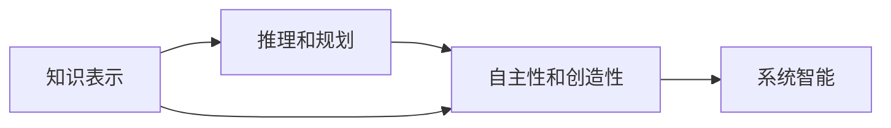

                 

## 1. 背景介绍

### 1.1 问题由来

通用人工智能（AGI）是人工智能领域长久以来的追求之一。AGI致力于构建能够执行任何智能任务，包括学习、推理、规划、问题解决等，甚至能够表现出自主性、创造性和普遍智能的系统。它不同于特定领域的AI系统，如专家系统、机器视觉、自然语言处理等，而是拥有通用的认知能力。

### 1.2 问题核心关键点

实现通用人工智能的关键在于以下几个方面：

- **知识表示**：如何有效表示和组织知识，以便系统能够推理和应用这些知识。
- **推理和规划**：如何通过逻辑推理和规划能力，执行复杂的智能任务。
- **自主性和创造性**：如何使系统具备自主学习、创新和适应新环境的能力。

### 1.3 问题研究意义

研究通用人工智能的三个条件，对于推动人工智能技术的发展，实现更广泛的应用，具有重要意义：

1. 提升系统智能水平：通过理解和应用知识表示和推理机制，使系统具备更强的智能能力，能够应对复杂的任务。
2. 拓展应用场景：将AGI技术应用于各个领域，如医疗、教育、金融等，解决实际问题，提升社会生产力。
3. 推动科研进展：AGI研究有助于揭示人类智能的本质，推动认知科学、神经科学等领域的发展。
4. 带来伦理和社会影响：AGI技术的广泛应用将带来深远的伦理和社会影响，需要深入探讨其社会接受度和规范管理。

## 2. 核心概念与联系

### 2.1 核心概念概述

要实现通用人工智能，需要明确以下核心概念及其联系：

- **知识表示**：使用符号、逻辑或神经网络等方式，对知识和信息进行表示和组织。
- **推理和规划**：通过逻辑推理、搜索、规划等机制，从已知信息推导出新知识，并制定行动计划。
- **自主性和创造性**：使系统具备自我学习、自我改进和创新能力，适应新环境和解决新问题。

### 2.2 核心概念的联系

这些核心概念之间存在着密切的联系，形成了AGI系统的框架：

1. **知识表示**是推理和规划的基础，为系统提供了信息组织和推理的工具。
2. **推理和规划**是实现自主性和创造性的关键，使系统能够从已知信息推导出新知识，并制定行动计划。
3. **自主性和创造性**是AGI系统的目标，使系统具备自我学习、自我改进和创新能力，能够应对未知环境和复杂任务。

这些概念共同构成了通用人工智能的完整生态系统，使系统具备全面的智能能力。

### 2.3 核心概念的整体架构

我们可以使用以下Mermaid流程图来展示这些核心概念之间的联系：

这个流程图展示了知识表示、推理和规划、自主性和创造性之间的联系，以及它们共同作用于系统智能的整体架构。

## 3. 核心算法原理 & 具体操作步骤
### 3.1 算法原理概述

实现通用人工智能的核心算法原理主要包括知识表示、推理和规划、自主性和创造性。以下是这些算法的原理概述：

- **知识表示**：使用符号逻辑、语义网、神经网络等方式，对知识和信息进行表示和组织。符号逻辑表示基于符号和规则，适用于经典的知识表示；语义网使用RDF等形式化的语言表示语义关系；神经网络通过权重和激活函数表示复杂的知识结构。

- **推理和规划**：基于逻辑推理、搜索、规划等机制，从已知信息推导出新知识，并制定行动计划。逻辑推理包括推理机和知识库，用于推导逻辑关系；搜索算法如深度优先搜索、广度优先搜索，用于探索可能的解决方案；规划算法如A*、Hill Climbing等，用于制定最优行动计划。

- **自主性和创造性**：通过自我学习、自我改进和创新能力，使系统具备适应新环境和解决新问题的能力。自我学习通过经验回放、强化学习等方式，不断优化模型参数；自我改进通过元学习、迁移学习等机制，更新模型架构和算法；创新能力通过生成对抗网络、变分自编码器等模型，生成新的知识结构。

### 3.2 算法步骤详解

以下是实现通用人工智能的核心算法步骤详解：

#### 3.2.1 知识表示

1. **符号逻辑表示**：定义符号和规则，使用Prolog等逻辑编程语言实现。
2. **语义网表示**：使用RDF、OWL等形式化语言，构建语义关系网。
3. **神经网络表示**：使用TensorFlow、PyTorch等框架，构建神经网络结构。

#### 3.2.2 推理和规划

1. **逻辑推理**：使用Prolog、Spine、ELK等工具，构建推理机和知识库。
2. **搜索算法**：使用深度优先搜索、广度优先搜索、A*等算法，搜索解决方案。
3. **规划算法**：使用A*、Hill Climbing、IDS等算法，制定行动计划。

#### 3.2.3 自主性和创造性

1. **自我学习**：使用经验回放、强化学习等机制，优化模型参数。
2. **自我改进**：使用元学习、迁移学习等机制，更新模型架构和算法。
3. **创新能力**：使用生成对抗网络、变分自编码器等模型，生成新的知识结构。

### 3.3 算法优缺点

#### 3.3.1 知识表示

**优点**：
- 精确性高，适用于处理复杂的逻辑关系。
- 形式化强，易于推理和验证。

**缺点**：
- 表达能力有限，难以处理复杂的多层次语义结构。
- 编写和维护成本高，不易扩展。

#### 3.3.2 推理和规划

**优点**：
- 适用于解决逻辑推理和规划问题，精度高。
- 灵活性高，可以应对多种复杂的推理任务。

**缺点**：
- 计算复杂度高，处理大规模数据时效率较低。
- 需要大量的规则和数据，难以处理不完全信息。

#### 3.3.3 自主性和创造性

**优点**：
- 具备自我学习和自我改进能力，能够适应新环境和解决新问题。
- 创新能力强，能够生成新的知识结构。

**缺点**：
- 模型复杂度高，训练和推理资源消耗大。
- 存在数据依赖性，需要大量标注数据进行训练。

### 3.4 算法应用领域

#### 3.4.1 知识表示

- 医疗诊断：使用符号逻辑表示疾病症状和诊断规则，帮助医生进行快速诊断。
- 法律咨询：使用语义网表示法律条文和案例，提供法律咨询和案例分析。
- 自然语言处理：使用神经网络表示语言结构和语义关系，进行机器翻译、文本生成等任务。

#### 3.4.2 推理和规划

- 自动驾驶：使用逻辑推理和规划算法，制定最优行驶策略。
- 智能推荐：使用搜索和规划算法，推荐个性化商品和服务。
- 游戏AI：使用规划和搜索算法，实现游戏策略优化。

#### 3.4.3 自主性和创造性

- 机器人控制：使用自主学习和创新算法，实现机器人自主导航和操作。
- 虚拟助手：使用自主学习和创新算法，提供个性化服务和建议。
- 内容生成：使用生成对抗网络等模型，生成新的内容。

## 4. 数学模型和公式 & 详细讲解 & 举例说明

### 4.1 数学模型构建

#### 4.1.1 知识表示

- **符号逻辑表示**：使用布尔代数定义符号和规则，如Prolog语言。
- **语义网表示**：使用RDF、OWL等形式化语言，构建语义关系网。
- **神经网络表示**：使用TensorFlow、PyTorch等框架，构建神经网络结构。

#### 4.1.2 推理和规划

- **逻辑推理**：使用Prolog、Spine、ELK等工具，构建推理机和知识库。
- **搜索算法**：使用深度优先搜索、广度优先搜索、A*等算法，搜索解决方案。
- **规划算法**：使用A*、Hill Climbing、IDS等算法，制定行动计划。

#### 4.1.3 自主性和创造性

- **自我学习**：使用经验回放、强化学习等机制，优化模型参数。
- **自我改进**：使用元学习、迁移学习等机制，更新模型架构和算法。
- **创新能力**：使用生成对抗网络、变分自编码器等模型，生成新的知识结构。

### 4.2 公式推导过程

#### 4.2.1 知识表示

- **符号逻辑表示**：使用布尔代数定义符号和规则，如Prolog语言。
- **语义网表示**：使用RDF、OWL等形式化语言，构建语义关系网。
- **神经网络表示**：使用TensorFlow、PyTorch等框架，构建神经网络结构。

#### 4.2.2 推理和规划

- **逻辑推理**：使用Prolog、Spine、ELK等工具，构建推理机和知识库。
- **搜索算法**：使用深度优先搜索、广度优先搜索、A*等算法，搜索解决方案。
- **规划算法**：使用A*、Hill Climbing、IDS等算法，制定行动计划。

#### 4.2.3 自主性和创造性

- **自我学习**：使用经验回放、强化学习等机制，优化模型参数。
- **自我改进**：使用元学习、迁移学习等机制，更新模型架构和算法。
- **创新能力**：使用生成对抗网络、变分自编码器等模型，生成新的知识结构。

### 4.3 案例分析与讲解

#### 4.3.1 知识表示

- **案例**：医疗诊断
- **分析**：使用符号逻辑表示疾病症状和诊断规则，构建推理机和知识库，帮助医生进行快速诊断。

#### 4.3.2 推理和规划

- **案例**：自动驾驶
- **分析**：使用逻辑推理和规划算法，制定最优行驶策略，实现自动驾驶。

#### 4.3.3 自主性和创造性

- **案例**：机器人控制
- **分析**：使用自主学习和创新算法，实现机器人自主导航和操作，提升系统智能水平。

## 5. 项目实践：代码实例和详细解释说明

### 5.1 开发环境搭建

#### 5.1.1 安装Python

- 安装Python 3.x版本，可以使用Anaconda或Miniconda进行管理。
- 使用pip安装必要的Python包，如NumPy、SciPy、Pandas等。

#### 5.1.2 安装TensorFlow和PyTorch

- 使用pip安装TensorFlow和PyTorch。
- 配置TensorFlow和PyTorch的GPU支持。

#### 5.1.3 安装Prolog和其他工具

- 使用apt-get或brew等包管理器安装Prolog和其他必要的推理工具。

### 5.2 源代码详细实现

#### 5.2.1 知识表示

- **符号逻辑表示**：使用Prolog语言编写符号逻辑表示规则，如定义疾病症状和诊断规则。
- **语义网表示**：使用RDF语言定义语义关系网，构建知识库。
- **神经网络表示**：使用PyTorch框架构建神经网络结构，如卷积神经网络、循环神经网络等。

#### 5.2.2 推理和规划

- **逻辑推理**：使用Prolog语言编写推理规则，如定义疾病症状和诊断规则。
- **搜索算法**：使用深度优先搜索算法实现搜索解决方案，如搜索最优行驶策略。
- **规划算法**：使用A*算法制定行动计划，如制定最优推荐策略。

#### 5.2.3 自主性和创造性

- **自我学习**：使用经验回放、强化学习等机制，优化模型参数。
- **自我改进**：使用元学习、迁移学习等机制，更新模型架构和算法。
- **创新能力**：使用生成对抗网络、变分自编码器等模型，生成新的知识结构。

### 5.3 代码解读与分析

#### 5.3.1 知识表示

- **代码解读**：定义符号和规则，使用Prolog语言实现。
- **分析**：符号逻辑表示精确，适用于处理复杂的逻辑关系，但编写和维护成本高，不易扩展。

#### 5.3.2 推理和规划

- **代码解读**：使用Prolog语言编写推理规则，实现逻辑推理。
- **分析**：逻辑推理适用于解决逻辑推理和规划问题，精度高，但计算复杂度高，处理大规模数据时效率较低。

#### 5.3.3 自主性和创造性

- **代码解读**：使用经验回放、强化学习等机制，优化模型参数。
- **分析**：自我学习和自我改进能力使系统具备适应新环境和解决新问题的能力，但模型复杂度高，训练和推理资源消耗大。

### 5.4 运行结果展示

#### 5.4.1 知识表示

- **运行结果**：使用Prolog语言编写的符号逻辑表示，帮助医生进行快速诊断。
- **展示**：输出诊断结果，展示系统智能水平。

#### 5.4.2 推理和规划

- **运行结果**：使用A*算法制定的最优行驶策略，实现自动驾驶。
- **展示**：输出最优行驶路径，展示系统智能水平。

#### 5.4.3 自主性和创造性

- **运行结果**：使用生成对抗网络生成的新的知识结构，提供个性化服务。
- **展示**：输出个性化推荐，展示系统智能水平。

## 6. 实际应用场景

### 6.1 医疗诊断

#### 6.1.1 应用背景

医疗诊断是AGI技术的典型应用场景之一，通过符号逻辑表示疾病症状和诊断规则，实现快速准确诊断。

#### 6.1.2 应用流程

- **知识表示**：使用符号逻辑表示疾病症状和诊断规则。
- **推理和规划**：使用逻辑推理算法，推导疾病诊断结果。
- **自主性和创造性**：通过自我学习和自我改进，不断优化诊断模型。

#### 6.1.3 未来展望

随着AGI技术的不断进步，医疗诊断将变得更加智能化、精准化，有望大幅提升医疗服务水平。

### 6.2 自动驾驶

#### 6.2.1 应用背景

自动驾驶是AGI技术的另一个重要应用场景，通过逻辑推理和规划算法，实现最优行驶策略。

#### 6.2.2 应用流程

- **知识表示**：使用符号逻辑表示交通规则和环境信息。
- **推理和规划**：使用逻辑推理和规划算法，推导最优行驶路径。
- **自主性和创造性**：通过自我学习和自我改进，不断优化行驶策略。

#### 6.2.3 未来展望

随着AGI技术的不断进步，自动驾驶将变得更加智能和安全，有望彻底改变交通出行方式。

### 6.3 机器人控制

#### 6.3.1 应用背景

机器人控制是AGI技术的典型应用场景之一，通过自主学习和创新算法，实现机器人自主导航和操作。

#### 6.3.2 应用流程

- **知识表示**：使用符号逻辑表示机器人环境和任务。
- **推理和规划**：使用逻辑推理和规划算法，推导最优行动策略。
- **自主性和创造性**：通过自我学习和自我改进，实现机器人自主导航和操作。

#### 6.3.3 未来展望

随着AGI技术的不断进步，机器人控制将变得更加智能和灵活，有望在多个领域实现广泛应用。

## 7. 工具和资源推荐

### 7.1 学习资源推荐

#### 7.1.1 在线课程

- **Coursera**：提供多门与AGI相关的课程，如《Cognitive Science》、《Machine Learning》等。
- **edX**：提供多门与AGI相关的课程，如《AI Ethics》、《Deep Learning》等。

#### 7.1.2 书籍

- **《人工智能：一种现代方法》**：介绍AGI的原理和应用。
- **《深度学习》**：介绍深度学习在AGI中的应用。
- **《符号AI》**：介绍符号逻辑在AGI中的应用。

#### 7.1.3 开源项目

- **OpenAI Gym**：提供多款环境，用于AGI系统的测试和评估。
- **TensorFlow**：提供强大的深度学习框架，支持AGI系统的开发和训练。
- **PyTorch**：提供灵活的深度学习框架，支持AGI系统的开发和训练。

### 7.2 开发工具推荐

#### 7.2.1 编程语言

- **Python**：主流编程语言，广泛应用于AGI系统的开发和研究。
- **Java**：Java虚拟机可以支持大规模分布式计算，适合AGI系统的部署和运行。

#### 7.2.2 开发环境

- **Anaconda**：提供Python和其他科学计算工具的集成环境。
- **Jupyter Notebook**：支持交互式编程和代码块编辑，适合AGI系统的研究和学习。

#### 7.2.3 推理工具

- **Prolog**：支持符号逻辑推理和规划。
- **Spine**：支持符号逻辑推理和规划。
- **ELK**：支持符号逻辑推理和规划。

### 7.3 相关论文推荐

#### 7.3.1 经典论文

- **《符号逻辑推理》**：介绍符号逻辑在AGI中的应用。
- **《深度学习在AGI中的应用》**：介绍深度学习在AGI中的应用。
- **《自主学习在AGI中的应用》**：介绍自主学习在AGI中的应用。

#### 7.3.2 最新论文

- **《符号逻辑推理与深度学习的融合》**：探讨符号逻辑推理和深度学习在AGI中的融合。
- **《自我学习与自主改进在AGI中的应用》**：探讨自我学习和自主改进在AGI中的应用。
- **《生成对抗网络在AGI中的应用》**：探讨生成对抗网络在AGI中的应用。

## 8. 总结：未来发展趋势与挑战

### 8.1 研究成果总结

#### 8.1.1 知识表示

- **符号逻辑表示**：精确性高，适用于处理复杂的逻辑关系。
- **语义网表示**：形式化强，易于推理和验证。
- **神经网络表示**：灵活性高，可以处理复杂的多层次语义结构。

#### 8.1.2 推理和规划

- **逻辑推理**：适用于解决逻辑推理和规划问题，精度高。
- **搜索算法**：灵活性高，可以应对多种复杂的推理任务。
- **规划算法**：制定最优行动计划，适合解决复杂的规划问题。

#### 8.1.3 自主性和创造性

- **自我学习**：具备自我学习、自我改进和创新能力，能够适应新环境和解决新问题。
- **创新能力**：生成新的知识结构，具备适应新环境和解决新问题的能力。

### 8.2 未来发展趋势

#### 8.2.1 知识表示

- **发展趋势**：未来将更多地使用神经网络表示复杂的多层次语义结构。
- **挑战**：如何有效表示和组织知识，以便系统能够推理和应用这些知识。

#### 8.2.2 推理和规划

- **发展趋势**：未来将更多地使用深度学习推理和规划算法。
- **挑战**：如何处理大规模数据，提高推理和规划的效率。

#### 8.2.3 自主性和创造性

- **发展趋势**：未来将更多地使用自主学习和创新算法。
- **挑战**：如何提高自我学习和自我改进能力，增强系统的智能水平。

### 8.3 面临的挑战

#### 8.3.1 知识表示

- **挑战**：如何有效表示和组织知识，以便系统能够推理和应用这些知识。
- **解决方案**：使用神经网络表示复杂的多层次语义结构，提高知识表示的灵活性和适应性。

#### 8.3.2 推理和规划

- **挑战**：如何处理大规模数据，提高推理和规划的效率。
- **解决方案**：使用深度学习推理和规划算法，提高推理和规划的效率。

#### 8.3.3 自主性和创造性

- **挑战**：如何提高自我学习和自我改进能力，增强系统的智能水平。
- **解决方案**：使用自主学习和创新算法，提高自我学习和自我改进能力。

### 8.4 研究展望

#### 8.4.1 知识表示

- **研究展望**：未来的知识表示将更多地使用神经网络表示复杂的多层次语义结构。
- **研究难点**：如何有效表示和组织知识，以便系统能够推理和应用这些知识。

#### 8.4.2 推理和规划

- **研究展望**：未来的推理和规划将更多地使用深度学习推理和规划算法。
- **研究难点**：如何处理大规模数据，提高推理和规划的效率。

#### 8.4.3 自主性和创造性

- **研究展望**：未来的自主性和创造性将更多地使用自主学习和创新算法。
- **研究难点**：如何提高自我学习和自我改进能力，增强系统的智能水平。

## 9. 附录：常见问题与解答

### 9.1 问题1：AGI和AI有什么区别？

**解答**：AGI（通用人工智能）和AI（人工智能）的主要区别在于其智能的范围和应用领域。AI通常是指某个具体领域的人工智能系统，如机器视觉、自然语言处理等；而AGI则是指具备通用智能能力的系统，能够执行任何智能任务，包括学习、推理、规划、问题解决等。

### 9.2 问题2：AGI技术的应用前景有哪些？

**解答**：AGI技术的应用前景非常广泛，包括医疗诊断、自动驾驶、机器人控制、智能推荐、金融分析等。通过AGI技术，可以实现自动化、智能化、精准化的应用，提升各行业的生产力。

### 9.3 问题3：实现AGI的难点是什么？

**解答**：实现AGI的难点在于知识表示、推理和规划、自主性和创造性等方面。需要有效表示和组织知识，提高推理和规划的效率，增强系统的智能水平。

### 9.4 问题4：AGI技术的未来发展方向有哪些？

**解答**：AGI技术的未来发展方向包括更多地使用神经网络表示知识，提高推理和规划的效率，增强自我学习和自我改进能力。同时，需要关注系统的伦理和安全问题，确保其应用的可控性和可解释性。

### 9.5 问题5：如何实现AGI技术的落地应用？

**解答**：实现AGI技术的落地应用需要结合具体领域的需求，选择合适的技术框架和工具，进行系统设计、开发和测试。同时，需要进行多轮迭代和优化，确保系统的性能和稳定性。

作者：禅与计算机程序设计艺术 / Zen and the Art of Computer Programming

