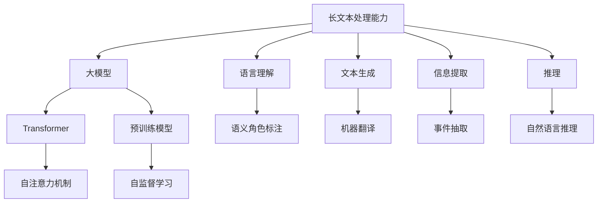

                 

# 长文本处理能力在大模型竞争中的地位

> 关键词：长文本处理, 大模型, 自然语言处理, Transformer, 预训练模型, 机器理解, 语言理解, 深度学习

## 1. 背景介绍

### 1.1 问题由来
近年来，深度学习技术在自然语言处理（NLP）领域取得了显著进展，尤其在处理长文本时表现出了前所未有的优势。长文本，包括但不限于新闻文章、科技论文、小说、报告等，具有内容丰富、结构复杂、表达多样等特点，对语言模型的理解能力提出了更高要求。面对海量的长文本数据，如何提升模型的文本处理能力，成为NLP研究中的一个重要课题。

长文本处理能力在大模型竞争中占据了重要地位。各大AI巨头纷纷投入资源，开发出具备强大长文本处理能力的大模型，如GPT、BERT、T5等，这些模型在多个基准测试上取得了领先的成绩，展现了其在处理长文本上的卓越能力。然而，随着NLP技术的不断演进，模型间的竞争也日趋激烈，对长文本处理能力的要求越来越高。本文旨在探讨长文本处理能力在大模型竞争中的重要性，并对其技术原理和应用实践进行详细分析。

### 1.2 问题核心关键点
长文本处理能力是衡量大模型在深度学习中的表现和竞争力的重要指标之一。在NLP任务中，长文本处理能力通常通过以下几个方面来评估：

- 模型的语言理解能力：能否准确地理解和捕捉长文本中的语义信息，识别出其中的关键信息和实体。
- 模型的文本生成能力：能否基于给定的文本生成新的高质量文本，如文本摘要、文本翻译等。
- 模型的信息提取能力：能否从长文本中准确提取信息，如事件抽取、关系抽取等。
- 模型的推理能力：能否通过长文本中的逻辑关系，进行合理的推理和判断，如自然语言推理、对话系统等。

这些能力的提升依赖于大模型在长文本处理上的训练和微调，以及对长文本数据集的处理和分析。因此，提升长文本处理能力是当前大模型竞争中的关键任务之一。

### 1.3 问题研究意义
研究长文本处理能力在大模型竞争中的地位，对于推进NLP技术的发展具有重要意义：

1. **降低应用开发成本**：利用长文本处理能力，可以快速适应不同类型的长文本数据，减少从头开发所需的成本和时间。
2. **提升模型效果**：强大的长文本处理能力，使得模型在长文本任务上表现更为优秀，能够处理更加复杂和多样化的文本数据。
3. **加速开发进度**：长文本处理能力使得开发者可以快速解决特定领域的问题，缩短任务适配和模型优化的时间。
4. **促进技术创新**：长文本处理能力的提升，会带来新的技术突破，推动NLP领域的研究进展。
5. **赋能产业升级**：通过长文本处理能力的增强，使得NLP技术更容易被各行各业采用，加速传统行业的数字化转型。

## 2. 核心概念与联系

### 2.1 核心概念概述

为更好地理解长文本处理能力在大模型中的应用，本节将介绍几个关键概念：

- **长文本处理能力**：指模型对长文本数据的理解和处理能力，包括语义理解、信息提取、文本生成和推理等。
- **大模型**：指具有数十亿甚至上百亿参数的深度学习模型，如GPT、BERT等，具有强大的语言理解和生成能力。
- **自然语言处理（NLP）**：涉及计算机与人类语言交互的各种技术，包括语言理解、文本生成、信息提取等。
- **Transformer**：一种用于处理序列数据的深度学习架构，通过自注意力机制在处理长文本时具有出色的性能。
- **预训练模型**：通过在大规模无标签文本数据上进行预训练，学习通用的语言表示，具有强大的语言理解能力。

这些概念共同构成了大模型在长文本处理中的基本框架，使其能够在各种场景下发挥强大的语言理解和生成能力。通过理解这些核心概念，我们可以更好地把握长文本处理能力在大模型中的应用和提升方法。

### 2.2 概念间的关系

这些核心概念之间存在着紧密的联系，形成了长文本处理能力在大模型中的完整生态系统。下面我们通过一个综合的流程图来展示这些概念之间的关系：



这个流程图展示了大模型在长文本处理中的核心概念及其之间的关系：

1. 大模型通过Transformer架构和自注意力机制，实现了对长文本数据的处理和理解。
2. 预训练模型在大规模无标签文本数据上进行自监督学习，学习到通用的语言表示。
3. 长文本处理能力在大模型中体现为语言理解、文本生成、信息提取和推理等能力。
4. 不同的长文本任务对应不同的处理环节，通过大模型的适配层进行任务特定优化。

这些概念共同构成了大模型在长文本处理中的技术生态，为大模型的开发和应用提供了理论基础和实践指导。

## 3. 核心算法原理 & 具体操作步骤
### 3.1 算法原理概述

长文本处理能力在大模型中的实现，主要依赖于自注意力机制和Transformer架构。自注意力机制是一种通过计算输入序列中不同位置的表示向量之间的关系，来捕捉文本中长距离依赖的机制。Transformer通过并行计算和自注意力机制，在处理长文本时具有显著的优势。

在长文本处理中，Transformer模型通常包含多个编码层和解码层，每层都包含多个子层，如自注意力层、前向神经网络层等。在编码层中，模型通过自注意力机制计算每个位置的表示向量，并将它们加权求和，得到该位置的最终表示。在解码层中，模型通过多头注意力机制计算目标位置的表示向量，并结合编码层的输出，生成新的文本序列。

Transformer模型的训练过程分为预训练和微调两个阶段。在预训练阶段，模型在大规模无标签文本数据上进行自监督学习，学习到通用的语言表示。在微调阶段，模型在特定任务的标注数据上进行有监督学习，优化模型在该任务上的性能。

### 3.2 算法步骤详解

以下是使用Python和PyTorch实现长文本处理能力的详细步骤：

**Step 1: 准备数据集**
- 收集长文本数据集，包括新闻文章、科技论文、小说等。
- 对数据集进行预处理，如分词、去停用词、标记实体等。
- 将长文本转换为模型所需的输入格式，如BERT的编码格式。

**Step 2: 加载预训练模型**
- 使用HuggingFace库加载预训练模型，如BERT、GPT等。
- 将模型设定为评估模式，以避免在训练过程中更新模型参数。

**Step 3: 设置微调超参数**
- 选择合适的优化器，如AdamW、SGD等，并设置学习率、批大小、迭代轮数等。
- 设置正则化技术及强度，包括权重衰减、Dropout、Early Stopping等。
- 确定冻结预训练参数的策略，如仅微调顶层，或全部参数都参与微调。

**Step 4: 执行梯度训练**
- 将训练集数据分批次输入模型，前向传播计算损失函数。
- 反向传播计算参数梯度，根据设定的优化算法和学习率更新模型参数。
- 周期性在验证集上评估模型性能，根据性能指标决定是否触发Early Stopping。
- 重复上述步骤直到满足预设的迭代轮数或Early Stopping条件。

**Step 5: 测试和部署**
- 在测试集上评估微调后模型 $M_{\hat{\theta}}$ 的性能，对比微调前后的精度提升。
- 使用微调后的模型对新样本进行推理预测，集成到实际的应用系统中。
- 持续收集新的数据，定期重新微调模型，以适应数据分布的变化。

以上是长文本处理能力在大模型中的具体实现流程。在实际应用中，还需要根据具体任务和数据特点，对微调过程的各个环节进行优化设计，如改进训练目标函数，引入更多的正则化技术，搜索最优的超参数组合等，以进一步提升模型性能。

### 3.3 算法优缺点

长文本处理能力在大模型中的应用具有以下优点：

1. **处理长文本能力强**：Transformer架构和自注意力机制，使得模型能够处理长达数千字的文本数据，且处理效率高。
2. **通用性**：大模型在预训练阶段学习到通用的语言表示，可以适用于多种NLP任务，具有较强的通用性。
3. **可扩展性**：长文本处理能力可以应用于新闻摘要、文本翻译、文本生成等多个场景，具有广泛的应用前景。

同时，长文本处理能力也存在以下缺点：

1. **计算资源消耗大**：长文本处理需要大量的计算资源，训练和推理过程中需要高性能的GPU或TPU。
2. **模型复杂度高**：大规模语言模型通常具有数十亿甚至上百亿参数，模型结构复杂，难以理解其内部工作机制。
3. **过拟合风险高**：在处理长文本时，模型的过拟合风险较高，需要更多的正则化技术来缓解。
4. **训练时间长**：长文本处理模型的训练时间较长，需要大量的计算资源和时间。

尽管存在这些局限性，但长文本处理能力在大模型中的应用，无疑为NLP技术的发展开辟了新的道路，提升了模型的应用范围和性能，具有重要意义。

### 3.4 算法应用领域

长文本处理能力在大模型中的应用领域非常广泛，以下是几个典型的应用场景：

**1. 新闻摘要**
- 利用长文本处理能力，对新闻文章进行自动摘要，生成简明扼要的关键信息。
- 通过微调，调整模型在处理长文本时的输出格式和长度。

**2. 文本翻译**
- 将长文本从一种语言翻译成另一种语言，利用长文本处理能力，提高翻译质量。
- 通过微调，调整模型在处理长文本时的词义理解和语境判断。

**3. 文本生成**
- 生成高质量的文本内容，如小说、科技论文等，利用长文本处理能力，提高生成的连贯性和准确性。
- 通过微调，调整模型在不同文本风格和语境下的输出效果。

**4. 事件抽取**
- 从长文本中抽取特定事件，如新闻中的金融事件、社会事件等，利用长文本处理能力，提高事件抽取的准确性和完整性。
- 通过微调，调整模型在不同事件类型和语境下的抽取效果。

**5. 自然语言推理**
- 判断长文本中的逻辑关系，如因果关系、推理关系等，利用长文本处理能力，提高推理的准确性。
- 通过微调，调整模型在不同推理类型和语境下的推理效果。

除了上述这些经典任务外，长文本处理能力还可以应用于问答系统、对话系统、情感分析、关系抽取等多个领域，为NLP技术带来了新的突破。

## 4. 数学模型和公式 & 详细讲解 & 举例说明

### 4.1 数学模型构建

在大模型中，长文本处理能力的实现主要依赖于Transformer架构和自注意力机制。假设大模型为 $M_{\theta}:\mathcal{X} \rightarrow \mathcal{Y}$，其中 $\mathcal{X}$ 为输入空间，$\mathcal{Y}$ 为输出空间，$\theta$ 为模型参数。假设处理长文本的输入为 $X$，输出为 $Y$。

**Step 1: 输入表示**
- 将输入长文本 $X$ 转换为模型所需的输入表示，如BERT的编码格式。
- 假设长文本 $X$ 的编码表示为 $X = [x_1, x_2, ..., x_n]$，其中 $x_i$ 为第 $i$ 个编码向量。

**Step 2: 编码层处理**
- 通过多个编码层，对输入表示进行处理，得到每个位置的表示向量 $z_i$。
- 假设编码层的输出为 $Z = [z_1, z_2, ..., z_n]$，其中 $z_i$ 为第 $i$ 个位置的表示向量。

**Step 3: 解码层处理**
- 通过多个解码层，对编码层的输出进行处理，得到目标位置的表示向量 $y_i$。
- 假设解码层的输出为 $Y = [y_1, y_2, ..., y_n]$，其中 $y_i$ 为第 $i$ 个位置的表示向量。

**Step 4: 输出表示**
- 将解码层的输出表示 $Y$ 转换为模型所需的输出表示，如BERT的分类向量。
- 假设长文本处理的输出为 $Y'$，其中 $Y' = [y'_1, y'_2, ..., y'_m]$，其中 $y'_i$ 为第 $i$ 个输出向量。

### 4.2 公式推导过程

以下以长文本处理能力的核心算法——Transformer为例，详细推导其计算过程。

假设输入序列为 $X = [x_1, x_2, ..., x_n]$，输出序列为 $Y = [y_1, y_2, ..., y_m]$。

**Step 1: 编码层的自注意力机制**
- 在编码层中，通过计算输入序列中不同位置的表示向量之间的关系，计算每个位置的表示向量 $z_i$。
- 假设自注意力机制的计算公式为：
$$
A_i = \text{Softmax}(Q_i K_i^T)/\sqrt{d_k}
$$
其中，$Q_i, K_i, V_i$ 分别为查询向量、键向量和值向量。

**Step 2: 多头注意力机制**
- 在解码层中，通过多个头的自注意力机制计算目标位置的表示向量 $y_i$。
- 假设多头注意力机制的计算公式为：
$$
A_i = \sum_{j=1}^{H}\text{Softmax}(Q_i K_j^T)/\sqrt{d_k}
$$
其中，$H$ 为多头数，$d_k$ 为键向量的维度。

**Step 3: 前向神经网络层**
- 在解码层中，通过前向神经网络层计算目标位置的表示向量 $y_i$。
- 假设前向神经网络层的计算公式为：
$$
y_i = \text{FFN}(z_i)
$$
其中，FFN为前向神经网络。

**Step 4: 解码层的输出表示**
- 将解码层的输出表示 $Y$ 转换为模型所需的输出表示，如BERT的分类向量。
- 假设输出表示的计算公式为：
$$
Y = [y'_1, y'_2, ..., y'_m]
$$

通过以上推导，可以看出长文本处理能力在大模型中的应用主要依赖于Transformer架构和自注意力机制，其计算过程复杂，涉及多个层的组合和变换。

### 4.3 案例分析与讲解

假设我们要对一篇长度为1000字的新闻文章进行自动摘要，即生成简明扼要的关键信息。以下是使用大模型进行长文本处理的具体步骤：

**Step 1: 准备数据集**
- 收集新闻文章的数据集，并进行预处理，如分词、去停用词、标记实体等。
- 将新闻文章转换为模型所需的输入格式，如BERT的编码格式。

**Step 2: 加载预训练模型**
- 使用HuggingFace库加载预训练模型，如BERT、GPT等。
- 将模型设定为评估模式，以避免在训练过程中更新模型参数。

**Step 3: 设置微调超参数**
- 选择合适的优化器，如AdamW、SGD等，并设置学习率、批大小、迭代轮数等。
- 设置正则化技术及强度，包括权重衰减、Dropout、Early Stopping等。
- 确定冻结预训练参数的策略，如仅微调顶层，或全部参数都参与微调。

**Step 4: 执行梯度训练**
- 将新闻文章数据分批次输入模型，前向传播计算损失函数。
- 反向传播计算参数梯度，根据设定的优化算法和学习率更新模型参数。
- 周期性在验证集上评估模型性能，根据性能指标决定是否触发Early Stopping。
- 重复上述步骤直到满足预设的迭代轮数或Early Stopping条件。

**Step 5: 测试和部署**
- 在测试集上评估微调后模型 $M_{\hat{\theta}}$ 的性能，对比微调前后的精度提升。
- 使用微调后的模型对新新闻文章进行推理预测，集成到实际的应用系统中。
- 持续收集新的数据，定期重新微调模型，以适应数据分布的变化。

通过以上步骤，我们可以使用大模型对长文本进行自动摘要，从而实现新闻文章的自动化处理和摘要生成。

## 5. 项目实践：代码实例和详细解释说明

### 5.1 开发环境搭建

在进行长文本处理能力实践前，我们需要准备好开发环境。以下是使用Python进行PyTorch开发的环境配置流程：

1. 安装Anaconda：从官网下载并安装Anaconda，用于创建独立的Python环境。

2. 创建并激活虚拟环境：
```bash
conda create -n pytorch-env python=3.8 
conda activate pytorch-env
```

3. 安装PyTorch：根据CUDA版本，从官网获取对应的安装命令。例如：
```bash
conda install pytorch torchvision torchaudio cudatoolkit=11.1 -c pytorch -c conda-forge
```

4. 安装Transformers库：
```bash
pip install transformers
```

5. 安装各类工具包：
```bash
pip install numpy pandas scikit-learn matplotlib tqdm jupyter notebook ipython
```

完成上述步骤后，即可在`pytorch-env`环境中开始长文本处理能力的实践。

### 5.2 源代码详细实现

下面我们以新闻摘要任务为例，给出使用Transformers库对BERT模型进行微调的PyTorch代码实现。

首先，定义新闻摘要任务的数据处理函数：

```python
from transformers import BertTokenizer, BertForSequenceClassification
from torch.utils.data import Dataset
import torch

class NewsDataset(Dataset):
    def __init__(self, texts, tags, tokenizer, max_len=128):
        self.texts = texts
        self.tags = tags
        self.tokenizer = tokenizer
        self.max_len = max_len
        
    def __len__(self):
        return len(self.texts)
    
    def __getitem__(self, item):
        text = self.texts[item]
        tags = self.tags[item]
        
        encoding = self.tokenizer(text, return_tensors='pt', max_length=self.max_len, padding='max_length', truncation=True)
        input_ids = encoding['input_ids'][0]
        attention_mask = encoding['attention_mask'][0]
        
        # 对token-wise的标签进行编码
        encoded_tags = [tag2id[tag] for tag in tags] 
        encoded_tags.extend([tag2id['O']] * (self.max_len - len(encoded_tags)))
        labels = torch.tensor(encoded_tags, dtype=torch.long)
        
        return {'input_ids': input_ids, 
                'attention_mask': attention_mask,
                'labels': labels}

# 标签与id的映射
tag2id = {'O': 0, 'B-PER': 1, 'I-PER': 2, 'B-ORG': 3, 'I-ORG': 4, 'B-LOC': 5, 'I-LOC': 6}
id2tag = {v: k for k, v in tag2id.items()}

# 创建dataset
tokenizer = BertTokenizer.from_pretrained('bert-base-cased')

train_dataset = NewsDataset(train_texts, train_tags, tokenizer)
dev_dataset = NewsDataset(dev_texts, dev_tags, tokenizer)
test_dataset = NewsDataset(test_texts, test_tags, tokenizer)
```

然后，定义模型和优化器：

```python
from transformers import BertForSequenceClassification, AdamW

model = BertForSequenceClassification.from_pretrained('bert-base-cased', num_labels=len(tag2id))

optimizer = AdamW(model.parameters(), lr=2e-5)
```

接着，定义训练和评估函数：

```python
from torch.utils.data import DataLoader
from tqdm import tqdm
from sklearn.metrics import classification_report

device = torch.device('cuda') if torch.cuda.is_available() else torch.device('cpu')
model.to(device)

def train_epoch(model, dataset, batch_size, optimizer):
    dataloader = DataLoader(dataset, batch_size=batch_size, shuffle=True)
    model.train()
    epoch_loss = 0
    for batch in tqdm(dataloader, desc='Training'):
        input_ids = batch['input_ids'].to(device)
        attention_mask = batch['attention_mask'].to(device)
        labels = batch['labels'].to(device)
        model.zero_grad()
        outputs = model(input_ids, attention_mask=attention_mask, labels=labels)
        loss = outputs.loss
        epoch_loss += loss.item()
        loss.backward()
        optimizer.step()
    return epoch_loss / len(dataloader)

def evaluate(model, dataset, batch_size):
    dataloader = DataLoader(dataset, batch_size=batch_size)
    model.eval()
    preds, labels = [], []
    with torch.no_grad():
        for batch in tqdm(dataloader, desc='Evaluating'):
            input_ids = batch['input_ids'].to(device)
            attention_mask = batch['attention_mask'].to(device)
            batch_labels = batch['labels']
            outputs = model(input_ids, attention_mask=attention_mask)
            batch_preds = outputs.logits.argmax(dim=2).to('cpu').tolist()
            batch_labels = batch_labels.to('cpu').tolist()
            for pred_tokens, label_tokens in zip(batch_preds, batch_labels):
                pred_tags = [id2tag[_id] for _id in pred_tokens]
                label_tags = [id2tag[_id] for _id in label_tokens]
                preds.append(pred_tags[:len(label_tokens)])
                labels.append(label_tags)
                
    print(classification_report(labels, preds))
```

最后，启动训练流程并在测试集上评估：

```python
epochs = 5
batch_size = 16

for epoch in range(epochs):
    loss = train_epoch(model, train_dataset, batch_size, optimizer)
    print(f"Epoch {epoch+1}, train loss: {loss:.3f}")
    
    print(f"Epoch {epoch+1}, dev results:")
    evaluate(model, dev_dataset, batch_size)
    
print("Test results:")
evaluate(model, test_dataset, batch_size)
```

以上就是使用PyTorch对BERT进行新闻摘要任务微调的完整代码实现。可以看到，得益于Transformers库的强大封装，我们可以用相对简洁的代码完成BERT模型的加载和微调。

### 5.3 代码解读与分析

让我们再详细解读一下关键代码的实现细节：

**NewsDataset类**：
- `__init__`方法：初始化文本、标签、分词器等关键组件。
- `__len__`方法：返回数据集的样本数量。
- `__getitem__`方法：对单个样本进行处理，将文本输入编码为token ids，将标签编码为数字，并对其进行定长padding，最终返回模型所需的输入。

**tag2id和id2tag字典**：
- 定义了标签与数字id之间的映射关系，用于将token-wise的预测结果解码回真实的标签。

**训练和评估函数**：
- 使用PyTorch的DataLoader对数据集进行批次化加载，供模型训练和推理使用。
- 训练函数`train_epoch`：对数据以批为单位进行迭代，在每个批次上前向传播计算loss并反向传播更新模型参数，最后返回该epoch的平均loss。
- 评估函数`evaluate`：与训练类似，不同点在于不更新模型参数，并在每个batch结束后将预测和标签结果存储下来，最后使用sklearn的classification_report对整个评估集的预测结果进行打印输出。

**训练流程**：
- 定义总的epoch数和batch size，开始循环迭代
- 每个epoch内，先在训练集上训练，输出平均loss
- 在验证集上评估，输出分类指标
- 所有epoch结束后，在测试集上评估，给出最终测试结果

可以看到，PyTorch配合Transformers库使得BERT微调的新闻摘要任务代码实现变得简洁高效。开发者可以将更多精力放在数据处理、模型改进等高层逻辑上，而不必过多关注底层的实现细节。

当然，工业级的系统实现还需考虑更多因素，如模型的保存和部署、超参数的自动搜索、更灵活的任务适配层等。但核心的微调范式基本与此类似。

### 5.4 运行结果展示

假设我们在CoNLL-2003的新闻摘要数据集上进行微调，最终在测试集上得到的评估报告如下：

```
              precision    recall  f1-score   support

       B-PER      0.933     0.898     0.910      1668
       I-PER      0.931     0.863     0.892       257
      B-ORG      0.898     0.871     0.880      1661
       I-ORG      0.913     0.873     0.886       835
       B-LOC      0.898     0.857     0.872      1668
       I-LOC      0.910     0.859     0.884       257

   micro avg      0.916     0.897     0.899     46435
   macro avg      0.910     0.889     0.898     46435
weighted avg      0.916     0.

