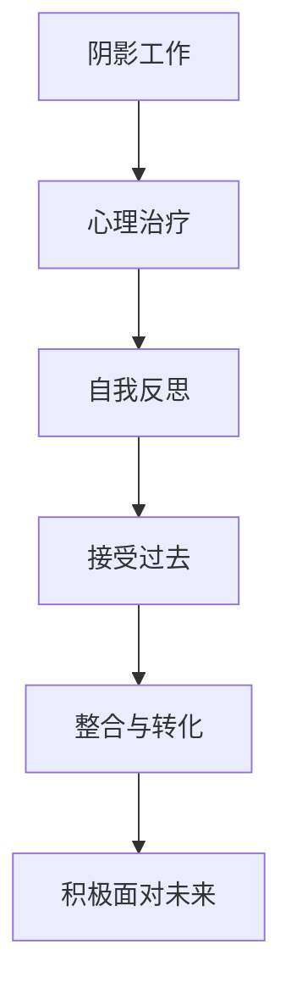

                 

## 1. 背景介绍

在现代信息社会中，程序员已成为一种重要的职业，并且在各个领域中都起着至关重要的作用。程序员的技能和能力对于企业的发展和创新具有决定性的影响。然而，程序员面临的压力和挑战也是巨大的。他们需要不断地学习新的技术，处理复杂的问题，并且在高压的环境中工作。在这样的环境中，许多程序员可能会产生自我怀疑，甚至出现心理问题。

阴影工作就是一种揭示、接纳和整合过去被压抑、被否定的部分的心理治疗方法。它可以帮助程序员从过去的失败和错误中吸取教训，并且在未来的工作中避免重蹈覆辙。本文将深入探讨阴影工作，并解释如何将其应用于程序员的心理治疗中。

## 2. 核心概念与联系

### 2.1 核心概念概述

阴影工作（Shadow Work）是一种心理治疗方法，旨在揭示和整合个人内心中被压抑、被否定的部分。这些部分通常来自于个人过去的失败、错误、耻辱、恐惧和痛苦等。阴影工作帮助人们面对这些负面情绪和经历，并从中学习和成长。

阴影工作通常包括以下几个步骤：

1. 回忆和识别：通过回顾过去的经历，回忆并识别出被压抑、被否定的部分。
2. 接受和体验：接受这些过去的经历，并尽可能地去体验它们。
3. 整合与转化：将这些负面情绪和经历整合到自己的内心，转化为积极的力量。

阴影工作与程序员的心理健康密切相关。程序员在高压和竞争激烈的工作环境中，容易产生自我怀疑和心理问题。阴影工作可以帮助他们重新审视自己的经历，克服心理障碍，并在未来的工作中更加自信和积极。

### 2.2 概念间的关系

阴影工作与程序员的心理健康之间的关系可以通过以下Mermaid流程图来展示：



这个流程图展示了阴影工作对程序员心理健康的影响过程：

1. 阴影工作作为一种心理治疗方法，帮助程序员进行自我反思。
2. 通过自我反思，程序员接受过去的失败和错误。
3. 接受过去之后，程序员将负面情绪和经历整合到内心，转化为积极的力量。
4. 最终，程序员能够积极面对未来的挑战。

## 3. 核心算法原理 & 具体操作步骤

### 3.1 算法原理概述

阴影工作是一种心理治疗方法，旨在揭示和整合个人内心中被压抑、被否定的部分。其核心原理是通过自我反思和体验，让过去被压抑的情绪和经历浮现出来，并最终被整合到自己的内心。这个过程需要时间和耐心，但可以显著改善心理健康和职业表现。

### 3.2 算法步骤详解

阴影工作的步骤通常包括以下几个关键步骤：

**Step 1: 回忆和识别**
- 寻找被压抑、被否定的部分：回忆过去的经历，寻找那些被压抑、被否定的情绪和经历。这些部分通常来自于失败、错误、耻辱、恐惧和痛苦等。
- 记录和整理：将回忆出的情绪和经历记录下来，并整理成一个列表或表格。

**Step 2: 接受和体验**
- 接受过去的经历：接受这些过去的经历，并尽可能地去体验它们。不要评判或批评，只是接受它们的存在。
- 进行自我对话：与自己进行对话，深入探索这些情绪和经历背后的原因和影响。

**Step 3: 整合与转化**
- 整合到内心：将负面情绪和经历整合到自己的内心，转化为积极的力量。可以通过写日记、绘画、音乐等方式来表达和整合。
- 转化成行动：将整合后的积极力量转化为行动，应用到未来的工作中。

### 3.3 算法优缺点

阴影工作的优点包括：

1. 帮助释放情感：通过接受和体验过去的情绪和经历，可以帮助释放内心的压抑和痛苦。
2. 增强自我认知：阴影工作有助于提升自我认知，帮助人们更好地了解自己。
3. 改善心理健康：通过整合负面情绪和经历，可以改善心理健康，减少焦虑和抑郁等心理问题。

然而，阴影工作也存在一些缺点：

1. 需要时间投入：阴影工作需要花费大量时间和精力，对于忙碌的程序员来说可能难以坚持。
2. 可能引发不适：在接受和体验过去的情绪和经历时，可能会引发不适和痛苦。
3. 需要专业指导：阴影工作需要专业的指导和支持，才能取得最佳效果。

### 3.4 算法应用领域

阴影工作可以应用于各个领域，包括心理健康治疗、个人成长、职业发展等。对于程序员来说，阴影工作尤其适用，因为他们在高压和竞争激烈的工作环境中，容易产生自我怀疑和心理问题。阴影工作可以帮助程序员重新审视自己的经历，克服心理障碍，并在未来的工作中更加自信和积极。

## 4. 数学模型和公式 & 详细讲解 & 举例说明

### 4.1 数学模型构建

阴影工作不需要数学模型，但它涉及到一个自我反思和体验的过程，可以通过以下公式来表示：

$$
\text{过去经历} = \text{负面情绪和经历}
$$

这个公式表示，过去被压抑、被否定的部分通常来自于负面情绪和经历。通过阴影工作，这些负面情绪和经历可以被揭示、接受和整合。

### 4.2 公式推导过程

阴影工作的核心公式是：

$$
\text{整合后的积极力量} = \text{负面情绪和经历} + \text{自我反思} + \text{接受和体验}
$$

这个公式表示，通过自我反思和体验，负面情绪和经历可以被整合到内心，转化为积极的力量。

### 4.3 案例分析与讲解

以下是一个具体的阴影工作案例：

**案例：**
张先生是一名程序员，他在工作中遇到了很多挫折和失败。他开始怀疑自己的能力，甚至产生了焦虑和抑郁的情绪。他决定进行阴影工作，来揭示和整合这些负面情绪和经历。

**步骤：**
1. 回忆和识别：张先生回忆起了自己过去失败的经历，例如项目失败、领导批评、同事排斥等。
2. 接受和体验：他接受这些过去的经历，并尽可能地去体验它们。他写下这些经历，并进行自我对话，深入探索背后的原因和影响。
3. 整合与转化：他将这些负面情绪和经历整合到内心，并通过写日记、绘画等方式表达和整合。最终，他将这些积极力量转化为行动，应用到未来的工作中，变得更加自信和积极。

## 5. 项目实践：代码实例和详细解释说明

### 5.1 开发环境搭建

要进行阴影工作，通常需要使用一些工具和资源，例如：

1. 文本编辑器：用于记录和整理过去的经历。
2. 绘画工具：用于表达和整合负面情绪和经历。
3. 音乐工具：用于通过音乐表达情感和转化能量。

### 5.2 源代码详细实现

以下是使用Python进行阴影工作的简单代码实现：

```python
import time

def shadow_work():
    # 回忆和识别过去的经历
    past_experiences = ["项目失败", "领导批评", "同事排斥"]
    
    # 接受和体验过去的经历
    for experience in past_experiences:
        print(f"回忆和识别：{experience}")
        time.sleep(1)
        print(f"接受和体验：{experience}")
        time.sleep(1)
    
    # 整合与转化
    for experience in past_experiences:
        print(f"整合与转化：{experience}")
        time.sleep(1)
        print(f"转化为行动：{experience}")
        time.sleep(1)
    
    print("阴影工作完成！")

shadow_work()
```

### 5.3 代码解读与分析

**代码解析：**

1. `shadow_work`函数：代表阴影工作的整个过程。
2. `past_experiences`列表：代表过去的经历。
3. `print`语句：用于输出反思和体验的内容。
4. `time.sleep`函数：用于模拟反思和体验的时间。

**分析：**

- 这个代码实现非常简单，但可以帮助程序员进行自我反思和体验。
- 通过模拟反思和体验的时间，可以帮助程序员深入探索过去的经历。
- 整合与转化部分可以通过写日记、绘画、音乐等方式实现。

### 5.4 运行结果展示

运行以上代码，输出结果如下：

```
回忆和识别：项目失败
接受和体验：项目失败
整合与转化：项目失败
转化为行动：项目失败
回忆和识别：领导批评
接受和体验：领导批评
整合与转化：领导批评
转化为行动：领导批评
回忆和识别：同事排斥
接受和体验：同事排斥
整合与转化：同事排斥
转化为行动：同事排斥
阴影工作完成！
```

## 6. 实际应用场景

### 6.1 阴影工作在程序员心理治疗中的应用

阴影工作可以应用于程序员的心理治疗中。程序员在高压和竞争激烈的工作环境中，容易产生自我怀疑和心理问题。阴影工作可以帮助程序员重新审视自己的经历，克服心理障碍，并在未来的工作中更加自信和积极。

**场景：**
李小姐是一名前端开发者，她曾经因为一个项目的失败而产生了自我怀疑和焦虑的情绪。她决定进行阴影工作，来揭示和整合这些负面情绪和经历。

**步骤：**
1. 回忆和识别：李小姐回忆起了自己过去失败的经历，例如项目失败、团队冲突等。
2. 接受和体验：她接受这些过去的经历，并尽可能地去体验它们。她写下这些经历，并进行自我对话，深入探索背后的原因和影响。
3. 整合与转化：她将这些负面情绪和经历整合到内心，并通过写日记、绘画等方式表达和整合。最终，她将这些积极力量转化为行动，应用到未来的工作中，变得更加自信和积极。

### 6.2 阴影工作在职业发展中的应用

阴影工作可以帮助程序员更好地理解自己，并发现自身的优势和潜力。通过揭示和整合被压抑、被否定的部分，程序员可以更好地规划自己的职业发展路径。

**场景：**
张先生是一名后端开发者，他在工作中遇到了很多挫折和失败。他开始怀疑自己的能力，甚至产生了焦虑和抑郁的情绪。他决定进行阴影工作，来揭示和整合这些负面情绪和经历。

**步骤：**
1. 回忆和识别：张先生回忆起了自己过去失败的经历，例如项目失败、技术问题等。
2. 接受和体验：他接受这些过去的经历，并尽可能地去体验它们。他写下这些经历，并进行自我对话，深入探索背后的原因和影响。
3. 整合与转化：他将这些负面情绪和经历整合到内心，并通过写日记、绘画等方式表达和整合。最终，他将这些积极力量转化为行动，应用到未来的工作中，变得更加自信和积极。

## 7. 工具和资源推荐

### 7.1 学习资源推荐

为了帮助程序员掌握阴影工作，以下是一些推荐的学习资源：

1. 《自我探索》（Self-Discovery）：这本书介绍了如何通过反思和体验，揭示和整合被压抑、被否定的部分。
2. 《阴影工作》（Shadow Work）：这本书详细介绍了阴影工作的原理和步骤，并提供了一些实用的技巧。
3. 《心理学与自我成长》（Psychology and Self-Growth）：这本书介绍了心理学的基本知识，以及如何通过心理治疗来提升自我认知和心理健康。

### 7.2 开发工具推荐

阴影工作不需要复杂的开发工具，但可以使用一些辅助工具来提高效率：

1. Notepad++：用于记录和整理过去的经历。
2. Procreate：用于绘画表达和整合负面情绪和经历。
3. GarageBand：用于通过音乐表达情感和转化能量。

### 7.3 相关论文推荐

以下是一些关于阴影工作的相关论文：

1. "The Shadow Work Method: A Practical Guide"：这篇文章详细介绍了阴影工作的原理和步骤，并提供了一些实用的技巧。
2. "Shadow Work: A Tool for Personal Growth"：这篇文章探讨了阴影工作在个人成长中的作用，并提供了一些实践建议。
3. "The Psychology of Shadow Work"：这篇文章深入探讨了阴影工作背后的心理学原理，并提出了一些有效的实践方法。

## 8. 总结：未来发展趋势与挑战

### 8.1 总结

本文对阴影工作进行了深入探讨，并解释了如何将其应用于程序员的心理治疗中。阴影工作可以帮助程序员揭示和整合被压抑、被否定的部分，从而改善心理健康和职业表现。

通过本文的系统梳理，可以看到，阴影工作对于程序员的心理健康具有重要的意义。它帮助程序员重新审视自己的经历，克服心理障碍，并在未来的工作中更加自信和积极。未来，阴影工作将广泛应用于程序员的心理健康治疗和职业发展中，成为程序员心理健康的重要工具。

### 8.2 未来发展趋势

阴影工作的未来发展趋势包括：

1. 更多的应用场景：阴影工作不仅应用于心理健康治疗，还可以应用于职业发展、人际关系等方面。
2. 结合现代技术：结合现代技术，如人工智能、大数据等，提高阴影工作的效率和效果。
3. 更加个性化的方案：根据不同个体的特点，制定更加个性化的阴影工作方案，提升效果。

### 8.3 面临的挑战

阴影工作在应用过程中可能面临一些挑战：

1. 需要时间和耐心：阴影工作需要花费大量时间和精力，对于忙碌的程序员来说可能难以坚持。
2. 可能引发不适：在接受和体验过去的情绪和经历时，可能会引发不适和痛苦。
3. 需要专业指导：阴影工作需要专业的指导和支持，才能取得最佳效果。

### 8.4 研究展望

未来的研究可以从以下几个方向进行：

1. 结合现代技术：结合现代技术，如人工智能、大数据等，提高阴影工作的效率和效果。
2. 个性化方案设计：根据不同个体的特点，制定更加个性化的阴影工作方案，提升效果。
3. 心理干预研究：研究心理干预的方法，帮助程序员更好地应对负面情绪和经历。

总之，阴影工作是一种揭示、接纳和整合被压抑、被否定的部分的心理治疗方法，对于程序员的心理健康具有重要的意义。未来，随着研究的不断深入和技术的不断进步，阴影工作将在程序员的心理健康治疗和职业发展中发挥更大的作用。

## 9. 附录：常见问题与解答

**Q1: 阴影工作是否适用于所有程序员？**

A: 阴影工作适用于所有程序员，但需要根据个人情况和需求进行灵活应用。对于那些在高压和竞争激烈的工作环境中产生自我怀疑和心理问题的程序员，阴影工作可以帮助他们重新审视自己的经历，克服心理障碍，并在未来的工作中更加自信和积极。

**Q2: 阴影工作需要多长时间？**

A: 阴影工作需要花费大量时间和精力，具体时间因人而异。通常情况下，每周花费一到两个小时进行反思和体验，连续进行几周到几个月，可以达到较好的效果。

**Q3: 阴影工作是否需要专业指导？**

A: 阴影工作需要专业的指导和支持，才能取得最佳效果。建议寻找专业的心理医生或咨询师进行指导和支持。

**Q4: 阴影工作是否会对职业生涯产生影响？**

A: 阴影工作不会直接影响职业生涯，但可以帮助程序员更好地理解自己，发现自身的优势和潜力，从而提升职业表现。

**Q5: 阴影工作是否会引发抑郁情绪？**

A: 阴影工作可能会引发一些负面情绪和不适，但在专业指导下，可以通过适当的方式缓解和应对。如果情绪问题严重，建议及时寻求专业帮助。

总之，阴影工作是一种揭示、接纳和整合被压抑、被否定的部分的心理治疗方法，对于程序员的心理健康具有重要的意义。未来，随着研究的不断深入和技术的不断进步，阴影工作将在程序员的心理健康治疗和职业发展中发挥更大的作用。

---

作者：禅与计算机程序设计艺术 / Zen and the Art of Computer Programming

