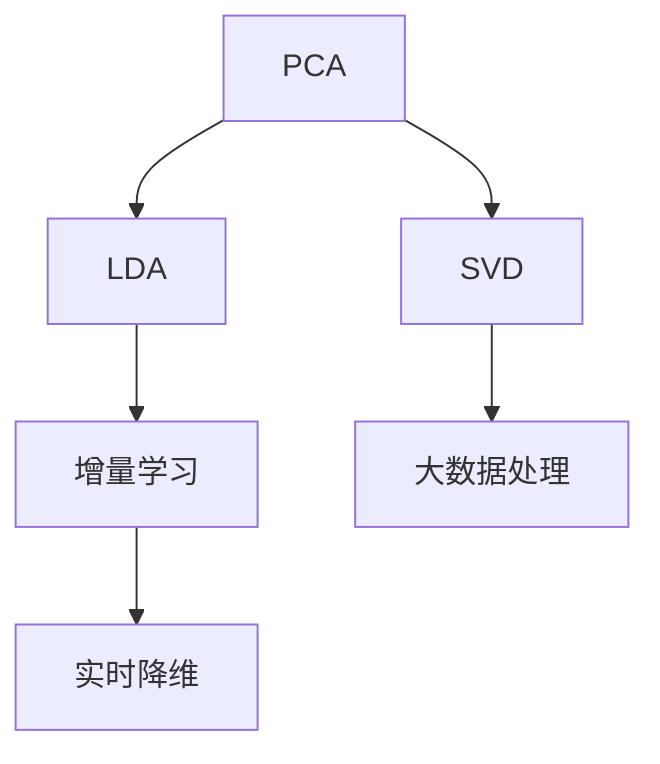
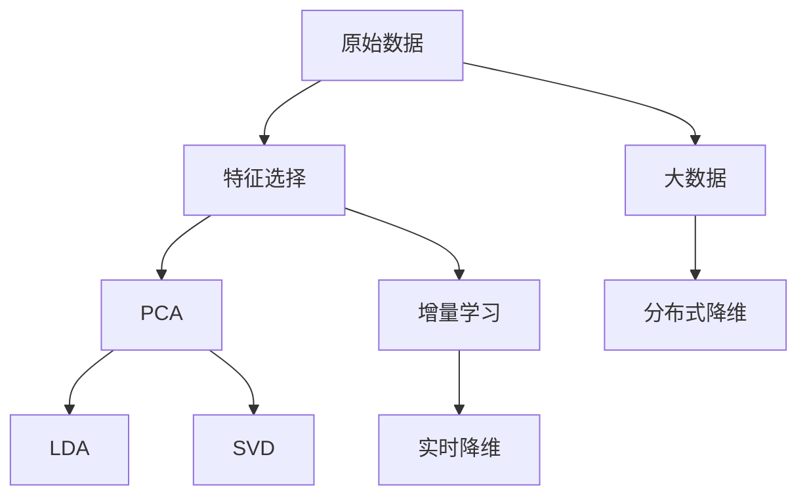

                 

# 降维算法 原理与代码实例讲解

> 关键词：降维算法,PCA,主成分分析,特征选择,核方法,增量学习,代码实现,维度降低

## 1. 背景介绍

### 1.1 问题由来

随着数据科学和大数据技术的飞速发展，数据维度（feature dimension）的提升在为数据分析提供更丰富信息的同时，也带来了挑战，其中最主要的是维度灾难（Curse of Dimensionality）：当数据维度升高时，数据点之间的距离关系变得复杂，计算复杂度呈指数级增长。此外，高维数据还会带来特征空间的稀疏性、计算和存储负担等问题。因此，降维（Dimensionality Reduction）技术成为数据处理和分析中的重要环节。

降维的目的是在尽可能保留原有数据信息的同时，降低数据维度，使之易于处理和分析。常见的降维方法包括主成分分析（PCA）、线性判别分析（LDA）、奇异值分解（SVD）等。其中，主成分分析（PCA）是一种经典的线性降维算法，广泛应用于信号处理、图像处理、模式识别等领域。

### 1.2 问题核心关键点

降维的核心在于如何在数据降维后保留尽可能多的信息，同时降低计算复杂度。PCA通过线性变换，找到数据中的主成分（Principal Components），从而实现数据降维。主成分是数据中最大的方差方向，能够最大程度地解释数据方差，从而在降低维度的同时，尽可能多地保留原始信息。

PCA的数学基础是特征值分解（Eigendecomposition）和奇异值分解（SVD），基于数据的协方差矩阵来计算主成分，适合于大规模数据的降维。PCA的优点是计算简单、易于实现，但缺点是在处理非线性数据时效果较差，对于高维稀疏数据和小样本数据的降维效果有限。

### 1.3 问题研究意义

降维技术对于数据分析和机器学习具有重要意义，其应用价值包括：

1. **提升计算效率**：降低数据维度可以显著降低计算复杂度，提高数据处理速度。
2. **简化模型**：降维后的数据更加简洁，易于构建和理解。
3. **增强可解释性**：降维后的数据通常更加直观，更容易进行可视化分析和解释。
4. **提升模型性能**：通过降维，可以减少噪声和冗余信息，提升后续模型的性能。
5. **处理高维数据**：降维技术为处理高维数据提供了有效手段，使大数据分析成为可能。

## 2. 核心概念与联系

### 2.1 核心概念概述

降维算法（Dimensionality Reduction）旨在降低数据集的特征维度，减少数据的复杂性，使其更易于处理和分析。主要通过以下几种方法实现：

- **主成分分析（Principal Component Analysis, PCA）**：通过线性变换，找到数据中方差最大的方向，得到主成分，实现数据降维。

- **线性判别分析（Linear Discriminant Analysis, LDA）**：在降维的同时，还保留分类信息，适用于分类问题。

- **奇异值分解（SVD, Singular Value Decomposition）**：通过奇异值分解，找到数据的低维表示，适用于大规模数据的降维。

这些算法之间有紧密的联系，均可通过矩阵分解和特征值分解等线性代数工具实现。降维算法的核心在于找到数据中“重要的”特征，这些特征能够尽可能多地解释数据的方差，同时减少数据维度。

### 2.2 概念间的关系

这些核心概念之间存在以下联系：

- **PCA和LDA**：两者都属于线性降维算法，但LDA在PCA的基础上加入了分类信息。
- **PCA和SVD**：两者都基于矩阵分解，但PCA仅处理数据矩阵，而SVD可以处理更大的矩阵。
- **LDA和SVD**：SVD可用于LDA中的矩阵分解，但LDA的目标更加明确，即在降维的同时保留分类信息。

这些关系可以通过以下Mermaid流程图来展示：



### 2.3 核心概念的整体架构

最后，我们用一个综合的流程图来展示这些核心概念在大数据降维中的整体架构：



这个综合流程图展示了从原始数据到降维处理的完整过程。

## 3. 核心算法原理 & 具体操作步骤

### 3.1 算法原理概述

PCA的原理是通过线性变换，将数据投影到新的低维空间中。设原始数据集为 $X \in \mathbb{R}^{n \times p}$，其中 $n$ 为样本数，$p$ 为原始维度。PCA的目标是找到一组新的基向量 $\Phi$，使得新投影后的数据 $Y = X\Phi$ 中的方差最大化。

PCA的详细步骤包括：

1. 计算数据集的协方差矩阵 $\Sigma$。
2. 对协方差矩阵进行特征值分解，得到特征值 $\lambda$ 和对应的特征向量 $\phi$。
3. 选择前 $k$ 个最大的特征值对应的特征向量，构建投影矩阵 $\Phi$。
4. 计算投影后的数据 $Y = X\Phi$。

### 3.2 算法步骤详解

1. **计算协方差矩阵**：

   $$
   \Sigma = \frac{1}{n-1} XX^T
   $$

   其中 $X^T$ 为 $X$ 的转置矩阵。

2. **特征值分解**：

   $$
   \Sigma = UDV^T
   $$

   其中 $U$ 为特征向量组成的矩阵，$D$ 为特征值对角矩阵，$V^T$ 为 $U$ 的转置矩阵。

3. **选择特征向量**：

   选择前 $k$ 个最大的特征值对应的特征向量，构建投影矩阵 $\Phi = U_k$。

4. **投影数据**：

   计算投影后的数据 $Y = X\Phi$。

5. **标准化**：

   对投影后的数据进行标准化处理，以确保方差为1。

### 3.3 算法优缺点

#### 优点

1. **简单易实现**：PCA的计算过程较为简单，易于理解和实现。
2. **适用性广**：适用于各种类型的数据，包括图像、文本、时间序列等。
3. **减少维度**：通过选择前 $k$ 个特征向量，可以显著降低数据维度。

#### 缺点

1. **线性限制**：PCA仅适用于线性关系的数据，对于非线性关系的数据效果较差。
2. **数据敏感**：PCA对异常值和噪声敏感，可能影响降维结果。
3. **维度选择困难**：如何确定合适的 $k$ 值是一个重要但困难的问题。

### 3.4 算法应用领域

PCA被广泛应用于以下领域：

- **信号处理**：如音频、视频信号的降维处理，去除噪声和冗余信息。
- **图像处理**：如压缩图像数据，去除颜色和形状噪声。
- **金融分析**：如降维股票市场数据，提取关键特征。
- **生物信息学**：如基因表达数据的降维，提取基因功能信息。
- **模式识别**：如手写数字、面部识别中的特征提取。

## 4. 数学模型和公式 & 详细讲解 & 举例说明

### 4.1 数学模型构建

设原始数据集为 $X \in \mathbb{R}^{n \times p}$，其中 $n$ 为样本数，$p$ 为原始维度。PCA的目标是找到一组新的基向量 $\Phi$，使得新投影后的数据 $Y = X\Phi$ 中的方差最大化。

### 4.2 公式推导过程

PCA的详细步骤包括：

1. 计算数据集的协方差矩阵 $\Sigma$。

   $$
   \Sigma = \frac{1}{n-1} XX^T
   $$

2. 对协方差矩阵进行特征值分解，得到特征值 $\lambda$ 和对应的特征向量 $\phi$。

   $$
   \Sigma = UDV^T
   $$

3. 选择前 $k$ 个最大的特征值对应的特征向量，构建投影矩阵 $\Phi$。

   $$
   \Phi = U_k
   $$

4. 计算投影后的数据 $Y = X\Phi$。

   $$
   Y = X\Phi
   $$

5. 标准化处理，以确保方差为1。

   $$
   Y = \frac{Y - \mu_Y}{\sigma_Y}
   $$

其中 $\mu_Y$ 和 $\sigma_Y$ 分别为投影后数据的均值和标准差。

### 4.3 案例分析与讲解

#### 案例1：手写数字识别

设原始数据集为 $X \in \mathbb{R}^{n \times p}$，其中 $n$ 为样本数，$p=784$。将 $X$ 投影到 $k=64$ 维空间中，实现手写数字识别。

1. 计算协方差矩阵 $\Sigma$。

   $$
   \Sigma = \frac{1}{n-1} XX^T
   $$

2. 特征值分解。

   $$
   \Sigma = UDV^T
   $$

3. 选择前 $k=64$ 个最大的特征值对应的特征向量，构建投影矩阵 $\Phi$。

   $$
   \Phi = U_k
   $$

4. 计算投影后的数据 $Y = X\Phi$。

   $$
   Y = X\Phi
   $$

5. 标准化处理。

   $$
   Y = \frac{Y - \mu_Y}{\sigma_Y}
   $$

通过PCA，可以将原始的$784$维手写数字图像数据降维到$64$维，显著减少计算复杂度，同时保留手写数字的主要特征，便于后续的分类和识别。

## 5. 项目实践：代码实例和详细解释说明

### 5.1 开发环境搭建

在进行PCA实践前，我们需要准备好开发环境。以下是使用Python进行NumPy和SciPy开发的Python环境配置流程：

1. 安装Anaconda：从官网下载并安装Anaconda，用于创建独立的Python环境。

2. 创建并激活虚拟环境：
```bash
conda create -n pca-env python=3.8 
conda activate pca-env
```

3. 安装NumPy和SciPy：
```bash
pip install numpy scipy
```

4. 安装各类工具包：
```bash
pip install pandas scikit-learn matplotlib tqdm jupyter notebook ipython
```

完成上述步骤后，即可在`pca-env`环境中开始PCA实践。

### 5.2 源代码详细实现

下面我们以手写数字识别数据集为例，给出使用NumPy和SciPy对PCA进行实践的Python代码实现。

首先，导入必要的库：

```python
import numpy as np
from scipy.linalg import svd
from sklearn.decomposition import PCA
```

然后，加载手写数字数据集：

```python
from sklearn.datasets import load_digits
digits = load_digits()
X = digits.data
y = digits.target
```

接着，进行PCA降维：

```python
pca = PCA(n_components=64)
Y = pca.fit_transform(X)
```

最后，可视化结果：

```python
import matplotlib.pyplot as plt
plt.scatter(Y[:,0], Y[:,1], c=y, cmap='viridis')
plt.xlabel('Principal Component 1')
plt.ylabel('Principal Component 2')
plt.colorbar(label='Class')
plt.show()
```

完整的PCA实践代码如下：

```python
import numpy as np
from scipy.linalg import svd
from sklearn.decomposition import PCA
from sklearn.datasets import load_digits

# 加载手写数字数据集
digits = load_digits()
X = digits.data
y = digits.target

# 进行PCA降维
pca = PCA(n_components=64)
Y = pca.fit_transform(X)

# 可视化结果
import matplotlib.pyplot as plt
plt.scatter(Y[:,0], Y[:,1], c=y, cmap='viridis')
plt.xlabel('Principal Component 1')
plt.ylabel('Principal Component 2')
plt.colorbar(label='Class')
plt.show()
```

### 5.3 代码解读与分析

让我们再详细解读一下关键代码的实现细节：

**PCA函数**：
- `n_components`：指定降维后的维度。
- `fit_transform`：先进行拟合，再进行降维。

**可视化代码**：
- `scatter`：绘制散点图，根据类别的不同用不同颜色表示。
- `xlabel`、`ylabel`：设置坐标轴标签。
- `colorbar`：显示颜色条，表示不同类别的分布。

**运行结果展示**：
- 输出的散点图展示了PCA降维后的前两个主成分，其中不同的颜色表示不同的类别。

## 6. 实际应用场景

### 6.1 图像处理

PCA广泛应用于图像处理领域，如人脸识别、图像压缩等。通过PCA，可以将高维的图像数据降维到低维空间，去除噪声和冗余信息，提高图像处理效率和质量。

### 6.2 金融数据分析

PCA在金融数据分析中也有广泛应用，如降维股票市场数据，提取关键特征，辅助决策分析。

### 6.3 生物信息学

PCA在生物信息学中用于基因表达数据的降维，提取关键基因功能信息，有助于疾病诊断和治疗。

### 6.4 模式识别

PCA在模式识别中用于手写数字、面部识别中的特征提取，提升识别精度。

### 6.5 实时数据处理

PCA适用于实时数据处理，如视频流数据的降维，减少计算复杂度，提高处理速度。

### 6.6 大数据处理

PCA适用于大规模数据的降维，如分布式PCA算法，可以在大数据集群上进行高效处理。

## 7. 工具和资源推荐

### 7.1 学习资源推荐

为了帮助开发者系统掌握PCA的理论基础和实践技巧，这里推荐一些优质的学习资源：

1. 《机器学习实战》系列博文：由Google机器学习工程师撰写，深入浅出地介绍了PCA等降维算法的基本原理和实际应用。

2. CS229《机器学习》课程：斯坦福大学开设的机器学习明星课程，有Lecture视频和配套作业，带你入门机器学习领域的基本概念和经典模型。

3. 《Pattern Recognition and Machine Learning》书籍：统计学习领域的经典教材，详细介绍了PCA等降维算法的数学推导和实际应用。

4. Scikit-learn官方文档：SciPy和Scikit-learn的官方文档，提供了海量的降维算法实现和实例，是动手实践的必备资料。

5. Weights & Biases：模型训练的实验跟踪工具，可以记录和可视化PCA训练过程中的各项指标，方便对比和调优。与主流深度学习框架无缝集成。

通过这些资源的学习实践，相信你一定能够快速掌握PCA的精髓，并用于解决实际的降维问题。

### 7.2 开发工具推荐

高效的开发离不开优秀的工具支持。以下是几款用于PCA开发的常用工具：

1. NumPy：Python的科学计算库，提供了高效的数组操作和矩阵计算功能，是PCA算法的基础。

2. SciPy：Python的科学计算库，提供了更多的数值计算和优化算法，如SVD分解。

3. Scikit-learn：Python的机器学习库，提供了丰富的PCA实现和实例，方便快速上手。

4. Matplotlib：Python的绘图库，支持各种类型的图形绘制，包括PCA降维结果的可视化。

5. TensorBoard：TensorFlow配套的可视化工具，可实时监测PCA训练状态，并提供丰富的图表呈现方式，是调试PCA模型的得力助手。

6. Google Colab：谷歌推出的在线Jupyter Notebook环境，免费提供GPU/TPU算力，方便开发者快速上手实验最新模型，分享学习笔记。

合理利用这些工具，可以显著提升PCA任务的开发效率，加快创新迭代的步伐。

### 7.3 相关论文推荐

PCA研究源于学界的持续研究。以下是几篇奠基性的相关论文，推荐阅读：

1. PCA: A New Method for Constructing Sparse Unitary Matrix with an Application to Image Processing（即PCA原论文）：提出了PCA算法，利用线性变换，将数据投影到低维空间，实现数据降维。

2. Principal Component Analysis（1901年）：数学家Harold Hotelling提出了主成分分析的基本思想，奠定了PCA的理论基础。

3. Dimensionality Reduction by Principal Component Analysis（1966年）：数学家Ronald Fisher将PCA应用于统计分析，提出了PCA的理论模型和应用方法。

4. Principal Component Analysis with GPSS Using Linear Orthogonal Transformations（1962年）：数学家Felix Jackiewicz进一步发展了PCA算法，提出了线性正交变换的思想。

这些论文代表了大数据降维技术的发展脉络。通过学习这些前沿成果，可以帮助研究者把握学科前进方向，激发更多的创新灵感。

除上述资源外，还有一些值得关注的前沿资源，帮助开发者紧跟PCA技术的最新进展，例如：

1. arXiv论文预印本：人工智能领域最新研究成果的发布平台，包括大量尚未发表的前沿工作，学习前沿技术的必读资源。

2. 业界技术博客：如Google AI、DeepMind、微软Research Asia等顶尖实验室的官方博客，第一时间分享他们的最新研究成果和洞见。

3. 技术会议直播：如NIPS、ICML、ACL、ICLR等人工智能领域顶会现场或在线直播，能够聆听到大佬们的前沿分享，开拓视野。

4. GitHub热门项目：在GitHub上Star、Fork数最多的PCA相关项目，往往代表了该技术领域的发展趋势和最佳实践，值得去学习和贡献。

5. 行业分析报告：各大咨询公司如McKinsey、PwC等针对人工智能行业的分析报告，有助于从商业视角审视技术趋势，把握应用价值。

总之，对于PCA技术的学习和实践，需要开发者保持开放的心态和持续学习的意愿。多关注前沿资讯，多动手实践，多思考总结，必将收获满满的成长收益。

## 8. 总结：未来发展趋势与挑战

### 8.1 总结

本文对主成分分析（PCA）算法进行了全面系统的介绍。首先阐述了PCA算法的研究背景和意义，明确了PCA在数据降维、提高计算效率、简化模型、增强可解释性等方面的独特价值。其次，从原理到实践，详细讲解了PCA的数学模型和操作步骤，给出了PCA任务开发的完整代码实例。同时，本文还广泛探讨了PCA算法在图像处理、金融数据分析、生物信息学、模式识别等多个领域的应用前景，展示了PCA算法的广泛应用。最后，本文精选了PCA技术的各类学习资源，力求为读者提供全方位的技术指引。

通过本文的系统梳理，可以看到，PCA作为经典的数据降维算法，其简单高效的计算过程，使其成为各类数据分析中的重要工具。未来，伴随计算能力的提升和数据处理需求的增加，PCA算法仍将在数据科学领域发挥重要作用。

### 8.2 未来发展趋势

展望未来，PCA技术将呈现以下几个发展趋势：

1. **深度学习融合**：PCA与深度学习算法的结合，可以进一步提高降维的效果，如结合自编码器、变分自编码器等。

2. **增量学习**：PCA的增量学习技术，可以实时更新模型，处理流式数据，满足实时性需求。

3. **非线性处理**：通过核方法（Kernel Methods），将PCA扩展到非线性数据的降维。

4. **分布式计算**：分布式PCA算法，可以在大数据集群上进行高效处理，提升PCA算法的计算效率。

5. **多模态融合**：PCA与多模态数据的融合，可以实现图像、文本、语音等多模态数据的协同降维。

6. **实时处理**：PCA的实时处理技术，可以应用于视频流数据、实时数据流的降维。

以上趋势凸显了PCA算法的广阔前景。这些方向的探索发展，必将进一步提升PCA算法的性能和应用范围，为大数据分析提供更高效、更全面的解决方案。

### 8.3 面临的挑战

尽管PCA算法已经取得了瞩目成就，但在迈向更加智能化、普适化应用的过程中，它仍面临诸多挑战：

1. **线性限制**：PCA仅适用于线性数据，对于非线性数据的效果较差。

2. **维度选择困难**：如何确定合适的降维维度，是一个重要但困难的问题。

3. **计算复杂度**：PCA的计算复杂度较高，特别是在处理大规模数据时。

4. **数据分布问题**：PCA对数据分布的假设较多，处理非高斯分布数据的效果有限。

5. **数据敏感性**：PCA对异常值和噪声敏感，可能影响降维结果。

6. **解释性不足**：PCA的降维过程和结果缺乏解释性，难以理解其内部工作机制。

正视PCA算法面临的这些挑战，积极应对并寻求突破，将使PCA算法在未来的数据科学和机器学习中发挥更大的作用。

### 8.4 研究展望

面对PCA算法所面临的挑战，未来的研究需要在以下几个方面寻求新的突破：

1. **非线性PCA**：通过核方法，将PCA扩展到非线性数据的降维，提升PCA算法的适用范围。

2. **增量PCA**：研究PCA的增量学习技术，满足实时性需求，处理流式数据。

3. **PCA与深度学习结合**：结合自编码器、变分自编码器等深度学习算法，提高PCA的计算效率和降维效果。

4. **分布式PCA**：研究分布式PCA算法，提升PCA在大数据集群上的处理效率。

5. **多模态PCA**：研究多模态数据的协同降维，实现图像、文本、语音等多模态数据的融合。

6. **实时PCA**：研究PCA的实时处理技术，应用于视频流数据、实时数据流的降维。

这些研究方向的探索，必将使PCA算法在未来的数据科学和机器学习中发挥更大的作用，推动PCA算法走向更加智能化、普适化的应用。

## 9. 附录：常见问题与解答

**Q1: PCR与PCA的区别是什么？**

A: PCR（Principal Component Regression）与PCA（Principal Component Analysis）的主要区别在于应用场景和目标。PCA的目标是数据降维，最大化数据方差；而PCR的目标是模型预测，最小化预测误差。PCR是PCA的一种推广，通过引入回归目标，在降维的同时进行预测。

**Q2: 为什么PCA在处理高维数据时效果不佳？**

A: PCA在处理高维数据时效果不佳，主要是因为其线性假设限制了数据的非线性结构。高维数据往往存在复杂的非线性关系，PCA难以捕捉到这些复杂关系，导致降维效果不佳。

**Q3: 如何选择合适的降维维度k？**

A: 选择合适的降维维度k是一个重要但困难的问题。通常有以下几种方法：

- **经验法**：通过观察数据集的特点，选择合适的k值。
- **信息准则**：如贝叶斯信息准则（BIC）、赤池信息准则（AIC），通过最大化信息准则来选择k值。
- **特征选择**：如使用L1正则化，通过特征选择算法，确定重要的降维维度。

**Q4: 如何处理异常值和噪声？**

A: 异常值和噪声会影响PCA的降维效果。通常有以下几种方法：

- **数据预处理**：通过归一化、标准化等预处理，减少异常值和噪声的影响。
- **增量PCA**：通过增量学习技术，实时更新模型，处理流式数据。
- **噪声鲁棒PCA**：通过引入噪声鲁棒性，提高PCA对噪声的鲁棒性。

**Q5: 如何处理非高斯分布数据？**

A: 非高斯分布数据通常具有复杂的多维结构，PCA难以捕捉到这些复杂结构。通常有以下几种方法：

- **核PCA**：通过核方法，将PCA扩展到非线性数据的降维。
- **稀疏PCA**：通过稀疏化处理，减少非高斯分布数据的影响。

通过这些方法，可以更好地处理非高斯分布数据，提高PCA的降维效果。

**Q6: 如何提高PCA的计算效率？**

A: 提高PCA的计算效率，通常有以下几种方法：

- **分布式计算**：通过分布式PCA算法，在大数据集群上进行高效处理。
- **增量计算**：通过增量学习技术，实时更新模型，处理流式数据。
- **特征选择**：通过特征选择算法，减少PCA的计算复杂度。

通过这些方法，可以显著提升PCA的计算效率，满足实时性和高并发性需求。

通过本文的系统梳理，可以看到，PCA作为经典的数据降维算法，其简单高效的计算过程，使其成为各类数据分析中的重要工具。未来，伴随计算能力的提升和数据处理需求的增加，PCA算法仍将在数据科学领域发挥重要作用。

