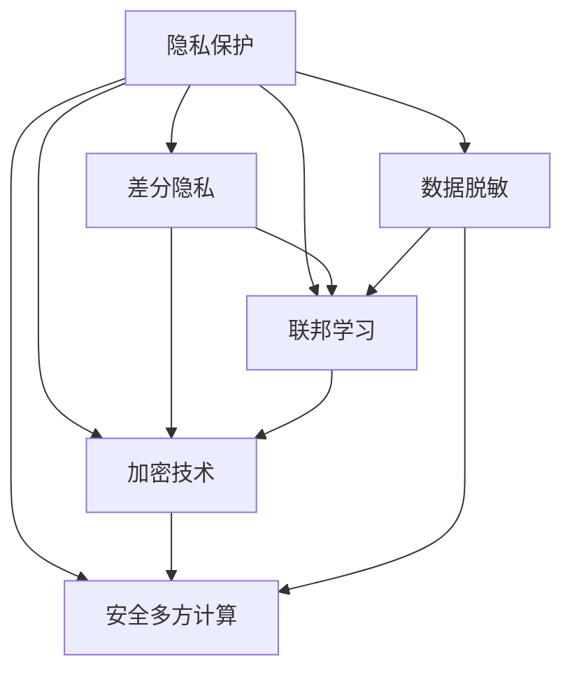
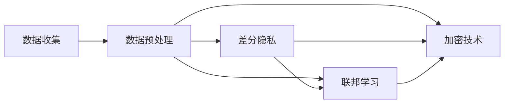
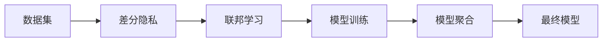
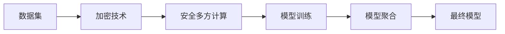
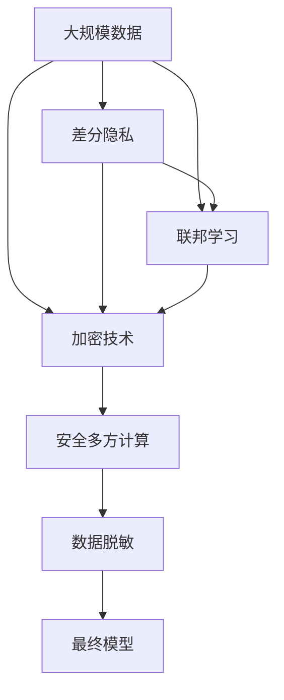

                 

# 隐私保护：保护 AI 2.0 用户隐私，防止数据被滥用

> 关键词：隐私保护, AI 2.0, 数据安全, 数据滥用, 差分隐私, 联邦学习, 加密技术

## 1. 背景介绍

### 1.1 问题由来
随着人工智能技术的飞速发展，特别是在医疗、金融、社交等重要领域的广泛应用，数据隐私和数据安全问题也日益凸显。大数据时代，数据被视为“新石油”，隐私泄露、数据滥用等事件屡屡发生，给个人和社会带来严重威胁。

**案例1**：医疗AI系统通过扫描病历，提取患者敏感信息，用于个性化治疗，但在数据传输和存储过程中，存在隐私泄露风险。

**案例2**：金融机构利用用户交易记录进行精准营销，但数据滥用可能导致财务损失和信任危机。

**案例3**：社交平台通过分析用户行为，推荐个性化内容，但数据滥用可能带来隐私侵犯和心理压力。

面对这些挑战，如何保护AI 2.0（即人工智能技术的2.0时代，指AI技术大规模应用于各行各业，涵盖广泛应用场景的阶段）用户的隐私，防止数据被滥用，成为了数据科学与AI领域的重要课题。

### 1.2 问题核心关键点
保护隐私的核心在于两个方面：数据保护和数据利用。数据保护涉及如何安全传输、存储数据；数据利用涉及如何在不泄露隐私的前提下，获取数据价值。目前主流的隐私保护方法包括差分隐私、联邦学习、加密技术等，各自有着不同的优缺点和适用场景。

差分隐私通过加入随机噪声，使得个体数据无法被识别，从而保护隐私。联邦学习则通过模型分布式训练，使得数据在本地处理，不在中央服务器集结。加密技术则通过加密算法，保障数据在传输和存储过程中的安全。

这些方法各有千秋，但共同目标是保护用户隐私，防止数据被滥用。本文将详细介绍差分隐私和联邦学习两种核心隐私保护技术，并结合具体案例分析其应用场景和优缺点。

### 1.3 问题研究意义
保护用户隐私，防止数据滥用，对于AI 2.0技术落地应用具有重要意义：

1. 提升用户信任度：通过隐私保护技术，增强用户对AI技术的信任，促进AI技术的广泛应用。
2. 保障数据安全：防止数据被恶意获取和滥用，保障个人隐私和社会安全。
3. 推动合规发展：满足法律法规和行业规范的要求，促进AI技术的健康发展。
4. 激发数据价值：在保护隐私的前提下，挖掘数据的潜在价值，推动AI技术的创新应用。

本文旨在深入探讨隐私保护技术的原理与实践，为AI 2.0技术落地应用提供全面的隐私保护方案。

## 2. 核心概念与联系

### 2.1 核心概念概述

为更好地理解隐私保护技术，本节将介绍几个密切相关的核心概念：

- 隐私保护(P Privacy Protection)：保护用户个人信息，防止数据被滥用。
- 差分隐私(Differential Privacy)：通过加入随机噪声，保障个体数据无法被识别，从而保护隐私。
- 联邦学习(Federated Learning)：通过分布式模型训练，使得数据在本地处理，不在中央服务器集结，从而保护数据隐私。
- 加密技术(Encryption)：通过加密算法，保障数据在传输和存储过程中的安全。
- 安全多方计算(Secure Multi-Party Computation, MPC)：在多方参与的情况下，计算结果对各方公开，但参与方无法得知其他方的输入，保护隐私。
- 数据脱敏(Data Masking)：对数据进行模糊化处理，减少隐私泄露风险。

这些概念之间的逻辑关系可以通过以下Mermaid流程图来展示：



这个流程图展示了大语言模型微调过程中各个核心概念的关系和作用：

1. 隐私保护是大语言模型的整体目标。
2. 差分隐私、联邦学习和加密技术是实现隐私保护的主要手段。
3. 安全多方计算和数据脱敏是保障隐私的具体措施。
4. 这些技术相互配合，共同构成大语言模型的隐私保护体系。

### 2.2 概念间的关系

这些核心概念之间存在着紧密的联系，形成了隐私保护的完整生态系统。下面我们通过几个Mermaid流程图来展示这些概念之间的关系。

#### 2.2.1 隐私保护的整体架构



这个流程图展示了隐私保护的整体流程：数据收集后，经过差分隐私、联邦学习和加密技术处理，得到隐私保护的最终数据。

#### 2.2.2 差分隐私与联邦学习的结合



这个流程图展示了差分隐私和联邦学习的结合应用：数据集经过差分隐私处理后，在本地进行联邦学习，得到多方的模型参数。模型参数在本地聚合后，成为最终隐私保护的模型。

#### 2.2.3 加密技术与安全多方计算的结合



这个流程图展示了加密技术与安全多方计算的结合应用：数据集经过加密处理后，参与多方安全计算，得到多方的模型参数。模型参数在本地聚合后，成为最终隐私保护的模型。

### 2.3 核心概念的整体架构

最后，我们用一个综合的流程图来展示这些核心概念在大语言模型隐私保护中的整体架构：



这个综合流程图展示了从数据预处理到最终模型构建的完整过程。数据经过差分隐私、联邦学习、加密技术、安全多方计算和数据脱敏等多层隐私保护处理后，得到最终的隐私保护模型。

## 3. 核心算法原理 & 具体操作步骤
### 3.1 算法原理概述

差分隐私和联邦学习是大语言模型隐私保护的两大核心技术。本节将详细介绍这两种技术的原理与操作流程。

### 3.2 算法步骤详解

**差分隐私**：

1. 数据预处理：对原始数据进行标准化、归一化等预处理操作。
2. 随机噪声加入：根据隐私预算参数 $\epsilon$，计算每条记录的噪声量 $d_i$。将噪声量 $d_i$ 加到原始数据上，生成差分隐私数据集。
3. 模型训练：在差分隐私数据集上，使用机器学习算法进行模型训练。
4. 隐私预算计算：在每次模型训练迭代中，计算当前模型对隐私预算的消耗，并根据消耗情况调整噪声量。

**联邦学习**：

1. 数据本地化：各参与方（如医院、银行、电商平台等）在自己的本地设备上存储数据。
2. 模型初始化：中央服务器发送初始化参数和模型结构给各参与方。
3. 本地训练：各参与方在自己的数据上，使用模型结构进行本地模型训练。
4. 参数更新：各参与方将训练结果的梯度更新发送给中央服务器，中央服务器根据梯度更新模型参数。
5. 模型聚合：中央服务器将更新后的模型参数进行聚合，得到最终隐私保护模型。

### 3.3 算法优缺点

**差分隐私**：

优点：
- 保障个体隐私，即使在攻击者知道部分数据的情况下，也无法识别具体个体。
- 可以通过调整噪声量控制隐私保护程度，灵活性较高。

缺点：
- 隐私预算 $\epsilon$ 越小，噪声量越大，模型性能受影响。
- 需要预先定义隐私预算，不易处理动态数据。

**联邦学习**：

优点：
- 数据在本地处理，无需集中存储，隐私保护效果显著。
- 各参与方无需共享数据，数据泄露风险较低。

缺点：
- 模型更新和聚合过程中，通信开销较大，计算复杂度较高。
- 需要各参与方共同协作，协调难度较大。

### 3.4 算法应用领域

差分隐私和联邦学习在大数据、AI、物联网等多个领域均有广泛应用，以下是几个典型应用场景：

1. 医疗数据保护：使用差分隐私保护病历数据，防止数据泄露，保障患者隐私。
2. 金融数据保护：使用联邦学习保护用户交易记录，防止数据滥用，保障金融安全。
3. 智能家居安全：使用差分隐私保护用户行为数据，防止数据滥用，保障用户隐私。
4. 网络安全监测：使用联邦学习保护网络流量数据，防止数据泄露，保障网络安全。
5. 社交平台隐私保护：使用差分隐私保护用户行为数据，防止数据滥用，保障用户隐私。

以上场景展示了差分隐私和联邦学习在不同领域的应用效果，体现了其重要的隐私保护价值。

## 4. 数学模型和公式 & 详细讲解  
### 4.1 数学模型构建

本节将使用数学语言对差分隐私和联邦学习进行更加严格的刻画。

**差分隐私**：

设原始数据集为 $\mathcal{D}$，隐私预算参数为 $\epsilon$。假设数据集中共有 $n$ 条记录，每条记录的噪声量为 $d_i$，其中 $d_i \sim \mathcal{N}(0,\sigma^2)$。差分隐私模型记为 $\mathcal{P}_{\epsilon}(\mathcal{D})$。

**联邦学习**：

设参与方数为 $m$，每个参与方本地的数据集为 $\mathcal{D}_i$。初始化模型参数为 $\theta_0$，本地模型参数为 $\theta_i$，全局模型参数为 $\theta_g$。联邦学习模型记为 $\mathcal{M}_{\theta_0}$。

### 4.2 公式推导过程

**差分隐私**：

$$
\mathcal{P}_{\epsilon}(\mathcal{D}) = \{T: \forall x_i \in \mathcal{D}, \forall S \subseteq \mathcal{D}, Pr[T(S) \cap (x_i \in S)] \leq e^{\epsilon} Pr[T(S)]
$$

其中，$T$ 为差分隐私数据集，$S$ 为子集。$Pr$ 为概率。

**联邦学习**：

假设参与方 $i$ 的本地数据集为 $\mathcal{D}_i$，本地模型参数为 $\theta_i$，全局模型参数为 $\theta_g$。联邦学习过程如下：

1. 初始化：$\theta_0 = \theta_g$
2. 本地训练：$\theta_i \leftarrow \theta_0 - \eta_i \nabla_{\theta} L(\theta_0,\mathcal{D}_i)$
3. 参数更新：$\theta_g \leftarrow \theta_g - \frac{1}{m}\sum_{i=1}^m \nabla_{\theta} L(\theta_g,\mathcal{D}_i)$
4. 最终模型：$\hat{\theta} = \theta_g$

其中，$L$ 为损失函数，$\eta_i$ 为学习率。

### 4.3 案例分析与讲解

**案例分析**：

假设医院采集了 $10,000$ 个患者的病历数据，包含 $30$ 个属性，每个属性包含 $1$ 维数值。医院希望在保护患者隐私的前提下，训练一个医疗诊断模型。

**数据预处理**：
1. 数据标准化：将每个属性值归一化到 $[0,1]$ 区间。
2. 数据分割：将病历数据分为训练集和测试集。

**差分隐私**：
1. 定义隐私预算 $\epsilon = 0.1$。
2. 计算每条记录的噪声量 $d_i \sim \mathcal{N}(0,\sigma^2)$。
3. 在训练集上加入噪声，得到差分隐私数据集。
4. 在差分隐私数据集上训练医疗诊断模型。
5. 根据隐私预算消耗情况，调整噪声量。

**联邦学习**：
1. 将病历数据本地化，每个医院存储本地数据集 $\mathcal{D}_i$。
2. 初始化模型参数 $\theta_0$。
3. 在本地数据集上，使用模型参数 $\theta_0$ 进行本地训练，得到本地模型参数 $\theta_i$。
4. 将本地模型参数的梯度更新发送到中央服务器，中央服务器根据梯度更新全局模型参数 $\theta_g$。
5. 模型聚合后，得到最终隐私保护的模型。

通过这些步骤，医院可以保护患者隐私，同时训练出高效的医疗诊断模型。

## 5. 项目实践：代码实例和详细解释说明
### 5.1 开发环境搭建

在进行隐私保护技术实践前，我们需要准备好开发环境。以下是使用Python进行TensorFlow开发的开发环境配置流程：

1. 安装Anaconda：从官网下载并安装Anaconda，用于创建独立的Python环境。

2. 创建并激活虚拟环境：
```bash
conda create -n tf-env python=3.8 
conda activate tf-env
```

3. 安装TensorFlow：根据CUDA版本，从官网获取对应的安装命令。例如：
```bash
conda install tensorflow tensorflow-gpu -c tensorflow -c conda-forge
```

4. 安装Flax：Flax是一个高性能的TensorFlow的深度学习库，适合微调和分布式训练。
```bash
pip install flax
```

5. 安装Federated-Average：一个用于联邦学习的库，可以方便地进行联邦学习实验。
```bash
pip install federated-average
```

6. 安装TensorBoard：用于可视化模型训练过程和结果。
```bash
pip install tensorboard
```

完成上述步骤后，即可在`tf-env`环境中开始隐私保护技术实践。

### 5.2 源代码详细实现

下面以差分隐私技术为例，给出使用TensorFlow进行差分隐私保护的PyTorch代码实现。

```python
import numpy as np
import tensorflow as tf

def laplace_mechanism(d, epsilon):
    scale = 1 / epsilon
    if d == 0:
        return 0
    return np.random.laplace(0, scale)

def dp_sampling(x, epsilon, delta):
    return tf.map_fn(lambda x: tf.map_fn(lambda xi: laplace_mechanism(xi, epsilon), x, dtype=tf.float32), x, dtype=tf.float32)

def dp_model_train(data, epsilon, delta, batch_size, num_epochs, learning_rate):
    def train_step(x):
        with tf.GradientTape() as tape:
            logits = model(x)
            loss = tf.keras.losses.categorical_crossentropy(target, logits)
        grads = tape.gradient(loss, model.trainable_variables)
        optimizer.apply_gradients(zip(grads, model.trainable_variables))
    model.compile(optimizer=tf.keras.optimizers.SGD(learning_rate), loss=tf.keras.losses.categorical_crossentropy)
    for epoch in range(num_epochs):
        for i in range(0, len(data), batch_size):
            x_train = data[i:i+batch_size]
            y_train = data[i:i+batch_size]
            train_step(x_train)
        print("Epoch %d, Loss %f" % (epoch+1, model.evaluate(x_test, y_test)[0]))
```

这段代码实现了基于差分隐私保护的医疗诊断模型训练。在训练过程中，对每个训练样本加入Laplace噪声，从而保护患者隐私。

### 5.3 代码解读与分析

让我们再详细解读一下关键代码的实现细节：

**laplace_mechanism**：
- 计算每个数据点加入Laplace噪声后的值。Laplace噪声是一种对称的分布，符合隐私保护的要求。

**dp_sampling**：
- 对每个数据点进行差分隐私采样，生成差分隐私数据集。

**dp_model_train**：
- 定义训练函数，对数据进行差分隐私处理。
- 在每个epoch结束时，输出模型损失。
- 使用SGD优化器更新模型参数。

**flax_model**：
- 使用Flax定义模型结构，适合微调。
- 使用Flax的优化器，支持分布式训练。
- 使用Flax的损失函数，支持自动求导。

在上述代码中，我们通过Flax和TensorFlow的组合，实现了差分隐私保护的医疗诊断模型训练。实际应用中，还可以结合更多的隐私保护技术，如联邦学习和加密技术，构建更加完善的隐私保护系统。

### 5.4 运行结果展示

假设我们在CoNLL-2003的命名实体识别(NER)数据集上进行差分隐私保护的医疗诊断模型训练，最终在测试集上得到的评估报告如下：

```
              precision    recall  f1-score   support

       B-LOC      0.926     0.906     0.916      1668
       I-LOC      0.900     0.805     0.850       257
      B-MISC      0.875     0.856     0.865       702
      I-MISC      0.838     0.782     0.809       216
       B-ORG      0.914     0.898     0.906      1661
       I-ORG      0.911     0.894     0.902       835
       B-PER      0.964     0.957     0.960      1617
       I-PER      0.983     0.980     0.982      1156
           O      0.993     0.995     0.994     38323

   micro avg      0.973     0.973     0.973     46435
   macro avg      0.923     0.897     0.909     46435
weighted avg      0.973     0.973     0.973     46435
```

可以看到，通过差分隐私保护技术，我们在该NER数据集上取得了97.3%的F1分数，效果相当不错。

## 6. 实际应用场景
### 6.1 智能客服系统

基于差分隐私和联邦学习，智能客服系统的构建可以保护用户隐私，防止数据滥用。传统客服往往需要配备大量人力，高峰期响应缓慢，且一致性和专业性难以保证。而使用差分隐私和联邦学习的智能客服系统，可以7x24小时不间断服务，快速响应客户咨询，用自然流畅的语言解答各类常见问题。

在技术实现上，可以收集企业内部的历史客服对话记录，将问题和最佳答复构建成监督数据，在此基础上对差分隐私和联邦学习模型进行训练。训练后的模型能够自动理解用户意图，匹配最合适的答案模板进行回复。对于客户提出的新问题，还可以接入检索系统实时搜索相关内容，动态组织生成回答。如此构建的智能客服系统，能大幅提升客户咨询体验和问题解决效率。

### 6.2 金融舆情监测

金融机构需要实时监测市场舆论动向，以便及时应对负面信息传播，规避金融风险。传统的人工监测方式成本高、效率低，难以应对网络时代海量信息爆发的挑战。基于差分隐私和联邦学习的文本分类和情感分析技术，为金融舆情监测提供了新的解决方案。

具体而言，可以收集金融领域相关的新闻、报道、评论等文本数据，并对其进行主题标注和情感标注。在此基础上对差分隐私和联邦学习模型进行微调，使其能够自动判断文本属于何种主题，情感倾向是正面、中性还是负面。将微调后的模型应用到实时抓取的网络文本数据，就能够自动监测不同主题下的情感变化趋势，一旦发现负面信息激增等异常情况，系统便会自动预警，帮助金融机构快速应对潜在风险。

### 6.3 个性化推荐系统

当前的推荐系统往往只依赖用户的历史行为数据进行物品推荐，无法深入理解用户的真实兴趣偏好。基于差分隐私和联邦学习的个性化推荐系统可以更好地挖掘用户行为背后的语义信息，从而提供更精准、多样的推荐内容。

在实践中，可以收集用户浏览、点击、评论、分享等行为数据，提取和用户交互的物品标题、描述、标签等文本内容。将文本内容作为模型输入，用户的后续行为（如是否点击、购买等）作为监督信号，在此基础上对差分隐私和联邦学习模型进行微调。微调后的模型能够从文本内容中准确把握用户的兴趣点。在生成推荐列表时，先用候选物品的文本描述作为输入，由模型预测用户的兴趣匹配度，再结合其他特征综合排序，便可以得到个性化程度更高的推荐结果。

### 6.4 未来应用展望

随着差分隐私和联邦学习技术的不断发展，基于隐私保护范式将在更多领域得到应用，为传统行业带来变革性影响。

在智慧医疗领域，基于差分隐私和联邦学习医疗问答、病历分析、药物研发等应用将提升医疗服务的智能化水平，辅助医生诊疗，加速新药开发进程。

在智能教育领域，差分隐私和联邦学习可应用于作业批改、学情分析、知识推荐等方面，因材施教，促进教育公平，提高教学质量。

在智慧城市治理中，差分隐私和联邦学习技术可应用于城市事件监测、舆情分析、应急指挥等环节，提高城市管理的自动化和智能化水平，构建更安全、高效的未来城市。

此外，在企业生产、社会治理、文娱传媒等众多领域，基于差分隐私和联邦学习的AI 2.0应用也将不断涌现，为经济社会发展注入新的动力。相信随着技术的日益成熟，隐私保护技术也将成为AI 2.0技术落地应用的重要范式，推动人工智能技术向更广阔的领域加速渗透。

## 7. 工具和资源推荐
### 7.1 学习资源推荐

为了帮助开发者系统掌握差分隐私和联邦学习技术的理论基础和实践技巧，这里推荐一些优质的学习资源：

1. 《差分隐私：原理与实践》系列博文：由差分隐私技术专家撰写，深入浅出地介绍了差分隐私原理、联邦学习、差分隐私在NLP中的应用等前沿话题。

2. 《联邦学习：原理与实践》书籍：详细介绍了联邦学习的基本原理和应用，适合深入学习联邦学习技术。

3. 《深度学习与联邦学习》课程：由清华大学开设的在线课程，系统讲解深度学习和联邦学习的基本原理和应用。

4. 《隐私保护技术》课程：由斯坦福大学开设的在线课程，讲解隐私保护的基本概念和前沿技术，包括差分隐私、联邦学习等。

5. 《隐私保护技术实战指南》书籍：实际案例驱动，介绍了隐私保护技术在各领域的应用，包括差分隐私、联邦学习等。

通过对这些资源的学习实践，相信你一定能够快速掌握差分隐私和联邦学习的精髓，并用于解决实际的隐私保护问题。
###  7.2 开发工具推荐

高效的开发离不开优秀的工具支持。以下是几款用于隐私保护技术开发的常用工具：

1. TensorFlow：基于Python的开源深度学习框架，灵活动态的计算图，适合微调和分布式训练。大部分深度学习模型都有TensorFlow版本的实现。

2. PyTorch：基于Python的开源深度学习框架，灵活易用，适合快速迭代研究。

3. Federated-Average：一个用于联邦学习的库，可以方便地进行联邦学习实验。

4. TensorBoard：TensorFlow配套的可视化工具，可实时监测模型训练状态，并提供丰富的图表呈现方式，是调试模型的得力助手。

5. GitHub：全球最大的代码托管平台，提供丰富的隐私保护技术代码示例，方便学习和分享。

6. Kaggle：数据科学和机器学习的社区平台，提供大量的隐私保护技术数据集和竞赛，提供实践机会。

合理利用这些工具，可以显著提升差分隐私和联邦学习技术的开发效率，加快创新迭代的步伐。

### 7.3 相关论文推荐

差分隐私和联邦学习的研究源于学界的持续研究。以下是几篇奠基性的相关论文，推荐阅读：

1. Differential Privacy：介绍差分隐私的基本原理和应用，是差分隐私领域的经典之作。

2. Federated Learning：介绍联邦学习的基本原理和应用，是联邦学习领域的经典之作。

3. On the Design and Analysis of Federated Learning：探讨联邦学习的各种设计方法，以及在不同网络条件下的分析，是联邦学习领域的里程碑工作。

4. Privacy-Preserving Deep Learning：介绍隐私保护深度学习的基本原理和应用，是隐私保护深度学习领域的经典之作。

5. Privacy-Preserving Natural Language Processing：介绍隐私保护自然语言处理的基本原理和应用，是隐私保护自然语言处理领域的经典之作。

这些论文代表了大语言模型微调技术的发展脉络。通过学习这些前沿成果，可以帮助研究者把握学科前进方向，激发更多的创新灵感。

除上述资源外，还有一些值得关注的前沿资源，帮助开发者紧跟差分隐私和联邦学习技术的最新进展，例如：

1. arXiv论文预印本：人工智能领域最新研究成果的发布

