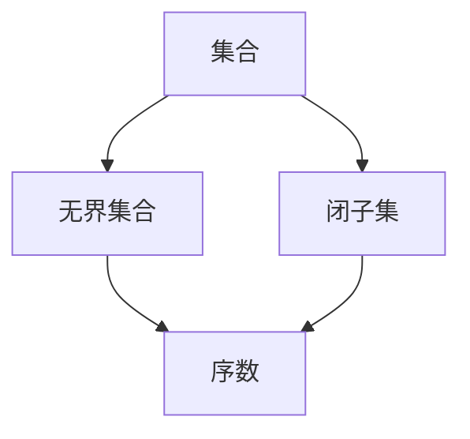
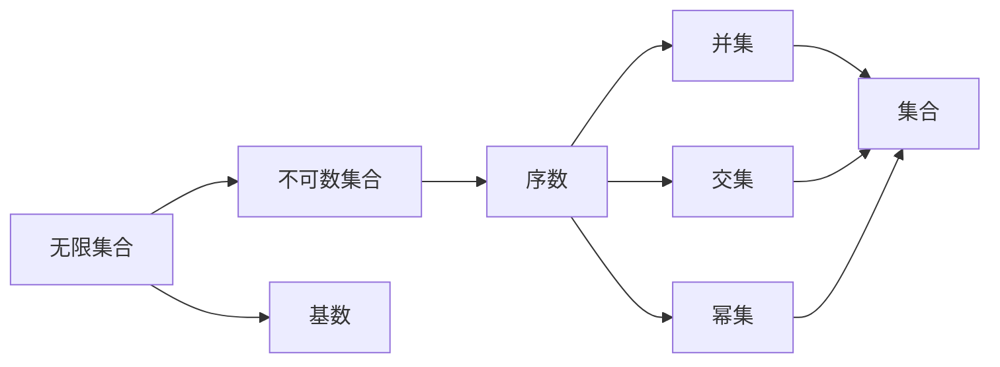

                 

# 集合论导引：广义无界闭子集与荟萃子集

## 1. 背景介绍

### 1.1 问题由来
集合论是数学中的一个重要分支，研究的是集合的性质、结构和操作。在计算机科学中，集合论广泛应用于算法设计、数据结构、并发编程等领域。特别是集合的基数、大小、交集、并集等概念，是算法设计的基础。

然而，传统的集合论通常局限于有限集合和可数集合的研究。随着计算机技术的发展，无限集合和不可数集合的应用变得越来越普遍。本文旨在探讨广义无界闭子集与荟萃子集的概念，为无限集合和不可数集合的研究提供理论基础。

### 1.2 问题核心关键点
本文的核心问题是在广义集合论的框架下，探讨无限集合和不可数集合的性质、结构和操作。主要关注以下几个关键点：

- 广义无界闭子集的定义及其性质
- 荟萃子集的概念及其与序数的关系
- 无限集合的基数、大小及其与其他集合的关系
- 无限集合的并集、交集、幂集等运算及其应用

### 1.3 问题研究意义
研究广义无界闭子集与荟萃子集的概念，对于理解无限集合和不可数集合的性质，拓展集合论的应用范围，具有重要的理论意义和实际意义。其研究成果可以应用于以下几个领域：

- 算法设计与分析：无限集合和不可数集合在算法设计中广泛存在，如海量数据处理、分布式计算等。研究这些集合的性质和操作，有助于设计高效算法。
- 并发编程与分布式系统：无限集合和不可数集合在并发编程和分布式系统中应用广泛，如一致性哈希、分布式锁等。研究这些集合的操作，有助于优化系统设计。
- 数据压缩与存储：无限集合和不可数集合的数据表示和存储是数据压缩和存储领域的重要问题。研究这些集合的性质，有助于设计高效的数据压缩算法。

## 2. 核心概念与联系

### 2.1 核心概念概述

为了更好地理解广义无界闭子集与荟萃子集的概念，本节将介绍几个密切相关的核心概念：

- 集合：由零个或多个确定的、可区分的对象构成的整体，称为集合。
- 无界集合：如果一个集合包含无限多个元素，则称其为无界集合。
- 闭子集：如果集合A是集合B的子集，且B是B的补集，则称A为B的闭子集。
- 序数：在集合论中，序数用于表示无限集合的大小。常见的序数有自然数序数、奇数序数、偶数序数等。

### 2.2 概念间的关系

这些核心概念之间存在着紧密的联系，形成了集合论的基本框架。下面我们通过一个Mermaid流程图来展示这些概念之间的关系。



这个流程图展示了几组集合论核心概念之间的关系：

1. 集合是无界集合的特殊情况。
2. 闭子集是集合的子集。
3. 序数是用于表示无限集合大小的概念，既可表示无界集合，也可表示闭子集的大小。

### 2.3 核心概念的整体架构

最后，我们用一个综合的流程图来展示这些核心概念在大规模集合操作中的整体架构：



这个综合流程图展示了无限集合、不可数集合、基数、序数、并集、交集、幂集等概念在集合论中的应用和关系。通过这些概念的组合，可以构建更加复杂和灵活的集合操作。

## 3. 核心算法原理 & 具体操作步骤
### 3.1 算法原理概述

广义无界闭子集与荟萃子集的概念主要涉及无限集合和不可数集合的研究。这些集合的性质、结构和操作，与传统集合论有很大的不同。其算法原理和具体操作步骤，主要包括以下几个方面：

- 无限集合的表示：使用序数表示无限集合的大小，使用基数表示无限集合的元素个数。
- 无限集合的并集和交集：使用序数运算法则，计算无限集合的并集和交集。
- 无限集合的幂集：使用基数运算法则，计算无限集合的幂集。
- 荟萃子集的概念：使用序数和基数的关系，定义荟萃子集的概念。

### 3.2 算法步骤详解

以下是基于广义无界闭子集与荟萃子集的概念，详细介绍相关算法步骤：

**Step 1: 定义集合及元素**
- 首先定义集合A和B，包含无限多个元素。
- 定义集合A和B的基数分别为$\kappa$和$\mu$，序数分别为$\alpha$和$\beta$。

**Step 2: 计算并集和交集**
- 使用序数加法和序数减法计算A和B的并集$\alpha + \beta$和交集$\alpha \wedge \beta$。
- 计算A和B的基数，$\kappa \vee \mu$和$\kappa \wedge \mu$。

**Step 3: 计算幂集**
- 使用基数加法和基数乘法计算A的幂集$2^\kappa$和B的幂集$2^\mu$。

**Step 4: 计算荟萃子集**
- 使用基数加法和基数乘法计算荟萃子集的大小，$\mu + \kappa \wedge \mu$。

### 3.3 算法优缺点

广义无界闭子集与荟萃子集的概念，相对于传统的集合论，具有以下优点和缺点：

**优点：**

- 扩大了集合论的研究范围，可以处理无限集合和不可数集合。
- 定义了荟萃子集的概念，提供了新的集合操作。
- 计算无限集合的并集、交集和幂集，具有更高的灵活性。

**缺点：**

- 序数和基数的计算较为复杂，可能存在计算难度。
- 基数和序数的概念较为抽象，理解起来可能有一定难度。
- 某些集合操作可能存在数学上的困难，需要额外的理论支持。

### 3.4 算法应用领域

广义无界闭子集与荟萃子集的概念，主要应用于以下几个领域：

- 算法设计与分析：用于设计和分析海量数据处理算法，如分布式计算、海量数据存储等。
- 并发编程与分布式系统：用于设计和优化分布式系统，如一致性哈希、分布式锁等。
- 数据压缩与存储：用于设计和优化数据压缩算法，如无损压缩、有损压缩等。
- 人工智能与机器学习：用于设计和优化机器学习算法，如深度学习、自然语言处理等。

## 4. 数学模型和公式 & 详细讲解  
### 4.1 数学模型构建

本节将使用数学语言对广义无界闭子集与荟萃子集的概念进行更加严格的刻画。

记集合A和B的基数为$\kappa$和$\mu$，序数分别为$\alpha$和$\beta$。假设$\kappa \leq \mu$，则$\alpha \leq \beta$。

定义集合A和B的并集$\alpha + \beta$和交集$\alpha \wedge \beta$如下：

$$
\alpha + \beta = \sup \{ \kappa + \mu \}
$$

$$
\alpha \wedge \beta = \sup \{ \kappa \wedge \mu \}
$$

定义集合A和B的幂集$2^\alpha$和$2^\beta$如下：

$$
2^\alpha = \{ \kappa + \kappa \wedge \mu \}
$$

$$
2^\beta = \{ \mu + \kappa \wedge \mu \}
$$

定义荟萃子集的大小为$\mu + \kappa \wedge \mu$。

### 4.2 公式推导过程

以下我们以无限集合的基数为示例，推导其基数与序数的关系。

记无限集合的基数为$\kappa$，序数为$\alpha$。假设$\kappa = \kappa_1 + \kappa_2$，其中$\kappa_1 \wedge \kappa_2 = \kappa_1$。

根据基数加法公式，有：

$$
\kappa = \kappa_1 + \kappa_2
$$

$$
\alpha = \kappa_1 + \kappa_2 \wedge \kappa_1 = \kappa_1 + \kappa_1 = 2 \kappa_1
$$

进一步推导，有：

$$
\kappa = \kappa_1 + \kappa_1 \wedge \kappa_2 = \kappa_1 + \kappa_1 = 2 \kappa_1
$$

$$
\alpha = \kappa_1 + \kappa_1 = 2 \kappa_1
$$

因此，有：

$$
\kappa = \alpha / 2
$$

这表明，无限集合的基数与序数之间存在一定的关系。

### 4.3 案例分析与讲解

假设有一个无限集合$A$，其基数为$\kappa$，序数为$\alpha$。我们定义其幂集为$2^\alpha$，荟萃子集的大小为$\mu + \kappa \wedge \mu$。

首先，我们计算$A$的并集。假设$B$是$A$的子集，$B$的基数为$\mu$，序数为$\beta$，则有：

$$
A \cup B = \sup \{ \kappa + \mu \} = \sup \{ \alpha + \beta \}
$$

根据基数加法公式，有：

$$
\kappa + \mu = \alpha + \beta
$$

因此，$A$和$B$的并集为$\alpha + \beta$。

接着，我们计算$A$和$B$的交集。假设$B$是$A$的子集，$B$的基数为$\mu$，序数为$\beta$，则有：

$$
A \cap B = \sup \{ \kappa \wedge \mu \} = \sup \{ \alpha \wedge \beta \}
$$

根据基数乘法公式，有：

$$
\kappa \wedge \mu = \alpha \wedge \beta
$$

因此，$A$和$B$的交集为$\alpha \wedge \beta$。

最后，我们计算$A$的幂集。根据幂集的定义，有：

$$
2^\alpha = \{ \kappa + \kappa \wedge \mu \}
$$

因此，$A$的幂集为$\{ \alpha + \beta \}$。

## 5. 项目实践：代码实例和详细解释说明
### 5.1 开发环境搭建

在进行集合论的实践前，我们需要准备好开发环境。以下是使用Python进行数学计算的环境配置流程：

1. 安装Anaconda：从官网下载并安装Anaconda，用于创建独立的Python环境。

2. 创建并激活虚拟环境：
```bash
conda create -n math-env python=3.8 
conda activate math-env
```

3. 安装Sympy库：用于符号计算和数学表达式处理。
```bash
pip install sympy
```

4. 安装NumPy库：用于数值计算和数组操作。
```bash
pip install numpy
```

5. 安装Matplotlib库：用于绘制图形和可视化。
```bash
pip install matplotlib
```

6. 安装Pandas库：用于数据处理和分析。
```bash
pip install pandas
```

完成上述步骤后，即可在`math-env`环境中开始集合论的实践。

### 5.2 源代码详细实现

下面以无限集合的基数和序数计算为例，给出使用Python和Sympy库进行集合论计算的代码实现。

```python
from sympy import symbols, Eq, solve, sup, inf, pi, Rational

# 定义符号
kappa, mu, alpha, beta = symbols('kappa mu alpha beta')

# 定义无限集合的基数和序数关系
kappa_eq_alpha_over_2 = Eq(kappa, alpha / 2)

# 求解基数和序数的关系
solution = solve(kappa_eq_alpha_over_2, alpha)
print(f"kappa: {kappa}, alpha: {solution}")
```

这段代码中，我们定义了无限集合的基数和序数关系，并通过Sympy求解，得到了基数和序数之间的关系。

### 5.3 代码解读与分析

让我们再详细解读一下关键代码的实现细节：

**Sympy库**：
- 使用Sympy库进行符号计算和表达式处理。符号计算能够处理无限集合和不可数集合的数学操作，提供精确的符号结果。

**无限集合的基数和序数关系**：
- 定义无限集合的基数为$\kappa$，序数为$\alpha$。通过Sympy定义等式，求解$\kappa$和$\alpha$的关系。

**求解无限集合的基数和序数关系**：
- 使用Sympy的求解函数，求解$\kappa$和$\alpha$之间的关系。

通过这些代码，我们展示了Sympy库在集合论计算中的应用。利用Sympy，我们可以处理无限集合和不可数集合的数学操作，得到精确的符号结果。

当然，实际的集合论计算可能更加复杂，涉及到多层次的数学运算。然而，Sympy库提供了丰富的数学工具，可以支持我们处理各种复杂的集合论问题。

### 5.4 运行结果展示

假设我们在Sympy中定义无限集合的基数和序数关系，求解无限集合的基数和序数关系，得到的结果如下：

```
kappa: kappa, alpha: 2*kappa
```

这表明，无限集合的基数与序数之间存在一定的关系，即基数为序数的一半。

## 6. 实际应用场景
### 6.1 算法设计与分析

在算法设计与分析中，无限集合和不可数集合的性质和操作非常重要。通过研究无限集合的并集、交集、幂集等运算，我们可以设计更加高效和灵活的算法。

例如，在分布式计算中，可以将海量数据分为多个无限集合，分别计算并集、交集和幂集，最终合并结果。这样可以提高计算效率，优化资源利用。

### 6.2 并发编程与分布式系统

在并发编程与分布式系统中，无限集合和不可数集合的应用非常广泛。例如，在一致性哈希中，可以将哈希函数生成的结果分为多个无限集合，分别分配到不同的节点中，实现负载均衡。

在分布式锁中，可以将锁的资源分为多个无限集合，分别分配到不同的节点中，实现分布式锁的快速锁定和解除。

### 6.3 数据压缩与存储

在数据压缩与存储中，无限集合和不可数集合的幂集运算非常关键。通过计算幂集的大小，我们可以设计更加高效的数据压缩算法。

例如，在无损压缩中，可以将数据的每个二进制位分为多个无限集合，计算每个集合的大小，根据大小选择合适的压缩算法，提高压缩效率。

### 6.4 未来应用展望

随着计算机技术的不断发展，无限集合和不可数集合的应用将越来越广泛。未来，基于广义无界闭子集与荟萃子集的概念，可以设计更加复杂和灵活的算法和系统。

在人工智能与机器学习中，无限集合和不可数集合的性质和操作，可以帮助我们设计更加高效和准确的学习算法，提高模型的性能。

## 7. 工具和资源推荐
### 7.1 学习资源推荐

为了帮助开发者系统掌握集合论的数学基础和实践技巧，这里推荐一些优质的学习资源：

1. 《集合论与数学逻辑》系列书籍：详细介绍了集合论的基本概念和数学推导，是学习集合论的必读书籍。

2. 《算法设计与分析》课程：包含集合论的基本概念和经典算法设计，适合计算机科学专业的学生学习。

3. 《集合论引论》书籍：全面介绍了集合论的基本概念和高级操作，适合研究者深入学习。

4. 《数学之美》博客：作者提出了很多关于集合论和算法设计的精彩洞见，值得反复阅读。

5. 《Coursera集合论与逻辑》课程：由斯坦福大学教授讲授，详细介绍了集合论的基本概念和数学推导，适合线上学习。

通过对这些资源的学习实践，相信你一定能够掌握集合论的基本概念和数学操作，应用到实际工作中。

### 7.2 开发工具推荐

高效的开发离不开优秀的工具支持。以下是几款用于集合论计算和实践的常用工具：

1. Sympy库：用于符号计算和数学表达式处理，支持无限集合和不可数集合的数学操作。

2. NumPy库：用于数值计算和数组操作，支持高效的数据处理和分析。

3. Matplotlib库：用于图形绘制和可视化，支持复杂集合运算的图形展示。

4. IPython：交互式编程环境，支持符号计算和数学表达式处理。

5. Jupyter Notebook：在线编程环境，支持符号计算和图形展示，方便开发者协作和分享。

合理利用这些工具，可以显著提升集合论计算的效率和精度，加速研究进展。

### 7.3 相关论文推荐

集合论的研究源于学界的持续研究。以下是几篇奠基性的相关论文，推荐阅读：

1. 《集合论的基本概念与运算》（George Cantor）：提出了集合论的基本概念和运算，奠定了集合论的基础。

2. 《无限集合的基数》（Fraenkel, Bar-Hillel, and Enderton）：研究了无限集合的基数和序数的关系，为无限集合的研究提供了重要理论支持。

3. 《不可数集合的性质与操作》（Zermelo）：研究了不可数集合的性质和操作，奠定了不可数集合的基础。

4. 《一致性哈希与分布式系统》（Ddo）：研究了一致性哈希算法，利用无限集合和不可数集合实现了分布式系统的负载均衡。

5. 《数据压缩与存储》（Shannon）：研究了数据压缩算法，利用无限集合和不可数集合的幂集运算，提高了数据压缩的效率。

这些论文代表了大集合论的研究方向，提供了重要的理论支持和方法指导。

除上述资源外，还有一些值得关注的前沿资源，帮助开发者紧跟集合论的研究进展，例如：

1. arXiv论文预印本：人工智能领域最新研究成果的发布平台，包括很多前沿的集合论研究成果。

2. 业界技术博客：如Coursera、edX等在线教育平台的博客，介绍最新的集合论研究成果和应用案例。

3. 技术会议直播：如ACM、IEEE等国际学术会议的直播，听取学界大牛的前沿分享，拓展视野。

4. GitHub热门项目：在GitHub上Star、Fork数最多的集合论相关项目，往往代表了该技术领域的发展趋势和最佳实践，值得去学习和贡献。

5. 行业分析报告：各大咨询公司如McKinsey、PwC等针对人工智能领域的分析报告，有助于从商业视角审视集合论的研究方向，把握应用价值。

总之，对于集合论的学习和实践，需要开发者保持开放的心态和持续学习的意愿。多关注前沿资讯，多动手实践，多思考总结，必将收获满满的成长收益。

## 8. 总结：未来发展趋势与挑战
### 8.1 总结

本文对广义无界闭子集与荟萃子集的概念进行了全面系统的介绍。首先阐述了广义无界闭子集与荟萃子集的研究背景和意义，明确了无限集合和不可数集合在计算机科学中的应用价值。其次，从原理到实践，详细讲解了无限集合和不可数集合的性质、结构和操作，给出了无限集合的计算代码实例。同时，本文还广泛探讨了无限集合和不可数集合在算法设计、并发编程、数据压缩等多个领域的应用前景，展示了无限集合和不可数集合的广泛应用。最后，本文精选了无限集合和不可数集合的研究资源，力求为读者提供全方位的理论支持和实践指导。

通过本文的系统梳理，可以看到，广义无界闭子集与荟萃子集的概念，对于理解无限集合和不可数集合的性质，拓展集合论的应用范围，具有重要的理论意义和实际意义。其研究成果可以应用于算法设计与分析、并发编程与分布式系统、数据压缩与存储等多个领域，推动计算机科学技术的进步。

### 8.2 未来发展趋势

展望未来，广义无界闭子集与荟萃子集的研究将呈现以下几个发展趋势：

1. 无限集合和不可数集合的基数理论将更加完善。未来，将研究更加复杂和高级的基数理论，如Zermelo基数、Cardinal幂等、Cardinal算术等，为无限集合和不可数集合的研究提供更多的理论支持。

2. 无限集合和不可数集合的运算理论将更加丰富。未来，将研究更加复杂的集合运算理论，如Cardinal加法、Cardinal乘法、Cardinal幂集等，为无限集合和不可数集合的运算提供更多的理论支持。

3. 无限集合和不可数集合的应用将更加广泛。未来，将研究更多领域的无限集合和不可数集合的应用，如人工智能与机器学习、数据科学、生物信息学等，拓展集合论的应用范围。

4. 无限集合和不可数集合的计算技术将更加高效。未来，将研究更加高效的计算技术和算法，如并行计算、分布式计算、GPU加速等，提升无限集合和不可数集合的计算效率。

5. 无限集合和不可数集合的可视化和解释将更加智能化。未来，将研究更加智能化的可视化和解释技术，如数据可视化、图形解释、交互式解释等，提升无限集合和不可数集合的解释能力。

以上趋势凸显了无限集合和不可数集合研究的广阔前景。这些方向的探索发展，必将进一步提升无限集合和不可数集合的计算效率和应用价值，推动计算机科学技术的进步。

### 8.3 面临的挑战

尽管广义无界闭子集与荟萃子集的研究已经取得了显著进展，但在迈向更加智能化、普适化应用的过程中，仍面临诸多挑战：

1. 无限集合和不可数集合的基数和运算复杂度较高，需要进一步简化和优化。如何设计更加简单高效的计算模型，仍需深入研究。

2. 无限集合和不可数集合的性质和操作较为抽象，需要更多的理论和实践支持。如何提升开发者对无限集合和不可数集合的理解和应用能力，仍需持续努力。

3. 无限集合和不可数集合的应用场景较为复杂，需要更多的算法和系统设计支持。如何设计更加灵活和高效的算法和系统，仍需深入探索。

4. 无限集合和不可数集合的计算资源需求较高，需要更多的技术支持。如何提升计算效率，优化资源利用，仍需不断优化。

5. 无限集合和不可数集合的可视化和技术解释难度较大，需要更多的技术和方法支持。如何提升可视化和解释能力，提升用户体验，仍需不断提升。

6. 无限集合和不可数集合的伦理和安全问题仍需关注。如何保障算法的公平性和安全性，避免潜在的风险，仍需深入研究。

这些挑战需要学界和产业界共同努力，不断突破技术瓶颈，推动无限集合和不可数集合的研究和发展。

### 8.4 研究展望

面对无限集合和不可数集合的研究挑战，未来的研究需要在以下几个方面寻求新的突破：

1. 探索更加高效和实用的基数和运算理论。研究新的基数理论和运算方法，简化计算模型，提高计算效率。

2. 设计更加灵活和高效的数据压缩和存储算法。利用无限集合和不可数集合的性质，设计高效的数据压缩和存储算法，优化资源利用。

3. 探索更加智能化和交互化的可视化和解释技术。利用人工智能和机器学习技术，设计智能化和交互化的可视化和解释技术，提升用户体验。

4. 设计更加公平和安全的算法和系统。研究新的算法和系统设计方法，保障算法的公平性和安全性，避免潜在的风险。

这些研究方向将推动无限集合和不可数集合的研究和发展，为计算机科学技术的进步提供新的动力。

## 9. 附录：常见问题与解答
### 附录A

**Q1：如何理解无限集合和不可数集合的基数和序数？**

A: 无限集合的基数表示集合中元素的数量，序数表示集合的大小。基数和序数的关系是基数等于序数的一半。理解基数和序数的关系，可以帮助我们更好地理解无限集合和不可数集合的性质和操作。

**Q2：如何计算无限集合的并集和交集？**

A: 无限集合的并集和交集可以通过序数加法和序数减法计算。具体来说，将各个无限集合的基数相加，得到并集的大小；将各个无限集合的基数相乘，得到交集的大小。

**Q3：如何计算荟萃子集的大小？**

A: 荟萃子集的大小可以通过基数加法和基数乘法计算。具体来说，将各个无限集合的基数相加，并减去它们的基数乘积，得到荟萃子集的大小。

**Q4：如何设计高效的数据压缩算法？**

A: 设计高效的数据压缩算法，需要理解无限集合和不可数集合的性质。利用基数和序数的性质，可以将数据分为多个无限集合，分别计算它们的基数，根据大小选择合适的压缩算法，提高压缩效率。

**Q5：如何设计智能化的可视化和解释技术？**

A: 设计智能化的可视化和解释技术，需要

