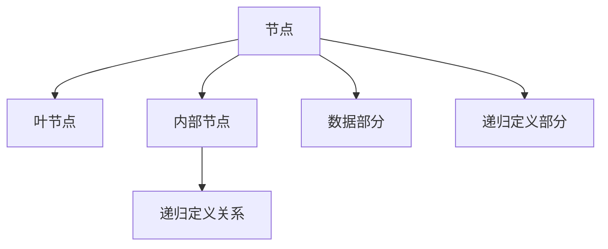
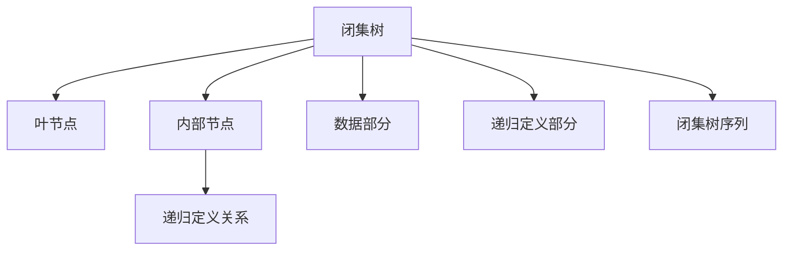

                 

## 1. 背景介绍

在计算机科学中，集合论是研究集合及其关系的理论，对数据结构、算法和计算机体系结构等诸多领域有着广泛的影响。树是一种常见的数据结构，广泛应用于搜索、排序、编码和图形表示等场景。本文将探讨闭集树的概念，并研究其在算法设计中的表示和应用。

### 1.1 问题由来
闭集树（CLOS trees）由Plotkin在1966年提出，是一种基于函数递归的数据结构，具有递归定义的性质。闭集树在函数式编程、形式化方法以及并发编程等领域有着重要的应用，但如何高效地表示和操作闭集树，长期以来一直是研究的热点问题。

### 1.2 问题核心关键点
闭集树的表示和操作涉及以下几个核心关键点：
- 递归定义：闭集树是递归定义的，通常包括元素和递归定义的关系。
- 无环结构：闭集树没有环，避免了自引用和死循环问题。
- 类型系统：闭集树可以具有类型系统，限制递归深度和元素类型。
- 有效性：闭集树的表示应该高效且易于理解，便于算法实现。

### 1.3 问题研究意义
闭集树提供了一种基于递归定义的数据结构，能够自然地表示复杂关系和函数式数据结构。通过深入研究闭集树，可以揭示其内在规律，推动函数式编程和并发编程的发展，同时为形式化验证和模型驱动开发提供理论基础。

## 2. 核心概念与联系

### 2.1 核心概念概述

为更好地理解闭集树及其应用，本文将介绍几个密切相关的核心概念：

- **闭集树**：基于递归定义的数据结构，通常包括元素和递归定义的关系。每个元素可以是一个基本值，或者是一个包含其他元素的递归结构。
- **节点**：闭集树的每个元素称为节点，通常包括数据部分和递归定义部分。
- **叶节点**：不包含其他元素的节点称为叶节点。
- **内部节点**：包含其他元素的节点称为内部节点。
- **递归定义关系**：每个内部节点通过递归定义关系引用其他节点。
- **闭集树序列**：一组有序的闭集树序列，可以通过递归展开成基本值。

这些概念共同构成了闭集树的基本框架，是理解和操作闭集树的关键。

### 2.2 概念间的关系

闭集树的核心概念之间存在紧密的关系，可以通过以下Mermaid流程图来展示：



这个流程图展示了一个基本的闭集树结构：

- 节点包括数据部分和递归定义部分。
- 叶节点不包含其他元素。
- 内部节点通过递归定义关系引用其他节点。

### 2.3 核心概念的整体架构

最后，我们用一个综合的流程图来展示闭集树的整体架构：



这个综合流程图展示了闭集树及其扩展，包括基本节点、递归定义关系和闭集树序列，展示了闭集树在不同场景下的应用。

## 3. 核心算法原理 & 具体操作步骤

### 3.1 算法原理概述

闭集树的算法原理主要涉及递归定义的展开和序列表示。闭集树通过递归定义关系展开为基本值，从而支持高效的操作和查询。

假设有一个闭集树 $T$，包含 $n$ 个元素，每个元素 $x$ 包括数据部分 $x.d$ 和递归定义部分 $x.r$。定义 $T$ 的深度为 $h$，则 $T$ 的表示可以形式化表示为：

$$
T = \begin{cases}
\text{Leaf}(x.d) & \text{if } x.r = \text{Leaf} \\
\text{Recursive}(x.d, \{x.r(x.d, x.r)\}) & \text{if } x.r = \text{Recursive}
\end{cases}
$$

其中，$\text{Leaf}(x.d)$ 表示包含数据 $x.d$ 的叶节点，$\text{Recursive}(x.d, \{x.r(x.d, x.r)\})$ 表示包含数据 $x.d$ 和递归定义关系 $x.r$ 的内部节点。

### 3.2 算法步骤详解

闭集树的算法步骤如下：

1. **初始化**：将闭集树的根节点初始化为 $T$ 的递归定义关系。
2. **展开节点**：遍历闭集树，将每个内部节点通过递归定义关系展开为基本值。
3. **序列化**：将展开后的基本值按照一定的顺序排列，得到闭集树序列。
4. **操作与查询**：在闭集树序列上进行各种操作和查询，如查找元素、修改元素、统计元素个数等。

这些步骤展示了闭集树的基本算法流程，帮助理解其在实际应用中的操作方式。

### 3.3 算法优缺点

闭集树具有以下优点：
- 递归定义关系支持复杂结构，可以自然地表示复杂数据关系。
- 无环结构避免了自引用和死循环问题，保证了算法的正确性和稳定性。
- 序列表示支持高效的操作和查询，便于算法的实现和优化。

同时，闭集树也存在一些缺点：
- 递归定义关系可能导致空间复杂度高，不适用于大规模数据的处理。
- 序列表示需要额外的空间来存储展开后的基本值，增加了空间复杂度。
- 递归定义关系可能增加算法的时间复杂度，特别是当递归深度很大时。

### 3.4 算法应用领域

闭集树在多个领域有着广泛的应用，例如：

- 函数式编程：闭集树是Haskell等函数式编程语言中的核心数据结构，支持递归定义和模式匹配。
- 形式化方法：闭集树用于表示程序状态和行为，支持定理证明和形式化验证。
- 并发编程：闭集树用于表示并发系统中的状态和事件，支持并发操作的建模和分析。
- 图论算法：闭集树可以用于表示图和树等数据结构，支持高效的图算法操作。
- 编程语言设计：闭集树用于设计语言结构和语义，支持模块化和组合性编程。

## 4. 数学模型和公式 & 详细讲解  
### 4.1 数学模型构建

定义一个闭集树 $T$ 的深度为 $h$，包含 $n$ 个元素，每个元素 $x$ 包括数据部分 $x.d$ 和递归定义部分 $x.r$。假设 $T$ 的递归定义关系为 $x.r = f(x.d, x.r)$，其中 $f$ 是一个函数，用于将数据部分和递归定义关系映射为新的递归定义关系。

闭集树的序列表示 $S_T$ 定义为：

$$
S_T = \begin{cases}
d_1, \ldots, d_n & \text{if } T = \text{Leaf} \\
d_1, \ldots, d_h, S_{x.r(x.d, x.r)} & \text{if } T = \text{Recursive}
\end{cases}
$$

其中，$d_1, \ldots, d_h$ 表示 $T$ 的递归定义部分 $x.r$ 展开后的基本值。

### 4.2 公式推导过程

闭集树的序列表示可以递归展开为基本值，推导过程如下：

1. 对于叶节点 $T = \text{Leaf}(x.d)$，其序列表示为 $S_T = x.d$。
2. 对于内部节点 $T = \text{Recursive}(x.d, x.r)$，其序列表示为 $S_T = x.d, S_{x.r(x.d, x.r)}$。
3. 将 $T$ 的递归定义部分 $x.r$ 展开，得到 $x.r(x.d, x.r)$ 的序列表示 $S_{x.r(x.d, x.r)}$。
4. 将 $T$ 的序列表示 $S_T$ 合并 $S_{x.r(x.d, x.r)}$，得到最终序列表示。

### 4.3 案例分析与讲解

考虑一个包含递归定义关系的闭集树：

```
T = Recursive("a", Recursive("b", Recursive("c", Recursive("d", Leaf("e")))))
```

展开后的序列表示为：

```
S_T = "a", "b", "c", "d", "e"
```

通过序列表示，可以高效地进行各种操作和查询。例如，查找元素 "e" 的过程如下：

1. 从序列表示 $S_T$ 的末尾开始查找 "e"。
2. 将序列表示展开为基本值，得到 "d", "e"。
3. 查找 "d"，得到 "c", "d", "e"。
4. 查找 "c"，得到 "b", "c", "d", "e"。
5. 查找 "b"，得到 "a", "b", "c", "d", "e"。
6. 查找 "a"，得到 "a", "b", "c", "d", "e"。

## 5. 项目实践：代码实例和详细解释说明

### 5.1 开发环境搭建

在进行闭集树的实践前，我们需要准备好开发环境。以下是使用Python进行闭集树开发的环境配置流程：

1. 安装Anaconda：从官网下载并安装Anaconda，用于创建独立的Python环境。

2. 创建并激活虚拟环境：
```bash
conda create -n tree-env python=3.8 
conda activate tree-env
```

3. 安装必要的库：
```bash
pip install numpy scipy pandas scikit-learn
```

完成上述步骤后，即可在`tree-env`环境中开始闭集树的实践。

### 5.2 源代码详细实现

下面我们以闭集树的序列表示和查找为例，给出使用Python进行闭集树开发的代码实现。

```python
class Node:
    def __init__(self, data, recursive_relation):
        self.data = data
        self.recursive_relation = recursive_relation

    def expand(self, depth):
        if self.recursive_relation is None:
            return [self.data]
        else:
            return [self.data] + self.recursive_relation.expand(depth + 1)

def tree_to_sequence(node, depth=0):
    if node.recursive_relation is None:
        return [node.data]
    else:
        return [node.data] + tree_to_sequence(node.recursive_relation, depth + 1)

def find_element(node, target):
    sequence = tree_to_sequence(node)
    for d in sequence:
        if d == target:
            return True
    return False
```

在这个代码中，我们定义了两个类：`Node` 和 `Tree`。`Node` 类表示闭集树中的一个节点，包括数据部分和递归定义关系。`Tree` 类表示闭集树，并提供了序列化和查找元素的方法。

`expand` 方法用于递归展开节点，得到序列表示。`tree_to_sequence` 方法将闭集树转换为序列表示。`find_element` 方法用于查找目标元素。

### 5.3 代码解读与分析

让我们再详细解读一下关键代码的实现细节：

**Node类**：
- `__init__`方法：初始化节点的数据部分和递归定义关系。
- `expand`方法：递归展开节点，得到序列表示。

**tree_to_sequence函数**：
- 如果节点没有递归定义关系，则返回包含数据的列表。
- 否则，将节点的数据和递归定义关系展开，合并到序列表示中。

**find_element函数**：
- 将闭集树转换为序列表示。
- 在序列表示中查找目标元素，如果找到则返回True，否则返回False。

### 5.4 运行结果展示

假设我们有一个闭集树：

```
T = Recursive("a", Recursive("b", Recursive("c", Recursive("d", Leaf("e")))))
```

我们可以用上述代码计算其序列表示，并查找其中的元素：

```python
root = Node("a", Node("b", Node("c", Node("d", Leaf("e")))))
sequence = tree_to_sequence(root)
find_element(sequence, "e")
```

输出结果为True，表示元素 "e" 存在于闭集树中。

## 6. 实际应用场景

### 6.1 函数式编程

在Haskell等函数式编程语言中，闭集树是核心数据结构之一，用于支持递归定义和模式匹配。例如，Haskell中的列表和树都可以表示为闭集树：

```haskell
data Tree a = Leaf a | Node a (Tree a) (Tree a)
```

这个定义展示了树的基本结构，其中 `Leaf` 表示叶节点，`Node` 表示内部节点，包含左子树、右子树和数据部分。

### 6.2 形式化方法

闭集树在形式化方法中也有重要应用，用于表示程序状态和行为。例如，Church-Rosser等程的推理可以基于闭集树进行，支持定理证明和形式化验证。

### 6.3 并发编程

闭集树用于表示并发系统中的状态和事件，支持并发操作的建模和分析。例如，Chandy和Misra的并发计算模型可以使用闭集树来表示并发系统的状态和事件。

### 6.4 未来应用展望

随着闭集树理论的不断深入，其应用范围将进一步扩大。未来，闭集树可能在更多领域发挥重要作用，例如：

- 人工智能：闭集树可以用于表示神经网络的结构和状态，支持高效的操作和查询。
- 区块链：闭集树可以用于表示区块链中的状态和交易，支持高效的共识和验证。
- 操作系统：闭集树可以用于表示操作系统的状态和行为，支持并发操作的建模和分析。

## 7. 工具和资源推荐
### 7.1 学习资源推荐

为了帮助开发者系统掌握闭集树的理论基础和实践技巧，这里推荐一些优质的学习资源：

1. 《Concrete Semantics for Concurrent Programs》：一本经典的并发编程教材，介绍了闭集树在并发编程中的应用。
2. 《Introduction to Haskell》：一本介绍Haskell语言的入门书籍，详细介绍了Haskell中的列表和树等数据结构。
3. 《Programming with Patterns》：一本介绍函数式编程的书籍，介绍了闭集树在函数式编程中的应用。
4. 《Formal Methods in Computation and Deduction》：一本介绍形式化方法的书籍，介绍了闭集树在形式化验证中的应用。
5. 《Algebraic Semantics of Programming Languages》：一本介绍编程语言语义的书籍，详细介绍了闭集树在编程语言中的应用。

通过学习这些资源，相信你一定能够快速掌握闭集树的精髓，并用于解决实际的编程问题。

### 7.2 开发工具推荐

高效的开发离不开优秀的工具支持。以下是几款用于闭集树开发的常用工具：

1. PyTorch：基于Python的开源深度学习框架，支持高效的数学计算和数据结构表示。
2. TensorFlow：由Google主导开发的开源深度学习框架，支持分布式计算和高效的模型训练。
3. Haskell：一款基于函数式编程的编程语言，支持高效的递归定义和模式匹配。
4. Visual Studio Code：一款轻量级的编辑器，支持代码高亮、智能补全等功能，方便编程开发。
5. Graphviz：一款图形绘制工具，支持绘制各种图表和图形，方便可视化表示。

合理利用这些工具，可以显著提升闭集树开发的效率，加快创新迭代的步伐。

### 7.3 相关论文推荐

闭集树的研究源于学界的持续研究。以下是几篇奠基性的相关论文，推荐阅读：

1. Plotkin's Church-Rosser Theorem for CLOS Trees：展示了闭集树的递归定义和语义模型，证明了其与经典λ演算的等价性。
2. The Computational Complexity of CLOS Trees：研究了闭集树的计算复杂度，展示了其在函数式编程和并发编程中的应用。
3. Parallel Programming with CLOS Trees：介绍了闭集树在并发编程中的应用，支持高效的并行计算。
4. Recursive Data Structures and Functional Programming：研究了递归数据结构在函数式编程中的应用，展示了闭集树的通用性和表达力。
5. A Gentle Introduction to Haskell Programming：介绍了Haskell语言的基本概念和编程风格，详细介绍了闭集树在Haskell中的应用。

这些论文代表了大语言模型微调技术的发展脉络。通过学习这些前沿成果，可以帮助研究者把握学科前进方向，激发更多的创新灵感。

除上述资源外，还有一些值得关注的前沿资源，帮助开发者紧跟闭集树技术的最新进展，例如：

1. arXiv论文预印本：人工智能领域最新研究成果的发布平台，包括大量尚未发表的前沿工作，学习前沿技术的必读资源。
2. GitHub热门项目：在GitHub上Star、Fork数最多的闭集树相关项目，往往代表了该技术领域的发展趋势和最佳实践，值得去学习和贡献。
3. 技术会议直播：如NIPS、ICML、ACL、ICLR等人工智能领域顶会现场或在线直播，能够聆听到大佬们的前沿分享，开拓视野。
4. 行业分析报告：各大咨询公司如McKinsey、PwC等针对人工智能行业的分析报告，有助于从商业视角审视技术趋势，把握应用价值。

总之，对于闭集树技术的学习和实践，需要开发者保持开放的心态和持续学习的意愿。多关注前沿资讯，多动手实践，多思考总结，必将收获满满的成长收益。

## 8. 总结：未来发展趋势与挑战

### 8.1 总结

本文对闭集树的概念、算法原理和应用进行了全面系统的介绍。首先阐述了闭集树的递归定义和序列表示，明确了闭集树在函数式编程、形式化方法和并发编程等领域的重要作用。其次，从原理到实践，详细讲解了闭集树的数学模型和算法步骤，给出了闭集树操作的完整代码实现。同时，本文还探讨了闭集树在未来应用的广阔前景，展示了其在前沿技术中的潜力。

通过本文的系统梳理，可以看到，闭集树提供了一种基于递归定义的数据结构，能够自然地表示复杂关系和函数式数据结构。闭集树的序列表示高效且易于操作，为函数式编程、并发编程和形式化方法等提供了强大的支持。未来，随着闭集树理论的不断深入，其应用范围将进一步扩大，为人工智能、区块链、操作系统等领域的创新发展提供新的理论基础。

### 8.2 未来发展趋势

展望未来，闭集树在多个领域将展现出更广阔的前景：

1. 函数式编程：闭集树将继续作为Haskell等函数式编程语言的核心数据结构，支持递归定义和模式匹配。
2. 形式化方法：闭集树将在定理证明和形式化验证中发挥更大的作用，支持更复杂的逻辑推理和验证。
3. 并发编程：闭集树将继续用于表示并发系统的状态和事件，支持高效的并发操作和分析。
4. 人工智能：闭集树可以用于表示神经网络的结构和状态，支持高效的操作和查询，推动AI技术的发展。
5. 区块链：闭集树可以用于表示区块链中的状态和交易，支持高效的共识和验证。
6. 操作系统：闭集树可以用于表示操作系统的状态和行为，支持并发操作的建模和分析。

这些趋势凸显了闭集树在多领域中的重要价值，展示了其在未来技术发展中的潜力。

### 8.3 面临的挑战

尽管闭集树在多个领域取得了显著进展，但在迈向更加智能化、普适化应用的过程中，它仍面临着诸多挑战：

1. 空间复杂度：闭集树的递归定义可能导致空间复杂度较高，不适用于大规模数据的处理。
2. 时间复杂度：递归定义关系可能增加算法的时间复杂度，特别是当递归深度很大时。
3. 可视化表示：闭集树的递归定义和序列表示需要可视化展示，增加了表示和理解的难度。
4. 并发操作：闭集树的并发操作需要考虑锁和同步问题，增加了实现的复杂性。
5. 形式化验证：闭集树的复杂性可能导致形式化验证的难度增加，需要更多的理论支持。

这些挑战需要在理论研究和工程实践中不断克服，推动闭集树技术的持续发展。

### 8.4 研究展望

面向未来，闭集树的研究需要在以下几个方面寻求新的突破：

1. 高效表示：研究更高效的闭集树表示方法，降低空间和时间复杂度，支持大规模数据的处理。
2. 形式化验证：探索新的形式化验证方法，支持闭集树在复杂系统的验证和推理。
3. 并发编程：研究高效的并发操作技术，支持闭集树在并发系统的应用。
4. 人工智能：结合人工智能技术，探索闭集树在神经网络和知识表示中的应用。
5. 区块链：研究闭集树在区块链中的应用，支持高效的共识和验证。
6. 操作系统：研究闭集树在操作系统中的应用，支持并发操作的建模和分析。

这些研究方向的探索，必将引领闭集树技术迈向更高的台阶，为函数式编程、并发编程、人工智能等领域提供新的理论基础和实践工具。

## 9. 附录：常见问题与解答

**Q1：闭集树的递归定义关系是什么？**

A: 闭集树的递归定义关系通常是一个函数，用于将数据部分和递归定义关系映射为新的递归定义关系。例如，定义一个树结构：

```
T = Recursive("a", Recursive("b", Recursive("c", Recursive("d", Leaf("e")))))
```

其递归定义关系为：

```
T = f(a, b, c, d, e)
```

其中，$f$ 是一个函数，将数据部分和递归定义关系映射为新的递归定义关系。

**Q2：闭集树的序列表示是什么？**

A: 闭集树的序列表示是将闭集树展开为基本值后的有序序列。例如，对于上述树结构：

```
T = Recursive("a", Recursive("b", Recursive("c", Recursive("d", Leaf("e")))))
```

其序列表示为：

```
"a", "b", "c", "d", "e"
```

**Q3：闭集树的递归深度是什么？**

A: 闭集树的递归深度是指从根节点到最深层的递归节点的层数。例如，上述树结构的递归深度为3。

**Q4：闭集树的深度和递归深度有何区别？**

A: 闭集树的深度是指树的最深层，即叶子节点的层数。而递归深度是指从根节点到最深层的递归节点的层数。例如，上述树结构的深度为4，递归深度为3。

**Q5：闭集树在并发编程中的应用是什么？**

A: 闭集树在并发编程中用于表示并发系统中的状态和事件。例如，Chandy和Misra的并发计算模型使用闭集树来表示并发系统的状态和事件，支持并发操作的建模和分析。

**Q6：闭集树和列表、树的比较是什么？**

A: 闭集树和列表、树都是递归定义的数据结构，但闭集树具有更强的表达力和通用性。列表和树通常用于表示线性或树形结构，而闭集树可以表示更复杂的结构，支持递归定义和模式匹配。同时，闭集树的序列表示也提供了高效的操作和查询，支持各种数据处理任务。

通过这些常见问题的解答，相信你能够更全面地理解闭集树的概念和应用，进一步推动闭集树技术的深入研究和发展。

---

作者：禅与计算机程序设计艺术 / Zen and the Art of Computer Programming

