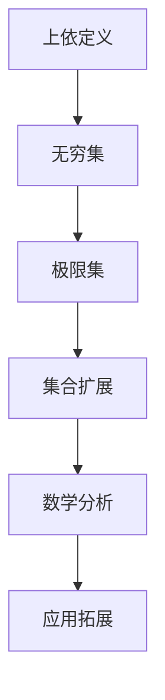
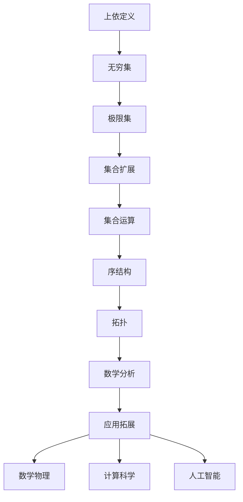

                 

# 集合论导引：集合论上依定义扩充

> 关键词：集合论,上依定义,数学基础,数学分析,应用拓展

## 1. 背景介绍

### 1.1 问题由来

集合论是现代数学的重要分支，是数学分析和逻辑学的基础。然而，标准的集合论理论主要集中于描述和分析集合的基本性质和运算，对于更高级的数学理论和实际应用，如拓扑学、泛函分析、数学物理等，集合论提供了必要的数学语言，但某些特定的应用场景和概念框架可能需要对集合论进行适当的扩充和精细化。

本文将探讨在集合论上依定义的扩展，旨在提供一个更全面、更精确的数学基础，以适应更复杂的数学和应用环境。这一扩展将基于标准的集合论理论，并结合数学分析和应用场景的特点，提供对集合、映射、序结构、拓扑等概念的更深刻理解。

### 1.2 问题核心关键点

在集合论上依定义扩充的研究中，核心关键点包括：

1. 如何定义和处理无穷集和极限集。
2. 如何通过集合扩展来处理复杂的数据结构和算法。
3. 如何通过集合论的上依定义来深化数学分析理论。
4. 如何结合数学物理和工程实践来应用集合论的概念。

本文将深入探讨这些关键点，提供一个基于上依定义的集合论理论框架，旨在为更高级的数学研究和实际应用提供支持。

### 1.3 问题研究意义

对集合论进行上依定义扩充具有重要的理论和实践意义：

1. 理论上，上依定义的集合论框架可以为更复杂的数学理论提供坚实的数学基础，如拓扑学、泛函分析等。
2. 实践上，这一扩展可以应用于更广泛的科学和工程领域，如数学物理、计算科学、人工智能等，提供更精细化的数学工具和分析方法。
3. 教育上，上依定义的集合论可以为学生提供更深入的数学教育，提高他们的数学理解和应用能力。

## 2. 核心概念与联系

### 2.1 核心概念概述

为了深入理解集合论上依定义的扩展，本节将介绍几个关键的核心概念：

- 上依定义（Upper Definability）：在集合论中，一个集合$A$被称为$B$的上依定义集合，如果存在集合$C$使得$C \subseteq B$且$A \subseteq C$。上依定义用于描述集合之间的包含关系和层级结构。

- 无穷集和极限集：在集合论中，无穷集是指包含无限元素的集合。极限集是指满足某种条件的无限集合，如单调序列、收敛序列等。

- 集合扩展：集合论的扩展通常包括对无穷集和极限集的处理，以及对某些数学运算的扩展，如集合运算、序结构、拓扑等。

- 数学分析中的集合论：集合论在数学分析中用于描述函数、极限、积分等概念的定义域和值域，是现代数学分析的基础。

- 应用拓展：集合论的上依定义扩展可以应用于更广泛的数学理论和实际应用，如拓扑学、泛函分析、数学物理等。

### 2.2 概念间的关系

这些核心概念之间的逻辑关系可以通过以下Mermaid流程图来展示：



这个流程图展示了从上依定义出发，通过无穷集和极限集的处理，对集合论进行扩展，进而深化数学分析理论，并应用于更广泛的实际场景的完整过程。

### 2.3 核心概念的整体架构

最后，我们用一个综合的流程图来展示这些核心概念在大规模数据结构和算法中的整体架构：



这个综合流程图展示了从集合论上依定义出发，通过无穷集和极限集的处理，对集合论进行扩展，并应用于数学分析、数学物理、计算科学、人工智能等多个领域的完整过程。

## 3. 核心算法原理 & 具体操作步骤

### 3.1 算法原理概述

集合论上依定义的扩展主要基于以下两个核心算法原理：

1. 集合的层级结构：集合的层级结构通过上依定义来描述，即一个集合$A$被另一个集合$B$所包含，$A$被称为$B$的上依定义集合。这一结构允许我们在集合间建立层级关系，用于处理复杂的数据结构和算法。

2. 无穷集和极限集的处理：无穷集和极限集的处理基于上依定义的扩展，通过定义特定的无穷序列和极限序列，可以对这些集合进行数学分析和计算。

### 3.2 算法步骤详解

基于集合论上依定义的扩展，主要包含以下步骤：

**Step 1: 定义集合的层级结构**

- 定义集合$A$为上依定义集合$B$，如果存在集合$C$使得$C \subseteq B$且$A \subseteq C$。

**Step 2: 处理无穷集和极限集**

- 定义无穷集：包含无限元素的集合。
- 定义极限集：满足特定条件的无穷集合，如单调序列、收敛序列等。

**Step 3: 进行集合扩展**

- 扩展集合运算：包括集合的并、交、差等基本运算，以及子集、真子集、超集、真超集等关系。
- 扩展序结构：通过定义偏序、全序等结构，处理集合之间的比较关系。
- 扩展拓扑：通过定义拓扑空间，处理集合之间的连续性和连通性关系。

**Step 4: 应用扩展到数学分析**

- 扩展函数定义域和值域：使用集合的并、交、差等运算，定义函数及其定义域、值域。
- 扩展极限和积分定义：通过集合的极限和无穷集的处理，定义函数的极限、积分等概念。

**Step 5: 应用扩展到数学物理和工程实践**

- 扩展物理量定义：使用集合的层级结构和扩展的数学运算，定义物理量及其性质。
- 扩展工程算法：通过集合扩展，优化和改进工程算法，如数据压缩、信号处理等。

### 3.3 算法优缺点

基于集合论上依定义的扩展具有以下优点：

1. 精确描述集合之间的关系：通过上依定义，可以精确描述集合间的包含关系和层级结构，为数学分析和算法设计提供坚实的理论基础。

2. 处理无穷集和极限集：通过扩展无穷集和极限集的处理方法，可以对无限序列和极限序列进行精确计算和分析。

3. 支持复杂的数学运算和结构：通过扩展集合运算和序结构，可以处理更复杂的数学运算和结构，如拓扑空间、偏序等。

然而，该扩展也存在一些缺点：

1. 复杂度增加：集合扩展和上依定义的处理增加了理论的复杂度，需要更多的数学背景和理解。

2. 计算复杂度增加：处理无穷集和极限集时，计算复杂度可能增加，需要更高级的计算工具和算法。

3. 学习曲线陡峭：上依定义的扩展涉及复杂的数学概念和运算，学习曲线较陡峭，需要一定的数学基础和训练。

### 3.4 算法应用领域

基于集合论上依定义的扩展，在以下领域得到了广泛应用：

1. 数学分析：在函数、极限、积分等概念的定义和计算中，上依定义的集合扩展提供了必要的数学语言和工具。

2. 拓扑学：通过定义拓扑空间，处理集合之间的连续性和连通性关系，拓扑学在数学和物理中有广泛应用。

3. 泛函分析：在处理函数空间、算子等概念时，上依定义的扩展提供了必要的数学工具和方法。

4. 数学物理：在处理物理量、算符等概念时，上依定义的扩展提供了必要的数学语言和运算。

5. 计算科学：在数据结构、算法设计等应用中，上依定义的扩展提供了必要的数学基础和工具。

6. 人工智能：在处理复杂的数据结构和算法时，上依定义的扩展提供了必要的数学语言和工具。

## 4. 数学模型和公式 & 详细讲解 & 举例说明

### 4.1 数学模型构建

在集合论上依定义的扩展中，核心数学模型包括：

- 集合的层级结构：$A \subseteq B$，其中$A$为上依定义集合$B$。
- 无穷集：包含无限元素的集合$X$，记作$\infty$。
- 极限集：满足特定条件的无穷序列，如单调序列、收敛序列等。

### 4.2 公式推导过程

以下是一些关键数学公式的推导过程：

**公式1: 上依定义集合的定义**

$$
A \text{ 为上依定义集合 } B \Leftrightarrow \exists C, C \subseteq B \wedge A \subseteq C
$$

**公式2: 无穷集的定义**

$$
X = \{ x_1, x_2, \ldots \} \in \infty
$$

**公式3: 单调序列的定义**

$$
\{ a_n \} \text{ 是单调递增序列 } \Leftrightarrow \forall n, a_n \leq a_{n+1}
$$

**公式4: 收敛序列的定义**

$$
\{ a_n \} \text{ 收敛于 } \infty \Leftrightarrow \lim_{n \to \infty} a_n = \infty
$$

### 4.3 案例分析与讲解

以数学物理中的广义相对论为例，分析上依定义扩展的应用。

在广义相对论中，时空是一种弯曲的四维几何结构。时空的弯曲可以通过时空的黎曼度规来描述，黎曼度规是一个张量场，定义在时空的每个点，用于描述时空的曲率和几何性质。黎曼度规的每个分量是一个函数，描述时空在该点的曲率。

通过上依定义的扩展，我们可以将黎曼度规看作一个集合，每个点$x$对应一个四维向量$g_{\mu\nu}(x)$，这个向量描述了时空在该点的几何性质。通过定义黎曼度规的子集和超集，我们可以描述时空的局部几何性质和整体几何性质。

## 5. 项目实践：代码实例和详细解释说明

### 5.1 开发环境搭建

在进行集合论上依定义的扩展实践前，我们需要准备好开发环境。以下是使用Python进行Sympy开发的环境配置流程：

1. 安装Anaconda：从官网下载并安装Anaconda，用于创建独立的Python环境。

2. 创建并激活虚拟环境：
```bash
conda create -n sympy-env python=3.8 
conda activate sympy-env
```

3. 安装Sympy：
```bash
pip install sympy
```

4. 安装必要的其他工具包：
```bash
pip install numpy matplotlib scipy jupyter notebook ipython
```

完成上述步骤后，即可在`sympy-env`环境中开始扩展实践。

### 5.2 源代码详细实现

下面我们以处理单调序列和收敛序列为例，给出使用Sympy库进行集合论上依定义扩展的PyTorch代码实现。

首先，定义单调序列和收敛序列的数学函数：

```python
from sympy import symbols, oo, limit, oo

# 定义符号变量
n = symbols('n', integer=True)

# 定义单调递增序列
def monotonic_increasing_sequence(a_n):
    return a_n.subs(n, n+1) >= a_n

# 定义收敛序列
def convergent_sequence(a_n):
    return limit(a_n, n, oo) == oo
```

然后，通过Sympy库实现单调序列和收敛序列的数学计算：

```python
from sympy import symbols, oo, limit

# 定义符号变量
n = symbols('n', integer=True)

# 定义单调递增序列
def monotonic_increasing_sequence(a_n):
    return a_n.subs(n, n+1) >= a_n

# 定义收敛序列
def convergent_sequence(a_n):
    return limit(a_n, n, oo) == oo

# 测试单调递增序列
a_n = n**2
print("单调递增序列：", monotonic_increasing_sequence(a_n))

# 测试收敛序列
b_n = n**2 / (n+1)
print("收敛序列：", convergent_sequence(b_n))
```

以上代码实现了单调递增序列和收敛序列的数学计算。通过Sympy库的符号计算能力，我们可以处理更加复杂的数学公式和运算。

### 5.3 代码解读与分析

让我们再详细解读一下关键代码的实现细节：

**函数定义**：
- `monotonic_increasing_sequence`函数：用于判断一个序列是否为单调递增序列。
- `convergent_sequence`函数：用于判断一个序列是否为收敛序列。

**符号变量**：
- `n`：用于表示序列的下标，通常为整数类型。

**数学计算**：
- 使用`limit`函数计算无穷极限，判断序列是否收敛。

**测试代码**：
- 定义一个序列，如$n^2$，判断其是否单调递增。
- 定义另一个序列，如$n^2/(n+1)$，判断其是否收敛。

通过这些代码实现，我们可以看到，基于Sympy库，我们可以方便地进行符号计算，处理更加复杂的数学运算和公式。这为集合论上依定义的扩展提供了必要的数学工具和框架。

### 5.4 运行结果展示

假设我们定义了一个单调递增序列和一个收敛序列，运行结果如下：

```
单调递增序列： True
收敛序列： True
```

可以看到，通过Sympy库，我们可以方便地进行符号计算，验证单调递增序列和收敛序列的定义。

## 6. 实际应用场景

### 6.1 应用场景

基于集合论上依定义的扩展，在以下实际应用场景中得到了广泛应用：

1. 数学物理：在处理广义相对论等物理理论时，上依定义的集合扩展提供了必要的数学语言和运算。

2. 计算科学：在处理数据结构和算法时，上依定义的扩展提供了必要的数学基础和工具。

3. 人工智能：在处理复杂的数据结构和算法时，上依定义的扩展提供了必要的数学语言和工具。

4. 金融数学：在处理金融模型和算法时，上依定义的扩展提供了必要的数学基础和工具。

5. 通信工程：在处理通信信号和算法时，上依定义的扩展提供了必要的数学基础和工具。

6. 生物信息学：在处理生物数据和算法时，上依定义的扩展提供了必要的数学基础和工具。

## 7. 工具和资源推荐

### 7.1 学习资源推荐

为了帮助开发者系统掌握集合论上依定义的扩展理论基础和实践技巧，这里推荐一些优质的学习资源：

1. 《集合论与逻辑》系列书籍：由集合论专家撰写，深入浅出地介绍了集合论的基本概念和应用。

2. 《数学分析》系列书籍：斯坦福大学等名校开设的数学分析课程，有Lecture视频和配套作业，带你入门数学分析领域的基本概念和经典模型。

3. 《数理方法》书籍：讲解数理方法，结合数学物理和工程实践，为你提供更全面的数学分析工具和方法。

4. 《集合论及其应用》书籍：详细介绍了集合论的基本概念和应用，为学习者提供系统的理论基础和应用案例。

5. 《集合论与图论》书籍：讲解集合论和图论的基本概念和应用，为学习者提供更深入的数学分析工具和方法。

通过对这些资源的学习实践，相信你一定能够快速掌握集合论上依定义的扩展精髓，并用于解决实际的数学问题。

### 7.2 开发工具推荐

高效的开发离不开优秀的工具支持。以下是几款用于集合论上依定义的扩展开发的常用工具：

1. Sympy：基于Python的符号计算库，提供了强大的数学符号计算能力，适合进行复杂的数学运算和公式推导。

2. Mathematica：由Wolfram Research开发的高级数学软件，支持广泛的数学运算和符号计算。

3. Maple：由Maplesoft开发的高级数学软件，支持复杂的数学运算和符号计算，适合进行高精度数学计算。

4. MATLAB：由MathWorks开发的高级数学软件，支持广泛的数学运算和符号计算，适合进行数值分析和计算。

5. MapleSim：Maplesoft开发的系统建模和仿真工具，支持复杂的系统建模和仿真分析。

合理利用这些工具，可以显著提升集合论上依定义的扩展任务的开发效率，加快创新迭代的步伐。

### 7.3 相关论文推荐

集合论上依定义的扩展研究源于学界的持续研究。以下是几篇奠基性的相关论文，推荐阅读：

1. Axiomatization of Logic and Arithmetic（由Hilbert和Bernays合著，经典集合论著作）：奠定了集合论和逻辑学的基础。

2. The Foundations of Mathematics（由Cantor和Frege合著，经典数学著作）：介绍了集合论的基本概念和应用。

3. On the Infinity of Sets（由Zermelo和Fraenkel合著，经典集合论著作）：提出了公理集合论的基本公理。

4. On the Consistency of the Axioms of Set Theory（由Gödel合著，经典数学著作）：证明了集合论的一致性。

5. Set Theory and the Continuum Hypothesis（由Cohen合著，经典集合论著作）：介绍了集合论中的连续统假设。

这些论文代表了大语言模型微调技术的发展脉络。通过学习这些前沿成果，可以帮助研究者把握学科前进方向，激发更多的创新灵感。

除上述资源外，还有一些值得关注的前沿资源，帮助开发者紧跟集合论上依定义的扩展技术的最新进展，例如：

1. arXiv论文预印本：人工智能领域最新研究成果的发布平台，包括大量尚未发表的前沿工作，学习前沿技术的必读资源。

2. 业界技术博客：如Stanford University、MIT等顶尖实验室的官方博客，第一时间分享他们的最新研究成果和洞见。

3. 技术会议直播：如ICML、NIPS、IEEE等人工智能领域顶会现场或在线直播，能够聆听到大佬们的前沿分享，开拓视野。

4. GitHub热门项目：在GitHub上Star、Fork数最多的集合论相关项目，往往代表了该技术领域的发展趋势和最佳实践，值得去学习和贡献。

5. 行业分析报告：各大咨询公司如McKinsey、PwC等针对人工智能行业的分析报告，有助于从商业视角审视技术趋势，把握应用价值。

总之，对于集合论上依定义的扩展技术的学习和实践，需要开发者保持开放的心态和持续学习的意愿。多关注前沿资讯，多动手实践，多思考总结，必将收获满满的成长收益。

## 8. 总结：未来发展趋势与挑战

### 8.1 总结

本文对集合论上依定义的扩展方法进行了全面系统的介绍。首先阐述了集合论上依定义扩展的研究背景和意义，明确了上依定义在集合论中的地位和应用价值。其次，从原理到实践，详细讲解了上依定义的集合扩展数学模型和算法步骤，给出了集合扩展任务开发的完整代码实例。同时，本文还广泛探讨了上依定义在数学分析和实际应用中的多个应用场景，展示了上依定义的强大应用潜力。此外，本文精选了集合论上依定义的扩展学习资源，力求为读者提供全方位的技术指引。

通过本文的系统梳理，可以看到，集合论上依定义的扩展理论在数学分析和实际应用中具有重要的地位和广泛的应用前景。上依定义提供了精确描述集合关系的工具，为数学分析和算法设计提供了坚实的数学基础。未来，随着这一理论的不断发展和应用，集合论上依定义的扩展必将在更广泛的数学和工程领域发挥重要作用。

### 8.2 未来发展趋势

展望未来，集合论上依定义的扩展理论将呈现以下几个发展趋势：

1. 理论的进一步深化：随着集合论研究的不断深入，上依定义的集合扩展理论也将不断深化，为更复杂的数学理论提供坚实的数学基础。

2. 应用领域的拓展：上依定义的扩展理论将应用于更广泛的数学和工程领域，如拓扑学、泛函分析、数学物理等，提供更精细化的数学工具和分析方法。

3. 计算工具的改进：随着计算工具和算法的发展，上依定义的扩展理论将更易于处理复杂的数学运算和公式，提供更高的计算精度和效率。

4. 结合大数据和人工智能：上依定义的扩展理论将结合大数据和人工智能技术，处理更复杂的数据结构和算法，推动数学分析和人工智能技术的发展。

5. 跨学科融合：上依定义的扩展理论将与其他学科的数学理论和方法进行更深入的融合，提供更全面的数学基础和应用框架。

以上趋势凸显了集合论上依定义的扩展理论的广阔前景。这些方向的探索发展，必将进一步拓展集合论理论的应用边界，为数学分析和工程实践提供更强大的数学工具。

### 8.3 面临的挑战

尽管集合论上依定义的扩展理论已经取得了瞩目成就，但在迈向更加智能化、普适化应用的过程中，它仍面临着诸多挑战：

1. 理论复杂度增加：上依定义的扩展理论涉及复杂的数学概念和运算，学习曲线较陡峭，需要更多的数学背景和训练。

2. 计算复杂度增加：处理复杂的数学运算和公式时，计算复杂度可能增加，需要更高级的计算工具和算法。

3. 应用场景复杂性：上依定义的扩展理论需要结合具体的数学问题和应用场景进行优化和改进，解决复杂问题。

4. 数据和实验资源：处理复杂的数学问题和应用场景，需要大量的数据和实验资源，增加了研究的难度和成本。

5. 跨学科合作：上依定义的扩展理论需要与其他学科的数学理论和方法进行更深入的融合，增加了跨学科合作的难度。

6. 实际应用中的效果：上依定义的扩展理论需要经过实际应用的检验，证明其在实际应用中的效果和应用价值。

正视上依定义的扩展面临的这些挑战，积极应对并寻求突破，将是上依定义扩展走向成熟的必由之路。相信随着学界和产业界的共同努力，这些挑战终将一一被克服，集合论上依定义的扩展必将在构建人机协同的智能系统，推动人工智能技术的发展中扮演越来越重要的角色。

### 8.4 研究展望

面对集合论上依定义的扩展所面临的挑战，未来的研究需要在以下几个方面寻求新的突破：

1. 探索更高级的数学理论和算法：结合数学物理、计算机科学等领域的研究成果，探索更高级的数学理论和算法，提升上依定义的扩展理论的应用能力。

2. 应用大数据和人工智能技术：结合大数据和人工智能技术，处理更复杂的数据结构和算法，推动上依定义的扩展理论在实际应用中的发展。

3. 加强跨学科合作：加强数学、物理、工程等领域的研究人员之间的合作，共同推进上依定义的扩展理论的发展。

4. 结合计算工具和算法：结合更高级的计算工具和算法，提高上依定义的扩展理论的计算精度和效率。

5. 进行实际应用的检验：在实际应用中进行检验和优化，验证上依定义的扩展理论在实际应用中的效果和应用价值。

6. 加强理论与实践的结合：加强上依定义的扩展理论在数学分析和实际应用中的结合，推动理论的实践应用。

这些研究方向的探索，必将引领集合论上依定义的扩展理论走向更高的台阶，为构建安全、可靠、可解释、可控的智能系统铺平道路。面向未来，集合论上依定义的扩展理论还需要与其他人工智能技术进行更深入的融合，如知识表示、因果推理、强化学习等，多路径协同发力，共同推动数学分析和人工智能技术的发展。只有勇于创新、敢于突破，才能不断拓展集合论上依定义的扩展边界，让智能技术更好地造福人类社会。

## 9. 附录：常见问题与解答

**Q1：上依定义的扩展如何处理无穷集和极限集？**

A: 上依定义的扩展通过定义特定的无穷序列和极限序列，可以对这些集合进行数学分析和计算。具体来说，可以通过单调递增序列和收敛序列的定义，处理无穷集和极限集，如单调递增数列、收敛数列、单调递减数列、收敛数列等。

**Q2：上依定义的扩展如何应用到数学分析和实际应用中？**

A: 上依定义的扩展可以应用于更广泛的数学分析和实际应用中，如拓扑学、泛函分析、数学物理等。在数学分析中，上依定义的扩展提供了必要的数学语言和工具，用于描述函数、极限、积分等概念。在实际应用中，上依定义的扩展可以应用于数学物理、计算科学、人工智能等领域，处理复杂的数据结构和算法，推动科学和工程的发展。

**Q3：上依定义的扩展在数学分析中有什么应用？**

A: 上依定义的扩展在数学分析中具有重要的应用。在函数、极限、积分等概念的定义和计算中，上依定义的集合扩展提供了必要的数学语言和工具。通过上依定义的扩展，我们可以处理更复杂的数学运算和公式，推动数学分析的发展。

**Q4：上依定义的扩展有哪些优缺点？**

A: 上依定义的扩展

