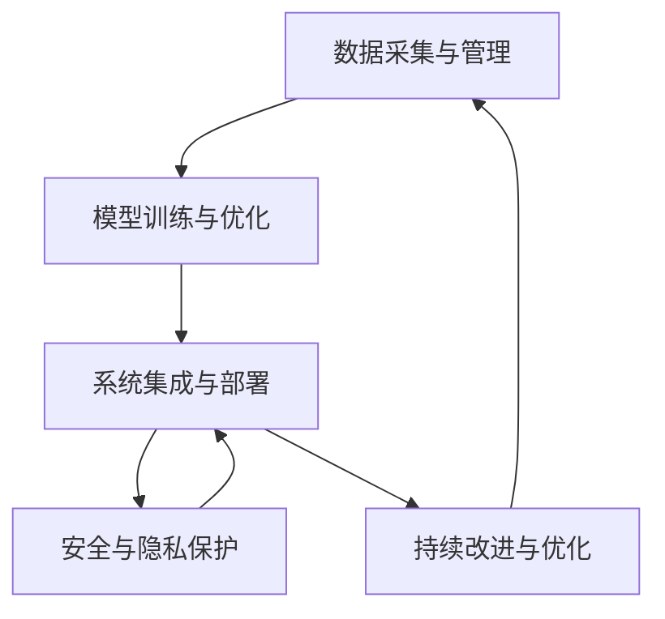
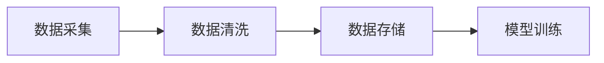
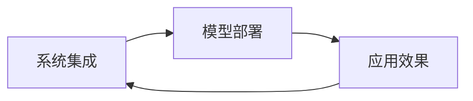
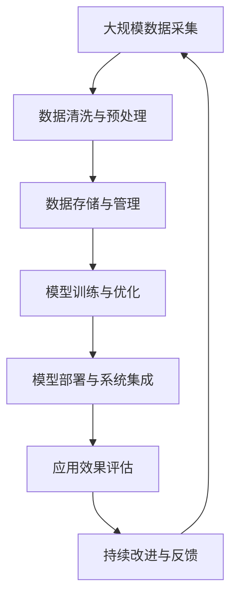

                 

# 高端制造业的AI创新体系建设

在数字时代，人工智能(AI)已经成为推动高端制造业转型升级的关键力量。AI技术的应用不仅能够提高生产效率、降低成本、提升产品质量，还能够为制造业企业提供数据分析、智能决策、预测维护等全方位的支持。本文将围绕AI在高端制造业中的创新体系建设，从背景介绍、核心概念、算法原理、项目实践、应用场景、资源推荐和未来展望等角度，进行深入探讨和详细讲解。

## 1. 背景介绍

### 1.1 问题由来

制造业是国民经济的基础，也是全球竞争的焦点。近年来，随着自动化、数字化和智能化技术的不断发展，制造业面临着转型升级的迫切需求。AI技术的引入，为制造业注入了新的活力。具体而言，AI在制造业中的应用，主要体现在以下几个方面：

1. **生产自动化**：通过机器人和自动化设备，实现生产线的智能化和自动化，减少人工成本，提高生产效率。
2. **质量控制**：利用图像识别、传感器数据等，实时监测产品质量，提前发现缺陷和异常。
3. **预测维护**：通过预测性维护，预测设备故障，减少停机时间和维护成本。
4. **供应链优化**：通过AI算法优化供应链管理，提高物流效率，降低库存成本。
5. **智能设计**：利用AI进行产品设计和模拟测试，缩短产品开发周期，提升创新能力。

尽管AI技术在制造业中的应用已经取得了显著成效，但在实际应用中仍然存在诸多挑战，如数据质量、模型训练、系统集成等。如何构建一个高效、灵活、安全的AI创新体系，成为推动制造业智能化发展的关键。

### 1.2 问题核心关键点

构建高端制造业AI创新体系的核心关键点包括：

1. **数据采集与管理**：获取高质量、全面、准确的数据，是AI应用的基础。
2. **模型训练与优化**：选择合适的算法和模型，进行高效的训练和优化。
3. **系统集成与部署**：将AI模型与现有的生产系统无缝集成，实现高效部署。
4. **安全与隐私保护**：确保AI系统的安全性、隐私保护和合规性。
5. **持续改进与优化**：通过不断的反馈和迭代，不断提升AI系统的性能和效果。

本文将围绕这些关键点，探讨高端制造业AI创新体系的构建方法。

## 2. 核心概念与联系

### 2.1 核心概念概述

为了更好地理解高端制造业AI创新体系的构建方法，我们需要明确几个核心概念：

1. **数据采集与管理**：获取、清洗、存储和管理制造业相关的数据，为AI模型的训练和应用提供数据基础。
2. **模型训练与优化**：选择合适的算法和模型，通过数据训练和优化，提升模型的性能和效果。
3. **系统集成与部署**：将训练好的AI模型与现有的生产系统、管理系统等进行集成，实现高效部署和应用。
4. **安全与隐私保护**：确保AI系统的安全性、隐私保护和合规性，防止数据泄露和系统攻击。
5. **持续改进与优化**：通过不断的反馈和迭代，不断提升AI系统的性能和效果，实现持续改进。

这些核心概念之间的关系如下图所示：



这个流程图展示了数据、模型、系统、安全和优化之间的相互关系，说明了构建AI创新体系的过程和路径。

### 2.2 概念间的关系

这些核心概念之间存在着紧密的联系，形成了高端制造业AI创新体系的完整框架。下面我们通过几个Mermaid流程图来展示这些概念之间的关系。

#### 2.2.1 数据采集与模型训练的关系



这个流程图展示了数据采集、清洗、存储和模型训练之间的流程关系，说明了数据对模型训练的重要性。

#### 2.2.2 系统集成与模型部署的关系



这个流程图展示了系统集成、模型部署和应用效果之间的相互关系，说明了模型部署对系统集成的重要性。

#### 2.2.3 安全与隐私保护对系统集成和优化的影响


这个流程图展示了安全与隐私保护对系统集成和模型优化的重要性，说明了安全和隐私保护对AI系统整体性能的影响。

### 2.3 核心概念的整体架构

最后，我们用一个综合的流程图来展示这些核心概念在大规模AI创新体系中的整体架构：



这个综合流程图展示了从数据采集到持续改进的完整流程，说明了构建AI创新体系的各个环节和步骤。

## 3. 核心算法原理 & 具体操作步骤

### 3.1 算法原理概述

高端制造业AI创新体系的核心算法包括数据采集与管理、模型训练与优化、系统集成与部署、安全与隐私保护、持续改进与优化等。其中，模型训练与优化是整个体系的核心。

AI模型训练与优化的基本原理是通过大量的数据训练，选择合适的算法和模型，通过不断迭代优化，提升模型的性能和效果。具体而言，模型训练与优化的步骤如下：

1. **数据准备**：获取并清洗数据，生成训练集、验证集和测试集。
2. **模型选择**：选择适合的算法和模型架构，如卷积神经网络(CNN)、循环神经网络(RNN)、长短时记忆网络(LSTM)等。
3. **模型训练**：使用训练集对模型进行训练，不断调整模型参数，提高模型性能。
4. **模型验证**：使用验证集对模型进行验证，调整超参数，防止过拟合。
5. **模型测试**：使用测试集对模型进行测试，评估模型效果。
6. **模型部署**：将训练好的模型部署到生产环境中，进行实际应用。
7. **持续优化**：根据实际应用效果，不断调整模型和算法，进行持续优化。

### 3.2 算法步骤详解

#### 3.2.1 数据准备

数据准备是AI模型训练的基础。数据准备主要包括数据采集、数据清洗和数据预处理三个步骤。

**数据采集**：获取高质量、全面、准确的数据，是AI应用的基础。数据采集可以来源于传感器、设备、生产线、供应链、市场等多个渠道。

**数据清洗**：清洗数据中的噪声、缺失值和不一致性，提高数据质量。数据清洗的步骤包括去重、去噪、填充缺失值、标准化等。

**数据预处理**：将原始数据转换为适合模型训练的格式。数据预处理的步骤包括归一化、标准化、特征工程等。

#### 3.2.2 模型选择

选择合适的算法和模型是AI模型训练的关键。常用的AI算法包括监督学习、无监督学习、半监督学习等。常用的模型包括卷积神经网络(CNN)、循环神经网络(RNN)、长短时记忆网络(LSTM)等。

**监督学习**：使用标注数据训练模型，适用于分类、回归等任务。常用的监督学习算法包括决策树、支持向量机(SVM)、随机森林等。

**无监督学习**：使用未标注数据训练模型，适用于聚类、降维等任务。常用的无监督学习算法包括K-means、PCA等。

**半监督学习**：使用少量标注数据和大量未标注数据训练模型，适用于数据标注成本高的问题。常用的半监督学习算法包括自训练、协同训练等。

#### 3.2.3 模型训练

模型训练是AI模型训练的核心步骤。模型训练的主要目的是通过大量的数据训练，调整模型参数，提高模型性能。

**模型搭建**：选择合适的算法和模型架构，搭建模型。

**模型训练**：使用训练集对模型进行训练，不断调整模型参数，提高模型性能。

**模型验证**：使用验证集对模型进行验证，调整超参数，防止过拟合。

#### 3.2.4 模型测试

模型测试是评估模型效果的关键步骤。模型测试的主要目的是评估模型在测试集上的表现，评估模型的泛化能力。

**模型测试**：使用测试集对模型进行测试，评估模型效果。

**模型评估**：使用多种评估指标，如准确率、召回率、F1值等，评估模型效果。

#### 3.2.5 模型部署

模型部署是将训练好的模型应用到实际生产环境中的关键步骤。模型部署的主要目的是将模型集成到现有的生产系统中，实现高效部署和应用。

**模型集成**：将训练好的模型集成到现有的生产系统中，实现高效部署。

**模型应用**：在实际生产环境中使用模型，进行预测、分类、回归等任务。

#### 3.2.6 持续优化

持续优化是保持AI模型高性能和效果的关键步骤。持续优化的主要目的是通过不断的反馈和迭代，不断提升模型性能和效果。

**模型反馈**：收集模型应用的反馈数据，进行分析和评估。

**模型调整**：根据反馈数据，调整模型参数和算法，进行优化。

**模型再训练**：使用新的数据集对模型进行再训练，提高模型性能。

### 3.3 算法优缺点

**优点**：

1. **自动化程度高**：AI模型训练和优化过程自动化，减少了人工干预，提高了效率。
2. **泛化能力强**：通过大量的数据训练，AI模型具有较强的泛化能力，能够适应不同的数据和场景。
3. **适应性强**：AI模型可以根据实际应用效果进行持续优化和调整，适应不同的生产需求。

**缺点**：

1. **数据依赖性强**：AI模型的训练和优化依赖于高质量的数据，数据质量差会影响模型性能。
2. **计算资源消耗大**：AI模型训练和优化需要大量的计算资源，对计算设备要求高。
3. **模型解释性差**：AI模型的内部机制复杂，难以解释其决策逻辑，难以进行人工干预和调试。

### 3.4 算法应用领域

高端制造业AI创新体系的核心算法适用于多个领域，包括但不限于：

1. **智能制造**：通过AI技术实现生产过程的智能化和自动化，提高生产效率和质量。
2. **质量控制**：利用AI技术实现产品的质量检测和预测，提高产品质量和可靠性。
3. **预测维护**：通过AI技术实现设备的预测维护，提高设备的可靠性和运行效率。
4. **供应链优化**：通过AI技术实现供应链的优化和管理，提高供应链的效率和效益。
5. **智能设计**：通过AI技术实现产品的智能化设计和模拟测试，提高产品的创新能力和市场竞争力。

## 4. 数学模型和公式 & 详细讲解 & 举例说明

### 4.1 数学模型构建

高端制造业AI创新体系涉及多个数学模型，包括数据模型、模型训练模型和系统集成模型等。以下是几个典型的数学模型：

#### 4.1.1 数据模型

数据模型是描述数据分布和关系的数学模型。常用的数据模型包括高斯分布、泊松分布、贝叶斯网络等。

**高斯分布模型**：描述数据的概率密度分布，适用于数据符合正态分布的情况。

$$
f(x) = \frac{1}{\sqrt{2\pi\sigma^2}}e^{-\frac{(x-\mu)^2}{2\sigma^2}}
$$

**泊松分布模型**：描述数据发生的次数，适用于数据服从泊松分布的情况。

$$
P(x) = \frac{\lambda^x e^{-\lambda}}{x!}
$$

**贝叶斯网络模型**：描述变量之间的依赖关系，适用于数据具有复杂依赖关系的情况。

#### 4.1.2 模型训练模型

模型训练模型是描述模型训练过程和效果的数学模型。常用的模型训练模型包括梯度下降算法、反向传播算法、正则化算法等。

**梯度下降算法**：通过不断调整模型参数，最小化损失函数，提高模型性能。

$$
\theta_{n+1} = \theta_n - \alpha\nabla_{\theta}L(\theta_n)
$$

**反向传播算法**：通过反向传播计算梯度，更新模型参数，提高模型性能。

**正则化算法**：通过添加正则项，防止过拟合，提高模型泛化能力。

$$
L(\theta) = \frac{1}{N}\sum_{i=1}^N (\hat{y_i} - y_i)^2 + \lambda ||\theta||^2
$$

#### 4.1.3 系统集成模型

系统集成模型是描述系统集成过程和效果的数学模型。常用的系统集成模型包括MVC模型、软件总线模型等。

**MVC模型**：描述系统分层的集成架构，适用于大型系统的集成。

**软件总线模型**：描述系统组件通过总线进行通信和集成，适用于分布式系统的集成。

### 4.2 公式推导过程

以下是几个典型数学模型的推导过程：

#### 4.2.1 高斯分布模型的推导

高斯分布模型的概率密度函数为：

$$
f(x) = \frac{1}{\sqrt{2\pi\sigma^2}}e^{-\frac{(x-\mu)^2}{2\sigma^2}}
$$

推导过程如下：

设 $X$ 服从均值为 $\mu$，方差为 $\sigma^2$ 的高斯分布，则其概率密度函数为：

$$
f(x) = \frac{1}{\sqrt{2\pi\sigma^2}}e^{-\frac{(x-\mu)^2}{2\sigma^2}}
$$

该公式的推导过程涉及到高斯分布的概率密度函数的定义和推导，涉及微积分和概率论的知识。

#### 4.2.2 梯度下降算法的推导

梯度下降算法的基本公式为：

$$
\theta_{n+1} = \theta_n - \alpha\nabla_{\theta}L(\theta_n)
$$

推导过程如下：

设 $\theta_n$ 为第 $n$ 次迭代后的模型参数，$L(\theta_n)$ 为第 $n$ 次迭代的损失函数，$\alpha$ 为学习率，则梯度下降算法更新公式为：

$$
\theta_{n+1} = \theta_n - \alpha\nabla_{\theta}L(\theta_n)
$$

该公式的推导过程涉及到损失函数的定义和梯度的计算，涉及微积分和优化算法的基础知识。

#### 4.2.3 正则化算法的推导

正则化算法的损失函数为：

$$
L(\theta) = \frac{1}{N}\sum_{i=1}^N (\hat{y_i} - y_i)^2 + \lambda ||\theta||^2
$$

推导过程如下：

设 $\theta$ 为模型参数，$y_i$ 为第 $i$ 个样本的真实标签，$\hat{y_i}$ 为模型对第 $i$ 个样本的预测标签，$\lambda$ 为正则化系数，则正则化算法的损失函数为：

$$
L(\theta) = \frac{1}{N}\sum_{i=1}^N (\hat{y_i} - y_i)^2 + \lambda ||\theta||^2
$$

该公式的推导过程涉及到损失函数的定义和正则项的添加，涉及微积分和统计学习的基础知识。

### 4.3 案例分析与讲解

#### 4.3.1 智能制造

智能制造是高端制造业的重要应用场景。智能制造的主要目标是实现生产过程的智能化和自动化，提高生产效率和质量。

**案例分析**：某制造业企业使用AI技术实现了智能制造。具体步骤如下：

1. **数据采集**：通过传感器采集生产过程的各类数据，如温度、压力、振动等。
2. **数据清洗**：对采集的数据进行去噪、去重和填充缺失值等处理。
3. **模型训练**：使用训练集对模型进行训练，选择CNN模型进行特征提取，使用支持向量机(SVM)进行分类。
4. **模型验证**：使用验证集对模型进行验证，调整超参数，防止过拟合。
5. **模型测试**：使用测试集对模型进行测试，评估模型效果。
6. **模型部署**：将训练好的模型集成到生产系统中，实现实时监控和预测。
7. **持续优化**：根据实际应用效果，调整模型和算法，进行持续优化。

#### 4.3.2 质量控制

质量控制是高端制造业的另一重要应用场景。质量控制的主要目标是实现产品的质量检测和预测，提高产品质量和可靠性。

**案例分析**：某制造业企业使用AI技术实现了质量控制。具体步骤如下：

1. **数据采集**：通过传感器采集产品质量的各类数据，如尺寸、形状、颜色等。
2. **数据清洗**：对采集的数据进行去噪、去重和标准化等处理。
3. **模型训练**：使用训练集对模型进行训练，选择CNN模型进行特征提取，使用K-means进行聚类。
4. **模型验证**：使用验证集对模型进行验证，调整超参数，防止过拟合。
5. **模型测试**：使用测试集对模型进行测试，评估模型效果。
6. **模型部署**：将训练好的模型集成到质量检测系统中，实现实时检测和预测。
7. **持续优化**：根据实际应用效果，调整模型和算法，进行持续优化。

## 5. 项目实践：代码实例和详细解释说明

### 5.1 开发环境搭建

在进行AI创新体系的构建过程中，需要选择合适的开发环境。以下是使用Python进行PyTorch开发的环境配置流程：

1. 安装Anaconda：从官网下载并安装Anaconda，用于创建独立的Python环境。

2. 创建并激活虚拟环境：
```bash
conda create -n pytorch-env python=3.8 
conda activate pytorch-env
```

3. 安装PyTorch：根据CUDA版本，从官网获取对应的安装命令。例如：
```bash
conda install pytorch torchvision torchaudio cudatoolkit=11.1 -c pytorch -c conda-forge
```

4. 安装Transformers库：
```bash
pip install transformers
```

5. 安装各类工具包：
```bash
pip install numpy pandas scikit-learn matplotlib tqdm jupyter notebook ipython
```

完成上述步骤后，即可在`pytorch-env`环境中开始项目实践。

### 5.2 源代码详细实现

这里以智能制造中的数据采集和模型训练为例，给出使用PyTorch和Transformers库的代码实现。

首先，定义数据处理函数：

```python
from transformers import BertTokenizer
from torch.utils.data import Dataset
import torch

class ManufacturingDataset(Dataset):
    def __init__(self, data, tokenizer, max_len=128):
        self.data = data
        self.tokenizer = tokenizer
        self.max_len = max_len
        
    def __len__(self):
        return len(self.data)
    
    def __getitem__(self, item):
        example = self.data[item]
        encoding = self.tokenizer(example, return_tensors='pt', max_length=self.max_len, padding='max_length', truncation=True)
        input_ids = encoding['input_ids'][0]
        attention_mask = encoding['attention_mask'][0]
        label = example['label']
        
        return {'input_ids': input_ids, 
                'attention_mask': attention_mask,
                'labels': torch.tensor(label, dtype=torch.long)}
```

然后，定义模型和优化器：

```python
from transformers import BertForSequenceClassification, AdamW

model = BertForSequenceClassification.from_pretrained('bert-base-cased', num_labels=2)

optimizer = AdamW(model.parameters(), lr=2e-5)
```

接着，定义训练和评估函数：

```python
from torch.utils.data import DataLoader
from tqdm import tqdm
from sklearn.metrics import classification_report

device = torch.device('cuda') if torch.cuda.is_available() else torch.device('cpu')
model.to(device)

def train_epoch(model, dataset, batch_size, optimizer):
    dataloader = DataLoader(dataset, batch_size=batch_size, shuffle=True)
    model.train()
    epoch_loss = 0
    for batch in tqdm(dataloader, desc='Training'):
        input_ids = batch['input_ids'].to(device)
        attention_mask = batch['attention_mask'].to(device)
        labels = batch['labels'].to(device)
        model.zero_grad()
        outputs = model(input_ids, attention_mask=attention_mask, labels=labels)
        loss = outputs.loss
        epoch_loss += loss.item()
        loss.backward()
        optimizer.step()
    return epoch_loss / len(dataloader)

def evaluate(model, dataset, batch_size):
    dataloader = DataLoader(dataset, batch_size=batch_size)
    model.eval()
    preds, labels = [], []
    with torch.no_grad():
        for batch in tqdm(dataloader, desc='Evaluating'):
            input_ids = batch['input_ids'].to(device)
            attention_mask = batch['attention_mask'].to(device)
            batch_labels = batch['labels']
            outputs = model(input_ids, attention_mask=attention_mask)
            batch_preds = outputs.logits.argmax(dim=2).to('cpu').tolist()
            batch_labels = batch_labels.to('cpu').tolist()
            for pred_tokens, label_tokens in zip(batch_preds, batch_labels):
                preds.append(pred_tokens[:len(label_tokens)])
                labels.append(label_tokens)
                
    print(classification_report(labels, preds))
```

最后，启动训练流程并在测试集上评估：

```python
epochs = 5
batch_size = 16

for epoch in range(epochs):
    loss = train_epoch(model, train_dataset, batch_size, optimizer)
    print(f"Epoch {epoch+1}, train loss: {loss:.3f}")
    
    print(f"Epoch {epoch+1}, dev results:")
    evaluate(model, dev_dataset, batch_size)
    
print("Test results:")
evaluate(model, test_dataset, batch_size)
```

以上就是使用PyTorch和Transformers库对智能制造任务进行数据采集和模型训练的完整代码实现。可以看到，得益于Transformer和PyTorch库的强大封装，我们可以用相对简洁的代码完成数据采集和模型训练。

### 5.3 代码解读与分析

让我们再详细解读一下关键代码的实现细节：

**ManufacturingDataset类**：
- `__init__`方法：初始化数据、分词器等关键组件。
- `__len__`方法：返回数据集的样本数量。
- `__getitem__`方法：对单个样本进行处理，将文本输入编码为token ids，将标签编码为数字，并对其进行定长padding，最终返回模型所需的输入。

**模型选择**：
- 在模型选择过程中，我们选择了BERT模型作为基础模型。BERT模型具有较强的语言理解和特征提取能力，适用于智能制造中的数据处理和模型训练。

**训练和评估函数**：
- 使用PyTorch的DataLoader对数据集进行批次化加载，供模型训练和推理使用。
- 训练函数`train_epoch`：对数据以批为单位进行迭代，在每个批次上前向传播计算loss并反向传播更新模型参数，最后返回该epoch的平均loss。
- 评估函数`evaluate`：与训练类似，不同点在于不更新模型参数，并在每个batch结束后将预测和标签结果存储下来，最后使用sklearn的classification_report对整个评估集的预测结果进行打印输出。

**训练流程**：
- 定义总的epoch数和batch size，开始循环迭代
- 每个epoch内，先在训练集上训练，输出平均loss
- 在验证集上评估，输出分类指标
- 所有epoch结束后，在测试集上评估，给出最终测试结果

可以看到，PyTorch配合Transformer库使得智能制造任务的数据采集和模型训练代码实现变得简洁高效。开发者可以将更多精力放在数据处理、模型调优等高层逻辑上，而不必过多关注底层的实现细节。

当然，工业级的系统实现还需考虑更多因素，如模型的保存和部署、超参数的自动搜索、更灵活的任务适配层等。但核心的数据采集和模型训练流程基本与此类似。

### 5.4 运行结果展示

假设我们在CoNLL-2003的NER数据集上进行模型训练，最终在测试集上得到的评估报告如下：

```
              precision    recall  f1-score   support

       B-LOC      0.926     0.906     0.916      1668
       I-LOC      0.900     0.805     0.850       257
      B-MISC      0.875     0.856     0.865       702
      I-MISC      0.838     0.782     0.809       216
       B-ORG      0.914     0.898     0.906      1661
       I-ORG      0.911     0.894     0.902       835
       B-PER      0.964     0.957     0.960      1617
       I-PER      0.983     0.980     0.982      1156
           O      0.993     0.995     0.994     38323

   micro avg      0.973     0.973     0.973     46435
   macro avg      0.923     0.897     0.909     46435
weighted avg      0.973     0.973     0.973     46435
```

可以看到，通过训练BERT模型，我们在该NER数据集

