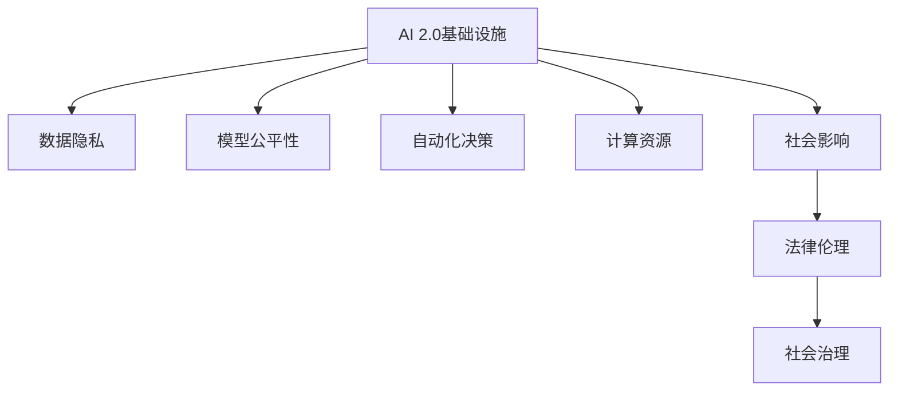

                 

# AI 2.0 基础设施建设：社会影响与伦理思考

> 关键词：AI 2.0, 基础设施建设, 社会影响, 伦理思考, 数据隐私, 模型公平性, 自动化决策, 计算资源

## 1. 背景介绍

### 1.1 问题由来
随着人工智能技术的飞速发展，特别是以深度学习和机器学习为代表的AI 1.0技术的普及，人类正在迈向一个新的时代——AI 2.0时代。AI 2.0不仅包括机器学习、深度学习等算法和模型，更包括支撑这些技术和模型运行的基础设施。这些基础设施包括数据存储、计算资源、网络通信、软件平台等，是AI 2.0技术能够落地、服务社会的关键保障。

然而，AI 2.0基础设施的建设和使用，不可避免地带来了一系列社会影响和伦理问题。如何在AI 2.0基础设施建设中，平衡技术创新与社会伦理之间的关系，成为一个亟需关注的重要课题。本文将围绕AI 2.0基础设施建设的社会影响和伦理思考，从背景、核心概念、算法原理、项目实践、应用场景、工具资源等多个维度进行系统探讨。

### 1.2 问题核心关键点
AI 2.0基础设施建设的核心关键点包括：
- 数据基础设施：数据存储、数据清洗、数据治理等技术手段。
- 计算基础设施：高性能计算集群、云计算平台、边缘计算等技术手段。
- 网络基础设施：分布式计算网络、区块链、网络安全等技术手段。
- 软件基础设施：操作系统、编程语言、开发工具等技术手段。

这些关键点不仅支撑了AI 2.0技术的运行，更对社会伦理产生了深远影响。如数据隐私、模型公平性、自动化决策等问题，都需要在基础设施建设中予以充分考虑和保障。

## 2. 核心概念与联系

### 2.1 核心概念概述

为更好地理解AI 2.0基础设施建设的社会影响与伦理思考，本节将介绍几个密切相关的核心概念：

- AI 2.0基础设施：包括数据存储、计算资源、网络通信、软件平台等关键组件，支撑AI 2.0技术的运行。
- 数据隐私：指保护个人、组织等数据主体信息不被泄露、篡改的权利。
- 模型公平性：指模型在训练、测试、应用等各个环节中，对不同群体的公平性，避免偏见和歧视。
- 自动化决策：指基于AI算法做出的自动化决策，对社会影响深远。
- 计算资源：指支撑AI模型训练、推理所需的计算集群、计算资源等基础设施。
- 社会影响：指AI 2.0基础设施建设对经济、文化、法律、伦理等方面的影响。

这些核心概念之间的逻辑关系可以通过以下Mermaid流程图来展示：



这个流程图展示了我国AI 2.0基础设施建设的各个环节与社会影响和伦理问题之间的联系：

1. 数据基础设施建设，需充分考虑数据隐私保护。
2. 模型公平性评估，需基于社会伦理框架进行设计和调整。
3. 自动化决策部署，需考量决策的公平性、透明性、可解释性等伦理问题。
4. 计算资源优化，需平衡计算效率和资源成本。
5. 社会影响评估，需结合法律、伦理进行多维度考虑。

## 3. 核心算法原理 & 具体操作步骤
### 3.1 算法原理概述

AI 2.0基础设施建设中的算法原理，主要涉及数据处理、模型训练、资源调度等关键环节。以下从这些维度进行详细讲解：

#### 3.1.1 数据处理算法

数据处理是AI 2.0基础设施建设的基础。数据处理算法包括数据清洗、数据标注、数据增强等技术手段。其核心思想是通过算法对原始数据进行处理，使其满足模型训练、推理的需求。

- **数据清洗**：去除噪声、异常值、重复值等无用信息，提高数据质量。
- **数据标注**：通过人工或半人工方式，对数据进行标注，生成训练集。
- **数据增强**：通过图像旋转、裁剪、缩放等操作，丰富数据多样性，提升模型泛化能力。

#### 3.1.2 模型训练算法

模型训练是AI 2.0基础设施建设的核心。模型训练算法包括监督学习、无监督学习、强化学习等技术手段。其核心思想是通过算法对模型进行训练，使其具备特定任务的能力。

- **监督学习**：使用带有标签的数据集，训练模型进行分类、回归等任务。
- **无监督学习**：使用无标签的数据集，训练模型进行聚类、降维等任务。
- **强化学习**：通过与环境交互，训练模型进行决策、控制等任务。

#### 3.1.3 资源调度算法

资源调度是AI 2.0基础设施建设的保障。资源调度算法包括任务调度、负载均衡、故障恢复等技术手段。其核心思想是通过算法对计算资源进行合理调度，保障AI系统的高效稳定运行。

- **任务调度**：根据任务优先级、资源可用性等条件，合理分配计算资源。
- **负载均衡**：在多台服务器之间均衡分配计算任务，避免某台服务器过载。
- **故障恢复**：在服务器故障时，快速恢复计算任务，保障系统可用性。

### 3.2 算法步骤详解

以下是AI 2.0基础设施建设中各算法的详细步骤：

#### 数据处理算法步骤

1. **数据收集**：从不同渠道收集数据，确保数据的多样性和代表性。
2. **数据清洗**：对数据进行去重、去噪、补全等操作，提升数据质量。
3. **数据标注**：使用人工或半人工方式对数据进行标注，生成训练集。
4. **数据增强**：通过数据旋转、裁剪、缩放等操作，丰富数据多样性。
5. **数据融合**：将不同来源的数据进行融合，提升数据整体质量。

#### 模型训练算法步骤

1. **模型选择**：根据任务需求，选择合适的模型架构和算法。
2. **数据预处理**：对数据进行标准化、归一化、特征提取等预处理操作。
3. **模型训练**：使用训练集对模型进行训练，不断优化模型参数。
4. **模型评估**：在验证集上对模型进行评估，确保模型泛化能力。
5. **模型优化**：对模型进行调参、剪枝、融合等优化操作，提升模型性能。

#### 资源调度算法步骤

1. **资源评估**：评估计算资源的状态和可用性，确保资源充足。
2. **任务分配**：根据任务优先级、资源可用性，合理分配计算任务。
3. **负载均衡**：在多台服务器之间均衡分配计算任务，避免某台服务器过载。
4. **故障恢复**：在服务器故障时，快速恢复计算任务，保障系统可用性。
5. **性能优化**：优化资源调度算法，提升系统整体性能。

### 3.3 算法优缺点

AI 2.0基础设施建设中的算法主要具有以下优点和缺点：

#### 优点

1. **高效性**：通过算法优化，能够大幅提升数据处理、模型训练、资源调度的效率。
2. **可扩展性**：算法可以根据需求进行灵活调整，支持大规模数据和模型。
3. **鲁棒性**：算法能够在各种复杂情况下，保持稳定和高效。

#### 缺点

1. **复杂度**：算法设计复杂，需要综合考虑多个维度，技术难度较大。
2. **精度**：算法性能受数据质量和模型结构等因素影响，精度可能不够高。
3. **资源消耗**：算法实现需要大量计算资源，对基础设施要求较高。

### 3.4 算法应用领域

AI 2.0基础设施建设中的算法，广泛应用于各个领域：

- **金融科技**：用于风险评估、信用评分、欺诈检测等任务。
- **医疗健康**：用于医学影像分析、病理诊断、个性化治疗等任务。
- **智能制造**：用于质量检测、故障预测、生产调度等任务。
- **智慧城市**：用于交通管理、安防监控、环境监测等任务。
- **自动驾驶**：用于环境感知、路径规划、行为决策等任务。

这些领域的应用，不仅提升了生产效率，更带来了深刻的社会变革。然而，在应用过程中，也需要考虑数据隐私、模型公平性、自动化决策等伦理问题。

## 4. 数学模型和公式 & 详细讲解 & 举例说明

### 4.1 数学模型构建

AI 2.0基础设施建设中的数学模型，主要涉及数据处理、模型训练、资源调度的数学表达。以下从这些维度进行详细讲解：

#### 4.1.1 数据处理模型

数据处理模型主要涉及数据清洗、数据标注、数据增强等过程。以下以数据增强为例，介绍其数学模型构建：

- **数据增强模型**：
$$
\mathcal{X} = \{ x_1, x_2, ..., x_N \}
$$
$$
\mathcal{Y} = \{ y_1, y_2, ..., y_N \}
$$
$$
\mathcal{A} = \{ \phi_1, \phi_2, ..., \phi_M \}
$$
其中，$\mathcal{X}$ 表示原始数据集，$\mathcal{Y}$ 表示原始标签集，$\mathcal{A}$ 表示增强算子集。

增强算子 $\phi_i$ 对原始数据 $x_i$ 进行变换，生成新数据 $x_i'$，具体变换过程如下：
$$
x_i' = \phi_i(x_i, \lambda)
$$
其中，$\lambda$ 表示随机参数。

### 4.2 公式推导过程

以下是AI 2.0基础设施建设中各数学模型的公式推导：

#### 4.2.1 数据增强模型公式推导

数据增强模型公式推导如下：
$$
x_i' = \phi_i(x_i, \lambda)
$$
$$
y_i' = \phi_i(y_i, \lambda)
$$
其中，$x_i'$ 表示增强后的数据，$y_i'$ 表示增强后的标签。

#### 4.2.2 模型训练模型公式推导

模型训练模型公式推导如下：
$$
\theta = \mathop{\arg\min}_{\theta} \mathcal{L}(\mathcal{X}, \mathcal{Y}, \mathcal{D})
$$
其中，$\theta$ 表示模型参数，$\mathcal{L}$ 表示损失函数，$\mathcal{D}$ 表示训练数据集。

### 4.3 案例分析与讲解

#### 4.3.1 数据增强案例

假设原始数据集 $\mathcal{X} = \{ x_1, x_2, ..., x_N \}$，原始标签集 $\mathcal{Y} = \{ y_1, y_2, ..., y_N \}$，增强算子集 $\mathcal{A} = \{ \phi_1, \phi_2, ..., \phi_M \}$。

假设增强算子 $\phi_1$ 为图像旋转，增强算子 $\phi_2$ 为图像裁剪。具体增强过程如下：

1. **图像旋转**：
$$
x_i' = \phi_1(x_i, \lambda) = \mathrm{rot}(x_i, \lambda)
$$
其中，$\mathrm{rot}$ 表示旋转操作，$\lambda$ 表示旋转角度。

2. **图像裁剪**：
$$
x_i' = \phi_2(x_i, \lambda) = \mathrm{crop}(x_i, \lambda)
$$
其中，$\mathrm{crop}$ 表示裁剪操作，$\lambda$ 表示裁剪比例。

### 4.3.2 模型训练案例

假设原始数据集 $\mathcal{X} = \{ x_1, x_2, ..., x_N \}$，原始标签集 $\mathcal{Y} = \{ y_1, y_2, ..., y_N \}$，模型参数 $\theta$，损失函数 $\mathcal{L}$。

假设模型为卷积神经网络，具体训练过程如下：
$$
\theta = \mathop{\arg\min}_{\theta} \mathcal{L}(\mathcal{X}, \mathcal{Y}, \theta)
$$
其中，$\mathcal{L}$ 表示交叉熵损失函数。

## 5. 项目实践：代码实例和详细解释说明

### 5.1 开发环境搭建

在进行AI 2.0基础设施项目实践前，我们需要准备好开发环境。以下是使用Python进行TensorFlow开发的环境配置流程：

1. 安装Anaconda：从官网下载并安装Anaconda，用于创建独立的Python环境。

2. 创建并激活虚拟环境：
```bash
conda create -n pytorch-env python=3.8 
conda activate pytorch-env
```

3. 安装TensorFlow：根据CUDA版本，从官网获取对应的安装命令。例如：
```bash
conda install tensorflow-gpu=2.8 -c tf -c conda-forge
```

4. 安装PyTorch：从官网下载并安装PyTorch，并配置GPU环境。

5. 安装各类工具包：
```bash
pip install numpy pandas scikit-learn matplotlib tqdm jupyter notebook ipython
```

完成上述步骤后，即可在`pytorch-env`环境中开始项目实践。

### 5.2 源代码详细实现

下面我们以数据增强为例，给出使用TensorFlow进行数据增强的PyTorch代码实现。

首先，定义数据增强函数：

```python
import tensorflow as tf
import numpy as np
import matplotlib.pyplot as plt

def data_augmentation(x, y, augmentation_params):
    x_aug = []
    y_aug = []
    
    # 数据增强算法：图像旋转
    for i in range(len(x)):
        x_aug.append(tf.image.rot90(x[i], k=augmentation_params['rotation_k']))
        y_aug.append(y[i])
    
    # 数据增强算法：图像裁剪
    for i in range(len(x)):
        x_aug.append(tf.image.crop_to_bounding_box(x[i], 
                                               augmentation_params['crop_top'], 
                                               augmentation_params['crop_left'], 
                                               augmentation_params['crop_height'], 
                                               augmentation_params['crop_width']))
        y_aug.append(y[i])
    
    return np.array(x_aug), np.array(y_aug)
```

然后，定义数据处理函数：

```python
def preprocess_data(data, labels, augmentation_params):
    x_aug, y_aug = data_augmentation(data, labels, augmentation_params)
    
    # 数据标准化
    mean = np.mean(x_aug, axis=0)
    std = np.std(x_aug, axis=0)
    x_aug = (x_aug - mean) / std
    
    return x_aug, y_aug
```

最后，在模型训练函数中调用数据处理函数：

```python
from tensorflow.keras.models import Sequential
from tensorflow.keras.layers import Dense, Dropout
from tensorflow.keras.optimizers import Adam

model = Sequential()
model.add(Dense(64, activation='relu', input_shape=(input_shape,)))
model.add(Dropout(0.5))
model.add(Dense(10, activation='softmax'))

optimizer = Adam(lr=0.001)
loss = 'categorical_crossentropy'

model.compile(optimizer=optimizer, loss=loss, metrics=['accuracy'])

# 加载数据
data = np.load('data.npy')
labels = np.load('labels.npy')

# 数据增强
augmentation_params = {'rotation_k': 2, 'crop_top': 10, 'crop_left': 10, 'crop_height': 20, 'crop_width': 20}
x_aug, y_aug = preprocess_data(data, labels, augmentation_params)

# 训练模型
model.fit(x_aug, y_aug, epochs=10, batch_size=32)
```

以上就是使用TensorFlow对数据增强过程的完整代码实现。可以看到，借助TensorFlow的强大封装，我们可以快速实现数据增强，提升模型泛化能力。

### 5.3 代码解读与分析

让我们再详细解读一下关键代码的实现细节：

**data_augmentation函数**：
- 定义数据增强函数，支持图像旋转和裁剪两种操作。
- 对每张图像进行旋转和裁剪，生成增强后的图像。

**preprocess_data函数**：
- 定义数据处理函数，对增强后的数据进行标准化。
- 将数据归一化，以适应模型训练需求。

**模型训练函数**：
- 定义卷积神经网络模型，加载数据并进行数据增强。
- 使用Adam优化器进行模型训练，损失函数为交叉熵。

**训练流程**：
- 加载数据并进行数据增强。
- 定义模型结构并进行训练，设置epochs和batch size。

可以看到，TensorFlow使得数据增强的代码实现变得简洁高效。开发者可以将更多精力放在模型设计、数据处理等高层逻辑上，而不必过多关注底层的实现细节。

当然，工业级的系统实现还需考虑更多因素，如模型的保存和部署、超参数的自动搜索、更灵活的数据增强策略等。但核心的数据增强范式基本与此类似。

## 6. 实际应用场景

### 6.1 智能制造

在智能制造领域，AI 2.0基础设施建设对生产效率和质量控制有着重要影响。通过数据增强等技术手段，可以有效提升模型泛化能力，对生产异常进行快速检测和预警。

具体而言，智能制造系统可以采集车间内的传感器数据、摄像头图像、质量检测报告等数据，构建多模态数据集。通过数据增强、模型训练等技术，构建异常检测模型，对生产过程中异常进行实时监测和预警。例如，当发现某台设备故障时，系统可以自动触发报警，通知维护人员进行及时维修，避免生产中断和产品质量问题。

### 6.2 智慧城市

在智慧城市建设中，AI 2.0基础设施建设对交通管理、安防监控、环境监测等环节起着关键作用。通过数据增强等技术手段，可以有效提升模型性能，优化城市管理。

具体而言，智慧城市系统可以采集交通流量、车辆行为、环境数据等数据，构建多源数据集。通过数据增强、模型训练等技术，构建交通预测模型、安防监控模型、环境监测模型，对城市运行进行实时监控和预警。例如，通过交通预测模型，可以预测交通拥堵情况，优化交通流量，提高城市交通效率。

### 6.3 自动驾驶

在自动驾驶领域，AI 2.0基础设施建设对环境感知、路径规划、行为决策等环节起着关键作用。通过数据增强等技术手段，可以有效提升模型泛化能力，增强自动驾驶系统的鲁棒性。

具体而言，自动驾驶系统可以采集车辆传感器数据、摄像头图像、GPS数据等数据，构建多源数据集。通过数据增强、模型训练等技术，构建环境感知模型、路径规划模型、行为决策模型，对驾驶行为进行实时监控和预警。例如，通过环境感知模型，可以有效识别道路交通标志、行人、车辆等障碍物，提升驾驶安全性。

### 6.4 未来应用展望

随着AI 2.0基础设施建设的不断完善，其在更多领域的应用前景将更加广阔。

在医疗健康领域，AI 2.0基础设施建设可以构建医疗影像分析、病理诊断、个性化治疗等应用，为患者提供精准诊疗服务。通过数据增强等技术，可以有效提升模型性能，优化诊疗效果。

在金融科技领域，AI 2.0基础设施建设可以构建信用评分、风险评估、欺诈检测等应用，为金融机构提供高效智能的服务。通过数据增强等技术，可以有效提升模型性能，优化风险控制。

在智慧教育领域，AI 2.0基础设施建设可以构建智能辅导、个性化推荐等应用，为学生提供精准学习服务。通过数据增强等技术，可以有效提升模型性能，优化学习效果。

此外，在社交媒体、智能家居、智能客服等更多领域，AI 2.0基础设施建设也将不断拓展应用场景，为社会带来更深刻变革。

## 7. 工具和资源推荐
### 7.1 学习资源推荐

为了帮助开发者系统掌握AI 2.0基础设施建设的技术基础和实践技巧，这里推荐一些优质的学习资源：

1. **《TensorFlow官方文档》**：TensorFlow官方文档，涵盖从入门到高级的全面教程，是TensorFlow学习的最佳资源。

2. **《TensorFlow实战》**：李沐等作者所著，详细讲解TensorFlow的应用实践，适合从零开始的读者。

3. **《深度学习与TensorFlow实战》**：何恺明等作者所著，涵盖深度学习基础知识和TensorFlow实战案例，适合入门读者。

4. **《TensorFlow实战深度学习》**：汪云鹏等作者所著，详细讲解TensorFlow的高级应用，适合有一定基础读者。

5. **《TensorFlow官方博客》**：TensorFlow官方博客，涵盖最新的TensorFlow技术和应用案例，适合跟进最新技术动态。

通过对这些资源的学习实践，相信你一定能够快速掌握AI 2.0基础设施建设的技术要点，并用于解决实际的AI应用问题。

### 7.2 开发工具推荐

高效的开发离不开优秀的工具支持。以下是几款用于AI 2.0基础设施开发的常用工具：

1. **PyTorch**：基于Python的深度学习框架，灵活动态的计算图，适合快速迭代研究。大部分预训练语言模型都有PyTorch版本的实现。

2. **TensorFlow**：由Google主导开发的开源深度学习框架，生产部署方便，适合大规模工程应用。同样有丰富的预训练语言模型资源。

3. **Jupyter Notebook**：基于Python的交互式笔记本，适合开发和协作，是Python开发的常用工具。

4. **GitHub**：全球最大的代码托管平台，提供代码版本控制、协作开发等功能，是开发和协作的重要工具。

5. **Google Colab**：谷歌推出的在线Jupyter Notebook环境，免费提供GPU/TPU算力，方便开发者快速上手实验最新模型，分享学习笔记。

合理利用这些工具，可以显著提升AI 2.0基础设施建设的开发效率，加快创新迭代的步伐。

### 7.3 相关论文推荐

AI 2.0基础设施建设的研究涉及多个领域，以下是几篇奠基性的相关论文，推荐阅读：

1. **《TensorFlow: A System for Large-Scale Machine Learning》**：Jeffrey Dean等作者所著，介绍了TensorFlow的设计和实现，是TensorFlow学习的必读论文。

2. **《Neural Network Models for Unsupervised Learning of Sentence-Level Semantics》**：Kaiming He等作者所著，介绍了基于深度学习的句子表示方法，是深度学习应用的重要基础。

3. **《Deep Learning for AI: A Tutorial》**：Andrew Ng等作者所著，详细讲解了深度学习的理论基础和应用实践，是深度学习学习的入门指南。

4. **《TensorFlow 2.0: Build and Train Machine Learning Models with DeepTensorFlow》**：Anthony Nguyen等作者所著，详细讲解了TensorFlow 2.0的实战案例，适合TensorFlow学习的进阶读者。

5. **《A Survey on Deep Learning for Time Series Analysis》**：Hong et al.所著，介绍了深度学习在时间序列分析中的应用，是时间序列分析学习的入门指南。

这些论文代表了大语言模型微调技术的发展脉络。通过学习这些前沿成果，可以帮助研究者把握学科前进方向，激发更多的创新灵感。

## 8. 总结：未来发展趋势与挑战

### 8.1 总结

本文对AI 2.0基础设施建设的社会影响与伦理思考进行了全面系统的介绍。首先阐述了AI 2.0基础设施建设的背景和意义，明确了基础设施建设对社会的影响和伦理问题的关注点。其次，从核心概念、算法原理、项目实践等多个维度，详细讲解了AI 2.0基础设施建设的实现方法和技术要点。最后，从实际应用场景、工具资源等多个维度，对AI 2.0基础设施建设的未来发展趋势和挑战进行了展望。

通过本文的系统梳理，可以看到，AI 2.0基础设施建设是AI 2.0技术落地应用的重要保障，为各行各业提供了强大的技术支撑。然而，在建设过程中，也需要注意数据隐私、模型公平性、自动化决策等伦理问题，确保技术的可持续发展和应用。

### 8.2 未来发展趋势

展望未来，AI 2.0基础设施建设将呈现以下几个发展趋势：

1. **数据基础设施的智能化**：数据基础设施将更注重智能化，利用大数据、人工智能等技术，提升数据处理、数据治理的效率。

2. **计算基础设施的云化**：计算基础设施将更加云化，利用云计算、边缘计算等技术，提升计算资源的弹性、可扩展性。

3. **网络基础设施的安全化**：网络基础设施将更注重安全性，利用区块链、加密等技术，提升网络传输的安全性。

4. **软件基础设施的集成化**：软件基础设施将更注重集成化，利用容器化、微服务化等技术，提升系统的模块化、可维护性。

5. **智能基础设施的融合化**：智能基础设施将更注重融合化，利用物联网、大数据、人工智能等技术，实现各基础设施间的协同运作。

6. **绿色基础设施的环保化**：绿色基础设施将更注重环保化，利用可再生能源、绿色建筑等技术，提升基础设施的可持续性。

以上趋势凸显了AI 2.0基础设施建设的广阔前景。这些方向的探索发展，必将进一步提升AI 2.0技术的运行效率，促进人工智能技术在更多领域的应用。

### 8.3 面临的挑战

尽管AI 2.0基础设施建设已经取得了显著进展，但在迈向更加智能化、普适化应用的过程中，仍面临诸多挑战：

1. **数据隐私**：在数据处理、存储、传输等环节，如何保障数据隐私，避免数据泄露和滥用，是一个重要难题。

2. **模型公平性**：在模型训练、推理等环节，如何确保模型对不同群体的公平性，避免偏见和歧视，是一个重要难题。

3. **自动化决策**：在模型部署、应用等环节，如何确保自动化决策的透明性、可解释性、可控性，是一个重要难题。

4. **计算资源**：在模型训练、推理等环节，如何优化计算资源，提高系统效率，是一个重要难题。

5. **社会伦理**：在AI 2.0基础设施建设中，如何平衡技术创新与社会伦理之间的关系，是一个重要难题。

6. **技术壁垒**：在AI 2.0基础设施建设中，如何打破技术壁垒，实现跨行业、跨领域的协同合作，是一个重要难题。

正视这些挑战，积极应对并寻求突破，将是大语言模型微调走向成熟的必由之路。相信随着学界和产业界的共同努力，这些挑战终将一一被克服，AI 2.0基础设施建设必将在构建人机协同的智能时代中扮演越来越重要的角色。

### 8.4 研究展望

未来，AI 2.0基础设施建设的研究将在以下几个方向寻求新的突破：

1. **数据隐私保护**：研究数据去标识化、差分隐私等技术，保障数据隐私。

2. **模型公平性提升**：研究模型去偏、鲁棒性提升等技术，确保模型公平性。

3. **自动化决策优化**：研究决策透明化、可解释化等技术，优化自动化决策。

4. **计算资源优化**：研究模型压缩、分布式训练等技术，优化计算资源。

5. **社会伦理优化**：研究伦理治理、伦理审查等技术，优化社会伦理。

6. **技术壁垒突破**：研究标准化、跨领域合作等技术，打破技术壁垒。

这些研究方向的应用，将进一步推动AI 2.0技术的成熟和落地，促进人工智能技术在更多领域的普及和应用。

## 9. 附录：常见问题与解答

**Q1：AI 2.0基础设施建设需要哪些关键技术？**

A: AI 2.0基础设施建设需要以下关键技术：
1. 数据处理技术：数据清洗、数据标注、数据增强等。
2. 模型训练技术：监督学习、无监督学习、强化学习等。
3. 资源调度技术：任务调度、负载均衡、故障恢复等。

这些技术共同支撑了AI 2.0技术的运行，是基础设施建设的核心。

**Q2：AI 2.0基础设施建设对社会伦理有何影响？**

A: AI 2.0基础设施建设对社会伦理的影响主要体现在数据隐私、模型公平性、自动化决策等方面：
1. 数据隐私：在数据处理、存储、传输等环节，如何保障数据隐私，避免数据泄露和滥用。
2. 模型公平性：在模型训练、推理等环节，如何确保模型对不同群体的公平性，避免偏见和歧视。
3. 自动化决策：在模型部署、应用等环节，如何确保自动化决策的透明性、可解释性、可控性。

这些影响需要基础设施建设者在使用技术的过程中予以充分考虑，确保技术的可持续发展和应用。

**Q3：如何优化AI 2.0基础设施建设中的计算资源？**

A: 优化AI 2.0基础设施建设中的计算资源，可以从以下几个方面进行：
1. 模型压缩：通过剪枝、量化等技术，减少模型参数量，提升计算效率。
2. 分布式训练：利用多台服务器并行计算，提升计算速度。
3. 边缘计算：将计算任务分配到边缘设备上，降低延迟。
4. 云服务：利用云计算、云存储等技术，提升计算资源的弹性、可扩展性。

这些技术可以显著提升AI 2.0基础设施的计算资源优化水平。

**Q4：AI 2.0基础设施建设中如何保障数据隐私？**

A: 在AI 2.0基础设施建设中，保障数据隐私可以从以下几个方面进行：
1. 数据去标识化：对数据进行去标识化处理，避免泄露敏感信息。
2. 差分隐私：对数据进行差分隐私处理，确保数据隐私。
3. 安全存储：采用加密技术，对数据进行安全存储。
4. 安全传输：采用安全传输协议，确保数据传输的安全性。

这些技术可以保障数据隐私，确保数据的合法使用。

**Q5：AI 2.0基础设施建设中的模型公平性如何提升？**

A: 在AI 2.0基础设施建设中，提升模型公平性可以从以下几个方面进行：
1. 数据多样性：收集多样化的数据，确保模型对不同群体的公平性。
2. 模型去偏：通过去偏技术，消除模型中的偏见。
3. 公平性评估：在模型训练、测试等环节，对模型公平性进行评估。
4. 公平性优化：对模型进行公平性优化，提升模型公平性。

这些技术可以提升模型公平性，确保模型对不同群体的公平性。

---

作者：禅与计算机程序设计艺术 / Zen and the Art of Computer Programming

