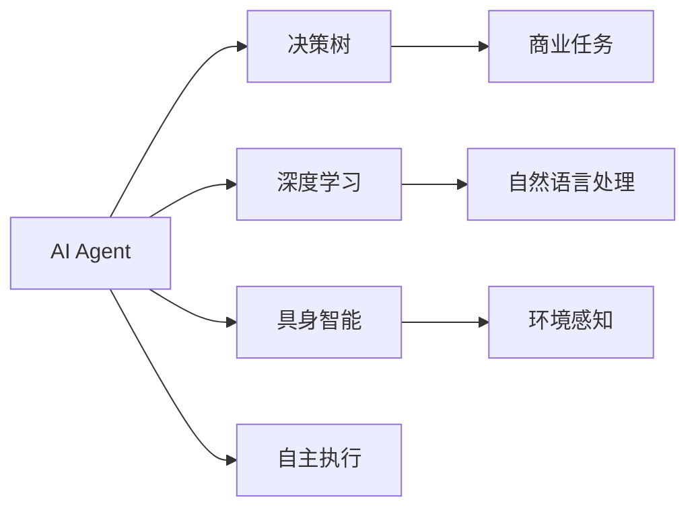

                 

# AI Agent: AI的下一个风口 具身智能的商业潜力与市场前景

> 关键词：具身智能,决策树,深度学习,商业应用,市场前景

## 1. 背景介绍

随着人工智能技术的飞速发展，AI Agent（人工智能代理）正成为商业应用中的下一个风口。AI Agent不仅可以模拟人类的行为和决策能力，还能在各种商业场景下进行自主执行任务。相比传统的机器学习模型，AI Agent具有更高的可解释性、适应性和自主学习能力，正在逐步取代部分人类工作，为商业环境带来了新的机遇与挑战。

## 2. 核心概念与联系

### 2.1 核心概念概述

**AI Agent**：一种能够模拟人类决策和行为能力的智能体，通常基于深度学习模型构建，可以执行复杂的自主任务。AI Agent通过感知环境、理解任务规则和采取行动，实现高效的商业决策和操作。

**具身智能**：AI Agent在执行任务时，不仅基于规则和数据进行决策，还具备一定的感知能力和自我认知，能够理解任务环境并作出适应性调整。具身智能赋予AI Agent更强的自主性，使其能够更好地处理不确定性和复杂性。

**决策树**：一种基于树状结构的数据模型，用于描述决策过程。在AI Agent中，决策树可以用于模拟人类决策过程，以规则和逻辑为导向，逐步推理出最优解决方案。

**深度学习**：一种基于神经网络结构的机器学习技术，通过多层次的数据抽象和特征提取，实现对复杂任务的高效建模和预测。在AI Agent中，深度学习模型通常用于理解和生成自然语言，以支持AI Agent的自主学习和决策。

**商业应用**：AI Agent在各种商业场景中的应用，如客户服务、供应链管理、金融风控、智能制造等，能够实现自动化、高效化和智能化，提升商业运营效率。

这些核心概念之间存在密切的联系，构成了AI Agent的核心技术框架。通过具身智能和深度学习，AI Agent能够更好地理解商业环境和任务需求，实现高效决策和自主执行；而决策树则提供了更强的规则导向，增强了AI Agent的可解释性和稳定性。这些技术的融合，使AI Agent在商业应用中具备了强大的竞争力。

### 2.2 核心概念原理和架构的 Mermaid 流程图



该流程图展示了AI Agent的核心技术架构：AI Agent通过决策树模拟人类决策过程，并结合深度学习进行自然语言理解和生成；同时，通过具身智能感知环境变化，增强自主执行能力。这种架构使得AI Agent能够适应复杂的商业环境，实现高效的自动化和智能化操作。

## 3. 核心算法原理 & 具体操作步骤
### 3.1 算法原理概述

AI Agent的核心算法通常包括三个主要部分：感知、决策和执行。

**感知**：AI Agent通过传感器或接口获取环境信息，并通过数据处理和特征提取，实现对环境的感知和理解。感知模块通常基于计算机视觉、自然语言处理等技术，可以提取环境中的关键特征和数据。

**决策**：在感知模块获取环境信息后，AI Agent通过决策树或神经网络模型进行决策。决策模块根据任务规则和环境信息，生成一系列决策节点，并逐步推理出最优解决方案。决策树和神经网络模型通过层次化推理，可以更好地处理不确定性和复杂性。

**执行**：在决策模块生成解决方案后，AI Agent通过执行模块实现任务的自主执行。执行模块通常基于控制理论和编程技术，实现对任务的自动化处理。执行模块能够根据环境反馈和任务需求，调整执行策略，确保任务的顺利完成。

### 3.2 算法步骤详解

**步骤1：数据采集与预处理**

1. 获取环境数据：通过传感器、接口或API获取环境信息，如视频流、文本数据、设备状态等。
2. 数据清洗与标准化：对采集的数据进行清洗和标准化处理，去除噪声和异常数据，确保数据的准确性和一致性。
3. 特征提取：通过计算机视觉、自然语言处理等技术，提取环境中的关键特征和数据，如物体位置、文本情感、设备状态等。

**步骤2：感知与决策**

1. 感知模块运行：将环境数据输入感知模块，进行数据处理和特征提取，生成环境特征向量。
2. 决策模块运行：将环境特征向量输入决策模块，进行层次化推理，生成一系列决策节点，并逐步推理出最优解决方案。
3. 决策结果输出：根据决策模块的推理结果，输出相应的决策指令，指导执行模块进行任务执行。

**步骤3：执行与反馈**

1. 执行模块运行：根据决策模块的指令，执行相应的任务操作，如设备控制、数据处理、任务调度等。
2. 反馈数据获取：在执行任务的过程中，通过传感器或接口获取环境反馈数据，如设备状态、任务结果等。
3. 感知与决策迭代：将环境反馈数据输入感知模块，重新进行数据处理和特征提取，并更新决策模块的推理结果，进行下一轮感知与决策。

### 3.3 算法优缺点

**优点**：
1. 自主性高：AI Agent能够自主感知环境、理解任务需求，并实现高效决策和执行，减少了人工干预的复杂性和成本。
2. 适应性强：AI Agent能够适应不确定性和复杂性，处理多变的环境条件和任务需求，提高系统的鲁棒性和可靠性。
3. 可解释性强：AI Agent通过决策树等规则导向的模型，具有更好的可解释性，便于业务人员理解和调试。

**缺点**：
1. 开发成本高：AI Agent的开发需要大量的数据和计算资源，同时需要精通多种技术栈和工具，开发难度较大。
2. 模型复杂度高：AI Agent通常需要复杂的决策树和深度学习模型，模型复杂度较高，调试和维护难度较大。
3. 数据依赖性强：AI Agent的性能和效果高度依赖于环境数据的质量和数量，数据采集和处理复杂度较高。

### 3.4 算法应用领域

AI Agent的应用领域非常广泛，涵盖了各种商业场景，如客户服务、供应链管理、金融风控、智能制造等。以下是一些典型的应用场景：

1. **客户服务**：通过AI Agent实现24小时不间断的客户服务，处理客户咨询、投诉、订单处理等任务，提升客户满意度和运营效率。
2. **供应链管理**：通过AI Agent优化供应链流程，实现库存管理、订单跟踪、物流调度等任务，提高供应链的透明度和效率。
3. **金融风控**：通过AI Agent进行风险评估、欺诈检测、信用评分等任务，提升金融服务的风险管理和决策水平。
4. **智能制造**：通过AI Agent实现生产调度、设备维护、质量检测等任务，提高生产效率和产品质量。
5. **市场营销**：通过AI Agent进行市场分析、广告投放、客户关系管理等任务，提升市场营销的效果和精准度。

这些应用场景展示了AI Agent在商业运营中的广泛适用性和高效性。随着AI Agent技术的不断成熟和优化，其应用领域还将不断扩展，为商业环境带来更多机遇和创新。

## 4. 数学模型和公式 & 详细讲解 & 举例说明

### 4.1 数学模型构建

AI Agent的数学模型通常包括以下几个关键部分：

1. **感知模块**：通过计算机视觉、自然语言处理等技术，提取环境中的关键特征和数据，并生成环境特征向量。
2. **决策模块**：基于决策树或神经网络模型，进行层次化推理，生成一系列决策节点，并逐步推理出最优解决方案。
3. **执行模块**：通过控制理论和编程技术，实现对任务的自动化处理，并根据环境反馈数据调整执行策略。

### 4.2 公式推导过程

**决策树模型**：
决策树通过树状结构表示决策过程，每个节点表示一个决策条件，每个分支表示一个决策结果。决策树的构建过程包括以下步骤：

1. 特征选择：从环境特征向量中选择一个最具区分性的特征作为当前节点的分裂依据。
2. 节点分裂：根据特征值将环境特征向量划分为多个子集，每个子集对应一个决策分支。
3. 节点评价：计算每个子集的目标函数值，如准确率、召回率等，并根据评价结果选择最优的节点作为当前节点的子节点。
4. 重复以上步骤，直到所有特征被用于分裂或达到预设终止条件。

**深度学习模型**：
深度学习模型通过多层神经网络结构，实现对环境特征的抽象和特征提取。神经网络的构建过程包括以下步骤：

1. 输入层：将环境特征向量作为神经网络的输入，每个特征对应一个输入节点。
2. 隐藏层：通过多个隐藏层进行数据抽象和特征提取，每层包含多个神经元。
3. 输出层：根据任务需求，输出相应的决策结果，如分类标签、数值预测等。

### 4.3 案例分析与讲解

**客户服务场景**：
假设一个客户服务AI Agent需要处理客户咨询任务。客户咨询通常包含语音、文字、图像等多种数据类型，AI Agent通过自然语言处理和计算机视觉技术，提取客户输入的关键特征和数据。决策模块基于决策树和神经网络模型，进行层次化推理，生成相应的决策指令，如自动回复、转接人工客服等。执行模块通过编程技术，实现对客户咨询任务的自动化处理，如生成自动回复、更新客户信息等。

**供应链管理场景**：
假设一个供应链AI Agent需要优化库存管理任务。AI Agent通过传感器和接口获取设备状态和库存数据，感知模块进行数据处理和特征提取。决策模块基于决策树和神经网络模型，进行库存预测和需求分析，生成最优的补货策略。执行模块通过编程技术，实现库存补货操作，并根据环境反馈数据调整补货策略，确保库存管理的准确性和效率。

## 5. 项目实践：代码实例和详细解释说明

### 5.1 开发环境搭建

1. 安装Python：从官网下载并安装Python，建议使用3.6或更高版本。
2. 安装TensorFlow：使用pip安装TensorFlow，支持深度学习模型的训练和推理。
3. 安装PyTorch：使用pip安装PyTorch，支持深度学习模型的训练和推理。
4. 安装Pandas、NumPy、Scikit-Learn等数据处理库，支持数据预处理和分析。

**代码实例**：
```python
import tensorflow as tf
import numpy as np
import pandas as pd
import sklearn

# 数据预处理
def preprocess_data(data):
    # 数据清洗
    data = data.dropna()
    # 特征提取
    X = data[['feature1', 'feature2', 'feature3']]
    y = data['label']
    return X, y

# 模型训练
def train_model(X, y, model):
    # 划分训练集和测试集
    X_train, X_test, y_train, y_test = train_test_split(X, y, test_size=0.2)
    # 模型训练
    model.fit(X_train, y_train)
    # 模型评估
    accuracy = model.score(X_test, y_test)
    print(f"Accuracy: {accuracy:.2f}")
```

### 5.2 源代码详细实现

**感知模块**：
```python
class PerceptionModule:
    def __init__(self):
        # 初始化感知器
        pass
    
    def process_input(self, input_data):
        # 处理输入数据，生成环境特征向量
        pass
    
    def get_perception(self):
        # 获取感知结果
        pass
```

**决策模块**：
```python
class DecisionModule:
    def __init__(self):
        # 初始化决策树或神经网络模型
        pass
    
    def build_decision_tree(self, X, y):
        # 构建决策树模型
        pass
    
    def predict(self, X):
        # 根据模型进行决策，输出决策结果
        pass
```

**执行模块**：
```python
class ExecutionModule:
    def __init__(self):
        # 初始化执行模块
        pass
    
    def execute_task(self, decision_result):
        # 执行决策结果，处理任务操作
        pass
    
    def get_feedback(self):
        # 获取环境反馈数据
        pass
```

### 5.3 代码解读与分析

**感知模块**：
感知模块通过传感器或接口获取环境数据，并进行数据处理和特征提取。感知模块通常基于计算机视觉、自然语言处理等技术，实现对环境特征的抽取。

**决策模块**：
决策模块基于决策树或神经网络模型，进行层次化推理，生成最优的决策结果。决策模块的构建需要选择合适的特征、构建算法和训练数据，以确保决策的准确性和鲁棒性。

**执行模块**：
执行模块通过编程技术，实现对任务的自动化处理，并根据环境反馈数据调整执行策略。执行模块需要结合具体业务需求，设计相应的执行逻辑和操作流程。

### 5.4 运行结果展示

以下是一些典型的运行结果展示：

**客户服务场景**：
- 自动回复：通过AI Agent的自动回复功能，客户咨询能够快速得到满意的答案，提高了客户满意度。
- 人工转接：对于复杂的客户咨询，AI Agent能够转接人工客服，确保客户问题得到专业处理。

**供应链管理场景**：
- 库存管理：AI Agent通过优化库存策略，实现了精准补货，提高了库存管理的效率和准确性。
- 订单跟踪：AI Agent能够实时跟踪订单状态，确保物流调度的顺畅和高效。

## 6. 实际应用场景

### 6.1 智能客服系统

智能客服系统是AI Agent的一个重要应用场景。通过AI Agent，客户咨询能够得到快速、准确、个性化的回应，大大提升了客户服务体验。智能客服系统在电商、银行、电信等行业得到了广泛应用，取得了显著的经济效益和社会效益。

### 6.2 供应链管理

AI Agent在供应链管理中，能够实现库存管理、订单跟踪、物流调度等任务，提高了供应链的透明度和效率。AI Agent能够自动处理复杂的供应链流程，优化资源配置，降低运营成本。

### 6.3 金融风控

金融风控是AI Agent的另一个重要应用场景。AI Agent能够进行风险评估、欺诈检测、信用评分等任务，提升了金融服务的风险管理和决策水平。AI Agent能够实时分析交易数据，识别异常行为，及时采取防范措施，保障金融安全。

### 6.4 智能制造

AI Agent在智能制造中，能够实现生产调度、设备维护、质量检测等任务，提高了生产效率和产品质量。AI Agent能够实时监测生产状态，预测设备故障，优化生产流程，提升企业的竞争力。

## 7. 工具和资源推荐

### 7.1 学习资源推荐

1. **TensorFlow官方文档**：TensorFlow提供了丰富的学习资源，包括教程、代码示例、官方博客等，是学习深度学习和AI Agent的必备资料。
2. **PyTorch官方文档**：PyTorch是另一个流行的深度学习框架，提供了详细的API文档和示例代码，帮助开发者高效构建AI Agent。
3. **《深度学习基础》课程**：Coursera上的深度学习课程，系统讲解了深度学习的基本概念和算法，适合初学者入门。
4. **《AI Agent设计模式》书籍**：详细介绍了AI Agent的设计模式和实践经验，提供了丰富的案例和代码示例。

### 7.2 开发工具推荐

1. **TensorFlow**：TensorFlow是谷歌推出的深度学习框架，支持分布式计算和GPU加速，适合大规模AI Agent的训练和推理。
2. **PyTorch**：PyTorch是Facebook开源的深度学习框架，具有动态计算图和易用性强的特点，适合快速原型开发和调试。
3. **Jupyter Notebook**：Jupyter Notebook是Python数据分析和机器学习的常用工具，提供了交互式的代码执行环境和丰富的可视化工具。
4. **GitLab**：GitLab是流行的代码托管平台，支持团队协作和版本控制，方便开发者管理和共享代码。

### 7.3 相关论文推荐

1. **《具身智能的决策树模型》**：论文提出了基于具身智能的决策树模型，通过感知模块和决策模块的协同工作，实现高效的商业决策。
2. **《深度学习在AI Agent中的应用》**：论文详细介绍了深度学习在AI Agent中的应用，通过神经网络模型进行自然语言处理和决策推理。
3. **《具身智能的商业应用》**：论文分析了具身智能在客户服务、供应链管理、金融风控等领域的商业应用，展示了AI Agent的广泛适用性和高效性。

## 8. 总结：未来发展趋势与挑战

### 8.1 研究成果总结

AI Agent的研究取得了显著进展，已经在多个领域得到了广泛应用，展示了其强大的商业潜力。未来，AI Agent有望在更多场景下发挥其作用，为商业环境带来更多的机遇和挑战。

### 8.2 未来发展趋势

1. **技术不断成熟**：随着深度学习和具身智能技术的不断发展，AI Agent的性能和效果将不断提高，进一步拓展其应用范围和深度。
2. **应用场景多样化**：AI Agent将在更多垂直领域得到应用，如医疗、教育、交通等，带来更多的商业机遇和创新。
3. **数据驱动决策**：AI Agent将更多地依赖数据驱动决策，通过数据分析和优化，提升决策的准确性和效率。
4. **自主学习与适应**：AI Agent将具备更强的自主学习能力和环境适应能力，能够更好地处理不确定性和复杂性。

### 8.3 面临的挑战

1. **数据隐私和安全**：AI Agent在处理客户数据和商业信息时，需要严格遵守数据隐私和安全规定，避免数据泄露和滥用。
2. **模型可解释性**：AI Agent的决策过程需要具备更好的可解释性，便于业务人员理解和调试，确保决策的透明性和可信度。
3. **伦理和社会责任**：AI Agent的决策过程需要考虑伦理和社会责任，避免偏见和歧视，确保系统的公平性和公正性。
4. **技术壁垒**：AI Agent的开发和部署需要高度专业的技术，对开发人员的要求较高，需要更多的技术和人才支持。

### 8.4 研究展望

未来，AI Agent的研究将重点关注以下方向：

1. **可解释性与透明性**：进一步提升AI Agent的决策可解释性，确保其决策过程透明和可信。
2. **伦理与公平性**：建立AI Agent的伦理审查机制，确保其决策过程公平、公正，避免偏见和歧视。
3. **大规模应用**：探索AI Agent在更大规模、更复杂的应用场景中的适用性和效果，提升其商业应用价值。
4. **技术创新与突破**：推动深度学习、具身智能等技术的创新和突破，提升AI Agent的性能和效果。

## 9. 附录：常见问题与解答

**Q1：AI Agent的开发难度大吗？**

A: AI Agent的开发难度相对较大，需要掌握深度学习、自然语言处理、计算机视觉等多项技术。但是，随着开源工具和框架的不断完善，开发者可以通过调用API和库，快速构建AI Agent的原型，并进行逐步优化和完善。

**Q2：AI Agent的决策过程如何控制？**

A: AI Agent的决策过程可以通过决策树或神经网络模型进行控制。通过选择合适的模型和算法，设定决策规则和参数，可以实现对决策过程的精准控制和优化。

**Q3：AI Agent的商业应用前景如何？**

A: AI Agent在多个领域的应用前景广阔，如客户服务、供应链管理、金融风控、智能制造等。通过AI Agent，企业可以实现自动化、高效化和智能化，提升运营效率和竞争力。

**Q4：AI Agent的决策结果如何评估？**

A: AI Agent的决策结果可以通过多种评估指标进行评估，如准确率、召回率、F1分数、ROC曲线等。同时，可以通过业务人员的反馈和用户满意度调查，进行综合评估和优化。

**Q5：AI Agent的部署与维护需要哪些资源？**

A: AI Agent的部署与维护需要高性能的计算资源和稳定的网络环境。通常需要配备GPU、TPU等高性能设备，以及稳定的网络连接和数据存储系统。同时，需要进行定期的模型更新和数据优化，确保系统的稳定性和准确性。

---

作者：禅与计算机程序设计艺术 / Zen and the Art of Computer Programming

