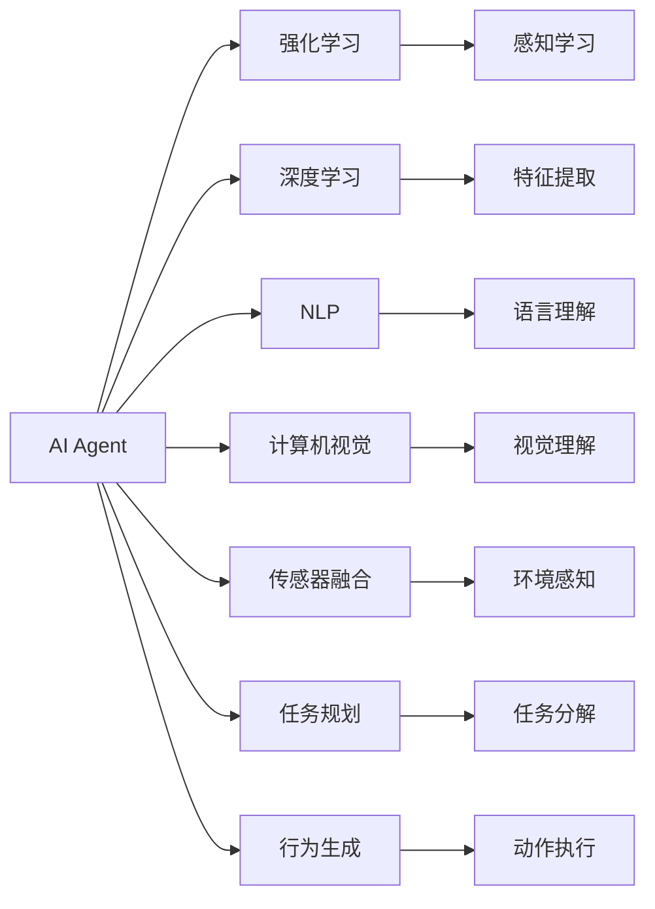

                 

# AI Agent: AI的下一个风口 对未来的启示

## 1. 背景介绍

随着人工智能(AI)技术的不断演进，AI Agent（人工智能代理人）已经成为当前AI研究的热点。AI Agent是指能够在复杂、动态环境中，自主地感知、推理和执行任务，实现自主决策和智能互动的系统。其核心在于通过构建具备学习和自我完善能力的智能体，赋予机器以人类智能的行为特征。AI Agent的应用广泛渗透在智能制造、智慧城市、智能交通、人机交互、社交娱乐等多个领域，正在改变人类的生产和生活方式。本文将深入探讨AI Agent的原理与架构，分析其在不同应用场景中的挑战与突破，并对未来的发展趋势进行展望。

## 2. 核心概念与联系

### 2.1 核心概念概述

为更好地理解AI Agent的原理与应用，本节将介绍几个关键概念及其内在联系：

- **AI Agent**: 一个能够自主地感知环境、执行任务、进行学习与决策的智能系统。其核心是构建智能体的行为模型，以实现自主的感知、推理和决策。

- **强化学习(Reinforcement Learning, RL)**: 一种通过试错机制优化智能体行为策略的学习方法。智能体通过与环境的交互，获取奖励信号，不断调整行为策略，以最大化长期奖励。

- **深度学习(Deep Learning)**: 一种基于多层神经网络的机器学习方法，通过数据驱动的方式，实现对复杂模式的学习与表征。

- **自然语言处理(Natural Language Processing, NLP)**: 研究如何使计算机能够理解、处理和生成人类语言的技术。

- **计算机视觉(Computer Vision)**: 研究如何让计算机通过视觉感知技术，理解和解释图像、视频等视觉数据。

- **传感器融合(Sensor Fusion)**: 将多种传感器数据进行融合，提高智能体的感知能力与决策精度。

- **任务规划(Task Planning)**: 智能体在执行任务时，对任务步骤进行规划与优化，以高效达成目标。

- **行为生成(Behavior Generation)**: 根据当前环境与任务需求，生成智能体的行为序列，实现自主决策。

这些概念通过一系列复杂的交互与协同，共同构建了AI Agent的智能化行为框架，使其能够在复杂多变的环境中，实现自主学习与智能决策。

### 2.2 核心概念原理与架构的 Mermaid 流程图



这个流程图展示了AI Agent中的各个关键组件，及其之间的联系和作用。智能体通过强化学习、深度学习、NLP、计算机视觉、传感器融合等技术，实现感知与理解环境，并在任务规划与行为生成的支持下，执行任务并优化策略。

## 3. 核心算法原理 & 具体操作步骤

### 3.1 算法原理概述

AI Agent的核心算法原理基于强化学习和深度学习。其关键在于构建智能体的行为策略，通过与环境的交互，逐步优化策略以最大化长期奖励。在实际应用中，往往需要综合运用多模态感知、自然语言处理、计算机视觉、任务规划等技术，实现自主学习和智能决策。

AI Agent的典型流程包括：
1. 感知环境：通过传感器或视觉系统获取环境信息。
2. 理解任务：利用自然语言处理技术解析任务指令，确定执行目标。
3. 任务分解：将复杂任务分解为可执行的子任务。
4. 行为生成：根据当前环境与任务需求，生成智能体的行为序列。
5. 执行动作：控制智能体执行行为，并监测执行效果。
6. 反馈与优化：根据执行结果与预期目标的差距，调整行为策略。

### 3.2 算法步骤详解

**Step 1: 数据采集与预处理**

1. **数据采集**：根据应用场景，收集环境数据。如智能制造领域，采集生产设备、质量监测数据；智慧城市领域，收集交通流量、环境监测数据等。
2. **数据预处理**：清洗、转换和标准化数据，使其符合模型处理要求。如去除噪声、归一化、特征选择等。

**Step 2: 模型训练**

1. **感知模型训练**：如摄像头、传感器数据等感知数据，通过卷积神经网络(CNN)、循环神经网络(RNN)等深度学习模型，进行特征提取和感知理解。
2. **语言模型训练**：将任务指令转化为数值向量，通过Transformer等模型，进行自然语言理解与处理。
3. **任务规划与行为生成模型训练**：使用强化学习模型，如深度Q网络(DQN)、策略梯度(SPG)等，训练智能体的决策策略。

**Step 3: 智能体行为生成与执行**

1. **行为生成**：根据感知数据和任务需求，生成智能体的行为序列。如使用LSTM、GRU等模型，进行动作预测。
2. **执行控制**：将行为序列转化为实际控制命令，控制智能体执行动作。如通过PID控制器，实现精确控制。
3. **效果评估**：对智能体的执行效果进行评估，如通过预设指标或奖励函数，衡量执行质量。

**Step 4: 学习与优化**

1. **反馈与奖励**：根据执行效果与预期目标的差距，给予智能体正负反馈。如通过奖励函数，评估执行效果。
2. **策略优化**：使用强化学习算法，如Q-learning、PPO等，优化智能体的决策策略。
3. **模型更新**：根据反馈结果，更新感知模型、语言模型和行为生成模型的参数，实现智能体的自我完善。

### 3.3 算法优缺点

AI Agent算法具有以下优点：
1. **自主学习**：能够自主地感知环境、理解任务，并在执行过程中不断优化行为策略。
2. **适应性强**：通过强化学习算法，智能体能够适应复杂、动态的环境变化。
3. **泛化能力强**：通过深度学习模型，智能体可以处理多模态数据，实现泛化学习。
4. **决策优化**：通过优化决策策略，智能体能够在给定约束条件下，最大化目标函数。

同时，AI Agent算法也存在一些缺点：
1. **计算资源需求高**：深度学习模型的训练与优化需要大量计算资源。
2. **模型复杂度大**：智能体的感知、理解与决策过程复杂，难以进行精确建模。
3. **数据依赖强**：智能体的性能依赖于高质量、大量标注数据，数据获取成本高。
4. **可解释性差**：深度学习模型的黑盒特性，使得智能体的行为难以解释。

### 3.4 算法应用领域

AI Agent的应用领域广泛，主要包括：

- **智能制造**：通过智能体对生产设备进行监控、调度与维护，实现生产自动化与智能化。
- **智慧城市**：在交通管理、环境监测、能源调度等领域，智能体可以实现城市基础设施的智能控制。
- **智能交通**：智能体可用于交通流量预测、自动驾驶、智能调度等，提高交通效率与安全性。
- **人机交互**：通过智能体实现语音助手、聊天机器人等功能，提升用户体验。
- **社交娱乐**：智能体可用于游戏AI、虚拟助手等，提供个性化互动体验。

## 4. 数学模型和公式 & 详细讲解 & 举例说明

### 4.1 数学模型构建

AI Agent的数学模型构建主要涉及感知模型、决策模型和行为生成模型。以智能体在智能制造场景中执行任务为例，数学模型构建如下：

1. **感知模型**：假设智能体通过摄像头采集环境图像数据，采用CNN模型提取特征。数学模型如下：

$$
F(x) = W_{conv}(x) + b_{conv}
$$

其中 $F$ 为特征提取函数，$x$ 为输入图像，$W_{conv}$ 为卷积核，$b_{conv}$ 为偏置项。

2. **语言模型**：假设任务指令以自然语言形式给出，通过BERT模型进行理解与处理。数学模型如下：

$$
h = BERT(x)
$$

其中 $h$ 为任务指令的语义表示，$x$ 为自然语言文本。

3. **决策模型**：假设智能体使用DQN模型进行决策策略优化。数学模型如下：

$$
Q(s,a) = \mathbb{E}_{(s',r)\sim P}[R + \gamma Q(s',a')]
$$

其中 $Q$ 为决策函数，$s$ 为当前状态，$a$ 为执行动作，$s'$ 为下一个状态，$r$ 为奖励函数，$\gamma$ 为折扣因子。

### 4.2 公式推导过程

以DQN模型为例，推导智能体在智能制造场景中的决策策略。

假设智能体在执行任务时，面临不同的生产设备状态 $s$，可以选择的动作包括启动、停止、维修等。智能体通过感知模型获取当前状态 $s$ 的特征表示 $x$，通过语言模型解析任务指令 $x$，转化为数值向量 $h$。

智能体在状态 $s$ 下执行动作 $a$，获得奖励 $r$，并转移到下一个状态 $s'$。智能体的目标是最小化成本函数 $C$，最大化奖励函数 $R$。数学模型如下：

$$
\min_{\theta} \sum_{s,a} \alpha(s,a;\theta)C(s,a)
$$

其中 $\theta$ 为模型参数，$\alpha$ 为策略函数。

通过DQN模型，智能体在每个时间步进行动作选择，并根据奖励信号更新策略函数。其训练过程如下：

1. 初始化智能体参数 $\theta$。
2. 在每个时间步 $t$，智能体从当前状态 $s_t$ 随机选择一个动作 $a_t$。
3. 执行动作 $a_t$，观察到下一个状态 $s_{t+1}$ 和奖励 $r_t$。
4. 使用Q值估计模型 $Q(s_t,a_t)$，计算Q值误差 $\delta_t$。
5. 更新模型参数 $\theta$，最小化Q值误差 $\delta_t$。

### 4.3 案例分析与讲解

**案例分析：智能制造中的智能体行为生成**

假设智能体在智能制造场景中执行质量检测任务。智能体通过视觉系统获取设备图像，使用CNN模型提取特征，通过BERT模型理解任务指令，转化为数值向量。在执行任务时，智能体面临不同设备状态，可以选择的检测动作包括停止、扫描、校准等。智能体的目标是在保证质量的前提下，最小化检测成本。

智能体在每个时间步，根据感知模型和语言模型的输出，使用DQN模型选择动作，并通过决策模型评估动作效果。具体步骤包括：

1. 感知模型：使用CNN模型提取设备图像特征。
2. 语言模型：使用BERT模型解析任务指令，转化为数值向量。
3. 决策模型：使用DQN模型，根据感知模型和语言模型的输出，选择检测动作。
4. 行为生成：根据动作选择，生成具体的检测步骤。
5. 效果评估：通过质量检测结果和成本，评估动作效果，进行反馈与优化。

通过上述步骤，智能体能够在复杂、动态的环境中，自主地进行质量检测与优化，提升生产效率和质量。

## 5. 项目实践：代码实例和详细解释说明

### 5.1 开发环境搭建

在进行AI Agent项目开发时，首先需要准备开发环境。以下是使用Python和PyTorch搭建开发环境的步骤：

1. 安装Anaconda：从官网下载并安装Anaconda，用于创建独立的Python环境。

2. 创建并激活虚拟环境：

```bash
conda create -n agent-env python=3.8 
conda activate agent-env
```

3. 安装PyTorch：根据CUDA版本，从官网获取对应的安装命令。例如：

```bash
conda install pytorch torchvision torchaudio cudatoolkit=11.1 -c pytorch -c conda-forge
```

4. 安装TensorFlow：

```bash
pip install tensorflow
```

5. 安装相关库：

```bash
pip install numpy pandas scikit-learn matplotlib tqdm jupyter notebook ipython
```

完成上述步骤后，即可在`agent-env`环境中开始AI Agent项目开发。

### 5.2 源代码详细实现

下面我们以智能制造中的智能体行为生成为例，给出使用PyTorch进行AI Agent开发的全流程代码实现。

首先，定义感知模型和语言模型的类：

```python
import torch.nn as nn
import torch.nn.functional as F

class CNNModel(nn.Module):
    def __init__(self):
        super(CNNModel, self).__init__()
        self.conv1 = nn.Conv2d(3, 32, kernel_size=3, stride=1, padding=1)
        self.conv2 = nn.Conv2d(32, 64, kernel_size=3, stride=1, padding=1)
        self.pool = nn.MaxPool2d(kernel_size=2, stride=2)
        self.fc1 = nn.Linear(64*7*7, 512)
        self.fc2 = nn.Linear(512, 3)
    
    def forward(self, x):
        x = self.conv1(x)
        x = F.relu(x)
        x = self.pool(x)
        x = self.conv2(x)
        x = F.relu(x)
        x = self.pool(x)
        x = x.view(-1, 64*7*7)
        x = self.fc1(x)
        x = F.relu(x)
        x = self.fc2(x)
        return x

class BERTModel(nn.Module):
    def __init__(self):
        super(BERTModel, self).__init__()
        self.bert_model = transformers.BertModel.from_pretrained('bert-base-uncased')
    
    def forward(self, x):
        return self.bert_model(x)

# 初始化感知模型和语言模型
cnn_model = CNNModel()
bert_model = BERTModel()
```

接着，定义智能体行为生成的类：

```python
import torch

class Agent(nn.Module):
    def __init__(self):
        super(Agent, self).__init__()
        self.cnn_model = CNNModel()
        self.bert_model = BERTModel()
        self.dqn_model = DQNModel()
    
    def forward(self, x):
        x = self.cnn_model(x)
        x = self.bert_model(x)
        x = self.dqn_model(x)
        return x

# 定义智能体行为生成的模型
agent = Agent()
```

最后，定义训练和评估函数：

```python
from torch.utils.data import DataLoader
from tqdm import tqdm
from sklearn.metrics import classification_report

def train_agent(agent, train_dataset, batch_size, optimizer):
    dataloader = DataLoader(train_dataset, batch_size=batch_size, shuffle=True)
    agent.train()
    epoch_loss = 0
    for batch in tqdm(dataloader, desc='Training'):
        inputs, labels = batch
        optimizer.zero_grad()
        outputs = agent(inputs)
        loss = F.cross_entropy(outputs, labels)
        epoch_loss += loss.item()
        loss.backward()
        optimizer.step()
    return epoch_loss / len(dataloader)

def evaluate_agent(agent, test_dataset, batch_size):
    dataloader = DataLoader(test_dataset, batch_size=batch_size)
    agent.eval()
    preds, labels = [], []
    with torch.no_grad():
        for batch in tqdm(dataloader, desc='Evaluating'):
            inputs, labels = batch
            outputs = agent(inputs)
            batch_preds = outputs.argmax(dim=1).to('cpu').tolist()
            batch_labels = labels.to('cpu').tolist()
            for pred, label in zip(batch_preds, batch_labels):
                preds.append(pred)
                labels.append(label)
                
    print(classification_report(labels, preds))
```

完成上述步骤后，即可在`agent-env`环境中运行AI Agent的训练与评估代码。

### 5.3 代码解读与分析

让我们再详细解读一下关键代码的实现细节：

**CNNModel类**：
- `__init__`方法：初始化CNN模型的各层组件。
- `forward`方法：定义前向传播过程，对输入图像进行卷积和池化操作，并返回特征向量。

**BERTModel类**：
- `__init__`方法：初始化BERT模型的预训练模型。
- `forward`方法：定义前向传播过程，对输入文本进行BERT模型编码，并返回语义表示。

**Agent类**：
- `__init__`方法：初始化智能体的感知模型、语言模型和决策模型。
- `forward`方法：定义前向传播过程，对输入进行感知、理解和决策，并返回智能体的输出。

**train_agent函数**：
- 定义训练过程，在每个批次上计算损失并更新模型参数。

**evaluate_agent函数**：
- 定义评估过程，在测试集上输出分类指标。

通过上述步骤，可以看出使用PyTorch搭建AI Agent项目的具体实现流程。通过灵活组合多种深度学习模型，并使用强化学习算法进行优化，智能体能够在复杂环境中实现自主学习与智能决策。

## 6. 实际应用场景

### 6.1 智能制造

AI Agent在智能制造中的应用广泛，涵盖生产设备监控、质量检测、故障诊断等多个环节。通过AI Agent，可以实现生产设备的自主调度、预测维护和质量管理，提升生产效率与产品质量。

以质量检测为例，智能体通过视觉系统获取设备图像，使用CNN模型提取特征，通过BERT模型理解任务指令，转化为数值向量。在执行任务时，智能体面临不同设备状态，可以选择的检测动作包括停止、扫描、校准等。智能体的目标是在保证质量的前提下，最小化检测成本。智能体在每个时间步，根据感知模型和语言模型的输出，使用DQN模型选择动作，并通过决策模型评估动作效果。

### 6.2 智慧城市

智慧城市是AI Agent的另一个重要应用领域。通过AI Agent，可以实现交通流量预测、智能调度、环境监测等功能，提升城市管理效率与智能化水平。

例如，在交通管理中，智能体通过摄像头、传感器等设备，获取交通数据。通过CNN模型进行特征提取，通过BERT模型解析任务指令，转化为数值向量。在执行任务时，智能体可以选择不同交通信号控制策略，如绿灯时长、信号灯顺序等。智能体的目标是在保障安全的前提下，最小化交通延误时间。智能体在每个时间步，根据感知模型和语言模型的输出，使用强化学习模型选择策略，并通过决策模型评估效果。

### 6.3 智能交通

智能交通是AI Agent的重要应用场景，包括自动驾驶、智能调度、交通管理等。通过AI Agent，可以实现车辆的自主导航、路径规划和避障等功能，提升交通安全与效率。

例如，在自动驾驶中，智能体通过摄像头、雷达等设备，获取车辆周围环境信息。通过CNN模型进行特征提取，通过BERT模型解析任务指令，转化为数值向量。在执行任务时，智能体可以选择不同的驾驶策略，如加速、减速、转向等。智能体的目标是在保障安全的前提下，最小化行驶时间。智能体在每个时间步，根据感知模型和语言模型的输出，使用强化学习模型选择策略，并通过决策模型评估效果。

### 6.4 未来应用展望

随着AI Agent技术的不断演进，其在各个领域的应用将更加广泛与深入。未来AI Agent的发展趋势包括：

1. **多模态融合**：通过融合视觉、语音、文本等多模态数据，提升智能体的感知与理解能力。
2. **自主学习**：通过自监督、半监督、无监督等学习方式，增强智能体的泛化与适应能力。
3. **强化学习优化**：通过优化奖励函数与学习策略，提升智能体的决策与执行效果。
4. **跨领域应用**：通过迁移学习与知识图谱，实现智能体在不同领域之间的跨领域知识迁移。
5. **伦理与安全**：通过建立可解释性与可控性机制，确保智能体的行为符合伦理与安全要求。

## 7. 工具和资源推荐

### 7.1 学习资源推荐

为了帮助开发者系统掌握AI Agent的原理与应用，这里推荐一些优质的学习资源：

1. **《强化学习基础》（Reinforcement Learning: Foundations）**：由Richard S. Sutton和Andrew G. Barto所著，是强化学习领域的经典教材，系统讲解了强化学习的理论基础与实践应用。

2. **DeepMind论文库**：DeepMind是AI Agent领域的领军企业，其发布的众多论文涵盖了AI Agent的各个研究领域，包括感知、理解、决策、行为生成等。

3. **OpenAI论文库**：OpenAI是AI Agent领域的另一重要研究机构，其发布的论文涵盖了AI Agent的最新研究进展，包括AlphaGo、OpenAI Gym等。

4. **Google AI Blog**：Google AI官方博客，定期发布AI Agent的最新研究成果与应用案例，是学习与了解AI Agent的重要渠道。

5. **arXiv预印本网站**：arXiv是计算机科学领域的知名预印本网站，收录了大量AI Agent领域的最新研究成果，是了解前沿技术的有效途径。

通过对这些资源的学习实践，相信你一定能够快速掌握AI Agent的精髓，并用于解决实际的AI问题。

### 7.2 开发工具推荐

AI Agent的开发涉及多种深度学习模型与算法，使用合适的开发工具可以提高开发效率与研究效果。以下是几款常用的开发工具：

1. **PyTorch**：基于Python的开源深度学习框架，支持动态计算图，适合快速迭代研究。PyTorch提供了丰富的深度学习模型库，支持GPU加速，是AI Agent开发的首选工具。

2. **TensorFlow**：由Google主导开发的开源深度学习框架，生产部署方便，支持多GPU、TPU等加速设备。TensorFlow提供了丰富的深度学习模型库，支持分布式训练与推理。

3. **OpenAI Gym**：是一个用于AI Agent研究的开放平台，提供了多种模拟环境，如MuJoCo、CartPole等，方便进行智能体的测试与评估。

4. **ROS（Robot Operating System）**：是一个开源的机器人操作系统，提供了多机器人控制、感知与决策工具，适合进行机器人AI Agent的研究。

5. **Unity ML-Agents**：是一个用于AI Agent研究的开放平台，提供了多种游戏环境，如Box2D、Physics等，方便进行智能体的训练与优化。

6. **SimPy**：是一个基于Python的模拟平台，提供了丰富的模拟工具，支持多智能体系统的模拟与优化，适合进行智能体的仿真研究。

合理利用这些工具，可以显著提升AI Agent项目的开发效率，加快创新迭代的步伐。

### 7.3 相关论文推荐

AI Agent的研究涉及众多前沿技术，需要多领域知识的支持。以下是几篇奠基性的相关论文，推荐阅读：

1. **AlphaGo论文**：DeepMind于2016年发布的AlphaGo论文，标志着AI Agent在围棋等复杂决策问题上的重大突破。

2. **OpenAI Gym论文**：OpenAI于2016年发布的OpenAI Gym论文，提出了用于AI Agent研究的开放平台，为AI Agent的研究提供了丰富的工具与环境。

3. **Multi-Agent Systems: Architectures and Algorithms**：由Bruno Siciliano所著，是关于多智能体系统的经典教材，系统讲解了多智能体系统的理论基础与实践应用。

4. **Reinforcement Learning for Robotics**：由Marco Carrillo、Arnaud Lazaric、Jean-Baptiste Mouret、Miro Kreller、Simone Ciaramita所著，是一本关于AI Agent在机器人领域的论文集，系统讲解了AI Agent在机器人中的应用。

5. **Learning to Play Video Games via Deep Reinforcement Learning**：由OpenAI于2015年发布的论文，展示了AI Agent在视频游戏领域的最新进展。

6. **Playing Atari with Deep Reinforcement Learning**：由DeepMind于2013年发布的论文，展示了AI Agent在视频游戏领域的应用。

这些论文代表了AI Agent领域的研究进展，通过学习这些前沿成果，可以帮助研究者把握学科前进方向，激发更多的创新灵感。

## 8. 总结：未来发展趋势与挑战

### 8.1 研究成果总结

通过本文的介绍，可以看出AI Agent在智能制造、智慧城市、智能交通等多个领域的应用潜力。AI Agent通过感知、理解、决策、行为生成等关键组件，实现了自主学习和智能决策，提升了生产效率与智能化水平。然而，AI Agent技术仍面临诸多挑战，包括计算资源需求高、模型复杂度大、数据依赖强等问题。

### 8.2 未来发展趋势

未来AI Agent技术的发展趋势包括：

1. **多模态融合**：通过融合视觉、语音、文本等多模态数据，提升智能体的感知与理解能力。
2. **自主学习**：通过自监督、半监督、无监督等学习方式，增强智能体的泛化与适应能力。
3. **强化学习优化**：通过优化奖励函数与学习策略，提升智能体的决策与执行效果。
4. **跨领域应用**：通过迁移学习与知识图谱，实现智能体在不同领域之间的跨领域知识迁移。
5. **伦理与安全**：通过建立可解释性与可控性机制，确保智能体的行为符合伦理与安全要求。

### 8.3 面临的挑战

尽管AI Agent技术取得了重大进展，但在迈向更加智能化、普适化应用的过程中，仍面临诸多挑战：

1. **计算资源瓶颈**：AI Agent需要大量计算资源进行模型训练与优化，如何降低计算成本，提高训练效率，是未来研究的重要方向。

2. **模型复杂度高**：AI Agent涉及多种深度学习模型与算法，如何简化模型结构，降低模型复杂度，是未来研究的关键点。

3. **数据依赖性强**：AI Agent的性能依赖于高质量、大量标注数据，如何降低数据获取成本，提高数据质量，是未来研究的重要挑战。

4. **可解释性差**：AI Agent的决策过程复杂，难以解释其内部工作机制，如何提高智能体的可解释性与可控性，是未来研究的重要方向。

5. **伦理与安全问题**：AI Agent的行为可能存在风险，如算法偏见、有害信息等，如何建立伦理导向的评估指标，确保智能体的行为符合伦理与安全要求，是未来研究的重要课题。

6. **多智能体协同**：在多智能体系统中，如何协调各智能体的行为，避免冲突与协作失败，是未来研究的重要方向。

### 8.4 研究展望

未来的研究需要在以下几个方面寻求新的突破：

1. **探索多智能体协同机制**：通过分布式优化与协同学习，提高多智能体系统的合作与协调能力。

2. **开发参数高效优化方法**：开发更加参数高效的优化算法，如模型压缩、稀疏化等，以降低计算资源需求。

3. **引入因果推理**：通过因果推理方法，增强AI Agent的因果推理能力，提高决策的稳定性和可解释性。

4. **融合知识图谱**：将符号化的先验知识，如知识图谱、逻辑规则等，与神经网络模型进行融合，增强智能体的知识整合能力。

5. **引入博弈论工具**：通过博弈论方法，刻画人机交互过程，主动探索并规避智能体的脆弱点，提高系统的稳定性。

6. **建立伦理与安全机制**：在智能体的训练与部署过程中，建立伦理导向的评估指标，确保智能体的行为符合伦理与安全要求。

这些研究方向的探索，必将引领AI Agent技术迈向更高的台阶，为构建安全、可靠、可解释、可控的智能系统铺平道路。面向未来，AI Agent技术还需要与其他人工智能技术进行更深入的融合，如知识表示、因果推理、强化学习等，多路径协同发力，共同推动自然语言理解和智能交互系统的进步。只有勇于创新、敢于突破，才能不断拓展AI Agent的边界，让智能技术更好地造福人类社会。

## 9. 附录：常见问题与解答

**Q1: 如何选择合适的AI Agent模型与算法？**

A: 选择合适的AI Agent模型与算法需要考虑多方面因素，包括应用场景、数据特点、计算资源等。一般而言，可以从以下几个方面进行评估：

1. **应用场景**：根据具体应用场景，选择适合的AI Agent模型与算法。如智能制造场景，可以选择具有感知、决策、行为生成能力的AI Agent，进行设备监控与质量检测；智慧城市场景，可以选择具有感知、调度、监控能力的AI Agent，进行交通流量预测与智能调度。

2. **数据特点**：根据数据的特点，选择适合的感知与理解模型。如视觉数据，可以选择CNN模型进行特征提取；自然语言数据，可以选择BERT模型进行理解与处理。

3. **计算资源**：根据计算资源的限制，选择适合的模型与算法。如计算资源有限，可以选择参数量较小的模型，或使用参数高效优化方法。

4. **模型性能**：根据模型性能的评估指标，选择适合的AI Agent模型与算法。如智能体的决策效果、执行效率、可解释性等，进行综合评估。

**Q2: 如何在AI Agent中实现多模态融合？**

A: 在AI Agent中实现多模态融合，可以通过以下步骤进行：

1. **数据采集**：根据应用场景，采集多模态数据。如智能制造场景，采集生产设备图像、温度、振动等数据。

2. **数据预处理**：清洗、转换和标准化多模态数据，使其符合模型处理要求。如去除噪声、归一化、特征选择等。

3. **特征提取**：使用多模态特征提取模型，如CNN、RNN、BERT等，对不同模态数据进行特征提取。

4. **多模态融合**：使用多模态融合模型，如多通道网络、注意力机制等，将不同模态的特征进行融合。

5. **多模态理解**：使用多模态理解模型，如Transformer、GNN等，对多模态数据进行联合理解与处理。

6. **决策生成**：使用多模态决策模型，如强化学习、规则推理等，生成智能体的行为决策。

通过以上步骤，可以实现多模态数据的融合与理解，提升AI Agent的感知与决策能力。

**Q3: 如何在AI Agent中实现自主学习？**

A: 在AI Agent中实现自主学习，可以通过以下步骤进行：

1. **数据采集与预处理**：根据应用场景，采集环境数据，并进行预处理，清洗与标准化数据。

2. **感知模型训练**：使用深度学习模型，如CNN、RNN等，对感知数据进行特征提取。

3. **语言模型训练**：使用自然语言处理模型，如BERT、GPT等，对任务指令进行理解与处理。

4. **决策模型训练**：使用强化学习模型，如DQN、PG等，对智能体的行为策略进行优化。

5. **行为生成与执行**：使用行为生成模型，如LSTM、GRU等，对智能体的动作进行预测，并进行执行控制。

6. **学习与优化**：使用强化学习算法，如Q-learning、PPO等，对智能体的决策策略进行优化，最小化成本函数，最大化奖励函数。

通过以上步骤，可以实现AI Agent的自主学习与智能决策。

**Q4: 如何在AI Agent中实现伦理与安全？**

A: 在AI Agent中实现伦理与安全，可以通过以下步骤进行：

1. **数据隐私保护**：在数据采集与预处理过程中，采用数据脱敏、隐私保护等措施，确保数据安全。

2. **模型透明性与可解释性**：使用可解释性模型，如LIME、SHAP等，提高AI Agent的可解释性，确保其行为符合伦理要求。

3. **风险评估与预警**：建立风险评估机制，对AI Agent的行为进行评估与预警，避免有害信息与行为。

4. **人工干预与监督**：在AI Agent的部署与运行过程中，建立人工干预与监督机制，确保其行为符合伦理与安全要求。

5. **伦理导向的评估指标**：在AI Agent的训练与优化过程中，引入伦理导向的评估指标，确保其行为符合伦理与安全要求。

通过以上步骤，可以实现AI Agent的伦理与安全控制，确保其行为符合人类价值观与伦理道德。

---

作者：禅与计算机程序设计艺术 / Zen and the Art of Computer Programming

