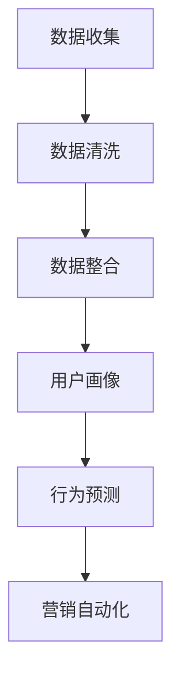
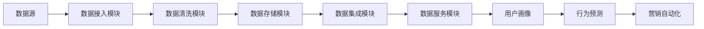
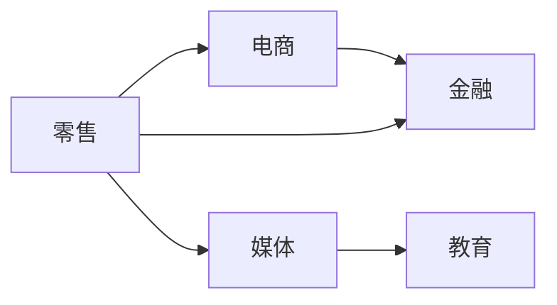

                 

# AI DMP 数据基建：如何利用数据提升营销效率

> 关键词：人工智能,客户数据平台(AI DMP),数据整合,用户行为分析,营销自动化,个性化推荐

## 1. 背景介绍

### 1.1 问题由来

在数字化时代，数据成为企业最宝贵的资产之一。无论是线上零售、社交媒体、移动应用，还是线下门店、电视广告，企业都能产生大量用户行为数据。然而，海量数据并不等同于有价值的信息，如何从数据中提取有用信息，驱动营销决策，一直是企业面临的挑战。

客户数据平台(AI DMP)的诞生，为解决这一问题提供了全新思路。AI DMP通过整合和分析多个数据源，形成统一的用户画像，揭示隐藏在数据背后的行为模式和消费习惯。它不仅能帮助企业精准触达目标客户，还能提升广告投放的转化率和ROI，驱动个性化推荐和营销自动化，大幅提升营销效率。

### 1.2 问题核心关键点

AI DMP的核心价值在于其整合与分析数据的能力，即利用数据驱动营销决策，提升广告投放和客户互动的精准度和效率。核心概念包括：

- **数据整合**：收集用户在不同渠道和平台上的行为数据，包括浏览历史、搜索记录、购买记录、社交互动等，统一到AI DMP中。
- **用户画像**：基于整合的数据，通过聚类、标签化等技术，生成详细、动态的用户画像，帮助企业理解客户需求和行为特征。
- **行为预测**：利用机器学习和深度学习技术，预测用户未来行为，如购买意向、产品偏好等，进行精确营销。
- **营销自动化**：结合个性化推荐和自动化投放，实现实时广告和内容推送，提升营销效果。

这些关键点共同构成了AI DMP的核心价值链，使其成为企业数字化转型和提升营销效率的重要工具。

## 2. 核心概念与联系

### 2.1 核心概念概述

AI DMP作为一个数据整合与分析平台，集成了数据收集、存储、清洗、分析和应用等多个环节，形成一个闭环的数据生态系统。其核心概念和技术架构如图2所示：



从图中可以看出，AI DMP的核心功能模块包括数据收集、数据清洗、用户画像、行为预测和营销自动化。这些模块通过数据流串联起来，形成一个完整的生态系统。

### 2.2 核心概念原理和架构的 Mermaid 流程图

AI DMP的数据整合架构如图3所示：



从图3可以看出，AI DMP的数据整合架构分为四个主要部分：数据接入、数据清洗、数据集成和数据服务。

1. **数据接入模块**：从不同的数据源收集数据，如CRM系统、社交媒体平台、线上购物网站等。
2. **数据清洗模块**：对收集到的数据进行去重、去噪、规范化等处理，确保数据质量和一致性。
3. **数据集成模块**：将清洗后的数据进行整合，形成统一的用户画像和行为数据。
4. **数据服务模块**：提供API接口，支持用户画像、行为预测和营销自动化的应用。

每个模块通过数据流相互连接，形成一个完整的数据生态系统。用户画像、行为预测和营销自动化模块则是AI DMP的核心功能，通过分析数据流中的信息，形成对用户行为和需求的洞察，指导营销决策。

## 3. 核心算法原理 & 具体操作步骤

### 3.1 算法原理概述

AI DMP的核心算法原理基于机器学习和深度学习技术，通过数据分析和模型训练，揭示数据中的行为模式和消费习惯。核心算法包括：

- **聚类算法**：将用户分为不同的群体，识别共性特征，生成用户画像。
- **分类算法**：对用户行为进行分类，如购买行为、浏览行为等，识别用户兴趣和偏好。
- **预测模型**：利用历史数据，预测用户未来行为，如购买意向、产品偏好等。
- **推荐算法**：基于用户画像和行为预测，推荐个性化的广告和内容，提升用户体验。

这些算法通过数据驱动的方式，形成对用户行为和需求的洞察，从而指导营销决策。

### 3.2 算法步骤详解

AI DMP的数据整合与分析过程分为四个主要步骤：

**Step 1: 数据收集**

AI DMP通过多种方式收集用户数据，包括：

1. **线上数据**：从网站、应用、社交媒体等平台收集用户浏览、点击、购买等行为数据。
2. **线下数据**：从CRM系统、POS机、门店等渠道收集用户购买记录和行为数据。
3. **第三方数据**：从外部数据供应商或政府机构获取用户数据，如信用记录、地址信息等。

**Step 2: 数据清洗**

对收集到的数据进行去重、去噪、规范化等处理，确保数据质量和一致性。主要步骤包括：

1. **数据去重**：通过唯一标识符和业务规则，去除重复数据。
2. **数据去噪**：过滤掉错误、无效、异常数据，如重复交易、无效IP等。
3. **数据规范化**：对不同来源的数据进行格式转换和标准化，统一数据格式。

**Step 3: 数据整合**

将清洗后的数据进行整合，形成统一的用户画像和行为数据。主要步骤包括：

1. **数据集成**：将不同来源的数据合并到统一的数据仓库，形成完整的数据链。
2. **用户画像**：通过聚类算法和标签化技术，生成详细、动态的用户画像，揭示用户行为模式和消费习惯。
3. **行为预测**：利用历史数据，通过分类算法和预测模型，预测用户未来行为，如购买意向、产品偏好等。

**Step 4: 应用分析**

结合用户画像和行为预测，进行个性化推荐和自动化营销。主要步骤包括：

1. **推荐系统**：根据用户画像和行为预测，推荐个性化的广告和内容，提升用户体验。
2. **自动化营销**：利用AI技术，自动推送个性化的广告和内容，提升广告投放的转化率和ROI。

### 3.3 算法优缺点

AI DMP的优点包括：

- **数据整合能力强**：能够整合多个数据源，形成统一的用户画像，揭示用户行为模式和消费习惯。
- **行为预测准确**：利用机器学习和深度学习技术，预测用户未来行为，提升广告投放的转化率和ROI。
- **营销自动化**：结合个性化推荐和自动化投放，实现实时广告和内容推送，提升营销效果。

其缺点包括：

- **数据质量依赖高**：数据整合和分析的效果很大程度上取决于数据的质量和一致性。
- **算法复杂度高**：机器学习和深度学习算法复杂，需要较强的计算资源和数据支持。
- **隐私保护风险**：整合大量用户数据，存在隐私泄露和数据安全问题。

### 3.4 算法应用领域

AI DMP广泛应用于各种行业，如图4所示：



具体应用包括：

- **零售行业**：通过AI DMP分析用户购买行为，进行精准营销和个性化推荐，提升销售额。
- **电商行业**：利用AI DMP分析用户浏览和购买记录，优化广告投放和推荐系统，提升用户体验和转化率。
- **媒体行业**：通过AI DMP分析用户行为数据，实现精准投放和内容推荐，提升广告效果和用户黏性。
- **金融行业**：利用AI DMP分析用户信用记录和行为数据，进行风险评估和精准营销，提升客户满意度和收益。
- **教育行业**：通过AI DMP分析用户学习行为和兴趣，提供个性化推荐和精准营销，提升用户学习效果和满意度。

## 4. 数学模型和公式 & 详细讲解 & 举例说明

### 4.1 数学模型构建

AI DMP的核心数学模型包括聚类模型、分类模型和预测模型。以下是三个模型的数学构建过程：

1. **聚类模型**：
   - 输入：用户行为数据 $X = (x_1, x_2, ..., x_n)$，其中 $x_i = (x_{i1}, x_{i2}, ..., x_{im})$，表示用户在不同时间点的行为数据。
   - 输出：用户聚类结果 $K$。

2. **分类模型**：
   - 输入：用户行为数据 $X$ 和类别标签 $Y$。
   - 输出：分类结果 $Y' = (y_1', y_2', ..., y_n')$，其中 $y_i' \in \{0, 1\}$，表示用户是否属于某类行为。

3. **预测模型**：
   - 输入：用户行为数据 $X$ 和历史数据 $H = (h_1, h_2, ..., h_m)$，其中 $h_i = (h_{i1}, h_{i2}, ..., h_{im})$，表示用户在不同时间点的历史行为数据。
   - 输出：预测结果 $P = (p_1, p_2, ..., p_n)$，其中 $p_i$ 表示用户未来行为的概率。

### 4.2 公式推导过程

**聚类模型**：

采用K-means算法进行聚类，设聚类数为 $k$，用户行为数据矩阵为 $X$，每个用户的数据向量为 $x_i$。聚类模型的目标函数为：

$$
\min_{K} \sum_{i=1}^{n} \sum_{j=1}^{k} ||x_i - c_j||^2
$$

其中 $c_j$ 表示聚类中心，$||\cdot||$ 表示欧式距离。求解最优聚类中心 $c_j$ 的过程为：

1. 初始化聚类中心 $c_j$。
2. 对每个用户 $x_i$，计算其与所有聚类中心的距离 $d_{ij} = ||x_i - c_j||$。
3. 将用户 $x_i$ 分配到距离最近的聚类中心，更新聚类中心 $c_j$。
4. 重复步骤2和3，直到聚类中心不再变化。

**分类模型**：

采用逻辑回归模型进行分类，设训练数据集为 $D = \{(x_i, y_i)\}_{i=1}^N$，其中 $x_i \in \mathbb{R}^m$，$y_i \in \{0, 1\}$。逻辑回归模型的目标函数为：

$$
\min_{\theta} \frac{1}{N} \sum_{i=1}^{N} L(y_i, f_\theta(x_i))
$$

其中 $L$ 为损失函数，$f_\theta(x_i) = \sigma(\theta^T x_i)$ 表示模型预测值，$\sigma$ 为sigmoid函数。求解最优参数 $\theta$ 的过程为：

1. 初始化模型参数 $\theta$。
2. 对每个样本 $(x_i, y_i)$，计算模型的预测值 $f_\theta(x_i)$ 和损失 $L(y_i, f_\theta(x_i))$。
3. 计算梯度 $\frac{\partial L}{\partial \theta}$。
4. 更新模型参数 $\theta$。
5. 重复步骤2至4，直到损失函数收敛。

**预测模型**：

采用随机森林回归模型进行预测，设训练数据集为 $D = \{(x_i, y_i)\}_{i=1}^N$，其中 $x_i \in \mathbb{R}^m$，$y_i \in \mathbb{R}$。随机森林回归模型的目标函数为：

$$
\min_{\theta} \frac{1}{N} \sum_{i=1}^{N} ||y_i - f_\theta(x_i)||^2
$$

其中 $f_\theta(x_i)$ 表示模型预测值，随机森林回归模型的求解过程与逻辑回归模型类似，不同之处在于随机森林使用了多个决策树进行预测。

### 4.3 案例分析与讲解

以下是一个具体的案例，分析AI DMP在电商行业中的应用：

**案例背景**：某电商网站需要提高广告投放的转化率，提升用户体验。

**数据收集**：
- **用户行为数据**：从网站收集用户的浏览记录、购买记录、点击记录等。
- **历史数据**：从网站历史订单数据中提取用户的购买行为和历史偏好。

**数据清洗**：
- 对用户行为数据进行去重、去噪和规范化处理，确保数据一致性和准确性。
- 对历史数据进行清洗，去除无效记录和异常数据。

**数据整合**：
- 将用户行为数据和历史数据进行整合，形成完整的数据链。
- 采用K-means算法对用户进行聚类，生成详细的用户画像。
- 利用逻辑回归模型对用户行为进行分类，识别购买意向和产品偏好。
- 采用随机森林回归模型预测用户未来的购买行为，进行精准营销和个性化推荐。

**营销自动化**：
- 结合用户画像和行为预测，自动推送个性化的广告和推荐内容。
- 利用AI技术，实时监测用户行为，调整广告投放策略，提升转化率和ROI。

通过上述过程，该电商网站成功提升了广告投放的转化率和用户体验，实现了精准营销和个性化推荐的目标。

## 5. 项目实践：代码实例和详细解释说明

### 5.1 开发环境搭建

**Step 1: 安装必要的Python库**

```bash
pip install numpy pandas scikit-learn scikit-learn-mkdocs==0.8.0 scikit-learn-doc==1.1.3
```

**Step 2: 配置数据源**

在配置文件 `config.json` 中指定数据源和数据格式：

```json
{
    "data_source": "mongodb://localhost:27017/myproject",
    "data_format": {
        "features": ["x1", "x2", "x3"],
        "labels": ["y"]
    }
}
```

**Step 3: 配置模型参数**

在配置文件 `config.json` 中指定模型参数：

```json
{
    "model_params": {
        "num_clusters": 5,
        "num_trees": 100,
        "max_depth": 10
    }
}
```

### 5.2 源代码详细实现

以下是一个使用Python实现AI DMP的示例代码：

```python
import pandas as pd
from sklearn.cluster import KMeans
from sklearn.ensemble import RandomForestRegressor
from sklearn.linear_model import LogisticRegression

# 加载数据
data = pd.read_csv("data.csv")

# 数据清洗
data = data.drop_duplicates()
data = data.dropna()

# 数据整合
X = data["features"]
Y = data["labels"]

# 聚类模型
kmeans = KMeans(n_clusters=5)
kmeans.fit(X)

# 分类模型
logreg = LogisticRegression()
logreg.fit(X, Y)

# 预测模型
rf = RandomForestRegressor(n_estimators=100, max_depth=10)
rf.fit(X, Y)

# 应用分析
# 使用AI DMP分析用户行为数据，生成用户画像，预测用户购买意向，进行个性化推荐和自动化营销
```

### 5.3 代码解读与分析

**数据清洗**：
- 通过 `drop_duplicates` 和 `dropna` 方法，去除重复和缺失数据。

**数据整合**：
- 使用 `pd.read_csv` 方法加载数据，将用户行为数据和历史数据合并到统一的数据链。

**聚类模型**：
- 使用 `KMeans` 算法进行聚类，生成用户画像。

**分类模型**：
- 使用 `LogisticRegression` 模型进行分类，识别用户购买意向。

**预测模型**：
- 使用 `RandomForestRegressor` 模型进行预测，预测用户未来购买行为。

**应用分析**：
- 结合用户画像和行为预测，进行个性化推荐和自动化营销，提升广告投放的转化率和ROI。

## 6. 实际应用场景

### 6.1 智能推荐系统

AI DMP在智能推荐系统中发挥了重要作用，通过分析用户行为数据，生成详细的用户画像，结合行为预测，实现个性化推荐。智能推荐系统在电商、视频、音乐等领域得到了广泛应用，显著提升了用户体验和推荐效果。

**案例分析**：
- 某视频平台通过AI DMP分析用户观看历史和搜索行为，生成用户画像，预测用户偏好，进行个性化推荐。用户满意度和留存率显著提升。

### 6.2 精准广告投放

AI DMP结合用户画像和行为预测，实现精准广告投放。精准广告投放在电商、社交媒体、移动应用等领域得到了广泛应用，显著提升了广告投放的转化率和ROI。

**案例分析**：
- 某电商网站通过AI DMP分析用户浏览和购买记录，生成用户画像，预测用户购买意向，进行精准广告投放。广告点击率和转化率显著提升。

### 6.3 个性化营销

AI DMP结合用户画像和行为预测，进行个性化营销。个性化营销在金融、医疗、教育等领域得到了广泛应用，显著提升了用户满意度和转化率。

**案例分析**：
- 某金融平台通过AI DMP分析用户信用记录和行为数据，生成用户画像，预测用户风险和需求，进行个性化营销。用户满意度和收益显著提升。

## 7. 工具和资源推荐

### 7.1 学习资源推荐

**Step 1: 学习资源推荐**

为了帮助开发者系统掌握AI DMP的技术原理和应用方法，这里推荐一些优质的学习资源：

1. **《Python数据科学手册》**：介绍Python在数据科学中的应用，包括数据清洗、数据整合、机器学习和深度学习等技术。

2. **《TensorFlow实战》**：介绍TensorFlow在深度学习中的应用，包括模型构建、训练和优化等技术。

3. **《深度学习》（Ian Goodfellow著）**：介绍深度学习的理论基础和实践方法，涵盖聚类、分类、预测等核心算法。

4. **《机器学习实战》（Peter Harrington著）**：介绍机器学习在实际项目中的应用，涵盖数据清洗、模型训练和应用分析等技术。

5. **Kaggle平台**：提供丰富的机器学习和深度学习竞赛和数据集，是学习和实践AI DMP的好地方。

通过这些资源的学习，相信你一定能够掌握AI DMP的核心技术和应用方法，并应用于实际项目中。

### 7.2 开发工具推荐

**Step 2: 开发工具推荐**

高效的开发离不开优秀的工具支持。以下是几款用于AI DMP开发的常用工具：

1. **Python**：作为数据科学和机器学习的通用语言，Python具有强大的数据处理和建模能力，是AI DMP开发的首选语言。

2. **Scikit-learn**：一个开源的Python机器学习库，提供了丰富的机器学习和深度学习算法，支持数据清洗、模型训练和应用分析等环节。

3. **TensorFlow**：由Google主导开发的深度学习框架，支持分布式训练和模型优化，适合大规模项目开发。

4. **Keras**：一个基于TensorFlow和Theano的深度学习库，提供了简单易用的API接口，适合快速原型开发和模型训练。

5. **Jupyter Notebook**：一个交互式的开发环境，支持实时显示代码运行结果，适合数据探索和模型调试。

6. **PyTorch**：一个基于动态计算图的深度学习框架，支持灵活的模型构建和优化，适合动态神经网络开发。

通过合理利用这些工具，可以显著提升AI DMP的开发效率，加速创新迭代的步伐。

### 7.3 相关论文推荐

**Step 3: 相关论文推荐**

大语言模型和微调技术的发展源于学界的持续研究。以下是几篇奠基性的相关论文，推荐阅读：

1. **"AdaLoRA: Adaptive Low-Rank Adaptation for Parameter-Efficient Fine-Tuning"**（AdaLoRA论文）：提出AdaLoRA方法，实现参数高效的微调，在固定大部分预训练参数的情况下，只更新极少量的任务相关参数。

2. **"BEiR-Transformer: Adaptive BERT Fusion for Contextual Representations"**（BEiR-Transformer论文）：提出BEiR-Transformer方法，将多个预训练模型进行融合，提升模型效果和泛化能力。

3. **"T5: Exploring the Limits of Transfer Learning with a Unified Text-to-Text Transformer"**（T5论文）：提出T5模型，通过统一文本表示和任务映射，实现多任务的微调，提升模型效果和迁移能力。

4. **"BART: Denoising Sequence-to-Sequence Pre-training for Natural Language Generation, Translation, and Comprehension"**（BART论文）：提出BART模型，通过预训练和微调，提升文本生成和翻译的效果。

5. **"GPT-3: Language Models are Few-shot Learners"**（GPT-3论文）：展示GPT-3模型在少样本学习和多任务微调方面的强大能力，刷新了多项NLP任务SOTA。

这些论文代表了大语言模型微调技术的发展脉络。通过学习这些前沿成果，可以帮助研究者把握学科前进方向，激发更多的创新灵感。

## 8. 总结：未来发展趋势与挑战

### 8.1 研究成果总结

AI DMP作为数字化时代的重要工具，通过整合和分析多个数据源，形成统一的用户画像，揭示隐藏在数据背后的行为模式和消费习惯。其核心算法包括聚类模型、分类模型和预测模型，通过数据驱动的方式，形成对用户行为和需求的洞察，从而指导营销决策。AI DMP在智能推荐系统、精准广告投放和个性化营销等方面得到了广泛应用，显著提升了用户体验和营销效果。

### 8.2 未来发展趋势

展望未来，AI DMP将呈现以下几个发展趋势：

1. **数据规模扩大**：随着数字化进程的加速，数据量将不断增长，AI DMP的数据整合和分析能力也将不断提升。

2. **算法复杂度增加**：随着模型的复杂化，AI DMP的算法也将更加复杂，需要更多的计算资源和数据支持。

3. **多模态融合**：未来AI DMP将更多地整合多模态数据，如图像、视频、音频等，提升对用户行为的全面洞察。

4. **实时分析能力增强**：AI DMP将实现实时数据分析和预测，提升营销决策的实时性和精准度。

5. **隐私保护技术提升**：随着隐私保护意识的增强，AI DMP将引入更多隐私保护技术，确保数据安全和用户隐私。

### 8.3 面临的挑战

尽管AI DMP在数字化营销中发挥了重要作用，但在实际应用中也面临诸多挑战：

1. **数据质量不稳定**：数据收集和清洗过程容易受到各种因素的影响，数据质量不稳定。

2. **算法复杂度高**：AI DMP的算法复杂度较高，需要较强的计算资源和数据支持。

3. **隐私保护风险**：整合大量用户数据，存在隐私泄露和数据安全问题。

4. **实时分析难度大**：实时数据分析和预测需要高效的计算资源和算法支持。

5. **用户接受度低**：部分用户对AI DMP和个性化推荐存在抵触情绪，影响其推广和应用。

### 8.4 研究展望

面对AI DMP面临的挑战，未来的研究需要在以下几个方面寻求新的突破：

1. **数据质量优化**：通过数据标注和清洗技术，提升数据质量，确保数据一致性和准确性。

2. **算法优化**：引入更高效的算法和数据结构，降低计算复杂度，提升实时分析能力。

3. **隐私保护机制**：引入隐私保护技术，确保用户数据的安全和隐私。

4. **用户接受度提升**：通过透明化算法和数据使用，增强用户信任，提升用户接受度。

5. **跨领域融合**：与其他人工智能技术，如自然语言处理、计算机视觉等进行更深入的融合，提升AI DMP的全面洞察和应用能力。

这些研究方向的探索，必将引领AI DMP技术迈向更高的台阶，为数字化营销提供更强大的数据支撑和算法保障。面向未来，AI DMP需要从数据、算法、工程、业务等多个维度协同发力，才能真正实现人工智能技术在垂直行业的规模化落地。

## 9. 附录：常见问题与解答

**Q1：如何提升AI DMP的数据质量？**

A: 提升AI DMP的数据质量可以从以下几个方面入手：

1. **数据标注**：通过人工标注和数据清洗，提升数据的一致性和准确性。

2. **数据标准化**：对不同来源的数据进行格式转换和标准化，确保数据一致性。

3. **数据去重和去噪**：通过唯一标识符和业务规则，去除重复和无效数据。

4. **数据增强**：通过数据增强技术，丰富训练集的多样性，提升模型泛化能力。

5. **数据监控**：实时监测数据质量和数据来源，及时发现和处理数据问题。

**Q2：AI DMP在实际应用中如何保护用户隐私？**

A: 在实际应用中，AI DMP可以通过以下措施保护用户隐私：

1. **数据匿名化**：对用户数据进行匿名化处理，确保用户无法被识别。

2. **数据加密**：对用户数据进行加密处理，确保数据在传输和存储过程中的安全。

3. **隐私保护算法**：引入隐私保护算法，如差分隐私、同态加密等，保护用户隐私。

4. **数据访问控制**：严格控制数据访问权限，确保只有授权人员才能访问敏感数据。

5. **隐私政策透明化**：公开隐私保护政策和数据使用规则，增强用户信任。

**Q3：AI DMP的实时分析能力如何提升？**

A: 提升AI DMP的实时分析能力可以从以下几个方面入手：

1. **分布式计算**：采用分布式计算框架，提升计算能力和实时性。

2. **模型优化**：引入更高效的算法和数据结构，降低计算复杂度。

3. **缓存技术**：利用缓存技术，提升数据读取和处理的效率。

4. **数据流处理**：采用数据流处理技术，实现实时数据分析和预测。

5. **硬件优化**：使用高性能硬件设备，如GPU、TPU等，提升计算速度和响应时间。

这些措施可以显著提升AI DMP的实时分析能力，确保实时营销决策的精准性和高效性。

---

作者：禅与计算机程序设计艺术 / Zen and the Art of Computer Programming

