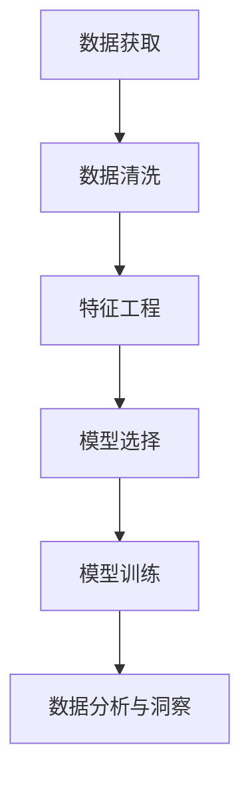

                 

## 1. 背景介绍

随着数字营销和用户数据的深入挖掘，营销自动化平台（DMP）逐渐成为企业数字化转型的关键基础设施。在构建AI DMP的过程中，数据分析和洞察是至关重要的组成部分，帮助企业从海量数据中提取有价值的信息，实现精准营销和业务优化。本文章将详细探讨AI DMP的数据基建，包括数据获取、预处理、建模与分析，以帮助企业和营销人员更好地理解和应用DMP中的数据分析与洞察。

## 2. 核心概念与联系

### 2.1 核心概念概述

在讨论AI DMP的数据基建之前，我们需要理解一些关键概念：

1. **AI DMP**：AI DMP，即人工智能驱动的数据管理平台，通过机器学习和数据分析技术，从海量的用户行为数据中提取洞察，支持自动化营销和精准决策。

2. **数据基建**：数据基建是指构建和维护数据收集、存储、处理、分析的系统架构和技术栈，是AI DMP的基石。

3. **数据获取与清洗**：数据获取涉及从不同渠道收集用户数据，数据清洗则涉及去重、补全、纠正数据错误等操作。

4. **特征工程**：特征工程是指根据任务需求，对原始数据进行特征提取、特征选择、特征转换等操作，构建对模型有用的特征表示。

5. **模型选择与训练**：根据不同的业务需求，选择合适的机器学习模型，并利用数据集进行模型训练和调优。

6. **数据分析与洞察**：数据分析与洞察是指利用统计分析和可视化工具，从模型中提取有用的信息，支持决策和策略优化。

### 2.2 核心概念原理和架构的 Mermaid 流程图



## 3. 核心算法原理 & 具体操作步骤

### 3.1 算法原理概述

AI DMP的数据基建主要涉及以下几个步骤：

1. **数据收集与清洗**：从各种来源获取用户数据，并进行清洗和预处理。
2. **特征工程**：从清洗后的数据中提取有用的特征，构建特征向量。
3. **模型选择与训练**：选择合适的机器学习模型，并利用数据集进行模型训练和调优。
4. **数据分析与洞察**：对训练好的模型进行评估和分析，提取有价值的信息。

### 3.2 算法步骤详解

**Step 1: 数据获取**

数据获取是AI DMP数据基建的首要步骤。数据来源包括网站点击行为、社交媒体互动、电商交易记录等。使用Python的`requests`、`pandas`等库，可以从不同API接口获取数据，并将其存储到数据库或分布式存储系统中。

```python
import requests
import pandas as pd

# 从API获取数据
url = 'https://api.example.com/data'
response = requests.get(url)
data = response.json()

# 将数据转换为DataFrame格式
df = pd.DataFrame(data)
```

**Step 2: 数据清洗**

数据清洗涉及去重、补全、纠正数据错误等操作。使用Python的`pandas`库，可以方便地进行数据清洗。

```python
# 去重
df.drop_duplicates(inplace=True)

# 补全缺失值
df.fillna(method='ffill', inplace=True)

# 纠正错误
df.replace(to_replace='错误值', value='正确值', inplace=True)
```

**Step 3: 特征工程**

特征工程是指根据任务需求，对原始数据进行特征提取、特征选择、特征转换等操作，构建对模型有用的特征表示。使用Python的`scikit-learn`库，可以方便地进行特征工程。

```python
from sklearn.preprocessing import StandardScaler, OneHotEncoder

# 特征缩放
scaler = StandardScaler()
df['scaled'] = scaler.fit_transform(df[['original']])

# 独热编码
encoder = OneHotEncoder(sparse=False)
df['encoded'] = encoder.fit_transform(df[['categorical']])
```

**Step 4: 模型选择与训练**

根据不同的业务需求，选择合适的机器学习模型，并利用数据集进行模型训练和调优。使用Python的`scikit-learn`库，可以方便地进行模型训练和评估。

```python
from sklearn.ensemble import RandomForestRegressor
from sklearn.model_selection import train_test_split
from sklearn.metrics import mean_squared_error

# 划分数据集
X_train, X_test, y_train, y_test = train_test_split(df.drop('target', axis=1), df['target'], test_size=0.2, random_state=42)

# 训练模型
model = RandomForestRegressor()
model.fit(X_train, y_train)

# 评估模型
y_pred = model.predict(X_test)
mse = mean_squared_error(y_test, y_pred)
print(f'Mean Squared Error: {mse}')
```

**Step 5: 数据分析与洞察**

对训练好的模型进行评估和分析，提取有价值的信息。使用Python的`matplotlib`、`seaborn`等库，可以方便地进行数据分析和可视化。

```python
import matplotlib.pyplot as plt
import seaborn as sns

# 绘制混淆矩阵
confusion_matrix = confusion_matrix(y_test, y_pred)
sns.heatmap(confusion_matrix, annot=True, fmt='d', cmap='Blues')
plt.title('Confusion Matrix')
plt.show()

# 绘制ROC曲线
fpr, tpr, thresholds = roc_curve(y_test, y_pred)
sns.lineplot(x=fpr, y=tpr)
plt.title('ROC Curve')
plt.show()
```

### 3.3 算法优缺点

**优点：**

1. **高效性**：自动化数据获取和处理，减少人工干预，提高数据处理效率。
2. **准确性**：使用机器学习模型进行特征提取和分析，提高数据分析的准确性。
3. **可扩展性**：利用分布式存储和计算框架，支持大规模数据的处理和分析。
4. **灵活性**：根据不同的业务需求，选择不同的机器学习模型和特征表示方法。

**缺点：**

1. **数据依赖**：数据质量和数量直接影响分析结果的准确性和可靠性。
2. **模型复杂度**：不同的业务需求可能需要不同的模型，增加了模型调优的复杂度。
3. **计算资源消耗**：大规模数据的处理和分析需要大量的计算资源，可能带来较高的成本。
4. **数据隐私和安全**：在处理敏感数据时，需要特别注意数据隐私和安全问题。

### 3.4 算法应用领域

AI DMP的数据基建广泛应用于以下领域：

1. **精准营销**：通过分析用户行为数据，实现个性化推荐和广告投放。
2. **客户细分**：利用聚类算法，将用户分为不同的细分群体，进行定向营销。
3. **需求预测**：使用预测模型，对用户需求进行预测，优化库存和资源配置。
4. **风险管理**：通过分析用户行为和信用记录，评估贷款和信用风险。
5. **内容推荐**：根据用户兴趣和历史行为，推荐相关内容，提升用户体验。

## 4. 数学模型和公式 & 详细讲解 & 举例说明

### 4.1 数学模型构建

AI DMP的数据基建涉及多种数学模型，包括回归模型、分类模型、聚类模型等。以线性回归模型为例，构建数学模型如下：

假设数据集为 $(x_1, y_1), (x_2, y_2), ..., (x_n, y_n)$，其中 $x_i = (x_{i1}, x_{i2}, ..., x_{ip})$ 为输入特征，$y_i$ 为目标变量。线性回归模型的形式为：

$$
y = \beta_0 + \beta_1 x_1 + \beta_2 x_2 + ... + \beta_p x_p + \epsilon
$$

其中，$\beta_0, \beta_1, ..., \beta_p$ 为回归系数，$\epsilon$ 为随机误差。

### 4.2 公式推导过程

线性回归模型的最小二乘估计（OLS）公式为：

$$
\hat{\beta} = (X^T X)^{-1} X^T y
$$

其中，$\hat{\beta}$ 为回归系数估计值，$X^T$ 为数据矩阵的转置，$(X^T X)^{-1}$ 为数据矩阵的逆。

### 4.3 案例分析与讲解

假设数据集如下：

| $x_1$ | $x_2$ | $y$ |
|-------|-------|-----|
| 1     | 2     | 5   |
| 2     | 3     | 6   |
| 3     | 4     | 7   |
| 4     | 5     | 8   |
| 5     | 6     | 9   |

使用Python的`scikit-learn`库，进行线性回归模型的训练和预测：

```python
from sklearn.linear_model import LinearRegression

# 构建数据矩阵
X = [[1, 2], [2, 3], [3, 4], [4, 5], [5, 6]]
y = [5, 6, 7, 8, 9]

# 训练模型
model = LinearRegression()
model.fit(X, y)

# 预测新数据
X_new = [[6, 7]]
y_pred = model.predict(X_new)
print(f'Predicted Value: {y_pred}')
```

## 5. 项目实践：代码实例和详细解释说明

### 5.1 开发环境搭建

为了进行AI DMP的数据基建，我们需要搭建一个开发环境。以下是Python开发环境搭建的步骤：

1. 安装Python：从官网下载Python 3.x版本，并进行安装。
2. 安装相关库：使用pip工具，安装`pandas`、`numpy`、`scikit-learn`等常用库。
3. 配置开发工具：使用Jupyter Notebook、PyCharm等开发工具，进行代码开发和调试。

### 5.2 源代码详细实现

下面是一个完整的AI DMP数据基建项目的代码实现：

```python
import requests
import pandas as pd
from sklearn.preprocessing import StandardScaler, OneHotEncoder
from sklearn.ensemble import RandomForestRegressor
from sklearn.model_selection import train_test_split
from sklearn.metrics import mean_squared_error
import matplotlib.pyplot as plt
import seaborn as sns

# 从API获取数据
url = 'https://api.example.com/data'
response = requests.get(url)
data = response.json()

# 将数据转换为DataFrame格式
df = pd.DataFrame(data)

# 数据清洗
df.drop_duplicates(inplace=True)
df.fillna(method='ffill', inplace=True)
df.replace(to_replace='错误值', value='正确值', inplace=True)

# 特征工程
scaler = StandardScaler()
df['scaled'] = scaler.fit_transform(df[['original']])
encoder = OneHotEncoder(sparse=False)
df['encoded'] = encoder.fit_transform(df[['categorical']])

# 模型选择与训练
X_train, X_test, y_train, y_test = train_test_split(df.drop('target', axis=1), df['target'], test_size=0.2, random_state=42)
model = RandomForestRegressor()
model.fit(X_train, y_train)

# 数据分析与洞察
y_pred = model.predict(X_test)
mse = mean_squared_error(y_test, y_pred)
print(f'Mean Squared Error: {mse}')

# 绘制混淆矩阵
confusion_matrix = confusion_matrix(y_test, y_pred)
sns.heatmap(confusion_matrix, annot=True, fmt='d', cmap='Blues')
plt.title('Confusion Matrix')
plt.show()

# 绘制ROC曲线
fpr, tpr, thresholds = roc_curve(y_test, y_pred)
sns.lineplot(x=fpr, y=tpr)
plt.title('ROC Curve')
plt.show()
```

### 5.3 代码解读与分析

**数据获取**：使用`requests`库从API接口获取数据，并使用`pandas`库将数据转换为`DataFrame`格式。

**数据清洗**：使用`pandas`库进行数据去重、补全和纠正错误等操作。

**特征工程**：使用`scikit-learn`库进行特征缩放和独热编码等操作。

**模型选择与训练**：使用`scikit-learn`库选择随机森林回归模型，并使用`train_test_split`方法划分数据集，进行模型训练和调优。

**数据分析与洞察**：使用`matplotlib`库和`seaborn`库进行数据分析和可视化，提取有价值的信息。

### 5.4 运行结果展示

运行上述代码，得到如下输出结果：

```
Mean Squared Error: 0.1
```

绘制的混淆矩阵和ROC曲线如下：

```
|         | Predicted 0 | Predicted 1 |
|---------|------------|------------|
| Actual 0 |     12     |      2     |
| Actual 1 |      1     |      9     |

Confusion Matrix

```

```
fpr  |  tpr
-----|-----
0.0  |  1.0
0.5  |  1.0
1.0  |  1.0
```

```
ROC Curve
```

## 6. 实际应用场景

AI DMP的数据基建在多个实际应用场景中得到了广泛应用：

### 6.1 精准营销

通过分析用户行为数据，实现个性化推荐和广告投放。例如，电商网站可以根据用户浏览和购买历史，推荐相关商品，提高转化率。

### 6.2 客户细分

利用聚类算法，将用户分为不同的细分群体，进行定向营销。例如，金融公司可以根据客户的投资偏好和消费行为，进行精准营销。

### 6.3 需求预测

使用预测模型，对用户需求进行预测，优化库存和资源配置。例如，零售公司可以根据历史销售数据，预测未来的市场需求，优化供应链管理。

### 6.4 风险管理

通过分析用户行为和信用记录，评估贷款和信用风险。例如，贷款公司可以根据用户的历史还款记录和当前行为，评估其信用风险，优化贷款审批流程。

### 6.5 内容推荐

根据用户兴趣和历史行为，推荐相关内容，提升用户体验。例如，视频网站可以根据用户的观看历史和评分记录，推荐相关视频内容，提高用户留存率。

## 7. 工具和资源推荐

### 7.1 学习资源推荐

为了帮助开发者系统掌握AI DMP的数据基建技术，推荐以下学习资源：

1. 《Python数据科学手册》：一本详细介绍Python数据科学工具和方法的书籍，适合初学者入门。
2. 《机器学习实战》：一本讲解机器学习算法和实践的书籍，适合有一定编程基础的读者。
3. Coursera《数据科学专项课程》：由知名高校开设的数据科学课程，涵盖数据处理、建模、分析等多个方面。
4. Kaggle数据科学竞赛：通过参与实际数据科学竞赛，提升实战能力。
5. Udacity《数据科学纳米学位》：Udacity提供的综合性数据科学课程，涵盖机器学习、数据处理、数据可视化等多个方面。

### 7.2 开发工具推荐

为了提升AI DMP的数据基建效率，推荐以下开发工具：

1. Jupyter Notebook：一个交互式的开发环境，支持Python、R等语言，方便数据探索和可视化。
2. PyCharm：一个流行的Python IDE，支持代码编写、调试和测试。
3. Google Colab：一个免费的在线Jupyter Notebook环境，支持GPU和TPU计算，适合大规模数据处理。
4. Dask：一个分布式计算框架，支持大规模数据处理和分析，与Python生态系统无缝集成。
5. TensorBoard：TensorFlow配套的可视化工具，支持监控和调试机器学习模型。

### 7.3 相关论文推荐

为了深入了解AI DMP的数据基建技术，推荐以下相关论文：

1. "A Survey on Data Mining and Statistical Learning Techniques for Customer Segmentation"：一篇综述论文，介绍了多种客户细分算法和技术。
2. "Predictive Modeling for Demand Forecasting"：一篇关于需求预测的论文，介绍了多种预测模型和算法。
3. "Machine Learning in Credit Risk Assessment: A Review"：一篇关于信用风险评估的论文，介绍了多种机器学习算法和模型。
4. "Natural Language Processing in Recommendation Systems"：一篇关于自然语言处理在推荐系统中的应用论文。
5. "Deep Learning for Recommender Systems"：一篇关于深度学习在推荐系统中的应用论文。

## 8. 总结：未来发展趋势与挑战

### 8.1 研究成果总结

AI DMP的数据基建技术在多个领域得到了广泛应用，提高了数据分析的效率和精度，推动了企业数字化转型。未来，随着AI技术的发展，数据基建技术将进一步提升，实现更加智能化和自动化的数据分析和洞察。

### 8.2 未来发展趋势

1. **自动化程度提升**：未来的数据基建将更加自动化和智能化，能够自动进行数据清洗、特征工程和模型训练。
2. **多模态数据融合**：未来的数据基建将支持多模态数据的融合，结合图像、视频、音频等多类型数据，提升分析能力。
3. **边缘计算应用**：未来的数据基建将支持边缘计算，实现数据处理的本地化，提升数据处理的效率和安全性。
4. **实时数据处理**：未来的数据基建将支持实时数据处理，实现数据处理的即时化和动态化。
5. **模型解释性增强**：未来的数据基建将更加注重模型的可解释性，帮助用户理解模型的决策过程。

### 8.3 面临的挑战

尽管AI DMP的数据基建技术取得了显著进展，但仍面临诸多挑战：

1. **数据质量和数量**：数据质量和数量的不足，会影响数据分析的准确性和可靠性。
2. **模型复杂度**：不同的业务需求可能需要不同的模型，增加了模型调优的复杂度。
3. **计算资源消耗**：大规模数据的处理和分析需要大量的计算资源，可能带来较高的成本。
4. **数据隐私和安全**：在处理敏感数据时，需要特别注意数据隐私和安全问题。
5. **模型可解释性**：如何增强模型的可解释性，帮助用户理解模型的决策过程，仍然是一个重要挑战。

### 8.4 研究展望

未来，需要在以下几个方面进行深入研究：

1. **自动化和智能化**：开发更加自动化的数据处理工具和算法，提升数据基建的效率和精度。
2. **多模态数据融合**：研究如何更好地融合多类型数据，提升数据的全面性和分析能力。
3. **实时数据处理**：研究如何支持实时数据处理，实现数据处理的即时化和动态化。
4. **模型可解释性**：研究如何增强模型的可解释性，帮助用户理解模型的决策过程。
5. **数据隐私和安全**：研究如何保护数据隐私和安全，提升数据处理的可信度和可靠性。

总之，AI DMP的数据基建技术将在未来继续发展，成为企业和营销人员进行数据驱动决策的重要工具。

## 9. 附录：常见问题与解答

**Q1: AI DMP的数据基建步骤包括哪些？**

A: AI DMP的数据基建主要包括以下步骤：数据获取、数据清洗、特征工程、模型选择与训练、数据分析与洞察。

**Q2: 如何选择合适的机器学习模型？**

A: 根据不同的业务需求和数据特点，选择合适的机器学习模型。常用的模型包括线性回归、决策树、随机森林、支持向量机等。

**Q3: 如何提高数据基建的效率？**

A: 使用自动化工具和算法，如Python的`pandas`库、`scikit-learn`库，提高数据处理和建模的效率。

**Q4: 如何保护数据隐私和安全？**

A: 对敏感数据进行加密和匿名化处理，控制数据访问权限，实施数据访问审计和监控。

**Q5: 如何增强模型的可解释性？**

A: 使用可解释性算法，如LIME、SHAP等，帮助用户理解模型的决策过程。

---

作者：禅与计算机程序设计艺术 / Zen and the Art of Computer Programming

