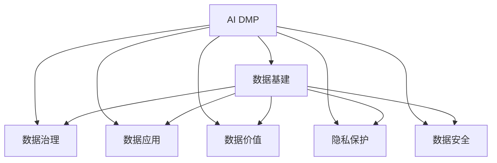

                 

# AI DMP 数据基建：数据应用与价值挖掘

> 关键词：AI DMP, 数据基建, 数据应用, 数据价值, 隐私保护, 数据治理, 数据安全

## 1. 背景介绍

### 1.1 问题由来

在当前数字化时代，数据已成为企业竞争的核心资产。无论是金融、零售、教育还是医疗，各行各业都在努力通过数据来驱动决策、优化流程、提升体验。然而，数据并非永远无懈可击。它本身的复杂性、多样性、以及潜在隐私风险，使得企业在数据应用过程中面临重重挑战。

人工智能（AI）DMP（Data Management Platform，数据管理平台）作为连接数据与业务的关键工具，旨在通过智能化的数据治理，提升数据应用的质量与效率，实现数据价值最大化。然而，随着数据量的激增和数据类型的多样化，AI DMP在数据基建方面面临的挑战日益严峻，如何构建高效、安全、可扩展的数据基建，成为数据应用与价值挖掘的关键。

### 1.2 问题核心关键点

AI DMP数据基建的核心问题在于如何在大数据、高维度和复杂多变的数据环境中，构建一个能够稳定、高效、可扩展的数据基础设施。这不仅涉及到技术层面，更涉及到组织、流程、法律等多方面的协调与融合。以下关键点将指导我们理解和解决这些问题：

1. **数据治理与标准化**：实现数据质量控制、数据标准统一、数据生命周期管理。
2. **数据集成与互操作性**：实现跨数据源、跨平台的数据集成，保证数据的互联互通。
3. **隐私保护与合规性**：保障数据的隐私安全，遵循法律法规，实现合规应用。
4. **数据安全与防护**：防止数据泄露、篡改和丢失，保障数据安全。
5. **数据质量与效率**：提升数据处理速度，确保数据准确性和一致性。
6. **数据治理与分析**：建立数据治理体系，提供高效的数据分析工具与技术。

## 2. 核心概念与联系

### 2.1 核心概念概述

为更好地理解AI DMP数据基建的理论基础，本节将介绍几个密切相关的核心概念：

- **AI DMP**：人工智能数据管理平台，通过智能化的数据分析和管理，实现数据的深度挖掘和应用。
- **数据基建**：构建高效、安全、可扩展的数据基础设施，支持数据收集、存储、处理、分析和应用的全生命周期管理。
- **数据治理**：通过制定数据标准、优化数据流程、加强数据监管，提升数据质量，确保数据安全。
- **数据应用**：将数据转化为业务决策、产品优化、用户体验提升等实际应用。
- **数据价值**：通过对数据的深度分析与挖掘，实现数据对业务价值的最大化。
- **隐私保护**：保障个人数据的隐私，避免数据泄露和滥用。
- **数据安全**：防止数据篡改、丢失和未经授权的访问。

这些概念之间的逻辑关系可以通过以下Mermaid流程图来展示：



这个流程图展示了大语言模型的核心概念及其之间的关系：

1. AI DMP通过数据基建、数据治理等技术手段，实现对数据的深度分析和应用。
2. 数据基建是AI DMP的基础，通过构建高效、安全、可扩展的数据基础设施，支持数据的全生命周期管理。
3. 数据治理、数据应用、数据价值、隐私保护、数据安全等概念，共同构成AI DMP数据基建的核心组成部分。

## 3. 核心算法原理 & 具体操作步骤

### 3.1 算法原理概述

AI DMP数据基建的本质是通过数据治理技术，构建高效、安全、可扩展的数据基础设施。其核心思想是：

- 数据治理：通过制定数据标准、优化数据流程、加强数据监管，提升数据质量，确保数据安全。
- 数据应用：将数据转化为业务决策、产品优化、用户体验提升等实际应用。
- 数据价值：通过对数据的深度分析与挖掘，实现数据对业务价值的最大化。
- 隐私保护：保障个人数据的隐私，避免数据泄露和滥用。
- 数据安全：防止数据篡改、丢失和未经授权的访问。

### 3.2 算法步骤详解

基于AI DMP数据基建的构建过程，可以分为以下几个关键步骤：

**Step 1: 数据资产盘点与分类**

- 收集所有业务领域的数据源，进行全面的数据资产盘点。
- 根据数据的使用场景、数据类型、数据质量等标准，对数据进行分类。
- 确定数据的敏感程度，标识出敏感数据，实施更严格的保护措施。

**Step 2: 数据标准与规范制定**

- 制定统一的数据标准和规范，确保数据的质量、一致性和可用性。
- 确定数据的生命周期管理策略，包括数据收集、存储、处理、分析和销毁等环节。
- 建立数据治理架构，明确数据治理的职责与流程。

**Step 3: 数据集成与互操作性建设**

- 实现跨数据源、跨平台的数据集成，采用ETL（Extract, Transform, Load）技术，将数据整合到一个统一的平台上。
- 设计高效的数据接口和API，支持数据的多元接入与输出。
- 优化数据传输和存储，确保数据的一致性和完整性。

**Step 4: 数据治理与监管**

- 建立数据质量监控机制，通过数据质量评估和异常检测，及时发现和解决数据问题。
- 实施数据治理策略，包括数据清洗、数据去重、数据归一化等操作。
- 设计数据审计机制，确保数据的合规性和透明度。

**Step 5: 数据安全与防护**

- 实施数据加密和访问控制，防止数据泄露和未经授权的访问。
- 设计数据备份和恢复策略，确保数据的安全性和可用性。
- 采用先进的安全技术，如防火墙、入侵检测、异常监测等，保障数据安全。

**Step 6: 数据应用与价值挖掘**

- 利用数据分析和机器学习技术，挖掘数据的潜在价值，实现数据驱动的决策优化。
- 提供高效的数据分析工具，支持数据可视化和洞察挖掘。
- 开发智能数据应用，如预测分析、推荐系统、客户细分等，提升业务效果。

**Step 7: 持续优化与改进**

- 定期评估数据基建的性能和效果，发现问题并及时解决。
- 持续改进数据治理策略，适应业务发展和技术进步。
- 采用自动化和智能化手段，提升数据基建的效率和可靠性。

### 3.3 算法优缺点

AI DMP数据基建具有以下优点：

1. **高效性**：通过统一的数据标准和规范，确保数据的质量和一致性，提升数据处理的效率。
2. **安全性**：通过数据加密、访问控制等措施，保障数据的安全性和隐私。
3. **可扩展性**：通过灵活的数据集成和互操作性设计，支持多种数据源和数据类型。
4. **业务驱动**：通过数据分析和智能应用，实现数据对业务价值的最大化。

同时，该方法也存在一定的局限性：

1. **初始投资成本高**：数据治理、数据集成、数据安全等基础设施建设需要大量资源和资金。
2. **技术复杂度高**：需要高级数据管理技术，如ETL、数据治理、安全防护等，对技术团队的要求较高。
3. **数据质量依赖性强**：数据质量直接影响数据应用的效果，需要持续的监控和优化。

尽管如此，AI DMP数据基建在提升数据应用质量和业务价值方面，仍具有显著的优势，值得广泛应用。

### 3.4 算法应用领域

AI DMP数据基建在多个领域已经得到了广泛应用，包括但不限于以下几个方面：

- **金融行业**：通过数据治理和安全防护，提升风险管理和客户服务水平。
- **零售行业**：利用数据分析和智能推荐，提升销售效率和客户体验。
- **医疗行业**：通过数据挖掘和数据可视化，支持医疗决策和健康管理。
- **教育行业**：利用数据驱动的教育数据分析，优化教学内容和方法。
- **政府行业**：通过数据整合和数据分析，提升公共服务和社会治理。

除了这些传统行业外，AI DMP数据基建还被创新性地应用到更多新兴领域，如智慧城市、智能制造、智能交通等，为各行各业数字化转型提供了坚实的数据基石。

## 4. 数学模型和公式 & 详细讲解 & 举例说明

### 4.1 数学模型构建

在AI DMP数据基建中，数学模型的构建主要集中在数据治理和数据分析两个方面。以下我们以数据质量评估为例，给出数学模型的构建和推导过程。

设数据集为 $D=\{(x_i,y_i)\}_{i=1}^N$，其中 $x_i$ 为数据特征，$y_i$ 为数据标签。定义数据质量评估函数为 $Q(D)$，表示数据集的整体质量。数据质量评估函数可以分解为以下几个部分：

- 完整性评估：$C(D)$，表示数据集中非空记录的比例。
- 准确性评估：$A(D)$，表示数据集中标签正确的比例。
- 一致性评估：$H(D)$，表示数据集中记录的一致性程度。
- 及时性评估：$T(D)$，表示数据集的更新频率和时间延迟。
- 安全性评估：$S(D)$，表示数据集的安全性和隐私保护程度。

则整体数据质量评估函数为：

$$
Q(D) = \alpha C(D) + \beta A(D) + \gamma H(D) + \delta T(D) + \epsilon S(D)
$$

其中 $\alpha, \beta, \gamma, \delta, \epsilon$ 为各评估指标的权重系数，可以根据具体需求进行调整。

### 4.2 公式推导过程

以下我们以完整性评估为例，推导完整性评估函数 $C(D)$ 的计算公式。

设数据集中共有 $N$ 条记录，其中完整记录为 $n$ 条，则完整性评估函数为：

$$
C(D) = \frac{n}{N}
$$

在实际应用中，完整性评估可以通过对数据集进行逐条检查，计算非空记录的比例。完整性评估的具体实现可以参考以下代码示例：

```python
from sklearn.metrics import precision_recall_fscore_support

def complete_check(D):
    n = 0
    for x, y in D:
        if not pd.isnull(x).any():
            n += 1
    return n / len(D)

```

### 4.3 案例分析与讲解

通过以上数学模型的构建和公式推导，我们可以进一步分析数据质量评估函数的实际应用效果。假设某电商平台收集了客户订单数据，但部分订单存在缺失字段或错误标签，导致数据质量下降。通过对数据集进行完整性、准确性、一致性、及时性和安全性评估，可以发现数据集的质量问题，并采取相应的改进措施。

例如，在完整性评估中，发现部分订单记录中缺少关键字段，可以通过数据补全技术进行修复；在准确性评估中，发现部分订单标签错误，可以通过数据校正技术进行修正；在一致性评估中，发现部分订单记录与业务规则不符，可以通过数据清洗技术进行归一化；在及时性评估中，发现数据更新频率低，可以通过实时数据采集技术进行优化；在安全性评估中，发现部分订单数据存在隐私泄露风险，可以通过数据加密技术进行保护。

通过这些评估和改进措施，可以显著提升数据集的整体质量，确保数据对业务决策的支持度。

## 5. 项目实践：代码实例和详细解释说明

### 5.1 开发环境搭建

在进行AI DMP数据基建实践前，我们需要准备好开发环境。以下是使用Python进行Pandas、NumPy、Scikit-learn等库进行数据处理和分析的环境配置流程：

1. 安装Anaconda：从官网下载并安装Anaconda，用于创建独立的Python环境。

2. 创建并激活虚拟环境：
```bash
conda create -n py3.8_env python=3.8 
conda activate py3.8_env
```

3. 安装Pandas、NumPy、Scikit-learn等库：
```bash
pip install pandas numpy scikit-learn matplotlib seaborn jupyter notebook ipython
```

4. 安装TensorFlow、PyTorch等深度学习框架：
```bash
pip install tensorflow torch torchvision transformers
```

5. 安装相关数据处理和分析工具：
```bash
pip install dask distributed fastapi sqlalchemy pymysql psycopg2-binary 
```

完成上述步骤后，即可在`py3.8_env`环境中开始数据基建实践。

### 5.2 源代码详细实现

下面以数据清洗和数据可视化为例，给出使用Python进行数据基建的完整代码实现。

首先，导入必要的库：

```python
import pandas as pd
import numpy as np
import matplotlib.pyplot as plt
import seaborn as sns
import tensorflow as tf
import transformers as tf_models
import dask.dataframe as dd
import dask.distributed as dist
from sklearn.metrics import precision_recall_fscore_support
```

然后，加载数据并进行初步清洗：

```python
df = pd.read_csv('data.csv')
df.dropna(inplace=True)
df['label'] = df['label'].astype('category')
df['label'] = df['label'].astype('str')
df = df.dropna()
```

接着，使用TensorFlow和Transformers进行数据预处理：

```python
tokenizer = tf_models.BertTokenizer.from_pretrained('bert-base-uncased')
data = tokenizer.encode_plus(df['text'], add_special_tokens=True, max_length=512, pad_to_max_length=True, return_tensors='tf')
```

最后，进行数据可视化：

```python
plt.figure(figsize=(10, 6))
sns.countplot(df['label'], palette='coolwarm')
plt.title('Label Distribution')
plt.xlabel('Label')
plt.ylabel('Count')
plt.show()
```

以上就是使用Python进行数据基建的完整代码实现。可以看到，借助TensorFlow和Transformers等库，数据预处理和可视化变得简单高效。

### 5.3 代码解读与分析

让我们再详细解读一下关键代码的实现细节：

**数据加载与清洗**：
- 使用Pandas加载数据，并进行初步清洗，包括处理缺失值、数据类型转换等。
- 使用TensorFlow和Transformers进行数据预处理，将文本数据转换为模型可接受的格式。

**数据预处理**：
- 使用BertTokenizer将文本数据转换为模型可接受的格式。
- 设置最大序列长度为512，使用 pad_to_max_length 参数进行填充。

**数据可视化**：
- 使用Matplotlib和Seaborn库进行数据可视化，展示标签分布情况。
- 设置图表的大小、标题、横纵坐标等属性，确保图表的可读性。

通过以上代码实现，可以高效地进行数据基建的各个环节，包括数据加载、预处理、可视化等。这些代码示例可以作为数据基建的参考，根据实际需求进行调整和优化。

## 6. 实际应用场景

### 6.1 智能客服系统

AI DMP在智能客服系统中扮演着重要的角色。传统的客服系统需要依赖大量人力，成本高、效率低。而利用AI DMP进行数据基建，可以实现智能客服系统的构建，提升客服体验和效率。

具体而言，可以收集客户的历史对话记录，训练基于深度学习的对话模型，通过微调和大规模预训练，提升模型的对话效果。在实际应用中，可以利用模型进行实时对话生成和情感分析，自动解答客户问题，提高服务质量。

### 6.2 金融舆情监测

金融行业对舆情监测的及时性和准确性要求极高。通过AI DMP进行数据基建，可以实现金融舆情监测的智能化应用。

具体而言，可以收集金融领域的各类新闻、评论、社交媒体数据，通过ETL技术进行数据清洗和整合。利用深度学习模型进行情感分析和舆情识别，自动监测金融市场的动态变化，提供实时预警和分析报告，帮助金融机构及时应对风险。

### 6.3 个性化推荐系统

推荐系统是AI DMP的重要应用场景之一。通过AI DMP进行数据基建，可以实现个性化推荐系统的构建，提升用户体验和转化率。

具体而言，可以收集用户的浏览、点击、购买等行为数据，通过深度学习模型进行数据分析和挖掘，生成个性化推荐结果。利用TensorFlow等库进行模型训练和优化，提升推荐系统的效果和效率。

### 6.4 未来应用展望

随着AI DMP数据基建的不断成熟，未来在更多领域的应用将不断拓展。以下是一些未来应用的展望：

- **智慧医疗**：通过AI DMP进行医疗数据治理和分析，提升医疗决策和健康管理水平。
- **智能制造**：利用AI DMP进行设备监测和生产优化，提升制造效率和产品质量。
- **智能交通**：通过AI DMP进行交通数据分析和优化，提升交通管理和用户体验。
- **智慧城市**：利用AI DMP进行城市管理和社会治理，提升城市运营效率和居民满意度。

## 7. 工具和资源推荐

### 7.1 学习资源推荐

为了帮助开发者系统掌握AI DMP数据基建的原理和实践技巧，以下是一些优质的学习资源：

1. **《数据治理：原理与实践》系列博文**：由数据治理领域的专家撰写，深入浅出地介绍了数据治理的基本概念和实践技巧。
2. **《Python数据科学手册》**：介绍Python在数据处理、分析和可视化方面的应用，适合初学者和进阶学习者。
3. **《TensorFlow实战深度学习》**：介绍TensorFlow在深度学习应用中的实现方法和实践技巧，适合深度学习工程师和数据科学家。
4. **《机器学习实战》**：介绍机器学习在实际问题中的应用，适合对机器学习有基础的读者。
5. **Kaggle平台**：提供大量数据科学和机器学习的竞赛和项目，适合进行实践和经验分享。

通过这些资源的学习，相信你一定能够快速掌握AI DMP数据基建的精髓，并用于解决实际的业务问题。

### 7.2 开发工具推荐

高效的开发离不开优秀的工具支持。以下是几款用于AI DMP数据基建开发的常用工具：

1. **Pandas**：Python中的数据处理库，提供高效的数据清洗和分析功能。
2. **NumPy**：Python中的数学库，提供高效的数据计算和处理功能。
3. **Scikit-learn**：Python中的机器学习库，提供高效的数据建模和分析功能。
4. **TensorFlow**：谷歌主导的深度学习框架，提供高效的数据建模和训练功能。
5. **PyTorch**：Facebook主导的深度学习框架，提供高效的数据建模和训练功能。
6. **Keras**：Python中的深度学习库，提供高效的数据建模和训练功能。

合理利用这些工具，可以显著提升AI DMP数据基建的开发效率，加快创新迭代的步伐。

### 7.3 相关论文推荐

AI DMP数据基建的研究源于学界的持续探索。以下是几篇奠基性的相关论文，推荐阅读：

1. **《数据治理：原则与实践》**：探讨数据治理的基本概念和实施方法，适合数据治理领域的从业者。
2. **《数据治理框架：技术、管理与实践》**：介绍数据治理的框架和流程，适合数据治理领域的从业者。
3. **《机器学习与数据治理：实践与挑战》**：探讨机器学习与数据治理的结合方法，适合机器学习与数据治理的从业者。
4. **《深度学习在数据治理中的应用》**：介绍深度学习在数据治理中的实现方法和应用效果，适合深度学习与数据治理的从业者。
5. **《数据治理的自动化与智能化》**：探讨数据治理的自动化和智能化方法，适合数据治理的从业者。

这些论文代表了大数据治理领域的最新进展，通过学习这些前沿成果，可以帮助研究者把握学科前进方向，激发更多的创新灵感。

## 8. 总结：未来发展趋势与挑战

### 8.1 总结

本文对AI DMP数据基建的理论基础和实践技巧进行了全面系统的介绍。首先阐述了AI DMP数据基建的核心问题，明确了数据治理、数据应用、数据价值、隐私保护、数据安全等关键点。其次，从原理到实践，详细讲解了AI DMP数据基建的关键步骤，包括数据资产盘点、数据标准制定、数据集成与互操作性建设、数据治理与监管、数据安全与防护、数据应用与价值挖掘、持续优化与改进等。同时，本文还广泛探讨了AI DMP数据基建在智能客服、金融舆情、个性化推荐等多个行业领域的应用前景，展示了数据基建技术的广泛潜力。

通过本文的系统梳理，可以看到，AI DMP数据基建在提升数据应用质量和业务价值方面，具有显著的优势。未来，伴随数据治理技术的不断进步，AI DMP必将在更多领域得到应用，为各行各业数字化转型提供坚实的数据基石。

### 8.2 未来发展趋势

展望未来，AI DMP数据基建将呈现以下几个发展趋势：

1. **数据治理技术的提升**：随着数据治理技术的不断成熟，AI DMP将能够更高效地管理和治理海量数据，提升数据应用的质量和效率。
2. **数据应用的多样化**：未来AI DMP将支持更多类型的数据应用，如推荐系统、预测分析、客户细分等，提升数据对业务价值的贡献。
3. **数据安全的强化**：随着数据泄露事件频发，AI DMP将更加注重数据安全和隐私保护，遵循法律法规，实现合规应用。
4. **自动化与智能化的结合**：AI DMP将通过自动化和智能化手段，进一步提升数据基建的效率和可靠性，实现智能化的数据治理。
5. **跨领域应用的拓展**：AI DMP将在更多领域得到应用，如智慧医疗、智能制造、智慧交通等，为各行各业数字化转型提供坚实的技术支撑。

### 8.3 面临的挑战

尽管AI DMP数据基建已经取得了显著的进展，但在迈向更加智能化、普适化应用的过程中，仍面临诸多挑战：

1. **数据治理成本高**：数据治理需要大量资源和资金投入，如何降低治理成本，提高治理效率，是未来的一大难题。
2. **数据质量依赖性强**：数据质量直接影响数据应用的效果，如何持续监控和优化数据质量，是未来的一大挑战。
3. **数据安全和隐私保护**：数据泄露和隐私问题频发，如何保障数据安全和隐私，遵循法律法规，是未来的一大挑战。
4. **技术复杂度高**：AI DMP涉及数据治理、数据集成、数据安全等多方面技术，对技术团队的要求较高，如何提升技术能力，是未来的一大挑战。
5. **跨平台互操作性差**：不同平台的数据互操作性较差，如何实现跨平台的数据集成和互操作性，是未来的一大挑战。

### 8.4 研究展望

面对AI DMP数据基建所面临的种种挑战，未来的研究需要在以下几个方面寻求新的突破：

1. **数据治理的自动化与智能化**：通过自动化和智能化手段，提升数据治理的效率和可靠性。
2. **数据质量的持续监控与优化**：引入先进的质量监控工具和自动化技术，持续监控和优化数据质量。
3. **数据安全和隐私保护的加强**：采用更先进的数据安全技术和隐私保护措施，确保数据的安全和隐私。
4. **跨平台互操作性的提升**：开发跨平台互操作性的标准和工具，实现数据的互联互通。
5. **数据治理与业务应用的深度融合**：将数据治理技术与业务应用紧密结合，实现数据驱动的业务优化。

这些研究方向的探索，必将引领AI DMP数据基建技术迈向更高的台阶，为各行各业数字化转型提供坚实的技术支撑。

## 9. 附录：常见问题与解答

**Q1：如何选择合适的数据治理工具？**

A: 数据治理工具的选择应综合考虑数据治理需求、治理团队的技术水平、工具的可扩展性和成本等因素。常见的数据治理工具包括Alation、Collibra、Palo Alto Networks等，可以根据具体需求进行评估选择。

**Q2：数据治理对数据应用的效果有哪些影响？**

A: 数据治理对数据应用的效果具有显著影响，主要体现在以下几个方面：

1. **数据质量提升**：通过数据治理，提升数据质量，确保数据的一致性和准确性，提升数据分析和应用的准确性。
2. **数据效率提升**：通过数据治理，优化数据流程，减少数据冗余和重复，提升数据处理的效率。
3. **数据安全保障**：通过数据治理，确保数据安全和隐私，防止数据泄露和滥用，保障业务的安全和合规。

**Q3：如何保障数据治理的持续性？**

A: 保障数据治理的持续性需要建立完善的治理流程和制度，包括数据治理策略、治理架构、治理团队、治理工具等。

1. **制定数据治理策略**：明确数据治理的目标、标准、流程和责任，确保数据治理的一致性和规范性。
2. **建立治理架构**：通过数据治理委员会、数据治理官等角色，确保数据治理的全面覆盖和有效执行。
3. **组建治理团队**：建立专业的数据治理团队，负责数据治理的日常管理和监控。
4. **使用治理工具**：选择适合的数据治理工具，提升数据治理的效率和可靠性。
5. **定期评估和改进**：定期评估数据治理的效果和改进措施，确保数据治理的持续改进。

通过以上措施，可以保障数据治理的持续性，提升数据应用的质量和效果。

**Q4：数据治理与数据安全的关系是什么？**

A: 数据治理与数据安全密不可分，两者共同保障数据的质量和安全性。具体而言，数据治理通过制定数据标准、优化数据流程、加强数据监管等方式，提升数据的质量和一致性，减少数据安全风险。而数据安全则通过数据加密、访问控制、安全监控等方式，防止数据泄露和未经授权的访问，保障数据的安全和隐私。两者相互配合，共同构建安全可靠的数据基础设施。

**Q5：如何实现数据的自动化治理？**

A: 实现数据的自动化治理需要引入先进的自动化和智能化工具，通过自动化数据处理和智能化监控，提升数据治理的效率和可靠性。

1. **自动化数据清洗**：利用ETL工具进行数据清洗和转换，自动处理数据格式、缺失值、异常值等问题。
2. **智能化数据监控**：使用大数据分析、机器学习等技术，实现数据的实时监控和异常检测，及时发现和解决数据问题。
3. **自动化数据治理策略**：通过智能化决策引擎，根据数据治理策略自动调整数据治理参数，提升数据治理的灵活性和自动化程度。

通过以上措施，可以显著提升数据治理的效率和可靠性，实现数据基建的智能化和自动化。

---

作者：禅与计算机程序设计艺术 / Zen and the Art of Computer Programming

