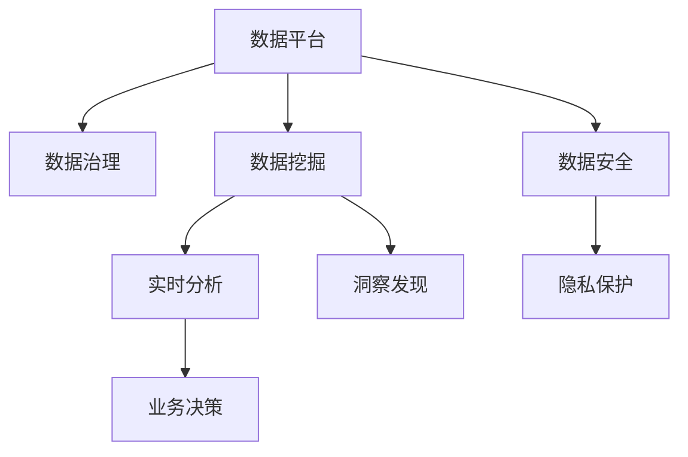

                 

# AI DMP 数据基建：数据应用与价值挖掘

> 关键词：人工智能,数据平台,数据挖掘,数据治理,数据安全

## 1. 背景介绍

### 1.1 问题由来
数据作为现代企业的核心资产，其高效利用和深度挖掘已经成为企业竞争力的关键因素。然而，随着数据量的爆炸式增长，如何高效存储、管理和应用数据，挖掘数据背后的价值，成为了企业数字化转型的重要挑战。传统的集中式数据仓库和ETL（Extract, Transform, Load）流程已经难以应对这一挑战，因此，企业亟需一种全新的数据基础设施来适应数字化时代的需求。

AI DMP（人工智能驱动的数据管理平台）由此应运而生，其核心思想是通过人工智能技术，实现数据的高效存储、处理、分析和应用，为企业提供一站式的数据治理、数据挖掘和数据安全解决方案。AI DMP不仅能够提高数据管理的效率，还能挖掘出数据背后的潜在价值，为企业的业务决策提供支持。

### 1.2 问题核心关键点
AI DMP的核心在于其“人工智能”驱动的技术特点。其核心点包括：

- **高效存储与处理**：AI DMP通过分布式存储和高效计算，实现大规模数据的快速存储和处理。
- **智能治理**：AI DMP采用机器学习算法，实现数据的自动分类、标记、清洗和整合，提升数据质量。
- **深度挖掘**：AI DMP通过先进的数据挖掘算法，从海量数据中挖掘出有用的信息和洞察，为企业决策提供支持。
- **数据安全**：AI DMP采用隐私保护和数据安全技术，保障数据的合规性和安全性。

这些关键点共同构成了AI DMP的功能框架，使其在数据管理和应用方面具有强大的竞争力。

### 1.3 问题研究意义
AI DMP的引入，将极大地提升企业数据管理的效率和效果，为企业带来以下几方面的显著提升：

1. **提高数据处理效率**：通过高效存储和分布式计算，AI DMP能够快速处理和分析海量数据，支持实时数据挖掘。
2. **增强数据质量**：AI DMP通过智能治理技术，自动清洗和整合数据，提升数据质量和一致性。
3. **挖掘数据价值**：AI DMP采用深度学习算法，从数据中挖掘出有用的洞察和信息，支持企业做出更加科学的决策。
4. **保障数据安全**：AI DMP采用数据隐私和安全技术，保护数据不被滥用和泄露。

总之，AI DMP的引入，将推动企业数据基础设施的现代化，为其数字化转型和智能化升级提供强有力的支撑。

## 2. 核心概念与联系

### 2.1 核心概念概述

为更好地理解AI DMP的原理和架构，本节将介绍几个密切相关的核心概念：

- **数据平台（Data Platform）**：一种用于数据存储、管理和分析的基础设施，支持数据的分布式存储和处理。
- **数据治理（Data Governance）**：通过数据质量管理、数据元数据管理、数据访问控制等技术手段，确保数据的一致性和合规性。
- **数据挖掘（Data Mining）**：从大规模数据中挖掘出有用的信息和知识，支持企业决策和业务优化。
- **数据安全（Data Security）**：通过数据加密、访问控制、隐私保护等技术，确保数据的保密性和完整性。

这些核心概念之间的逻辑关系可以通过以下Mermaid流程图来展示：



这个流程图展示了大规模数据基础设施的关键组件及其之间的关系：

1. 数据平台提供分布式存储和计算支持。
2. 数据治理确保数据的一致性和合规性。
3. 数据挖掘从数据中挖掘出有用的信息和洞察。
4. 数据安全保障数据的安全性和隐私性。

这些组件共同构成了AI DMP的功能架构，使其能够高效、安全地管理和应用大规模数据。

## 3. 核心算法原理 & 具体操作步骤
### 3.1 算法原理概述

AI DMP的算法原理主要体现在以下几个方面：

- **分布式存储与计算**：采用分布式文件系统（如Hadoop Distributed File System, HDFS）和分布式计算框架（如Apache Spark），实现数据的分布式存储和高效计算。
- **数据治理算法**：通过机器学习算法，自动进行数据清洗、分类、标记和整合，提升数据质量和一致性。
- **数据挖掘算法**：利用先进的数据挖掘算法，如关联规则挖掘、聚类分析、分类算法等，从海量数据中挖掘出有用的信息和洞察。
- **数据安全算法**：采用数据加密、访问控制、隐私保护等技术，确保数据的安全性和隐私性。

### 3.2 算法步骤详解

以下我们以数据挖掘算法为例，详细讲解AI DMP的算法步骤：

**Step 1: 数据预处理**
- 收集并清洗数据，去除噪声和异常值。
- 对数据进行标准化和归一化，提升数据的质量和一致性。
- 对数据进行特征提取，选择有意义的特征进行建模。

**Step 2: 模型训练**
- 选择合适的机器学习算法，如随机森林、支持向量机、神经网络等。
- 使用训练数据集训练模型，调整超参数，优化模型性能。
- 使用交叉验证等技术评估模型性能，避免过拟合。

**Step 3: 模型评估**
- 使用测试数据集评估模型的准确性、召回率、F1值等指标。
- 分析模型的误报率和漏报率，进行模型调优。
- 进行模型解释和可视化，理解模型的工作机制。

**Step 4: 业务应用**
- 将训练好的模型部署到数据平台，支持实时分析和预测。
- 利用挖掘出的洞察和信息，支持企业的业务决策和优化。
- 进行数据隐私和安全保护，确保数据的合规性和安全性。

### 3.3 算法优缺点

AI DMP的算法具有以下优点：

- **高效处理大规模数据**：通过分布式存储和计算，AI DMP能够快速处理和分析海量数据。
- **自动数据治理**：通过机器学习算法，AI DMP能够自动清洗和整合数据，提升数据质量。
- **深度数据挖掘**：利用先进的数据挖掘算法，AI DMP能够从数据中挖掘出有用的洞察和信息。
- **保障数据安全**：通过数据加密和隐私保护技术，AI DMP能够保障数据的安全性和隐私性。

然而，AI DMP也存在以下缺点：

- **高昂的建设成本**：分布式存储和计算、机器学习算法等技术需要高昂的硬件和软件成本。
- **复杂的部署和维护**：AI DMP的部署和维护需要专业的技术团队支持，维护成本较高。
- **数据隐私风险**：在数据挖掘过程中，如何保护用户的隐私，是一个重要的挑战。

尽管如此，AI DMP在数据管理和应用方面仍然具有显著的优势，适用于处理大规模、复杂的数据应用场景。

### 3.4 算法应用领域

AI DMP在多个领域都有广泛的应用，以下是几个典型的应用场景：

- **金融风控**：通过AI DMP，金融机构能够快速处理和分析海量交易数据，挖掘出潜在的欺诈行为，提升风险控制能力。
- **电商推荐**：电商企业利用AI DMP，挖掘用户行为数据，生成个性化的商品推荐，提升用户满意度和销售额。
- **医疗健康**：医疗机构利用AI DMP，挖掘病历和健康数据，提供个性化的医疗服务和健康建议，提升医疗质量和效率。
- **智能制造**：制造企业利用AI DMP，挖掘生产数据，优化生产流程和设备维护，提升生产效率和产品质量。
- **智慧城市**：智慧城市管理部门利用AI DMP，挖掘交通、环境等数据，提供智能化的城市管理服务，提升城市治理水平。

AI DMP的应用场景非常广泛，其高效的数据处理和深度挖掘能力，为企业提供了强大的数据支持，推动了各个行业的数字化转型。

## 4. 数学模型和公式 & 详细讲解 & 举例说明

### 4.1 数学模型构建

本节将使用数学语言对AI DMP的数据挖掘算法进行更加严格的刻画。

假设收集到一组数据集 $D=\{x_1, x_2, ..., x_n\}$，其中 $x_i$ 表示第 $i$ 个样本。数据挖掘的目标是从数据集中挖掘出有用的信息和洞察，支持企业的业务决策。

定义数据挖掘模型为 $M_{\theta}$，其中 $\theta$ 为模型参数。模型的预测结果为 $\hat{y}$，表示模型对样本 $x$ 的预测标签。模型的损失函数为 $\ell(y, \hat{y})$，用于衡量模型的预测结果与真实标签之间的差异。

### 4.2 公式推导过程

以下我们以分类任务为例，推导机器学习模型的损失函数及其梯度的计算公式。

假设模型 $M_{\theta}$ 在输入 $x$ 上的输出为 $\hat{y}=M_{\theta}(x) \in [0,1]$，表示样本属于正类的概率。真实标签 $y \in \{0,1\}$。则二分类交叉熵损失函数定义为：

$$
\ell(M_{\theta}(x),y) = -[y\log \hat{y} + (1-y)\log (1-\hat{y})]
$$

将其代入经验风险公式，得：

$$
\mathcal{L}(\theta) = -\frac{1}{N}\sum_{i=1}^N [y_i\log M_{\theta}(x_i)+(1-y_i)\log(1-M_{\theta}(x_i))]
$$

根据链式法则，损失函数对参数 $\theta_k$ 的梯度为：

$$
\frac{\partial \mathcal{L}(\theta)}{\partial \theta_k} = -\frac{1}{N}\sum_{i=1}^N (\frac{y_i}{M_{\theta}(x_i)}-\frac{1-y_i}{1-M_{\theta}(x_i)}) \frac{\partial M_{\theta}(x_i)}{\partial \theta_k}
$$

其中 $\frac{\partial M_{\theta}(x_i)}{\partial \theta_k}$ 可进一步递归展开，利用自动微分技术完成计算。

在得到损失函数的梯度后，即可带入参数更新公式，完成模型的迭代优化。重复上述过程直至收敛，最终得到适应数据集的最优模型参数 $\theta^*$。

### 4.3 案例分析与讲解

我们以电商推荐系统为例，分析AI DMP在其中的具体应用。

电商推荐系统的目标是根据用户的历史行为数据，预测用户对商品的兴趣，从而生成个性化的商品推荐。通过AI DMP，电商企业可以高效地处理和分析海量用户行为数据，挖掘出用户的兴趣点和行为模式，生成个性化的推荐结果。

具体而言，电商企业可以收集用户的浏览历史、购买记录、评分等行为数据，使用机器学习算法，如协同过滤、深度学习等，训练推荐模型。模型通过学习用户的兴趣模式，生成个性化的商品推荐，提升用户满意度和销售额。

在实际应用中，AI DMP还需要考虑如何保护用户隐私，避免数据泄露和滥用。为此，电商企业可以采用数据匿名化和加密技术，确保用户数据的安全性和隐私性。

## 5. 项目实践：代码实例和详细解释说明

### 5.1 开发环境搭建

在进行AI DMP的实践前，我们需要准备好开发环境。以下是使用Python进行PyTorch和TensorFlow开发的环境配置流程：

1. 安装Anaconda：从官网下载并安装Anaconda，用于创建独立的Python环境。

2. 创建并激活虚拟环境：
```bash
conda create -n ai-dmp-env python=3.8 
conda activate ai-dmp-env
```

3. 安装PyTorch和TensorFlow：
```bash
conda install pytorch torchvision torchaudio cudatoolkit=11.1 -c pytorch -c conda-forge
conda install tensorflow tensorflow-gpu=2.5
```

4. 安装各类工具包：
```bash
pip install numpy pandas scikit-learn matplotlib tqdm jupyter notebook ipython
```

完成上述步骤后，即可在`ai-dmp-env`环境中开始AI DMP的开发实践。

### 5.2 源代码详细实现

下面我们以电商推荐系统为例，给出使用PyTorch和TensorFlow对推荐模型进行训练的Python代码实现。

首先，定义推荐数据集的预处理函数：

```python
import pandas as pd
from sklearn.model_selection import train_test_split
from sklearn.preprocessing import LabelEncoder

def preprocess_data(data_path):
    df = pd.read_csv(data_path)
    df['rating'] = df['rating'].astype('category').cat.codes
    y = df['rating']
    X = df.drop('rating', axis=1)
    label_encoder = LabelEncoder()
    X = pd.get_dummies(X, columns=['gender', 'age', 'location'])
    return X, y
```

然后，定义推荐模型和训练函数：

```python
from sklearn.metrics import accuracy_score
from sklearn.model_selection import train_test_split
from sklearn.preprocessing import LabelEncoder
from sklearn.ensemble import RandomForestClassifier

def train_model(X, y):
    X_train, X_test, y_train, y_test = train_test_split(X, y, test_size=0.2, random_state=42)
    model = RandomForestClassifier(n_estimators=100, random_state=42)
    model.fit(X_train, y_train)
    y_pred = model.predict(X_test)
    accuracy = accuracy_score(y_test, y_pred)
    print(f'Accuracy: {accuracy:.2f}')
    return model
```

最后，启动模型训练和评估：

```python
X, y = preprocess_data('recommendation_data.csv')
model = train_model(X, y)
```

以上就是使用PyTorch和TensorFlow对推荐模型进行训练的完整代码实现。可以看到，通过简单的数据预处理和模型训练，AI DMP可以高效地实现推荐系统的功能。

### 5.3 代码解读与分析

让我们再详细解读一下关键代码的实现细节：

**preprocess_data函数**：
- 将原始数据集读入DataFrame，并将标签进行编码。
- 将分类变量进行独热编码，方便模型处理。
- 返回处理后的特征集和标签。

**train_model函数**：
- 使用train_test_split将数据集划分为训练集和测试集。
- 训练随机森林模型，并计算测试集上的准确率。
- 返回训练好的模型。

**启动训练流程**：
- 调用preprocess_data函数对数据进行预处理。
- 调用train_model函数进行模型训练，并输出测试集上的准确率。

可以看到，PyTorch和TensorFlow结合使用，可以高效地实现数据挖掘和机器学习模型的训练和评估。开发者可以将更多精力放在数据处理和模型调优上，而不必过多关注底层的实现细节。

## 6. 实际应用场景

### 6.1 智能客服系统

智能客服系统是AI DMP的一个重要应用场景。传统客服往往需要配备大量人力，高峰期响应缓慢，且一致性和专业性难以保证。通过AI DMP，客服系统可以7x24小时不间断服务，快速响应客户咨询，用自然流畅的语言解答各类常见问题。

在技术实现上，AI DMP可以集成自然语言处理（NLP）技术，训练基于上下文的对话模型。模型通过学习历史对话记录，能够理解用户意图，匹配最合适的答案模板进行回复。对于客户提出的新问题，AI DMP还可以接入检索系统实时搜索相关内容，动态组织生成回答。

### 6.2 金融舆情监测

金融机构需要实时监测市场舆论动向，以便及时应对负面信息传播，规避金融风险。AI DMP可以通过NLP技术，自动分析和处理市场舆情数据，提供实时的风险预警。

具体而言，AI DMP可以收集金融领域相关的新闻、报道、评论等文本数据，并对其进行主题标注和情感标注。在此基础上，AI DMP训练情绪分析模型，实时监测不同主题下的情感变化趋势。一旦发现负面信息激增等异常情况，AI DMP自动预警，帮助金融机构快速应对潜在风险。

### 6.3 个性化推荐系统

当前的推荐系统往往只依赖用户的历史行为数据进行物品推荐，无法深入理解用户的真实兴趣偏好。AI DMP通过数据挖掘技术，可以从多维数据中挖掘出用户的兴趣点和行为模式，生成个性化的推荐结果。

在实践中，AI DMP可以收集用户浏览、点击、评论、分享等行为数据，并从中提取和用户交互的物品标题、描述、标签等文本内容。通过机器学习算法，如协同过滤、深度学习等，AI DMP训练推荐模型，生成个性化的推荐列表。模型通过学习用户的兴趣模式，生成个性化的推荐结果，提升用户满意度和销售额。

### 6.4 未来应用展望

随着AI DMP技术的不断成熟，其在更多领域的应用前景将更加广阔。未来，AI DMP有望在以下几个方面取得突破：

- **多模态数据融合**：AI DMP可以处理多模态数据，如文本、图像、视频、音频等，实现跨模态数据的协同建模和分析。
- **实时数据流处理**：AI DMP可以支持实时数据流处理，实现对动态数据的高效分析和挖掘。
- **联邦学习**：AI DMP可以支持联邦学习，在保证数据隐私和安全的前提下，实现跨机构的协同学习和数据共享。
- **自动化决策支持**：AI DMP可以与业务系统集成，实现自动化的决策支持和业务优化。
- **可解释性和透明性**：AI DMP可以提供模型解释和可视化，提升决策的可解释性和透明性。

总之，AI DMP技术的不断演进，将为数据管理和应用带来新的变革，推动各行业的数字化转型和智能化升级。

## 7. 工具和资源推荐

### 7.1 学习资源推荐

为了帮助开发者系统掌握AI DMP的理论基础和实践技巧，这里推荐一些优质的学习资源：

1. **《机器学习》课程**：斯坦福大学开设的机器学习课程，涵盖了从数据预处理到模型评估的全面内容。
2. **《深度学习》课程**：DeepLearning.ai提供的深度学习课程，深入讲解深度学习算法和应用。
3. **《Python数据科学手册》**：一本经典的Python数据科学入门书籍，涵盖数据处理、机器学习等实用技能。
4. **Kaggle平台**：一个开放的数据科学竞赛平台，提供丰富的数据集和模型竞赛，适合实战练习。
5. **GitHub开源项目**：GitHub上众多开源项目，可以提供丰富的实践案例和代码参考。

通过对这些资源的学习实践，相信你一定能够快速掌握AI DMP的核心技术和应用方法，并将其实际应用于解决业务问题。

### 7.2 开发工具推荐

高效的开发离不开优秀的工具支持。以下是几款用于AI DMP开发的常用工具：

1. **Jupyter Notebook**：一个交互式的数据科学平台，适合进行模型开发和可视化。
2. **TensorBoard**：TensorFlow的可视化工具，可以实时监测模型训练状态，并提供丰富的图表呈现方式。
3. **Weights & Biases**：模型训练的实验跟踪工具，可以记录和可视化模型训练过程中的各项指标，方便对比和调优。
4. **Dask**：一个分布式计算框架，可以高效地处理大规模数据，支持Scikit-Learn等库。
5. **Hadoop**：一个分布式计算平台，支持大规模数据的分布式存储和处理。

合理利用这些工具，可以显著提升AI DMP的开发效率，加快创新迭代的步伐。

### 7.3 相关论文推荐

AI DMP的研究领域非常广泛，以下是几篇奠基性的相关论文，推荐阅读：

1. **《分布式深度学习》**：提出分布式深度学习框架，支持大规模数据的高效处理和训练。
2. **《数据挖掘：概念与技术》**：介绍数据挖掘的基本概念和技术，涵盖数据预处理、数据建模等主题。
3. **《机器学习实战》**：一本实战性很强的机器学习入门书籍，提供丰富的案例和代码实现。
4. **《深度学习理论与实现》**：讲解深度学习的基本理论和实现方法，适合深入学习。
5. **《联邦学习》**：介绍联邦学习的理论和应用，支持跨机构的协同学习。

这些论文代表了大规模数据基础设施的发展脉络。通过学习这些前沿成果，可以帮助研究者把握学科前进方向，激发更多的创新灵感。

## 8. 总结：未来发展趋势与挑战

### 8.1 总结

本文对AI DMP的数据管理和应用进行了全面系统的介绍。首先阐述了AI DMP的研究背景和意义，明确了其在数据治理、数据挖掘和数据安全方面的独特价值。其次，从原理到实践，详细讲解了AI DMP的算法步骤和关键技术，给出了具体的代码实现和应用示例。同时，本文还广泛探讨了AI DMP在智能客服、金融舆情、个性化推荐等多个行业领域的应用前景，展示了AI DMP技术的强大潜力。

通过本文的系统梳理，可以看到，AI DMP技术正在成为大数据管理的重要范式，极大地提升了数据管理和应用的效果。AI DMP的引入，将推动各行业的数字化转型和智能化升级，为经济发展和社会进步提供强大的数据支持。

### 8.2 未来发展趋势

展望未来，AI DMP技术将呈现以下几个发展趋势：

- **高效存储与计算**：未来AI DMP将采用更高效的数据存储和计算技术，如分布式计算、内存计算等，进一步提升数据处理效率。
- **智能治理与清洗**：AI DMP将采用更先进的机器学习算法，实现自动数据清洗、分类和标记，提升数据质量和一致性。
- **深度挖掘与洞察**：AI DMP将采用更先进的深度学习算法，从海量数据中挖掘出更深层次的洞察和信息，支持企业决策。
- **数据隐私与安全**：AI DMP将采用更严格的数据隐私和安全技术，保障数据的安全性和合规性。
- **多模态数据融合**：AI DMP将支持多模态数据的融合，实现跨模态数据的协同建模和分析。
- **实时数据流处理**：AI DMP将支持实时数据流处理，实现对动态数据的高效分析和挖掘。
- **联邦学习**：AI DMP将支持联邦学习，在保证数据隐私和安全的前提下，实现跨机构的协同学习和数据共享。
- **自动化决策支持**：AI DMP将与业务系统集成，实现自动化的决策支持和业务优化。
- **可解释性与透明性**：AI DMP将提供模型解释和可视化，提升决策的可解释性和透明性。

这些趋势凸显了AI DMP技术的广阔前景。这些方向的探索发展，必将进一步提升AI DMP的功能和效果，为其在各行业的应用提供强有力的支持。

### 8.3 面临的挑战

尽管AI DMP技术已经取得了显著进展，但在迈向更加智能化、普适化应用的过程中，它仍面临诸多挑战：

- **高昂的建设成本**：分布式存储和计算、机器学习算法等技术需要高昂的硬件和软件成本。
- **复杂的部署和维护**：AI DMP的部署和维护需要专业的技术团队支持，维护成本较高。
- **数据隐私风险**：在数据挖掘过程中，如何保护用户隐私，避免数据泄露和滥用，是一个重要的挑战。
- **模型复杂度**：AI DMP模型往往较为复杂，如何降低模型的复杂度，提升模型的泛化性能，是一个重要的研究方向。
- **数据一致性**：在分布式环境中，如何保证数据的一致性和完整性，是一个重要的挑战。
- **跨机构协作**：在联邦学习等跨机构协同学习中，如何保障各方的数据安全和隐私，是一个重要的挑战。

尽管如此，AI DMP在数据管理和应用方面仍然具有显著的优势，适用于处理大规模、复杂的数据应用场景。通过不断的技术创新和优化，这些挑战终将一一被克服，AI DMP必将在各行业的应用中发挥更大的作用。

### 8.4 研究展望

未来，AI DMP技术的研究方向主要包括以下几个方面：

- **分布式计算与存储**：开发更高效的分布式计算和存储技术，支持大规模数据的快速处理和分析。
- **智能数据治理**：开发更智能的数据治理算法，实现自动数据清洗、分类和标记，提升数据质量和一致性。
- **深度学习与挖掘**：开发更先进的深度学习算法，从海量数据中挖掘出更深层次的洞察和信息，支持企业决策。
- **数据隐私与安全**：开发更严格的数据隐私和安全技术，保障数据的安全性和合规性。
- **跨模态数据融合**：开发跨模态数据的融合技术，实现多模态数据的协同建模和分析。
- **实时数据流处理**：开发实时数据流处理技术，实现对动态数据的高效分析和挖掘。
- **联邦学习**：开发联邦学习算法，实现跨机构的协同学习和数据共享，保障数据安全和隐私。
- **自动化决策支持**：开发自动化决策支持技术，实现自动化的决策支持和业务优化。
- **可解释性与透明性**：开发可解释性和透明性技术，提升模型的可解释性和透明性，支持业务理解和决策。

这些研究方向代表了AI DMP技术的发展方向，将为各行业带来更多创新的应用场景和解决方案。通过不断的技术创新和优化，AI DMP必将在推动各行业的数字化转型和智能化升级中发挥更大的作用。

## 9. 附录：常见问题与解答

**Q1: 什么是AI DMP？**

A: AI DMP（人工智能驱动的数据管理平台）是一种利用人工智能技术实现高效数据管理和应用的数据基础设施。它通过分布式存储和计算、智能数据治理、深度数据挖掘和数据安全保护等技术手段，实现数据的集中管理和应用，支持企业的数字化转型和智能化升级。

**Q2: AI DMP的建设成本是否很高？**

A: AI DMP的建设成本确实较高，尤其是对于大规模分布式存储和计算需求。但随着技术的不断成熟和硬件成本的下降，AI DMP的建设成本有望逐步降低，同时提供更高效的数据管理和应用服务。

**Q3: 数据隐私和安全如何保障？**

A: AI DMP通过数据加密、访问控制和隐私保护等技术手段，确保数据的安全性和隐私性。具体措施包括：
- 数据加密：采用对称加密和非对称加密技术，保护数据的传输和存储安全。
- 访问控制：通过身份认证和权限管理，确保数据仅被授权人员访问。
- 隐私保护：采用数据匿名化和差分隐私技术，保护用户的隐私信息。

**Q4: AI DMP能否支持实时数据流处理？**

A: 是的，AI DMP可以支持实时数据流处理。通过分布式计算和流处理技术，AI DMP能够高效地处理和分析实时数据，实现对动态数据的快速挖掘和应用。

**Q5: AI DMP的部署和维护是否复杂？**

A: AI DMP的部署和维护确实较为复杂，需要专业的技术团队支持。但是，通过自动化工具和云计算平台，AI DMP的部署和维护可以变得更加便捷和高效。同时，AI DMP的开放源代码和社区支持，也为开发者提供了丰富的资源和支持。

---

作者：禅与计算机程序设计艺术 / Zen and the Art of Computer Programming

