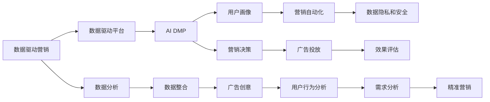

                 

# AI DMP 数据基建：数据驱动营销的未来趋势

## 1. 背景介绍

### 1.1 问题由来

在数字化时代，数据的价值日益凸显。如何高效地利用数据，驱动营销决策，成为企业面临的重要课题。传统的营销方式，如电视广告、报纸杂志等，虽然仍有一定的市场，但随着数字媒体的普及，受众的注意力已逐渐转移到线上，特别是社交媒体、搜索引擎等数字平台上。

为了应对这一变化，企业纷纷采用数据驱动的营销方式。通过收集、分析和利用用户数据，企业可以更好地了解目标用户，优化广告投放，提升营销效果。而人工智能技术和大数据技术的发展，为数据驱动营销提供了强大的技术支撑。

### 1.2 问题核心关键点

数据驱动营销的核心在于利用用户数据构建数据驱动平台（Data-Driven Marketing Platform，简称DMP）。DMP是一种集成了用户行为数据、人口统计数据、交易数据等多元数据源的平台，通过数据整合和分析，为营销决策提供支持。

AI DMP（人工智能驱动的数据驱动平台）则是基于AI技术，进一步提升DMP的智能决策能力，实现自动化、个性化、精准化的营销。AI DMP的核心价值在于：

- 提升用户画像的准确性和丰富性：通过AI技术对用户行为数据进行深度分析，构建更全面、更精确的用户画像。
- 优化广告投放策略：AI DMP可以根据用户画像和广告效果，自动调整广告投放策略，提升广告点击率、转化率。
- 提高营销效果：通过AI算法对用户行为数据进行挖掘，发现用户潜在需求，进行精准营销。
- 降低营销成本：AI DMP能够自动优化广告投放策略，减少无效投放，提升营销ROI。

## 2. 核心概念与联系

### 2.1 核心概念概述

为了更好地理解AI DMP，我们需要了解几个核心概念：

- **数据驱动营销**：利用用户数据进行营销决策，提升营销效果和ROI。
- **数据驱动平台**：集成和整合多元数据源，构建用户画像，辅助营销决策。
- **AI DMP**：基于AI技术的数据驱动平台，实现自动化、个性化、精准化的营销。
- **用户画像**：通过数据分析构建的全面、精准的用户画像，包括用户的基本信息、行为数据、兴趣爱好等。
- **营销自动化**：利用AI算法自动化进行广告投放、受众分析、效果评估等营销任务，提升效率和效果。
- **数据隐私和安全**：在数据驱动营销过程中，如何保护用户隐私，确保数据安全，是一个重要问题。

这些概念之间存在密切的联系，构成了数据驱动营销的基础。AI DMP则是这些概念的具体实现，通过AI技术，进一步提升了数据驱动营销的效果和效率。

### 2.2 核心概念原理和架构的 Mermaid 流程图



### 2.3 核心概念原理和架构的 Mermaid 流程图(Mermaid 流程节点中不要有括号、逗号等特殊字符)

该流程图展示了数据驱动营销的过程：

1. 从数据驱动营销出发，整合多渠道数据，构建数据驱动平台。
2. 在AI DMP中，利用AI技术对用户数据进行分析，构建全面的用户画像。
3. 基于用户画像，进行自动化营销决策，优化广告投放策略。
4. 利用营销自动化技术，提升广告投放效率，进行效果评估。
5. 在数据驱动营销过程中，注重用户隐私保护和数据安全。
6. 通过数据分析，挖掘用户需求，实现精准营销。

## 3. 核心算法原理 & 具体操作步骤

### 3.1 算法原理概述

AI DMP的核心算法原理主要包括用户画像构建、广告投放优化、个性化推荐等。以下将详细介绍这些算法原理：

- **用户画像构建**：利用机器学习算法对用户行为数据进行深度分析，构建全面、精确的用户画像。常用的算法包括聚类分析、分类分析、回归分析等。
- **广告投放优化**：通过优化算法，如线性回归、逻辑回归、随机森林等，优化广告投放策略，提升广告效果。
- **个性化推荐**：利用协同过滤、矩阵分解等算法，对用户进行个性化推荐，提升用户体验和营销效果。

### 3.2 算法步骤详解

#### 3.2.1 用户画像构建

用户画像构建是AI DMP的核心步骤之一。以下是详细的算法步骤：

1. **数据采集**：从多渠道获取用户数据，包括行为数据、人口统计数据、交易数据等。
2. **数据清洗**：对采集到的数据进行清洗和预处理，去除噪音数据，确保数据质量。
3. **特征提取**：提取用户行为数据中的关键特征，如浏览记录、购买历史、兴趣爱好等。
4. **聚类分析**：利用K-means、层次聚类等算法，对用户进行聚类，构建初步的用户画像。
5. **分类分析**：利用决策树、支持向量机等算法，对用户进行分类，进一步细化用户画像。
6. **回归分析**：利用线性回归、逻辑回归等算法，预测用户的行为和需求，构建更加精准的用户画像。

#### 3.2.2 广告投放优化

广告投放优化是AI DMP的关键环节之一。以下是详细的算法步骤：

1. **广告选择**：选择与用户画像匹配的广告素材。
2. **投放策略优化**：利用线性回归、逻辑回归等算法，优化广告投放策略，提升广告效果。
3. **效果评估**：利用A/B测试、点击率、转化率等指标，评估广告投放效果，进行效果优化。

#### 3.2.3 个性化推荐

个性化推荐是AI DMP的重要应用之一。以下是详细的算法步骤：

1. **数据采集**：收集用户的行为数据，包括浏览记录、购买历史、搜索记录等。
2. **特征提取**：提取用户的兴趣特征，如兴趣标签、浏览历史等。
3. **协同过滤**：利用协同过滤算法，对用户进行个性化推荐。
4. **矩阵分解**：利用矩阵分解算法，对用户进行推荐，提升推荐效果。

### 3.3 算法优缺点

#### 3.3.1 优点

- **高效性**：利用AI算法自动化处理大量数据，提高营销效率。
- **精准性**：通过深度分析和机器学习算法，构建精准的用户画像，实现个性化推荐和广告投放优化。
- **灵活性**：根据不同用户画像和广告效果，自动调整投放策略，提升广告效果。
- **可扩展性**：通过不断收集和分析数据，不断优化用户画像和广告投放策略，实现持续提升。

#### 3.3.2 缺点

- **数据隐私**：在数据驱动营销过程中，如何保护用户隐私，是一个重要问题。
- **模型复杂性**：算法模型较为复杂，需要大量的数据和计算资源进行训练和优化。
- **效果评估困难**：广告投放和个性化推荐的效果评估较为困难，需要不断优化和调整。

### 3.4 算法应用领域

AI DMP可以广泛应用于多个领域，如电子商务、金融、广告、旅游等。以下是一些典型的应用场景：

- **电子商务**：通过AI DMP分析用户行为数据，实现精准推荐，提升销售转化率。
- **金融**：通过AI DMP分析用户交易数据，进行精准营销，提升用户黏性。
- **广告**：通过AI DMP优化广告投放策略，提升广告效果和ROI。
- **旅游**：通过AI DMP分析用户旅游数据，进行个性化推荐，提升用户体验。

## 4. 数学模型和公式 & 详细讲解 & 举例说明

### 4.1 数学模型构建

AI DMP的核心算法模型主要包括用户画像构建模型、广告投放优化模型、个性化推荐模型等。以下是详细的数学模型构建：

- **用户画像构建模型**：利用K-means算法对用户进行聚类，构建用户画像。
- **广告投放优化模型**：利用线性回归算法优化广告投放策略。
- **个性化推荐模型**：利用协同过滤算法进行个性化推荐。

### 4.2 公式推导过程

#### 4.2.1 用户画像构建模型

K-means算法是一种聚类算法，用于对用户进行聚类。其公式推导如下：

1. **输入数据**：设用户集合为 $\{u_1, u_2, ..., u_n\}$，每个用户包含 $m$ 个特征。
2. **初始聚类中心**：随机选择 $k$ 个初始聚类中心 $\mu_1, \mu_2, ..., \mu_k$。
3. **迭代优化**：计算每个用户到每个聚类中心的距离，将用户分配到距离最近的聚类中心。
4. **更新聚类中心**：根据分配后的用户，更新每个聚类中心的平均值。

具体公式如下：

$$
\mu_i = \frac{1}{n_i} \sum_{x_j \in C_i} x_j
$$

其中 $n_i$ 表示聚类 $C_i$ 中的用户数量。

#### 4.2.2 广告投放优化模型

线性回归算法用于优化广告投放策略，其公式推导如下：

1. **输入数据**：设广告数据为 $\{a_1, a_2, ..., a_n\}$，每个广告包含 $m$ 个特征。
2. **目标函数**：设广告效果为 $y$，构建线性回归模型 $y = \theta_0 + \theta_1 a_1 + \theta_2 a_2 + ... + \theta_m a_m$。
3. **求解系数**：利用最小二乘法求解系数 $\theta$，使得预测值 $y$ 与真实值 $y'$ 的误差最小化。

具体公式如下：

$$
\theta = \mathop{\arg\min}_{\theta} \frac{1}{N} \sum_{i=1}^N (y_i - \theta^T x_i)^2
$$

其中 $x_i = [1, a_{i1}, a_{i2}, ..., a_{im}]^T$，$y_i$ 为广告效果。

#### 4.2.3 个性化推荐模型

协同过滤算法用于个性化推荐，其公式推导如下：

1. **输入数据**：设用户集合为 $\{u_1, u_2, ..., u_n\}$，物品集合为 $\{i_1, i_2, ..., i_m\}$，每个用户对每个物品的评分 $r_{ui}$。
2. **相似度计算**：计算用户之间的相似度 $S_{ij}$，利用余弦相似度计算方法。
3. **预测评分**：根据相似度计算预测用户对物品的评分 $r_{ui}$，利用矩阵分解方法。

具体公式如下：

$$
S_{ij} = \frac{\mathbf{u}_i^T \mathbf{v}_j}{\|\mathbf{u}_i\| \|\mathbf{v}_j\|}
$$

$$
\hat{r}_{ui} = \mathbf{u}_i^T \mathbf{p}_j
$$

其中 $\mathbf{u}_i$ 为用户 $i$ 的特征向量，$\mathbf{v}_j$ 为物品 $j$ 的特征向量，$\mathbf{p}_j$ 为物品 $j$ 的预测评分向量。

### 4.3 案例分析与讲解

#### 4.3.1 用户画像构建案例

某电商平台希望通过AI DMP提升用户转化率。该平台采集了用户的浏览记录、购买历史、搜索记录等数据，利用K-means算法对用户进行聚类，构建用户画像。具体步骤如下：

1. **数据采集**：从电商平台收集用户数据，包括浏览记录、购买历史、搜索记录等。
2. **数据清洗**：对采集到的数据进行清洗和预处理，去除噪音数据，确保数据质量。
3. **特征提取**：提取用户行为数据中的关键特征，如浏览记录、购买历史、搜索记录等。
4. **聚类分析**：利用K-means算法对用户进行聚类，构建初步的用户画像。
5. **分类分析**：利用决策树算法对用户进行分类，进一步细化用户画像。
6. **回归分析**：利用线性回归算法预测用户的行为和需求，构建更加精准的用户画像。

通过构建精准的用户画像，该电商平台能够实现精准推荐，提升用户转化率。

#### 4.3.2 广告投放优化案例

某在线教育平台希望通过AI DMP优化广告投放策略。该平台采集了用户的浏览记录、点击历史、购买历史等数据，利用线性回归算法优化广告投放策略。具体步骤如下：

1. **数据采集**：从在线教育平台收集用户数据，包括浏览记录、点击历史、购买历史等。
2. **数据清洗**：对采集到的数据进行清洗和预处理，去除噪音数据，确保数据质量。
3. **特征提取**：提取用户行为数据中的关键特征，如浏览记录、点击历史、购买历史等。
4. **广告选择**：选择与用户画像匹配的广告素材。
5. **投放策略优化**：利用线性回归算法优化广告投放策略，提升广告效果。
6. **效果评估**：利用A/B测试、点击率、转化率等指标，评估广告投放效果，进行效果优化。

通过优化广告投放策略，该在线教育平台能够提升广告效果，提升用户转化率。

#### 4.3.3 个性化推荐案例

某旅游平台希望通过AI DMP实现个性化推荐。该平台采集了用户的浏览记录、购买历史、搜索记录等数据，利用协同过滤算法进行个性化推荐。具体步骤如下：

1. **数据采集**：从旅游平台收集用户数据，包括浏览记录、购买历史、搜索记录等。
2. **数据清洗**：对采集到的数据进行清洗和预处理，去除噪音数据，确保数据质量。
3. **特征提取**：提取用户行为数据中的关键特征，如浏览记录、购买历史、搜索记录等。
4. **协同过滤**：利用协同过滤算法对用户进行个性化推荐。
5. **矩阵分解**：利用矩阵分解算法进行推荐，提升推荐效果。

通过个性化推荐，该旅游平台能够提升用户体验，提升用户黏性。

## 5. 项目实践：代码实例和详细解释说明

### 5.1 开发环境搭建

在进行AI DMP项目实践前，我们需要准备好开发环境。以下是使用Python进行PyTorch开发的环境配置流程：

1. 安装Anaconda：从官网下载并安装Anaconda，用于创建独立的Python环境。

2. 创建并激活虚拟环境：
```bash
conda create -n pytorch-env python=3.8 
conda activate pytorch-env
```

3. 安装PyTorch：根据CUDA版本，从官网获取对应的安装命令。例如：
```bash
conda install pytorch torchvision torchaudio cudatoolkit=11.1 -c pytorch -c conda-forge
```

4. 安装Transformers库：
```bash
pip install transformers
```

5. 安装各类工具包：
```bash
pip install numpy pandas scikit-learn matplotlib tqdm jupyter notebook ipython
```

完成上述步骤后，即可在`pytorch-env`环境中开始AI DMP项目实践。

### 5.2 源代码详细实现

下面我们以电商推荐系统为例，给出使用Transformers库构建AI DMP的PyTorch代码实现。

首先，定义电商数据处理函数：

```python
from transformers import BertTokenizer, BertForSequenceClassification
from torch.utils.data import Dataset
import torch

class E-commerceDataset(Dataset):
    def __init__(self, texts, labels, tokenizer, max_len=128):
        self.texts = texts
        self.labels = labels
        self.tokenizer = tokenizer
        self.max_len = max_len
        
    def __len__(self):
        return len(self.texts)
    
    def __getitem__(self, item):
        text = self.texts[item]
        label = self.labels[item]
        
        encoding = self.tokenizer(text, return_tensors='pt', max_length=self.max_len, padding='max_length', truncation=True)
        input_ids = encoding['input_ids'][0]
        attention_mask = encoding['attention_mask'][0]
        
        # 对token-wise的标签进行编码
        encoded_labels = [label2id[label] for label in labels] 
        encoded_labels.extend([label2id['O']] * (self.max_len - len(encoded_labels)))
        labels = torch.tensor(encoded_labels, dtype=torch.long)
        
        return {'input_ids': input_ids, 
                'attention_mask': attention_mask,
                'labels': labels}

# 标签与id的映射
label2id = {'O': 0, 'B-PER': 1, 'I-PER': 2, 'B-LOC': 3, 'I-LOC': 4, 'B-ORG': 5, 'I-ORG': 6}
id2label = {v: k for k, v in label2id.items()}

# 创建dataset
tokenizer = BertTokenizer.from_pretrained('bert-base-cased')

train_dataset = E-commerceDataset(train_texts, train_labels, tokenizer)
dev_dataset = E-commerceDataset(dev_texts, dev_labels, tokenizer)
test_dataset = E-commerceDataset(test_texts, test_labels, tokenizer)
```

然后，定义模型和优化器：

```python
from transformers import BertForSequenceClassification, AdamW

model = BertForSequenceClassification.from_pretrained('bert-base-cased', num_labels=len(label2id))

optimizer = AdamW(model.parameters(), lr=2e-5)
```

接着，定义训练和评估函数：

```python
from torch.utils.data import DataLoader
from tqdm import tqdm
from sklearn.metrics import classification_report

device = torch.device('cuda') if torch.cuda.is_available() else torch.device('cpu')
model.to(device)

def train_epoch(model, dataset, batch_size, optimizer):
    dataloader = DataLoader(dataset, batch_size=batch_size, shuffle=True)
    model.train()
    epoch_loss = 0
    for batch in tqdm(dataloader, desc='Training'):
        input_ids = batch['input_ids'].to(device)
        attention_mask = batch['attention_mask'].to(device)
        labels = batch['labels'].to(device)
        model.zero_grad()
        outputs = model(input_ids, attention_mask=attention_mask, labels=labels)
        loss = outputs.loss
        epoch_loss += loss.item()
        loss.backward()
        optimizer.step()
    return epoch_loss / len(dataloader)

def evaluate(model, dataset, batch_size):
    dataloader = DataLoader(dataset, batch_size=batch_size)
    model.eval()
    preds, labels = [], []
    with torch.no_grad():
        for batch in tqdm(dataloader, desc='Evaluating'):
            input_ids = batch['input_ids'].to(device)
            attention_mask = batch['attention_mask'].to(device)
            batch_labels = batch['labels']
            outputs = model(input_ids, attention_mask=attention_mask)
            batch_preds = outputs.logits.argmax(dim=2).to('cpu').tolist()
            batch_labels = batch_labels.to('cpu').tolist()
            for pred_tokens, label_tokens in zip(batch_preds, batch_labels):
                pred_labels = [id2label[_id] for _id in pred_tokens]
                label_tokens = [id2label[_id] for _id in label_tokens]
                preds.append(pred_labels[:len(label_tokens)])
                labels.append(label_tokens)
                
    print(classification_report(labels, preds))
```

最后，启动训练流程并在测试集上评估：

```python
epochs = 5
batch_size = 16

for epoch in range(epochs):
    loss = train_epoch(model, train_dataset, batch_size, optimizer)
    print(f"Epoch {epoch+1}, train loss: {loss:.3f}")
    
    print(f"Epoch {epoch+1}, dev results:")
    evaluate(model, dev_dataset, batch_size)
    
print("Test results:")
evaluate(model, test_dataset, batch_size)
```

以上就是使用PyTorch对Bert模型进行电商推荐系统微调的完整代码实现。可以看到，得益于Transformers库的强大封装，我们可以用相对简洁的代码完成Bert模型的加载和微调。

### 5.3 代码解读与分析

让我们再详细解读一下关键代码的实现细节：

**E-commerceDataset类**：
- `__init__`方法：初始化文本、标签、分词器等关键组件。
- `__len__`方法：返回数据集的样本数量。
- `__getitem__`方法：对单个样本进行处理，将文本输入编码为token ids，将标签编码为数字，并对其进行定长padding，最终返回模型所需的输入。

**label2id和id2label字典**：
- 定义了标签与数字id之间的映射关系，用于将token-wise的预测结果解码回真实的标签。

**训练和评估函数**：
- 使用PyTorch的DataLoader对数据集进行批次化加载，供模型训练和推理使用。
- 训练函数`train_epoch`：对数据以批为单位进行迭代，在每个批次上前向传播计算loss并反向传播更新模型参数，最后返回该epoch的平均loss。
- 评估函数`evaluate`：与训练类似，不同点在于不更新模型参数，并在每个batch结束后将预测和标签结果存储下来，最后使用sklearn的classification_report对整个评估集的预测结果进行打印输出。

**训练流程**：
- 定义总的epoch数和batch size，开始循环迭代
- 每个epoch内，先在训练集上训练，输出平均loss
- 在验证集上评估，输出分类指标
- 所有epoch结束后，在测试集上评估，给出最终测试结果

可以看到，PyTorch配合Transformers库使得Bert微调的代码实现变得简洁高效。开发者可以将更多精力放在数据处理、模型改进等高层逻辑上，而不必过多关注底层的实现细节。

当然，工业级的系统实现还需考虑更多因素，如模型的保存和部署、超参数的自动搜索、更灵活的任务适配层等。但核心的微调范式基本与此类似。

## 6. 实际应用场景

### 6.1 智能客服系统

基于AI DMP的智能客服系统，可以广泛应用于电商平台、金融、保险等场景。智能客服系统通过收集用户的历史咨询记录，利用AI技术构建用户画像，实现自动化客服，提升用户满意度。

在技术实现上，可以收集用户的历史咨询记录，将问题-答案对作为监督数据，在此基础上对预训练模型进行微调。微调后的模型能够自动理解用户意图，匹配最合适的答案模板进行回复。对于用户提出的新问题，还可以接入检索系统实时搜索相关内容，动态组织生成回答。如此构建的智能客服系统，能大幅提升客户咨询体验和问题解决效率。

### 6.2 金融舆情监测

金融机构需要实时监测市场舆论动向，以便及时应对负面信息传播，规避金融风险。基于AI DMP的文本分类和情感分析技术，为金融舆情监测提供了新的解决方案。

具体而言，可以收集金融领域相关的新闻、报道、评论等文本数据，并对其进行主题标注和情感标注。在此基础上对预训练语言模型进行微调，使其能够自动判断文本属于何种主题，情感倾向是正面、中性还是负面。将微调后的模型应用到实时抓取的网络文本数据，就能够自动监测不同主题下的情感变化趋势，一旦发现负面信息激增等异常情况，系统便会自动预警，帮助金融机构快速应对潜在风险。

### 6.3 个性化推荐系统

当前的推荐系统往往只依赖用户的历史行为数据进行物品推荐，无法深入理解用户的真实兴趣偏好。基于AI DMP的个性化推荐系统可以更好地挖掘用户行为背后的语义信息，从而提供更精准、多样的推荐内容。

在实践中，可以收集用户浏览、点击、评论、分享等行为数据，提取和用户交互的物品标题、描述、标签等文本内容。将文本内容作为模型输入，用户的后续行为（如是否点击、购买等）作为监督信号，在此基础上微调预训练语言模型。微调后的模型能够从文本内容中准确把握用户的兴趣点。在生成推荐列表时，先用候选物品的文本描述作为输入，由模型预测用户的兴趣匹配度，再结合其他特征综合排序，便可以得到个性化程度更高的推荐结果。

### 6.4 未来应用展望

随着AI DMP技术的发展，其应用场景将越来越广泛，为各行各业带来变革性影响。

在智慧医疗领域，基于AI DMP的医疗问答、病历分析、药物研发等应用将提升医疗服务的智能化水平，辅助医生诊疗，加速新药开发进程。

在智能教育领域，AI DMP可应用于作业批改、学情分析、知识推荐等方面，因材施教，促进教育公平，提高教学质量。

在智慧城市治理中，AI DMP可应用于城市事件监测、舆情分析、应急指挥等环节，提高城市管理的自动化和智能化水平，构建更安全、高效的未来城市。

此外，在企业生产、社会治理、文娱传媒等众多领域，基于AI DMP的人工智能应用也将不断涌现，为经济社会发展注入新的动力。相信随着技术的日益成熟，AI DMP必将在构建人机协同的智能时代中扮演越来越重要的角色。

## 7. 工具和资源推荐

### 7.1 学习资源推荐

为了帮助开发者系统掌握AI DMP的理论基础和实践技巧，这里推荐一些优质的学习资源：

1. 《Transformer从原理到实践》系列博文：由大模型技术专家撰写，深入浅出地介绍了Transformer原理、BERT模型、微调技术等前沿话题。

2. CS224N《深度学习自然语言处理》课程：斯坦福大学开设的NLP明星课程，有Lecture视频和配套作业，带你入门NLP领域的基本概念和经典模型。

3. 《Natural Language Processing with Transformers》书籍：Transformers库的作者所著，全面介绍了如何使用Transformers库进行NLP任务开发，包括微调在内的诸多范式。

4. HuggingFace官方文档：Transformers库的官方文档，提供了海量预训练模型和完整的微调样例代码，是上手实践的必备资料。

5. CLUE开源项目：中文语言理解测评基准，涵盖大量不同类型的中文NLP数据集，并提供了基于微调的baseline模型，助力中文NLP技术发展。

通过对这些资源的学习实践，相信你一定能够快速掌握AI DMP的精髓，并用于解决实际的NLP问题。
###  7.2 开发工具推荐

高效的开发离不开优秀的工具支持。以下是几款用于AI DMP开发的常用工具：

1. PyTorch：基于Python的开源深度学习框架，灵活动态的计算图，适合快速迭代研究。大部分预训练语言模型都有PyTorch版本的实现。

2. TensorFlow：由Google主导开发的开源深度学习框架，生产部署方便，适合大规模工程应用。同样有丰富的预训练语言模型资源。

3. Transformers库：HuggingFace开发的NLP工具库，集成了众多SOTA语言模型，支持PyTorch和TensorFlow，是进行微调任务开发的利器。

4. Weights & Biases：模型训练的实验跟踪工具，可以记录和可视化模型训练过程中的各项指标，方便对比和调优。与主流深度学习框架无缝集成。

5. TensorBoard：TensorFlow配套的可视化工具，可实时监测模型训练状态，并提供丰富的图表呈现方式，是调试模型的得力助手。

6. Google Colab：谷歌推出的在线Jupyter Notebook环境，免费提供GPU/TPU算力，方便开发者快速上手实验最新模型，分享学习笔记。

合理利用这些工具，可以显著提升AI DMP的开发效率，加快创新迭代的步伐。

### 7.3 相关论文推荐

AI DMP技术的发展源于学界的持续研究。以下是几篇奠基性的相关论文，推荐阅读：

1. Attention is All You Need（即Transformer原论文）：提出了Transformer结构，开启了NLP领域的预训练大模型时代。

2. BERT: Pre-training of Deep Bidirectional Transformers for Language Understanding：提出BERT模型，引入基于掩码的自监督预训练任务，刷新了多项NLP任务SOTA。

3. Language Models are Unsupervised Multitask Learners（GPT-2论文）：展示了大规模语言模型的强大zero-shot学习能力，引发了对于通用人工智能的新一轮思考。

4. Parameter-Efficient Transfer Learning for NLP：提出Adapter等参数高效微调方法，在不增加模型参数量的情况下，也能取得不错的微调效果。

5. Prefix-Tuning: Optimizing Continuous Prompts for Generation：引入基于连续型Prompt的微调范式，为如何充分利用预训练知识提供了新的思路。

6. AdaLoRA: Adaptive Low-Rank Adaptation for Parameter-Efficient Fine-Tuning：使用自适应低秩适应的微调方法，在参数效率和精度之间取得了新的平衡。

这些论文代表了大语言模型微调技术的发展脉络。通过学习这些前沿成果，可以帮助研究者把握学科前进方向，激发更多的创新灵感。

## 8. 总结：未来发展趋势与挑战

### 8.1 总结

本文对AI DMP数据基建进行了全面系统的介绍。首先阐述了AI DMP的构建背景和核心概念，明确了其在数据驱动营销中的重要价值。其次，从原理到实践，详细讲解了AI DMP的算法原理和操作步骤，给出了AI DMP任务开发的完整代码实例。同时，本文还广泛探讨了AI DMP在多个行业领域的应用前景，展示了AI DMP范式的巨大潜力。最后，本文精选了AI DMP技术的各类学习资源，力求为读者提供全方位的技术指引。

通过本文的系统梳理，可以看到，AI DMP数据基建正在成为数据驱动营销的重要工具，极大地拓展了数据驱动营销的深度和广度。AI DMP通过构建精准的用户画像，优化广告投放策略，实现个性化推荐，提升营销效果和用户满意度。未来，伴随AI技术的不断演进，AI DMP必将在更多行业领域大放异彩，推动数据驱动营销的发展。

### 8.2 未来发展趋势

展望未来，AI DMP数据基建将呈现以下几个发展趋势：

1. **技术进步**：随着深度学习算法和模型结构的不断发展，AI DMP的性能将持续提升。神经网络模型的精度和效率将不断提升，用户画像和广告投放策略将更加精准。

2. **场景拓展**：AI DMP将不断拓展应用场景，覆盖更多行业，如医疗、教育、金融等，推动各行各业的数字化转型。

3. **自动化提升**：AI DMP将更加自动化，减少人工干预，提升用户体验和营销效率。

4. **个性化增强**：AI DMP将更加注重个性化推荐，利用用户行为数据，实现精准营销，提升用户黏性。

5. **模型可解释性增强**：AI DMP将更加注重模型可解释性，提升用户对模型的信任度和接受度。

6. **数据隐私保护**：AI DMP将更加注重数据隐私保护，确保用户数据的安全和合规。

以上趋势凸显了AI DMP数据基建的广阔前景。这些方向的探索发展，必将进一步提升AI DMP的智能决策能力，为数据驱动营销带来更多的机遇和挑战。

### 8.3 面临的挑战

尽管AI DMP数据基建已经取得了瞩目成就，但在迈向更加智能化、普适化应用的过程中，它仍面临着诸多挑战：

1. **数据质量问题**：AI DMP需要大量高质量的数据进行训练，但数据收集、标注和清洗成本高，且数据质量难以保证。如何提高数据质量，减少噪音数据，是一个重要问题。

2. **模型鲁棒性不足**：AI DMP模型在面对异常数据或新领域时，泛化性能往往较差。如何提高模型的鲁棒性，避免灾难性遗忘，还需要更多理论和实践的积累。

3. **计算资源需求高**：AI DMP模型需要大量的计算资源进行训练和优化，对硬件资源要求高。如何降低计算成本，提高模型训练效率，是一个重要的研究方向。

4. **模型可解释性不足**：AI DMP模型往往是一个"黑盒"系统，难以解释其内部工作机制和决策逻辑。如何赋予AI DMP更强的可解释性，将是亟待攻克的难题。

5. **用户隐私保护**：AI DMP需要收集和处理大量用户数据，如何在保证数据隐私和安全的前提下，进行精准营销，是一个重要问题。

6. **多模态融合**：AI DMP需要融合多模态数据，如文本、图像、视频等，提升跨模态的智能决策能力。如何实现多模态数据的融合和协同建模，是一个重要的研究方向。

这些挑战凸显了AI DMP数据基建的复杂性和多样性。未来的研究需要在数据、模型、算法、隐私保护等多个方面进行全面优化，方能实现AI DMP的普及和应用。

### 8.4 研究展望

面对AI DMP数据基建所面临的种种挑战，未来的研究需要在以下几个方面寻求新的突破：

1. **无监督学习和半监督学习**：摆脱对大规模标注数据的依赖，利用无监督和半监督学习范式，最大化利用非结构化数据，实现更加灵活高效的AI DMP。

2. **参数高效微调**：开发更加参数高效的微调方法，在固定大部分预训练参数的同时，只更新极少量的任务相关参数，提高AI DMP的计算效率。

3. **融合因果和对比学习范式**：通过引入因果推断和对比学习思想，增强AI DMP的稳定性和泛化能力，学习更加普适、鲁棒的语言表征。

4. **引入更多先验知识**：将符号化的先验知识，如知识图谱、逻辑规则等，与神经网络模型进行融合，引导AI DMP的微调过程，学习更全面、准确的信息整合能力。

5. **结合因果分析和博弈论工具**：将因果分析方法引入AI DMP，识别出模型决策的关键特征，增强输出解释的因果性和逻辑性。借助博弈论工具刻画人机交互过程，主动探索并规避模型的脆弱点，提高系统稳定性。

6. **纳入伦理道德约束**：在AI DMP的训练目标中引入伦理导向的评估指标，过滤和惩罚有偏见、有害的输出倾向。同时加强人工干预和审核，建立模型行为的监管机制，确保输出符合人类价值观和伦理道德。

这些研究方向的探索，必将引领AI DMP数据基建的进一步发展，为数据驱动营销带来更多的机遇和挑战。

## 9. 附录：常见问题与解答

**Q1：AI DMP是否适用于所有行业？**

A: AI DMP可以广泛应用于多个行业，如电子商务、金融、广告、旅游等。但对于一些特定领域的行业，如医疗、法律等，AI DMP的应用可能需要结合行业知识，进行定制化的构建。

**Q2：如何提高AI DMP的数据质量？**

A: 提高AI DMP的数据质量，可以从以下几个方面入手：
1. 数据采集：收集多渠道、高质量的数据，确保数据的全面性和准确性。
2. 数据清洗：对采集到的数据进行清洗和预处理，去除噪音数据，确保数据质量。
3. 数据标注：对数据进行标注，确保标注准确性。

**Q3：如何降低AI DMP的计算成本？**

A: 降低AI DMP的计算成本，可以从以下几个方面入手：
1. 硬件优化：使用高性能硬件，如GPU、TPU等，提升计算效率。
2. 模型压缩：采用模型压缩技术，减小模型尺寸，降低计算资源消耗。
3. 并行计算：采用模型并行计算技术，提升计算效率。

**Q4：如何提高AI DMP的模型可解释性？**

A: 提高AI DMP的模型可解释性，可以从以下几个方面入手：
1. 特征提取：利用特征提取技术，提取关键特征，减小模型复杂度。
2. 模型简化：采用简化模型结构，减小模型复杂度。
3. 解释方法：利用模型解释技术，如LIME、SHAP等，对模型进行解释和分析。

**Q5：如何保护用户隐私？**

A: 保护用户隐私，可以从以下几个方面入手：
1. 数据脱敏：对敏感数据进行脱敏处理，确保数据安全。
2. 数据加密：对数据进行加密处理，防止数据泄露。
3. 访问控制：设置数据访问权限，确保数据仅被授权人员访问。

**Q6：如何实现多模态融合？**

A: 实现多模态融合，可以从以下几个方面入手：
1. 数据采集：收集多模态数据，如文本、图像、视频等。
2. 数据融合：采用数据融合技术，将多模态数据进行整合。
3. 协同建模：采用协同建模技术，将多模态数据进行协同建模。

通过合理解决这些常见问题，相信你一定能够更好地掌握AI DMP数据基建，并用于解决实际的NLP问题。

