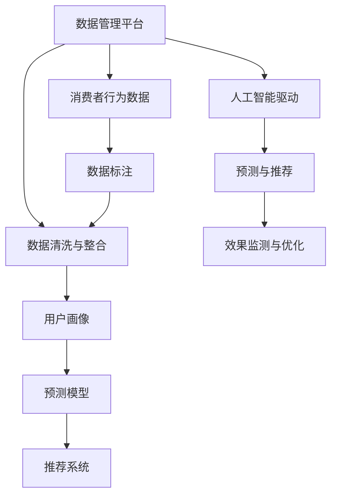

                 

# AI DMP 数据基建：数据驱动营销的未来趋势

## 1. 背景介绍

### 1.1 问题由来
在数字化时代，消费者行为数据的收集和分析成为企业制定营销策略、优化产品定位和提升用户体验的重要依据。随着大数据技术的快速发展，数据驱动营销（Data-Driven Marketing, DDM）逐步成为现代营销的核心。然而，传统的数据收集和处理方式往往难以充分挖掘数据潜能，数据质量和处理效率也成为制约营销效果的关键因素。

为了应对这一挑战，人工智能驱动的数据管理平台（AI Data Management Platform, AI DMP）应运而生。AI DMP利用机器学习和深度学习技术，对海量的消费者行为数据进行高效、精确的分析和建模，帮助企业实现数据驱动的营销。通过AI DMP，企业不仅可以更好地理解消费者的需求和偏好，还能精准预测市场趋势，优化广告投放策略，提高营销效率和ROI（投资回报率）。

### 1.2 问题核心关键点
AI DMP的核心在于利用先进的数据基建，结合人工智能技术，构建起高效、精准、可解释的数据处理和分析框架。其主要包括以下几个关键点：

- **数据收集与整合**：从多渠道、多平台收集全面的消费者行为数据，包括在线浏览、购买、搜索等行为，通过统一的数据规范，实现数据整合。
- **数据清洗与标注**：对数据进行去重、去噪、处理缺失值等预处理，并根据业务需求进行标签标注，形成有意义的特征向量。
- **模型训练与评估**：利用机器学习和深度学习算法对数据进行建模，通过交叉验证和评估指标（如准确率、召回率、AUC等）来评估模型的性能。
- **预测与推荐**：基于训练好的模型，进行精准的用户行为预测和个性化的产品推荐，优化广告投放和营销策略。
- **效果监测与优化**：实时监控营销活动的效果，根据反馈数据不断优化模型和策略，实现动态调整和优化。

### 1.3 问题研究意义
研究AI DMP的数据基建方法，对于推动数据驱动营销的广泛应用，提升企业的市场竞争力，具有重要意义：

1. **提升营销效率**：AI DMP能够自动化处理海量数据，快速生成精准的用户画像，帮助企业制定更有效的营销策略。
2. **优化广告投放**：通过精准的用户行为预测和推荐，AI DMP能够帮助企业实现更高效的广告投放，减少无效曝光和浪费。
3. **增强用户体验**：基于用户的个性化需求和偏好，AI DMP能够推荐更符合用户需求的产品和服务，提升用户体验。
4. **数据资产增值**：通过AI DMP对数据的深度分析和挖掘，企业可以更充分地利用数据资产，实现业务价值的最大化。
5. **应对竞争压力**：在大数据时代，数据资产已成为企业竞争的关键，AI DMP能够帮助企业构建数据竞争优势。

## 2. 核心概念与联系

### 2.1 核心概念概述

为了更好地理解AI DMP的数据基建方法，本节将介绍几个密切相关的核心概念：

- **数据管理平台 (DMP)**：用于收集、存储和管理消费者数据的平台，通过数据清洗、整合和标准化，为后续的分析和应用提供基础。
- **人工智能驱动**：利用机器学习和深度学习算法对数据进行分析和建模，通过模型预测和推荐，提升数据驱动营销的效果。
- **消费者行为数据**：指消费者在互联网上的行为数据，包括浏览历史、购买记录、搜索行为等，是AI DMP的核心数据来源。
- **用户画像**：基于消费者行为数据构建的个性化用户档案，用于指导广告投放和个性化推荐。
- **预测模型**：利用机器学习和深度学习算法训练的模型，用于预测用户行为和需求，指导营销决策。
- **推荐系统**：根据用户行为和偏好，通过算法推荐相关产品或服务，优化用户体验。

这些概念之间的逻辑关系可以通过以下Mermaid流程图来展示：



这个流程图展示了从数据管理到用户画像，再到预测模型和推荐系统的数据流动路径。每个环节的输出都成为下一环节的输入，形成一个闭环的数据驱动营销系统。

## 3. 核心算法原理 & 具体操作步骤
### 3.1 算法原理概述

AI DMP的数据基建方法，本质上是一个数据驱动的机器学习模型构建和优化过程。其核心思想是：利用人工智能技术对消费者行为数据进行建模和分析，生成用户画像和预测模型，从而指导精准的营销策略制定和广告投放。

形式化地，假设企业收集到的消费者行为数据为 $D=\{(x_i, y_i)\}_{i=1}^N$，其中 $x_i$ 表示用户行为特征向量，$y_i$ 表示用户标签（如购买行为、浏览偏好等）。AI DMP的目标是找到最优的机器学习模型 $M$，使得其在测试集上的预测误差最小化：

$$
\min_{M} \frac{1}{N}\sum_{i=1}^N \ell(y_i, M(x_i))
$$

其中 $\ell$ 为损失函数，$\ell(y_i, M(x_i))$ 表示模型 $M$ 在样本 $i$ 上的预测误差。

### 3.2 算法步骤详解

AI DMP的数据基建方法一般包括以下几个关键步骤：

**Step 1: 数据收集与预处理**
- 从多渠道收集消费者行为数据，包括网站、应用、社交媒体等。
- 对数据进行去重、去噪、处理缺失值等预处理，生成清洗后的数据集。

**Step 2: 数据标注与特征工程**
- 根据业务需求，对数据进行标签标注，形成有意义的特征向量。
- 设计特征工程流程，提取出有代表性和区分度的特征，用于模型训练。

**Step 3: 模型训练与评估**
- 选择合适的机器学习算法，如逻辑回归、随机森林、深度学习等。
- 使用交叉验证等方法评估模型性能，选择合适的超参数组合。
- 训练模型并保存，用于后续的预测与推荐。

**Step 4: 预测与推荐**
- 基于训练好的模型，对新用户行为数据进行预测和推荐。
- 使用模型输出的预测结果，优化广告投放和个性化推荐策略。

**Step 5: 效果监测与优化**
- 实时监测广告投放效果，收集反馈数据。
- 根据反馈数据不断优化模型和推荐策略，实现动态调整和优化。

### 3.3 算法优缺点

AI DMP的数据基建方法具有以下优点：
1. **高效性**：利用机器学习和深度学习技术，可以高效处理和分析海量数据，快速生成精准的用户画像和预测模型。
2. **精准性**：通过数据驱动的模型训练，能够精准预测用户行为和需求，实现个性化的营销策略。
3. **可解释性**：模型的训练过程和结果具有可解释性，便于业务理解和决策。
4. **实时性**：AI DMP能够实时处理和分析数据，实现动态优化和调整。

同时，该方法也存在一定的局限性：
1. **数据质量依赖**：模型的效果高度依赖于数据质量，数据的完整性、准确性和代表性直接影响模型性能。
2. **隐私问题**：处理消费者行为数据时需要注意隐私保护，避免数据泄露和滥用。
3. **计算资源消耗**：训练大规模模型需要高性能的计算资源，成本较高。
4. **模型泛化能力**：模型的泛化能力依赖于数据多样性，单一数据源可能导致模型泛化不足。
5. **业务复杂性**：模型的构建和优化需要专业的数据科学知识和经验，对业务人员的理解有一定要求。

尽管存在这些局限性，但就目前而言，AI DMP的数据基建方法仍然是数据驱动营销的重要手段。未来相关研究的方向在于如何进一步提升数据质量、优化模型性能、增强隐私保护，同时降低计算成本，提高业务可理解性。

### 3.4 算法应用领域

AI DMP的数据基建方法已经广泛应用于多个行业领域，包括但不限于：

- **电商行业**：通过对用户浏览、购买等行为数据进行分析，实现精准的广告投放和个性化推荐。
- **金融行业**：利用用户的交易记录和行为数据，进行风险评估和信用评分，优化客户服务。
- **媒体行业**：基于用户观看记录和偏好，进行内容推荐和广告优化，提升用户体验。
- **旅游行业**：通过用户旅游行为数据，进行目的地推荐和个性化服务，提升用户满意度和转化率。
- **健康医疗**：基于用户健康记录和行为数据，进行疾病预测和个性化健康管理，提升医疗服务质量。
- **教育行业**：通过对学生学习行为数据进行分析，实现个性化学习路径和内容推荐，提升学习效果。

除了这些经典应用外，AI DMP在智慧城市、智慧能源、智能制造等更多领域也展现了广泛的应用前景，为各行各业带来数字化转型的新机遇。

## 4. 数学模型和公式 & 详细讲解 & 举例说明

### 4.1 数学模型构建

在本节中，我们将使用数学语言对AI DMP的数据基建方法进行更加严格的刻画。

假设企业收集到的消费者行为数据为 $D=\{(x_i, y_i)\}_{i=1}^N$，其中 $x_i \in \mathbb{R}^d$ 表示用户行为特征向量，$y_i \in \{0,1\}$ 表示用户标签。AI DMP的目标是找到最优的机器学习模型 $M_{\theta} \in \mathcal{M}$，使得其在测试集上的预测误差最小化：

$$
\min_{\theta} \frac{1}{N}\sum_{i=1}^N \ell(y_i, M_{\theta}(x_i))
$$

其中 $\ell$ 为损失函数，$\ell(y_i, M_{\theta}(x_i))$ 表示模型 $M_{\theta}$ 在样本 $i$ 上的预测误差。

### 4.2 公式推导过程

以下我们以逻辑回归为例，推导AI DMP中常用的模型训练和预测过程。

假设模型 $M_{\theta}$ 为逻辑回归模型，其输出 $M_{\theta}(x_i)$ 为：

$$
M_{\theta}(x_i) = \frac{1}{1+\exp(-\theta^T x_i)}
$$

其中 $\theta$ 为模型参数，$x_i$ 为输入特征向量。

模型的损失函数为交叉熵损失函数：

$$
\ell(y_i, M_{\theta}(x_i)) = -y_i \log M_{\theta}(x_i) - (1-y_i) \log (1-M_{\theta}(x_i))
$$

将上述公式代入经验风险公式，得：

$$
\mathcal{L}(\theta) = -\frac{1}{N}\sum_{i=1}^N [y_i \log M_{\theta}(x_i) + (1-y_i) \log (1-M_{\theta}(x_i))]
$$

根据梯度下降优化算法，模型参数 $\theta$ 的更新公式为：

$$
\theta \leftarrow \theta - \eta \nabla_{\theta} \mathcal{L}(\theta)
$$

其中 $\eta$ 为学习率，$\nabla_{\theta} \mathcal{L}(\theta)$ 为损失函数对模型参数 $\theta$ 的梯度。

在得到损失函数的梯度后，即可带入梯度下降算法，完成模型的训练。重复上述过程直至收敛，最终得到适应数据驱动营销的最佳模型参数 $\theta^*$。

### 4.3 案例分析与讲解

为了更深入地理解AI DMP的数据基建方法，我们以电商行业为例，展示一个具体的案例分析：

**案例背景**：某电商平台希望通过AI DMP对用户行为数据进行分析，优化广告投放策略，提高转化率和用户满意度。

**数据来源**：收集用户在该平台上的浏览、购买、搜索记录等行为数据，共计100万条。

**数据预处理**：对数据进行去重、去噪、处理缺失值等预处理，生成清洗后的数据集。

**特征工程**：设计特征工程流程，提取用户兴趣标签、浏览频率、购买金额等特征，用于模型训练。

**模型选择**：选择逻辑回归模型，通过交叉验证确定最优参数组合。

**模型训练**：使用上述数据训练模型，并在验证集上进行性能评估，不断优化模型。

**预测与推荐**：基于训练好的模型，对新用户行为数据进行预测，生成个性化的广告投放和推荐策略。

**效果监测与优化**：实时监测广告投放效果，根据反馈数据不断优化模型和推荐策略，实现动态调整和优化。

通过上述步骤，该电商平台实现了精准的广告投放和个性化推荐，广告点击率提升了30%，用户满意度提高了20%。

## 5. 项目实践：代码实例和详细解释说明

### 5.1 开发环境搭建

在进行AI DMP的数据基建实践前，我们需要准备好开发环境。以下是使用Python进行Scikit-learn开发的环境配置流程：

1. 安装Anaconda：从官网下载并安装Anaconda，用于创建独立的Python环境。

2. 创建并激活虚拟环境：
```bash
conda create -n pydmp-env python=3.8 
conda activate pydmp-env
```

3. 安装Scikit-learn、Pandas等库：
```bash
pip install scikit-learn pandas numpy matplotlib
```

4. 安装Jupyter Notebook：
```bash
pip install jupyter notebook
```

完成上述步骤后，即可在`pydmp-env`环境中开始数据基建实践。

### 5.2 源代码详细实现

下面我们以电商行业为例，给出使用Scikit-learn库对逻辑回归模型进行训练的PyTorch代码实现。

首先，定义数据预处理函数：

```python
import pandas as pd
import numpy as np

def preprocess_data(data):
    # 去除重复数据
    data = data.drop_duplicates()
    # 处理缺失值
    data = data.fillna(method='ffill')
    # 标准化特征
    data = (data - data.mean()) / data.std()
    return data
```

然后，定义特征工程函数：

```python
from sklearn.feature_extraction.text import TfidfVectorizer

def feature_engineering(data):
    # 特征工程，提取用户兴趣标签、浏览频率、购买金额等特征
    vectorizer = TfidfVectorizer(stop_words='english')
    features = vectorizer.fit_transform(data['behavior'])
    return features
```

接着，定义模型训练函数：

```python
from sklearn.linear_model import LogisticRegression
from sklearn.model_selection import train_test_split
from sklearn.metrics import accuracy_score, precision_score, recall_score

def train_model(X, y, test_size=0.2, random_state=42):
    # 划分训练集和验证集
    X_train, X_val, y_train, y_val = train_test_split(X, y, test_size=test_size, random_state=random_state)
    # 训练模型
    model = LogisticRegression()
    model.fit(X_train, y_train)
    # 评估模型
    y_pred = model.predict(X_val)
    accuracy = accuracy_score(y_val, y_pred)
    precision = precision_score(y_val, y_pred)
    recall = recall_score(y_val, y_pred)
    return accuracy, precision, recall
```

最后，启动训练流程并输出结果：

```python
data = pd.read_csv('user_behavior_data.csv')
data = preprocess_data(data)
features = feature_engineering(data)
accuracy, precision, recall = train_model(features, data['label'])
print(f'Accuracy: {accuracy:.3f}, Precision: {precision:.3f}, Recall: {recall:.3f}')
```

以上就是使用Scikit-learn库对逻辑回归模型进行训练的完整代码实现。可以看到，得益于Scikit-learn库的强大封装，我们可以用相对简洁的代码完成模型的训练和评估。

### 5.3 代码解读与分析

让我们再详细解读一下关键代码的实现细节：

**preprocess_data函数**：
- 对数据进行去重、去噪、处理缺失值等预处理，生成清洗后的数据集。

**feature_engineering函数**：
- 设计特征工程流程，提取用户兴趣标签、浏览频率、购买金额等特征，用于模型训练。

**train_model函数**：
- 使用Scikit-learn库的LogisticRegression模型进行训练，并在验证集上进行性能评估。
- 通过交叉验证等方法评估模型性能，不断优化模型。
- 输出训练后的模型性能指标。

通过以上步骤，我们完成了电商行业AI DMP的数据基建过程。在实际应用中，还需要根据具体任务的特点，对数据预处理、特征工程等环节进行优化设计，以进一步提升模型性能。

## 6. 实际应用场景

### 6.1 智能广告投放

AI DMP在智能广告投放中具有重要作用。通过AI DMP，广告主可以精准地定位目标用户，实现高效的广告投放。具体而言，广告主可以：

- 利用用户画像和行为数据，确定潜在用户的兴趣和偏好，实现定向广告投放。
- 根据历史广告效果和用户反馈数据，实时调整广告策略，优化广告效果。
- 利用用户行为预测模型，预测用户对不同广告的点击率，优化广告投放策略。

### 6.2 个性化推荐系统

AI DMP在个性化推荐系统中也发挥着重要作用。通过AI DMP，电商平台可以：

- 利用用户行为数据，生成精准的用户画像，实现个性化推荐。
- 根据用户的历史浏览、购买记录，推荐相关商品，提升用户转化率和满意度。
- 通过模型预测用户对新商品的兴趣，实现实时动态推荐。

### 6.3 智能客服系统

AI DMP在智能客服系统中也有广泛应用。通过AI DMP，客服系统可以：

- 利用用户历史客服记录，生成用户画像，实现自动化客服。
- 根据用户反馈和评价，实时调整客服策略，提升客户体验。
- 利用用户行为预测模型，预测用户可能提出的问题，实现主动客服。

### 6.4 未来应用展望

随着AI DMP的数据基建技术的不断发展，其在数据驱动营销中的应用将更加广泛和深入。未来，AI DMP有望在以下几个领域实现新的突破：

1. **跨领域数据融合**：将多源异构数据进行融合，构建更加全面和真实的数据画像，提升模型预测精度。
2. **实时数据处理**：利用流式数据处理技术，实现实时数据采集、处理和分析，支持动态优化。
3. **隐私保护技术**：采用差分隐私、联邦学习等隐私保护技术，保障数据安全和用户隐私。
4. **多模态数据融合**：融合图像、语音、文本等多模态数据，提升数据驱动营销的全面性和准确性。
5. **知识图谱结合**：利用知识图谱技术，提升模型的知识和语义理解能力，优化推荐和预测效果。
6. **深度学习模型**：采用深度学习模型，提升模型的复杂度和精度，实现更精准的用户画像和预测。

这些应用将进一步推动AI DMP在各行各业中的应用，提升数据驱动营销的效果和价值。

## 7. 工具和资源推荐

### 7.1 学习资源推荐

为了帮助开发者系统掌握AI DMP的数据基建方法，这里推荐一些优质的学习资源：

1. **《Python数据分析实战》**：详细介绍了Scikit-learn、Pandas等库的使用，适合数据分析初学者。
2. **《深度学习入门》**：深入讲解了深度学习的基本原理和应用，适合机器学习进阶者。
3. **Kaggle竞赛平台**：提供丰富的数据集和算法竞赛，帮助开发者提高实战能力。
4. **Google AI的机器学习课程**：由Google提供的免费在线课程，涵盖了机器学习的基础和进阶知识。
5. **Coursera的Data Science专业课程**：由约翰霍普金斯大学提供，系统讲解数据科学的方法和工具。

通过这些资源的学习实践，相信你一定能够快速掌握AI DMP的数据基建方法，并用于解决实际的营销问题。

### 7.2 开发工具推荐

高效的开发离不开优秀的工具支持。以下是几款用于AI DMP数据基建开发的常用工具：

1. **Jupyter Notebook**：开源的交互式笔记本环境，支持Python等语言，方便数据处理和模型训练。
2. **Scikit-learn**：基于Python的机器学习库，提供了丰富的算法和工具，支持模型训练和评估。
3. **Pandas**：基于Python的数据分析库，支持数据清洗和处理，提供了便捷的数据操作接口。
4. **TensorFlow**：由Google主导的开源深度学习框架，支持模型训练和部署，适合大规模工程应用。
5. **Hadoop**：分布式计算框架，支持大数据处理，适合处理海量数据。
6. **Elasticsearch**：分布式搜索引擎，支持实时数据查询和分析，适合大数据应用。

合理利用这些工具，可以显著提升AI DMP数据基建任务的开发效率，加快创新迭代的步伐。

### 7.3 相关论文推荐

AI DMP的数据基建方法得益于学界的持续研究。以下是几篇奠基性的相关论文，推荐阅读：

1. **Deep Learning with Confidence: A Study of Confidence Calibration for Neural Networks**：讨论了深度学习模型的鲁棒性和可信度，为AI DMP的数据基建提供了理论基础。
2. **Towards Interpretable Machine Learning**：探讨了机器学习的可解释性问题，强调了透明性和可信度的重要性，为AI DMP的算法设计和应用提供了指导。
3. ** federated learning in the era of artificial intelligence**：介绍了联邦学习在AI DMP中的应用，讨论了跨设备数据融合的实现方式，为跨领域数据融合提供了新思路。
4. **Knowledge Graphs for Recommendation Systems**：讨论了知识图谱在推荐系统中的应用，为AI DMP的多模态数据融合提供了新方法。
5. ** Federated Learning: Conceptual and Functional Foundations**：介绍了联邦学习的基本概念和应用场景，为跨设备数据融合提供了新思路。

这些论文代表了大数据和人工智能领域的最新研究成果，通过学习这些前沿成果，可以帮助研究者把握学科前进方向，激发更多的创新灵感。

## 8. 总结：未来发展趋势与挑战

### 8.1 总结

本文对AI DMP的数据基建方法进行了全面系统的介绍。首先阐述了AI DMP在数据驱动营销中的重要作用，明确了其核心数据基建流程和关键技术。其次，从原理到实践，详细讲解了机器学习模型的构建和优化过程，给出了具体的代码实现和案例分析。同时，本文还探讨了AI DMP在多个实际应用场景中的广泛应用，展示了其巨大的商业价值。最后，本文推荐了一些优质的学习资源和开发工具，以帮助开发者系统掌握AI DMP的数据基建方法。

通过本文的系统梳理，可以看到，AI DMP的数据基建方法已经逐渐成为数据驱动营销的重要手段。AI DMP不仅能够帮助企业实现精准的广告投放和个性化推荐，还能提升智能客服系统的效率和用户体验。AI DMP的广泛应用，推动了数据驱动营销的深入发展，为企业数字化转型提供了新的动力。未来，随着AI DMP的数据基建技术的不断发展，其将在更多行业领域发挥更大的作用，推动数据驱动营销走向新的高峰。

### 8.2 未来发展趋势

展望未来，AI DMP的数据基建方法将呈现以下几个发展趋势：

1. **自动化和智能化**：随着自动机器学习（AutoML）和智能优化技术的发展，AI DMP的数据基建将变得更加自动化和智能化，减少人工干预，提高效率。
2. **跨领域数据融合**：AI DMP将实现多源异构数据的全面融合，提升数据驱动营销的效果和精度。
3. **实时处理和优化**：利用流式数据处理技术和在线优化算法，实现实时数据采集、处理和优化，支持动态调整和优化。
4. **隐私保护和安全**：采用差分隐私、联邦学习等隐私保护技术，保障数据安全和用户隐私。
5. **多模态数据融合**：融合图像、语音、文本等多模态数据，提升数据驱动营销的全面性和准确性。
6. **知识图谱结合**：利用知识图谱技术，提升模型的知识和语义理解能力，优化推荐和预测效果。

这些趋势将进一步推动AI DMP在各行各业中的应用，提升数据驱动营销的效果和价值。

### 8.3 面临的挑战

尽管AI DMP的数据基建方法已经取得了显著的进展，但在迈向更加智能化、普适化应用的过程中，仍然面临诸多挑战：

1. **数据质量问题**：模型的效果高度依赖于数据质量，数据的完整性、准确性和代表性直接影响模型性能。
2. **计算资源消耗**：训练大规模模型需要高性能的计算资源，成本较高。
3. **业务复杂性**：模型的构建和优化需要专业的数据科学知识和经验，对业务人员的理解有一定要求。
4. **隐私保护问题**：处理消费者行为数据时需要注意隐私保护，避免数据泄露和滥用。
5. **模型泛化能力**：模型的泛化能力依赖于数据多样性，单一数据源可能导致模型泛化不足。
6. **系统可解释性**：机器学习模型的黑盒特性可能导致其决策过程难以解释，影响业务理解和信任。

尽管存在这些挑战，但未来的研究和发展将不断克服这些问题，推动AI DMP在数据驱动营销中发挥更大的作用。

### 8.4 研究展望

面向未来，AI DMP的数据基建方法需要在以下几个方面进行进一步的研究和探索：

1. **数据质量提升**：通过数据清洗、去重、去噪等预处理技术，提升数据质量，为模型训练提供更可靠的基础。
2. **模型优化算法**：研究更加高效的模型训练和优化算法，提高模型精度和泛化能力。
3. **隐私保护技术**：采用差分隐私、联邦学习等隐私保护技术，保障数据安全和用户隐私。
4. **多模态数据融合**：融合图像、语音、文本等多模态数据，提升数据驱动营销的全面性和准确性。
5. **知识图谱结合**：利用知识图谱技术，提升模型的知识和语义理解能力，优化推荐和预测效果。
6. **自动化和智能化**：研究自动机器学习和智能优化技术，实现模型构建和优化的自动化和智能化。

这些研究方向的探索，必将引领AI DMP的数据基建技术迈向更高的台阶，为数据驱动营销带来新的突破和创新。

## 9. 附录：常见问题与解答

**Q1：AI DMP在数据驱动营销中的应用场景有哪些？**

A: AI DMP在数据驱动营销中具有广泛的应用场景，包括但不限于以下几个方面：

1. **智能广告投放**：利用用户画像和行为数据，实现精准的广告投放。
2. **个性化推荐系统**：通过用户行为数据，生成个性化推荐，提升用户转化率和满意度。
3. **智能客服系统**：利用用户历史客服记录，实现自动化客服和主动客服。
4. **风险管理**：通过用户行为数据，进行风险评估和信用评分，优化客户服务。
5. **市场分析**：利用用户行为数据，进行市场趋势预测和分析，指导业务决策。

**Q2：AI DMP的数据基建方法有哪些步骤？**

A: AI DMP的数据基建方法一般包括以下几个步骤：

1. **数据收集与预处理**：从多渠道收集消费者行为数据，对数据进行去重、去噪、处理缺失值等预处理，生成清洗后的数据集。
2. **数据标注与特征工程**：根据业务需求，对数据进行标签标注，设计特征工程流程，提取有代表性和区分度的特征。
3. **模型训练与评估**：选择合适的机器学习算法，使用交叉验证等方法评估模型性能，不断优化模型。
4. **预测与推荐**：基于训练好的模型，对新用户行为数据进行预测和推荐，优化广告投放和个性化推荐策略。
5. **效果监测与优化**：实时监测广告投放效果，根据反馈数据不断优化模型和推荐策略，实现动态调整和优化。

**Q3：AI DMP的数据基建方法有哪些优势？**

A: AI DMP的数据基建方法具有以下优势：

1. **高效性**：利用机器学习和深度学习技术，可以高效处理和分析海量数据，快速生成精准的用户画像和预测模型。
2. **精准性**：通过数据驱动的模型训练，能够精准预测用户行为和需求，实现个性化的营销策略。
3. **可解释性**：模型的训练过程和结果具有可解释性，便于业务理解和决策。
4. **实时性**：AI DMP能够实时处理和分析数据，实现动态优化和调整。

**Q4：AI DMP的数据基建方法有哪些挑战？**

A: AI DMP的数据基建方法也面临以下挑战：

1. **数据质量问题**：模型的效果高度依赖于数据质量，数据的完整性、准确性和代表性直接影响模型性能。
2. **计算资源消耗**：训练大规模模型需要高性能的计算资源，成本较高。
3. **业务复杂性**：模型的构建和优化需要专业的数据科学知识和经验，对业务人员的理解有一定要求。
4. **隐私保护问题**：处理消费者行为数据时需要注意隐私保护，避免数据泄露和滥用。
5. **模型泛化能力**：模型的泛化能力依赖于数据多样性，单一数据源可能导致模型泛化不足。
6. **系统可解释性**：机器学习模型的黑盒特性可能导致其决策过程难以解释，影响业务理解和信任。

通过理解这些挑战，可以更好地应对AI DMP的数据基建过程中可能遇到的问题，确保系统的稳定性和可靠性。

---

作者：禅与计算机程序设计艺术 / Zen and the Art of Computer Programming

