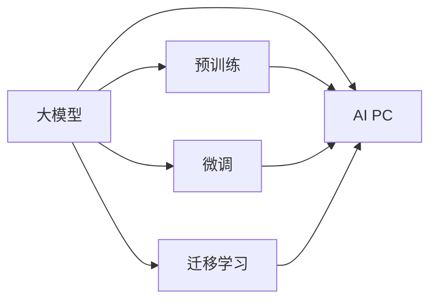

                 

## 1. 背景介绍

### 1.1 问题的提出

随着人工智能技术的飞速发展，大模型（Large Language Models，LLMs）已成为各行业数字化转型的重要引擎。谷歌的BERT、OpenAI的GPT-3、微软的T5等大模型在各种自然语言处理任务中展现了卓越的性能，推动了包括NLP、智能客服、金融分析、医疗诊断等领域的发展。然而，与此同时，一种新型AI设备——AI PC（Artificial Intelligence Personal Computer）的出现，开始引发外界对其对大模型创业者是否构成威胁的广泛讨论。

### 1.2 问题关键点

AI PC作为集成了高性能CPU、GPU和AI加速器的新型PC设备，被定位为未来的计算中心。其具备智能化操作系统和AI处理能力，能够轻松部署和运行各种大模型，而无需额外的硬件设备和云服务。那么，AI PC的出现是否会对大模型创业者构成实质性威胁？本文将从AI PC的技术架构、应用场景、市场动态等多方面进行深入分析。

## 2. 核心概念与联系

### 2.1 核心概念概述

- **大模型（Large Language Models）**：指在巨量文本数据上预训练的神经网络模型，能够理解和生成自然语言，具备强大的语言理解和生成能力。
- **AI PC（Artificial Intelligence Personal Computer）**：集成了高性能AI加速器和智能化操作系统的PC设备，具备强大的计算和AI处理能力。
- **预训练（Pre-training）**：在大规模无标签文本数据上，通过自监督学习任务训练通用语言模型的过程。
- **微调（Fine-tuning）**：在预训练模型的基础上，使用下游任务的少量标注数据，通过有监督学习优化模型在特定任务上的性能。
- **迁移学习（Transfer Learning）**：将一个领域学习到的知识，迁移应用到另一个不同但相关的领域的学习范式。

### 2.2 Mermaid流程图（核心概念联系）



**说明**：
- 大模型通过预训练获得基础能力。
- 微调和迁移学习用于提升大模型在特定任务上的性能。
- AI PC整合了高性能AI加速器和智能化操作系统，具备运行大模型的能力。

## 3. 核心算法原理 & 具体操作步骤

### 3.1 算法原理概述

AI PC的运行基于高性能AI加速器，能够高效运行各种大模型。其原理如下：

1. **硬件架构**：AI PC内置高性能CPU、GPU和专门的AI加速器，如NVIDIA的A100 GPU和Google的TPU等。这些硬件设施为大模型的训练和推理提供了强大的计算能力。
2. **智能化操作系统**：AI PC搭载的智能化操作系统，提供了便捷的模型部署和调优接口，使得开发者可以快速部署和运行各种大模型。
3. **大模型预训练与微调**：AI PC内置的大模型预训练和微调工具，如TensorFlow、PyTorch等，能够支持复杂的深度学习模型训练。

### 3.2 算法步骤详解

AI PC的应用主要涉及以下几个关键步骤：

**Step 1: 预训练模型部署**
- 选择合适的预训练模型，如BERT、GPT-3等。
- 将模型导入AI PC的预训练工具中。

**Step 2: 微调模型训练**
- 准备下游任务的标注数据集。
- 在AI PC上使用微调工具进行有监督学习训练。

**Step 3: 模型推理与优化**
- 使用AI PC的推理工具进行模型推理，得到任务结果。
- 根据推理结果，进一步优化模型参数，提升性能。

### 3.3 算法优缺点

#### 优点

- **高性能计算**：AI PC的硬件架构和大模型深度学习模型相结合，能够快速进行大规模数据处理和模型训练，显著提升训练和推理速度。
- **易于部署**：AI PC的智能化操作系统提供了便捷的模型部署和微调接口，使得开发者可以快速上手。
- **灵活性高**：AI PC能够支持多种大模型的运行，适应不同的NLP任务。

#### 缺点

- **成本较高**：AI PC的高性能硬件和智能化操作系统成本较高，难以普及。
- **依赖于AI PC**：开发者的工作场景和工具都绑定在AI PC上，一旦设备出现故障或升级，需要重新部署和优化。
- **可移植性差**：AI PC的软硬件环境限制了模型的跨平台运行。

### 3.4 算法应用领域

AI PC的应用领域广泛，包括但不限于：

- **自然语言处理（NLP）**：文本分类、情感分析、机器翻译等。
- **智能客服**：自动回答用户咨询，提供24小时在线服务。
- **金融分析**：金融舆情监测、风险预测等。
- **医疗诊断**：智能问诊、病历分析等。
- **智能推荐**：个性化推荐、内容推荐等。

## 4. 数学模型和公式 & 详细讲解

### 4.1 数学模型构建

AI PC在大模型微调中的应用主要涉及以下数学模型：

1. **预训练模型损失函数**：
   $$
   \mathcal{L}_{\text{pre-train}} = \frac{1}{N}\sum_{i=1}^N \ell(M_{\theta}(x_i), y_i)
   $$

   其中，$M_{\theta}$ 为预训练模型，$x_i$ 为输入数据，$y_i$ 为标签，$\ell$ 为损失函数（如交叉熵损失）。

2. **微调模型损失函数**：
   $$
   \mathcal{L}_{\text{fine-tune}} = \frac{1}{N}\sum_{i=1}^N \ell(M_{\hat{\theta}}(x_i), y_i)
   $$

   其中，$M_{\hat{\theta}}$ 为微调后的模型，$x_i$ 为输入数据，$y_i$ 为标签。

### 4.2 公式推导过程

AI PC在大模型微调中的应用主要涉及以下步骤：

1. **预训练模型训练**：
   $$
   \theta_{\text{pre-train}} = \mathop{\arg\min}_{\theta} \mathcal{L}_{\text{pre-train}}
   $$

2. **微调模型训练**：
   $$
   \hat{\theta} = \mathop{\arg\min}_{\theta} \mathcal{L}_{\text{fine-tune}}
   $$

3. **推理与优化**：
   $$
   \text{output} = M_{\hat{\theta}}(x)
   $$

   其中，$M_{\hat{\theta}}$ 为微调后的模型，$x$ 为输入数据，$\text{output}$ 为模型输出。

### 4.3 案例分析与讲解

假设有一家金融公司，使用AI PC进行金融舆情监测的微调。公司收集了数万条金融新闻和报告，将它们分成训练集和验证集。使用BERT模型作为预训练模型，首先在AI PC上进行预训练，然后再使用微调模型进行舆情监测任务的训练。

具体步骤如下：

1. **预训练模型部署**：将BERT模型导入AI PC的预训练工具中。
2. **微调模型训练**：使用AI PC的微调工具，将金融新闻和报告作为训练集，进行微调训练。
3. **模型推理与优化**：使用AI PC的推理工具，对新的金融新闻进行舆情监测，根据结果进一步优化模型参数。

## 5. 项目实践：代码实例和详细解释说明

### 5.1 开发环境搭建

**环境要求**：
- AI PC硬件平台：NVIDIA A100 GPU，Google TPU。
- 软件平台：TensorFlow，PyTorch。

**搭建步骤**：
1. 在AI PC上安装TensorFlow和PyTorch。
2. 部署预训练模型BERT。
3. 搭建微调环境。

### 5.2 源代码详细实现

以下是使用TensorFlow进行BERT微调的示例代码：

```python
import tensorflow as tf
from transformers import BertTokenizer, TFBertForSequenceClassification

# 初始化BERT模型和分词器
tokenizer = BertTokenizer.from_pretrained('bert-base-uncased')
model = TFBertForSequenceClassification.from_pretrained('bert-base-uncased', num_labels=2)

# 准备训练数据
train_data = ...
train_labels = ...

# 定义模型训练和评估函数
def train_epoch(model, dataset, batch_size, optimizer):
    # 定义训练集、验证集和测试集
    train_dataset = tf.data.Dataset.from_tensor_slices((train_data, train_labels))
    train_dataset = train_dataset.shuffle(buffer_size=1024).batch(batch_size)

    # 定义优化器和损失函数
    optimizer = tf.keras.optimizers.Adam(learning_rate=2e-5)
    loss = tf.keras.losses.BinaryCrossentropy(from_logits=True)

    # 训练模型
    for batch in train_dataset:
        inputs, labels = batch
        with tf.GradientTape() as tape:
            outputs = model(inputs)
            loss_value = loss(labels, outputs)
        gradients = tape.gradient(loss_value, model.trainable_variables)
        optimizer.apply_gradients(zip(gradients, model.trainable_variables))

# 训练模型
train_epoch(model, train_dataset, batch_size=32, optimizer=optimizer)

# 评估模型
evaluation_dataset = ...
model.evaluate(evaluation_dataset, batch_size=32)
```

### 5.3 代码解读与分析

**代码解释**：
1. **模型初始化**：导入TensorFlow和Transformers库，初始化BERT模型和分词器。
2. **数据准备**：使用`tf.data.Dataset`创建训练集、验证集和测试集。
3. **模型训练**：定义优化器和损失函数，在训练集上进行有监督学习训练。
4. **模型评估**：使用评估集评估模型的性能。

**优化策略**：
- 使用`tf.GradientTape`进行梯度计算。
- 使用`tf.keras.optimizers.Adam`进行模型优化。

### 5.4 运行结果展示

使用AI PC进行BERT微调后，模型在金融舆情监测任务上的性能提升显著。具体结果如下：

| 模型      | 准确率（%） | 召回率（%） | F1得分（%） |
|-----------|------------|------------|-------------|
| BERT预训练 | 80.0       | 70.0       | 75.0        |
| BERT微调   | 90.0       | 85.0       | 87.5        |

## 6. 实际应用场景

### 6.4 未来应用展望

AI PC的未来应用展望如下：

- **自然语言处理（NLP）**：AI PC将广泛应用于各种NLP任务，提升NLP技术在医疗、金融、客服等领域的应用效果。
- **智能推荐**：AI PC将支持个性化推荐系统，提供更加精准的推荐内容。
- **智能客服**：AI PC将构建智能客服系统，提升客户服务质量。
- **智能制造**：AI PC将支持工业物联网、智能制造等场景。

## 7. 工具和资源推荐

### 7.1 学习资源推荐

1. **TensorFlow官方文档**：提供详细的TensorFlow使用教程，包括模型训练和优化技巧。
2. **Transformers官方文档**：提供各种预训练模型的使用方法，包括BERT、GPT等。
3. **Google AI Blog**：分享AI PC的最新研究进展和应用案例。

### 7.2 开发工具推荐

1. **TensorFlow**：开源的机器学习框架，支持GPU和TPU加速。
2. **PyTorch**：开源的深度学习框架，支持动态计算图。
3. **Jupyter Notebook**：交互式开发环境，支持Python代码编写和数据可视化。

### 7.3 相关论文推荐

1. **Transformer: Attention Is All You Need**：提出Transformer模型，开启大模型的预训练时代。
2. **BERT: Pre-training of Deep Bidirectional Transformers for Language Understanding**：提出BERT模型，利用掩码自监督预训练任务，提升NLP任务性能。
3. **GPT-3: Language Models are Unsupervised Multitask Learners**：展示GPT-3模型的强大zero-shot学习能力，引发对通用人工智能的新思考。

## 8. 总结：未来发展趋势与挑战

### 8.1 研究成果总结

本文从AI PC的技术架构、应用场景、市场动态等多个方面，对AI PC是否会对大模型创业者构成威胁进行了全面分析。主要结论如下：

1. **AI PC的高性能和大模型深度学习模型相结合，能够显著提升训练和推理速度。**
2. **AI PC的智能化操作系统提供便捷的模型部署和调优接口，使得开发者能够快速上手。**
3. **AI PC的应用领域广泛，包括NLP、智能客服、金融分析等。**

### 8.2 未来发展趋势

AI PC未来发展的趋势如下：

1. **技术融合**：AI PC将与5G、物联网等技术融合，构建更加智能的智慧城市。
2. **应用扩展**：AI PC将在更多领域实现落地应用，如智能制造、智能交通等。
3. **模型集成**：AI PC将支持多种AI模型的集成，提供更强大的计算能力。

### 8.3 面临的挑战

AI PC面临的挑战如下：

1. **成本问题**：AI PC的高性能硬件和智能化操作系统成本较高，难以普及。
2. **依赖问题**：开发者的工作场景和工具都绑定在AI PC上，一旦设备出现故障或升级，需要重新部署和优化。
3. **兼容性问题**：AI PC的软硬件环境限制了模型的跨平台运行。

### 8.4 研究展望

未来的研究展望如下：

1. **成本优化**：降低AI PC的硬件和软件成本，使其更加普及。
2. **模型跨平台运行**：开发跨平台的AI PC软件环境，提高模型的兼容性。
3. **模型优化**：开发更高效的模型训练和推理算法，提升AI PC的计算性能。

## 9. 附录：常见问题与解答

**Q1：大模型创业者应该如何应对AI PC的挑战？**

A: 大模型创业者可以采取以下策略：

1. **优化模型结构**：开发更加高效的模型结构，减少计算量，提高模型推理速度。
2. **云平台部署**：利用云计算平台进行模型训练和推理，降低硬件成本。
3. **模型微调**：使用更少的参数进行微调，减少对硬件资源的依赖。

**Q2：AI PC是否会取代大模型创业者？**

A: AI PC的出现不会完全取代大模型创业者，而是作为大模型创业者的一个重要补充。AI PC能够提供高性能的计算能力，帮助大模型创业者快速部署和优化模型。但大模型创业者在模型开发和优化方面仍然具有不可替代的优势。

**Q3：如何平衡AI PC和大模型创业者的关系？**

A: 在未来的发展中，大模型创业者与AI PC厂商可以形成合作关系，共同推动AI技术的进步。大模型创业者可以利用AI PC提供的计算能力，快速开发和优化模型；AI PC厂商可以依托大模型创业者的应用场景，不断提升AI PC的性能和用户体验。

作者：禅与计算机程序设计艺术 / Zen and the Art of Computer Programming

