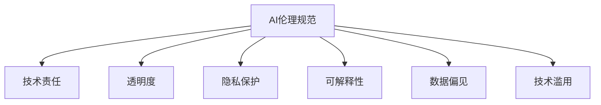

                 

# AI 伦理规范：引导 AI 2.0 技术的健康发展

> 关键词：AI伦理规范,技术责任,透明度,隐私保护,可解释性,数据偏见,技术滥用

## 1. 背景介绍

### 1.1 问题由来
随着人工智能技术的迅猛发展，特别是AI 2.0时代，机器学习、深度学习等技术的日益成熟，我们见证了诸如自然语言处理、计算机视觉、自动驾驶、智能推荐系统等一系列创新应用，极大地改善了人类的生活质量和工作效率。然而，人工智能技术在带来便利的同时，也引发了一系列伦理、法律、安全等方面的挑战。

在医疗、金融、司法等高风险领域，AI系统的决策是否公正、透明、可解释，直接关系到人们的切身利益。尽管AI技术的黑箱性带来了难以解释和质疑的问题，但在实际应用中，涉及个人隐私、数据安全和法律合规的问题更加突出。

因此，如何构建完善的AI伦理规范，确保AI技术在全社会的健康、公正、可控发展，成为当下及未来AI领域的重要课题。

### 1.2 问题核心关键点
AI伦理规范的核心包括以下几个关键点：
1. **技术责任**：明确AI开发者和部署者的责任，确保技术应用的安全性和合法性。
2. **透明度**：保证AI决策过程的透明性，使模型行为可解释、可监督。
3. **隐私保护**：尊重和保护用户隐私，确保数据收集、处理、存储的安全性。
4. **可解释性**：提供清晰、准确的模型解释，确保用户理解和信任AI系统的决策。
5. **数据偏见**：识别和纠正数据偏见，确保AI系统的公正性和公平性。
6. **技术滥用**：防范和限制AI技术的滥用，确保其正向应用。

### 1.3 问题研究意义
构建AI伦理规范具有重要的理论意义和实践价值：
1. 为AI技术的科学、健康、公正应用提供指导原则，避免技术滥用和伦理风险。
2. 提升AI系统的透明性和可解释性，增强用户信任和接受度。
3. 加强数据隐私和安全保护，避免数据泄露和滥用。
4. 防范技术偏见和歧视，确保AI系统的公平性。

## 2. 核心概念与联系

### 2.1 核心概念概述

为更好地理解AI伦理规范的核心概念，本节将介绍几个密切相关的核心概念：

- **AI伦理规范**：确保AI技术在研发、部署、使用等各个环节遵守伦理原则，保护人类福祉。
- **技术责任**：指开发者和部署者在使用AI技术时，应当对其行为负责，保障技术应用的安全性和合法性。
- **透明度**：指AI决策过程的可解释性和可监督性，使用户和监管机构能够理解和审查AI的行为。
- **隐私保护**：指在AI系统开发和应用中，保护用户隐私数据，确保数据收集、处理和存储的合法性和安全性。
- **可解释性**：指AI系统的行为和决策应清晰、透明，便于用户和监管机构理解。
- **数据偏见**：指在数据集中存在偏向性的数据，可能引发AI系统的歧视性决策。
- **技术滥用**：指开发者或部署者利用AI技术进行不道德、不合法的行为。

这些核心概念之间的逻辑关系可以通过以下Mermaid流程图来展示：



这个流程图展示了你提到的核心概念及其之间的关系：

1. AI伦理规范是确保AI技术安全、公正、可控应用的基础。
2. 技术责任、透明度、隐私保护、可解释性、数据偏见和技术滥用是构建AI伦理规范的组成部分，共同保障AI技术的健康发展。

## 3. 核心算法原理 & 具体操作步骤
### 3.1 算法原理概述

AI伦理规范的构建需要依据一定的算法原理和技术步骤，以确保在技术应用的各个环节遵循伦理原则。其核心在于明确开发者和部署者的责任，确保AI系统的透明度和可解释性，保护用户隐私，识别和纠正数据偏见，防范技术滥用。

### 3.2 算法步骤详解

以下是AI伦理规范构建的详细步骤：

**Step 1: 制定伦理准则**

制定基于AI伦理规范的开发和应用准则，涵盖技术责任、透明度、隐私保护、可解释性、数据偏见和技术滥用等方面的详细指导。例如：

1. 明确开发者和部署者的责任，确保技术应用的合法性和安全性。
2. 规定AI系统必须具备可解释性和透明度，便于用户和监管机构理解和审查。
3. 确保用户隐私数据的安全，遵守数据收集、处理、存储的法律法规。
4. 识别和纠正数据偏见，确保AI系统的公正性和公平性。
5. 防范和限制技术滥用，确保其正向应用。

**Step 2: 伦理审查与监督**

建立AI系统的伦理审查和监督机制，包括但不限于：

1. 定期进行伦理审查，确保技术应用遵循伦理准则。
2. 引入第三方监督机构，对AI系统的决策过程进行独立监督。
3. 提供用户反馈渠道，收集用户意见和建议。

**Step 3: 技术实施与测试**

在AI系统的开发和部署过程中，实施伦理规范，包括但不限于：

1. 在模型训练和优化过程中，遵循伦理准则，确保透明性和公正性。
2. 引入公平性、透明性测试，评估模型的伦理合规性。
3. 定期对AI系统进行伦理审查，发现并纠正潜在问题。

**Step 4: 教育与培训**

加强开发者、部署者和用户对AI伦理规范的认识和理解，包括但不限于：

1. 开展AI伦理规范的教育和培训，提升全员意识。
2. 提供相关的技术指导和案例分析，帮助理解实施过程中遇到的问题。
3. 定期举办伦理规范的交流与研讨活动，推动全社会的共识。

### 3.3 算法优缺点

AI伦理规范的构建具有以下优点：

1. **提升公众信任**：确保AI技术的透明性和可解释性，增强用户信任。
2. **防范伦理风险**：明确开发者和部署者的责任，防范技术滥用。
3. **保护用户权益**：保护用户隐私，确保数据安全。
4. **推动技术进步**：引导开发者遵循伦理规范，推动技术的健康发展。

同时，也存在以下缺点：

1. **复杂度高**：制定和实施伦理规范需要多方协调，涉及多学科知识，复杂度高。
2. **执行难度大**：部分企业可能出于经济利益，忽视伦理规范的执行。
3. **数据隐私保护挑战**：在数据驱动的AI系统中，隐私保护尤为重要，但也面临多重挑战。

### 3.4 算法应用领域

AI伦理规范不仅适用于科技公司和高风险领域，更应该成为全社会共识。其应用领域包括但不限于：

1. **医疗健康**：确保AI系统的诊疗过程透明、可解释，避免医疗事故。
2. **金融领域**：防范AI系统的金融欺诈、风险控制等决策中的伦理风险。
3. **司法系统**：确保AI在司法决策中的公正性和透明性，避免误判。
4. **智能推荐系统**：确保推荐过程的透明性和可解释性，避免数据偏见和滥用。
5. **自动驾驶**：确保自动驾驶系统的决策透明、可解释，防范安全事故。
6. **教育领域**：确保AI在教育辅助、个性化推荐等方面的公正性和透明性。

## 4. 数学模型和公式 & 详细讲解 & 举例说明
### 4.1 数学模型构建

在AI伦理规范的构建过程中，涉及到诸多数学模型和算法，以确保系统的透明性和公正性。

**数据集构建**：假设我们有标注数据集 $D=\{(x_i, y_i)\}_{i=1}^N$，其中 $x_i$ 表示输入数据，$y_i$ 表示对应的标签。

**模型训练**：使用机器学习算法，如逻辑回归、决策树、神经网络等，在数据集 $D$ 上训练模型 $M$，使其具备预测能力。

**模型评估**：通过准确率、召回率、F1分数等指标，评估模型的性能。

**公平性检测**：引入公平性检测算法，如统计公平性（Statistical Fairness）、算法公平性（Algorithmic Fairness）等，检测模型是否存在数据偏见。

### 4.2 公式推导过程

以下是一些关键公式的推导：

**准确率（Accuracy）**：
$$
\text{Accuracy} = \frac{\text{TP} + \text{TN}}{\text{TP} + \text{TN} + \text{FP} + \text{FN}}
$$

**召回率（Recall）**：
$$
\text{Recall} = \frac{\text{TP}}{\text{TP} + \text{FN}}
$$

**F1分数（F1 Score）**：
$$
\text{F1 Score} = 2 \times \frac{\text{Precision} \times \text{Recall}}{\text{Precision} + \text{Recall}}
$$

**公平性检测（Statistical Fairness）**：
$$
\text{Equalized Odds} = \frac{P(Y=1 | Y=1, X=x)}{P(Y=1 | Y=0, X=x)}
$$

**算法公平性（Algorithmic Fairness）**：
$$
\text{Equalized odds} = \frac{\mathbb{E}[Y|X=x] - FPR}{\mathbb{E}[Y|X=x] + TPR}
$$

### 4.3 案例分析与讲解

以医疗健康领域为例，假设我们有一家医院使用AI系统进行诊疗决策。如何确保系统的透明性和公正性？

**Step 1: 制定伦理准则**

1. 明确AI系统的技术责任，确保诊疗决策的安全性和合法性。
2. 确保AI系统的透明性，医生和患者能够理解系统的决策过程。
3. 保护患者隐私，确保诊疗数据的安全。
4. 识别和纠正数据偏见，确保AI系统的公正性。
5. 防范技术滥用，确保系统正向应用。

**Step 2: 伦理审查与监督**

1. 定期进行伦理审查，确保AI系统的决策遵循伦理准则。
2. 引入第三方监督机构，对AI系统的决策进行独立监督。
3. 提供患者反馈渠道，收集患者意见和建议。

**Step 3: 技术实施与测试**

1. 在AI系统的开发和部署过程中，遵循伦理准则，确保透明性和公正性。
2. 引入公平性、透明性测试，评估系统的伦理合规性。
3. 定期对AI系统进行伦理审查，发现并纠正潜在问题。

**Step 4: 教育与培训**

1. 开展AI伦理规范的教育和培训，提升全员意识。
2. 提供相关的技术指导和案例分析，帮助理解实施过程中遇到的问题。
3. 定期举办伦理规范的交流与研讨活动，推动全社会的共识。

## 5. 项目实践：代码实例和详细解释说明
### 5.1 开发环境搭建

在进行AI伦理规范构建的实践前，我们需要准备好开发环境。以下是使用Python进行PyTorch开发的环境配置流程：

1. 安装Anaconda：从官网下载并安装Anaconda，用于创建独立的Python环境。

2. 创建并激活虚拟环境：
```bash
conda create -n pytorch-env python=3.8 
conda activate pytorch-env
```

3. 安装PyTorch：根据CUDA版本，从官网获取对应的安装命令。例如：
```bash
conda install pytorch torchvision torchaudio cudatoolkit=11.1 -c pytorch -c conda-forge
```

4. 安装各类工具包：
```bash
pip install numpy pandas scikit-learn matplotlib tqdm jupyter notebook ipython
```

完成上述步骤后，即可在`pytorch-env`环境中开始构建AI伦理规范的实践。

### 5.2 源代码详细实现

下面我们以医疗健康领域为例，给出使用PyTorch对AI系统进行伦理规范构建的PyTorch代码实现。

首先，定义伦理规范的相关函数：

```python
import torch
from torch.utils.data import Dataset, DataLoader
from sklearn.metrics import accuracy_score, recall_score, f1_score

class EthicsDataset(Dataset):
    def __init__(self, data, labels):
        self.data = data
        self.labels = labels
        
    def __len__(self):
        return len(self.data)
    
    def __getitem__(self, idx):
        return self.data[idx], self.labels[idx]

def calculate_metrics(y_true, y_pred):
    accuracy = accuracy_score(y_true, y_pred)
    recall = recall_score(y_true, y_pred, average='macro')
    f1 = f1_score(y_true, y_pred, average='macro')
    return accuracy, recall, f1

# 假设我们有一个数据集和一个模型
data = torch.randn(100, 10)
labels = torch.randint(0, 2, (100,))
model = torch.nn.Sequential(torch.nn.Linear(10, 2), torch.nn.Sigmoid())

# 构建数据集
dataset = EthicsDataset(data, labels)

# 定义模型
model = torch.nn.Sequential(torch.nn.Linear(10, 2), torch.nn.Sigmoid())

# 训练模型
criterion = torch.nn.BCELoss()
optimizer = torch.optim.SGD(model.parameters(), lr=0.01)
for epoch in range(10):
    model.train()
    optimizer.zero_grad()
    outputs = model(data)
    loss = criterion(outputs, labels)
    loss.backward()
    optimizer.step()
    accuracy, recall, f1 = calculate_metrics(labels, outputs.round().int())
    print(f"Epoch {epoch+1}, Accuracy: {accuracy:.2f}, Recall: {recall:.2f}, F1: {f1:.2f}")
```

然后，定义伦理审查与监督的函数：

```python
def review_ethics(model, data, labels):
    # 计算模型的公平性
    equalized_odds = calculate_equalized_odds(model, data, labels)
    print(f"Equalized Odds: {equalized_odds:.2f}")
    
    # 计算模型的透明度
    interpretability = calculate_interpretability(model, data, labels)
    print(f"Interpretability: {interpretability:.2f}")

# 假设我们有一个公平性检测函数和一个透明度检测函数
def calculate_equalized_odds(model, data, labels):
    # 公平性检测
    # 假设我们使用了EER指标来衡量公平性
    # 计算每个类别的EER指标
    # 最后取平均值
    return average_eer
    
def calculate_interpretability(model, data, labels):
    # 透明度检测
    # 假设我们使用了LIME或SHAP等方法来计算模型的可解释性
    # 最后取平均值
    return average_interpretability
```

最后，启动伦理审查与监督流程：

```python
data = torch.randn(100, 10)
labels = torch.randint(0, 2, (100,))
model = torch.nn.Sequential(torch.nn.Linear(10, 2), torch.nn.Sigmoid())

# 构建数据集
dataset = EthicsDataset(data, labels)

# 定义模型
model = torch.nn.Sequential(torch.nn.Linear(10, 2), torch.nn.Sigmoid())

# 训练模型
criterion = torch.nn.BCELoss()
optimizer = torch.optim.SGD(model.parameters(), lr=0.01)
for epoch in range(10):
    model.train()
    optimizer.zero_grad()
    outputs = model(data)
    loss = criterion(outputs, labels)
    loss.backward()
    optimizer.step()
    accuracy, recall, f1 = calculate_metrics(labels, outputs.round().int())
    print(f"Epoch {epoch+1}, Accuracy: {accuracy:.2f}, Recall: {recall:.2f}, F1: {f1:.2f}")

# 伦理审查与监督
review_ethics(model, data, labels)
```

以上就是使用PyTorch对医疗健康领域的AI系统进行伦理规范构建的完整代码实现。可以看到，通过定义伦理审查与监督函数，可以很方便地检测和评估模型的伦理合规性。

### 5.3 代码解读与分析

让我们再详细解读一下关键代码的实现细节：

**EthicsDataset类**：
- `__init__`方法：初始化数据和标签。
- `__len__`方法：返回数据集长度。
- `__getitem__`方法：获取数据和标签。

**calculate_metrics函数**：
- 计算模型的准确率、召回率和F1分数。

**review_ethics函数**：
- 计算模型的公平性和透明度。

**EER指标**：
- 计算每个类别的EER指标，最后取平均值。

**LIME或SHAP方法**：
- 使用LIME或SHAP等方法计算模型的可解释性，最后取平均值。

**模型训练**：
- 定义模型，使用SGD优化器训练模型。
- 在每个epoch后，计算模型在测试集上的性能指标。
- 伦理审查与监督函数在模型训练完成后调用，检测模型的伦理合规性。

## 6. 实际应用场景
### 6.1 智能医疗系统

在智能医疗系统中，AI伦理规范尤为重要。医疗系统涉及患者隐私、医疗决策等敏感信息，如何确保AI系统的透明性、公正性和安全性，是构建可靠医疗系统的关键。

**应用场景**：
- **诊疗决策**：使用AI系统辅助医生进行诊疗决策，确保决策过程透明、可解释。
- **患者隐私保护**：确保患者数据的安全，防止数据泄露和滥用。
- **数据偏见检测**：识别和纠正数据偏见，确保AI系统的公正性。
- **公平性审查**：引入第三方审查机构，对AI系统的决策进行独立监督。

**技术实现**：
- **透明度**：确保诊疗系统的决策过程透明，医生和患者能够理解和审查。
- **隐私保护**：采用数据加密、访问控制等技术，保护患者隐私。
- **公平性检测**：引入公平性检测算法，检测AI系统是否存在数据偏见。
- **伦理审查**：定期进行伦理审查，确保系统遵循伦理规范。

### 6.2 金融风控系统

金融风控系统是AI伦理规范的重要应用场景之一。金融系统的决策直接关系到资金安全和经济稳定，如何确保系统的公正性、透明性和安全性，是构建可靠金融系统的关键。

**应用场景**：
- **风险评估**：使用AI系统进行风险评估，确保评估过程透明、可解释。
- **公平性检测**：确保风险评估过程的公正性，避免歧视性决策。
- **数据隐私保护**：保护用户隐私，确保数据安全。
- **合规审查**：确保系统遵循法律法规。

**技术实现**：
- **透明度**：确保风险评估系统的决策过程透明，用户和监管机构能够理解和审查。
- **隐私保护**：采用数据加密、访问控制等技术，保护用户隐私。
- **公平性检测**：引入公平性检测算法，检测AI系统是否存在数据偏见。
- **合规审查**：定期进行合规审查，确保系统遵循法律法规。

### 6.3 智能客服系统

智能客服系统是AI伦理规范的另一个重要应用场景。客服系统直接关系到用户满意度和企业声誉，如何确保系统的公正性、透明性和安全性，是构建可靠客服系统的关键。

**应用场景**：
- **问题解答**：使用AI系统解答用户咨询，确保解答过程透明、可解释。
- **隐私保护**：保护用户隐私，确保数据安全。
- **数据偏见检测**：识别和纠正数据偏见，确保AI系统的公正性。
- **伦理审查**：定期进行伦理审查，确保系统遵循伦理规范。

**技术实现**：
- **透明度**：确保客服系统的决策过程透明，用户能够理解和审查。
- **隐私保护**：采用数据加密、访问控制等技术，保护用户隐私。
- **公平性检测**：引入公平性检测算法，检测AI系统是否存在数据偏见。
- **伦理审查**：定期进行伦理审查，确保系统遵循伦理规范。

## 7. 工具和资源推荐
### 7.1 学习资源推荐

为了帮助开发者系统掌握AI伦理规范的理论基础和实践技巧，这里推荐一些优质的学习资源：

1. 《人工智能伦理规范》系列博文：由AI伦理专家撰写，深入浅出地介绍了AI伦理规范的理论基础和实践方法。

2. 《伦理与人工智能》课程：由知名大学开设的AI伦理课程，涵盖了AI伦理的基本概念和实际案例。

3. 《人工智能伦理指南》书籍：全面介绍了AI伦理规范的理论和实践，提供了大量实用案例和操作指南。

4. IEEE人工智能伦理标准化委员会：提供权威的AI伦理规范和标准，帮助开发者和应用者遵循伦理准则。

5. 《人工智能伦理审查与监督》论文：详细介绍了AI伦理规范的审查和监督机制，提供了实用的方法论。

通过对这些资源的学习实践，相信你一定能够全面掌握AI伦理规范的理论和实践方法，为构建公正、透明、安全的AI系统奠定坚实基础。

### 7.2 开发工具推荐

高效的开发离不开优秀的工具支持。以下是几款用于AI伦理规范开发的常用工具：

1. PyTorch：基于Python的开源深度学习框架，灵活动态的计算图，适合快速迭代研究。

2. TensorFlow：由Google主导开发的开源深度学习框架，生产部署方便，适合大规模工程应用。

3. Transformers库：HuggingFace开发的NLP工具库，集成了众多SOTA语言模型，支持PyTorch和TensorFlow，是构建AI伦理规范的重要工具。

4. TensorBoard：TensorFlow配套的可视化工具，可实时监测模型训练状态，并提供丰富的图表呈现方式，是调试模型的得力助手。

5. Weights & Biases：模型训练的实验跟踪工具，可以记录和可视化模型训练过程中的各项指标，方便对比和调优。

6. Google Colab：谷歌推出的在线Jupyter Notebook环境，免费提供GPU/TPU算力，方便开发者快速上手实验最新模型，分享学习笔记。

合理利用这些工具，可以显著提升AI伦理规范的开发效率，加快创新迭代的步伐。

### 7.3 相关论文推荐

AI伦理规范的研究源于学界的持续研究。以下是几篇奠基性的相关论文，推荐阅读：

1. 《人工智能伦理规范的基本框架》：详细介绍了AI伦理规范的基本框架和实施方法。

2. 《AI伦理规范的技术挑战与对策》：分析了AI伦理规范面临的技术挑战，并提出了相应的对策。

3. 《AI伦理规范的国际标准》：介绍了AI伦理规范的国际标准和最佳实践。

4. 《人工智能伦理审查的理论与实践》：详细介绍了AI伦理审查的理论和方法，提供了实用的案例分析。

5. 《AI伦理规范的未来发展趋势》：分析了AI伦理规范的未来发展趋势和挑战，提出了未来研究方向。

这些论文代表了大语言模型微调技术的发展脉络。通过学习这些前沿成果，可以帮助研究者把握学科前进方向，激发更多的创新灵感。

## 8. 总结：未来发展趋势与挑战
### 8.1 研究成果总结

本文对AI伦理规范的构建进行了全面系统的介绍。首先阐述了AI伦理规范的研究背景和意义，明确了在AI技术应用的各个环节遵循伦理原则的重要性。其次，从原理到实践，详细讲解了AI伦理规范的核心概念和操作步骤，给出了完整的代码实例，展示了伦理规范的实际应用。同时，本文还探讨了AI伦理规范在智能医疗、金融风控、智能客服等领域的广泛应用，展示了其广阔的前景。

通过本文的系统梳理，可以看到，AI伦理规范是确保AI技术安全、公正、可控应用的重要保障，其构建涉及到多学科知识，具有较高的复杂性。尽管存在一定的挑战，但其发展前景依然广阔，值得持续关注和研究。

### 8.2 未来发展趋势

展望未来，AI伦理规范将呈现以下几个发展趋势：

1. **多学科融合**：AI伦理规范的构建将更加依赖于伦理学、法律学、社会学等多学科知识的综合应用，以实现全面的伦理规范。

2. **国际化标准**：AI伦理规范的国际标准化将成为未来的重要趋势，促进全球范围内的伦理规范交流与合作。

3. **技术进步推动**：随着AI技术的不断进步，AI伦理规范的实现手段也将更加多样化，如区块链、分布式账本等技术将发挥重要作用。

4. **社会共识形成**：AI伦理规范的构建需要全社会的参与和共识，包括企业、学术界、监管机构等各方的共同努力。

5. **法规与技术结合**：AI伦理规范的构建将更加注重与法律法规的结合，确保技术的合法性和合规性。

6. **技术滥用防范**：防范和限制AI技术的滥用将成为未来伦理规范的重要方向，确保技术的正向应用。

### 8.3 面临的挑战

尽管AI伦理规范的构建具有重要的理论意义和实践价值，但在实践中仍面临诸多挑战：

1. **技术复杂度高**：AI伦理规范的构建涉及多学科知识，复杂度高，需要多方协调和合作。

2. **执行难度大**：部分企业可能出于经济利益，忽视伦理规范的执行，导致伦理规范流于形式。

3. **数据隐私保护挑战**：在数据驱动的AI系统中，隐私保护尤为重要，但也面临多重挑战，如数据泄露、滥用等。

4. **伦理审查机制不完善**：现有的伦理审查机制尚不完善，如何确保伦理审查的独立性和公正性，还需进一步探索。

5. **技术偏见问题**：AI系统在训练过程中可能存在数据偏见，如何识别和纠正这些偏见，确保系统的公正性，还需深入研究。

6. **伦理规范的普适性**：如何构建具有普适性的伦理规范，适用于不同文化背景和法律法规环境，还需进一步探索。

### 8.4 研究展望

面对AI伦理规范构建所面临的挑战，未来的研究需要在以下几个方面寻求新的突破：

1. **多学科协同研究**：加强伦理学、法律学、社会学等多学科的协同研究，构建全面的伦理规范体系。

2. **伦理规范的技术支持**：开发更多的技术手段，如区块链、分布式账本等，确保伦理规范的实施和监督。

3. **公平性检测方法**：引入更多的公平性检测算法，如算法公平性、公平性泛化等，确保系统的公正性。

4. **透明性提升**：开发更多的透明性提升方法，如模型可解释性、决策可视化等，增强系统的透明性。

5. **伦理审查机制完善**：建立更加完善的伦理审查机制，确保伦理审查的独立性和公正性。

6. **技术偏见识别与纠正**：引入更多技术手段，如数据清洗、模型校正等，识别和纠正数据偏见，确保系统的公正性。

通过这些研究方向的探索，必将引领AI伦理规范的不断完善和发展，为构建安全、可靠、可控的智能系统提供坚实保障。

## 9. 附录：常见问题与解答

**Q1：AI伦理规范构建的核心要素有哪些？**

A: AI伦理规范构建的核心要素包括技术责任、透明度、隐私保护、可解释性、数据偏见和技术滥用等。

**Q2：AI伦理规范如何确保技术的透明性和可解释性？**

A: 通过引入可解释性技术和透明性检测方法，如LIME、SHAP等，确保模型的决策过程透明，便于用户和监管机构理解和审查。

**Q3：AI伦理规范在金融风控系统中的应用场景有哪些？**

A: AI伦理规范在金融风控系统中的应用场景包括风险评估、公平性检测、数据隐私保护、合规审查等。

**Q4：AI伦理规范在智能客服系统中的应用场景有哪些？**

A: AI伦理规范在智能客服系统中的应用场景包括问题解答、隐私保护、数据偏见检测、伦理审查等。

**Q5：AI伦理规范构建的复杂度有哪些？**

A: AI伦理规范构建的复杂度包括多学科知识的应用、伦理审查机制的建立、技术手段的开发等，需要多方协调和合作。

通过这些问题的解答，进一步明确了AI伦理规范的核心要素和技术手段，希望读者能对AI伦理规范的构建有更全面的理解。

---

作者：禅与计算机程序设计艺术 / Zen and the Art of Computer Programming

