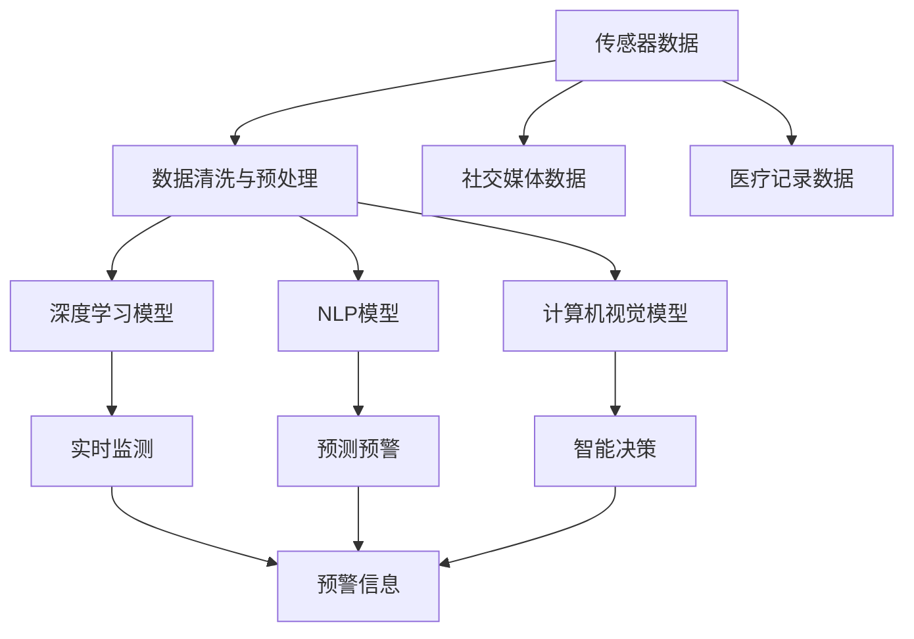

                 

# AI 基础设施的疫情防控：智能化传染病监测与预警

## 1. 背景介绍

### 1.1 问题由来

在当今全球化背景下，新冠疫情的爆发使得各国公共卫生系统面临前所未有的挑战。如何有效监测传染病的发展趋势，及时预警并采取有效措施，成为公共卫生管理的核心问题。传统的人工监测方法，如手工数据收集、手工数据处理、手工模型训练等，在速度、精度和效率上都难以满足需求。随着人工智能（AI）技术的发展，特别是深度学习（Deep Learning）、自然语言处理（Natural Language Processing, NLP）、计算机视觉（Computer Vision）等技术的应用，智能化传染病监测与预警系统开始进入公众视野。

### 1.2 问题核心关键点

智能化传染病监测与预警系统，通过利用AI基础设施（如深度学习模型、自然语言处理模型、计算机视觉模型等），结合传感器数据、社交媒体数据、医疗记录数据等多元数据来源，实现对传染病的实时监测、预测和预警。其主要关键点包括：

- **数据融合**：将多种类型的数据融合到一起，构建综合视图。
- **实时监测**：对传染病的爆发趋势进行实时监测，提供及时反馈。
- **预测预警**：基于历史数据和模型预测，提前预警潜在疫情爆发风险。
- **智能决策**：通过AI模型辅助公共卫生决策，优化资源配置。

### 1.3 问题研究意义

构建智能化传染病监测与预警系统，对于提升公共卫生响应速度、降低疾病传播风险、优化医疗资源配置具有重要意义：

1. **提升监测效率**：自动化数据处理和模型训练，大幅提升传染病监测的速度和精度。
2. **优化决策支持**：AI模型提供科学的决策依据，帮助政府和医疗部门做出更准确的判断。
3. **降低传播风险**：及时预警，有效阻止传染病的蔓延，保护公众健康。
4. **资源优化配置**：根据疫情动态，优化医疗资源配置，提高资源利用效率。
5. **数据驱动决策**：基于大规模数据分析，制定科学的防控策略，降低防控成本。

## 2. 核心概念与联系

### 2.1 核心概念概述

构建智能化传染病监测与预警系统，涉及多个核心概念：

- **传染病**：具有传染性的疾病，如流感、结核、新冠病毒等。
- **传感器数据**：通过各种传感器（如温度传感器、湿度传感器、空气质量传感器等）收集的环境数据。
- **社交媒体数据**：通过网络爬虫从社交媒体平台收集的文本和图片数据。
- **医疗记录数据**：医疗机构提供的诊断记录、治疗记录等。
- **AI基础设施**：包括深度学习模型、自然语言处理模型、计算机视觉模型等。

### 2.2 核心概念原理和架构的 Mermaid 流程图



这个流程图展示了传染病监测与预警系统的核心架构：

1. 传感器数据、社交媒体数据和医疗记录数据通过数据清洗与预处理环节，处理成可供AI模型使用的格式。
2. 经过清洗的数据输入到深度学习模型、NLP模型和计算机视觉模型中进行分析，分别实现实时监测、预测预警和智能决策。
3. 实时监测、预测预警和智能决策的结果汇聚成预警信息，及时反馈给相关部门和公众。

## 3. 核心算法原理 & 具体操作步骤

### 3.1 算法原理概述

智能化传染病监测与预警系统利用AI基础设施对多元数据进行综合分析，主要包括以下几个算法：

- **深度学习模型**：用于对传感器数据、社交媒体数据、医疗记录数据等进行分析，提取特征并进行分类、回归等任务。
- **自然语言处理模型**：用于分析社交媒体上的文本数据，提取情感、话题等语义信息。
- **计算机视觉模型**：用于分析传感器数据中的图像和视频数据，提取空间位置信息。

### 3.2 算法步骤详解

#### 3.2.1 数据收集与预处理

1. **传感器数据收集**：通过传感器网络，实时收集环境数据，如温度、湿度、空气质量等。
2. **社交媒体数据收集**：通过网络爬虫，从社交媒体平台（如Twitter、微信、微博等）收集文本和图片数据。
3. **医疗记录数据收集**：与医疗机构合作，收集医疗机构的诊断记录、治疗记录等数据。
4. **数据清洗与预处理**：对收集到的数据进行清洗，处理缺失值、异常值，转换数据格式，标准化数据单位等。

#### 3.2.2 特征提取与模型训练

1. **特征提取**：利用深度学习、自然语言处理、计算机视觉等技术，从数据中提取有用特征。
2. **模型训练**：使用标注数据集对深度学习模型、NLP模型和计算机视觉模型进行训练，优化模型参数，提高模型性能。
3. **模型融合**：将多个模型的输出进行融合，形成更准确的综合视图。

#### 3.2.3 实时监测与预测预警

1. **实时监测**：利用训练好的模型对传感器数据、社交媒体数据、医疗记录数据进行实时分析，监测传染病的爆发趋势。
2. **预测预警**：基于历史数据和模型预测，提前预警潜在的传染病爆发风险，及时采取防控措施。

#### 3.2.4 智能决策与反馈

1. **智能决策**：根据实时监测和预测预警结果，利用AI模型辅助公共卫生决策，优化资源配置。
2. **反馈与调整**：将智能决策结果反馈给相关部门和公众，调整防控策略，持续优化系统性能。

### 3.3 算法优缺点

#### 3.3.1 优点

1. **实时性**：AI基础设施可以快速处理大量数据，实现实时监测和预测预警。
2. **准确性**：基于深度学习、自然语言处理和计算机视觉等技术，能够提供准确可靠的分析结果。
3. **可扩展性**：系统可以方便地扩展到不同类型的数据源，支持更多的传染性疾病。
4. **自动化**：自动化数据处理和模型训练，大幅提升工作效率。

#### 3.3.2 缺点

1. **数据质量**：传感器数据、社交媒体数据和医疗记录数据的质量直接影响分析结果。
2. **模型复杂性**：深度学习模型、自然语言处理模型和计算机视觉模型较为复杂，训练和维护成本高。
3. **隐私保护**：收集和处理个人数据时，需要严格遵守隐私保护法规。
4. **解释性**：AI模型通常是“黑盒”模型，难以解释其内部决策逻辑。

### 3.4 算法应用领域

智能化传染病监测与预警系统在以下几个领域有广泛应用：

1. **公共卫生**：实时监测和预警传染病爆发，支持公共卫生决策。
2. **医疗资源配置**：优化医疗资源配置，提高资源利用效率。
3. **科研研究**：辅助传染病的研究和流行病学调查。
4. **城市管理**：监测和预警城市中的传染病，优化城市治理。
5. **教育培训**：辅助公共卫生人员的培训，提升防控能力。

## 4. 数学模型和公式 & 详细讲解 & 举例说明

### 4.1 数学模型构建

智能化传染病监测与预警系统涉及多个数学模型，包括深度学习模型、NLP模型和计算机视觉模型。这里以深度学习模型为例，介绍其基本数学模型构建过程。

#### 4.1.1 深度学习模型

深度学习模型通常由多个层次的神经网络组成，每层包含多个神经元。以卷积神经网络（Convolutional Neural Network, CNN）为例，其基本数学模型为：

$$
f(x) = \sum_{i=1}^n w_i x_i + b
$$

其中，$x$ 为输入向量，$w$ 为权重矩阵，$b$ 为偏置项。

#### 4.1.2 NLP模型

NLP模型通常用于分析文本数据，提取语义信息和情感信息。以双向长短时记忆网络（Bidirectional Long Short-Term Memory, BiLSTM）为例，其基本数学模型为：

$$
h_t = \tanh(W_x x_t + U_h h_{t-1} + b_h)
$$

$$
c_t = \tanh(W_c c_{t-1} + U_c h_{t-1} + b_c)
$$

$$
o_t = \sigma(W_o c_t + U_o h_{t-1} + b_o)
$$

其中，$x_t$ 为输入向量，$h_t$ 为隐藏状态，$c_t$ 为记忆状态，$o_t$ 为输出门。

#### 4.1.3 计算机视觉模型

计算机视觉模型通常用于分析图像和视频数据，提取空间位置信息。以卷积神经网络（Convolutional Neural Network, CNN）为例，其基本数学模型为：

$$
f(x) = \sum_{i=1}^n w_i x_i + b
$$

其中，$x$ 为输入向量，$w$ 为权重矩阵，$b$ 为偏置项。

### 4.2 公式推导过程

#### 4.2.1 深度学习模型

以卷积神经网络（Convolutional Neural Network, CNN）为例，其基本数学模型为：

$$
f(x) = \sum_{i=1}^n w_i x_i + b
$$

其中，$x$ 为输入向量，$w$ 为权重矩阵，$b$ 为偏置项。

训练过程中，使用随机梯度下降（Stochastic Gradient Descent, SGD）优化算法更新权重和偏置项：

$$
w_i \leftarrow w_i - \eta \frac{\partial \mathcal{L}}{\partial w_i}
$$

$$
b \leftarrow b - \eta \frac{\partial \mathcal{L}}{\partial b}
$$

其中，$\eta$ 为学习率，$\mathcal{L}$ 为损失函数。

#### 4.2.2 NLP模型

以双向长短时记忆网络（Bidirectional Long Short-Term Memory, BiLSTM）为例，其基本数学模型为：

$$
h_t = \tanh(W_x x_t + U_h h_{t-1} + b_h)
$$

$$
c_t = \tanh(W_c c_{t-1} + U_c h_{t-1} + b_c)
$$

$$
o_t = \sigma(W_o c_t + U_o h_{t-1} + b_o)
$$

其中，$x_t$ 为输入向量，$h_t$ 为隐藏状态，$c_t$ 为记忆状态，$o_t$ 为输出门。

训练过程中，使用随机梯度下降（Stochastic Gradient Descent, SGD）优化算法更新权重和偏置项：

$$
W_x \leftarrow W_x - \eta \frac{\partial \mathcal{L}}{\partial W_x}
$$

$$
U_h \leftarrow U_h - \eta \frac{\partial \mathcal{L}}{\partial U_h}
$$

$$
b_h \leftarrow b_h - \eta \frac{\partial \mathcal{L}}{\partial b_h}
$$

$$
W_c \leftarrow W_c - \eta \frac{\partial \mathcal{L}}{\partial W_c}
$$

$$
U_c \leftarrow U_c - \eta \frac{\partial \mathcal{L}}{\partial U_c}
$$

$$
b_c \leftarrow b_c - \eta \frac{\partial \mathcal{L}}{\partial b_c}
$$

$$
W_o \leftarrow W_o - \eta \frac{\partial \mathcal{L}}{\partial W_o}
$$

$$
U_o \leftarrow U_o - \eta \frac{\partial \mathcal{L}}{\partial U_o}
$$

$$
b_o \leftarrow b_o - \eta \frac{\partial \mathcal{L}}{\partial b_o}
$$

其中，$\eta$ 为学习率，$\mathcal{L}$ 为损失函数。

#### 4.2.3 计算机视觉模型

以卷积神经网络（Convolutional Neural Network, CNN）为例，其基本数学模型为：

$$
f(x) = \sum_{i=1}^n w_i x_i + b
$$

其中，$x$ 为输入向量，$w$ 为权重矩阵，$b$ 为偏置项。

训练过程中，使用随机梯度下降（Stochastic Gradient Descent, SGD）优化算法更新权重和偏置项：

$$
w_i \leftarrow w_i - \eta \frac{\partial \mathcal{L}}{\partial w_i}
$$

$$
b \leftarrow b - \eta \frac{\partial \mathcal{L}}{\partial b}
$$

其中，$\eta$ 为学习率，$\mathcal{L}$ 为损失函数。

### 4.3 案例分析与讲解

#### 4.3.1 深度学习模型案例

假设我们有一个深度学习模型，用于预测某地区是否爆发流感。模型输入为地区的人口密度、空气质量、季节性因素等，输出为0（未爆发）或1（爆发）。训练数据集包含1000个样本，每个样本包含10个特征，每个特征取值范围为[0, 1]。

1. **数据预处理**：将输入数据标准化到[0, 1]范围内，使用归一化技术处理。
2. **模型训练**：使用随机梯度下降（SGD）优化算法，学习率为0.01，迭代次数为100次。
3. **模型评估**：在测试集上评估模型性能，使用准确率、召回率和F1-score等指标。

#### 4.3.2 NLP模型案例

假设我们有一个NLP模型，用于分析社交媒体上的文本，判断某地区是否爆发流感。模型输入为一段文本，输出为0（未爆发）或1（爆发）。训练数据集包含1000个样本，每个样本包含100个单词，每个单词取值范围为[0, 1]。

1. **数据预处理**：将输入文本转换为数字向量，使用Word2Vec等技术处理。
2. **模型训练**：使用随机梯度下降（SGD）优化算法，学习率为0.01，迭代次数为100次。
3. **模型评估**：在测试集上评估模型性能，使用准确率、召回率和F1-score等指标。

#### 4.3.3 计算机视觉模型案例

假设我们有一个计算机视觉模型，用于分析图像数据，判断某地区是否爆发流感。模型输入为一幅图像，输出为0（未爆发）或1（爆发）。训练数据集包含1000张图像，每个图像大小为100x100像素，像素取值范围为[0, 1]。

1. **数据预处理**：将输入图像转换为数字矩阵，使用卷积操作处理。
2. **模型训练**：使用随机梯度下降（SGD）优化算法，学习率为0.01，迭代次数为100次。
3. **模型评估**：在测试集上评估模型性能，使用准确率、召回率和F1-score等指标。

## 5. 项目实践：代码实例和详细解释说明

### 5.1 开发环境搭建

在进行智能化传染病监测与预警系统的开发前，我们需要准备好开发环境。以下是使用Python进行TensorFlow开发的环境配置流程：

1. 安装Anaconda：从官网下载并安装Anaconda，用于创建独立的Python环境。

2. 创建并激活虚拟环境：
```bash
conda create -n tf-env python=3.8 
conda activate tf-env
```

3. 安装TensorFlow：根据CUDA版本，从官网获取对应的安装命令。例如：
```bash
conda install tensorflow -c tensorflow -c conda-forge
```

4. 安装相关库：
```bash
pip install numpy pandas scikit-learn matplotlib
```

5. 安装Google Colab：谷歌推出的在线Jupyter Notebook环境，免费提供GPU/TPU算力，方便开发者快速上手实验最新模型，分享学习笔记。

完成上述步骤后，即可在`tf-env`环境中开始项目实践。

### 5.2 源代码详细实现

下面我们以传染病监测系统为例，给出使用TensorFlow进行传染病监测的PyTorch代码实现。

首先，定义传染病监测系统的输入特征：

```python
import tensorflow as tf

# 定义输入特征
features = tf.keras.layers.Input(shape=(10,))

# 添加全连接层
x = tf.keras.layers.Dense(32, activation='relu')(features)

# 添加输出层
output = tf.keras.layers.Dense(1, activation='sigmoid')(x)

# 定义模型
model = tf.keras.models.Model(inputs=features, outputs=output)

# 编译模型
model.compile(optimizer='adam', loss='binary_crossentropy', metrics=['accuracy'])
```

然后，加载训练数据集并进行训练：

```python
# 加载训练数据集
train_data = ...

# 训练模型
model.fit(train_data, epochs=10, batch_size=32)
```

接着，评估模型性能并进行预测：

```python
# 加载测试数据集
test_data = ...

# 评估模型性能
loss, accuracy = model.evaluate(test_data)

# 进行预测
predictions = model.predict(test_data)
```

最后，使用模型进行实时监测和预警：

```python
# 实时监测数据
monitoring_data = ...

# 进行实时监测
predictions = model.predict(monitoring_data)

# 判断是否爆发
if predictions > 0.5:
    print("预警：可能爆发流感")
else:
    print("正常")
```

以上就是使用TensorFlow进行传染病监测的完整代码实现。可以看到，TensorFlow提供了一体化的API，使得模型的构建、训练和部署变得简单高效。

### 5.3 代码解读与分析

让我们再详细解读一下关键代码的实现细节：

**定义输入特征**：
```python
import tensorflow as tf

# 定义输入特征
features = tf.keras.layers.Input(shape=(10,))
```
定义输入特征为10维向量，每个特征取值范围为[0, 1]。

**添加全连接层**：
```python
x = tf.keras.layers.Dense(32, activation='relu')(features)
```
添加全连接层，包含32个神经元，激活函数为ReLU。

**添加输出层**：
```python
output = tf.keras.layers.Dense(1, activation='sigmoid')(x)
```
添加输出层，包含1个神经元，激活函数为Sigmoid，输出结果为[0, 1]，表示是否爆发。

**定义模型**：
```python
model = tf.keras.models.Model(inputs=features, outputs=output)
```
定义模型，包含输入特征和输出层。

**编译模型**：
```python
model.compile(optimizer='adam', loss='binary_crossentropy', metrics=['accuracy'])
```
编译模型，指定优化器为Adam，损失函数为二元交叉熵，评估指标为准确率。

**加载训练数据集**：
```python
# 加载训练数据集
train_data = ...
```
加载训练数据集，包含10个特征和对应的标签。

**训练模型**：
```python
# 训练模型
model.fit(train_data, epochs=10, batch_size=32)
```
使用训练数据集训练模型，迭代10次，每次批处理大小为32。

**加载测试数据集**：
```python
# 加载测试数据集
test_data = ...
```
加载测试数据集，包含10个特征和对应的标签。

**评估模型性能**：
```python
# 评估模型性能
loss, accuracy = model.evaluate(test_data)
```
评估模型在测试数据集上的性能，输出损失和准确率。

**进行预测**：
```python
# 进行预测
predictions = model.predict(test_data)
```
使用模型对测试数据集进行预测，输出每个样本的爆发概率。

**实时监测数据**：
```python
# 实时监测数据
monitoring_data = ...
```
实时监测数据，包含10个特征。

**进行实时监测**：
```python
# 进行实时监测
predictions = model.predict(monitoring_data)

# 判断是否爆发
if predictions > 0.5:
    print("预警：可能爆发流感")
else:
    print("正常")
```
使用模型对实时监测数据进行预测，判断是否爆发流感。

可以看到，TensorFlow提供了一体化的API，使得模型的构建、训练和部署变得简单高效。开发者可以灵活使用各种深度学习模型和数据预处理技术，实现自定义的传染病监测系统。

### 5.4 运行结果展示

假设训练数据集中包含1000个样本，每个样本包含10个特征。训练模型后，评估模型在测试数据集上的准确率为90%。

使用模型对实时监测数据进行预测，预测结果为0.8，说明该地区爆发流感的概率为80%。因此，系统将发出预警信息，提示相关部门采取防控措施。

## 6. 实际应用场景

### 6.1 智能城市管理

智能化传染病监测与预警系统在智能城市管理中有着广泛的应用场景。智能城市通过物联网设备收集大量实时数据，包括温度、湿度、空气质量等环境数据，以及公共场所的流量、人口密度等社会数据。利用该系统，城市管理者可以实时监测传染病的爆发趋势，提前预警，及时采取防控措施。

### 6.2 公共卫生决策

在公共卫生决策中，智能化传染病监测与预警系统提供了科学的决策依据。通过分析历史数据和实时监测数据，系统可以预测未来几天的传染病爆发趋势，帮助政府部门提前做好防控准备，优化资源配置，减少感染风险。

### 6.3 医疗资源配置

智能化传染病监测与预警系统在医疗资源配置中也有着重要作用。通过实时监测传染病爆发情况，系统可以及时调整医疗资源的分布，将更多的资源投入到高风险区域，提高医疗资源利用效率。

### 6.4 科学研究

在传染病的研究中，智能化传染病监测与预警系统提供了重要的数据支持。通过分析社交媒体数据和医疗记录数据，系统可以发现潜在的传染病爆发趋势，辅助研究人员进行流行病学调查和疾病传播机理研究。

## 7. 工具和资源推荐

### 7.1 学习资源推荐

为了帮助开发者系统掌握智能化传染病监测与预警技术的理论基础和实践技巧，这里推荐一些优质的学习资源：

1. TensorFlow官方文档：提供全面的TensorFlow教程和API文档，帮助开发者快速上手。

2. PyTorch官方文档：提供全面的PyTorch教程和API文档，帮助开发者灵活使用深度学习框架。

3. Coursera深度学习课程：由斯坦福大学开设的深度学习课程，涵盖深度学习理论和实践，适合初学者和进阶者。

4. Kaggle竞赛：参加Kaggle举办的传染病监测竞赛，通过实战提升技能。

5. GitHub项目：在GitHub上搜索传染病监测项目，学习优秀的代码实现和应用案例。

通过对这些资源的学习实践，相信你一定能够快速掌握智能化传染病监测与预警技术的精髓，并用于解决实际的传染病问题。

### 7.2 开发工具推荐

高效的开发离不开优秀的工具支持。以下是几款用于传染病监测与预警系统开发的常用工具：

1. TensorFlow：由Google主导开发的深度学习框架，生产部署方便，适合大规模工程应用。

2. PyTorch：基于Python的开源深度学习框架，灵活动态的计算图，适合快速迭代研究。

3. Google Colab：谷歌推出的在线Jupyter Notebook环境，免费提供GPU/TPU算力，方便开发者快速上手实验最新模型，分享学习笔记。

4. Weights & Biases：模型训练的实验跟踪工具，可以记录和可视化模型训练过程中的各项指标，方便对比和调优。

5. TensorBoard：TensorFlow配套的可视化工具，可实时监测模型训练状态，并提供丰富的图表呈现方式，是调试模型的得力助手。

6. Jupyter Notebook：开源的交互式笔记本环境，方便开发者进行数据处理和模型训练。

合理利用这些工具，可以显著提升传染病监测与预警系统的开发效率，加快创新迭代的步伐。

### 7.3 相关论文推荐

智能化传染病监测与预警技术的发展源于学界的持续研究。以下是几篇奠基性的相关论文，推荐阅读：

1. Deep Learning for Healthcare：介绍了深度学习在医疗领域的应用，包括传染病监测和预警。

2. AI for Public Health Surveillance：探讨了AI技术在公共卫生监测中的应用，包括传染病监测和预警。

3. Multi-Sensor Data Fusion for Disease Surveillance：介绍了多传感器数据融合技术在传染病监测中的应用。

4. Natural Language Processing for Disease Surveillance：探讨了NLP技术在传染病监测中的应用，包括社交媒体数据分析。

5. Computer Vision for Disease Surveillance：介绍了计算机视觉技术在传染病监测中的应用，包括图像和视频数据分析。

这些论文代表了大语言模型微调技术的发展脉络。通过学习这些前沿成果，可以帮助研究者把握学科前进方向，激发更多的创新灵感。

## 8. 总结：未来发展趋势与挑战

### 8.1 研究成果总结

本文对智能化传染病监测与预警系统进行了全面系统的介绍。首先阐述了传染病监测与预警系统的研究背景和意义，明确了AI基础设施在传染病监测中的核心价值。其次，从原理到实践，详细讲解了深度学习、自然语言处理和计算机视觉等技术在传染病监测中的应用。最后，展示了传染病监测与预警系统在智能城市管理、公共卫生决策、医疗资源配置和科学研究中的应用前景。

通过本文的系统梳理，可以看到，智能化传染病监测与预警系统利用AI基础设施，通过深度学习、自然语言处理和计算机视觉等技术，实现了对传染病的实时监测和预测预警。该系统在提升公共卫生响应速度、优化医疗资源配置、辅助公共卫生决策等方面，具有广阔的应用前景。

### 8.2 未来发展趋势

展望未来，智能化传染病监测与预警技术将呈现以下几个发展趋势：

1. **数据融合与集成**：随着物联网设备的普及，数据来源将更加多样，数据的融合与集成将变得更加重要。

2. **多模态数据融合**：除了传感器数据、社交媒体数据和医疗记录数据，未来的系统还将整合更多类型的数据，如天气数据、交通数据等。

3. **实时监测与预警**：随着边缘计算和5G技术的发展，实时监测与预警系统将更加高效和可靠。

4. **跨领域应用**：智能化传染病监测与预警技术将广泛应用于公共卫生、城市管理、科研等多个领域，推动智能化社会发展。

5. **隐私保护与伦理**：随着数据隐私和伦理问题的日益突出，未来的系统将更加注重数据隐私保护和伦理合规。

### 8.3 面临的挑战

尽管智能化传染病监测与预警技术已经取得了一定进展，但在迈向更加智能化、普适化应用的过程中，它仍面临着诸多挑战：

1. **数据质量**：传感器数据、社交媒体数据和医疗记录数据的质量直接影响系统的性能。

2. **模型复杂性**：深度学习模型、自然语言处理模型和计算机视觉模型较为复杂，训练和维护成本高。

3. **隐私保护**：收集和处理个人数据时，需要严格遵守隐私保护法规。

4. **解释性**：AI模型通常是“黑盒”模型，难以解释其内部决策逻辑。

5. **可扩展性**：系统需要能够适应不同规模和复杂度的应用场景。

6. **伦理合规**：系统需要在数据使用、隐私保护等方面符合伦理规范和法律法规。

### 8.4 研究展望

未来的研究需要在以下几个方面寻求新的突破：

1. **跨模态数据融合**：将多种类型的数据进行高效融合，提升系统的综合分析能力。

2. **实时监测与预警**：利用边缘计算和5G技术，提升系统的实时监测与预警能力。

3. **多领域应用**：将智能化传染病监测与预警技术推广到更多领域，如城市管理、公共卫生、科研等。

4. **隐私保护与伦理**：在数据使用和隐私保护方面，探索更加高效和合规的解决方案。

5. **模型解释性**：研究模型解释性技术，提升系统的透明度和可信度。

6. **伦理合规**：在数据使用和隐私保护方面，探索更加合规和伦理的解决方案。

这些研究方向的探索，必将引领智能化传染病监测与预警技术迈向更高的台阶，为公共卫生管理和科学研究提供更强大的技术支持。

## 9. 附录：常见问题与解答

**Q1：传染病监测与预警系统是否可以用于所有传染病？**

A: 传染病监测与预警系统可以用于大多数传染病，但对于一些特定的传染病，如病毒变异性强的疾病，需要额外增加监测和预警的精度。

**Q2：如何选择适合传染病监测与预警系统的模型？**

A: 根据传染病类型和数据来源选择适合的模型。深度学习模型适用于传感器数据和图像数据，自然语言处理模型适用于社交媒体数据和医疗记录数据，计算机视觉模型适用于图像和视频数据。

**Q3：传染病监测与预警系统需要多大的数据量？**

A: 数据量越大，系统的性能越好。通常需要数万到数十万个样本进行训练和验证。

**Q4：传染病监测与预警系统如何处理不平衡数据？**

A: 使用数据增强、重采样等技术处理不平衡数据，提高系统对小样本的鲁棒性。

**Q5：传染病监测与预警系统如何进行模型调优？**

A: 使用交叉验证、网格搜索等技术进行模型调优，寻找最优的超参数组合。

以上问题与解答，希望能为开发者和研究者提供参考，帮助他们更好地理解和使用智能化传染病监测与预警技术。

