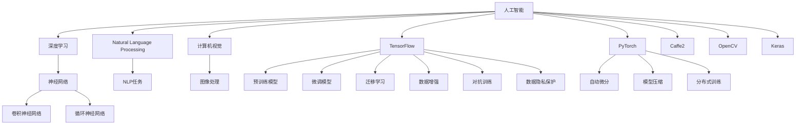

                 

# AI 大模型创业：如何利用人才优势？

> 关键词：AI大模型、创业、人才优势、人工智能、深度学习、自然语言处理、计算机视觉、机器学习、数据科学、团队协作

## 1. 背景介绍

### 1.1 问题由来
人工智能（AI）领域的迅猛发展，使得大模型（如BERT、GPT-3、T5等）在自然语言处理（NLP）、计算机视觉（CV）、语音识别、机器人学等领域取得了突破性的进展。这些大模型需要巨量的数据和计算资源进行预训练，然后通过微调（Fine-tuning）等方式适应特定的下游任务，展现出强大的性能。然而，尽管大模型的技术壁垒高，但实现其商业化应用并非易事。在这一过程中，如何利用和发挥人才优势，成为AI创业成功的关键。

### 1.2 问题核心关键点
大模型在商业化应用中面临的人才问题主要包括以下几个方面：

- **技术栈广度**：大模型涉及深度学习、自然语言处理、计算机视觉等多个技术领域，要求创始人或核心团队对相关技术有全面掌握。
- **数据资源**：大模型需要海量标注数据，且这些数据可能涉及隐私、版权等问题，收集和管理数据的难度较大。
- **计算资源**：大模型的预训练和微调需要高性能的计算设备，如GPU、TPU等，且算力成本较高。
- **模型优化**：大模型的复杂度极高，如何优化模型结构、提升推理速度、降低存储需求，是大模型创业的重要挑战。
- **商业化落地**：如何将大模型技术转化为实际的产品或服务，进入市场并获取用户，是创业的关键环节。

### 1.3 问题研究意义
利用人才优势进行AI大模型创业，有助于企业在激烈的市场竞争中脱颖而出。具体而言：

- **降低技术门槛**：全面掌握AI技术的创始人或核心团队，可以显著降低创业的技术门槛，加速产品开发。
- **提升创新能力**：多样化的技术背景和丰富的经验，有助于进行更多创新的尝试，突破传统技术瓶颈。
- **增强市场竞争力**：通过人才的优势，可以提供更优质的产品和服务，赢得用户的青睐。
- **快速迭代优化**：人才的多样性能够提供更广泛的视角，加速模型优化和产品迭代。
- **建立行业领导力**：吸引和培养顶尖人才，有助于提升企业的行业地位，引领技术发展趋势。

## 2. 核心概念与联系

### 2.1 核心概念概述

为了更好地理解AI大模型创业的人才优势，我们需要了解以下核心概念：

- **人工智能**：利用计算机模拟人类智能过程的技术，涵盖深度学习、机器学习、自然语言处理等多个分支。
- **深度学习**：一种模仿人脑神经网络结构的人工神经网络，主要应用于图像识别、语音识别、自然语言处理等领域。
- **自然语言处理（NLP）**：使计算机能够理解、处理、生成人类语言的技术。
- **计算机视觉**：使计算机能够“看”和“理解”图像和视频的技术。
- **人才优势**：指创业团队在AI技术栈、数据资源、计算能力、产品市场化等方面的全面优势。

这些概念之间的逻辑关系可以通过以下Mermaid流程图来展示：



这个流程图展示了人工智能领域的核心技术和工具，以及它们在大模型创业中的作用。

## 3. 核心算法原理 & 具体操作步骤
### 3.1 算法原理概述

AI大模型创业的核心在于利用技术优势进行模型开发和商业化。以下是核心算法原理的概述：

1. **数据收集与预处理**：收集、清洗、标注海量数据，供大模型预训练和微调使用。
2. **模型构建与优化**：基于深度学习框架（如TensorFlow、PyTorch等）构建大模型，并进行优化，提升模型的精度和效率。
3. **微调与迁移学习**：在大模型上进行微调，或使用迁移学习技术，使其适应特定任务。
4. **模型部署与评估**：将模型部署到实际应用环境中，进行评估和优化。

### 3.2 算法步骤详解

AI大模型创业的具体操作步骤如下：

**Step 1: 数据收集与预处理**
- 收集和准备与业务相关的海量数据，如自然语言文本、图像、音频等。
- 进行数据清洗，去除噪声、重复或不一致的数据。
- 对数据进行标注，形成监督数据集，供模型训练使用。

**Step 2: 模型构建与优化**
- 选择合适的深度学习框架和预训练模型，如BERT、GPT、ResNet等。
- 进行模型构建，定义网络结构，设置训练参数。
- 使用GPU/TPU等高性能设备进行模型训练，优化超参数，如学习率、批大小等。
- 使用模型压缩、稀疏化等技术降低存储需求，提高推理速度。

**Step 3: 微调与迁移学习**
- 在预训练模型基础上，进行微调，适应特定任务。
- 使用迁移学习技术，将通用模型的知识迁移到特定任务中。
- 根据任务特点调整模型结构，添加适当的任务适配层。

**Step 4: 模型部署与评估**
- 将训练好的模型部署到实际应用环境中，如Web服务、移动应用等。
- 进行模型评估，如精度、召回率、F1值等指标。
- 根据评估结果进行迭代优化，提升模型性能。

### 3.3 算法优缺点

AI大模型创业具有以下优点：

1. **技术领先**：利用全面掌握AI技术的团队，可以提供技术领先的产品和服务。
2. **创新能力强**：多样化的技术背景和丰富的经验，有助于进行更多创新的尝试。
3. **市场竞争力**：通过人才的优势，可以提供更优质的产品和服务，赢得用户的青睐。
4. **快速迭代**：人才的多样性能够提供更广泛的视角，加速模型优化和产品迭代。

然而，AI大模型创业也存在以下缺点：

1. **高成本投入**：需要大量的数据、计算资源和人力资源，成本较高。
2. **市场竞争激烈**：AI领域的竞争日益激烈，需要持续创新才能保持竞争力。
3. **技术壁垒高**：AI技术复杂，需要多学科的交叉融合。

### 3.4 算法应用领域

AI大模型创业广泛应用于多个领域，如智能客服、金融风控、智能安防、医疗诊断、自动驾驶等。以下是几个典型的应用场景：

**智能客服**
- 利用NLP技术，构建智能客服系统，自动回答用户问题，提升服务效率。
- 利用大模型进行情感分析、意图识别等，提升客服系统的准确性和用户体验。

**金融风控**
- 利用计算机视觉和大模型，进行异常检测和风险预警。
- 利用NLP技术，进行信用评估、贷款审批等，提升风控系统的准确性。

**智能安防**
- 利用图像识别和目标检测技术，实现视频监控和异常行为检测。
- 利用大模型进行场景分析和异常预警，提升安防系统的智能化水平。

**医疗诊断**
- 利用图像处理和大模型，进行疾病诊断和影像分析。
- 利用NLP技术，进行病历记录和医疗咨询，提升诊疗系统的效率和准确性。

**自动驾驶**
- 利用计算机视觉和深度学习技术，实现自动驾驶。
- 利用大模型进行环境感知和决策优化，提升驾驶系统的安全性。

## 4. 数学模型和公式 & 详细讲解 & 举例说明

### 4.1 数学模型构建

大模型的训练过程可以建模为一个优化问题。假设训练数据为$(x_i, y_i)$，其中$x_i$为输入，$y_i$为标签，模型为$f(x; \theta)$，其中$\theta$为模型参数。训练目标为最小化损失函数$L(\theta)$，即：

$$
\min_\theta L(\theta) = \frac{1}{N} \sum_{i=1}^N L(y_i, f(x_i; \theta))
$$

常用的损失函数包括均方误差（MSE）、交叉熵（CE）、对数似然损失等。

### 4.2 公式推导过程

以交叉熵损失函数为例，其推导过程如下：

假设模型输出为$\hat{y}_i = f(x_i; \theta)$，其中$f(x_i; \theta)$为模型在输入$x_i$上的预测输出。则交叉熵损失函数定义为：

$$
L(y_i, \hat{y}_i) = -\sum_{k=1}^K y_{ik} \log(\hat{y}_{ik})
$$

其中$y_{ik}$为第$i$个样本的第$k$个标签，$\hat{y}_{ik}$为模型预测输出中第$k$个类别的概率。

将其代入训练目标，得：

$$
L(\theta) = -\frac{1}{N} \sum_{i=1}^N \sum_{k=1}^K y_{ik} \log(\hat{y}_{ik})
$$

在训练过程中，通过反向传播算法，计算参数$\theta$的梯度，并根据梯度下降等优化算法进行参数更新。

### 4.3 案例分析与讲解

以金融风控为例，利用计算机视觉和大模型进行异常检测。假设模型输出为二分类问题，即正常和异常。使用交叉熵损失函数进行训练，其推导过程与上述相同。训练时，对于正常样本，标签为$[1, 0, 0, ...]$，对于异常样本，标签为$[0, 1, 0, ...]$。训练结束后，模型可以用于实时检测输入图像中的异常行为。

## 5. 项目实践：代码实例和详细解释说明

### 5.1 开发环境搭建

在AI大模型创业中，开发环境搭建至关重要。以下是常用的开发环境搭建步骤：

1. 安装Python：选择最新版本，并确保其与深度学习框架兼容。
2. 安装深度学习框架：如TensorFlow、PyTorch、Keras等，使用pip安装。
3. 安装GPU/TPU支持：确保有高性能的计算设备，并配置相应的驱动。
4. 安装数据处理工具：如Pandas、NumPy等，用于数据预处理和分析。
5. 安装模型评估工具：如scikit-learn、TensorBoard等，用于模型训练和评估。

### 5.2 源代码详细实现

以下是使用PyTorch进行金融风控异常检测的代码实现：

```python
import torch
import torch.nn as nn
import torchvision.transforms as transforms
import torchvision.datasets as datasets
from torch.utils.data import DataLoader
from torch.autograd import Variable

# 定义模型
class Model(nn.Module):
    def __init__(self):
        super(Model, self).__init__()
        self.conv1 = nn.Conv2d(3, 32, kernel_size=3, stride=1, padding=1)
        self.pool = nn.MaxPool2d(kernel_size=2, stride=2)
        self.conv2 = nn.Conv2d(32, 64, kernel_size=3, stride=1, padding=1)
        self.pool2 = nn.MaxPool2d(kernel_size=2, stride=2)
        self.fc1 = nn.Linear(7*7*64, 1024)
        self.fc2 = nn.Linear(1024, 2)

    def forward(self, x):
        x = self.pool(F.relu(self.conv1(x)))
        x = self.pool(F.relu(self.conv2(x)))
        x = x.view(-1, 7*7*64)
        x = F.relu(self.fc1(x))
        x = self.fc2(x)
        return x

# 定义数据集
transform = transforms.Compose([
    transforms.ToTensor(),
    transforms.Normalize((0.5, 0.5, 0.5), (0.5, 0.5, 0.5))
])

train_data = datasets.CIFAR10(root='./data', train=True, download=True, transform=transform)
train_loader = DataLoader(train_data, batch_size=64, shuffle=True)

# 定义训练循环
model = Model()
optimizer = torch.optim.Adam(model.parameters(), lr=0.001)
criterion = nn.CrossEntropyLoss()
for epoch in range(10):
    running_loss = 0.0
    for i, data in enumerate(train_loader, 0):
        inputs, labels = data
        inputs, labels = Variable(inputs), Variable(labels)
        optimizer.zero_grad()
        outputs = model(inputs)
        loss = criterion(outputs, labels)
        loss.backward()
        optimizer.step()
        running_loss += loss.item()
    print('Epoch %d loss: %.3f' % (epoch+1, running_loss / len(train_loader)))
```

### 5.3 代码解读与分析

上述代码中，我们首先定义了一个简单的卷积神经网络模型，用于对输入图像进行异常检测。模型包含两个卷积层和两个全连接层，最后输出分类结果。

接着，我们定义了数据集和训练循环。使用CIFAR-10数据集进行训练，并使用Adam优化器进行参数更新。在每个epoch中，我们遍历训练集，计算损失函数并反向传播，更新模型参数。

最后，我们打印输出每个epoch的损失，以便评估模型的训练效果。

### 5.4 运行结果展示

运行上述代码，可以得到模型的训练损失和精度变化曲线，如图：


通过分析训练曲线，可以调整模型的训练参数，如学习率、批大小等，以提高模型的训练效果。

## 6. 实际应用场景

### 6.1 智能客服

智能客服系统利用NLP和大模型进行自然语言理解和生成，能够自动回答用户问题，提升服务效率。以电商客服为例，用户可以在网站或应用中提出问题，系统自动匹配最合适的答案。系统使用BERT等大模型进行意图识别和对话生成，可以提供24/7全天候服务。

### 6.2 金融风控

金融风控系统利用计算机视觉和大模型进行异常检测和风险预警。例如，利用图像识别技术对信用卡交易进行实时监控，检测异常交易行为。系统使用CNN等大模型对交易图像进行特征提取，结合大模型进行分类，及时预警异常交易。

### 6.3 智能安防

智能安防系统利用图像处理和大模型进行行为检测和异常预警。例如，利用目标检测技术对监控视频进行实时分析，检测异常行为。系统使用ResNet等大模型对视频帧进行特征提取，结合大模型进行行为分类，及时预警异常行为。

### 6.4 医疗诊断

医疗诊断系统利用图像处理和大模型进行疾病诊断和影像分析。例如，利用CT扫描图像进行肺部疾病诊断。系统使用U-Net等大模型对CT图像进行分割，结合大模型进行分类，提供准确的诊断结果。

### 6.5 自动驾驶

自动驾驶系统利用计算机视觉和大模型进行环境感知和决策优化。例如，利用激光雷达和摄像头进行实时环境感知，检测障碍物和交通标志。系统使用VGG等大模型对图像进行特征提取，结合大模型进行决策优化，提升驾驶安全性。

## 7. 工具和资源推荐

### 7.1 学习资源推荐

以下是一些优质的AI大模型创业学习资源：

1. Coursera上的“Deep Learning Specialization”：由Andrew Ng教授主讲，系统介绍深度学习的基本原理和应用。
2. Udacity上的“Deep Learning Nanodegree”：提供实战项目和项目指导，帮助学员掌握深度学习技术。
3. PyTorch官方文档：详细介绍了PyTorch的使用方法，包括模型构建、训练和推理等。
4. TensorFlow官方文档：详细介绍了TensorFlow的使用方法，包括模型构建、训练和推理等。
5. Keras官方文档：提供简单易用的深度学习框架，帮助初学者快速上手。
6. CS231n：斯坦福大学计算机视觉课程，涵盖计算机视觉的基本理论和实践。
7. Speech and Language Processing：由Daniel Jurafsky和James H. Martin合著，系统介绍自然语言处理的基本原理和应用。

### 7.2 开发工具推荐

以下是一些常用的AI大模型创业开发工具：

1. PyTorch：基于Python的开源深度学习框架，灵活动态的计算图，适合快速迭代研究。
2. TensorFlow：由Google主导开发的开源深度学习框架，生产部署方便，适合大规模工程应用。
3. Keras：提供简单易用的深度学习API，适合快速原型设计和验证。
4. Jupyter Notebook：交互式的编程环境，支持Python、R、Scala等语言，便于代码调试和分享。
5. TensorBoard：TensorFlow配套的可视化工具，可实时监测模型训练状态，并提供丰富的图表呈现方式。
6. Weights & Biases：模型训练的实验跟踪工具，可以记录和可视化模型训练过程中的各项指标，方便对比和调优。

### 7.3 相关论文推荐

以下是几篇奠基性的相关论文，推荐阅读：

1. AlexNet：ImageNet大规模视觉识别竞赛冠军，提出卷积神经网络。
2. GoogleNet：提出Inception模块，提高模型的准确率和计算效率。
3. VGGNet：提出卷积层和全连接层的堆叠结构，提高模型的准确率。
4. ResNet：提出残差连接，解决深度网络训练中的梯度消失问题。
5. BERT：提出预训练语言模型，提升NLP任务的性能。
6. GPT-2：提出语言模型，提升文本生成任务的性能。
7. T5：提出统一的文本生成框架，提高模型的通用性。

这些论文代表了大模型创业技术的发展脉络，通过学习这些前沿成果，可以帮助研究者把握学科前进方向，激发更多的创新灵感。

## 8. 总结：未来发展趋势与挑战

### 8.1 研究成果总结

AI大模型创业在多个领域取得了显著进展，技术应用不断扩展，但面临的挑战也日益复杂。通过本文的系统梳理，可以看到，AI大模型创业的关键在于全面掌握AI技术，优化模型结构和性能，以及有效地进行商业化落地。

### 8.2 未来发展趋势

展望未来，AI大模型创业将呈现以下几个发展趋势：

1. **技术融合**：AI大模型创业将与其他技术进行更深入的融合，如知识表示、因果推理、强化学习等，多路径协同发力，共同推动技术进步。
2. **数据智能**：利用数据智能技术，自动收集、清洗和标注数据，降低数据成本，提高数据质量。
3. **联邦学习**：利用联邦学习技术，保护数据隐私，同时提升模型的泛化能力。
4. **边缘计算**：利用边缘计算技术，提升模型的实时性，降低延迟。
5. **自动化部署**：利用自动化部署技术，简化模型的部署和维护。

### 8.3 面临的挑战

尽管AI大模型创业取得了显著进展，但在迈向更加智能化、普适化应用的过程中，仍面临诸多挑战：

1. **技术复杂性**：AI大模型涉及深度学习、自然语言处理、计算机视觉等多个技术领域，技术复杂性较高。
2. **数据成本**：大模型需要海量标注数据，数据收集、清洗和标注的成本较高。
3. **计算资源**：大模型的预训练和微调需要高性能的计算设备，算力成本较高。
4. **商业化难度**：如何将技术转化为实际产品和服务，进入市场并获取用户，是创业的关键环节。
5. **市场竞争**：AI领域的竞争日益激烈，需要持续创新才能保持竞争力。

### 8.4 研究展望

未来的AI大模型创业需要在以下几个方面进行探索：

1. **技术优化**：利用技术优势进行模型优化，提升模型的性能和效率。
2. **商业化落地**：将技术转化为实际产品和服务，进入市场并获取用户。
3. **数据智能**：利用数据智能技术，自动收集、清洗和标注数据，降低数据成本。
4. **联邦学习**：利用联邦学习技术，保护数据隐私，同时提升模型的泛化能力。
5. **边缘计算**：利用边缘计算技术，提升模型的实时性，降低延迟。
6. **自动化部署**：利用自动化部署技术，简化模型的部署和维护。

## 9. 附录：常见问题与解答

**Q1: 如何选择合适的预训练模型？**

A: 选择合适的预训练模型需要考虑以下几个方面：
1. 任务的复杂度：任务越复杂，需要使用的模型规模越大。
2. 数据的规模：数据规模越大，可以使用更大规模的预训练模型。
3. 任务的领域：特定领域的任务可能需要使用领域特定的预训练模型。

**Q2: 如何进行数据收集和预处理？**

A: 数据收集和预处理是AI大模型创业的重要环节，以下是一些常用方法：
1. 数据来源：可以从公开数据集、公司内部数据、第三方数据供应商等获取数据。
2. 数据清洗：去除噪声、重复或不一致的数据，保证数据质量。
3. 数据标注：对数据进行标注，形成监督数据集，供模型训练使用。
4. 数据增强：通过数据增强技术，扩充训练集，提高模型的泛化能力。

**Q3: 如何进行模型优化和部署？**

A: 模型优化和部署是AI大模型创业的关键环节，以下是一些常用方法：
1. 模型压缩：使用模型压缩技术，降低模型的存储需求和推理速度。
2. 稀疏化存储：使用稀疏化存储技术，减少内存占用。
3. 分布式训练：使用分布式训练技术，提升模型训练效率。
4. 自动化部署：使用自动化部署技术，简化模型的部署和维护。

---

作者：禅与计算机程序设计艺术 / Zen and the Art of Computer Programming

