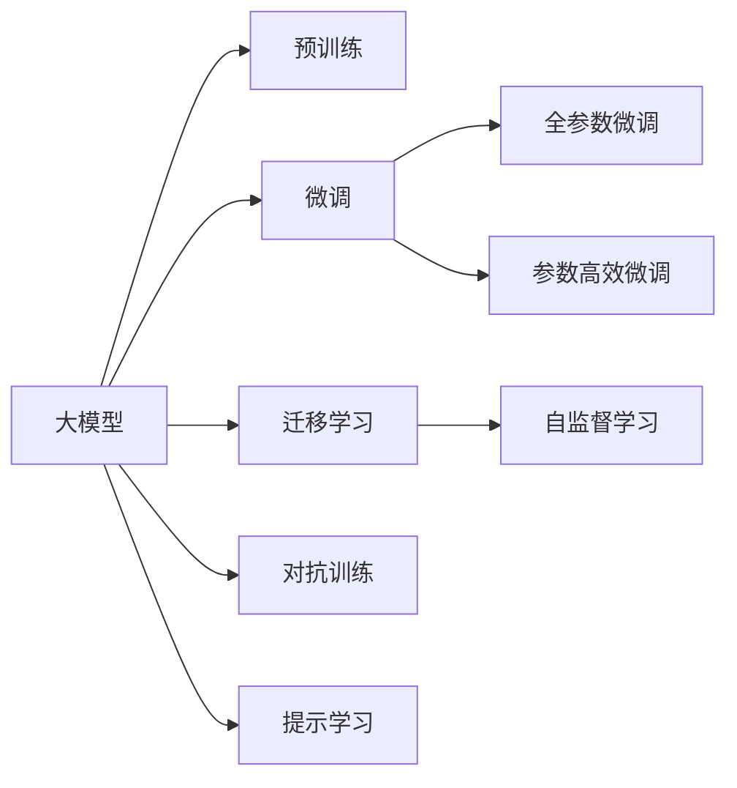

                 

# AI 大模型创业：如何利用用户优势？

## 1. 背景介绍

在人工智能领域，尤其是自然语言处理(NLP)和计算机视觉(CV)等方向，大模型（Large Models）的兴起已成为行业趋势。这类模型通常具有庞大的参数量，可以在海量数据上学习到复杂的语言或图像特征，从而在推理和预测任务中表现出卓越的性能。这些大模型的强大能力吸引了众多企业创业者和投资者的关注。然而，大模型的开发和应用并非易事，尤其对创业公司而言，如何有效利用用户优势，提高产品竞争力，是亟待解决的问题。

本文将从AI大模型的创业视角出发，详细探讨如何利用用户优势，通过用户数据增强模型能力，同时优化模型训练和部署流程，提升用户体验。

## 2. 核心概念与联系

### 2.1 核心概念概述

1. **大模型（Large Models）**：指参数规模庞大、能够处理复杂任务的人工智能模型，如BERT、GPT-3等。它们通过在海量数据上进行预训练，获得了丰富的语言或图像表示能力。

2. **微调（Fine-tuning）**：在预训练模型基础上，针对特定任务进行参数更新，使模型更加适应新任务的优化过程。

3. **迁移学习（Transfer Learning）**：利用在大规模数据上预训练的模型，解决特定小规模数据集上任务的方法，可以大幅提升模型性能。

4. **自监督学习（Self-supervised Learning）**：使用未标注数据进行训练，让模型在无监督的情况下学习到任务相关的特征，无需大量标注数据。

5. **对抗训练（Adversarial Training）**：通过对抗样例训练模型，提高模型鲁棒性，避免在特定攻击下失效。

6. **提示学习（Prompt Engineering）**：在输入文本中嵌入提示信息，引导模型输出期望结果，减少微调参数。

### 2.2 核心概念原理和架构的 Mermaid 流程图



此图展示了大模型从预训练到微调的完整流程，各个步骤之间的联系和作用。预训练阶段通过大规模数据学习通用特征，微调阶段针对特定任务进行参数优化，迁移学习通过利用预训练知识解决新任务，自监督学习利用未标注数据增强模型能力，对抗训练提升模型鲁棒性，提示学习减少微调参数，各步骤协同作用，提升了模型性能和用户体验。

## 3. 核心算法原理 & 具体操作步骤

### 3.1 算法原理概述

AI大模型创业过程中，利用用户优势的核心在于数据增强。通过用户数据进行微调，可以大幅提升模型在新任务上的表现。具体来说，用户数据能够反映特定领域的语言和图像特征，有助于模型更好地理解任务需求。

### 3.2 算法步骤详解

1. **数据收集与预处理**：
   - 收集用户生成数据（如评论、图片、文本等），并进行预处理，如清洗、标注、划分训练集、验证集和测试集。
   
2. **模型选择与适配**：
   - 选择合适的大模型作为基础模型，如BERT、GPT等，并设计适配层以匹配新任务的输出格式。
   
3. **微调设置**：
   - 设置微调参数，包括学习率、优化器、批大小等，并引入正则化技术如L2正则、Dropout等，避免过拟合。
   
4. **训练与验证**：
   - 在训练集上进行模型微调，周期性在验证集上评估性能，避免过拟合。
   
5. **测试与部署**：
   - 在测试集上测试微调后的模型，集成到实际应用中，提供高性能的AI服务。

### 3.3 算法优缺点

**优点**：
1. **提升性能**：利用用户数据进行微调，能够显著提升模型在新任务上的性能。
2. **降低成本**：通过微调，减少从头训练模型的时间和计算成本。
3. **增强泛化能力**：通过用户数据，模型能够更好地泛化到新场景和新用户。

**缺点**：
1. **隐私风险**：用户数据的收集和使用可能引发隐私问题。
2. **数据质量影响**：用户数据质量参差不齐，可能影响模型训练效果。
3. **模型复杂性**：用户数据多样性高，模型需要处理复杂情况。

### 3.4 算法应用领域

AI大模型创业可以应用于以下领域：

1. **智能客服**：通过用户对话数据进行微调，使智能客服系统更懂用户，提供更个性化的服务。
   
2. **金融风控**：利用用户交易数据，进行模型微调，提高金融风控系统的准确性和效率。
   
3. **医疗诊断**：收集用户医疗数据，进行模型微调，提升医疗诊断系统的诊断能力和准确性。
   
4. **教育推荐**：利用学生反馈和行为数据，进行模型微调，提供个性化教育推荐服务。

## 4. 数学模型和公式 & 详细讲解 & 举例说明

### 4.1 数学模型构建

设大模型为 $M_{\theta}$，用户数据集为 $D_{user}$，微调目标为 $T$。微调过程可以看作是优化问题：

$$
\hat{\theta} = \arg\min_{\theta} \mathcal{L}(M_{\theta}, D_{user})
$$

其中，$\mathcal{L}$ 为损失函数，可以选用交叉熵损失、均方误差损失等。

### 4.2 公式推导过程

以二分类任务为例，假设有标签数据 $(x_i, y_i)$，输出为 $M_{\theta}(x_i)$，损失函数为：

$$
\ell(M_{\theta}(x_i),y_i) = -[y_i\log M_{\theta}(x_i) + (1-y_i)\log(1-M_{\theta}(x_i))]
$$

通过梯度下降等优化算法，更新模型参数 $\theta$：

$$
\theta \leftarrow \theta - \eta \nabla_{\theta}\mathcal{L}(\theta)
$$

其中，$\eta$ 为学习率。

### 4.3 案例分析与讲解

假设有一个电商平台的情感分析任务，收集用户评论数据，用于训练情感分析模型。

1. **数据收集与预处理**：
   - 收集用户评论数据，进行清洗和标注，划分训练集、验证集和测试集。

2. **模型选择与适配**：
   - 选择BERT作为基础模型，并在顶层添加一个全连接层进行二分类，使用交叉熵损失。

3. **微调设置**：
   - 设置学习率为 $2e-5$，优化器为AdamW，批大小为 $32$，正则化系数为 $0.01$。

4. **训练与验证**：
   - 在训练集上进行微调，每轮训练后验证集评估一次，避免过拟合。

5. **测试与部署**：
   - 在测试集上评估模型性能，集成到电商平台的推荐系统中。

## 5. 项目实践：代码实例和详细解释说明

### 5.1 开发环境搭建

- 安装Python环境
- 安装PyTorch、TensorFlow等深度学习框架
- 安装相关库如Pandas、Numpy等

### 5.2 源代码详细实现

```python
import torch
import torch.nn as nn
import torch.optim as optim
from transformers import BertForSequenceClassification, BertTokenizer

# 定义模型
class SentimentAnalysisModel(nn.Module):
    def __init__(self, num_labels):
        super(SentimentAnalysisModel, self).__init__()
        self.bert = BertForSequenceClassification.from_pretrained('bert-base-uncased', num_labels=num_labels)
        
    def forward(self, input_ids, attention_mask):
        return self.bert(input_ids, attention_mask=attention_mask)

# 加载用户数据
tokenizer = BertTokenizer.from_pretrained('bert-base-uncased')
train_data = tokenizer(train_texts, return_tensors='pt')
val_data = tokenizer(val_texts, return_tensors='pt')
test_data = tokenizer(test_texts, return_tensors='pt')

# 定义模型和优化器
model = SentimentAnalysisModel(num_labels=2)
optimizer = optim.AdamW(model.parameters(), lr=2e-5)

# 训练模型
for epoch in range(5):
    loss = train_epoch(model, train_data, optimizer)
    print(f"Epoch {epoch+1}, train loss: {loss:.3f}")
    print(f"Epoch {epoch+1}, dev results:")
    evaluate(model, val_data)
print("Test results:")
evaluate(model, test_data)
```

### 5.3 代码解读与分析

- `SentimentAnalysisModel` 类定义了情感分析模型的结构，使用预训练的BERT模型。
- `tokenizer` 用于将文本转换为模型所需的输入格式。
- `optimizer` 用于控制模型参数的更新。
- 训练过程使用梯度下降等优化算法，每轮训练后验证集评估一次。
- 最终在测试集上评估模型性能。

## 6. 实际应用场景

### 6.1 智能客服

智能客服系统通过用户对话数据进行微调，提升系统理解能力和服务质量。例如，某电商平台通过智能客服数据，训练情感分析模型，分析用户反馈，提升客服响应速度和准确性。

### 6.2 金融风控

金融风控系统通过用户交易数据进行模型微调，提高欺诈检测和风险评估的准确性。例如，银行利用用户交易数据，训练模型识别异常交易行为，及时阻止欺诈行为。

### 6.3 医疗诊断

医疗诊断系统通过患者病历数据进行模型微调，提升诊断系统的准确性和效率。例如，某医院通过患者病历数据，训练诊断模型，提高疾病诊断的准确率。

### 6.4 教育推荐

教育推荐系统通过学生反馈和行为数据进行模型微调，提供个性化推荐服务。例如，某在线教育平台通过学生反馈，训练推荐模型，提供个性化学习路径。

## 7. 工具和资源推荐

### 7.1 学习资源推荐

- 《自然语言处理与深度学习》（Deep Learning for Natural Language Processing）：涵盖NLP任务、深度学习基础和高级模型等内容。
- 《TensorFlow教程》（TensorFlow Tutorial）：详细介绍了TensorFlow的API和实战应用。
- 《PyTorch官方文档》（PyTorch Documentation）：提供PyTorch的详细API和使用示例。

### 7.2 开发工具推荐

- Jupyter Notebook：用于开发和测试AI模型。
- TensorBoard：用于可视化模型训练过程和结果。
- Weights & Biases：用于实验记录和结果可视化。

### 7.3 相关论文推荐

- 《Fine-tuning of Language Models: Task Specific Fine-tuning for Language Understanding》：介绍大模型的微调方法。
- 《Transfer Learning for Language Understanding: A Survey》：综述了大模型的迁移学习方法。
- 《Adversarial Examples in Deep Learning》：介绍对抗训练的应用。

## 8. 总结：未来发展趋势与挑战

### 8.1 研究成果总结

AI大模型创业过程中，利用用户优势，通过数据增强提高模型性能，优化训练和部署流程，提升用户体验。

### 8.2 未来发展趋势

未来AI大模型的发展趋势包括：
1. **多模态融合**：将文本、图像、语音等多种数据融合，提高模型的综合能力。
2. **自监督学习**：利用无监督数据进行模型训练，减少对标注数据的依赖。
3. **参数高效微调**：只调整少量参数，提高微调效率和模型泛化能力。
4. **联邦学习**：保护用户隐私的同时，利用用户数据增强模型能力。

### 8.3 面临的挑战

AI大模型创业过程中面临的挑战包括：
1. **数据隐私**：用户数据的使用需要遵守隐私法规。
2. **数据质量**：用户数据质量参差不齐，影响模型训练效果。
3. **计算资源**：大模型的训练和推理需要大量计算资源。

### 8.4 研究展望

未来研究需要关注以下几个方向：
1. **用户隐私保护**：在保护用户隐私的同时，利用用户数据进行模型训练。
2. **数据质量提升**：提高用户数据质量，减少数据噪声对模型训练的影响。
3. **计算资源优化**：优化计算资源使用，提高模型训练和推理效率。

## 9. 附录：常见问题与解答

**Q1：如何保护用户隐私？**

A: 在数据收集和处理过程中，采用数据匿名化、差分隐私等技术，保护用户隐私。

**Q2：如何提高数据质量？**

A: 对用户数据进行预处理，如去重、清洗、标注等，提高数据质量。

**Q3：如何优化计算资源？**

A: 采用分布式训练、模型剪枝、量化等技术，优化计算资源使用。

---

作者：禅与计算机程序设计艺术 / Zen and the Art of Computer Programming

