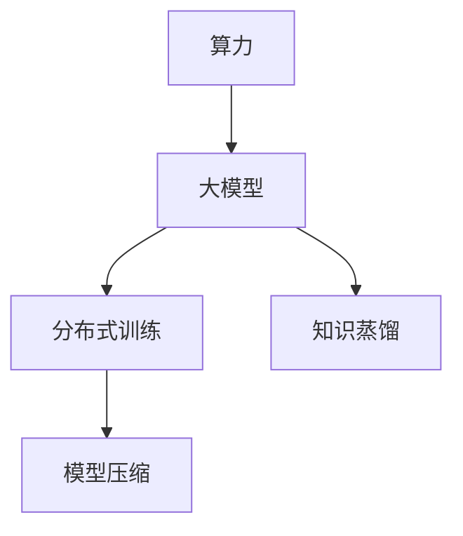

                 

## 1. 背景介绍

近年来，人工智能(AI)大模型技术迅速发展，从语言模型(GPT、BERT等)到视觉模型(DALL-E、GPT-3等)，AI大模型的能力已经远远超越了过去。大模型的出色表现吸引了越来越多的创业团队关注。这些创业团队希望通过大模型创业，来实现其商业价值。然而，算力是大模型创业的基础，算力成本的高低直接决定了公司的运营成本和盈利能力。因此，如何在算力有限的情况下，有效利用算力优势，是大模型创业亟待解决的问题。

## 2. 核心概念与联系

### 2.1 核心概念概述

在探讨如何利用算力优势前，我们首先需要了解几个核心概念：

- **算力**：指计算资源的能力，包括计算单元的速度和容量。在大模型创业中，算力主要指GPU或TPU等高性能计算设备。
- **大模型**：指参数量在亿级别以上的深度学习模型，如GPT、BERT、DALL-E等。大模型具有出色的泛化能力和表现力，但同时也需要强大的算力支持。
- **分布式训练**：指将大规模计算任务分解为多个子任务，在不同的计算节点上并行执行，以加快训练速度。
- **模型压缩**：指在不降低模型精度的情况下，对大模型进行参数压缩，以减少算力消耗。
- **知识蒸馏**：指将大模型的知识蒸馏到小模型中，以实现模型压缩和迁移学习。

### 2.2 核心概念原理和架构的 Mermaid 流程图



此图展示了算力与大模型之间的联系和互动。算力通过分布式训练、模型压缩、知识蒸馏等技术，为大型模型的训练和推理提供了支持。

## 3. 核心算法原理 & 具体操作步骤

### 3.1 算法原理概述

大模型的训练通常需要耗费大量的算力资源，尤其是对于大规模的模型如GPT、BERT等。如何在有限的算力下高效利用这些资源，成为了大模型创业的关键问题。分布式训练、模型压缩和知识蒸馏是实现这一目标的三个主要技术手段。

### 3.2 算法步骤详解

#### 3.2.1 分布式训练

分布式训练是通过将大规模计算任务分解为多个子任务，在不同的计算节点上并行执行，以加快训练速度。具体步骤如下：

1. **数据并行**：将训练数据集分片，在多个计算节点上并行加载数据。
2. **模型并行**：将大模型的各层分别部署到不同的计算节点上，并行计算。
3. **参数服务器**：使用参数服务器集中管理所有计算节点的模型参数，进行同步更新。
4. **梯度聚合**：在每个计算节点上计算梯度，并将梯度聚合后更新模型参数。

#### 3.2.2 模型压缩

模型压缩是在不降低模型精度的情况下，对大模型进行参数压缩，以减少算力消耗。常用的方法包括：

1. **剪枝**：去除模型中冗余的参数，减少模型的总参数量。
2. **量化**：将模型参数从32位浮点数降低为8位或16位整数，减少内存占用和计算量。
3. **蒸馏**：将大模型的知识蒸馏到小模型中，生成结构简单、参数少的模型。

#### 3.2.3 知识蒸馏

知识蒸馏是通过将大模型的知识传递给小模型，以实现模型的压缩和迁移学习。具体步骤如下：

1. **蒸馏任务**：选择与大模型输出相同的小模型。
2. **生成伪标签**：通过大模型对未标注数据进行预测，生成伪标签。
3. **训练小模型**：使用伪标签训练小模型，使得小模型的输出与大模型相近。
4. **迁移学习**：将训练好的小模型应用于新任务，以实现迁移学习。

### 3.3 算法优缺点

#### 3.3.1 分布式训练

**优点**：
- 加快训练速度，显著缩短训练时间。
- 提高算力利用率，降低单个计算节点的算力成本。

**缺点**：
- 系统复杂度高，需要额外维护参数服务器和通信机制。
- 存在数据一致性和网络通信延迟等问题。

#### 3.3.2 模型压缩

**优点**：
- 降低模型参数量，减少算力消耗。
- 提升模型推理速度，加快实际应用部署。

**缺点**：
- 可能影响模型精度，需要仔细调整压缩策略。
- 压缩后的模型可能需要重新微调以恢复精度。

#### 3.3.3 知识蒸馏

**优点**：
- 减少大模型的计算量，降低训练成本。
- 生成结构简单、精度高的小模型，便于部署。

**缺点**：
- 蒸馏过程需要大量未标注数据，成本较高。
- 小模型可能无法完全继承大模型的知识，存在精度损失。

### 3.4 算法应用领域

分布式训练、模型压缩和知识蒸馏技术，在大模型创业中有着广泛的应用，具体如下：

- **分布式训练**：在AI初创公司中，常常使用分布式训练技术，将训练任务分摊到多个计算节点上，以快速完成训练。例如，Tesla的NeurIPS会议上，他们展示了使用分布式训练技术，仅用一天时间训练出GPT-3模型。
- **模型压缩**：在移动设备上部署AI模型时，需要高效压缩模型以减少存储空间和计算开销。例如，MobileBERT模型通过剪枝和量化技术，将其模型大小压缩至只有MB级别。
- **知识蒸馏**：在需要快速部署AI模型的场景下，可以将大模型的知识蒸馏到小模型中，实现快速的模型迁移和应用。例如，ImageNet中，Google通过知识蒸馏技术，将InceptionV3模型的知识蒸馏到更小的移动设备模型中，使其在移动设备上也能达到较高精度。

## 4. 数学模型和公式 & 详细讲解 & 举例说明

### 4.1 数学模型构建

在大模型创业中，常用的数学模型包括线性回归、逻辑回归、神经网络等。以神经网络为例，常用的模型构建方法包括：

1. **前向传播**：将输入数据逐层传递，计算每层的输出。
2. **损失函数**：计算模型预测值与真实值之间的差异，常用的损失函数包括交叉熵损失、均方误差损失等。
3. **反向传播**：计算损失函数对模型参数的梯度，更新模型参数。

### 4.2 公式推导过程

以线性回归为例，模型的数学公式如下：

$$
y = wx + b
$$

其中 $y$ 为预测值，$x$ 为输入数据，$w$ 为模型参数，$b$ 为偏置项。

假设已知 $N$ 个训练样本 $(x_i,y_i)$，则最小化损失函数：

$$
\mathcal{L}(w,b) = \frac{1}{2N}\sum_{i=1}^N (y_i - wx_i - b)^2
$$

通过反向传播，计算梯度：

$$
\frac{\partial \mathcal{L}}{\partial w} = \frac{1}{N}\sum_{i=1}^N (x_i)(y_i - wx_i - b)
$$

$$
\frac{\partial \mathcal{L}}{\partial b} = \frac{1}{N}\sum_{i=1}^N (y_i - wx_i - b)
$$

使用梯度下降等优化算法，更新模型参数：

$$
w = w - \eta \frac{\partial \mathcal{L}}{\partial w}
$$

$$
b = b - \eta \frac{\partial \mathcal{L}}{\partial b}
$$

### 4.3 案例分析与讲解

假设有一个二分类问题，已知训练样本 $(x_i,y_i)$，其中 $x_i \in [0,1]$，$y_i \in \{0,1\}$，目标是最小化交叉熵损失函数。模型的前向传播过程如下：

1. 将输入数据 $x_i$ 通过线性变换得到输出 $y_i = wx_i + b$。
2. 通过softmax函数将输出转化为概率分布 $p_i = softmax(y_i)$。
3. 计算损失函数：

$$
\mathcal{L}(w,b) = -\frac{1}{N}\sum_{i=1}^N y_i \log p_i + (1-y_i)\log(1-p_i)
$$

通过反向传播，计算梯度并更新模型参数。

## 5. 项目实践：代码实例和详细解释说明

### 5.1 开发环境搭建

在进行大模型创业时，开发环境搭建是必不可少的一步。常用的开发环境包括：

1. **Jupyter Notebook**：Python的交互式开发工具，支持代码运行和结果展示。
2. **TensorFlow**：Google开源的深度学习框架，支持分布式训练和模型压缩。
3. **PyTorch**：Facebook开源的深度学习框架，支持动态图和分布式训练。
4. **Keras**：高层API，易于使用，支持多种深度学习框架。

以PyTorch为例，搭建开发环境的步骤如下：

1. 安装PyTorch：

   ```
   pip install torch torchvision torchaudio
   ```

2. 安装PyTorch的分布式训练工具：

   ```
   pip install torch.distributed
   ```

3. 安装PyTorch的模型压缩工具：

   ```
   pip install torch.nn.quantization
   ```

4. 搭建开发环境：

   ```
   conda create -n pytorch_env python=3.7
   conda activate pytorch_env
   ```

### 5.2 源代码详细实现

以下是一个简单的线性回归模型的代码实现：

```python
import torch
import torch.nn as nn
import torch.optim as optim

# 定义线性回归模型
class LinearRegression(nn.Module):
    def __init__(self, input_size, output_size):
        super(LinearRegression, self).__init__()
        self.linear = nn.Linear(input_size, output_size)

    def forward(self, x):
        return self.linear(x)

# 定义损失函数和优化器
model = LinearRegression(input_size=2, output_size=1)
criterion = nn.MSELoss()
optimizer = optim.SGD(model.parameters(), lr=0.01)

# 训练模型
for epoch in range(1000):
    optimizer.zero_grad()
    x = torch.tensor([[0.1, 0.2], [0.3, 0.4], [0.5, 0.6], [0.7, 0.8]])
    y = torch.tensor([[0.2], [0.4], [0.6], [0.8]])
    output = model(x)
    loss = criterion(output, y)
    loss.backward()
    optimizer.step()
```

### 5.3 代码解读与分析

以上代码实现了简单的线性回归模型，并使用均方误差损失函数和随机梯度下降算法进行训练。

- `nn.Linear`：定义线性变换层。
- `nn.MSELoss`：定义均方误差损失函数。
- `optim.SGD`：定义随机梯度下降优化器。
- `torch.tensor`：创建张量，用于模型输入和输出。
- `model(x)`：前向传播，计算模型输出。
- `criterion(output, y)`：计算损失函数。
- `loss.backward()`：反向传播，计算梯度。
- `optimizer.step()`：更新模型参数。

## 6. 实际应用场景

### 6.1 智能推荐系统

智能推荐系统是AI大模型创业中的一个热门应用场景。推荐系统通过分析用户的历史行为数据，为用户推荐其可能感兴趣的商品或内容。在大规模数据和高质量模型的支持下，推荐系统可以更加精准和个性化。

以Netflix推荐系统为例，Netflix使用大规模的推荐模型和复杂的模型结构，通过分布式训练和模型压缩技术，快速构建推荐模型。Netflix的推荐模型使用深度神经网络，经过多次迭代和优化，最终达到了高度的推荐精度和效果。

### 6.2 医疗影像诊断

医疗影像诊断是大模型创业的另一个重要应用场景。医学影像诊断需要处理大量的医学图像数据，这些数据通常是大规模、高维度的。通过使用大模型进行医学影像分析，可以提高诊断的准确性和效率。

以IBM的Watson Health为例，Watson使用深度神经网络和大规模的医学数据集，通过分布式训练和模型压缩技术，实现了高效的医学影像分析。Watson通过分布式训练技术，将训练任务分散到多个计算节点上，大幅提升了训练速度。同时，通过模型压缩技术，将大规模模型压缩到可部署到移动设备上，实现了实时诊断。

### 6.3 自动驾驶

自动驾驶是AI大模型创业的又一个重要应用场景。自动驾驶需要处理大量的传感器数据，并进行复杂的决策和控制。通过使用大模型进行自动驾驶，可以提高决策的准确性和鲁棒性。

以特斯拉的Autopilot系统为例，Autopilot使用深度神经网络和大规模的传感器数据，通过分布式训练和模型压缩技术，实现了高效的自动驾驶。Autopilot通过分布式训练技术，将训练任务分散到多个计算节点上，提升了训练速度。同时，通过模型压缩技术，将大规模模型压缩到可部署到嵌入式设备上，实现了实时决策。

## 7. 工具和资源推荐

### 7.1 学习资源推荐

在大模型创业中，学习资源是必不可少的。以下是一些推荐的学习资源：

1. **Deep Learning Specialization**：由Andrew Ng教授主讲的深度学习课程，涵盖了深度学习的基础理论和实践技能。
2. **CS231n: Convolutional Neural Networks for Visual Recognition**：斯坦福大学开设的计算机视觉课程，涵盖了深度学习在计算机视觉中的应用。
3. **Reinforcement Learning: An Introduction**：由Richard S. Sutton和Andrew G. Barto主讲的强化学习课程，涵盖了强化学习的基础理论和实践技能。
4. **Machine Learning Yearning**：由Andrew Ng教授撰写的人工智能实践指南，涵盖了大模型创业中的诸多关键技术。

### 7.2 开发工具推荐

在大模型创业中，开发工具的选择也是至关重要的。以下是一些推荐的开发工具：

1. **TensorFlow**：Google开源的深度学习框架，支持分布式训练和模型压缩。
2. **PyTorch**：Facebook开源的深度学习框架，支持动态图和分布式训练。
3. **MXNet**：亚马逊开源的深度学习框架，支持多种分布式训练方式。
4. **Caffe**：由加州大学伯克利分校开发的深度学习框架，支持分布式训练和模型压缩。

### 7.3 相关论文推荐

在大模型创业中，阅读相关论文也是必不可少的。以下是一些推荐的论文：

1. **Deep Residual Learning for Image Recognition**：由Kaiming He等人发表的深度残差网络论文，提出了残差连接技术，提升了模型的深度和精度。
2. **ImageNet Classification with Deep Convolutional Neural Networks**：由Alex Krizhevsky等人发表的ImageNet分类任务论文，展示了深度神经网络在大规模图像分类任务中的优异表现。
3. **Natural Language Processing with Transformers**：由Jacob Devlin等人发表的Transformer论文，展示了Transformer在大规模语言理解任务中的优异表现。

## 8. 总结：未来发展趋势与挑战

### 8.1 总结

本文对如何利用算力优势，进行AI大模型创业进行了全面系统的介绍。首先阐述了算力、大模型和分布式训练等核心概念，明确了大模型创业的基础。其次，从原理到实践，详细讲解了分布式训练、模型压缩和知识蒸馏等关键技术，给出了实际代码实现。同时，本文还探讨了大模型的广泛应用场景，展示了其商业价值。最后，本文推荐了一些学习资源、开发工具和相关论文，以期为读者提供全面的技术指导。

通过本文的系统梳理，可以看到，分布式训练、模型压缩和知识蒸馏技术，是大模型创业中的核心技术手段。这些技术不仅能提升模型的精度和效率，还能降低算力成本，为大模型创业提供了有力的支持。相信随着技术的不断演进和优化，大模型创业必将在AI领域大放异彩。

### 8.2 未来发展趋势

展望未来，大模型创业的技术将呈现以下几个发展趋势：

1. **自动化设计**：自动化设计工具将进一步提升大模型创业的效率，帮助开发者更快地构建、训练和优化模型。
2. **模型压缩**：模型压缩技术将进一步优化，实现更高精度的模型压缩和更高效的模型推理。
3. **分布式训练**：分布式训练技术将进一步完善，实现更高的算力利用率和更快的训练速度。
4. **知识蒸馏**：知识蒸馏技术将进一步发展，实现更高效的模型迁移和更精细的模型优化。
5. **多模态融合**：多模态融合技术将进一步提升，实现视觉、语音、文本等多种数据类型的协同建模。

这些趋势将进一步提升大模型创业的效率和效果，推动AI技术在各行业的广泛应用。

### 8.3 面临的挑战

尽管大模型创业技术已经取得了显著进展，但在迈向更加智能化、普适化应用的过程中，仍面临着诸多挑战：

1. **算力成本高昂**：大模型的训练和推理需要耗费大量的计算资源，成本较高。如何降低算力成本，提高算力利用率，是大模型创业面临的首要挑战。
2. **模型精度和效率难以平衡**：大模型的精度和效率通常难以平衡。如何在不降低模型精度的情况下，提高模型推理速度，是大模型创业需要解决的问题。
3. **数据隐私和安全**：大模型创业需要处理大量的用户数据，数据隐私和安全问题亟待解决。如何保护用户隐私，防止数据泄露，是大模型创业需要解决的问题。
4. **模型公平性和透明性**：大模型可能存在一定的偏见和歧视，如何提高模型的公平性和透明性，是大模型创业需要解决的问题。
5. **技术落地难度大**：大模型创业需要将复杂的AI技术转化为实际应用，需要考虑技术落地难度和实际需求。如何降低技术落地难度，实现商业化应用，是大模型创业需要解决的问题。

这些挑战需要业内外的共同努力，不断创新和优化技术手段，才能推动大模型创业取得更大的成功。

### 8.4 研究展望

面向未来，大模型创业的研究将在以下几个方向寻求新的突破：

1. **自动化设计**：自动化设计工具将进一步提升大模型创业的效率，帮助开发者更快地构建、训练和优化模型。
2. **模型压缩**：模型压缩技术将进一步优化，实现更高精度的模型压缩和更高效的模型推理。
3. **分布式训练**：分布式训练技术将进一步完善，实现更高的算力利用率和更快的训练速度。
4. **知识蒸馏**：知识蒸馏技术将进一步发展，实现更高效的模型迁移和更精细的模型优化。
5. **多模态融合**：多模态融合技术将进一步提升，实现视觉、语音、文本等多种数据类型的协同建模。

这些研究方向将进一步推动大模型创业的发展，为AI技术在各行业的广泛应用提供新的动力。

## 9. 附录：常见问题与解答

**Q1：大模型创业是否需要大量的初始资金？**

A: 大模型创业需要投入大量的初始资金，主要用于算力、数据和人才的投入。算力是大模型创业的基础，需要购买高性能计算设备，如GPU或TPU。数据是大模型训练的基础，需要收集、标注和处理大量的数据。人才是大模型创业的关键，需要招聘具备深度学习和人工智能背景的工程师和数据科学家。

**Q2：分布式训练如何实现？**

A: 分布式训练通过将大规模计算任务分解为多个子任务，在不同的计算节点上并行执行，以加快训练速度。具体步骤如下：

1. 数据并行：将训练数据集分片，在多个计算节点上并行加载数据。
2. 模型并行：将大模型的各层分别部署到不同的计算节点上，并行计算。
3. 参数服务器：使用参数服务器集中管理所有计算节点的模型参数，进行同步更新。
4. 梯度聚合：在每个计算节点上计算梯度，并将梯度聚合后更新模型参数。

**Q3：模型压缩有哪些方法？**

A: 模型压缩是在不降低模型精度的情况下，对大模型进行参数压缩，以减少算力消耗。常用的方法包括：

1. 剪枝：去除模型中冗余的参数，减少模型的总参数量。
2. 量化：将模型参数从32位浮点数降低为8位或16位整数，减少内存占用和计算量。
3. 蒸馏：将大模型的知识蒸馏到小模型中，生成结构简单、参数少的模型。

**Q4：知识蒸馏有哪些步骤？**

A: 知识蒸馏是通过将大模型的知识传递给小模型，以实现模型的压缩和迁移学习。具体步骤如下：

1. 蒸馏任务：选择与大模型输出相同的小模型。
2. 生成伪标签：通过大模型对未标注数据进行预测，生成伪标签。
3. 训练小模型：使用伪标签训练小模型，使得小模型的输出与大模型相近。
4. 迁移学习：将训练好的小模型应用于新任务，以实现迁移学习。

**Q5：大模型创业如何获取高质量数据？**

A: 大模型创业需要高质量的数据来训练模型，提升模型精度。以下是一些获取高质量数据的方法：

1. 数据采集：通过网络爬虫、API接口等方式，获取公开的、大规模的数据集。
2. 数据标注：通过众包平台、人工标注等方式，对数据进行标注，生成高质量的标注数据集。
3. 数据增强：通过数据增强技术，扩充训练集，提高模型的泛化能力。

**Q6：大模型创业如何保护用户隐私？**

A: 大模型创业需要处理大量的用户数据，数据隐私和安全问题亟待解决。以下是一些保护用户隐私的方法：

1. 数据脱敏：对用户数据进行脱敏处理，去除敏感信息。
2. 匿名化：对用户数据进行匿名化处理，确保用户隐私安全。
3. 加密存储：对用户数据进行加密存储，防止数据泄露。

**Q7：大模型创业如何提高模型的公平性和透明性？**

A: 大模型可能存在一定的偏见和歧视，如何提高模型的公平性和透明性，是大模型创业需要解决的问题。以下是一些提高模型公平性的方法：

1. 数据清洗：对数据集进行清洗，去除偏见数据，避免模型学习到偏见。
2. 公平损失：在模型训练中引入公平损失函数，约束模型输出公平性。
3. 解释模型：使用可解释模型，增强模型的透明性，便于理解和调试。

---

作者：禅与计算机程序设计艺术 / Zen and the Art of Computer Programming

