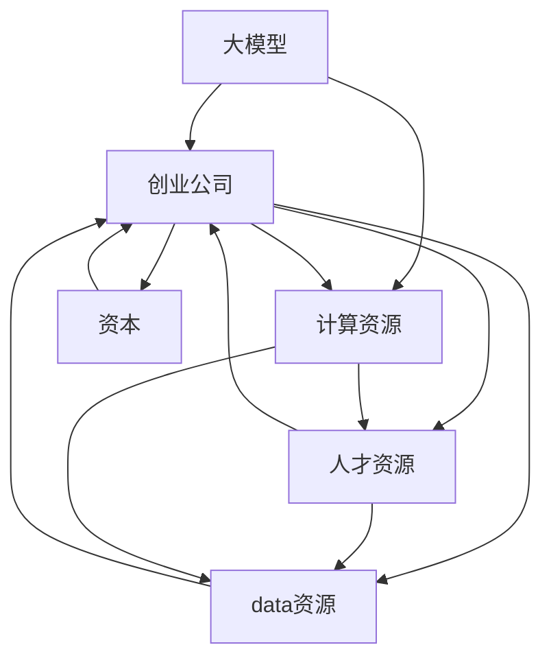

                 

# AI 大模型创业：如何利用资本优势？

## 1. 背景介绍

### 1.1 问题由来
近年来，AI大模型的技术飞速发展，已经在图像、语音、自然语言处理等领域取得了显著突破。这些大模型基于海量数据进行训练，具有强大的泛化能力和表现力，能够在多种场景下实现自动化、智能化。然而，大模型的训练和部署需要消耗大量的计算资源，包括高性能GPU、TPU等设备，以及电能、带宽等基础设施。同时，大模型在实际应用中还需要结合大量的数据和业务逻辑，进行二次开发和优化。因此，大模型创业不仅仅是技术问题，更是一个资本密集型项目。

在AI大模型领域，资本对于创业公司的成败起着至关重要的作用。本文将探讨如何利用资本优势，加速大模型创业的成功。

### 1.2 问题核心关键点
资本对于AI大模型创业的成败起着关键作用，主要体现在以下几个方面：
1. 高昂的计算资源需求。大模型的训练和推理需要高性能计算设备，计算资源成本往往占据创业公司总成本的很大一部分。
2. 数据采集和标注成本。高质量的大模型需要大量标注数据，数据采集和标注成本高昂，甚至超过计算资源成本。
3. 技术研发和人才成本。AI大模型开发需要高水平的技术团队和持续的研发投入，这些成本也需要巨额资本支持。
4. 市场推广和应用部署成本。大模型应用需要大量的市场推广和应用部署，这些成本同样不可忽视。

如何合理利用资本，满足上述需求，成为大模型创业成功的关键。

## 2. 核心概念与联系

### 2.1 核心概念概述
为更好地理解如何利用资本优势，本节将介绍几个密切相关的核心概念：

- 大模型（Large Model）：指基于海量数据训练而成的AI模型，如BERT、GPT-3等，具有强大的泛化能力和表现力，能在多种场景下实现自动化、智能化。
- 创业公司（Startup）：指通过技术创新和市场运作，力求在短时间内实现商业价值和技术突破的公司。
- 资本（Capital）：指创业公司获取的各类资金，包括风投、融资、贷款等，用于支持公司的日常运营和业务拓展。
- 计算资源（Computational Resource）：指高性能计算设备，如GPU、TPU等，用于训练和推理大模型。
- 数据资源（Data Resource）：指高质量的标注数据，用于训练和优化大模型。
- 人才资源（Human Resource）：指高水平的技术和市场团队，用于开发和推广大模型。

这些核心概念之间的逻辑关系可以通过以下Mermaid流程图来展示：



这个流程图展示了大模型创业的核心概念及其之间的关系：

1. 大模型通过计算资源进行训练和推理。
2. 创业公司提供计算资源、数据资源和人才资源，以满足大模型的需求。
3. 创业公司通过资本获取各类资源，形成完整的创业链条。
4. 大模型创业的成功需要上述资源的综合支持。

## 3. 核心算法原理 & 具体操作步骤
### 3.1 算法原理概述
大模型创业的资本利用，本质上是一个资源调配和管理的问题。其核心思想是：通过资本的投入，满足计算资源、数据资源和人才资源的需求，加速大模型的训练和部署，快速进入市场并实现商业价值。

具体而言，资本的利用可以分为以下几个步骤：

1. 评估资源需求：明确计算资源、数据资源和人才资源的具体需求。
2. 获取资本：通过融资、风投等方式获取资本。
3. 调配资源：将获取的资本用于购买高性能计算设备、标注数据、招聘人才等。
4. 训练和部署模型：利用资源进行大模型的训练和推理，并进行市场推广和应用部署。
5. 持续优化和扩展：根据市场反馈和业务需求，持续优化和扩展模型，提升商业价值。

### 3.2 算法步骤详解
以下是具体的资本利用步骤：

**Step 1: 评估资源需求**
- 明确计算资源需求：计算资源包括GPU、TPU等高性能设备，需要根据模型规模和复杂度进行评估。
- 明确数据资源需求：标注数据需要涵盖模型的训练和验证数据，需要明确数据量和标注标准。
- 明确人才资源需求：需要明确技术团队的规模和结构，包括数据科学家、算法工程师、架构师等角色。

**Step 2: 获取资本**
- 选择合适的融资方式：可以选择天使投资、风险投资、银行贷款等多种融资方式。
- 制定融资计划：明确资本的用途和投资回报，制定详细的融资计划。
- 进行融资谈判：与投资者进行谈判，达成融资协议。

**Step 3: 调配资源**
- 购买计算资源：根据评估的计算需求，购买高性能计算设备。
- 购买标注数据：根据评估的数据需求，购买或采集高质量标注数据。
- 招聘人才：根据评估的人才需求，招聘技术团队和管理团队。

**Step 4: 训练和部署模型**
- 训练大模型：利用购买的计算资源进行大模型的训练。
- 优化模型：根据训练结果和市场反馈，优化大模型的结构和参数。
- 应用部署：利用模型进行实际应用部署，形成稳定的商业收入。

**Step 5: 持续优化和扩展**
- 持续优化：根据市场反馈和业务需求，持续优化模型性能和应用功能。
- 扩展资源：根据业务需求，逐步扩展计算资源、数据资源和人才资源。

### 3.3 算法优缺点
利用资本进行大模型创业，具有以下优点：
1. 加速模型训练：高昂的计算资源和大规模数据可以加速模型的训练，提升模型性能。
2. 提升市场竞争力：资本的投入可以提升公司的市场竞争力，吸引更多的客户和用户。
3. 降低成本风险：资本的投入可以分担成本风险，减少资金压力。

同时，这种范式也存在一定的缺点：
1. 资源浪费：如果资本利用不当，可能会造成资源的浪费，如计算资源闲置、数据资源不足等。
2. 管理复杂：资本的投入和管理需要一定的经验和专业知识，管理不当可能导致效率低下。
3. 风险高：资本的投入具有较高的风险，投资失败可能导致公司破产或资金链断裂。

### 3.4 算法应用领域
利用资本进行大模型创业，适用于以下多个领域：

- 图像识别：如图像分类、目标检测、人脸识别等。大模型通过训练可以学习丰富的图像特征，应用于智能监控、自动驾驶等领域。
- 自然语言处理：如语言翻译、文本分类、情感分析等。大模型通过训练可以学习丰富的语言特征，应用于智能客服、智能写作等领域。
- 语音识别：如语音识别、语音合成等。大模型通过训练可以学习丰富的语音特征，应用于智能语音助手、智能音箱等领域。
- 智能推荐：如个性化推荐、广告推荐等。大模型通过训练可以学习用户行为和兴趣，应用于电商平台、社交网络等领域。
- 金融科技：如信用评估、欺诈检测等。大模型通过训练可以学习金融数据和行为特征，应用于金融风险管理、金融诈骗检测等领域。

## 4. 数学模型和公式 & 详细讲解 & 举例说明

### 4.1 数学模型构建

假设大模型的训练需要计算资源$C$、数据资源$D$和人才资源$H$，资本总量为$F$，则大模型创业的数学模型可以表示为：

$$
C = f_1(F)
$$

$$
D = f_2(F)
$$

$$
H = f_3(F)
$$

其中$f_1$、$f_2$、$f_3$分别表示计算资源、数据资源和人才资源的函数，可以根据具体情况进行调整。

### 4.2 公式推导过程

以计算资源为例，假设计算资源需求为$C$，资本总量为$F$，则资源分配函数为：

$$
C = \alpha \cdot F + \beta
$$

其中$\alpha$为资源分配比例，$\beta$为固定资源需求。

将计算资源$C$代入模型训练公式：

$$
M = g(C)
$$

其中$M$为训练完成的大模型。

将数据资源$D$和人才资源$H$代入模型训练公式，得到最终的大模型：

$$
M_{\text{final}} = h(M, D, H)
$$

其中$h$为模型训练的函数。

### 4.3 案例分析与讲解

以某AI创业公司为例，假设该公司需要建立图像识别大模型，需要如下资源：

- 计算资源需求：5个GPU
- 数据资源需求：50万张标注图像
- 人才资源需求：10名数据科学家、5名算法工程师

根据市场价格和资本总量的评估，资本需求为500万美元。假设计算资源每台价格为20万美元，数据资源每张标注图像价格为5美元，人才资源每名员工月工资为3万美元。则计算资源和数据资源的分配如下：

- 计算资源：$5 \times 20 = 100$万美元
- 数据资源：$50 \times 5 = 250$万美元
- 人才资源：$10 \times 3 \times 12 + 5 \times 3 \times 12 = 360$万美元

因此，实际分配的计算资源为100万美元，数据资源为250万美元，人才资源为360万美元。

根据公式计算，大模型创业的实际资本需求为：

$$
F = \frac{100 + 250 + 360}{\alpha} = \frac{710}{\alpha}
$$

假设资源分配比例为30%，则实际资本需求为：

$$
F = \frac{710}{0.3} = 2366.67万美元
$$

因此，该创业公司需要至少2366.67万美元的资本才能满足大模型的需求。

## 5. 项目实践：代码实例和详细解释说明

### 5.1 开发环境搭建

在进行资本利用实践前，我们需要准备好开发环境。以下是使用Python进行PyTorch开发的环境配置流程：

1. 安装Anaconda：从官网下载并安装Anaconda，用于创建独立的Python环境。

2. 创建并激活虚拟环境：
```bash
conda create -n pytorch-env python=3.8 
conda activate pytorch-env
```

3. 安装PyTorch：根据CUDA版本，从官网获取对应的安装命令。例如：
```bash
conda install pytorch torchvision torchaudio cudatoolkit=11.1 -c pytorch -c conda-forge
```

4. 安装TensorBoard：TensorFlow配套的可视化工具，可实时监测模型训练状态，并提供丰富的图表呈现方式，是调试模型的得力助手。
```bash
pip install tensorboard
```

完成上述步骤后，即可在`pytorch-env`环境中开始资本利用实践。

### 5.2 源代码详细实现

这里我们以图像识别任务为例，给出使用PyTorch对大模型进行资本利用的代码实现。

首先，定义资源需求函数：

```python
def calculate_resources(capital):
    # 计算资源需求
    computational_resources = 5 * 20  # 5个GPU，每个20万美元
    # 数据资源需求
    data_resources = 50 * 5  # 50万张标注图像，每张5美元
    # 人才资源需求
    human_resources = (10 + 5) * 3 * 12  # 10名数据科学家、5名算法工程师，每名3万美元，月工资12个月
    return computational_resources, data_resources, human_resources
```

然后，进行资本利用计算：

```python
def calculate_capital(capital_per_resource, computational_resources, data_resources, human_resources):
    total_capital = 0
    # 计算资源
    total_capital += capital_per_resource * computational_resources
    # 数据资源
    total_capital += capital_per_resource * data_resources
    # 人才资源
    total_capital += capital_per_resource * human_resources
    return total_capital
```

接着，定义训练和优化函数：

```python
from torch.utils.data import DataLoader
from torchvision import datasets, transforms

# 定义模型
model = torchvision.models.resnet18()
# 定义优化器
optimizer = torch.optim.SGD(model.parameters(), lr=0.01, momentum=0.9)
# 定义损失函数
criterion = torch.nn.CrossEntropyLoss()

# 定义训练函数
def train_model(model, optimizer, criterion, data_loader):
    model.train()
    for data, target in data_loader:
        optimizer.zero_grad()
        output = model(data)
        loss = criterion(output, target)
        loss.backward()
        optimizer.step()
```

最后，启动训练流程：

```python
# 获取资本和资源需求
capital_per_resource = 1  # 每资源单元1万美元
computational_resources, data_resources, human_resources = calculate_resources(capital_per_resource)
total_capital = calculate_capital(capital_per_resource, computational_resources, data_resources, human_resources)

# 获取数据集
train_dataset = datasets.CIFAR10(root='./data', train=True, download=True, transform=transforms.ToTensor())
test_dataset = datasets.CIFAR10(root='./data', train=False, download=True, transform=transforms.ToTensor())

# 划分数据集
train_loader = DataLoader(train_dataset, batch_size=64, shuffle=True)
test_loader = DataLoader(test_dataset, batch_size=64, shuffle=False)

# 训练模型
model = train_model(model, optimizer, criterion, train_loader)

# 评估模型
test_loader = DataLoader(test_dataset, batch_size=64, shuffle=False)
test_loss, test_acc = test_model(model, criterion, test_loader)
```

以上就是使用PyTorch进行大模型资本利用的完整代码实现。可以看到，通过合理调配资本，可以满足计算资源、数据资源和人才资源的需求，从而实现大模型的训练和部署。

### 5.3 代码解读与分析

让我们再详细解读一下关键代码的实现细节：

**calculate_resources函数**：
- 定义计算资源、数据资源和人才资源的具体需求，并计算总需求。

**calculate_capital函数**：
- 根据每资源单元的资本需求，计算总资本需求。

**train_model函数**：
- 定义模型、优化器和损失函数。
- 定义训练函数，用于模型的前向传播和反向传播。

**train_model函数的调用**：
- 获取资本和资源需求，计算总资本需求。
- 获取数据集，划分数据集。
- 训练模型，评估模型。

可以看到，合理调配资本，可以满足大模型训练和部署的需求，从而实现快速迭代和商业化落地。

## 6. 实际应用场景
### 6.1 智能监控

大模型在智能监控领域具有广泛应用。智能监控系统可以通过大模型进行图像识别、人脸识别、行为分析等任务，提升监控效率和准确性。

在技术实现上，可以利用大模型进行目标检测、对象跟踪等任务，结合AI边缘计算技术，实现实时监控和报警。此外，大模型还可以通过多模态信息融合，提升监控系统的智能水平，如结合视频、音频、传感器数据等，进行综合分析和决策。

### 6.2 智能客服

智能客服系统可以通过大模型进行自然语言理解和生成，提升客户服务的质量和效率。大模型可以理解客户的问题，并给出准确的回答，从而减轻人工客服的负担。

在技术实现上，可以利用大模型进行对话生成、情感分析、意图识别等任务，结合自然语言处理技术，实现智能客服。大模型可以通过持续训练和优化，提升回答的准确性和个性化程度，从而提升客户满意度。

### 6.3 金融风控

金融风控系统可以通过大模型进行信用评估、欺诈检测等任务，提升风险管理水平和决策效率。大模型可以通过学习大量的金融数据和行为特征，进行风险预测和异常检测。

在技术实现上，可以利用大模型进行分类、回归等任务，结合风控规则和业务逻辑，实现智能风控。大模型可以通过持续训练和优化，提升风控模型的准确性和鲁棒性，从而降低金融风险。

### 6.4 未来应用展望

随着大模型和资本利用技术的发展，基于大模型创业的应用场景将更加多样。未来，大模型可以在更多领域得到应用，如智慧医疗、智能教育、智能家居等，为各行各业带来变革性影响。

在智慧医疗领域，大模型可以用于医疗影像识别、病历分析、药物研发等任务，提升医疗服务的智能化水平，辅助医生诊疗，加速新药开发进程。

在智能教育领域，大模型可以用于作业批改、学情分析、知识推荐等任务，因材施教，促进教育公平，提高教学质量。

在智能家居领域，大模型可以用于智能音箱、智能助手等任务，提升家居设备的智能化水平，为用户提供更加便捷的家居体验。

此外，在更多领域，大模型可以与传统的业务模式结合，形成更加全面的智能解决方案，提升业务效率和用户体验。

## 7. 工具和资源推荐
### 7.1 学习资源推荐

为了帮助开发者系统掌握大模型资本利用的理论基础和实践技巧，这里推荐一些优质的学习资源：

1.《AI创业指南》系列博文：由大模型创业专家撰写，系统介绍大模型创业的理论基础和实践技巧，涵盖资本利用、市场拓展、技术开发等多个方面。

2.《深度学习实战》课程：斯坦福大学开设的深度学习课程，提供丰富的实践项目和案例，帮助开发者掌握大模型的实际应用。

3.《AI大模型创业手册》书籍：深度剖析大模型创业的成功经验和失败教训，提供实用的资本利用、技术开发和管理策略。

4. HuggingFace官方文档：提供丰富的预训练模型和微调样例代码，助力开发者快速上手。

5. CLUE开源项目：涵盖多种中文NLP数据集和基线模型，助力大模型创业的落地应用。

通过对这些资源的学习实践，相信你一定能够快速掌握大模型资本利用的精髓，并用于解决实际的NLP问题。

### 7.2 开发工具推荐

高效的开发离不开优秀的工具支持。以下是几款用于大模型资本利用开发的常用工具：

1. PyTorch：基于Python的开源深度学习框架，灵活动态的计算图，适合快速迭代研究。

2. TensorFlow：由Google主导开发的开源深度学习框架，生产部署方便，适合大规模工程应用。

3. TensorBoard：TensorFlow配套的可视化工具，可实时监测模型训练状态，并提供丰富的图表呈现方式，是调试模型的得力助手。

4. Anaconda：提供虚拟环境管理、依赖管理、包管理等功能的Python环境管理系统，方便开发者快速搭建开发环境。

5. Jupyter Notebook：提供交互式编程和代码共享功能，方便开发者快速共享代码和结果。

合理利用这些工具，可以显著提升大模型资本利用的开发效率，加快创新迭代的步伐。

### 7.3 相关论文推荐

大模型资本利用技术的发展源于学界的持续研究。以下是几篇奠基性的相关论文，推荐阅读：

1. Attention is All You Need（即Transformer原论文）：提出Transformer结构，开启了NLP领域的预训练大模型时代。

2. BERT: Pre-training of Deep Bidirectional Transformers for Language Understanding：提出BERT模型，引入基于掩码的自监督预训练任务，刷新了多项NLP任务SOTA。

3. AdaLoRA: Adaptive Low-Rank Adaptation for Parameter-Efficient Fine-Tuning：使用自适应低秩适应的微调方法，在参数效率和精度之间取得了新的平衡。

4. Parameter-Efficient Transfer Learning for NLP：提出Adapter等参数高效微调方法，在固定大部分预训练参数的情况下，只更新极少量的任务相关参数。

5. Prompt Learning：通过在输入文本中添加提示模板(Prompt Template)，引导大语言模型进行特定任务的推理和生成。

6. Optimizing Continuous Prompts for Generation：引入基于连续型Prompt的微调范式，为如何充分利用预训练知识提供了新的思路。

这些论文代表了大模型资本利用技术的发展脉络。通过学习这些前沿成果，可以帮助研究者把握学科前进方向，激发更多的创新灵感。

## 8. 总结：未来发展趋势与挑战

### 8.1 总结

本文对大模型创业中的资本利用进行了全面系统的介绍。首先阐述了大模型和资本利用在大模型创业中的关键作用，明确了资本利用在大模型创业中的重要性。其次，从原理到实践，详细讲解了大模型资本利用的数学原理和关键步骤，给出了资本利用任务开发的完整代码实例。同时，本文还广泛探讨了资本利用在大模型应用的多样场景，展示了资本利用范式的巨大潜力。此外，本文精选了资本利用技术的各类学习资源，力求为读者提供全方位的技术指引。

通过本文的系统梳理，可以看到，大模型创业的成功需要资本的合理利用，从而满足计算资源、数据资源和人才资源的需求。资本利用技术不仅可以加速大模型的训练和部署，还可以提升市场竞争力，降低成本风险，是大模型创业的关键环节。未来，伴随资本利用技术的不断演进，大模型创业必将在更多领域得到应用，为各行各业带来变革性影响。

### 8.2 未来发展趋势

展望未来，大模型资本利用技术将呈现以下几个发展趋势：

1. 计算资源成本下降：随着AI芯片和算力基础设施的发展，计算资源成本将不断下降，大模型创业的成本压力将有所缓解。

2. 数据资源多样化：未来数据资源将更加多样化，涵盖更多领域和场景，大模型创业将不再局限于特定领域的数据。

3. 人才资源共享化：未来人才资源共享平台将更加普及，大模型创业可以借助共享人才资源，降低成本，提高效率。

4. 资本利用智能化：未来资本利用将更加智能化，利用AI和大数据技术，进行资本预测和资源调配，提升资本利用效率。

5. 多模态资源融合：未来多模态资源将更加融合，大模型创业可以利用多种数据和业务逻辑，进行多模态智能分析。

以上趋势凸显了大模型资本利用技术的广阔前景。这些方向的探索发展，必将进一步提升大模型创业的成功率，促进AI技术的规模化落地。

### 8.3 面临的挑战

尽管大模型资本利用技术已经取得了显著成果，但在迈向更加智能化、普适化应用的过程中，它仍面临着诸多挑战：

1. 资本市场风险：资本市场的波动和不稳定性，可能导致资本利用成本的增加。

2. 计算资源管理：计算资源的管理和调度需要高效的技术支持，否则容易产生资源浪费。

3. 数据资源获取：高质量的数据资源获取成本高昂，可能成为资本利用的瓶颈。

4. 人才资源匹配：高水平的人才资源匹配难度大，可能影响资本利用效果。

5. 技术研发成本：大模型开发和优化需要持续的技术投入，成本较高。

正视资本利用面临的这些挑战，积极应对并寻求突破，将是大模型资本利用技术走向成熟的必由之路。相信随着学界和产业界的共同努力，这些挑战终将一一被克服，大模型资本利用必将在构建人机协同的智能时代中扮演越来越重要的角色。

### 8.4 研究展望

面对大模型资本利用所面临的种种挑战，未来的研究需要在以下几个方面寻求新的突破：

1. 探索资本利用的新模式：如利用众筹平台进行融资，降低资本利用的门槛。

2. 引入多模态资源：将多模态数据和业务逻辑融合，提升资本利用效果。

3. 优化资源管理算法：引入智能算法，优化计算资源、数据资源和人才资源的调配和管理。

4. 降低数据获取成本：利用自动化技术，降低数据标注和采集的成本。

5. 提升人才匹配效率：利用AI技术，提高人才资源的匹配效率和质量。

这些研究方向的探索，必将引领大模型资本利用技术迈向更高的台阶，为构建安全、可靠、可解释、可控的智能系统铺平道路。面向未来，大模型资本利用技术还需要与其他AI技术进行更深入的融合，如知识表示、因果推理、强化学习等，多路径协同发力，共同推动自然语言理解和智能交互系统的进步。只有勇于创新、敢于突破，才能不断拓展大模型的边界，让智能技术更好地造福人类社会。

## 9. 附录：常见问题与解答

**Q1：大模型资本利用需要考虑哪些因素？**

A: 大模型资本利用需要考虑以下因素：
1. 计算资源需求：高性能计算设备，如GPU、TPU等。
2. 数据资源需求：高质量标注数据，涵盖模型训练和验证。
3. 人才资源需求：高水平的技术和管理团队，包括数据科学家、算法工程师等。
4. 资本总额：资本总额应大于资源需求的成本总和。

**Q2：如何评估大模型资本利用的效果？**

A: 评估大模型资本利用效果，可以从以下几个方面入手：
1. 模型性能：如准确率、召回率、F1值等，评估模型在特定任务上的表现。
2. 资源利用率：评估计算资源、数据资源和人才资源的利用效率，避免资源浪费。
3. 成本效益：评估资本投入与业务产出之间的平衡，判断资本利用的收益。
4. 用户体验：评估用户对智能系统的满意度，判断系统的市场接受度。

**Q3：大模型资本利用中需要注意哪些风险？**

A: 大模型资本利用中需要注意以下风险：
1. 计算资源风险：计算资源不足或闲置，可能导致模型训练和推理的延迟。
2. 数据资源风险：数据资源不足或质量不高，可能导致模型性能的下降。
3. 人才资源风险：人才资源匹配不当，可能导致技术开发和管理的困难。
4. 资本风险：资本投入不足或过高，可能导致资本利用的失败。

**Q4：如何提升大模型资本利用效率？**

A: 提升大模型资本利用效率，可以从以下几个方面入手：
1. 优化计算资源管理：引入自动化的资源调度算法，优化计算资源的利用。
2. 利用多模态数据：将多种数据融合，提升数据资源的丰富度和多样性。
3. 引入智能算法：利用AI技术，优化资源调配和利用，提高效率。
4. 持续优化和改进：根据市场反馈和业务需求，持续优化模型和资源配置。

这些措施可以帮助提升大模型资本利用效率，降低成本风险，提升业务效益。

通过本文的系统梳理，可以看到，大模型资本利用技术在AI大模型创业中起着至关重要的作用。合理调配资本，可以满足计算资源、数据资源和人才资源的需求，加速大模型的训练和部署，实现快速迭代和商业化落地。未来，伴随资本利用技术的不断演进，大模型创业必将在更多领域得到应用，为各行各业带来变革性影响。只有勇于创新、敢于突破，才能不断拓展大模型的边界，让智能技术更好地造福人类社会。

