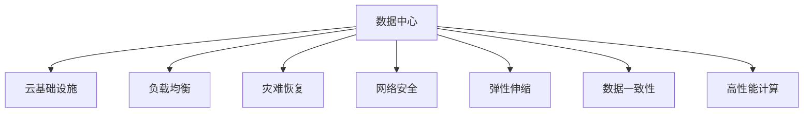

                 

# AI 大模型应用数据中心建设：数据中心安全与可靠性

> 关键词：AI大模型,数据中心,安全与可靠性,云基础设施,负载均衡,灾难恢复,网络安全

## 1. 背景介绍

### 1.1 问题由来
在AI大模型应用逐步普及的当下，数据中心建设成为了保证AI技术高效运行的关键。大模型训练和推理需要大量的计算资源，且对存储和带宽的要求极高，这都对数据中心的硬件和软件基础设施提出了严峻的挑战。

1. 计算密集型需求。AI大模型的训练和推理计算复杂度大，对GPU/TPU等计算资源的需求巨大，需要数据中心具备强有力的计算能力。
2. 高带宽需求。数据传输速率需达到Gbps级别，才能支持模型的高输入输出流量。
3. 海量存储需求。模型参数量庞大，训练过程需要高效、可靠的存储系统，以支持频繁的数据读写操作。
4. 高度一致性。AI模型对数据的准确性要求极高，数据中心需要保证数据的实时性和一致性。

### 1.2 问题核心关键点
数据中心在大模型应用中的核心作用主要包括：
- 提供高效的计算资源。
- 保证高速的带宽和存储能力。
- 实现高性能的负载均衡和扩展能力。
- 实现高可靠性的灾难恢复和容错机制。
- 构建安全的网络环境，防止数据泄露和攻击。

这些问题直接影响到AI大模型的训练和推理效果，也决定着AI技术落地应用的可靠性与安全性。因此，构建一个安全、可靠、高效的数据中心是AI大模型应用成功的基石。

## 2. 核心概念与联系

### 2.1 核心概念概述

为更好地理解数据中心在大模型应用中的安全与可靠性构建方法，本节将介绍几个核心概念：

- 数据中心(Data Center, DC)：由大量服务器、存储设备、网络设备组成的大型计算机设施，用于支持数据处理、存储和网络传输。
- 云基础设施(Cloud Infrastructure)：通过云计算方式提供弹性计算和存储资源，支持AI大模型的灵活部署和扩展。
- 负载均衡(Load Balancing)：在数据中心内分布式计算资源，通过算法实现任务均衡分配，避免单点故障和资源瓶颈。
- 灾难恢复(Disaster Recovery)：在数据中心发生故障时，通过备份和冗余机制保障数据和服务的可用性。
- 网络安全(Network Security)：采用防火墙、入侵检测、加密技术等手段，保障数据中心网络通信的安全性。
- 弹性伸缩(Elastic Scaling)：根据实际负载动态调整计算资源，适应AI模型在训练和推理过程中的性能波动。
- 数据一致性(Data Consistency)：确保数据在多副本间的一致性，防止因数据差异带来的系统错误。
- 高性能计算(High Performance Computing, HPC)：采用分布式并行计算技术，加速AI大模型的训练和推理过程。

这些核心概念之间的逻辑关系可以通过以下Mermaid流程图来展示：



这个流程图展示了大模型应用的数据中心构建核心概念及其之间的关系：

1. 数据中心通过云基础设施实现弹性计算和存储资源的灵活分配。
2. 通过负载均衡、灾难恢复、网络安全等机制保证数据中心的可靠性和安全性。
3. 高性能计算技术进一步提升数据中心的处理能力，加速AI大模型的训练和推理过程。

这些概念共同构成了大模型应用数据中心的安全与可靠性框架，为其提供全面的支持。

## 3. 核心算法原理 & 具体操作步骤
### 3.1 算法原理概述

数据中心在大模型应用中的算法原理，主要围绕以下几个方面展开：

- 计算资源调度：根据实际任务需求，合理分配GPU/TPU等计算资源，保障训练和推理的高效进行。
- 数据存储和传输：采用高带宽的存储设备和网络设备，保证数据的快速读写和传输。
- 任务均衡分配：通过负载均衡算法，实现计算任务的均衡分配，避免单点故障和资源浪费。
- 灾难恢复机制：通过备份和冗余机制，保障数据和服务的持续可用性，在灾难发生时能够快速恢复。
- 网络安全措施：采用各种网络安全技术，防止恶意访问和数据泄露，保证通信的安全性。
- 系统弹性伸缩：根据计算负载实时调整资源，实现系统的自适应扩展。

### 3.2 算法步骤详解

构建安全可靠的数据中心，需要遵循以下详细步骤：

**Step 1: 设计数据中心架构**
- 根据AI模型需求，选择合适的硬件设备，包括服务器、存储设备、网络设备等。
- 设计计算资源的分布式架构，确保高可靠性和高扩展性。
- 确定存储系统的冗余备份策略，确保数据的高可用性和一致性。
- 配置网络设备，保证高带宽和低延迟的网络通信。

**Step 2: 部署云基础设施**
- 搭建云平台，提供弹性计算和存储资源，支持模型部署和扩展。
- 采用容器化技术，提高资源利用率和系统稳定性。
- 实现自动化运维，支持模型的快速部署和升级。

**Step 3: 实施负载均衡**
- 采用负载均衡算法，将计算任务均衡分配到各个节点上。
- 实时监控系统负载，根据负载情况动态调整资源分配。
- 实现故障切换机制，当某一节点发生故障时，自动切换到备用节点。

**Step 4: 实现灾难恢复**
- 备份关键数据，在数据中心或云平台上存储多份数据副本。
- 定期进行灾难恢复演练，确保备份数据的可用性。
- 设计冗余架构，采用双活数据中心或多活数据中心策略。

**Step 5: 强化网络安全**
- 部署防火墙，限制非法访问和攻击。
- 采用入侵检测系统(IDS)和入侵防御系统(IPS)，监控网络流量。
- 使用VPN和SSL/TLS加密技术，保护数据传输的安全性。
- 定期更新安全补丁，防范新出现的安全漏洞。

**Step 6: 实现弹性伸缩**
- 实时监控系统负载，动态调整计算资源。
- 采用按需伸缩策略，根据负载变化自动增减资源。
- 设计自动扩容和缩容机制，保持系统的高性能和低成本。

**Step 7: 确保数据一致性**
- 采用分布式事务和共识协议，保证多副本数据的一致性。
- 实现数据同步机制，保持不同节点间的数据同步。
- 采用一致性哈希算法，在节点故障时快速转移数据负载。

### 3.3 算法优缺点

数据中心在大模型应用中的算法构建具有以下优点：

- 弹性扩展能力强。云基础设施支持弹性计算和存储资源，能适应模型的灵活部署和扩展需求。
- 高性能可靠。通过负载均衡和灾难恢复等机制，保障计算任务的均衡分配和高可靠性。
- 安全性高。通过网络安全措施，防止恶意访问和数据泄露，保护数据中心的安全性。

同时，也存在一些缺点：

- 初始建设成本高。需要投入大量资金购置硬件设备和软件系统。
- 运维复杂。系统规模大，结构复杂，需要专门的运维团队进行管理和维护。
- 资源利用率低。在低负载时，部分资源可能闲置，造成资源浪费。

尽管存在这些缺点，但就目前而言，构建安全可靠的数据中心仍是大模型应用的最主流范式。未来相关研究的重点在于如何进一步降低成本，提高系统效率和弹性，同时兼顾安全性和可靠性。

### 3.4 算法应用领域

大模型应用数据中心的技术构建方法，已经广泛应用于以下领域：

- 高性能计算中心：用于支撑大规模科学计算和AI研究，如超级计算机、云计算中心等。
- 智能数据中心：提供智能监控、自动化运维等功能，提升数据中心的运维效率。
- 网络安全中心：构建强大的网络防御体系，保障敏感数据的传输安全。
- 大数据中心：通过高带宽存储和大容量计算，支持大规模数据的存储和分析。
- 边缘计算中心：部署在靠近用户侧，提供低延迟、高带宽的服务，如工业物联网、智能城市等。

## 4. 数学模型和公式 & 详细讲解  
### 4.1 数学模型构建

本节将使用数学语言对大模型应用数据中心的算法原理进行更加严格的刻画。

设数据中心拥有 $N$ 个计算节点，每个节点处理能力为 $P$，计算任务需分配给 $K$ 个节点处理。假设每个节点的任务量 $\mathcal{T}_k$ 服从指数分布，节点的平均任务量为 $\mu$。

根据负载均衡算法，每个节点处理的任务量为 $\mathcal{T}_k = \frac{\mathcal{T}}{K} = \frac{\mu}{K}$，其中 $\mathcal{T}$ 为总任务量。

假设任务完成的平均时间为 $\tau$，每个节点的处理时间为 $t$，则根据任务均衡分配，每个节点完成任务所需时间为 $t_k = \mathcal{T}_k / P$。

任务完成的平均时间 $\tau$ 可以表示为：

$$
\tau = \frac{Nt_k}{\mu} = \frac{N\mu / K}{\mu} = \frac{N}{K}
$$

任务完成的总平均时间 $\tau_{avg}$ 为所有节点完成任务所需时间的期望值：

$$
\tau_{avg} = \sum_{k=1}^{K} \frac{\mathcal{T}_k}{P} = \frac{\mathcal{T}}{P} = \frac{\mu}{P}
$$

**案例分析与讲解**：

以谷歌的Borg调度系统为例，其在谷歌云平台中扮演了重要角色。Borg系统通过任务分割、任务分配、任务监控等机制，实现任务的高效处理和资源调度。谷歌通过Borg系统，实现了大规模数据中心的高效管理和资源优化，支撑了谷歌云平台的稳定运行。

## 5. 项目实践：代码实例和详细解释说明
### 5.1 开发环境搭建

在进行数据中心构建实践前，我们需要准备好开发环境。以下是使用Python进行Kubernetes开发的环境配置流程：

1. 安装Anaconda：从官网下载并安装Anaconda，用于创建独立的Python环境。

2. 创建并激活虚拟环境：
```bash
conda create -n k8s-env python=3.8 
conda activate k8s-env
```

3. 安装Kubernetes：根据Linux版本，从官网获取对应的安装命令。例如：
```bash
sudo apt-get install kubeadm kubelet kubectl -y
```

4. 安装Helm：Kubernetes的包管理工具，支持分布式部署和应用管理。
```bash
curl -L https://helm.sh/helm-v3.9.1-linux-amd64.tar.gz | tar xzv -C /usr/local
```

5. 安装Prometheus和Grafana：监控系统，实时监控数据中心的性能指标。
```bash
sudo apt-get install prometheus-server prometheus-node-exporter -y
sudo wget -qO - https://packages.grafana.com/gpg.key | sudo apt-key add -
sudo add-apt-repository "deb [arch=amd64] https://packages.grafana.com/oss/deb stable main"
sudo apt-get update
sudo apt-get install grafana -y
```

完成上述步骤后，即可在`k8s-env`环境中开始数据中心构建实践。

### 5.2 源代码详细实现

下面我们以Kubernetes为例，给出使用Python进行数据中心构建的Kubernetes代码实现。

首先，定义Kubernetes的Deployment：

```python
from kubernetes import client, config

config.load_kube_config()
v1 = client.CoreV1Api()

app_deployment = {
    "apiVersion": "v1",
    "kind": "Deployment",
    "metadata": {
        "name": "app-deployment",
        "labels": {"hello": "world"}
    },
    "spec": {
        "replicas": 3,
        "selector": {"matchLabels": {"hello": "world"}},
        "template": {
            "metadata": {
                "labels": {"hello": "world"},
                "annotations": {"hello": "world"}
            },
            "spec": {
                "containers": [
                    {
                        "name": "app-container",
                        "image": "nginx",
                        "ports": [80]
                    }
                ]
            }
        }
    }
}

v1.create_namespaced_deployment(namespace="default", body=app_deployment)
```

然后，定义Kubernetes的Service：

```python
app_service = {
    "apiVersion": "v1",
    "kind": "Service",
    "metadata": {
        "name": "app-service",
        "labels": {"hello": "world"},
        "selector": {"hello": "world"}
    },
    "spec": {
        "ports": [
            {
                "name": "http",
                "port": 80,
                "targetPort": 80
            }
        ],
        "type": "LoadBalancer"
    }
}

v1.create_namespaced_service(namespace="default", body=app_service)
```

最后，定义Kubernetes的Ingress：

```python
app_ingress = {
    "apiVersion": "networking.k8s.io/v1",
    "kind": "Ingress",
    "metadata": {
        "name": "app-ingress",
        "labels": {"hello": "world"},
        "annotations": {"hello": "world"}
    },
    "spec": {
        "rules": [
            {
                "host": "example.com",
                "http": {
                    "paths": [
                        {
                            "path": "/",
                            "path_type": "Prefix",
                            "backend": {
                                "service": {
                                    "name": "app-service",
                                    "port": {
                                        "name": "http",
                                        "number": 80
                                    }
                                }
                            }
                        }
                    ]
                }
            }
        ]
    }
}

v1.create_namespaced_ingress(namespace="default", body=app_ingress)
```

以上代码实现了Kubernetes的Deployment、Service和Ingress配置。通过Kubernetes，可以实现容器的自动化部署和扩展，保证系统的稳定性和可伸缩性。

### 5.3 代码解读与分析

让我们再详细解读一下关键代码的实现细节：

**Deployment类定义**：
- `create_namespaced_deployment`方法：创建Kubernetes的Deployment，指定容器镜像、副本数、选择器等参数，实现容器实例的自动部署和管理。

**Service类定义**：
- `create_namespaced_service`方法：创建Kubernetes的Service，指定服务端口、目标端口、类型等参数，实现负载均衡和服务的稳定访问。

**Ingress类定义**：
- `create_namespaced_ingress`方法：创建Kubernetes的Ingress，指定主机、路径、目标服务等参数，实现网络流量路由和负载均衡。

Kubernetes提供了强大的容器编排和调度能力，配合Prometheus和Grafana等监控系统，可以实现数据中心的自动化管理和实时监控。通过这些工具和技术，可以大大提升数据中心的运行效率和可靠性。

当然，工业级的系统实现还需考虑更多因素，如安全策略、健康检查、数据备份等，但核心的构建方法基本与此类似。

## 6. 实际应用场景
### 6.1 智能数据中心

智能数据中心通过引入AI技术，可以实现更高效、更灵活、更可靠的数据管理和服务。智能数据中心的构建可以包含以下几个方面：

- 智能监控：使用机器学习和预测模型，实时监控数据中心的各种性能指标，提前发现并解决潜在问题。
- 自动化运维：通过自动化运维工具，实现容器的自动部署、扩缩容、故障恢复等操作，提升运维效率。
- 智能调度：通过优化算法，实现计算资源的智能分配和任务均衡，提高系统的整体性能。

智能数据中心可以显著提升数据中心的管理和服务水平，帮助企业降低成本，提高效率。

### 6.2 高性能计算中心

高性能计算中心是大规模科学计算和AI研究的重要基础设施。通过构建高性能计算中心，可以支撑大规模的AI模型训练和推理，加速科学研究和技术创新。

高性能计算中心的关键技术包括：

- 高带宽网络：通过高性能网络设备，实现高带宽、低延迟的数据传输。
- 大规模集群：通过分布式计算技术，实现大规模并行计算。
- 分布式存储：通过分布式文件系统，实现大规模数据的存储和处理。
- 高性能计算加速：通过GPU/TPU等硬件加速，提升计算速度和效率。

高性能计算中心可以支持大规模科学研究和技术应用，推动AI技术的快速发展。

### 6.3 网络安全中心

网络安全中心是数据中心的核心组件之一，通过构建强大的网络防御体系，保障数据中心的网络安全。

网络安全中心的构建可以包含以下几个方面：

- 防火墙：限制非法访问和攻击，保障网络通信的安全性。
- 入侵检测系统(IDS)：实时监控网络流量，检测和预警恶意攻击。
- 入侵防御系统(IPS)：在检测到攻击时，自动采取防护措施，阻止攻击行为。
- 数据加密：使用加密技术，保护数据的传输和存储安全性。

网络安全中心可以有效防止恶意访问和攻击，保障数据中心的网络通信和数据安全。

### 6.4 大数据中心

大数据中心是支撑大规模数据存储和分析的重要基础设施。通过构建大数据中心，可以支撑海量数据的存储、处理和分析，支持AI模型训练和推理。

大数据中心的构建可以包含以下几个方面：

- 高带宽存储：通过高带宽的存储设备，实现数据的快速读写和传输。
- 分布式存储：通过分布式存储技术，实现数据的可靠存储和高效访问。
- 大数据分析：通过大数据分析工具，实现数据的挖掘和分析，提取有价值的信息。

大数据中心可以有效支撑海量数据的存储和分析，为AI模型的训练和推理提供强有力的支持。

### 6.5 边缘计算中心

边缘计算中心是构建低延迟、高带宽的计算中心。通过在靠近用户侧部署计算资源，可以提供快速响应和高性能的服务，支持工业物联网、智能城市等应用。

边缘计算中心的构建可以包含以下几个方面：

- 高带宽通信：通过5G/6G等高速网络，实现数据的快速传输。
- 边缘计算：通过分布式计算技术，实现低延迟、高性能的计算和推理。
- 边缘存储：通过分布式存储技术，实现数据的可靠存储和高效访问。

边缘计算中心可以有效支撑低延迟、高带宽的应用场景，提升工业物联网和智能城市等应用的用户体验。

## 7. 工具和资源推荐
### 7.1 学习资源推荐

为了帮助开发者系统掌握数据中心构建的理论基础和实践技巧，这里推荐一些优质的学习资源：

1. Kubernetes官方文档：Kubernetes是云原生应用的标配，提供了详细的文档和代码示例，帮助你快速上手容器编排。

2. Helm官方文档：Helm是Kubernetes的包管理工具，提供了丰富的资源管理和应用部署方案。

3. Prometheus官方文档：Prometheus是监控系统，提供了详细的文档和API示例，帮助你实现实时监控和告警。

4. Grafana官方文档：Grafana是数据可视化工具，提供了丰富的图表和模板，帮助你实现监控数据的可视化。

5. Google Cloud Platform文档：谷歌云平台提供了丰富的数据中心建设和部署方案，帮助你实现高效、可靠、安全的数据中心构建。

6. AWS文档：亚马逊云平台提供了强大的云计算服务，帮助你实现弹性计算和存储资源的灵活配置。

7. Microsoft Azure文档：微软Azure云平台提供了丰富的云计算服务，帮助你实现弹性计算和存储资源的灵活配置。

通过对这些资源的学习实践，相信你一定能够快速掌握数据中心构建的精髓，并用于解决实际的AI大模型应用问题。

### 7.2 开发工具推荐

高效的开发离不开优秀的工具支持。以下是几款用于数据中心构建开发的常用工具：

1. Python：数据中心构建需要处理大量的数据和计算任务，Python的强大生态系统和丰富的第三方库，可以显著提升开发效率。

2. Kubernetes：谷歌云平台开源的容器编排系统，支持大规模容器的自动化部署和管理，是构建云基础设施的必备工具。

3. Helm：Kubernetes的包管理工具，支持分布式应用的部署和管理，是构建云基础设施的重要补充。

4. Prometheus：监控系统，实时监控数据中心的性能指标，帮助系统管理员快速发现和解决问题。

5. Grafana：数据可视化工具，实时展示监控数据，帮助系统管理员直观了解系统状态。

6. ELK Stack：日志管理系统，支持日志的收集、存储和分析，帮助系统管理员快速排查问题。

7. Jenkins：自动化部署工具，支持CI/CD管道的自动化部署和测试，提高系统构建的效率和稳定性。

合理利用这些工具，可以显著提升数据中心构建的开发效率，加快创新迭代的步伐。

### 7.3 相关论文推荐

数据中心和大模型应用的技术发展源于学界的持续研究。以下是几篇奠基性的相关论文，推荐阅读：

1. Kubernetes：An open platform for distributed systems management：谷歌开源的Kubernetes容器编排系统，奠定了现代云计算基础设施的基石。

2. Helm：Helm: Kubernetes Package Manager：Helm的作者们撰写的技术白皮书，详细介绍Helm的设计思路和功能特点。

3. Prometheus: Monitoring and alerting for critical systems：Prometheus的设计理念和实现原理，介绍了如何通过监控系统保障系统的稳定性和可用性。

4. Grafana: The open & accessible data visualization platform：Grafana的设计理念和实现原理，介绍了如何通过数据可视化提升监控系统的效率和用户体验。

5. ELK Stack: A comprehensive guide to the ELK stack for Logstash, Elasticsearch and Kibana：ELK Stack的设计理念和实现原理，介绍了如何通过日志管理系统保障系统的可靠性和安全性。

这些论文代表了大模型应用数据中心的技术发展脉络。通过学习这些前沿成果，可以帮助研究者把握学科前进方向，激发更多的创新灵感。

## 8. 总结：未来发展趋势与挑战

### 8.1 总结

本文对大模型应用数据中心的构建方法进行了全面系统的介绍。首先阐述了数据中心在大模型应用中的重要性，明确了数据中心构建在性能、安全、可靠性等方面的关键需求。其次，从原理到实践，详细讲解了数据中心构建的核心算法和具体操作步骤，给出了数据中心构建的完整代码实例。同时，本文还广泛探讨了数据中心在大模型应用中的各种应用场景，展示了数据中心构建的广泛价值。此外，本文精选了数据中心构建的学习资源和工具，力求为读者提供全方位的技术指引。

通过本文的系统梳理，可以看到，数据中心在大模型应用中的构建方法正在成为AI技术落地的重要范式，极大地拓展了AI大模型的应用边界，为AI技术落地应用提供了强有力的基础设施支撑。未来，伴随预训练语言模型和微调方法的持续演进，基于数据中心的AI技术必将迎来更加广泛的应用，带来深刻的变革。

### 8.2 未来发展趋势

展望未来，大模型应用数据中心的构建方法将呈现以下几个发展趋势：

1. 云原生技术普及：基于云原生技术，数据中心可以更加灵活、高效地部署和管理计算资源，适应大模型对弹性计算和存储资源的需求。

2. 智能运维系统完善：引入AI技术，实现智能监控、自动化运维，提升数据中心的运维效率和稳定性。

3. 边缘计算加速普及：通过边缘计算中心，实现低延迟、高带宽的应用场景，支撑工业物联网、智能城市等应用。

4. 安全防护系统完善：构建强大的网络防御体系，保障数据中心的网络通信和数据安全。

5. 数据中心分布化：采用多数据中心分布式架构，实现高可靠性和高可用性。

6. 数据一致性保障：采用分布式事务和共识协议，实现多副本数据的一致性，确保数据的高可用性。

7. 系统弹性扩展：根据计算负载实时调整资源，实现系统的自适应扩展，提升系统的效率和资源利用率。

以上趋势凸显了大模型应用数据中心构建的广阔前景。这些方向的探索发展，必将进一步提升数据中心的性能和可靠性，为AI大模型的落地应用提供坚实的支撑。

### 8.3 面临的挑战

尽管数据中心在大模型应用中的构建技术已经取得了显著进展，但在迈向更加智能化、普适化应用的过程中，仍面临诸多挑战：

1. 高成本。数据中心硬件设备和软件系统的初始建设成本较高，运维和维护费用也不低，制约了中小企业的应用。

2. 资源利用率低。数据中心资源利用率不高，低负载时存在大量资源浪费。

3. 网络通信延迟。数据中心需要支持高带宽的通信需求，网络通信延迟对实时性要求高的应用可能存在瓶颈。

4. 数据一致性保障难度大。大规模分布式系统中，保证数据一致性具有较高难度。

5. 安全防护挑战大。数据中心需要构建强大的网络防御体系，防止恶意访问和攻击，保障数据的安全性。

6. 管理复杂度高。数据中心系统规模大，结构复杂，需要专业的运维团队进行管理和维护。

7. 技术更新迭代快。随着AI技术的快速发展，数据中心的构建技术也需要不断更新和优化，以适应新的应用需求。

正视数据中心面临的这些挑战，积极应对并寻求突破，将是大模型应用数据中心构建成功的关键。相信随着学界和产业界的共同努力，这些挑战终将一一被克服，数据中心构建必将走向更加成熟和完善。

### 8.4 研究展望

面对数据中心构建所面临的种种挑战，未来的研究需要在以下几个方面寻求新的突破：

1. 降低初始建设成本：采用模块化、标准化、可扩展的设计，降低数据中心的初期投资。

2. 提高资源利用率：通过优化算法和架构，提高数据中心的资源利用率，实现更高的经济性。

3. 优化网络通信性能：通过网络技术创新，优化数据中心的网络通信性能，满足高带宽需求。

4. 简化数据一致性保障：采用分布式事务和一致性哈希等技术，降低数据一致性保障的难度。

5. 构建智能化运维系统：引入AI技术，实现智能监控、自动化运维，提升数据中心的运维效率和稳定性。

6. 构建高安全防护体系：采用多层次网络安全措施，防止恶意访问和攻击，保障数据中心的安全性。

7. 优化系统设计和架构：采用云计算和边缘计算等技术，优化数据中心的系统设计和架构，提高系统的灵活性和可靠性。

这些研究方向将引领数据中心构建技术的不断演进，为AI大模型的落地应用提供更加高效、可靠、安全的支撑。面向未来，数据中心构建技术还需要与其他AI技术进行更深入的融合，如知识表示、因果推理、强化学习等，多路径协同发力，共同推动人工智能技术的发展。只有勇于创新、敢于突破，才能不断拓展AI大模型的应用边界，让智能技术更好地造福人类社会。

## 9. 附录：常见问题与解答

**Q1：数据中心如何实现高可靠性和高可用性？**

A: 数据中心的高可靠性和高可用性主要通过以下措施实现：

1. 冗余备份：通过多副本备份和冗余机制，保障数据的高可用性。

2. 负载均衡：通过负载均衡算法，实现计算任务的均衡分配，避免单点故障。

3. 故障切换：设计自动故障切换机制，当某一节点发生故障时，自动切换到备用节点。

4. 多活架构：采用双活或多活架构，实现数据的跨节点复制和访问。

5. 灾难恢复：通过备份和冗余机制，在数据中心或云平台上存储多份数据副本，实现快速恢复。

6. 数据同步：采用一致性哈希算法，在节点故障时快速转移数据负载。

**Q2：数据中心如何实现高效的网络通信？**

A: 数据中心高效的网络通信主要通过以下措施实现：

1. 高带宽设备：采用高带宽的网络设备和传输介质，实现高速的网络通信。

2. 负载均衡：通过负载均衡算法，实现网络流量的均衡分配，避免网络瓶颈。

3. 网络隔离：通过虚拟局域网(VLAN)和子网划分，实现不同网络环境的隔离，保障网络安全。

4. 网络优化：采用路由优化和流量控制技术，提升网络通信的效率和稳定性。

5. 网络监测：通过网络监测工具，实时监控网络流量和设备状态，及时发现和解决问题。

6. 网络冗余：设计网络冗余机制，当某一节点发生故障时，自动切换到备用节点，保证网络的连续性。

**Q3：数据中心如何实现智能运维？**

A: 数据中心的智能运维主要通过以下措施实现：

1. 自动化工具：引入自动化工具，实现容器的自动部署、扩缩容、故障恢复等操作，提升运维效率。

2. 监控系统：使用监控工具，实时监控数据中心的性能指标，提前发现并解决潜在问题。

3. 日志分析：通过日志分析工具，分析系统日志，帮助系统管理员快速排查问题。

4. 故障预测：使用机器学习算法，预测系统故障，提前进行维护和优化。

5. 性能优化：通过优化算法和架构，提升系统的性能和稳定性，满足实际需求。

6. 用户反馈：通过用户反馈系统，收集用户需求和问题，快速响应和解决问题。

**Q4：数据中心如何实现边缘计算？**

A: 数据中心的边缘计算主要通过以下措施实现：

1. 部署边缘节点：在靠近用户侧部署边缘节点，实现低延迟、高带宽的服务。

2. 边缘计算框架：采用边缘计算框架，实现分布式计算和任务调度。

3. 边缘存储：通过分布式存储技术，实现数据的可靠存储和高效访问。

4. 边缘计算平台：构建边缘计算平台，实现边缘设备和云平台的协同工作。

5. 边缘网络：采用5G/6G等高速网络技术，实现边缘设备与云平台的快速通信。

6. 边缘安全：采用边缘安全技术，保障边缘节点的安全性和可靠性。

7. 边缘运维：通过自动化工具，实现边缘节点的自动化运维和管理。

通过这些措施，可以构建高效、可靠的边缘计算中心，支撑低延迟、高带宽的应用场景，提升工业物联网和智能城市等应用的用户体验。

---

作者：禅与计算机程序设计艺术 / Zen and the Art of Computer Programming

