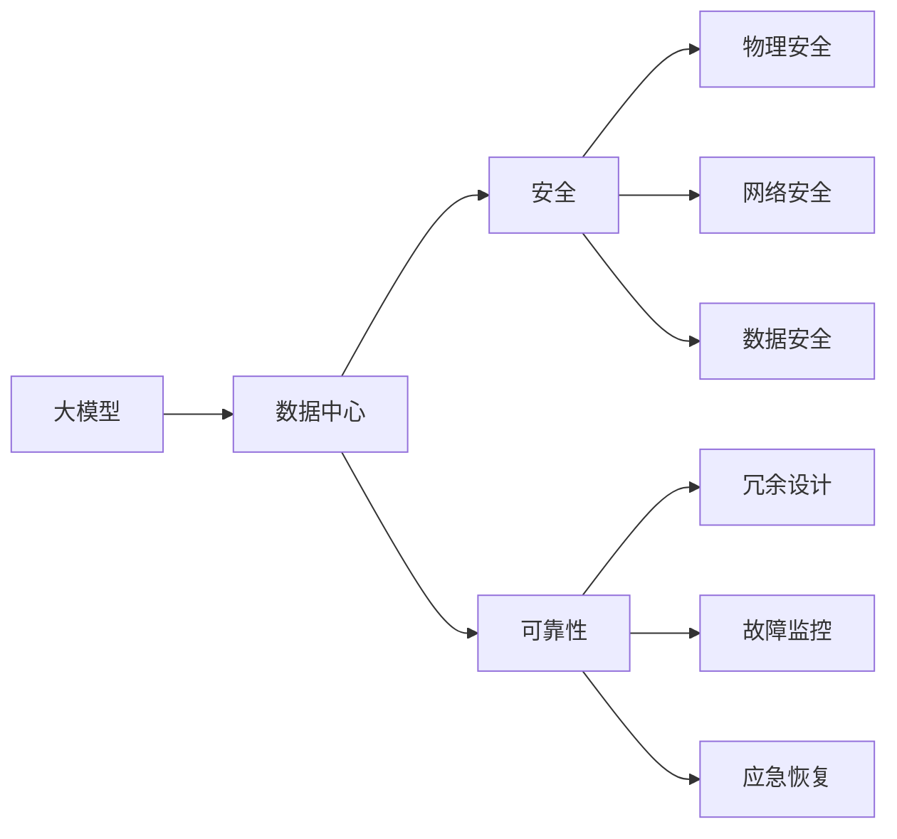

                 

# AI 大模型应用数据中心建设：数据中心安全与可靠性

> 关键词：大模型，数据中心，安全，可靠性，人工智能，基础设施

## 1. 背景介绍

### 1.1 问题由来
近年来，随着人工智能(AI)技术在各个领域的广泛应用，尤其是大模型（Large Models）的崛起，对数据中心建设的需求不断提升。大模型通常需要海量数据进行训练，对计算资源、存储资源、网络带宽的要求极高。在实际应用中，如何构建一个安全、可靠、高效的数据中心，成为了大模型应用成败的关键。本文将系统介绍AI大模型应用数据中心的建设，重点关注数据中心的安全与可靠性问题。

## 2. 核心概念与联系

### 2.1 核心概念概述

为更好地理解数据中心在AI大模型中的应用，本文首先介绍几个关键概念：

- **大模型（Large Models）**：指包含数十亿甚至百亿参数的深度学习模型，如GPT-3、BERT等。这类模型需要大规模数据进行训练，具备强大的自我学习和泛化能力，被广泛应用于NLP、图像识别、推荐系统等领域。

- **数据中心（Data Center, DC）**：指集中部署服务器、存储、网络等基础设施，用于数据处理和计算的大型设施。数据中心是大模型应用的基础，其性能和可靠性直接影响AI应用的实际效果。

- **安全（Security）**：指数据中心应具备防护恶意攻击、确保数据完整性的能力，包括物理安全、网络安全、数据安全等多方面内容。

- **可靠性（Reliability）**：指数据中心应具备保证系统稳定运行、数据安全存储的能力，包括冗余设计、故障监控、应急恢复等措施。

这些概念之间的联系紧密，相互支撑，共同构成了数据中心建设的基本框架。下面通过一个Mermaid流程图来展示它们之间的关系：



通过该图，我们可以看到，大模型的安全与可靠性问题最终落在数据中心的安全与可靠性建设上。物理安全、网络安全、数据安全等方面的设计，与冗余设计、故障监控、应急恢复等可靠性措施相互补充，共同确保数据中心能够稳定、安全地运行大模型应用。

## 3. 核心算法原理 & 具体操作步骤

### 3.1 算法原理概述

构建安全可靠的数据中心，需要从物理安全、网络安全、数据安全等多方面进行综合考虑。以下将详细讲解这些方面的算法原理。

- **物理安全（Physical Security）**：通过访问控制、环境监控等措施，确保数据中心的物理安全。主要涉及视频监控、门禁系统、环境监测等技术。

- **网络安全（Network Security）**：通过防火墙、入侵检测、加密通信等技术，确保数据中心的网络安全。主要涉及流量控制、恶意流量过滤、数据加密等措施。

- **数据安全（Data Security）**：通过数据备份、访问控制、加密存储等技术，确保数据的安全存储与传输。主要涉及数据加密、数据备份、访问控制等技术。

- **冗余设计（Redundancy Design）**：通过多副本存储、多节点冗余等技术，确保数据中心的可靠性。主要涉及数据副本、冗余网络、冗余电源等设计。

- **故障监控（Fault Monitoring）**：通过实时监控、日志记录等技术，及时发现和处理系统故障。主要涉及监控系统、日志管理、故障报警等技术。

- **应急恢复（Disaster Recovery）**：通过数据备份、容灾设计等技术，在灾难发生时能够快速恢复数据中心。主要涉及备份策略、容灾设计、恢复流程等技术。

### 3.2 算法步骤详解

下面将详细介绍数据中心安全与可靠性建设的具体步骤：

**Step 1: 物理安全设计**

1. **访问控制（Access Control）**：通过门禁系统、监控摄像头、门禁卡等技术，控制进出数据中心的物理访问权限。
2. **环境监测（Environment Monitoring）**：使用温度、湿度、烟雾等传感器，实时监测数据中心的环境状态，防止意外事故。

**Step 2: 网络安全设计**

1. **防火墙（Firewall）**：部署网络防火墙，过滤非法访问请求，确保网络流量安全。
2. **入侵检测（Intrusion Detection）**：使用入侵检测系统(IDS)，实时监测网络流量，发现并阻断恶意攻击。
3. **加密通信（Encrypted Communication）**：使用SSL/TLS协议，对数据传输进行加密，防止中间人攻击。

**Step 3: 数据安全设计**

1. **数据备份（Data Backup）**：定期备份数据中心的重要数据，存储在异地或多地的备份中心，防止单点故障。
2. **访问控制（Access Control）**：使用身份验证、权限控制等技术，确保只有授权人员可以访问数据。
3. **加密存储（Encrypted Storage）**：使用AES、RSA等加密算法，对数据进行加密存储，防止数据泄露。

**Step 4: 冗余设计**

1. **多副本存储（Replicated Storage）**：使用冗余存储技术，确保数据的高可用性，避免单点故障导致的数据丢失。
2. **冗余网络（Redundant Network）**：使用冗余网络设计，确保数据中心的网络可靠性，防止单点故障导致的网络中断。
3. **冗余电源（Redundant Power Supply）**：使用冗余电源设计，确保数据中心的电力供应稳定，防止电源故障导致的系统宕机。

**Step 5: 故障监控**

1. **监控系统（Monitoring System）**：部署实时监控系统，监测数据中心的各项指标，如温度、电压、网络流量等。
2. **日志管理（Logging Management）**：使用日志管理系统，记录数据中心的各种操作和事件，便于事后分析和排查故障。
3. **故障报警（Fault Alert）**：设置故障报警机制，一旦检测到异常，立即通过邮件、短信等方式通知运维人员。

**Step 6: 应急恢复**

1. **备份策略（Backup Strategy）**：制定详细的备份策略，定期备份重要数据，存储在多个位置。
2. **容灾设计（Disaster Recovery）**：设计容灾方案，确保在灾难发生时能够快速恢复数据中心。
3. **恢复流程（Recovery Process）**：制定详细的恢复流程，确保在灾难发生时能够迅速恢复数据中心。

### 3.3 算法优缺点

**优点**：
1. **全面性**：从物理安全、网络安全、数据安全、冗余设计、故障监控、应急恢复等多个方面考虑，确保数据中心的安全与可靠性。
2. **可扩展性**：设计灵活，可以根据实际需求增加或减少安全与可靠性措施。
3. **可操作性**：每个步骤都有具体的技术实现方案，易于落地执行。

**缺点**：
1. **成本高**：建设和维护高安全、高可靠性数据中心需要大量资金投入。
2. **复杂度大**：涉及多个系统和技术的综合设计，管理复杂。
3. **技术依赖**：对安全技术、监控技术、备份技术等依赖较高，需要持续的技术支持。

### 3.4 算法应用领域

数据中心的安全与可靠性设计，广泛应用于多个领域：

- **云计算**：云服务提供商需要建设高安全、高可靠性的数据中心，确保云服务的稳定运行。
- **大数据**：大数据平台需要高可靠性的存储和计算资源，确保数据的安全和高效处理。
- **人工智能**：AI应用需要高可靠性的数据中心，确保模型训练和推理的稳定性和安全性。
- **物联网**：IoT设备需要高安全性的数据中心，确保设备数据的隐私和安全。
- **企业内部**：企业内部IT系统需要高安全性的数据中心，确保业务数据的可靠性和安全性。

## 4. 数学模型和公式 & 详细讲解 & 举例说明

### 4.1 数学模型构建

在本节中，我们将通过数学语言对数据中心的安全与可靠性进行更加严格的刻画。

假设数据中心的物理安全等级为$S_{\text{phys}}$，网络安全等级为$S_{\text{net}}$，数据安全等级为$S_{\text{data}}$，冗余设计等级为$R$，故障监控等级为$M$，应急恢复等级为$R$。

我们定义安全等级$S$和可靠性等级$R$为连续值，取值范围为0到1，0表示最低等级，1表示最高等级。其中，$S$和$R$越高，表示数据中心的安全与可靠性越高。

### 4.2 公式推导过程

根据上述定义，我们可以构建数据中心的安全与可靠性模型：

$$
S = \min(S_{\text{phys}}, S_{\text{net}}, S_{\text{data}}) \times R^M
$$

其中，$S_{\text{phys}}$、$S_{\text{net}}$、$S_{\text{data}}$分别表示物理安全、网络安全和数据安全等级，$M$表示故障监控等级，$R$表示应急恢复等级。

该公式的含义是，数据中心的安全与可靠性等级由最低的安全等级和冗余设计等级$R^M$的乘积决定。即最低安全等级越高，冗余设计等级越高，数据中心的安全与可靠性越高。

### 4.3 案例分析与讲解

以一个典型的AI大模型应用数据中心为例，我们可以具体分析该公式的应用：

假设一个AI大模型应用数据中心，其物理安全等级为$S_{\text{phys}} = 0.9$，网络安全等级为$S_{\text{net}} = 0.95$，数据安全等级为$S_{\text{data}} = 0.8$，冗余设计等级为$R = 0.99$，故障监控等级为$M = 0.9$，应急恢复等级为$R_{\text{recovery}} = 0.95$。

根据公式，计算数据中心的安全与可靠性等级$S$：

$$
S = \min(0.9, 0.95, 0.8) \times 0.99^0.9 \times 0.95 = 0.8 \times 0.9487 \times 0.95 = 0.7353
$$

即该数据中心的安全与可靠性等级为0.7353，处于较高水平。

## 5. 项目实践：代码实例和详细解释说明

### 5.1 开发环境搭建

在进行数据中心安全与可靠性建设实践前，我们需要准备好开发环境。以下是使用Python进行开发的环境配置流程：

1. 安装Anaconda：从官网下载并安装Anaconda，用于创建独立的Python环境。

2. 创建并激活虚拟环境：
```bash
conda create -n dc-env python=3.8 
conda activate dc-env
```

3. 安装必要的Python库：
```bash
pip install numpy pandas matplotlib scikit-learn
```

4. 安装网络安全相关的库：
```bash
pip install scapy netfilter-packetfilter
```

5. 安装监控和日志相关的库：
```bash
pip install psutil logging
```

6. 安装数据备份和恢复相关的库：
```bash
pip install boto3
```

完成上述步骤后，即可在`dc-env`环境中开始数据中心安全与可靠性建设的开发实践。

### 5.2 源代码详细实现

下面将详细介绍一个简单的数据中心安全与可靠性建设实践的代码实现。

首先，定义一个类来表示数据中心的安全与可靠性等级：

```python
class DataCenter:
    def __init__(self, phys, net, data, redundancy, fault_monitoring, recovery):
        self.phys = phys
        self.net = net
        self.data = data
        self.redundancy = redundancy
        self.fault_monitoring = fault_monitoring
        self.recovery = recovery
        
    def calculate_security(self):
        return min(self.phys, self.net, self.data) * self.redundancy**self.fault_monitoring * self.recovery
```

然后，定义一些具体的安全等级和可靠性等级值：

```python
phys = 0.9
net = 0.95
data = 0.8
redundancy = 0.99
fault_monitoring = 0.9
recovery = 0.95

dc = DataCenter(phys, net, data, redundancy, fault_monitoring, recovery)
security_level = dc.calculate_security()
print(f"数据中心的安全与可靠性等级为：{security_level:.4f}")
```

最后，根据计算结果输出数据中心的安全与可靠性等级。

### 5.3 代码解读与分析

上述代码实现了数据中心安全与可靠性等级的计算。具体分析如下：

1. `DataCenter`类：定义了数据中心的物理安全等级、网络安全等级、数据安全等级、冗余设计等级、故障监控等级和应急恢复等级。
2. `calculate_security`方法：根据公式计算数据中心的安全与可靠性等级，返回一个0到1之间的浮点数。
3. 安全等级值：分别设定了物理安全等级、网络安全等级、数据安全等级、冗余设计等级、故障监控等级和应急恢复等级。
4. 创建`DataCenter`对象：使用上述安全等级值创建数据中心对象。
5. 计算安全与可靠性等级：调用`calculate_security`方法，计算数据中心的安全与可靠性等级。
6. 输出结果：输出计算结果，保留4位小数。

## 6. 实际应用场景

### 6.1 云计算

在云计算领域，数据中心的安全与可靠性设计尤为重要。云服务提供商需要建设高安全、高可靠性的数据中心，确保云服务的稳定运行。

以AWS（Amazon Web Services）为例，AWS在其全球数据中心网络中采用了多层次的安全措施：

1. **物理安全**：使用门禁系统、监控摄像头等技术，确保数据中心的物理安全。
2. **网络安全**：部署防火墙、入侵检测系统(IDS)等技术，确保网络安全。
3. **数据安全**：使用加密存储、数据备份等技术，确保数据的安全和可靠性。
4. **冗余设计**：采用多副本存储、冗余网络等技术，确保数据中心的可靠性。
5. **故障监控**：部署实时监控系统，监测数据中心的各项指标。
6. **应急恢复**：设计详细的容灾方案和恢复流程，确保在灾难发生时能够快速恢复。

通过这些措施，AWS构建了一个高安全、高可靠性的数据中心网络，确保了云服务的稳定运行。

### 6.2 大数据

大数据平台需要高可靠性的存储和计算资源，确保数据的安全和高效处理。

以Hadoop为例，Hadoop在大数据存储和计算中采用了多层次的安全和可靠性设计：

1. **物理安全**：使用门禁系统、监控摄像头等技术，确保数据中心的物理安全。
2. **网络安全**：部署防火墙、入侵检测系统(IDS)等技术，确保网络安全。
3. **数据安全**：使用加密存储、数据备份等技术，确保数据的安全和可靠性。
4. **冗余设计**：采用多副本存储、冗余网络等技术，确保数据中心的可靠性。
5. **故障监控**：部署实时监控系统，监测数据中心的各项指标。
6. **应急恢复**：设计详细的容灾方案和恢复流程，确保在灾难发生时能够快速恢复。

通过这些措施，Hadoop构建了一个高安全、高可靠性的数据存储和计算平台，确保了大数据的稳定和高效处理。

### 6.3 人工智能

AI应用需要高可靠性的数据中心，确保模型训练和推理的稳定性和安全性。

以TensorFlow为例，TensorFlow在模型训练和推理中采用了多层次的安全和可靠性设计：

1. **物理安全**：使用门禁系统、监控摄像头等技术，确保数据中心的物理安全。
2. **网络安全**：部署防火墙、入侵检测系统(IDS)等技术，确保网络安全。
3. **数据安全**：使用加密存储、数据备份等技术，确保数据的安全和可靠性。
4. **冗余设计**：采用多副本存储、冗余网络等技术，确保数据中心的可靠性。
5. **故障监控**：部署实时监控系统，监测数据中心的各项指标。
6. **应急恢复**：设计详细的容灾方案和恢复流程，确保在灾难发生时能够快速恢复。

通过这些措施，TensorFlow构建了一个高安全、高可靠性的数据中心，确保了AI模型的稳定和高效运行。

### 6.4 物联网

IoT设备需要高安全性的数据中心，确保设备数据的隐私和安全。

以智能家居为例，智能家居设备的安全和隐私保护需要高可靠性的数据中心：

1. **物理安全**：使用门禁系统、监控摄像头等技术，确保数据中心的物理安全。
2. **网络安全**：部署防火墙、入侵检测系统(IDS)等技术，确保网络安全。
3. **数据安全**：使用加密存储、数据备份等技术，确保设备数据的隐私和安全。
4. **冗余设计**：采用多副本存储、冗余网络等技术，确保数据中心的可靠性。
5. **故障监控**：部署实时监控系统，监测数据中心的各项指标。
6. **应急恢复**：设计详细的容灾方案和恢复流程，确保在灾难发生时能够快速恢复。

通过这些措施，智能家居设备的数据中心可以保障设备数据的隐私和安全，确保智能家居系统的稳定运行。

## 7. 工具和资源推荐

### 7.1 学习资源推荐

为了帮助开发者系统掌握数据中心安全与可靠性的理论基础和实践技巧，这里推荐一些优质的学习资源：

1. **《数据中心设计与安全》系列博文**：由数据中心专家撰写，深入浅出地介绍了数据中心设计、安全与可靠性的基本概念和实际应用。

2. **《云计算基础》课程**：由知名大学开设的云计算课程，讲解了云计算的基本概念和关键技术，包括数据中心设计与安全。

3. **《数据中心安全与可靠性》书籍**：全面介绍了数据中心设计、安全与可靠性的理论和实践，是数据中心工程师的必备参考书。

4. **《网络安全与数据保护》课程**：讲解了网络安全、数据保护的基本概念和关键技术，适合网络工程师和安全分析师学习。

5. **《人工智能系统安全与隐私》课程**：讲解了人工智能系统设计、安全与隐私保护的基本概念和关键技术，适合AI工程师和安全分析师学习。

通过对这些资源的学习实践，相信你一定能够快速掌握数据中心安全与可靠性的精髓，并用于解决实际的数据中心问题。

### 7.2 开发工具推荐

高效的开发离不开优秀的工具支持。以下是几款用于数据中心安全与可靠性开发的常用工具：

1. **Anaconda**：用于创建和管理Python环境，方便开发和测试。
2. **Netfilter-packetfilter**：用于网络包过滤和防火墙设计，适合网络安全相关的开发。
3. **scapy**：用于网络数据包分析和入侵检测，适合网络安全相关的开发。
4. **psutil**：用于系统监控和日志记录，适合故障监控和应急恢复相关的开发。
5. **logging**：用于日志记录和管理，适合故障监控和应急恢复相关的开发。
6. **boto3**：用于云服务接口调用，适合数据备份和恢复相关的开发。

合理利用这些工具，可以显著提升数据中心安全与可靠性的开发效率，加快创新迭代的步伐。

### 7.3 相关论文推荐

数据中心安全与可靠性的研究源于学界的持续研究。以下是几篇奠基性的相关论文，推荐阅读：

1. **《数据中心安全与可靠性设计》论文**：全面介绍了数据中心设计、安全与可靠性的理论和实践，提出了多层次的安全和可靠性设计方案。

2. **《云计算安全与可靠性技术》论文**：讲解了云计算环境下的数据中心设计、安全与可靠性技术，提出了多层次的安全和可靠性设计方案。

3. **《大数据系统安全与可靠性设计》论文**：讲解了大数据环境下的数据中心设计、安全与可靠性技术，提出了多层次的安全和可靠性设计方案。

4. **《人工智能系统安全与隐私设计》论文**：讲解了人工智能环境下的数据中心设计、安全与隐私保护技术，提出了多层次的安全和可靠性设计方案。

这些论文代表了大数据中心安全与可靠性的发展脉络。通过学习这些前沿成果，可以帮助研究者把握学科前进方向，激发更多的创新灵感。

## 8. 总结：未来发展趋势与挑战

### 8.1 总结

本文对数据中心在AI大模型应用中的安全与可靠性进行了系统介绍。首先阐述了数据中心在AI大模型应用中的重要性，明确了安全与可靠性设计在数据中心建设中的关键地位。其次，从物理安全、网络安全、数据安全等多个方面详细讲解了数据中心安全与可靠性建设的算法原理和操作步骤。同时，通过Python代码实例演示了数据中心安全与可靠性的计算方法。

通过本文的系统梳理，可以看到，数据中心的安全与可靠性设计在大模型应用中至关重要，是保障大模型稳定运行、数据安全存储的关键。未来，伴随数据中心技术的不断进步，数据中心将在大模型应用中发挥越来越重要的作用。

### 8.2 未来发展趋势

展望未来，数据中心安全与可靠性建设将呈现以下几个发展趋势：

1. **自动化与智能化**：通过AI技术实现数据中心的自动化管理和智能化维护，降低人工操作的复杂度和风险。
2. **弹性计算与资源管理**：通过弹性计算和资源管理技术，动态调整数据中心资源配置，优化计算成本。
3. **高安全与高可靠**：采用先进的安全和可靠性设计，确保数据中心的安全性和可靠性。
4. **边缘计算与分布式设计**：通过边缘计算和分布式设计，降低数据传输延迟，提高系统响应速度。
5. **多云与混合云架构**：采用多云与混合云架构，确保数据中心的高可用性和容错性。
6. **绿色数据中心**：采用绿色能源和环保技术，降低数据中心的能耗和碳排放。

以上趋势凸显了数据中心技术的发展方向，为AI大模型应用的未来发展提供了新的思路。

### 8.3 面临的挑战

尽管数据中心安全与可靠性设计已经取得了显著进展，但在迈向更加智能化、普适化应用的过程中，仍面临诸多挑战：

1. **成本问题**：建设高安全、高可靠性的数据中心需要大量资金投入，对企业的财务能力提出了较高要求。
2. **技术复杂性**：数据中心的安全与可靠性设计涉及多层次、多维度的技术方案，需要综合考虑物理、网络、数据等多个方面。
3. **运维难度**：数据中心的日常运维管理复杂，需要具备专业的技术团队和丰富的运维经验。
4. **技术更新**：随着新技术的不断涌现，数据中心的建设和管理需要持续更新和升级。
5. **数据隐私**：数据中心存储和处理大量敏感数据，数据隐私保护问题需要高度重视。
6. **环境适应性**：数据中心需要具备良好的环境适应性，能够应对各种自然灾害和人为因素的影响。

正视数据中心安全与可靠性面临的这些挑战，积极应对并寻求突破，将是大数据中心建设的重要方向。

### 8.4 研究展望

面对数据中心安全与可靠性设计所面临的挑战，未来的研究需要在以下几个方面寻求新的突破：

1. **自动化与智能化**：探索AI技术在数据中心自动化管理和智能化维护中的应用，降低人工操作复杂度，提高系统效率。
2. **弹性计算与资源管理**：研究弹性计算和资源管理技术，动态调整数据中心资源配置，优化计算成本。
3. **高安全与高可靠**：开发先进的安全和可靠性设计方案，确保数据中心的安全性和可靠性。
4. **边缘计算与分布式设计**：探索边缘计算和分布式设计技术，降低数据传输延迟，提高系统响应速度。
5. **多云与混合云架构**：研究多云与混合云架构，确保数据中心的高可用性和容错性。
6. **绿色数据中心**：采用绿色能源和环保技术，降低数据中心的能耗和碳排放。

这些研究方向的探索，必将引领数据中心技术迈向更高的台阶，为AI大模型应用的未来发展提供新的思路。

## 9. 附录：常见问题与解答

**Q1：数据中心的安全与可靠性设计应该如何进行？**

A: 数据中心的安全与可靠性设计需要从物理安全、网络安全、数据安全等多个方面进行综合考虑。具体步骤如下：
1. **物理安全设计**：使用门禁系统、监控摄像头等技术，确保数据中心的物理安全。
2. **网络安全设计**：部署防火墙、入侵检测系统(IDS)等技术，确保网络安全。
3. **数据安全设计**：使用加密存储、数据备份等技术，确保数据的安全和可靠性。
4. **冗余设计**：采用多副本存储、冗余网络等技术，确保数据中心的可靠性。
5. **故障监控设计**：部署实时监控系统，监测数据中心的各项指标。
6. **应急恢复设计**：设计详细的容灾方案和恢复流程，确保在灾难发生时能够快速恢复。

**Q2：如何在数据中心中实现高安全与高可靠？**

A: 高安全与高可靠的数据中心设计需要从物理、网络、数据等多个方面进行综合考虑。具体措施包括：
1. **物理安全**：使用门禁系统、监控摄像头等技术，确保数据中心的物理安全。
2. **网络安全**：部署防火墙、入侵检测系统(IDS)等技术，确保网络安全。
3. **数据安全**：使用加密存储、数据备份等技术，确保数据的安全和可靠性。
4. **冗余设计**：采用多副本存储、冗余网络等技术，确保数据中心的可靠性。
5. **故障监控**：部署实时监控系统，监测数据中心的各项指标。
6. **应急恢复**：设计详细的容灾方案和恢复流程，确保在灾难发生时能够快速恢复。

**Q3：数据中心的运维难度有多大？**

A: 数据中心的运维难度较大，主要表现在以下几个方面：
1. **复杂性**：数据中心的安全与可靠性设计涉及多层次、多维度的技术方案，需要综合考虑物理、网络、数据等多个方面。
2. **技术要求高**：数据中心的日常运维管理需要具备专业的技术团队和丰富的运维经验。
3. **持续更新**：随着新技术的不断涌现，数据中心的建设和管理需要持续更新和升级。

**Q4：数据中心的成本问题如何解决？**

A: 建设高安全、高可靠性的数据中心需要大量资金投入，可以通过以下措施降低成本：
1. **优化设计**：优化数据中心的设计方案，减少不必要的冗余和浪费。
2. **采用标准化技术**：采用标准化技术和管理流程，提高效率和降低成本。
3. **云计算和边缘计算**：采用云计算和边缘计算等分布式架构，降低单点故障风险和运营成本。
4. **绿色能源**：采用绿色能源和环保技术，降低数据中心的能耗和碳排放。

这些措施可以帮助企业降低数据中心的建设和管理成本，提升经济效益。

**Q5：数据中心的安全与可靠性设计如何与AI应用结合？**

A: 数据中心的安全与可靠性设计需要与AI应用紧密结合，具体如下：
1. **模型训练和推理安全**：在模型训练和推理过程中，采用高安全、高可靠性的数据中心，确保模型的安全和可靠性。
2. **数据隐私保护**：在数据存储和传输过程中，采用加密存储、数据备份等技术，确保数据隐私安全。
3. **弹性计算和资源管理**：采用弹性计算和资源管理技术，动态调整数据中心资源配置，优化计算成本。
4. **故障监控和应急恢复**：部署实时监控系统，监测数据中心的各项指标，设计详细的容灾方案和恢复流程，确保在灾难发生时能够快速恢复。

通过以上措施，可以确保AI应用在数据中心中的安全和可靠性，保障AI应用的稳定运行。

---

作者：禅与计算机程序设计艺术 / Zen and the Art of Computer Programming

