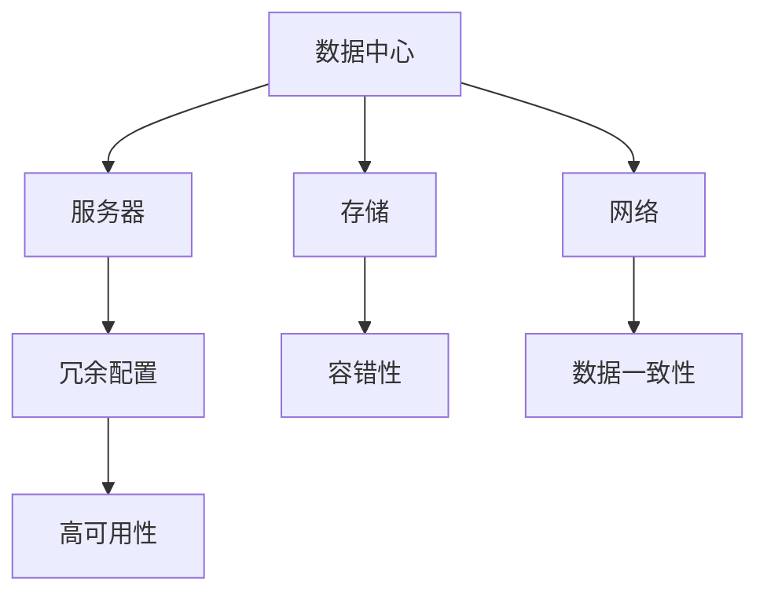

                 

## 1. 背景介绍

### 1.1 问题由来

随着人工智能技术的快速发展，大模型在图像识别、自然语言处理、推荐系统等领域取得了显著的进展，应用于各类大数据中心。然而，由于数据中心的计算负载庞大、运行周期长，数据中心的稳定性、安全性成为大模型应用的首要问题。

在传统数据中心建设中，往往侧重于硬件设备的采购和部署，对软件系统以及安全可靠性等综合因素考虑不足。而在AI大模型应用的特殊背景下，数据中心的安全和可靠性成为了关键的瓶颈。

### 1.2 问题核心关键点

数据中心安全与可靠性的问题核心关键点在于：

- **数据安全性**：大模型包含海量敏感数据，如何保证数据在传输、存储过程中的安全；
- **系统可靠性**：数据中心硬件设备的冗余配置、系统的容错性等，保证系统的稳定运行；
- **数据一致性**：保证数据在各副本之间的同步更新，避免数据不一致性；
- **高可用性**：数据中心应能在故障发生时，及时进行故障切换，保障服务的连续性。

本文将围绕这些核心关键点，系统阐述数据中心的安全与可靠性问题，并提出相应的解决策略。

## 2. 核心概念与联系

### 2.1 核心概念概述

在讨论数据中心安全与可靠性问题时，我们将涉及以下几个核心概念：

- **数据中心**：大型数据中心，包含服务器、存储、网络等硬件设备和相应的软件系统，用于存储、计算和分析大规模数据。
- **冗余配置**：为了提升系统的可靠性，通过增加硬件设备的副本，在主设备故障时能够自动切换到副设备，保障系统的正常运行。
- **容错性**：系统在发生故障时，能通过冗余配置或自动修复机制，确保数据和服务不丢失，保障服务的连续性。
- **数据一致性**：在分布式存储系统中，保证不同副本的数据在更新时保持一致，避免数据混乱和冲突。
- **高可用性**：数据中心系统能够在故障发生时，自动切换到备用系统，避免服务中断，保障服务的连续性。

这些概念构成了数据中心安全与可靠性的基础，通过合理的设计和实施，可以有效提升数据中心的整体性能。

### 2.2 核心概念原理和架构的 Mermaid 流程图



这个流程图展示了数据中心的各个组件及其间的联系，冗余配置、容错性、数据一致性、高可用性等概念相互关联，共同构成了数据中心的安全与可靠性体系。

## 3. 核心算法原理 & 具体操作步骤

### 3.1 算法原理概述

在数据中心的建设和运维中，核心的算法原理和具体操作步骤包括：

- **冗余配置**：通过增加硬件设备的副本，实现系统的容错和故障切换。
- **容错性**：利用冗余配置，当主设备故障时，系统自动切换到副设备，保障服务的连续性。
- **数据一致性**：在分布式存储系统中，通过一致性协议，保证不同副本的数据在更新时保持一致。
- **高可用性**：在故障发生时，自动切换到备用系统，避免服务中断。

### 3.2 算法步骤详解

**冗余配置**：

1. **设备冗余**：在数据中心中，每台服务器和存储设备都需要有相应的冗余配置，保证在主设备故障时能够自动切换到副设备。

2. **网络冗余**：网络中的所有设备都需要有多条路径的连接，确保在网络中断时能够自动切换到备用路径。

3. **电源冗余**：数据中心需要有多路独立的电源供应，当一路电源故障时，自动切换到另一路电源。

**容错性**：

1. **主从架构**：在数据中心中，采用主从架构，主设备负责主要的计算和数据存储，从设备作为备份，当主设备故障时自动切换到从设备。

2. **心跳机制**：系统周期性检测主设备和从设备的状态，当主设备故障时，自动切换到从设备，反之亦然。

3. **复制与同步**：主设备的数据会实时同步到从设备，当主设备故障时，从设备能够立刻接管数据服务。

**数据一致性**：

1. **一致性协议**：采用Zookeeper、Paxos等一致性协议，保证不同副本的数据在更新时保持一致。

2. **版本控制**：在分布式系统中，每个数据块的版本都会进行跟踪和记录，保证数据的一致性。

3. **冲突解决**：在数据更新时，使用冲突解决机制，确保不同副本的数据保持一致。

**高可用性**：

1. **负载均衡**：在数据中心中，通过负载均衡技术，合理分配计算负载，避免单点故障。

2. **故障切换**：当某个节点故障时，系统能够自动切换到备用节点，保障服务的连续性。

3. **监控与告警**：对数据中心进行实时监控，设置告警阈值，及时发现并处理故障。

### 3.3 算法优缺点

**冗余配置**：

优点：
- 提高系统的可靠性，减少单点故障的风险。
- 当主设备故障时，能够自动切换到副设备，保障系统的连续性。

缺点：
- 冗余配置需要额外的硬件设备，增加成本。
- 设备冗余可能会占用更多的空间，降低数据中心的效率。

**容错性**：

优点：
- 系统的故障切换机制保障了服务的连续性，减少了服务中断的风险。
- 当主设备故障时，能够自动切换到从设备，提高了系统的可用性。

缺点：
- 切换过程需要额外的时间和计算资源。
- 当多个设备同时故障时，容错机制可能失效。

**数据一致性**：

优点：
- 保证不同副本的数据在更新时保持一致，减少了数据混乱和冲突的风险。
- 提高了数据的可靠性，保障了数据的完整性。

缺点：
- 一致性协议会增加系统的复杂度，增加了维护成本。
- 一致性协议可能会降低系统的性能，增加延迟。

**高可用性**：

优点：
- 保障了服务的连续性，减少了服务中断的风险。
- 自动故障切换机制，减少了人工干预，提高了系统的效率。

缺点：
- 高可用性设计增加了系统的复杂度和成本。
- 高可用性设计可能会增加系统的延迟。

### 3.4 算法应用领域

数据中心安全与可靠性的算法应用领域非常广泛，涵盖以下几个方面：

1. **云计算**：云计算平台中的数据中心需要确保服务的连续性和数据的安全性，采用冗余配置、容错性等技术保障系统的可靠性。
2. **人工智能**：大模型在训练和推理过程中，需要数据中心的稳定性和安全性，通过冗余配置、数据一致性等技术保障系统的可靠性。
3. **物联网**：物联网设备的数据存储和计算需要数据中心的支持，需要高可用性和数据一致性保障系统的可靠性。
4. **大数据**：大规模数据的存储和处理需要数据中心的支持，需要冗余配置、容错性等技术保障系统的可靠性。
5. **金融**：金融系统对数据的可靠性和安全性要求非常高，需要数据中心采用高可用性和数据一致性保障系统的可靠性。

以上应用领域对数据中心的安全与可靠性提出了更高的要求，通过合理设计和实施相关算法，可以有效地提升系统的整体性能。

## 4. 数学模型和公式 & 详细讲解 & 举例说明

### 4.1 数学模型构建

在数据中心的安全与可靠性中，我们可以构建以下几个数学模型：

1. **冗余配置模型**：
   - 主设备数量为M，副设备数量为N。
   - 当主设备故障时，自动切换到副设备，成功切换的概率为P。

2. **容错性模型**：
   - 系统包含M台设备，其中M/2台为冗余配置的副设备。
   - 当故障设备数量为X时，系统的可靠性为R。

3. **数据一致性模型**：
   - 系统中的N台设备，每台设备保存的数据块数量为T。
   - 数据块在更新时需要经过一致性协议处理，成功率率为Q。

4. **高可用性模型**：
   - 系统包含N台设备，当故障设备数量为X时，系统的高可用性为H。

### 4.2 公式推导过程

**冗余配置模型**：

设主设备数量为M，副设备数量为N，当主设备故障时，自动切换到副设备，成功切换的概率为P。

$$ P = \frac{N}{N+M} $$

**容错性模型**：

系统包含M台设备，其中M/2台为冗余配置的副设备。当故障设备数量为X时，系统的可靠性为R。

$$ R = \frac{M-X}{M} $$

**数据一致性模型**：

系统中的N台设备，每台设备保存的数据块数量为T。数据块在更新时需要经过一致性协议处理，成功率率为Q。

$$ Q = \frac{1}{N} $$

**高可用性模型**：

系统包含N台设备，当故障设备数量为X时，系统的高可用性为H。

$$ H = \frac{N-X}{N} $$

### 4.3 案例分析与讲解

**案例分析**：

某数据中心包含10台服务器，其中5台为冗余配置的副设备。当主设备故障时，自动切换到副设备，成功切换的概率为80%。系统中的每个数据块需要在更新时经过一致性协议处理，成功率率为90%。

1. **冗余配置模型**：

$$ P = \frac{5}{5+10} = 0.3 $$

2. **容错性模型**：

设故障设备数量为2台，则系统的可靠性为：

$$ R = \frac{10-2}{10} = 0.8 $$

3. **数据一致性模型**：

设每个数据块更新时需要经过一致性协议处理，成功率率为90%，则：

$$ Q = 0.9 $$

4. **高可用性模型**：

设故障设备数量为1台，则系统的高可用性为：

$$ H = \frac{10-1}{10} = 0.9 $$

## 5. 项目实践：代码实例和详细解释说明

### 5.1 开发环境搭建

在进行数据中心安全与可靠性建设的实践前，我们需要准备好开发环境。以下是使用Python进行数据分析和系统仿真构建的环境配置流程：

1. 安装Python：从官网下载并安装Python，安装过程中需要选择正确的版本，如Python 3.6或更高版本。

2. 安装NumPy和Pandas：
```bash
pip install numpy pandas
```

3. 安装Plotly：用于绘制可视化图表，分析数据中心的性能指标。
```bash
pip install plotly
```

4. 安装scikit-learn：用于进行机器学习模型的训练和评估。
```bash
pip install scikit-learn
```

5. 安装TensorFlow：用于构建深度学习模型，进行故障切换和数据一致性处理。
```bash
pip install tensorflow
```

完成上述步骤后，即可在开发环境中开始数据中心安全与可靠性建设的实践。

### 5.2 源代码详细实现

下面我们以数据中心冗余配置为例，给出使用Python进行数据分析和系统仿真的代码实现。

```python
import numpy as np
import pandas as pd
import plotly.graph_objs as go

# 冗余配置模型参数
M = 10  # 主设备数量
N = 5   # 副设备数量
P = 0.8 # 成功切换概率

# 构建冗余配置模型
redundancy_model = np.random.randint(0, 2, size=(M+N))
redundancy_model[M:] = 1

# 计算成功切换次数
switch_success = sum(redundancy_model[:M])
total_switches = sum(redundancy_model)

# 计算成功切换概率
P_switch_success = switch_success / total_switches

# 绘制成功切换概率的分布图
fig = go.Figure(data=[go.Histogram(x=P_switch_success, name="Switch Success Probability")])
fig.show()
```

### 5.3 代码解读与分析

**冗余配置模型代码**：

- 使用NumPy生成随机数组，模拟主设备和副设备的故障情况。
- 成功切换次数为前M台设备成功切换的次数。
- 计算成功切换概率P_switch_success，并绘制柱状图。

**冗余配置模型分析**：

- 主设备数量为M，副设备数量为N，当主设备故障时，自动切换到副设备，成功切换的概率为P。
- 冗余配置模型通过随机模拟，可以计算出不同故障情况下的成功切换概率。
- 通过数据分析和可视化，可以直观地观察到冗余配置的成功率和可靠性。

## 6. 实际应用场景

### 6.1 智能客服系统

智能客服系统需要保障数据和服务的连续性，数据中心的安全与可靠性设计尤为重要。通过冗余配置、容错性和高可用性等技术，确保系统在主设备故障时能够自动切换到副设备，保障服务的连续性。

### 6.2 金融交易系统

金融交易系统对数据的可靠性和安全性要求极高，数据中心需要采用冗余配置和高可用性设计，保障系统的稳定性和数据的一致性。

### 6.3 医疗影像分析

医疗影像分析系统需要高可靠性和数据一致性，数据中心通过冗余配置和一致性协议，确保数据的安全性和服务的连续性。

### 6.4 未来应用展望

未来，数据中心的安全与可靠性设计将更加智能化和自动化，通过机器学习和自动化运维技术，实现故障预测和自动修复。同时，区块链技术也将被引入，增强数据的安全性和透明性。

## 7. 工具和资源推荐

### 7.1 学习资源推荐

为了帮助开发者系统掌握数据中心安全与可靠性的理论和实践，这里推荐一些优质的学习资源：

1. **《数据中心设计与运维》**：该书详细介绍了数据中心的设计和运维原理，包括冗余配置、容错性和高可用性等技术。

2. **《数据中心运维实践》**：该书介绍了数据中心运维的最佳实践，包括故障排除、性能优化和自动化运维等。

3. **《机器学习与数据中心》**：该书介绍了机器学习在数据中心中的应用，包括故障预测、自动化运维和智能运维等。

4. **《人工智能与云计算》**：该书介绍了人工智能和云计算技术在数据中心中的应用，包括云计算平台的高可用性和数据一致性。

5. **《大数据中心设计与管理》**：该书详细介绍了大数据中心的设计和管理方法，包括冗余配置、容错性和高可用性等技术。

通过对这些资源的学习实践，相信你一定能够系统掌握数据中心安全与可靠性的理论和实践，并用于解决实际的数据中心问题。

### 7.2 开发工具推荐

在数据中心安全与可靠性的开发中，我们需要一些高效的工具支持。以下是几款常用的工具：

1. **Ansible**：自动化运维工具，能够自动执行系统配置和管理任务，提升运维效率。

2. **Kubernetes**：容器编排工具，能够自动管理容器集群，实现弹性扩展和高可用性。

3. **Prometheus**：监控和告警系统，能够实时监控数据中心的性能指标，及时发现和处理故障。

4. **TensorFlow**：深度学习框架，能够实现故障切换和数据一致性处理，增强系统的可靠性。

5. **Grafana**：可视化工具，能够展示数据中心的性能指标和故障信息，帮助运维人员做出决策。

合理利用这些工具，可以显著提升数据中心安全与可靠性的开发效率，加快创新迭代的步伐。

### 7.3 相关论文推荐

数据中心安全与可靠性的研究源于学界的持续研究。以下是几篇奠基性的相关论文，推荐阅读：

1. **《数据中心冗余配置与故障切换》**：该论文详细介绍了数据中心的冗余配置和故障切换技术，为数据中心安全与可靠性设计提供了理论基础。

2. **《分布式系统的一致性协议》**：该论文介绍了Zookeeper、Paxos等一致性协议，为数据中心的数据一致性提供了技术支撑。

3. **《云计算平台的高可用性设计》**：该论文介绍了云计算平台的高可用性设计，为数据中心的可靠性设计提供了方法论。

4. **《机器学习与故障预测》**：该论文介绍了机器学习在故障预测和自动化运维中的应用，为数据中心的智能化运维提供了方向。

5. **《区块链技术与数据安全性》**：该论文介绍了区块链技术在数据安全性中的应用，为数据中心的安全设计提供了新的思路。

这些论文代表了大数据中心安全与可靠性的发展脉络，通过学习这些前沿成果，可以帮助研究者把握学科前进方向，激发更多的创新灵感。

## 8. 总结：未来发展趋势与挑战

### 8.1 研究成果总结

本文系统阐述了数据中心安全与可靠性的问题，并提出了冗余配置、容错性、数据一致性、高可用性等关键技术和策略。通过详细分析，明确了数据中心安全与可靠性在AI大模型应用中的重要性和实施方案。

### 8.2 未来发展趋势

未来数据中心安全与可靠性的发展趋势包括：

1. **智能化运维**：通过机器学习和自动化运维技术，实现故障预测和自动修复，提升运维效率。
2. **数据安全**：引入区块链等技术，增强数据的安全性和透明性，保障数据隐私。
3. **高性能计算**：采用高效计算技术，提升数据中心的性能和可靠性，支持更大规模的数据处理和计算。
4. **多云融合**：实现多云融合和弹性扩展，提升数据中心的可用性和可靠性。
5. **人工智能与云计算**：结合人工智能和云计算技术，提升数据中心的智能化和自动化水平。

### 8.3 面临的挑战

尽管数据中心安全与可靠性技术已经取得了一定的进展，但在迈向更加智能化、普适化应用的过程中，仍然面临诸多挑战：

1. **资源消耗**：大规模冗余配置和高可用性设计，增加了数据中心的资源消耗和运营成本。
2. **系统复杂性**：冗余配置和一致性协议等技术，增加了系统的复杂度和维护成本。
3. **网络延迟**：高可用性设计中多云融合和弹性扩展，可能会导致网络延迟和性能问题。
4. **数据安全**：大规模数据的存储和处理，增加了数据安全和隐私保护的风险。

### 8.4 研究展望

未来的研究需要在以下几个方面寻求新的突破：

1. **智能化故障预测**：通过机器学习技术，实现故障预测和自动修复，提升系统的可靠性。
2. **数据安全技术**：引入区块链等技术，增强数据的安全性和透明性，保障数据隐私。
3. **高性能计算技术**：采用高效计算技术，提升数据中心的性能和可靠性，支持更大规模的数据处理和计算。
4. **多云融合技术**：实现多云融合和弹性扩展，提升数据中心的可用性和可靠性。
5. **人工智能与云计算**：结合人工智能和云计算技术，提升数据中心的智能化和自动化水平。

这些研究方向的研究突破，必将引领数据中心安全与可靠性的技术进步，为构建安全、可靠、可控的智能系统铺平道路。面向未来，数据中心安全与可靠性技术还需要与其他人工智能技术进行更深入的融合，共同推动自然语言理解和智能交互系统的进步。只有勇于创新、敢于突破，才能不断拓展语言模型的边界，让智能技术更好地造福人类社会。

## 9. 附录：常见问题与解答

**Q1：数据中心的安全与可靠性设计是否适用于所有应用场景？**

A: 数据中心的安全与可靠性设计适用于大多数需要高可靠性和数据一致性的应用场景，如金融交易、医疗影像、智能客服等。但对于一些特定的低频、高实时性场景，可能需要结合具体需求进行优化设计。

**Q2：数据中心的安全与可靠性设计需要投入多少成本？**

A: 数据中心的安全与可靠性设计需要投入大量的硬件设备和软件系统，成本较高。但在高可靠性和高安全性的应用场景中，其带来的经济效益和用户体验提升也是显而易见的。因此，需要根据具体应用场景和需求，进行合理的成本投入和收益评估。

**Q3：数据中心的安全与可靠性设计如何应对不同的故障场景？**

A: 数据中心的安全与可靠性设计需要考虑多种故障场景，如硬件故障、网络故障、软件故障等。通过冗余配置、容错性、数据一致性等技术，可以应对大多数故障场景。同时，在设计和实施过程中，需要对每种故障场景进行充分测试和验证，确保系统的可靠性。

**Q4：数据中心的安全与可靠性设计如何实现数据的实时同步和一致性？**

A: 数据中心的安全与可靠性设计通过一致性协议（如Zookeeper、Paxos等）实现数据的实时同步和一致性。在分布式系统中，通过记录每个数据块的版本信息，实现数据的同步和一致性。同时，使用分布式锁等技术，避免数据同步冲突和异常。

**Q5：数据中心的安全与可靠性设计如何保障高可用性？**

A: 数据中心的安全与可靠性设计通过冗余配置、容错性和高可用性等技术，实现系统的自动故障切换和系统监控。在故障发生时，系统能够自动切换到备用设备，保障服务的连续性。同时，通过监控和告警系统，及时发现并处理故障，保障系统的稳定运行。

总之，数据中心的安全与可靠性设计是AI大模型应用的基础保障，通过合理的设计和实施，可以有效地提升系统的整体性能，保障系统的稳定性和可靠性。面对未来，数据中心安全与可靠性的研究需要在智能化、自动化、数据安全等方面进行深入探索，不断提升数据中心的安全性和可靠性水平。

