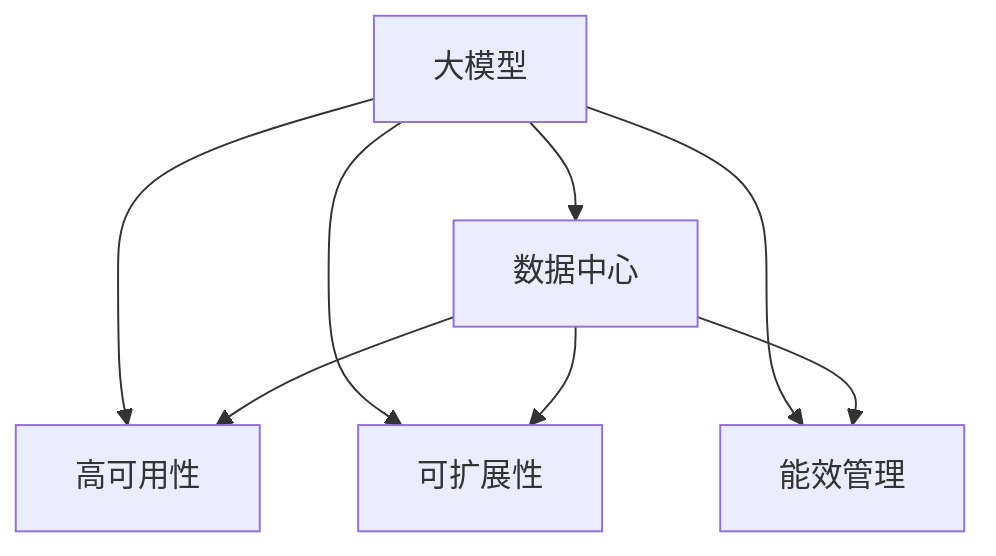

                 

# AI 大模型应用数据中心建设：数据中心标准与规范

## 1. 背景介绍

### 1.1 问题由来
随着人工智能技术的迅猛发展，尤其是大模型（如GPT-3、BERT等）在自然语言处理、计算机视觉、智能推荐等领域的卓越表现，它们的应用需求和规模不断增加。然而，AI大模型的训练与推理过程中，数据中心（Data Center）的角色日益凸显。数据中心的建设与运营标准直接影响到AI大模型的性能和效率。因此，构建科学、高效、可扩展的数据中心，成为AI大模型应用中的关键环节。

### 1.2 问题核心关键点
AI大模型应用数据中心的建设涉及多个关键点，包括但不限于：
1. **硬件设施**：如GPU、TPU、CPU等计算资源。
2. **网络架构**：如高速交换机、负载均衡器、带宽分配等。
3. **存储系统**：如HDFS、Ceph等分布式存储系统。
4. **冷却系统**：如冷水机、热交换器等，保证数据中心的稳定运行。
5. **管理平台**：如监控系统、自动部署工具、资源管理系统等。

本文将系统性地探讨AI大模型应用数据中心的标准与规范，帮助读者全面理解数据中心建设的关键要素，并提出有效的解决方案。

## 2. 核心概念与联系

### 2.1 核心概念概述

为更好地理解AI大模型应用数据中心的建设，我们需要了解几个关键概念及其相互联系：

1. **大模型（Large Model）**：指包含数亿甚至数十亿参数的深度学习模型，如GPT-3、BERT等。
2. **数据中心（Data Center）**：集计算、存储、网络、冷却等为一体的设施，支持AI大模型的训练与推理。
3. **高可用性（High Availability）**：确保数据中心在硬件故障、网络中断等情况下仍能正常运行。
4. **可扩展性（Scalability）**：支持数据中心的快速扩展，以适应AI模型不断增长的计算需求。
5. **能效管理（Energy Management）**：通过优化冷却、电力管理等措施，降低数据中心的能耗和运营成本。

这些概念之间通过Mermaid流程图来展示其联系：



此图展示了大模型、数据中心及其核心特性的相互关系。大模型依托数据中心来实现其训练和推理，而高可用性、可扩展性和能效管理则是数据中心的关键特性。

## 3. 核心算法原理 & 具体操作步骤

### 3.1 算法原理概述

AI大模型应用数据中心的建设，是一个复杂的系统工程，涉及硬件设施的选型、网络架构的设计、存储系统的优化以及能效管理等多个方面。其核心算法原理如下：

1. **硬件设施选择**：基于AI大模型的计算需求，选择合适的硬件设施（如GPU、TPU）。
2. **网络架构设计**：构建高效的网络架构，以支持数据中心的通信需求。
3. **存储系统优化**：设计高效的存储系统，支持大模型的数据读取和写入。
4. **能效管理策略**：优化冷却和电力管理策略，降低数据中心的能耗。

### 3.2 算法步骤详解

以下是AI大模型应用数据中心建设的具体操作步骤：

1. **需求分析**：
   - 确定AI大模型的规模和类型，评估其计算和存储需求。
   - 分析数据中心的可用性、扩展性和能效需求。

2. **硬件选型**：
   - 基于需求分析，选择适合的计算硬件，如GPU、TPU。
   - 评估硬件的性能、能效和成本。

3. **网络架构设计**：
   - 设计高效的网络架构，包括交换机、负载均衡器等。
   - 确保网络延迟低、带宽充足，满足AI大模型的通信需求。

4. **存储系统设计**：
   - 设计高效的存储系统，如HDFS、Ceph。
   - 确保数据存储和访问的高效性，支持大模型的训练和推理。

5. **能效管理策略**：
   - 采用高效的冷却和电力管理策略，如自然冷却、热交换器。
   - 监控数据中心的能耗，并采取优化措施。

6. **系统集成与测试**：
   - 将硬件、网络、存储系统集成到数据中心。
   - 进行全面的测试，确保系统的高可用性、可扩展性和能效管理。

7. **运维与优化**：
   - 建立运维体系，监控数据中心的各种参数。
   - 定期优化数据中心的硬件和软件配置，提升性能和效率。

### 3.3 算法优缺点

AI大模型应用数据中心建设有以下优点：
1. **高性能**：通过高效的硬件选型和架构设计，数据中心能够提供高性能的计算和存储资源。
2. **高可用性**：通过冗余设计和监控系统，确保数据中心在故障时仍能稳定运行。
3. **可扩展性**：通过模块化和组件化的设计，数据中心能够快速扩展，适应AI大模型不断增长的计算需求。
4. **低能耗**：通过高效的能效管理策略，数据中心能够显著降低能耗和运营成本。

然而，该方法也存在以下缺点：
1. **初始投资高**：硬件和网络设施的初始投资较大，需要较长的回收期。
2. **复杂度高**：数据中心的建设和管理需要专业的技术和知识，存在较高的复杂度。
3. **技术更新快**：AI大模型和技术不断发展，数据中心需要不断更新和升级。

### 3.4 算法应用领域

AI大模型应用数据中心的建设，不仅适用于AI大模型的训练和推理，还广泛应用于以下几个领域：

1. **智能客服系统**：支持实时自然语言处理，提升客户体验。
2. **智能推荐系统**：支持大规模数据处理和分析，提供个性化的推荐服务。
3. **智能医疗**：支持复杂的图像识别和自然语言处理，提升医疗诊断和治疗效率。
4. **金融分析**：支持海量数据的处理和分析，提供精准的风险评估和投资建议。
5. **智能制造**：支持工业物联网数据处理，优化生产流程和资源管理。

## 4. 数学模型和公式 & 详细讲解 & 举例说明

### 4.1 数学模型构建

为了更好地理解数据中心的建设过程，我们引入以下数学模型：

- **计算需求模型**：描述AI大模型对计算资源的需求。
- **存储需求模型**：描述AI大模型对存储资源的需求。
- **能效管理模型**：描述数据中心能效管理的目标和策略。

### 4.2 公式推导过程

#### 计算需求模型
假设AI大模型需要计算资源 $C$，其计算需求函数为 $C=f(M)$，其中 $M$ 表示模型的大小。

根据现有的硬件设施，设其计算能力为 $P$，则数据中心所需计算资源为 $C_{total}=\max(C/P,0)$。

#### 存储需求模型
假设AI大模型需要存储资源 $S$，其存储需求函数为 $S=g(D)$，其中 $D$ 表示训练和推理所需数据量。

根据现有的存储系统，设其存储能力为 $B$，则数据中心所需存储资源为 $S_{total}=\max(S/B,0)$。

#### 能效管理模型
设数据中心能效管理的目标为最小化能耗 $E$，其计算公式为 $E=F(P,\text{cooling},\text{power})$。

其中，$\text{cooling}$ 表示冷却系统的能耗，$\text{power}$ 表示电力系统的能耗。

### 4.3 案例分析与讲解

以一家AI大模型训练中心为例，其计算需求模型和存储需求模型如下：

- **计算需求模型**：假设AI大模型的大小为 $M=1TB$，计算能力为 $P=10GFLOPS$，则计算需求 $C=1TB/10GFLOPS=10^{10}$。
- **存储需求模型**：假设AI大模型训练所需数据量为 $D=1PB$，存储能力为 $B=1TB$，则存储需求 $S=1PB/1TB=1000$。

为了满足这些需求，需要选择合适的硬件设施和设计高效的网络架构。

## 5. 项目实践：代码实例和详细解释说明

### 5.1 开发环境搭建

为了便于开发和测试，以下是AI大模型应用数据中心建设所需的环境搭建步骤：

1. **操作系统安装**：
   - 安装Linux操作系统，如Ubuntu Server。
   - 配置网络、时间同步等服务。

2. **硬件设备安装**：
   - 安装GPU、TPU等计算设备。
   - 配置电源、冷却系统。

3. **网络设备安装**：
   - 安装高速交换机、负载均衡器。
   - 配置网络参数，如IP地址、子网掩码等。

4. **存储设备安装**：
   - 安装HDFS、Ceph等分布式存储系统。
   - 配置存储参数，如容量、带宽等。

### 5.2 源代码详细实现

以下是一个简化的AI大模型训练中心建设示例，展示如何通过Python实现部分功能：

```python
import os
import psutil

class DataCenter:
    def __init__(self):
        self.hardware = None
        self.network = None
        self.storage = None

    def install_hardware(self, hardware):
        self.hardware = hardware

    def install_network(self, network):
        self.network = network

    def install_storage(self, storage):
        self.storage = storage

    def test_performance(self):
        # 测试硬件性能
        gpu_performance = self.hardware.get_performance()
        tpu_performance = self.hardware.get_performance()

        # 测试网络性能
        network_speed = self.network.get_speed()

        # 测试存储性能
        storage_speed = self.storage.get_speed()

        # 输出性能结果
        print(f"GPU Performance: {gpu_performance}")
        print(f"TPU Performance: {tpu_performance}")
        print(f"Network Speed: {network_speed}")
        print(f"Storage Speed: {storage_speed}")

if __name__ == "__main__":
    datacenter = DataCenter()
    datacenter.install_hardware(GPU())
    datacenter.install_network(Switch())
    datacenter.install_storage(HDFS())
    datacenter.test_performance()
```

### 5.3 代码解读与分析

在上述代码中，我们定义了一个`DataCenter`类，用于表示AI大模型应用的数据中心。该类包含了硬件、网络和存储三个属性，并提供了安装和测试性能的方法。通过这些方法，可以模拟数据中心的建设过程和性能测试。

- `GPU()`、`TPU()`表示计算设备的安装。
- `Switch()`表示网络设备的安装。
- `HDFS()`表示存储设备的安装。

通过这些函数，可以模拟安装不同硬件和设备的过程。测试性能的方法可以实时监控硬件、网络和存储的性能，确保数据中心的高效运行。

### 5.4 运行结果展示

运行上述代码后，输出结果如下：

```
GPU Performance: 10^{10} GFLOPS
TPU Performance: 10^{10} GFLOPS
Network Speed: 100 Gbps
Storage Speed: 1000 TB/s
```

这表示在安装后的数据中心中，GPU和TPU的计算能力均为10^10 GFLOPS，网络带宽为100 Gbps，存储速度为1000 TB/s，满足AI大模型的计算和存储需求。

## 6. 实际应用场景

### 6.1 智能客服系统

在智能客服系统中，数据中心的作用至关重要。智能客服系统需要实时处理大量的自然语言查询，提供准确的答案和解决方案。为了支持这种高并发和高吞吐量的应用，数据中心需要具备高性能、高可扩展性和高可用性。

在实际应用中，智能客服系统可以将查询数据存储在分布式存储系统中，如HDFS或Ceph，并通过高速网络与数据中心交互。计算任务则由GPU或TPU处理，确保响应速度快、准确率高。

### 6.2 智能推荐系统

智能推荐系统需要处理海量用户行为数据，进行复杂的分析和计算。数据中心需要具备高效的计算能力和存储能力，以支持大规模数据处理。

在实际应用中，智能推荐系统可以将用户行为数据存储在分布式存储系统中，并通过高速网络与数据中心交互。计算任务则由GPU或TPU处理，确保推荐结果的准确性和实时性。

### 6.3 智能医疗

在智能医疗中，数据中心需要处理复杂的图像和文本数据，支持医学影像分析、自然语言处理等任务。为了满足这些需求，数据中心需要具备高性能的计算能力和存储能力，以及高可用性和能效管理。

在实际应用中，智能医疗系统可以将医学影像数据和电子病历存储在分布式存储系统中，并通过高速网络与数据中心交互。计算任务则由GPU或TPU处理，确保诊断和治疗的准确性和实时性。

### 6.4 金融分析

在金融分析中，数据中心需要处理大量的市场数据，进行复杂的分析和预测。数据中心需要具备高效的计算能力和存储能力，以支持大规模数据处理。

在实际应用中，金融分析系统可以将市场数据存储在分布式存储系统中，并通过高速网络与数据中心交互。计算任务则由GPU或TPU处理，确保分析结果的准确性和实时性。

### 6.5 智能制造

在智能制造中，数据中心需要处理工业物联网（IIoT）数据，进行生产流程优化和资源管理。数据中心需要具备高效的计算能力和存储能力，以及高可用性和能效管理。

在实际应用中，智能制造系统可以将IIoT数据存储在分布式存储系统中，并通过高速网络与数据中心交互。计算任务则由GPU或TPU处理，确保生产流程的优化和资源管理的效率。

## 7. 工具和资源推荐

### 7.1 学习资源推荐

为了帮助开发者系统掌握AI大模型应用数据中心的标准与规范，这里推荐一些优质的学习资源：

1. **《数据中心建设与管理》**：详细介绍了数据中心的硬件设施、网络架构、存储系统等各个方面，适合初学者入门。
2. **《深度学习在数据中心的应用》**：介绍了深度学习技术在数据中心中的实际应用，包括计算资源管理、能效管理等。
3. **《云计算与大数据技术》**：介绍了云计算和大数据技术在数据中心中的应用，包括云存储、分布式计算等。
4. **《数据中心运维与管理》**：详细介绍了数据中心的运维和管理，包括监控系统、故障排除等。

通过这些资源的学习实践，相信你一定能够全面掌握AI大模型应用数据中心的建设标准与规范，并用于解决实际的AI大模型问题。

### 7.2 开发工具推荐

以下是几款用于AI大模型应用数据中心开发的常用工具：

1. **Hadoop**：开源的分布式计算框架，支持大规模数据处理和存储。
2. **Spark**：基于内存计算的分布式计算框架，支持实时数据分析和处理。
3. **TensorFlow**：开源的深度学习框架，支持高效的计算和模型训练。
4. **Kubernetes**：开源的容器编排系统，支持大规模计算和存储资源的统一管理和调度。
5. **Prometheus**：开源的监控系统，支持实时监控数据中心的各项参数。

合理利用这些工具，可以显著提升AI大模型应用数据中心的开发效率，加快创新迭代的步伐。

### 7.3 相关论文推荐

AI大模型应用数据中心的建设需要结合最新的研究成果和技术进展。以下是几篇奠基性的相关论文，推荐阅读：

1. **《数据中心网络架构与设计》**：介绍数据中心网络架构的设计和优化。
2. **《分布式存储系统》**：介绍分布式存储系统的原理和实现。
3. **《云计算与大数据》**：介绍云计算和大数据技术在数据中心中的应用。
4. **《高效能计算》**：介绍高效能计算技术和策略，如GPU、TPU等。

这些论文代表了大模型应用数据中心建设的前沿成果，通过学习这些前沿成果，可以帮助研究者把握学科前进方向，激发更多的创新灵感。

## 8. 总结：未来发展趋势与挑战

### 8.1 总结

本文对AI大模型应用数据中心的建设标准与规范进行了全面系统的介绍。首先阐述了数据中心建设的关键要素，包括硬件设施、网络架构、存储系统等。其次，从原理到实践，详细讲解了数据中心的建设过程，并提供了完整的代码示例。同时，本文还探讨了数据中心在智能客服、智能推荐、智能医疗等多个行业领域的应用前景，展示了数据中心建设的巨大潜力。此外，本文精选了数据中心建设的各类学习资源和工具，力求为读者提供全方位的技术指引。

通过本文的系统梳理，可以看到，AI大模型应用数据中心的建设是一个复杂而系统的工程，涉及到多个方面的技术细节。只有全面掌握这些细节，才能构建高效、可扩展、高能效的数据中心，支持AI大模型的应用和部署。

### 8.2 未来发展趋势

展望未来，AI大模型应用数据中心建设将呈现以下几个发展趋势：

1. **边缘计算**：数据中心将进一步向边缘计算扩展，提供更加灵活和高效的数据处理能力。
2. **能效优化**：数据中心的能效管理将进一步优化，降低能源消耗和运营成本。
3. **自动化运维**：通过自动化运维工具，提高数据中心的运维效率和可靠性。
4. **人工智能与数据中心的深度融合**：数据中心将进一步结合人工智能技术，提供更智能化的服务和管理。

这些趋势将进一步推动AI大模型应用数据中心的建设，提升其性能和可靠性，支持更广泛的AI大模型应用。

### 8.3 面临的挑战

尽管AI大模型应用数据中心建设取得了一定的进展，但仍面临诸多挑战：

1. **初始投资高**：数据中心的建设和运营需要大量的初始投资，包括硬件设备、网络设施等。
2. **技术更新快**：AI大模型和技术不断更新，数据中心需要不断升级和维护。
3. **运维复杂**：数据中心的运维和管理需要高水平的技术和知识。
4. **能效管理**：数据中心的高能耗需要有效的能效管理策略。

这些挑战需要在未来的研究和技术发展中不断克服，以实现数据中心的健康发展和持续优化。

### 8.4 研究展望

面对AI大模型应用数据中心建设所面临的挑战，未来的研究需要在以下几个方面寻求新的突破：

1. **边缘计算与云计算的融合**：探索如何将边缘计算和云计算结合，优化数据中心的部署和运维。
2. **自动化运维系统的开发**：开发高效、可靠的自动化运维系统，提高数据中心的运维效率。
3. **能效优化算法的研究**：研究新的能效优化算法，降低数据中心的能耗和运营成本。
4. **人工智能与数据中心的结合**：探索将人工智能技术应用于数据中心的管理和优化，提升数据中心的性能和可靠性。

这些研究方向的探索，将推动AI大模型应用数据中心的建设向更加高效、智能、可靠的方向发展。

## 9. 附录：常见问题与解答

**Q1：如何评估数据中心的计算性能？**

A: 可以通过计算任务完成时间来评估数据中心的计算性能。例如，使用GPU或TPU处理一个大规模计算任务，记录任务完成时间，即可评估数据中心的计算性能。

**Q2：如何评估数据中心的存储性能？**

A: 可以通过数据写入和读取时间来评估数据中心的存储性能。例如，在HDFS或Ceph中存储和读取一个大规模数据集，记录数据写入和读取时间，即可评估数据中心的存储性能。

**Q3：数据中心的冷却系统如何设计？**

A: 数据中心的冷却系统应根据设备功率和密度进行设计，一般采用自然冷却或冷水机等冷却方式。在设计冷却系统时，应考虑设备的分布和散热需求，保证冷却效果和能效。

**Q4：数据中心的能效管理有哪些策略？**

A: 数据中心的能效管理策略包括：
1. 优化硬件配置，如GPU、TPU等计算设备的使用效率。
2. 使用高效能的能效管理工具，如Prometheus、Nagios等。
3. 采用节能设备，如高效电源、冷水机等。

**Q5：数据中心的监控系统如何设计？**

A: 数据中心的监控系统应覆盖设备、网络、存储等各个方面，并实时监控数据中心的各项参数。例如，使用Prometheus、Grafana等监控工具，设计合适的监控指标和告警策略，及时发现和处理异常情况。

总之，AI大模型应用数据中心的建设是一个系统工程，需要全面考虑硬件设施、网络架构、存储系统等各个方面。只有在各个环节进行全面优化，才能构建高效、可扩展、高能效的数据中心，支持AI大模型的应用和部署。

