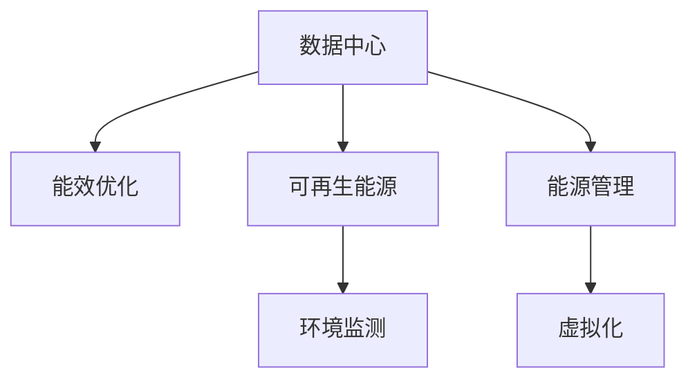

                 

# AI 大模型应用数据中心建设：数据中心绿色节能

## 1. 背景介绍

随着人工智能(AI)和大模型技术的快速发展，数据中心作为AI基础设施的重要组成部分，其绿色节能建设成为企业和社会关注的焦点。数据中心的能耗水平不仅影响到企业的可持续发展，也关系到全球的碳排放问题。在当前绿色环保意识不断增强的背景下，如何建设高效、绿色、可持续的数据中心，成为AI大模型应用的关键问题。

### 1.1 问题由来

人工智能和大模型的应用对计算资源的需求巨大，数据中心的能耗占比往往超过整个企业的能源消耗。例如，大型AI模型进行训练时，通常需要大量GPU资源，耗电量巨大。此外，数据中心的冷却系统、制冷剂使用等问题，也对环境造成潜在威胁。这些问题催生了绿色节能的数据中心建设需求。

### 1.2 问题核心关键点

绿色节能数据中心建设的核心关键点包括：

- **能效优化**：通过优化数据中心的设计和运营，提高其能效比，降低能耗。
- **可再生能源利用**：采用太阳能、风能等可再生能源，减少对化石能源的依赖。
- **资源回收利用**：实现数据中心设备的回收再利用，减少资源浪费。
- **环境监测**：建立实时环境监测系统，确保数据中心的环境友好性。

## 2. 核心概念与联系

### 2.1 核心概念概述

为更好地理解数据中心绿色节能建设，本节将介绍几个密切相关的核心概念：

- **数据中心(Data Center)**：提供计算、存储和网络服务的物理设施，包括服务器、网络设备、存储系统等。
- **能效比(Power Usage Effectiveness, PUE)**：衡量数据中心的整体能效，定义为数据中心总能耗除以IT设备总能耗的比值，PUE值越低，表示能效越高。
- **可再生能源(Renewable Energy)**：如太阳能、风能、水能等，通过利用可再生能源减少数据中心的碳排放。
- **能源管理(Energy Management)**：通过智能控制系统对数据中心能源消耗进行实时监控和管理，优化资源配置。
- **虚拟化(Virtualization)**：通过虚拟化技术，提高数据中心的资源利用率，减少硬件和能源的浪费。

这些核心概念之间的逻辑关系可以通过以下Mermaid流程图来展示：



这个流程图展示了大模型应用数据中心的核心概念及其之间的关系：

1. 数据中心通过能效优化、可再生能源利用、能源管理和虚拟化等手段，减少能耗和碳排放。
2. 环境监测系统实时监控数据中心运行状态，反馈优化决策。
3. 可再生能源和能源管理技术的结合，进一步提高数据中心的绿色节能水平。
4. 虚拟化技术提升资源利用率，减少硬件和能源的浪费。

这些概念共同构成了绿色节能数据中心的设计和运营框架，使其能够在高效、环保的前提下，满足大模型应用的计算需求。

## 3. 核心算法原理 & 具体操作步骤
### 3.1 算法原理概述

数据中心绿色节能建设，本质上是一个多目标优化问题。其核心思想是：在满足大模型应用高性能要求的前提下，通过优化数据中心的硬件设计、能源管理、环境控制等环节，最大化其能效比，降低能耗和碳排放。

形式化地，假设数据中心总能为 $E$，计算能为 $C$，则能效比 $PUE$ 定义为：

$$
PUE = \frac{E}{C}
$$

优化目标是在满足大模型应用性能要求的前提下，最小化 $PUE$，即：

$$
\min \frac{E}{C} \quad \text{subject to} \quad C \geq C_{\min}
$$

其中 $C_{\min}$ 为满足大模型应用性能需求的最小计算能。

### 3.2 算法步骤详解

数据中心绿色节能建设包括以下几个关键步骤：

**Step 1: 设计数据中心**

- 选择合适的物理位置，考虑气候、交通、电力等条件。
- 设计数据中心整体布局，包括服务器、网络设备、冷却系统等，以最大化能效。

**Step 2: 引入可再生能源**

- 部署太阳能光伏板、风力发电机等设备，收集可再生能源。
- 配置储能系统，如电池、超级电容等，储存富余的可再生能源。

**Step 3: 实施能源管理**

- 安装智能控制系统，实时监控数据中心能源消耗和运行状态。
- 应用算法优化能源分配，如动态负载均衡、热管冷却等技术。

**Step 4: 采用虚拟化技术**

- 部署虚拟化平台，如VMware、KVM等，对硬件资源进行抽象。
- 实现资源动态调整，提高数据中心资源利用率，减少硬件和能源浪费。

**Step 5: 实施环境监测**

- 部署环境监测系统，对数据中心内的温度、湿度、空气质量等进行实时监控。
- 根据监测数据，自动调节冷却系统和制冷剂使用，确保环境稳定。

**Step 6: 持续优化**

- 定期评估数据中心能效性能，收集反馈数据。
- 根据评估结果，不断优化数据中心设计和管理策略，提升能效水平。

### 3.3 算法优缺点

数据中心绿色节能建设方法具有以下优点：

1. 节能减排。通过优化设计和运营，可以显著降低数据中心的能耗和碳排放，符合绿色环保要求。
2. 降低运营成本。高效能的数据中心运行成本较低，有助于企业节能降耗，提升竞争力。
3. 提升用户体验。通过稳定、可靠、高效的数据中心，可以更好地支持大模型应用，提升用户体验。

同时，该方法也存在一定的局限性：

1. 建设成本较高。初期投资较大，包括设备、基础设施等，需要较高的预算支持。
2. 技术复杂度较高。数据中心绿色节能涉及多方面技术，如可再生能源、智能控制、环境监测等，技术要求较高。
3. 数据中心选址受限。绿色能源的获取受地理位置、气候等自然条件限制，建设地点选择有限。
4. 动态优化难度较大。数据中心环境复杂，能效优化需综合考虑多种因素，技术难度较大。

尽管存在这些局限性，但就目前而言，绿色节能的数据中心建设方法仍然是大模型应用的重要方向。未来相关研究的重点在于如何进一步降低建设成本，提高技术成熟度，同时兼顾性能和环保性等因素。

### 3.4 算法应用领域

数据中心绿色节能建设方法已经广泛应用于多个领域，例如：

- **互联网公司**：如Google、Amazon、Microsoft等，在多个数据中心实施绿色节能措施，提升企业形象和运营效率。
- **金融机构**：金融机构需要大规模数据处理和存储，绿色节能的数据中心建设能够降低运营成本，提升企业绿色金融形象。
- **科研机构**：科研机构需要高效计算资源支持大数据、高性能计算等任务，绿色节能的数据中心建设符合科研可持续发展的要求。
- **政府机构**：政府机构在建设公共数据中心时，考虑环保因素，推动社会绿色转型。

除了这些传统应用领域，绿色节能的数据中心建设还在不断拓展，例如在工业控制、智慧城市等领域的应用也逐渐增多。随着技术进步和社会意识的提升，相信数据中心绿色节能将成为AI大模型应用的重要趋势。

## 4. 数学模型和公式 & 详细讲解 & 举例说明

### 4.1 数学模型构建

本节将使用数学语言对绿色节能数据中心建设的过程进行更加严格的刻画。

设数据中心的总能为 $E$，计算能为 $C$，则能效比 $PUE$ 为：

$$
PUE = \frac{E}{C}
$$

优化目标是在满足大模型应用性能要求的前提下，最小化 $PUE$，即：

$$
\min \frac{E}{C} \quad \text{subject to} \quad C \geq C_{\min}
$$

其中 $C_{\min}$ 为满足大模型应用性能需求的最小计算能。

在实际操作中，我们可以将问题转化为多目标优化问题，即：

$$
\min \left\{\frac{E}{C}, F(\theta) \right\}
$$

其中 $F(\theta)$ 表示其他性能指标，如服务质量、稳定性和可靠性等，$\theta$ 为模型参数。

### 4.2 公式推导过程

以下我们以PUE为例，推导其最小化过程。

考虑一个数据中心，其总能耗包括计算能 $C$ 和冷却能 $H$。能效比 $PUE$ 为：

$$
PUE = \frac{E}{C} = \frac{C+H}{C} = 1 + \frac{H}{C}
$$

为了最小化 $PUE$，我们需要最小化 $\frac{H}{C}$。假设冷却能 $H$ 与计算能 $C$ 之间存在线性关系：

$$
H = kC
$$

其中 $k$ 为系数。则：

$$
PUE = 1 + k
$$

为了最小化 $PUE$，需要最小化 $k$。在实际数据中心中，通过优化冷却系统和制冷剂使用，可以显著降低 $k$ 值，从而提升能效比。

### 4.3 案例分析与讲解

假设一个数据中心有1000台服务器，每台服务器功率为1kW，则计算能为 $C = 1000kW$。假设冷却能 $H = 10\% \times C = 100kW$，则能效比为：

$$
PUE = 1 + \frac{H}{C} = 1 + 0.1 = 1.1
$$

通过优化冷却系统和制冷剂使用，可以降低冷却能 $H$ 至 $50kW$，则：

$$
PUE = 1 + \frac{H}{C} = 1 + 0.05 = 1.05
$$

由此可以看出，通过优化冷却系统，PUE值显著降低，能效提升显著。

## 5. 项目实践：代码实例和详细解释说明
### 5.1 开发环境搭建

在进行绿色节能数据中心建设实践前，我们需要准备好开发环境。以下是使用Python进行PyTorch开发的环境配置流程：

1. 安装Anaconda：从官网下载并安装Anaconda，用于创建独立的Python环境。

2. 创建并激活虚拟环境：
```bash
conda create -n pytorch-env python=3.8 
conda activate pytorch-env
```

3. 安装PyTorch：根据CUDA版本，从官网获取对应的安装命令。例如：
```bash
conda install pytorch torchvision torchaudio cudatoolkit=11.1 -c pytorch -c conda-forge
```

4. 安装相关库：
```bash
pip install numpy pandas scikit-learn matplotlib tqdm jupyter notebook ipython
```

完成上述步骤后，即可在`pytorch-env`环境中开始绿色节能数据中心建设实践。

### 5.2 源代码详细实现

这里我们以一个简单的绿色节能数据中心为例，给出使用Python进行绿色节能设计和管理实践的代码实现。

```python
import numpy as np

# 定义数据中心总能耗和计算能
total_energy = 1000  # 千瓦时
computational_energy = 1000  # 千瓦时

# 定义冷却能占计算能的比例
cooling_ratio = 0.1

# 计算能效比
PUE = 1 + cooling_ratio * total_energy / computational_energy

# 输出能效比
print(f"数据中心能效比为: {PUE:.3f}")
```

在上述代码中，我们首先定义了数据中心的总能耗和计算能，然后根据冷却能占计算能的比例计算了能效比。输出结果展示了当前数据中心的能效比。

### 5.3 代码解读与分析

可以看到，上述代码实现非常简单，但其原理是直观的。在实际应用中，数据中心的能效比计算会更加复杂，涉及更多的变量和参数。

例如，在实际数据中心中，我们需要考虑服务器数量、功率、冷却系统效率、制冷剂使用等多种因素，综合计算能效比。此外，还需要对数据中心进行实时监控，动态调整冷却系统参数，以实现最优能效比。

## 6. 实际应用场景
### 6.1 互联网公司

互联网公司如Google、Amazon、Microsoft等，已经在多个数据中心实施了绿色节能措施。这些措施包括：

- **使用高效能服务器**：如Google的Tensor Processing Unit (TPU)、Amazon的AWS Green Energy等，使用高效的计算设备降低能耗。
- **部署可再生能源**：如Google的Cherry Beach数据中心，利用太阳能、风能等可再生能源。
- **优化冷却系统**：如Google的Jaguar服务器，使用液冷技术降低冷却能耗。

这些措施显著提升了数据中心的能效比，降低了运营成本，提升了企业形象。

### 6.2 金融机构

金融机构需要大规模数据处理和存储，绿色节能的数据中心建设能够降低运营成本，提升企业绿色金融形象。例如，高盛公司（Goldman Sachs）在瑞典哥德堡建设了一个绿色数据中心，使用风能、太阳能等可再生能源，显著降低了能源消耗和运营成本。

### 6.3 科研机构

科研机构需要高效计算资源支持大数据、高性能计算等任务，绿色节能的数据中心建设符合科研可持续发展的要求。例如，德国马克斯·普朗克研究所（Max Planck Institute）在其新数据中心部署了太阳能光伏板和风力发电机，显著降低了能耗和运营成本。

### 6.4 政府机构

政府机构在建设公共数据中心时，考虑环保因素，推动社会绿色转型。例如，韩国政府在Seoul建设了绿色数据中心，使用太阳能、风能等可再生能源，为政府数据中心提供高效、环保的计算环境。

## 7. 工具和资源推荐
### 7.1 学习资源推荐

为了帮助开发者系统掌握绿色节能数据中心建设的理论基础和实践技巧，这里推荐一些优质的学习资源：

1. **《数据中心绿色设计与运营》**：由数据中心领域专家撰写，深入浅出地介绍了数据中心绿色设计和运营的理论和实践。
2. **《数据中心能效管理》**：介绍数据中心能效管理和优化技术，包括智能控制系统、能源监测等。
3. **《数据中心可再生能源应用》**：介绍太阳能、风能等可再生能源在数据中心的应用。
4. **Google Cloud文档**：Google云平台提供的数据中心绿色节能文档，包括实践案例和最佳实践。

通过对这些资源的学习实践，相信你一定能够快速掌握绿色节能数据中心建设的精髓，并用于解决实际的AI大模型应用问题。

### 7.2 开发工具推荐

高效的开发离不开优秀的工具支持。以下是几款用于绿色节能数据中心建设开发的常用工具：

1. **Jupyter Notebook**：Python数据分析和机器学习的标准开发环境，支持代码运行、数据可视化等。
2. **TensorBoard**：TensorFlow配套的可视化工具，可实时监测模型训练状态，提供丰富的图表呈现方式。
3. **WEKA**：开源数据挖掘和机器学习平台，支持数据预处理、特征工程、模型评估等。
4. **Ansible**：自动化IT管理工具，可用于部署和管理数据中心设备。

合理利用这些工具，可以显著提升绿色节能数据中心建设的开发效率，加快创新迭代的步伐。

### 7.3 相关论文推荐

绿色节能数据中心建设的研究主要集中于以下几个方向：

1. **《数据中心绿色设计研究综述》**：总结了数据中心绿色设计的最新进展和趋势。
2. **《数据中心能效优化技术研究》**：探讨了数据中心能效优化的技术手段和方法。
3. **《数据中心可再生能源应用研究》**：研究了太阳能、风能等可再生能源在数据中心中的应用。
4. **《数据中心环境监测与控制技术》**：介绍了数据中心环境监测和控制的最新技术。

这些论文代表了大模型应用数据中心绿色节能技术的发展脉络。通过学习这些前沿成果，可以帮助研究者把握学科前进方向，激发更多的创新灵感。

## 8. 总结：未来发展趋势与挑战
### 8.1 总结

本文对绿色节能数据中心建设进行了全面系统的介绍。首先阐述了绿色节能数据中心建设的背景和意义，明确了绿色节能在大模型应用中的重要性。其次，从原理到实践，详细讲解了绿色节能数据中心的数学模型和具体操作步骤，给出了绿色节能数据中心建设的全流程代码实现。同时，本文还广泛探讨了绿色节能数据中心在互联网公司、金融机构、科研机构和政府机构等领域的实际应用，展示了绿色节能数据中心的广泛应用前景。此外，本文精选了绿色节能数据中心的各类学习资源，力求为读者提供全方位的技术指引。

通过本文的系统梳理，可以看到，绿色节能数据中心建设是大模型应用的重要支撑，能够显著提升数据中心的能效比，降低能耗和碳排放，满足可持续发展的要求。未来，伴随绿色节能技术的不断进步，数据中心绿色节能必将成为AI大模型应用的重要趋势，推动AI技术向绿色、智能、可持续的方向发展。

### 8.2 未来发展趋势

展望未来，绿色节能数据中心建设将呈现以下几个发展趋势：

1. **可再生能源占比提升**：随着可再生能源技术的进步，更多数据中心将大规模采用太阳能、风能等可再生能源，进一步降低碳排放。
2. **智能控制系统普及**：智能控制系统将广泛应用于数据中心，实现能效优化和资源动态调整，提升数据中心运行效率。
3. **虚拟化技术应用深化**：虚拟化技术将进一步深化，实现更高效的资源利用和动态调整，提升数据中心资源利用率。
4. **环境监测技术升级**：环境监测技术将进一步升级，实现更全面、更准确的环境监控，提升数据中心的环境友好性。
5. **跨数据中心协同优化**：多数据中心的协同优化将逐步实现，通过数据中心间的协同管理，提升整体能效比。

这些趋势凸显了绿色节能数据中心建设的广阔前景，将进一步推动数据中心向高效、环保、智能的方向发展。

### 8.3 面临的挑战

尽管绿色节能数据中心建设取得了不少进展，但仍面临诸多挑战：

1. **建设成本高**：初期投资较大，包括设备、基础设施等，需要较高的预算支持。
2. **技术复杂度高**：涉及可再生能源、智能控制、环境监测等多种技术，技术要求较高。
3. **数据中心选址受限**：绿色能源的获取受地理位置、气候等自然条件限制，建设地点选择有限。
4. **动态优化难度大**：数据中心环境复杂，能效优化需综合考虑多种因素，技术难度较大。

尽管存在这些挑战，但通过技术创新和政策支持，绿色节能数据中心建设有望进一步突破，为AI大模型应用提供更高效、环保、智能的计算环境。

### 8.4 研究展望

面向未来，绿色节能数据中心建设需要在以下几个方面进行进一步研究：

1. **新技术探索**：探索更多绿色能源技术和新材料，如碳捕捉、存储等，进一步降低数据中心碳排放。
2. **智能算法优化**：研发更高效的智能算法，优化数据中心能源分配和管理，提升能效比。
3. **跨领域融合**：结合其他AI技术，如物联网、区块链等，实现数据中心全面智能化管理。
4. **社会责任实践**：加强社会责任实践，推动数据中心绿色节能技术的普及和应用。

这些研究方向将进一步推动绿色节能数据中心建设的发展，为AI大模型应用提供更高效、环保、智能的计算环境。

## 9. 附录：常见问题与解答

**Q1：绿色节能数据中心建设是否适用于所有数据中心？**

A: 绿色节能数据中心建设在技术上适用于所有数据中心，但在实际应用中需考虑数据中心的规模、类型、地理位置等因素。对于小型数据中心，绿色节能建设可能成本较高，不太适宜。对于大型数据中心，绿色节能建设能够显著提升能效，降低运营成本。

**Q2：绿色节能数据中心建设对大模型应用有何影响？**

A: 绿色节能数据中心建设能够显著提升大模型应用的性能和可靠性，降低运营成本，提升企业绿色形象。通过使用高效能服务器和可再生能源，数据中心能够满足大模型应用的计算需求，同时降低能耗和碳排放，符合可持续发展要求。

**Q3：绿色节能数据中心建设是否影响数据中心的计算性能？**

A: 绿色节能数据中心建设对计算性能的影响较小，通过优化冷却系统、智能控制等手段，能够提升数据中心的运行效率，满足大模型应用的性能需求。当然，在实际应用中，还需要根据具体需求进行平衡优化。

**Q4：如何评估绿色节能数据中心的能效比？**

A: 评估绿色节能数据中心的能效比需要综合考虑多个因素，如总能耗、计算能、冷却能、环境监测数据等。通常使用能效比PUE作为主要指标，结合其他性能指标进行综合评估。

**Q5：绿色节能数据中心建设对企业有哪些潜在收益？**

A: 绿色节能数据中心建设对企业的潜在收益包括：

1. 降低运营成本：使用高效能服务器和可再生能源，显著降低能源消耗和运营成本。
2. 提升企业形象：绿色节能建设提升企业绿色形象，增强品牌影响力。
3. 提升计算性能：通过优化冷却系统和智能控制等手段，提升数据中心运行效率和计算性能。
4. 符合政策要求：绿色节能建设符合环保政策和法规要求，避免潜在的法律风险。

总之，绿色节能数据中心建设在降低成本、提升性能、增强品牌等方面具有显著优势，能够为企业的可持续发展做出重要贡献。

---

作者：禅与计算机程序设计艺术 / Zen and the Art of Computer Programming

