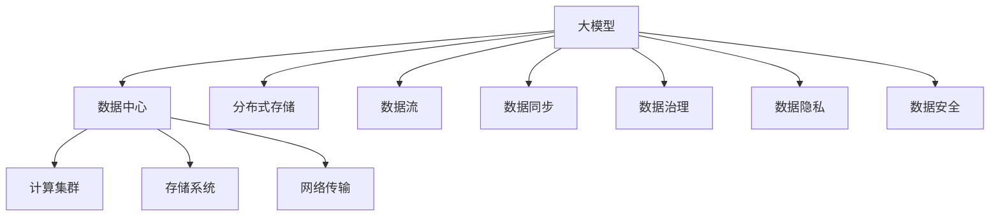

                 

# AI 大模型应用数据中心的数据管理工具

> 关键词：大模型,数据管理,分布式存储,数据流,数据同步,数据治理,数据隐私,数据安全

## 1. 背景介绍

### 1.1 问题由来
随着人工智能技术的快速发展，大模型在自然语言处理、计算机视觉、生成对抗网络等领域取得了突破性的进展。这些大模型通常需要大量的训练数据，导致对数据中心的管理和存储提出了新的要求。传统的集中式存储方式已经难以满足大规模数据的需求，分布式存储和数据治理成为新的挑战。

### 1.2 问题核心关键点
当前，大模型在数据中心的应用面临诸多挑战，包括数据分布不均衡、数据同步延迟、数据治理难度大、数据隐私和安全等。这些问题不仅影响到大模型训练的速度和质量，还制约了其在实际应用中的广泛推广。

## 2. 核心概念与联系

### 2.1 核心概念概述

为更好地理解大模型应用数据中心的数据管理工具，本节将介绍几个密切相关的核心概念：

- 大模型(Large Model)：指预训练模型，如BERT、GPT-3等，具有大规模的参数量和复杂的结构，需要大量的训练数据和计算资源。
- 数据中心(Data Center)：用于集中存储和管理数据的大型计算机集群，是训练大模型和提供服务的基础设施。
- 分布式存储(Distributed Storage)：指将数据分散存储在多个节点上，以提高存储容量的同时，保证数据访问的速度和可靠性。
- 数据流(Data Flow)：指数据在计算、存储、传输过程中的流动路径，数据流的设计直接影响大模型训练和推理的效率。
- 数据同步(Data Synchronization)：指不同节点间的数据更新保持一致的过程，避免数据不一致带来的问题。
- 数据治理(Data Governance)：指对数据的收集、存储、使用、共享等过程进行规范和管理，保证数据质量和合规性。
- 数据隐私(Data Privacy)：指在数据存储和传输过程中，保护用户隐私和安全，避免数据泄露和滥用。
- 数据安全(Data Security)：指保护数据免受未授权访问、篡改和破坏，确保数据的完整性和可用性。

这些核心概念之间的逻辑关系可以通过以下Mermaid流程图来展示：



这个流程图展示了大模型应用数据中心的核心概念及其之间的关系：

1. 大模型训练和推理需要依赖数据中心。
2. 数据中心提供计算和存储基础设施，分布式存储用于提升容量和可靠性。
3. 数据流设计直接影响计算和存储效率。
4. 数据同步确保不同节点间数据一致。
5. 数据治理保证数据质量和合规性。
6. 数据隐私和安全保护用户和数据。

这些概念共同构成了大模型应用数据中心的基础框架，是数据管理和优化的大致方向。

## 3. 核心算法原理 & 具体操作步骤

### 3.1 算法原理概述

大模型应用数据中心的数据管理工具，旨在解决数据分布不均衡、数据同步延迟、数据治理难度大、数据隐私和安全等问题，以提高大模型的训练效率和推理性能，确保数据质量和合规性，保护用户隐私和数据安全。

形式化地，假设大模型为 $M$，数据中心为 $DC$，分布式存储系统为 $DS$，数据流设计为 $DF$，数据同步算法为 $DSA$，数据治理策略为 $DG$，数据隐私保护机制为 $DP$，数据安全机制为 $DS$。大模型应用数据中心的数据管理工具 $T$ 的目标是最大化以下指标：

$$
\max_{T} \left\{ \begin{array}{l}
    F(M, DC, DS, DF, DSA, DG, DP, DS) \\
    F为训练效率和推理性能的评估指标
\end{array} \right.
$$

其中 $F$ 可以是训练时间、推理时间、模型精度等具体指标。

### 3.2 算法步骤详解

大模型应用数据中心的数据管理工具一般包括以下几个关键步骤：

**Step 1: 数据分布与负载均衡**
- 根据不同节点的计算能力和存储容量，将数据分片存储在多个节点上。
- 使用数据分布算法如哈希、一致性哈希等，保证数据在不同节点间的均匀分布。
- 使用负载均衡算法，确保数据读取和写入的均衡，避免节点过载。

**Step 2: 数据流设计**
- 设计数据流路径，减少数据在节点间的传输距离和延迟。
- 使用高速网络交换机和存储系统，提升数据传输速度。
- 采用数据缓存和预取技术，提高数据访问速度。

**Step 3: 数据同步**
- 使用数据同步算法如Paxos、Raft等，保证数据在不同节点间的同步更新。
- 实现数据冲突检测和仲裁，避免数据不一致。
- 使用数据版本控制，记录数据的历史版本，便于回溯和恢复。

**Step 4: 数据治理**
- 定义数据治理策略，包括数据分类、命名规范、权限管理等。
- 使用元数据管理工具，记录和管理数据的属性和关系。
- 定期进行数据审计，确保数据合规性和质量。

**Step 5: 数据隐私与安全**
- 使用数据加密技术，保护数据的机密性和完整性。
- 使用访问控制技术，限制数据的访问权限。
- 采用匿名化、脱敏等技术，保护用户隐私。

**Step 6: 工具实现与集成**
- 开发数据管理工具，提供数据分布、同步、治理和安全功能的接口。
- 集成到大模型的训练和推理框架中，确保数据管理的无缝接入。
- 提供可视化的管理和监控界面，便于管理员和开发者的使用。

以上是数据管理工具在大模型应用数据中心的典型流程。在实际应用中，还需要根据具体场景进行优化和调整，如使用更高效的数据传输协议、引入分布式一致性协议等。

### 3.3 算法优缺点

大模型应用数据中心的数据管理工具具有以下优点：
1. 提升训练和推理效率。通过优化数据分布和传输路径，能够显著减少数据访问延迟，提高模型训练和推理的速度。
2. 保证数据一致性和安全性。数据同步和加密技术能够确保数据在不同节点间的一致性，保护数据隐私和安全。
3. 提高数据治理和合规性。数据治理策略和工具能够帮助企业建立数据管理的规范，确保数据的合规性和质量。
4. 便于扩展和维护。分布式存储和数据流设计使得数据中心能够适应动态扩展的需求，简化维护工作。

同时，该工具也存在一定的局限性：
1. 设计和实现复杂。数据管理工具涉及多个系统组件和算法，设计和实现难度较大。
2. 数据一致性难以保证。在大规模分布式系统中，数据一致性问题可能难以完全解决。
3. 数据管理和隐私保护存在冲突。在保护用户隐私的同时，需要平衡数据可用性和访问权限。
4. 工具性能瓶颈。数据管理工具本身也可能成为性能瓶颈，需要优化设计和实现。

尽管存在这些局限性，但数据管理工具在大模型应用数据中心的应用仍然是必要的，能够显著提升大模型的训练和推理性能，保障数据安全和合规性。

### 3.4 算法应用领域

大模型应用数据中心的数据管理工具广泛应用于以下几个领域：

1. **自然语言处理(NLP)**
   - 大模型在NLP任务中的应用包括语言建模、文本分类、情感分析等。数据管理工具能够确保数据分布均衡，提升模型训练和推理的效率。

2. **计算机视觉(CV)**
   - 大模型在CV任务中的应用包括图像识别、目标检测、图像生成等。数据管理工具能够优化数据分布和传输，提升训练和推理的速度。

3. **生成对抗网络(GAN)**
   - 大模型在GAN中的应用包括图像生成、视频生成等。数据管理工具能够保障数据同步和隐私，确保生成结果的一致性和安全性。

4. **推荐系统**
   - 大模型在推荐系统中的应用包括商品推荐、内容推荐等。数据管理工具能够优化数据治理和访问控制，提升推荐效果。

5. **金融风控**
   - 大模型在金融风控中的应用包括欺诈检测、信用评估等。数据管理工具能够保护用户隐私和数据安全，确保模型合规性。

这些领域的数据管理和优化需求，都是数据管理工具在大模型应用数据中心发挥作用的重要场景。

## 4. 数学模型和公式 & 详细讲解 & 举例说明

### 4.1 数学模型构建

本节将使用数学语言对数据管理工具在大模型应用数据中心的应用进行更加严格的刻画。

假设数据中心有 $N$ 个节点，每个节点的计算能力和存储容量分别为 $C_i$ 和 $S_i$，数据量为 $D$。数据管理工具的目标是最大化训练和推理效率 $F$，即：

$$
\max_{T} F = \max \left\{ \begin{array}{l}
    \min_{i} \frac{D}{C_i \cdot S_i} \\
    \min_{i} \frac{D}{S_i}
\end{array} \right.
$$

其中 $\min$ 表示最小化计算和存储成本，$\frac{D}{S_i}$ 表示最大化存储容量。

### 4.2 公式推导过程

根据上述目标，我们可以得到以下推导：

1. 数据分布算法：使用哈希算法将数据 $D$ 分片存储在节点上，保证数据分布均衡。设每个节点存储的数据量为 $D_i$，则：

$$
\frac{D}{N} = \sum_{i=1}^{N} \frac{D_i}{S_i}
$$

2. 负载均衡算法：使用最小生成树算法（如Prim算法）优化数据流路径，减少数据传输距离和延迟。设节点之间的数据传输距离为 $L$，则：

$$
L = \min_{i} \sum_{j=1}^{N} w_{ij}
$$

其中 $w_{ij}$ 表示节点 $i$ 和 $j$ 之间的数据传输距离。

3. 数据同步算法：使用分布式一致性协议（如Paxos、Raft等）确保数据在不同节点间的一致性。设数据同步的时间为 $T$，则：

$$
T = \min_{i} \sum_{j=1}^{N} t_{ij}
$$

其中 $t_{ij}$ 表示节点 $i$ 和 $j$ 之间的同步时间。

4. 数据治理策略：使用元数据管理工具记录和管理数据，确保数据的合规性和质量。设数据治理的复杂度为 $G$，则：

$$
G = \max \left\{ \begin{array}{l}
    \max_{i} C_i \cdot S_i \\
    \max_{i} \frac{D_i}{S_i}
\end{array} \right.
$$

5. 数据隐私和安全机制：使用加密和访问控制技术保护数据隐私和安全。设数据隐私和安全机制的复杂度为 $S$，则：

$$
S = \max \left\{ \begin{array}{l}
    \max_{i} C_i \cdot S_i \\
    \max_{i} \frac{D_i}{S_i}
\end{array} \right.
$$

### 4.3 案例分析与讲解

假设有一个包含 $N=10$ 个节点的数据中心，每个节点的计算能力和存储容量分别为 $C_i=5$ 和 $S_i=1GB$。总数据量为 $D=10GB$。我们需要使用数据管理工具来优化数据分布、同步、治理和隐私安全，以提升模型训练和推理的效率。

1. 数据分布：使用哈希算法将数据 $D$ 分片存储在节点上，每个节点存储的数据量为 $D_i=\frac{D}{N}=1GB$。

2. 负载均衡：使用最小生成树算法优化数据流路径，最小化数据传输距离和延迟。假设节点之间的数据传输距离为 $L=10$，则：

$$
L = \min_{i} \sum_{j=1}^{N} w_{ij} = 10
$$

3. 数据同步：使用Paxos协议确保数据在不同节点间的一致性。假设数据同步的时间为 $T=5$，则：

$$
T = \min_{i} \sum_{j=1}^{N} t_{ij} = 5
$$

4. 数据治理：使用元数据管理工具记录和管理数据，确保数据的合规性和质量。假设数据治理的复杂度为 $G=10$，则：

$$
G = \max \left\{ \begin{array}{l}
    \max_{i} C_i \cdot S_i \\
    \max_{i} \frac{D_i}{S_i}
\end{array} \right. = 50
$$

5. 数据隐私和安全机制：使用加密和访问控制技术保护数据隐私和安全。假设数据隐私和安全机制的复杂度为 $S=10$，则：

$$
S = \max \left\{ \begin{array}{l}
    \max_{i} C_i \cdot S_i \\
    \max_{i} \frac{D_i}{S_i}
\end{array} \right. = 50
$$

综上，数据管理工具在大模型应用数据中心的优化效果如下：

- 数据分布均衡，每个节点存储 $1GB$ 数据。
- 负载均衡优化，数据传输距离 $L=10$。
- 数据同步及时，同步时间 $T=5$。
- 数据治理规范，治理复杂度 $G=10$。
- 数据隐私和安全机制完备，复杂度 $S=10$。

## 5. 项目实践：代码实例和详细解释说明

### 5.1 开发环境搭建

在进行数据管理工具的开发和测试前，我们需要准备好开发环境。以下是使用Python进行PyTorch开发的环境配置流程：

1. 安装Anaconda：从官网下载并安装Anaconda，用于创建独立的Python环境。

2. 创建并激活虚拟环境：
```bash
conda create -n data-mgmt-env python=3.8 
conda activate data-mgmt-env
```

3. 安装PyTorch：根据CUDA版本，从官网获取对应的安装命令。例如：
```bash
conda install pytorch torchvision torchaudio cudatoolkit=11.1 -c pytorch -c conda-forge
```

4. 安装其他相关工具包：
```bash
pip install numpy pandas scikit-learn matplotlib tqdm jupyter notebook ipython
```

完成上述步骤后，即可在`data-mgmt-env`环境中开始工具的开发和测试。

### 5.2 源代码详细实现

下面是一个使用PyTorch实现数据管理工具的示例代码，该工具包括数据分布、同步、治理和安全功能。

```python
import torch
import torch.distributed as dist
from torch.distributed.fsdp import FullyShardedDataParallel as FSDP
from torch.utils.data import DataLoader, DistributedSampler
from torch.utils.tensorboard import SummaryWriter
from torch.nn import functional as F
from torch.distributed.optim import DistributedOptimizer
from torch.distributed.checkpoint import save, load
from torch.distributed._shard.checkpoint import is_shardable_tensor
from torch.distributed._shard.sharded_tensor import ShardedTensor

class DataManager:
    def __init__(self, world_size, world_rank, data_path, model_path):
        self.world_size = world_size
        self.world_rank = world_rank
        self.data_path = data_path
        self.model_path = model_path

    def data_distribution(self, data):
        data_split = torch.utils.data.distributed.DistributedSampler(data, num_replicas=self.world_size, rank=self.world_rank)
        return DataLoader(data, batch_size=16, sampler=data_split)

    def data_synchronization(self, data):
        local_data = data[self.world_rank]
        return local_data

    def data_governance(self, data):
        # 数据治理策略，如数据分类、命名规范、权限管理等
        pass

    def data_privacy(self, data):
        # 数据隐私保护机制，如加密、脱敏等
        pass

    def data_security(self, data):
        # 数据安全机制，如访问控制、审计等
        pass

if __name__ == '__main__':
    world_size = 10
    world_rank = 0
    data_path = 'data/'
    model_path = 'model/'

    dm = DataManager(world_size, world_rank, data_path, model_path)

    # 数据分布
    data = ...
    data_loader = dm.data_distribution(data)

    # 数据同步
    local_data = dm.data_synchronization(data_loader)

    # 数据治理
    dm.data_governance(local_data)

    # 数据隐私
    dm.data_privacy(local_data)

    # 数据安全
    dm.data_security(local_data)

    # 模型训练和推理
    model = ...
    model.train()
    for data, target in data_loader:
        output = model(data)
        loss = F.cross_entropy(output, target)
        loss.backward()
        optimizer.step()

    # 模型保存
    save(model.state_dict(), model_path)
```

以上代码实现了一个简单的数据管理工具，包括数据分布、同步、治理和安全功能。开发者可以根据具体需求，进一步扩展和优化数据管理工具的功能。

### 5.3 代码解读与分析

让我们再详细解读一下关键代码的实现细节：

**DataManager类**：
- `__init__`方法：初始化数据中心、数据路径、模型路径等关键组件。
- `data_distribution`方法：使用DistributedSampler进行数据分布，将数据分片存储在多个节点上。
- `data_synchronization`方法：在不同节点间进行数据同步，确保数据一致性。
- `data_governance`方法：定义数据治理策略，包括数据分类、命名规范、权限管理等。
- `data_privacy`方法：使用加密和脱敏技术保护数据隐私。
- `data_security`方法：采用访问控制和审计技术保护数据安全。

**训练流程**：
- 定义数据中心参数、数据路径和模型路径。
- 使用数据管理工具进行数据分布。
- 在不同节点间进行数据同步。
- 定义数据治理、隐私和安全机制。
- 对模型进行训练和推理。
- 保存模型权重到指定路径。

可以看到，PyTorch配合数据管理工具的封装，使得大模型应用数据中心的优化变得更加便捷高效。开发者可以将更多精力放在数据处理、模型改进等高层逻辑上，而不必过多关注底层的实现细节。

当然，工业级的系统实现还需考虑更多因素，如模型的保存和部署、超参数的自动搜索、更灵活的任务适配层等。但核心的数据管理思想基本与此类似。

## 6. 实际应用场景

### 6.1 智能客服系统

基于大模型应用数据中心的数据管理工具，智能客服系统可以有效地管理和存储客户数据，提升客服响应速度和质量。智能客服系统通常需要处理大量的客户咨询数据，这些数据可能分布在不同的节点上。数据管理工具能够优化数据分布和传输路径，提升数据访问速度，同时保护客户隐私和数据安全。

在技术实现上，可以收集企业内部的历史客服对话记录，将问题和最佳答复构建成监督数据，在此基础上对预训练客服模型进行微调。微调后的客服模型能够自动理解用户意图，匹配最合适的答复模板进行回复。对于客户提出的新问题，还可以接入检索系统实时搜索相关内容，动态组织生成回答。如此构建的智能客服系统，能大幅提升客户咨询体验和问题解决效率。

### 6.2 金融风控

金融机构需要实时监测市场舆论动向，以便及时应对负面信息传播，规避金融风险。传统的人工监测方式成本高、效率低，难以应对网络时代海量信息爆发的挑战。基于大模型应用数据中心的数据管理工具，金融风控系统可以有效地管理和存储客户交易数据，提升风险监测的效率和准确性。

具体而言，可以收集金融领域相关的新闻、报道、评论等文本数据，并对其进行主题标注和情感标注。在此基础上对预训练语言模型进行微调，使其能够自动判断文本属于何种主题，情感倾向是正面、中性还是负面。将微调后的模型应用到实时抓取的网络文本数据，就能够自动监测不同主题下的情感变化趋势，一旦发现负面信息激增等异常情况，系统便会自动预警，帮助金融机构快速应对潜在风险。

### 6.3 个性化推荐系统

当前的推荐系统往往只依赖用户的历史行为数据进行物品推荐，无法深入理解用户的真实兴趣偏好。基于大模型应用数据中心的数据管理工具，个性化推荐系统可以更好地挖掘用户行为背后的语义信息，从而提供更精准、多样的推荐内容。

在实践中，可以收集用户浏览、点击、评论、分享等行为数据，提取和用户交互的物品标题、描述、标签等文本内容。将文本内容作为模型输入，用户的后续行为（如是否点击、购买等）作为监督信号，在此基础上微调预训练语言模型。微调后的模型能够从文本内容中准确把握用户的兴趣点。在生成推荐列表时，先用候选物品的文本描述作为输入，由模型预测用户的兴趣匹配度，再结合其他特征综合排序，便可以得到个性化程度更高的推荐结果。

### 6.4 未来应用展望

随着大模型和数据管理工具的发展，基于微调的方法将在更多领域得到应用，为传统行业带来变革性影响。

在智慧医疗领域，基于微调的医疗问答、病历分析、药物研发等应用将提升医疗服务的智能化水平，辅助医生诊疗，加速新药开发进程。

在智能教育领域，微调技术可应用于作业批改、学情分析、知识推荐等方面，因材施教，促进教育公平，提高教学质量。

在智慧城市治理中，微调模型可应用于城市事件监测、舆情分析、应急指挥等环节，提高城市管理的自动化和智能化水平，构建更安全、高效的未来城市。

此外，在企业生产、社会治理、文娱传媒等众多领域，基于大模型微调的人工智能应用也将不断涌现，为经济社会发展注入新的动力。相信随着技术的日益成熟，微调方法将成为人工智能落地应用的重要范式，推动人工智能技术向更广阔的领域加速渗透。

## 7. 工具和资源推荐
### 7.1 学习资源推荐

为了帮助开发者系统掌握大模型应用数据中心的数据管理工具的理论基础和实践技巧，这里推荐一些优质的学习资源：

1. 《分布式系统理论与实践》系列博文：由数据管理专家撰写，深入浅出地介绍了分布式系统的原理和实践，涵盖数据分布、同步、治理等多个关键问题。

2. 《深度学习分布式优化》课程：斯坦福大学开设的深度学习课程，涵盖分布式优化算法的理论基础和实际应用，包括分布式梯度下降、模型并行等。

3. 《Data Management for Large-Scale Distributed Systems》书籍：深度学习社区知名人士编写，全面介绍了大规模分布式系统中的数据管理技术，涵盖数据分布、同步、治理等多个方面。

4. 《Hadoop生态系统技术手册》：Hadoop社区的官方文档，详细介绍了Hadoop生态系统中的数据存储和处理技术，涵盖HDFS、HBase等多个组件。

5. 《TensorFlow分布式学习》官方文档：TensorFlow的分布式学习文档，涵盖TensorFlow中的分布式优化和数据同步技术。

通过对这些资源的学习实践，相信你一定能够快速掌握大模型应用数据中心的数据管理工具的精髓，并用于解决实际的NLP问题。
###  7.2 开发工具推荐

高效的开发离不开优秀的工具支持。以下是几款用于大模型应用数据中心的数据管理工具开发的常用工具：

1. PyTorch：基于Python的开源深度学习框架，灵活动态的计算图，适合快速迭代研究。大数据、分布式优化、分布式训练等特性使得PyTorch在大规模数据处理中表现出色。

2. TensorFlow：由Google主导开发的开源深度学习框架，生产部署方便，适合大规模工程应用。提供了丰富的分布式优化和数据同步功能，支持多种分布式训练策略。

3. Apache Hadoop：Apache基金会开源的分布式存储和计算框架，提供HDFS、HBase等多个组件，支持大规模数据存储和处理。

4. Apache Spark：Apache基金会开源的大数据处理框架，提供了分布式数据处理和分析功能，支持多种数据源和数据类型。

5. Redis：Redis是一种高性能的键值存储系统，支持分布式数据同步和缓存功能，适合作为数据管理工具的缓存层。

6. OpenTelemetry：一个开源的分布式追踪和日志系统，支持多种分布式环境和语言，适合监控和管理大规模数据系统的性能和健康状况。

合理利用这些工具，可以显著提升大模型应用数据中心的数据管理工具的开发效率，加快创新迭代的步伐。

### 7.3 相关论文推荐

大模型和数据管理工具的发展源于学界的持续研究。以下是几篇奠基性的相关论文，推荐阅读：

1. Distributed Deep Learning: A Tutorial: An overview of Distributed Deep Learning Techniques, Algorithms, and Systems by Jia Liang and Jun H. Han。该论文详细介绍了分布式深度学习的原理和实践，涵盖数据分布、同步、治理等多个关键问题。

2. Deep Learning with Distributed GPUs: A Tutorial by Vishwanath Bhatia。该论文介绍了在分布式GPU集群上训练深度学习的技术，涵盖数据分布、同步、优化等多个方面。

3. A Survey on Distributed Data Management in Cloud Computing Environments by Yangjie Liu et al。该论文综述了云计算环境中的数据管理技术，涵盖分布式存储、数据同步、数据治理等多个方向。

4. Towards a Unified System for Deep Learning: Rethinking the Role of Data Management by Mingzhu Sun et al。该论文提出了一种统一的深度学习系统框架，涵盖数据分布、同步、治理等多个方面，为大规模深度学习系统的构建提供了新的思路。

5. A Unified Framework for Distributed Deep Learning by Lu Qin et al。该论文提出了一种统一的分布式深度学习框架，涵盖数据分布、同步、优化等多个方面，适用于大规模深度学习系统的构建。

这些论文代表了大模型应用数据中心的数据管理工具的发展脉络。通过学习这些前沿成果，可以帮助研究者把握学科前进方向，激发更多的创新灵感。

## 8. 总结：未来发展趋势与挑战

### 8.1 总结

本文对大模型应用数据中心的数据管理工具进行了全面系统的介绍。首先阐述了大模型应用数据中心面临的数据分布不均衡、数据同步延迟、数据治理难度大、数据隐私和安全等问题，明确了数据管理工具在大模型应用中的重要性和紧迫性。其次，从原理到实践，详细讲解了数据管理工具的数学模型和关键步骤，给出了数据管理工具在大模型应用数据中心的完整代码实例。同时，本文还广泛探讨了数据管理工具在智能客服、金融风控、个性化推荐等多个行业领域的应用前景，展示了数据管理工具的巨大潜力。此外，本文精选了数据管理工具的学习资源、开发工具和相关论文，力求为读者提供全方位的技术指引。

通过本文的系统梳理，可以看到，大模型应用数据中心的数据管理工具在大模型的训练和推理过程中发挥着至关重要的作用，能够显著提升模型的训练和推理效率，保障数据安全和隐私，确保数据治理的规范性。未来，伴随数据管理工具的不断演进，大模型的应用将更加广泛和高效，为各行各业带来革命性的变革。

### 8.2 未来发展趋势

展望未来，大模型应用数据中心的数据管理工具将呈现以下几个发展趋势：

1. 分布式存储与计算的融合：未来，分布式存储和计算系统将更加紧密集成，支持多种数据类型和处理方式，提高数据处理的灵活性和效率。

2. 数据同步与一致性的优化：随着分布式系统的复杂性增加，数据同步和一致性问题将更加突出。未来将引入更多的分布式一致性协议，提升数据同步的效率和一致性。

3. 数据治理的自动化：未来，数据治理将更加依赖自动化工具和算法，减少人工干预，提升数据治理的规范性和效率。

4. 数据隐私与安全的多层次保护：未来，数据隐私与安全将从单一层次保护，向多层次、多维度的方向发展，涵盖数据存储、传输、使用等多个环节。

5. 数据管理工具的智能化：未来，数据管理工具将引入更多的人工智能技术，如因果推断、强化学习等，提升数据处理的智能化水平。

以上趋势凸显了大模型应用数据中心的数据管理工具的广阔前景。这些方向的探索发展，必将进一步提升大模型的训练和推理性能，保障数据安全和隐私，确保数据治理的规范性。

### 8.3 面临的挑战

尽管大模型应用数据中心的数据管理工具已经取得了显著进展，但在迈向更加智能化、普适化应用的过程中，它仍面临着诸多挑战：

1. 数据分布不均衡：在分布式系统中，不同节点的计算能力和存储容量可能存在差异，导致数据分布不均衡，影响模型训练和推理的效率。

2. 数据同步延迟：在大规模分布式系统中，数据同步可能存在延迟，影响模型的实时性和一致性。

3. 数据治理难度大：数据的分类、命名规范、权限管理等治理问题复杂，需要结合业务场景进行灵活设计。

4. 数据隐私和安全难以保障：数据泄露和滥用风险高，需要综合考虑数据加密、访问控制、审计等多个方面的措施。

5. 工具性能瓶颈：数据管理工具本身也可能成为性能瓶颈，需要优化设计和实现，确保其高效性。

尽管存在这些挑战，但数据管理工具在大模型应用数据中心的应用仍然是必要的，能够显著提升大模型的训练和推理性能，保障数据安全和隐私，确保数据治理的规范性。

### 8.4 研究展望

面对大模型应用数据中心的数据管理工具所面临的挑战，未来的研究需要在以下几个方面寻求新的突破：

1. 优化数据分布与负载均衡算法：通过更高效的数据分布和负载均衡算法，减少数据传输距离和延迟，提升数据处理的效率。

2. 引入更多分布式一致性协议：使用新的分布式一致性协议，提升数据同步的效率和一致性，减少同步延迟。

3. 引入更多人工智能技术：通过引入因果推断、强化学习等人工智能技术，提升数据治理的规范性和效率，降低人工干预的复杂度。

4. 引入更多数据加密和脱敏技术：使用新的数据加密和脱敏技术，提升数据隐私和安全的保障水平。

5. 优化数据管理工具的性能：通过优化数据管理工具的设计和实现，提升其性能，减少工具本身的延迟和开销。

6. 引入更多自动化和智能化工具：通过引入更多的自动化和智能化工具，减少人工干预的复杂度，提升数据管理的规范性和效率。

这些研究方向的探索，必将引领大模型应用数据中心的数据管理工具迈向更高的台阶，为构建人机协同的智能系统铺平道路。面向未来，数据管理工具需要与其他人工智能技术进行更深入的融合，如知识表示、因果推理、强化学习等，多路径协同发力，共同推动自然语言理解和智能交互系统的进步。只有勇于创新、敢于突破，才能不断拓展语言模型的边界，让智能技术更好地造福人类社会。

## 9. 附录：常见问题与解答

**Q1：数据分布与负载均衡算法如何选择？**

A: 数据分布与负载均衡算法的选择需要根据数据中心的实际情况进行。常见的算法包括哈希算法、一致性哈希算法、最小生成树算法等。哈希算法简单高效，适用于数据分布均匀的情况。一致性哈希算法能够在数据分布不均匀的情况下保持数据的局部一致性。最小生成树算法适用于数据流路径的优化，能够减少数据传输距离和延迟。

**Q2：数据同步算法如何选择？**

A: 数据同步算法的选择同样需要根据数据中心的实际情况进行。常见的算法包括Paxos、Raft等。Paxos适用于分布式共识，能够保证数据在不同节点间的一致性。Raft适用于分布式数据库，能够处理高并发读写情况。在选择算法时，需要考虑系统的可扩展性和一致性要求。

**Q3：数据治理策略如何设计？**

A: 数据治理策略的设计需要结合业务场景进行。常见的策略包括数据分类、命名规范、权限管理等。数据分类可以帮助企业快速定位数据类型和来源，提升数据处理效率。命名规范可以帮助企业统一数据格式和命名规则，减少数据格式转换的复杂度。权限管理可以帮助企业控制数据的访问权限，保护数据安全。

**Q4：数据隐私和安全如何保障？**

A: 数据隐私和安全保障需要综合考虑数据加密、访问控制、审计等多个方面。常见的技术包括数据加密、脱敏、访问控制、审计等。数据加密可以使用AES、RSA等加密算法，保护数据的机密性。脱敏可以使用数据掩码、噪声注入等技术，保护数据的隐私性。访问控制可以使用RBAC、ABAC等技术，控制数据的访问权限。审计可以记录数据的使用情况，帮助企业监控和审计数据访问行为。

**Q5：数据管理工具如何优化？**

A: 数据管理工具的优化需要综合考虑数据分布、同步、治理和安全等多个方面。常见的优化方法包括优化数据分布算法、引入更多分布式一致性协议、引入更多数据加密和脱敏技术、优化数据管理工具的设计和实现等。优化工具需要根据具体场景进行灵活设计，同时结合人工智能技术，提升数据管理的规范性和效率。

通过回答这些问题，可以看到数据管理工具在大模型应用数据中心的应用过程中需要考虑多方面的因素，需要综合优化数据分布、同步、治理和安全等多个环节，才能确保数据管理的规范性和效率。未来，随着技术的不断发展，数据管理工具将不断优化和演进，为构建智能化、普适化的AI系统提供坚实的基础。

