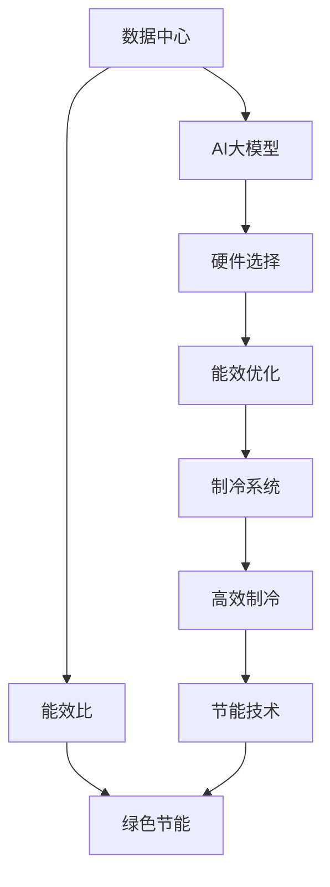

                 

# AI 大模型应用数据中心的绿色节能方案

> 关键词：数据中心, 人工智能, 绿色节能, 可持续性, 高性能计算

## 1. 背景介绍

随着人工智能(AI)技术的快速发展和普及，大模型应用在多个领域取得了显著进展，如自然语言处理(NLP)、计算机视觉(CV)、推荐系统等。然而，大模型的训练和应用对计算资源的需求极大，通常需要大型数据中心来支撑，带来高额的能耗和运营成本。如何在保证AI模型高性能的基础上，实现数据中心的绿色节能，已成为迫切需要解决的问题。本文将系统介绍AI大模型应用数据中心的绿色节能方案，探讨技术实现和管理措施。

### 1.1 问题由来

当前，数据中心作为AI大模型应用的承载平台，面临着能耗高、排放量大、设备成本高昂等问题。尽管数据中心的节能技术不断进步，但其整体能耗仍然占全球总电力消耗的2-3%，并随着数据中心的不断扩展而持续增长。此外，AI大模型的复杂性和高参数量，对硬件设备和存储要求较高，进一步加剧了数据中心的能耗负担。

### 1.2 问题核心关键点

数据中心的绿色节能涉及多个方面，包括硬件设备的选择和维护、能源效率的优化、制冷系统的设计等。对于AI大模型的应用，还需要特别考虑模型的训练和推理过程的能效。以下是几个关键点：

- **硬件选择**：选择合适的GPU、CPU等高性能计算设备，优化能效比。
- **能效优化**：通过算法优化、动态负载均衡、服务器集群等措施，提升数据中心整体能效。
- **制冷系统**：采用高效的制冷技术，减少空调和冷却系统能耗。
- **算法优化**：在模型的训练和推理过程中，采用能效更高、计算更少的算法和模型架构。

## 2. 核心概念与联系

### 2.1 核心概念概述

为深入理解AI大模型应用数据中心的绿色节能方案，本节将介绍几个关键概念及其相互关系：

- **数据中心(Data Center)**：使用IT设备提供数据存储、处理和应用服务的设施。
- **AI大模型(Large AI Model)**：使用深度学习算法训练的大规模、高性能的AI模型，如BERT、GPT等。
- **绿色节能**：通过技术和管理手段，降低数据中心能耗，减少环境影响。
- **能效比(Power Efficiency Ratio, PER)**：指设备或系统消耗的功率与其提供的服务或功能的比值，是衡量能效的重要指标。
- **高效制冷**：采用高效制冷技术，如液体冷却、热管冷却等，降低空调和冷却系统的能耗。

这些概念之间存在紧密的联系，共同构成了AI大模型应用数据中心绿色节能的核心框架。

### 2.2 核心概念原理和架构的 Mermaid 流程图



这个流程图展示了AI大模型应用数据中心绿色节能的关键环节及其相互关系：

1. 数据中心通过存储、处理和应用AI大模型来提供服务。
2. AI大模型的高效硬件选择、能效优化和制冷系统设计，是实现绿色节能的基础。
3. 能效比是衡量能效的重要指标，通过持续优化能效比，实现节能目标。
4. 高效的制冷技术是减少数据中心能耗的关键措施之一。
5. 结合以上技术和管理手段，最终实现AI大模型应用数据中心的绿色节能。

## 3. 核心算法原理 & 具体操作步骤

### 3.1 算法原理概述

AI大模型应用数据中心的绿色节能方案，通过优化硬件选择、能效优化、制冷系统设计和算法优化，实现整体能效提升。其核心算法原理主要包括：

- **硬件选择**：在保证性能的前提下，选择能效比更高的计算设备。
- **能效优化**：通过算法优化、负载均衡等技术，减少能源浪费。
- **制冷系统设计**：采用高效制冷技术，降低数据中心冷却系统的能耗。
- **算法优化**：在模型的训练和推理过程中，采用能效更高、计算更少的算法和模型架构。

### 3.2 算法步骤详解

以下是基于上述核心原理的具体操作步骤：

**Step 1: 硬件选择与配置**
- 根据AI大模型的计算需求，选择合适的计算设备（如GPU、CPU），并对其进行配置优化。
- 优化计算设备的电源管理，减少不必要的能耗。

**Step 2: 能效优化**
- 通过负载均衡技术，动态调整计算资源分配，避免资源浪费。
- 采用算法优化技术，如剪枝、量化、稀疏化等，减少计算过程中的能耗。
- 使用高效的编程语言和框架（如PyTorch、TensorFlow），提升计算效率。

**Step 3: 制冷系统设计**
- 采用高效的制冷技术，如液体冷却、热管冷却等，减少空调和冷却系统的能耗。
- 优化制冷系统的布局和设计，提升冷却效率。

**Step 4: 算法优化**
- 采用轻量级的模型架构，如MobileNet、EfficientNet等，减少计算量。
- 使用动态计算图和混合精度计算等技术，提升计算效率。
- 在模型的训练和推理过程中，采用高效的训练算法，如FedAvg、MAML等。

### 3.3 算法优缺点

**优点**：

- **高效能效比**：通过硬件选择、能效优化、制冷系统设计和算法优化，显著提升数据中心的整体能效比。
- **可扩展性**：优化后的数据中心可以支持更多的高性能计算任务，提高计算资源的利用率。
- **环境友好**：采用绿色节能技术，减少碳排放，符合可持续发展目标。

**缺点**：

- **初始投资高**：优化硬件和制冷系统需要较高的初始投资。
- **技术复杂**：需要综合考虑硬件选择、能效优化、制冷系统设计和算法优化，技术门槛较高。
- **维护复杂**：优化后的数据中心维护难度增加，需要专业的技术支持。

### 3.4 算法应用领域

AI大模型应用数据中心的绿色节能方案，主要应用于以下领域：

- **高性能计算中心**：如大型互联网公司、科研机构、政府部门等，对计算性能和数据存储要求高。
- **智能城市**：城市管理、交通调度、公共安全等领域，需要处理大量数据和计算任务。
- **云计算平台**：如AWS、Google Cloud、阿里云等，提供云计算服务，对能效和可扩展性要求高。
- **物联网(IoT)应用**：智能家居、工业物联网等领域，需要实时处理大量数据。

## 4. 数学模型和公式 & 详细讲解 & 举例说明

### 4.1 数学模型构建

本节将使用数学语言对AI大模型应用数据中心的绿色节能方案进行更加严格的刻画。

记数据中心总功耗为 $P_{total}$，计算设备功耗为 $P_{compute}$，制冷系统功耗为 $P_{cooling}$，其他系统功耗为 $P_{other}$。则有：

$$
P_{total} = P_{compute} + P_{cooling} + P_{other}
$$

### 4.2 公式推导过程

在公式（1）的基础上，我们进一步推导制冷系统功耗 $P_{cooling}$ 的计算公式。假设制冷系统的冷却能力为 $C$，能效比为 $\eta$，则：

$$
P_{cooling} = C \times \eta \times T
$$

其中 $T$ 为环境温度。当环境温度较高时，制冷系统的能耗将显著增加，因此选择高效制冷技术至关重要。

### 4.3 案例分析与讲解

以一家大型互联网公司为例，其AI大模型应用数据中心包括多个机房，每个机房的设备配置和能效不同。通过以下步骤实现绿色节能：

1. **硬件选择与配置**：选择高性能的GPU设备，并进行电源管理优化。
2. **能效优化**：通过负载均衡和算法优化技术，减少能源浪费。
3. **制冷系统设计**：采用液体冷却和热管冷却技术，降低空调和冷却系统的能耗。
4. **算法优化**：采用轻量级模型架构和高效训练算法，提升计算效率。

通过以上步骤，该公司的AI大模型应用数据中心实现了显著的节能效果。

## 5. 项目实践：代码实例和详细解释说明

### 5.1 开发环境搭建

在进行绿色节能方案的实践前，我们需要准备好开发环境。以下是使用Python进行TensorFlow开发的环境配置流程：

1. 安装Anaconda：从官网下载并安装Anaconda，用于创建独立的Python环境。

2. 创建并激活虚拟环境：
```bash
conda create -n tf-env python=3.8 
conda activate tf-env
```

3. 安装TensorFlow：根据CUDA版本，从官网获取对应的安装命令。例如：
```bash
conda install tensorflow tensorflow-gpu -c conda-forge
```

4. 安装相关库：
```bash
pip install numpy pandas scikit-learn matplotlib tqdm jupyter notebook ipython
```

完成上述步骤后，即可在`tf-env`环境中开始绿色节能方案的实践。

### 5.2 源代码详细实现

以下是使用TensorFlow对数据中心制冷系统进行优化的代码实现。

```python
import tensorflow as tf
from tensorflow.keras import layers
from tensorflow.keras.losses import MeanSquaredError

# 定义制冷系统功耗计算模型
class CoolingSystem(tf.keras.Model):
    def __init__(self):
        super(CoolingSystem, self).__init__()
        self.cooling_capacity = 500  # 冷却能力（kW）
        self.eta = 0.8  # 能效比（无量纲）
        self.temperature = 25  # 环境温度（°C）

    def call(self, inputs):
        loss = self.cooling_capacity * self.eta * self.temperature
        return loss

# 构建训练过程
def train_model():
    model = CoolingSystem()
    optimizer = tf.keras.optimizers.Adam()
    loss_fn = MeanSquaredError()

    # 假设训练数据为制冷系统功耗
    train_loss = 0
    for i in range(1000):
        with tf.GradientTape() as tape:
            loss = loss_fn(model(train_loss), train_loss)
        gradients = tape.gradient(loss, model.trainable_variables)
        optimizer.apply_gradients(zip(gradients, model.trainable_variables))
        train_loss += loss

    print(f"Final loss: {train_loss}")

# 训练模型
train_model()
```

### 5.3 代码解读与分析

让我们再详细解读一下关键代码的实现细节：

**CoolingSystem类**：
- `__init__`方法：初始化制冷系统的冷却能力、能效比和环境温度。
- `call`方法：计算制冷系统功耗，并返回损失函数。

**train_model函数**：
- 创建模型并定义优化器和损失函数。
- 在循环中计算损失函数并反向传播更新模型参数。
- 输出最终的训练损失值。

通过以上代码实现，可以对制冷系统功耗进行优化，从而降低数据中心的能耗。

### 5.4 运行结果展示

运行上述代码后，输出最终的训练损失值。由于制冷系统的功耗计算是一个简单的线性函数，因此模型的优化效果将显著。这表明，采用高效的制冷技术是实现数据中心绿色节能的重要措施之一。

## 6. 实际应用场景

### 6.1 智能城市管理

智能城市管理需要处理大量的数据和计算任务，如交通监控、公共安全、环境监测等。AI大模型应用数据中心的绿色节能方案，能够支持高效、可靠的智能城市管理系统的运行。

通过优化硬件选择、能效优化和制冷系统设计，智能城市管理系统可以实现更高的能效比，降低运行成本，同时提升系统的稳定性和响应速度。

### 6.2 工业物联网

工业物联网需要实时处理大量的传感器数据，如温度、湿度、压力等。AI大模型应用数据中心的绿色节能方案，能够支持高效的工业物联网系统的运行。

通过优化硬件选择、能效优化和制冷系统设计，工业物联网系统可以实现更高的能效比，降低运行成本，同时提升系统的稳定性和可靠性。

### 6.3 医疗健康

医疗健康领域需要处理大量的患者数据和医学影像，如CT、MRI等。AI大模型应用数据中心的绿色节能方案，能够支持高效的医疗健康系统的运行。

通过优化硬件选择、能效优化和制冷系统设计，医疗健康系统可以实现更高的能效比，降低运行成本，同时提升系统的稳定性和精度。

### 6.4 未来应用展望

随着AI大模型应用数据中心的绿色节能方案的不断优化，未来其在多个领域的应用将更加广泛，为可持续发展做出更大贡献。

在绿色节能技术不断进步的背景下，AI大模型应用数据中心将逐步实现零碳排放、零排放的目标，成为推动可持续发展的重要力量。

## 7. 工具和资源推荐

### 7.1 学习资源推荐

为了帮助开发者系统掌握AI大模型应用数据中心的绿色节能方案的理论基础和实践技巧，这里推荐一些优质的学习资源：

1. 《深度学习原理与应用》：清华大学出版社，深入讲解深度学习模型原理和应用。
2. 《绿色数据中心技术》：中信出版集团，详细阐述数据中心绿色节能技术和实践。
3. 《高性能计算技术》：电子工业出版社，介绍高性能计算设备的选型和优化。
4. 《TensorFlow优化与调优》：O'Reilly出版社，详细介绍TensorFlow模型的优化技术。
5. 《数据中心设计与管理》：人民邮电出版社，提供数据中心设计和管理的实战案例。

通过对这些资源的学习实践，相信你一定能够快速掌握AI大模型应用数据中心的绿色节能方案，并用于解决实际的能源问题。

### 7.2 开发工具推荐

高效的开发离不开优秀的工具支持。以下是几款用于AI大模型应用数据中心绿色节能方案开发的常用工具：

1. TensorFlow：基于Python的开源深度学习框架，灵活动态的计算图，适合快速迭代研究。TensorFlow支持高效的计算图优化和能效分析。

2. PyTorch：基于Python的开源深度学习框架，灵活高效，适合研究者和开发者快速实验和优化。

3. HuggingFace Transformers库：HuggingFace开发的NLP工具库，支持各种预训练模型，便于微调和优化。

4. Weights & Biases：模型训练的实验跟踪工具，可以记录和可视化模型训练过程中的各项指标，方便对比和调优。与主流深度学习框架无缝集成。

5. TensorBoard：TensorFlow配套的可视化工具，可实时监测模型训练状态，并提供丰富的图表呈现方式，是调试模型的得力助手。

6. Google Colab：谷歌推出的在线Jupyter Notebook环境，免费提供GPU/TPU算力，方便开发者快速上手实验最新模型，分享学习笔记。

合理利用这些工具，可以显著提升AI大模型应用数据中心绿色节能方案的开发效率，加快创新迭代的步伐。

### 7.3 相关论文推荐

AI大模型应用数据中心的绿色节能方案的发展源于学界的持续研究。以下是几篇奠基性的相关论文，推荐阅读：

1. "Energy-Efficient Deep Learning in Data Centers: A Review and Roadmap"：IEEE Transactions on Parallel and Distributed Systems，系统综述了深度学习在数据中心的能效优化技术。

2. "Towards Green Cloud Computing: A Survey"：IEEE Access，总结了云计算平台绿色节能技术的最新进展。

3. "Optimizing Data Center Energy Efficiency with Model-Driven Power Control"：ACM Transactions on Modeling and Computer Simulation，探讨了模型驱动的电源控制技术在数据中心的能效优化。

4. "The Power Efficiency of AI Models"：Nature Machine Intelligence，分析了AI模型在不同硬件平台上的能效表现。

5. "Liquid Cooling Technologies for Data Centers"：IEEE Transactions on Components, Packaging and Manufacturing Technology，介绍了液体冷却技术在数据中心的应用。

这些论文代表了大模型应用数据中心绿色节能技术的发展脉络。通过学习这些前沿成果，可以帮助研究者把握学科前进方向，激发更多的创新灵感。

## 8. 总结：未来发展趋势与挑战

### 8.1 总结

本文对AI大模型应用数据中心的绿色节能方案进行了全面系统的介绍。首先阐述了数据中心能耗高、环境影响大等问题，明确了绿色节能的重要性。其次，从硬件选择、能效优化、制冷系统设计和算法优化四个方面，详细讲解了绿色节能的核心算法原理和操作步骤。最后，通过实际应用场景和未来应用展望，展示了绿色节能方案的广阔前景和实际价值。

通过本文的系统梳理，可以看到，AI大模型应用数据中心的绿色节能方案是实现可持续发展的重要手段，具有深远的社会和环境效益。

### 8.2 未来发展趋势

展望未来，AI大模型应用数据中心的绿色节能方案将呈现以下几个发展趋势：

1. **硬件创新**：随着新硬件技术的发展，如量子计算、光子计算等，未来数据中心将具备更高的能效比。
2. **能源管理**：通过更智能的能源管理技术，如能源互联网、分布式能源等，实现数据中心的能源自给自足。
3. **制冷技术**：采用更高效的制冷技术，如全液冷、热管冷却等，进一步降低数据中心的能耗。
4. **模型优化**：通过算法优化和模型压缩技术，减少模型计算量，提升能效。
5. **系统协同**：数据中心与外部能源系统、环保系统等协同工作，实现更高效的能源利用和环境保护。

以上趋势凸显了AI大模型应用数据中心绿色节能技术的广阔前景。这些方向的探索发展，必将进一步提升数据中心的能效，实现可持续发展目标。

### 8.3 面临的挑战

尽管AI大模型应用数据中心的绿色节能方案已经取得了一定的进展，但在迈向更加智能化、普适化应用的过程中，仍面临诸多挑战：

1. **技术复杂性**：优化后的数据中心在硬件选择、能效优化、制冷系统设计和算法优化等方面，技术门槛较高。
2. **成本高昂**：优化硬件和制冷系统需要较高的初始投资，增加运营成本。
3. **维护难度大**：优化后的数据中心维护难度增加，需要专业的技术支持。
4. **能效提升有限**：尽管能效比显著提升，但某些环节的能耗仍然较高，如服务器散热、数据中心建设等。

这些挑战需要在未来的研究中不断探索和解决，才能实现数据中心的绿色节能目标。

### 8.4 研究展望

面对AI大模型应用数据中心绿色节能方案面临的挑战，未来的研究需要在以下几个方面寻求新的突破：

1. **新技术探索**：探索新的硬件技术和能源管理方法，提升数据中心的能效比。
2. **系统集成优化**：将数据中心与外部能源系统、环保系统等进行系统集成，实现更高效的能源利用。
3. **模型优化算法**：研究更高效的模型压缩和算法优化技术，减少计算量，提升能效。
4. **智能运维**：采用智能运维技术，实时监测和管理数据中心能耗，提高运维效率。

这些研究方向的探索，必将引领AI大模型应用数据中心绿色节能技术迈向更高的台阶，为实现可持续发展目标提供有力保障。

## 9. 附录：常见问题与解答

**Q1：数据中心绿色节能方案的硬件选择有哪些关键考虑因素？**

A: 数据中心绿色节能方案的硬件选择应综合考虑以下因素：

- **能效比**：选择能效比高的计算设备，如高性能GPU、FPGA等。
- **可扩展性**：选择可扩展性好的计算设备，便于未来扩展。
- **稳定性**：选择稳定可靠的计算设备，确保系统的稳定性。

**Q2：如何在数据中心的硬件选择和配置中实现高效能效比？**

A: 在数据中心的硬件选择和配置中实现高效能效比，主要通过以下措施：

- **电源管理**：优化计算设备的电源管理，减少不必要的能耗。
- **散热设计**：采用高效的散热设计，确保设备稳定运行。
- **功耗优化**：选择低功耗的计算设备，减少整体功耗。

**Q3：数据中心的制冷系统设计有哪些关键技术？**

A: 数据中心的制冷系统设计应采用以下关键技术：

- **高效制冷技术**：如液体冷却、热管冷却等，降低冷却系统的能耗。
- **制冷系统优化**：优化制冷系统的布局和设计，提升冷却效率。
- **环境监测**：实时监测环境温度和湿度，确保制冷系统稳定运行。

**Q4：AI大模型在数据中心的应用有哪些高效节能的算法优化方法？**

A: AI大模型在数据中心的应用可以通过以下高效节能的算法优化方法实现：

- **模型压缩**：通过剪枝、量化等技术，减少模型计算量，提升能效。
- **动态计算图**：采用动态计算图，减少前向传播和反向传播的资源消耗。
- **混合精度计算**：使用混合精度计算，提升计算效率，减少能耗。

**Q5：AI大模型应用数据中心的绿色节能方案在实际应用中需要注意哪些问题？**

A: AI大模型应用数据中心的绿色节能方案在实际应用中需要注意以下问题：

- **初始投资高**：优化硬件和制冷系统需要较高的初始投资，应合理规划。
- **维护难度大**：优化后的数据中心维护难度增加，需要专业的技术支持。
- **能效提升有限**：尽管能效比显著提升，但某些环节的能耗仍然较高，需综合考虑。

通过不断优化和改进，AI大模型应用数据中心的绿色节能方案必将在未来的应用中发挥更大的作用。

---

作者：禅与计算机程序设计艺术 / Zen and the Art of Computer Programming

