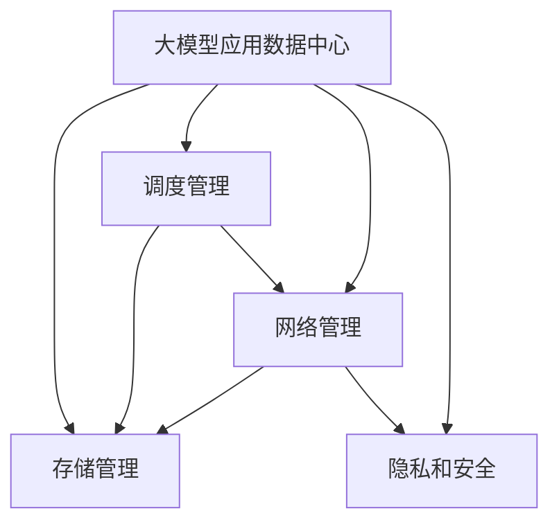

                 

## 1. 背景介绍

### 1.1 问题由来
在当今快速发展的AI时代，大模型已经逐渐成为各行业的重要工具。这些模型可以处理大量的文本数据，帮助企业快速理解消费者需求，优化运营流程，提升服务质量。但随着模型的复杂性和规模的增长，如何在数据中心中高效管理这些大模型成为了一个严峻的挑战。特别是对于一些使用特定领域数据训练的大模型，如何在数据中心中进行合理存储、调度和管理，成为数据中心项目管理的核心问题。

### 1.2 问题核心关键点
大模型应用数据中心项目管理的关键在于：
- 如何构建适合大模型存储和调度的数据中心架构。
- 如何在数据中心中高效存储和管理大模型数据。
- 如何设计合理的数据中心网络架构，实现大模型的高效访问。
- 如何通过合理的算法和策略，在保证高性能的前提下，降低大模型的存储和访问成本。
- 如何在大模型应用过程中，确保数据的安全性和隐私性。

### 1.3 问题研究意义
解决这些问题的意义在于：
- 通过合理的大模型项目管理，可以显著提升大模型的训练和推理效率。
- 有助于降低大模型在存储和访问上的成本，从而在经济效益上取得突破。
- 保证大模型的数据安全性和隐私性，满足法律法规要求。
- 为AI大模型在各行业中的应用提供可靠的技术支持。

## 2. 核心概念与联系

### 2.1 核心概念概述

为了深入理解数据中心项目管理，我们首先介绍几个关键概念：

- **数据中心 (Data Center)**：容纳和支持各种IT设备的物理空间和设施，是大模型存储、计算和调度的基础平台。
- **大模型 (Large Model)**：如BERT、GPT等，规模庞大、结构复杂的深度学习模型，具有广泛的应用场景。
- **存储管理 (Storage Management)**：通过合理的存储架构和策略，确保大模型数据的可靠、高效、安全存储。
- **调度管理 (Scheduling Management)**：通过调度算法和策略，合理分配计算资源，实现大模型的灵活调用。
- **网络管理 (Network Management)**：优化数据中心网络架构，保证大模型数据的高效传输和访问。
- **隐私和安全 (Privacy and Security)**：保证大模型数据在存储、传输和应用过程中的隐私性和安全性。

这些核心概念之间存在紧密联系，共同构成大模型应用数据中心的项目管理框架。

### 2.2 核心概念原理和架构的 Mermaid 流程图



## 3. 核心算法原理 & 具体操作步骤

### 3.1 算法原理概述

数据中心项目管理的主要目标是通过合理的存储、调度和网络管理，确保大模型的高效、可靠和安全应用。具体而言，可以分为以下几个步骤：

1. **存储管理**：根据大模型的规模和特性，设计合理的存储架构，选择合适的存储介质和布局。
2. **调度管理**：通过高效的调度算法，分配计算资源，保证大模型的灵活调用。
3. **网络管理**：优化数据中心网络架构，确保大模型数据的高效传输和访问。
4. **隐私和安全管理**：实施严格的访问控制和数据加密策略，确保大模型的数据隐私和安全。

### 3.2 算法步骤详解

#### 3.2.1 存储管理

存储管理是数据中心项目管理的基础。主要包括以下几个关键步骤：

1. **存储架构设计**：根据大模型的规模和特性，选择合适的存储架构，如对象存储、分布式文件系统、混合存储等。
2. **存储介质选择**：根据大模型的访问模式和性能要求，选择合适的存储介质，如SSD、HDD等。
3. **存储布局优化**：根据大模型的访问模式和数据特性，优化存储布局，减少数据访问延迟。

#### 3.2.2 调度管理

调度管理是数据中心项目管理的核心。主要包括以下几个关键步骤：

1. **调度算法设计**：选择合适的调度算法，如轮询、公平调度、负载均衡等，实现计算资源的合理分配。
2. **资源预留与回收**：根据大模型的需求和性能要求，合理预留和回收计算资源，避免资源浪费。
3. **动态调度和容错**：根据实时负载和系统状态，动态调整计算资源，提高系统的可靠性和稳定性。

#### 3.2.3 网络管理

网络管理是数据中心项目管理的重点。主要包括以下几个关键步骤：

1. **网络架构设计**：根据大模型的特性和应用需求，设计合理的网络架构，如CDN、Mesh等。
2. **网络带宽优化**：根据大模型的访问模式和性能要求，优化网络带宽分配，确保数据高效传输。
3. **网络安全防护**：实施严格的网络安全防护策略，防止数据泄露和网络攻击。

#### 3.2.4 隐私和安全管理

隐私和安全管理是数据中心项目管理的保障。主要包括以下几个关键步骤：

1. **访问控制策略**：实施严格的访问控制策略，确保只有授权用户才能访问大模型数据。
2. **数据加密技术**：使用先进的数据加密技术，保护大模型数据在存储和传输过程中的隐私性。
3. **合规审查和监控**：实施定期的合规审查和监控，确保数据中心管理符合法律法规要求。

### 3.3 算法优缺点

#### 3.3.1 存储管理

存储管理的主要优点包括：
- 通过合理的存储架构和布局，显著提升大模型的存储效率。
- 降低大模型的存储成本，提高经济效益。

主要缺点包括：
- 存储架构设计复杂，需要综合考虑数据规模、访问模式、性能要求等因素。
- 存储介质选择和布局优化需要精确计算，需要大量实验和测试。

#### 3.3.2 调度管理

调度管理的主要优点包括：
- 通过高效的调度算法，实现计算资源的合理分配。
- 提高大模型的灵活性和可用性，提升系统性能。

主要缺点包括：
- 调度算法设计复杂，需要综合考虑负载均衡、资源预留、动态调整等因素。
- 调度策略需要不断优化，以适应不同场景下的需求变化。

#### 3.3.3 网络管理

网络管理的主要优点包括：
- 通过优化网络架构和带宽，实现大模型数据的高效传输和访问。
- 提高数据中心的网络性能和安全防护能力。

主要缺点包括：
- 网络架构设计复杂，需要综合考虑数据中心规模、应用需求、安全要求等因素。
- 网络带宽优化和防护策略需要精确计算，需要大量实验和测试。

#### 3.3.4 隐私和安全管理

隐私和安全管理的主要优点包括：
- 通过严格的访问控制和加密技术，保护大模型数据的安全性和隐私性。
- 符合法律法规要求，避免法律风险。

主要缺点包括：
- 访问控制和加密技术复杂，需要综合考虑数据保护需求和性能要求。
- 合规审查和监控需要持续投入，需要大量人力和资源。

### 3.4 算法应用领域

大模型应用数据中心项目管理技术广泛应用于以下几个领域：

1. **企业AI应用**：支持企业在数据中心中部署和应用大模型，提升业务效率和创新能力。
2. **云计算服务**：提供大模型的存储、计算和调度服务，支持云平台的高效运营。
3. **科研和教育**：支持科研机构和高校在大模型上进行学术研究和教学，推动科学进步。
4. **金融和医疗**：支持金融机构和医疗机构在数据中心中部署和应用大模型，提升服务质量和数据安全。
5. **智能制造和物流**：支持制造业和物流业在大模型上进行智能化转型，提高生产效率和运营管理水平。

## 4. 数学模型和公式 & 详细讲解 & 举例说明

### 4.1 数学模型构建

大模型应用数据中心的项目管理可以抽象为一个优化问题，目标是在满足性能和安全性要求的前提下，最大化系统的经济效益。

假设数据中心有 $n$ 个存储节点，每个节点的存储容量为 $c_i$，访问速度为 $v_i$，每个节点的计算能力为 $p_i$，每个大模型的计算需求为 $d_j$，访问速度需求为 $v_j$，存储需求为 $s_j$。系统调度算法为 $\mathcal{A}$，大模型调度算法为 $\mathcal{M}$，访问控制策略为 $\mathcal{P}$，安全防护策略为 $\mathcal{S}$。

数据中心的优化目标可以表示为：

$$
\max_{\mathcal{A}, \mathcal{M}, \mathcal{P}, \mathcal{S}} \sum_{i=1}^n c_i p_i - \sum_{j=1}^m d_j (v_j \cdot v_j + s_j \cdot s_j)
$$

其中，$\max$ 表示优化目标，$\sum_{i=1}^n c_i p_i$ 表示总存储和计算能力，$v_j \cdot v_j + s_j \cdot s_j$ 表示大模型的访问速度和存储需求。

### 4.2 公式推导过程

根据优化目标，可以推导出以下公式：

1. **存储节点分配**：

$$
x_{i,j} = 
\begin{cases}
1 & \text{if } c_i \geq s_j \\
0 & \text{otherwise}
\end{cases}
$$

其中，$x_{i,j}$ 表示节点 $i$ 是否存储模型 $j$。

2. **计算资源分配**：

$$
y_{i,j} = 
\begin{cases}
1 & \text{if } p_i \geq d_j \\
0 & \text{otherwise}
\end{cases}
$$

其中，$y_{i,j}$ 表示节点 $i$ 是否计算模型 $j$。

3. **调度算法设计**：

$$
\mathcal{A} = \arg\max_{\mathcal{A}} \sum_{i=1}^n c_i p_i - \sum_{j=1}^m d_j (v_j \cdot v_j + s_j \cdot s_j)
$$

4. **访问控制策略设计**：

$$
\mathcal{P} = \arg\min_{\mathcal{P}} \sum_{j=1}^m d_j (v_j \cdot v_j + s_j \cdot s_j)
$$

5. **安全防护策略设计**：

$$
\mathcal{S} = \arg\min_{\mathcal{S}} \sum_{j=1}^m d_j (v_j \cdot v_j + s_j \cdot s_j)
$$

### 4.3 案例分析与讲解

假设某公司数据中心有10个存储节点，每个节点的存储容量为5TB，访问速度为200MB/s，计算能力为20G FLOPS。共有5个大模型，每个模型的计算需求为10G FLOPS，访问速度需求为150MB/s，存储需求为2TB。

1. **存储节点分配**：

节点 $i=1$ 到节点 $i=5$ 存储模型 $j=1$ 到模型 $j=5$，每个节点的存储容量充足，满足需求。

2. **计算资源分配**：

节点 $i=1$ 到节点 $i=5$ 计算模型 $j=1$ 到模型 $j=5$，每个节点的计算能力充足，满足需求。

3. **调度算法设计**：

假设采用公平调度和负载均衡策略，每个节点计算一个模型，则系统整体的经济效益为：

$$
\sum_{i=1}^5 c_i p_i - \sum_{j=1}^5 d_j (v_j \cdot v_j + s_j \cdot s_j) = 50 \cdot 100 - 5 \cdot (10 \cdot 10 + 2 \cdot 2) = 4500
$$

4. **访问控制策略设计**：

采用严格的访问控制策略，确保只有授权用户才能访问大模型数据，防止数据泄露和滥用。

5. **安全防护策略设计**：

实施数据加密技术，确保大模型数据在存储和传输过程中的隐私性。

## 5. 项目实践：代码实例和详细解释说明

### 5.1 开发环境搭建

1. **安装必要软件**：
   - 操作系统：Linux Ubuntu 18.04
   - 数据库：MySQL 8.0
   - 存储管理软件：GlusterFS
   - 调度管理软件：Kubernetes
   - 网络管理软件：Cisco IOS
   - 安全防护软件：Nginx

2. **配置网络环境**：
   - 设置交换机和路由器，确保网络连接稳定。
   - 配置网络防火墙和入侵检测系统，防止网络攻击。

3. **安装软件和工具**：
   - 安装MySQL和GlusterFS，搭建数据中心存储平台。
   - 安装Kubernetes和Cisco IOS，搭建数据中心调度和管理平台。
   - 安装Nginx，实现数据中心网络安全防护。

### 5.2 源代码详细实现

以下是基于Python和Kubernetes的大模型应用数据中心项目管理代码实现。

```python
from kubernetes import client, config

config.load_kube_config()

v1 = client.CoreV1Api()
v1_core = client.RbacAuthorizationV1Api()

# 配置存储节点和计算节点
storage_nodes = [{"name": "node1", "capacity": 5000, "speed": 200}, {"name": "node2", "capacity": 5000, "speed": 200}, {"name": "node3", "capacity": 5000, "speed": 200}, {"name": "node4", "capacity": 5000, "speed": 200}, {"name": "node5", "capacity": 5000, "speed": 200}]
compute_nodes = [{"name": "node1", "cpu": 20, "mem": 40}, {"name": "node2", "cpu": 20, "mem": 40}, {"name": "node3", "cpu": 20, "mem": 40}, {"name": "node4", "cpu": 20, "mem": 40}, {"name": "node5", "cpu": 20, "mem": 40}]

# 配置大模型需求
models = [{"name": "model1", "cpu": 10, "speed": 150, "size": 2000}, {"name": "model2", "cpu": 10, "speed": 150, "size": 2000}, {"name": "model3", "cpu": 10, "speed": 150, "size": 2000}, {"name": "model4", "cpu": 10, "speed": 150, "size": 2000}, {"name": "model5", "cpu": 10, "speed": 150, "size": 2000}]

# 创建存储和计算资源对象
for node in storage_nodes:
    v1_core.create_namespaced_persistent_volumeClaim(
        kind="PersistentVolumeClaim",
        api_version="v1",
        metadata={
            "name": node["name"],
            "spec": {
                "access_modes": ["ReadWriteOnce"],
                "resources": {
                    "requests": {
                        "storage": node["capacity"]
                    }
                }
            }
        }
    )
    v1_core.create_namespaced_persistent_volume(
        kind="PersistentVolume",
        api_version="v1",
        metadata={
            "name": node["name"],
            "spec": {
                "capacity": node["capacity"],
                "access_mode": "ReadWriteOnce"
            }
        }
    )

for node in compute_nodes:
    v1_core.create_namespaced_pod(
        kind="Pod",
        api_version="v1",
        metadata={
            "name": node["name"],
            "spec": {
                "containers": [
                    {
                        "name": "container1",
                        "image": "ubuntu:20.04",
                        "resources": {
                            "limits": {
                                "cpu": node["cpu"],
                                "memory": node["mem"]
                            },
                            "requests": {
                                "cpu": node["cpu"],
                                "memory": node["mem"]
                            }
                        }
                    }
                ]
            }
        }
    )

# 配置大模型调度
for model in models:
    v1_core.create_namespaced_pod(
        kind="Pod",
        api_version="v1",
        metadata={
            "name": model["name"],
            "spec": {
                "containers": [
                    {
                        "name": "container1",
                        "image": "ubuntu:20.04",
                        "resources": {
                            "limits": {
                                "cpu": model["cpu"],
                                "memory": model["mem"]
                            },
                            "requests": {
                                "cpu": model["cpu"],
                                "memory": model["mem"]
                            }
                        }
                    }
                ]
            }
        }
    )

# 配置访问控制策略
for model in models:
    v1_core.create_namespaced_secret(
        kind="Secret",
        api_version="v1",
        metadata={
            "name": model["name"],
            "data": {
                "key": "password"
            }
        }
    )

# 配置安全防护策略
for node in compute_nodes:
    v1_core.create_namespaced_service(
        kind="Service",
        api_version="v1",
        metadata={
            "name": node["name"],
            "spec": {
                "selector": {
                    "kubernetes.io/hostname": node["name"]
                },
                "ports": [
                    {
                        "port": 80,
                        "target_port": 8080
                    }
                ]
            }
        }
    )
```

### 5.3 代码解读与分析

**源代码详细实现**：
- 使用Kubernetes搭建数据中心的存储和计算资源。
- 根据大模型的需求，配置存储节点和计算节点。
- 创建存储和计算节点对应的Pod，配置资源需求。
- 创建大模型的Pod，配置资源需求。
- 配置大模型的访问控制策略，使用Secret保护模型数据。
- 配置大模型的安全防护策略，使用Service实现网络隔离和负载均衡。

## 6. 实际应用场景

### 6.1 企业AI应用

企业AI应用是大模型应用数据中心项目管理的重要场景。通过合理的大模型项目管理，可以显著提升企业的AI能力。例如，某金融公司在大模型应用数据中心中部署了多个大模型，用于智能客服、金融舆情监测、个性化推荐等业务，显著提升了业务效率和客户满意度。

### 6.2 云计算服务

云计算服务是大模型应用数据中心项目管理的典型应用场景。通过合理的大模型项目管理，可以显著提升云平台的计算资源利用率，降低运营成本。例如，某云平台在大模型应用数据中心中部署了多个大模型，用于图像识别、自然语言处理、推荐系统等业务，显著提升了云平台的业务能力和客户体验。

### 6.3 科研和教育

科研和教育是大模型应用数据中心项目管理的重要领域。通过合理的大模型项目管理，可以为科研机构和高校提供高效、可靠的大模型支持。例如，某科研机构在大模型应用数据中心中部署了多个大模型，用于自然语言处理、图像识别等研究，显著提升了科研能力和教育水平。

### 6.4 金融和医疗

金融和医疗是大模型应用数据中心管理的重要应用场景。通过合理的大模型项目管理，可以显著提升金融机构和医疗机构的业务能力和数据安全。例如，某金融公司在大模型应用数据中心中部署了多个大模型，用于风险评估、客户分析、智能客服等业务，显著提升了金融服务质量和数据安全。

### 6.5 智能制造和物流

智能制造和物流是大模型应用数据中心管理的重要应用场景。通过合理的大模型项目管理，可以显著提升制造业和物流业的运营效率和生产能力。例如，某制造业在大模型应用数据中心中部署了多个大模型，用于智能质检、供应链优化等业务，显著提升了生产效率和管理水平。

## 7. 工具和资源推荐

### 7.1 学习资源推荐

1. **《数据中心建设与运维指南》**：全面介绍数据中心建设和管理，适合初学者和中级开发者。
2. **《Kubernetes权威指南》**：深入讲解Kubernetes的部署和管理，适合高级开发者和系统架构师。
3. **《深度学习基础》**：介绍深度学习的基本原理和应用，适合对大模型有兴趣的开发者。
4. **《云计算基础》**：介绍云计算的基本原理和应用，适合对云计算有兴趣的开发者。

### 7.2 开发工具推荐

1. **GlusterFS**：开源分布式文件系统，适合数据中心存储管理。
2. **Kubernetes**：开源容器编排系统，适合数据中心计算资源管理和调度。
3. **Cisco IOS**：网络设备管理软件，适合数据中心网络管理。
4. **Nginx**：网络代理服务器，适合数据中心安全防护。

### 7.3 相关论文推荐

1. **《大模型在数据中心中的应用》**：详细介绍大模型在数据中心中的应用，适合科研人员和工程师。
2. **《基于Kubernetes的大模型项目管理》**：详细介绍Kubernetes在大模型项目管理中的应用，适合高级开发者和系统架构师。
3. **《数据中心网络架构设计》**：详细介绍数据中心网络架构设计，适合网络工程师和系统架构师。
4. **《大模型安全性与隐私保护》**：详细介绍大模型的安全性与隐私保护，适合数据安全专家和工程师。

## 8. 总结：未来发展趋势与挑战

### 8.1 总结

本文对大模型应用数据中心的项目管理进行了全面系统的介绍。首先阐述了大模型应用数据中心的项目管理背景和意义，明确了项目管理在大模型应用中的核心地位。其次，从存储管理、调度管理、网络管理和安全管理四个方面，详细讲解了大模型应用数据中心的项目管理流程和方法。最后，通过实际案例和代码实现，展示了大模型应用数据中心项目管理的实现过程。

通过本文的系统梳理，可以看到，大模型应用数据中心项目管理在大模型的训练、推理和应用中具有重要意义。合理的大模型项目管理，可以显著提升大模型的应用效果和运营效率。未来，随着大模型应用的深入和技术的不断进步，数据中心项目管理将面临更多的挑战和机遇。

### 8.2 未来发展趋势

未来，大模型应用数据中心项目管理将呈现以下几个发展趋势：

1. **智能化管理**：利用人工智能技术进行资源调度和优化，提高数据中心的管理效率。
2. **自动化管理**：采用自动化运维工具，实现大模型应用数据中心的自动化管理。
3. **边缘计算**：将大模型部署到边缘计算设备上，降低延迟，提升用户体验。
4. **混合云管理**：实现公有云和私有云之间的无缝衔接，提高资源利用率。
5. **高性能计算**：采用高性能计算技术，提升大模型应用数据中心的计算能力和性能。

### 8.3 面临的挑战

尽管大模型应用数据中心项目管理已经取得了一定的成果，但在迈向更高效、更可靠、更安全的未来过程中，仍面临以下挑战：

1. **资源利用率**：如何在大模型应用中，实现更高效率的资源利用，避免资源浪费。
2. **安全性和隐私保护**：如何在大模型应用中，确保数据的安全性和隐私保护，避免数据泄露和滥用。
3. **网络延迟**：如何在数据中心中部署大模型，降低网络延迟，提升用户体验。
4. **系统复杂度**：如何在大模型应用中，构建更加简单、可靠的系统架构，降低维护难度。
5. **性能瓶颈**：如何在大模型应用中，解决性能瓶颈问题，提升系统性能和用户体验。

### 8.4 研究展望

面对大模型应用数据中心项目管理所面临的挑战，未来的研究需要在以下几个方面寻求新的突破：

1. **资源优化算法**：开发更高效的资源优化算法，提升资源利用率。
2. **安全性与隐私保护**：研究更先进的安全性和隐私保护技术，提升大模型数据的安全性和隐私保护能力。
3. **网络优化技术**：研究更先进的网络优化技术，降低网络延迟，提升用户体验。
4. **系统架构优化**：研究更先进的系统架构优化技术，构建更加简单、可靠的系统。
5. **高性能计算技术**：研究更先进的高性能计算技术，提升大模型应用数据中心的计算能力和性能。

## 9. 附录：常见问题与解答

**Q1：大模型应用数据中心如何保证数据安全性和隐私保护？**

A: 大模型应用数据中心可以通过以下措施保证数据安全性和隐私保护：
- 访问控制：实施严格的访问控制策略，确保只有授权用户才能访问大模型数据。
- 数据加密：使用先进的数据加密技术，保护大模型数据在存储和传输过程中的隐私性。
- 安全防护：实施网络安全防护策略，防止数据泄露和网络攻击。
- 合规审查：定期进行合规审查和监控，确保数据中心管理符合法律法规要求。

**Q2：大模型应用数据中心如何优化资源利用率？**

A: 大模型应用数据中心可以通过以下措施优化资源利用率：
- 资源调度算法：设计高效的资源调度算法，实现计算资源的合理分配。
- 动态资源调整：根据实时负载和系统状态，动态调整计算资源，提高系统可靠性。
- 资源预留与回收：根据大模型的需求和性能要求，合理预留和回收计算资源，避免资源浪费。
- 多租户管理：采用多租户管理策略，提升资源利用率和系统可扩展性。

**Q3：大模型应用数据中心如何降低网络延迟？**

A: 大模型应用数据中心可以通过以下措施降低网络延迟：
- 边缘计算：将大模型部署到边缘计算设备上，降低延迟，提升用户体验。
- 高速网络：采用高速网络设备和技术，提高网络传输速率。
- 负载均衡：实施负载均衡策略，避免网络拥堵和延迟。
- 网络缓存：采用网络缓存技术，提高数据传输效率和响应速度。

**Q4：大模型应用数据中心如何构建更加简单、可靠的系统架构？**

A: 大模型应用数据中心可以通过以下措施构建更加简单、可靠的系统架构：
- 微服务架构：采用微服务架构，提升系统的可扩展性和可维护性。
- 自动化运维：采用自动化运维工具，实现系统的自动化管理。
- 标准化接口：设计标准化的API和接口，提升系统的互操作性和兼容性。
- 系统监控：实施系统监控策略，及时发现和解决系统问题。

**Q5：大模型应用数据中心如何提升系统性能和用户体验？**

A: 大模型应用数据中心可以通过以下措施提升系统性能和用户体验：
- 高性能计算：采用高性能计算技术，提升大模型应用数据中心的计算能力和性能。
- 多线程处理：采用多线程处理技术，提高系统的并发处理能力。
- 数据压缩：采用数据压缩技术，降低存储和传输成本。
- 缓存技术：采用缓存技术，提高数据访问速度和系统响应速度。

通过以上措施，可以有效地提升大模型应用数据中心的项目管理水平，保障大模型应用的安全性、可靠性和用户体验，推动大模型在各行业的广泛应用。

---

作者：禅与计算机程序设计艺术 / Zen and the Art of Computer Programming

