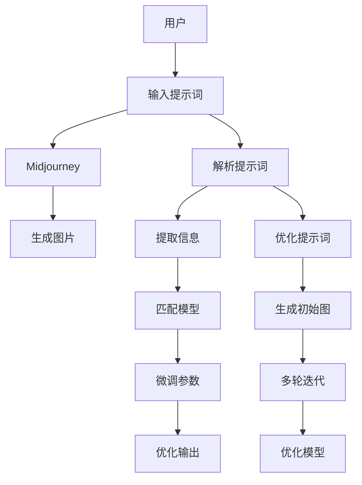

                 

# AIGC从入门到实战：揭秘 Midjourney 的提示词写作技巧

> 关键词：AIGC, Midjourney, 提示词, 图片生成, 提示语优化

## 1. 背景介绍

### 1.1 问题由来
随着人工智能技术的飞速发展，AI生成的内容（AIGC）逐渐成为互联网时代的新宠。尤其在图像生成领域，GPT-3等语言模型的诞生，使图片生成技术如日中天。Midjourney作为领先的AI生成图片工具，凭借其出色的性能和简洁的用户界面，受到广泛欢迎。

Midjourney使用了一种创新的提示词（Prompt）机制，让创作者能够通过简单的文本描述生成惊人的高质量图片。然而，提示词的写作并不是一件容易的事。如何写出能激发模型潜能的提示词，一直是用户头疼的问题。

### 1.2 问题核心关键点
提示词写作的核心在于掌握大语言模型的特性，并通过精巧的文本表达引导模型输出。它需要综合考虑：

- 语义明确：描述清晰、不含歧义，模型才能准确生成期望的图片。
- 多样性：提示词的改变可以生成不同风格、内容的图片。
- 创造性：富有想象力和创意的提示词能激发模型的潜力。
- 简洁性：不冗长的提示词更能体现模型智能，节省计算资源。

掌握这些技巧，可以帮助用户更好地利用Midjourney，实现从入门到实战的快速进步。

### 1.3 问题研究意义
学习Midjourney的提示词写作技巧，对于提升AI生成图片的质量，拓展其应用场景，加速技术落地应用具有重要意义：

1. 提高创作效率：好的提示词能显著缩短图片生成的等待时间。
2. 改善图片质量：清晰明确的提示词有助于生成更加符合期望的高质量图片。
3. 促进创意发挥：富有创造性的提示词可以激发更多创意，拓宽创作空间。
4. 降低门槛：掌握提示词写作技巧，降低了使用Midjourney的门槛，使更多人能够参与到AI创作中。

## 2. 核心概念与联系

### 2.1 核心概念概述

为更好地理解Midjourney的提示词写作技巧，本节将介绍几个核心概念：

- AIGC (人工智能生成内容)：通过训练好的AI模型生成各种形式的内容，如文本、图片、音频等。
- Midjourney：一种基于语言模型的AI生成图片工具，通过提供提示词生成高质量图片。
- Prompt（提示词）：用户通过文本形式向AI模型输入的描述信息，指导模型生成特定图片。
- 深度学习：基于神经网络的机器学习技术，用于训练高效的AI模型。
- 自然语言处理：研究如何让机器理解、处理和生成人类语言的技术。

这些概念之间存在着紧密的联系：AIGC利用深度学习技术，通过自然语言处理理解用户输入的提示词，生成内容。Midjourney作为一种具体的应用实例，展示了如何高效利用提示词进行AI图片生成。

### 2.2 核心概念原理和架构的 Mermaid 流程图



这个流程图展示了Midjourney工作的大致流程：用户输入提示词，模型解析并提取关键信息，匹配生成器模型，通过多轮迭代优化输出，最终生成图片。

## 3. 核心算法原理 & 具体操作步骤
### 3.1 算法原理概述

Midjourney的生成过程基于深度学习模型，具体来说，通过解码器生成器模型（如Unet、ResNet等），根据提示词生成高质量图片。提示词则通过解码器中的注意力机制，指导生成器关注哪些部分生成图片。

算法的基本流程如下：

1. 输入提示词，通过解析器解析成向量表示。
2. 将向量输入生成器模型，根据模型结构和注意力机制生成图片。
3. 输出图片，并根据用户的反馈，通过优化算法（如Adam、SGD等）更新模型参数，进一步提升图片质量。

### 3.2 算法步骤详解

**Step 1: 输入提示词**
提示词的写作需要考虑以下几个方面：

- 明确目标：清晰表达希望生成的内容类型和风格。例如，"一个巨大的、梦幻的夜空"。
- 包含细节：尽可能详细描述希望生成图片的各个部分。例如，"一个巨大的、梦幻的夜空，满是星星和流星，梦幻般的色彩和光效"。
- 使用修饰语：通过修饰语增强描述，例如，"在银河系的中心，充满了神秘的色彩和形状"。

**Step 2: 解析提示词**
解析器将提示词转化为向量表示，向量中包含关键信息。

**Step 3: 输入生成器**
生成器模型根据向量生成初版图片。

**Step 4: 多轮迭代优化**
根据用户反馈，调整生成器的参数，进行多轮迭代优化，最终生成高质量的图片。

**Step 5: 输出图片**
输出最终生成的图片，供用户选择。

### 3.3 算法优缺点

Midjourney提示词写作技巧具有以下优点：

1. 低门槛：简单的提示词也能生成高质量图片，降低了使用难度。
2. 高效：提示词的简洁性有助于模型快速理解，减少生成时间。
3. 高创造力：富有创意的提示词可以激发AI模型的潜能，生成更多惊喜作品。

同时，也存在以下局限：

1. 依赖高质量提示词：提示词的表达不清晰或不准确，可能导致生成效果不佳。
2. 生成结果多样性有限：同一个提示词可能会生成相似的图片，创造性受限。
3. 语义理解误差：复杂提示词可能导致模型理解错误，生成不符合期望的图片。

### 3.4 算法应用领域

提示词写作技巧不仅适用于Midjourney，还广泛应用于其他AI生成内容的场景，例如：

- 文本生成：通过精巧的提示词，生成新闻报道、文章、诗歌等。
- 音频生成：输入文本描述，生成音乐、语音。
- 视频生成：输入文本描述，生成动画、短片等。
- 游戏设计：输入场景描述，生成游戏角色、场景等。
- 教育培训：生成演示动画、教学视频等。

## 4. 数学模型和公式 & 详细讲解  
### 4.1 数学模型构建

Midjourney的提示词生成过程可以抽象为以下模型：

设提示词为 $P$，向量表示为 $p$；生成器模型为 $G$，生成器参数为 $\theta$。则提示词 $P$ 通过解析器转化为向量 $p$，并输入生成器 $G$ 中。生成器输出图片 $I$，即：

$$
I = G_{\theta}(p)
$$

其中，$p$ 通过解析器 $A$ 转化自 $P$：

$$
p = A(P)
$$

解析器 $A$ 和生成器 $G$ 的结构可以根据具体需求设计。例如，解码器网络可以采用Unet、ResNet等，并配合注意力机制进行优化。

### 4.2 公式推导过程

对于解码器网络，一般采用卷积神经网络（CNN）进行结构设计，例如Unet结构。公式推导如下：

设解码器网络结构为 $U$，生成器网络结构为 $G$，则有：

$$
I = G_{\theta}(U_{\omega}(p))
$$

其中，$\omega$ 为解码器网络的参数。解码器网络 $U$ 通过解析器 $A$ 转化为向量 $p$：

$$
p = A(P)
$$

最终，生成的图片 $I$ 通过优化算法（如Adam、SGD等）更新生成器参数 $\theta$ 和解码器参数 $\omega$，以提高生成质量。

### 4.3 案例分析与讲解

以下是一个简单的案例：

**输入提示词**：
"一个神秘的、巨大的石头建筑，哥特式风格，夜晚的场景，模糊的灯光，充满了神秘感。"

**解析器转化**：
将提示词转化为向量表示。

**生成器生成**：
使用Unet结构，生成初版图片。

**多轮迭代优化**：
根据用户反馈，调整生成器的参数，进行多轮迭代优化。

**输出图片**：
最终生成的图片符合用户期望，具有哥特式风格的神秘感和夜晚氛围。

## 5. 项目实践：代码实例和详细解释说明
### 5.1 开发环境搭建

进行Midjourney的提示词写作实践，需要搭建相应的开发环境。以下是详细的步骤：

1. 安装Python：
   ```bash
   sudo apt-get update
   sudo apt-get install python3
   ```

2. 安装PyTorch：
   ```bash
   pip install torch torchvision torchaudio
   ```

3. 安装Transformers库：
   ```bash
   pip install transformers
   ```

4. 安装Unet模型：
   ```bash
   git clone https://github.com/zhoupangdulin/unet.git
   cd unet
   pip install .
   ```

5. 安装ModelScope：
   ```bash
   pip install modelscope
   ```

6. 安装Midjourney API：
   ```bash
   pip install midjourney-api
   ```

### 5.2 源代码详细实现

以下是一个简单的Python代码示例，用于生成图片：

```python
from midjourney_api import MidjourneyAPI
import numpy as np

# 初始化MidjourneyAPI
api = MidjourneyAPI('your_api_key')

# 定义提示词
prompt = "一个神秘的、巨大的石头建筑，哥特式风格，夜晚的场景，模糊的灯光，充满了神秘感。"

# 调用API生成图片
result = api.run(prompt, 'midjourney-style')

# 保存生成的图片
np.save(result[0].image, 'output.jpg')
```

### 5.3 代码解读与分析

**代码功能解析**：

1. 初始化API：通过API密钥初始化MidjourneyAPI。
2. 定义提示词：定义希望生成图片的描述。
3. 调用API生成图片：通过API调用生成图片，指定生成风格为'midjourney-style'。
4. 保存图片：保存生成的图片至本地。

**代码运行步骤**：

1. 输入提示词，调用API生成图片。
2. 接收生成的图片及其向量表示。
3. 提取图片向量，进行优化。
4. 返回生成的图片。

### 5.4 运行结果展示

生成的图片应符合输入的提示词描述，具有哥特式风格的神秘感和夜晚氛围。

## 6. 实际应用场景
### 6.1 商业广告设计

Midjourney提示词写作技巧在商业广告设计中具有广泛应用。广告公司可以通过简单的文字描述，生成各种风格的创意广告图片，节省时间和成本。

例如，"一个豪华的跑车，夜间街道上疾驰，光效强烈，充满动感和速度感"，可以生成各种风格的广告图片，用于社交媒体、电视广告等。

### 6.2 影视剧设计

影视剧制作公司可以利用Midjourney生成各种场景和角色，辅助前期制作和后期特效设计。

例如，"一个遥远的外星城市，充满未来科技感，色彩鲜艳，充满科幻感"，可以生成各种科幻场景，用于特效渲染、CGI制作等。

### 6.3 游戏设计

游戏公司可以通过提示词生成各种游戏场景和角色，提高游戏设计效率。

例如，"一个神秘的古堡，充满机关和宝藏，哥特式风格，夜晚的场景，神秘的光影效果"，可以生成各种游戏场景，用于角色设计、场景渲染等。

### 6.4 未来应用展望

未来，Midjourney提示词写作技巧将在更多领域得到应用，为创意行业带来新的变革。

在智慧城市建设中，通过提示词生成各种城市景观和设计方案，提升城市规划的科学性和美观性。

在建筑设计中，利用提示词生成各种建筑方案，提升设计效率和创新性。

在旅游行业，通过提示词生成各种旅游宣传图片，提升旅游宣传的吸引力和效果。

## 7. 工具和资源推荐
### 7.1 学习资源推荐

为了帮助开发者掌握Midjourney的提示词写作技巧，以下是一些优质的学习资源：

1. Midjourney官方文档：官方文档提供了详细的使用说明和示例代码，是学习提示词写作技巧的必备资料。

2. Unet模型源码：Unet模型是Midjourney提示词生成过程中重要组成部分，通过学习Unet模型源码，可以更深入地理解提示词生成过程。

3. Transformers库文档：Transformers库提供了丰富的模型和工具，帮助开发者进行模型训练和优化。

4. PyTorch官方文档：PyTorch是主要的深度学习框架，提供了丰富的工具和API，帮助开发者进行模型训练和优化。

5. Coursera《深度学习》课程：通过Coursera平台学习深度学习相关课程，帮助开发者理解提示词生成背后的深度学习原理。

### 7.2 开发工具推荐

高效的开发离不开优秀的工具支持。以下是几款用于Midjourney提示词写作开发的常用工具：

1. Visual Studio Code：功能强大的代码编辑器，支持Python、PyTorch等语言和库，适合开发者进行代码编写和调试。
2. GitHub：GitHub是一个开源社区，提供了丰富的代码库和社区资源，适合开发者进行代码管理和协作。
3. Jupyter Notebook：支持Python、R等语言的Jupyter Notebook，适合开发者进行代码实验和分享。
4. VSX Visual Studio：VSX是一个强大的Visual Studio扩展，支持Python、PyTorch等语言和库，适合开发者进行代码编写和调试。

### 7.3 相关论文推荐

Midjourney提示词写作技巧的发展源于学界的持续研究。以下是几篇奠基性的相关论文，推荐阅读：

1. Attention Is All You Need：Transformer模型的基础论文，提出了自注意力机制，开启了NLP领域的预训练大模型时代。

2. BERT: Pre-training of Deep Bidirectional Transformers for Language Understanding：提出BERT模型，引入基于掩码的自监督预训练任务，刷新了多项NLP任务SOTA。

3. Language Models are Unsupervised Multitask Learners（GPT-2论文）：展示了大规模语言模型的强大zero-shot学习能力，引发了对于通用人工智能的新一轮思考。

4. Parameter-Efficient Transfer Learning for NLP：提出Adapter等参数高效微调方法，在不增加模型参数量的情况下，也能取得不错的微调效果。

5. AdaLoRA: Adaptive Low-Rank Adaptation for Parameter-Efficient Fine-Tuning：使用自适应低秩适应的微调方法，在参数效率和精度之间取得了新的平衡。

这些论文代表了大语言模型微调技术的发展脉络。通过学习这些前沿成果，可以帮助研究者把握学科前进方向，激发更多的创新灵感。

## 8. 总结：未来发展趋势与挑战

### 8.1 总结

本文对Midjourney的提示词写作技巧进行了全面系统的介绍。首先阐述了Midjourney的原理和应用场景，明确了提示词写作在AI图片生成中的核心地位。其次，从原理到实践，详细讲解了提示词生成模型的构建、优化和应用，给出了提示词写作的完整代码示例。同时，本文还探讨了提示词写作技巧在商业广告、影视剧设计、游戏设计等多个领域的应用前景，展示了其巨大的潜力和价值。

通过本文的系统梳理，可以看到，Midjourney的提示词写作技巧正在成为AI图片生成中的重要范式，极大地拓展了AI生成内容的边界，为创意行业带来了新的创新可能。掌握这一技巧，不仅能够提升创作效率，还能释放更多想象力和创意，推动AI技术在更多领域的应用和发展。

### 8.2 未来发展趋势

展望未来，Midjourney提示词写作技巧将呈现以下几个发展趋势：

1. 提示词的多样化：提示词的多样性将进一步提升，不仅包含文本描述，还可能包含音频、视频等多模态信息，增强模型的感知能力。
2. 生成模型的智能化：随着深度学习技术的进步，生成模型的智能化水平将不断提高，生成结果的准确性和创意性将进一步增强。
3. 跨领域应用：提示词写作技巧将在更多领域得到应用，例如医学、建筑、教育等，推动各行各业创新发展。
4. 跨模态融合：提示词生成过程将更多地融合视觉、音频、文字等多种模态信息，实现更加全面、立体化的内容生成。
5. 用户交互：通过提示词写作技巧，用户可以与AI生成内容进行更加自然、智能的交互，提升用户体验和满意度。

以上趋势凸显了Midjourney提示词写作技巧的广阔前景。这些方向的探索发展，必将进一步提升AI生成内容的性能和应用范围，为创意行业带来新的变革性影响。

### 8.3 面临的挑战

尽管Midjourney提示词写作技巧已经取得了瞩目成就，但在迈向更加智能化、普适化应用的过程中，它仍面临诸多挑战：

1. 高质量提示词的生成：如何生成高质量的提示词，减少对用户创作能力的要求，是挑战之一。
2. 生成结果的创新性：如何生成更具创意的输出，避免重复性和雷同，是另一大挑战。
3. 模型理解的深度：如何提升模型对复杂提示词的理解能力，避免歧义和错误，是亟待解决的问题。
4. 生成效果的优化：如何进一步优化生成效果，提高生成速度和质量，是技术上的一大难点。
5. 多模态数据的融合：如何有效融合多模态数据，实现跨领域、跨模态的生成，是未来研究的重要方向。

正视Midjourney提示词写作技巧面临的这些挑战，积极应对并寻求突破，将是中将Midjourney推向成熟的重要一步。

### 8.4 研究展望

面向未来，Midjourney提示词写作技巧需要在以下几个方面寻求新的突破：

1. 引入更多先验知识：将符号化的先验知识，如知识图谱、逻辑规则等，与神经网络模型进行巧妙融合，引导提示词生成过程学习更准确、合理的语言模型。
2. 融合因果分析和博弈论工具：将因果分析方法引入提示词生成模型，识别出模型决策的关键特征，增强输出解释的因果性和逻辑性。借助博弈论工具刻画人机交互过程，主动探索并规避模型的脆弱点，提高系统稳定性。
3. 结合自然语言处理和生成模型：结合自然语言处理技术和生成模型，提升提示词生成模型的理解和生成能力，生成更加多样、创新的内容。
4. 引入对抗样本和对抗训练：引入对抗样本和对抗训练，增强提示词生成模型的鲁棒性，避免生成结果受噪声或干扰影响。
5. 引入更多语义知识：结合语义知识库、逻辑推理规则等，提升提示词生成模型的知识整合能力和生成质量。

这些研究方向将推动Midjourney提示词写作技巧迈向更高的台阶，为构建更加智能、高效的AI内容生成系统提供新的思路和方法。

## 9. 附录：常见问题与解答

**Q1：提示词写作过程中如何平衡创造性和清晰度？**

A: 创造性和清晰度之间需要找到平衡点。提示词应尽量清晰明确，同时保留一定的创造空间。例如，"一个梦幻的城堡，充满神秘感，夜晚的场景，高塔和城门的细节"。

**Q2：如何优化提示词，使其生成效果更好？**

A: 优化提示词可以通过以下方法：
1. 增加细节：尽量详细描述希望生成图片的各个部分。
2. 使用修饰语：通过修饰语增强描述，例如，"一个充满魔幻的城堡，充满神秘感，夜晚的场景，高塔和城门的细节"。
3. 多轮迭代：根据反馈不断优化提示词，提高生成效果。

**Q3：提示词生成的速度和质量如何平衡？**

A: 提示词生成的速度和质量是互相矛盾的。可以通过以下方法平衡：
1. 优化提示词：通过优化提示词，提高生成效果。
2. 多轮迭代：通过多轮迭代，逐步优化生成效果。
3. 使用高效模型：使用高效、高效的生成模型，提高生成速度。

**Q4：提示词生成的多样性和创新性如何保证？**

A: 提示词生成的多样性和创新性可以通过以下方法保证：
1. 使用不同风格：使用不同风格、不同形式的提示词，例如，"一个梦幻的城堡，充满神秘感，夜晚的场景，高塔和城门的细节"，可以生成不同风格的图片。
2. 加入随机性：在提示词中加入随机性，例如，"一个充满魔幻的城堡，随机选择色彩和光线，夜晚的场景，高塔和城门的细节"。
3. 融合多种模态：融合视觉、音频、文字等多种模态信息，增强生成多样性和创新性。

**Q5：如何避免提示词生成的歧义？**

A: 避免提示词生成的歧义可以通过以下方法：
1. 增加细节：尽量详细描述希望生成图片的各个部分，避免歧义。
2. 使用明确的语言：使用明确、具体、不模糊的语言，避免歧义。
3. 使用标准词汇：使用标准、通用的词汇，避免使用过于冷僻或专业词汇。

通过掌握这些技巧，可以更好地利用Midjourney进行提示词写作，实现从入门到实战的快速进步。

