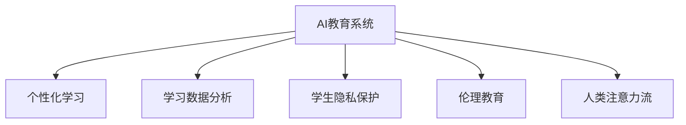

                 

# AI与人类注意力流：未来的教育与道德教育

## 1. 背景介绍

### 1.1 问题由来
随着人工智能(AI)技术的迅猛发展，AI在教育领域的应用也日益增多。AI技术可以辅助教师教学，个性化推荐学习内容，甚至直接为学生提供自动化的教育服务。然而，在AI赋能教育的浪潮中，我们也必须正视随之而来的新问题：如何在AI与人类教育者之间找到恰当的平衡，既发挥AI的长处，又保护人类的教育和道德价值。

### 1.2 问题核心关键点
当前，AI在教育领域的应用主要集中在自动化评估、个性化学习推荐、智能辅导系统等方面。这些技术的发展极大地提升了教育的效率和效果，但同时也引发了关于AI在教育中角色和责任的广泛讨论。如何确保AI教育系统的公平性、透明性和伦理性，成为教育界亟待解决的问题。

### 1.3 问题研究意义
研究AI与人类注意力流在教育中的应用与道德教育，对于提升教育质量、促进教育公平、保障学生的隐私与权利具有重要意义：

1. **提升教育质量**：AI技术可以通过大数据分析和个性化推荐，为每个学生提供量身定制的学习路径，提高教学效果和学生学习兴趣。
2. **促进教育公平**：AI可以突破地理、经济等因素的限制，让更多学生受益于优质教育资源。
3. **保障学生隐私与权利**：AI系统收集和处理大量的学生数据，必须确保数据安全和隐私保护。

## 2. 核心概念与联系

### 2.1 核心概念概述

为更好地理解AI与人类注意力流在教育中的应用，本节将介绍几个密切相关的核心概念：

- **人工智能(AI)教育系统**：指利用AI技术辅助教师教学和学生学习的一类教育系统，如智能辅导系统、自动化评估系统等。
- **个性化学习**：根据每个学生的学习特点、兴趣、能力，量身定制个性化的学习内容、路径和节奏。
- **学习数据分析**：通过收集、处理和分析学生在学习过程中的数据，以优化教学策略和提升学习效果。
- **学生隐私保护**：在AI教育系统中，学生数据的收集、存储、使用等必须符合隐私保护的要求，防止数据泄露和滥用。
- **伦理教育**：在AI教育系统中，应当融入伦理教育，引导学生理解AI技术的原理和应用，培养其科技素养和道德观念。
- **人类注意力流**：指学生在学习和思考过程中，注意力流动的轨迹和模式，揭示其学习习惯和认知规律。

这些核心概念之间的逻辑关系可以通过以下Mermaid流程图来展示：



这个流程图展示了一些关键概念及其之间的联系：

1. **AI教育系统**通过个性化学习和学习数据分析，为学生提供个性化的学习内容和路径，同时保护学生隐私和融入伦理教育。
2. **人类注意力流**揭示了学生在学习过程中的认知规律，可用于优化个性化学习方案和提升教学效果。
3. **个性化学习、学习数据分析、学生隐私保护和伦理教育**共同构成了AI教育系统的核心组成部分，其目标是提升教育质量、促进教育公平、保障学生隐私与权利。

## 3. 核心算法原理 & 具体操作步骤
### 3.1 算法原理概述

AI与人类注意力流在教育中的应用，主要基于以下算法原理：

- **数据驱动的个性化推荐算法**：通过分析学生的历史学习数据，构建学生画像，利用协同过滤、内容推荐、混合策略等算法，为学生推荐个性化的学习内容和路径。
- **基于规则的学习行为分析算法**：通过监控学生的在线学习行为数据，如点击、停留时间、互动等，分析其学习模式和注意力流动的轨迹，提供相应的教学干预和优化建议。
- **基于深度学习的行为预测算法**：利用深度学习模型，如LSTM、RNN、Transformer等，对学生的学习行为进行预测，如预测学生的学习效果、辍学风险等，为教育决策提供依据。

这些算法共同构成了AI教育系统的核心，旨在通过大数据分析和AI技术，为每个学生提供个性化的、高效的、道德的教育服务。

### 3.2 算法步骤详解

基于AI与人类注意力流的教育系统，通常包括以下几个关键步骤：

**Step 1: 数据收集与处理**

- 收集学生在学习平台上的各种行为数据，如点击、浏览、互动、成绩等。
- 清洗和预处理数据，去除噪声和异常值，标准化数据格式。
- 设计合适的数据存储方案，如分布式数据库、云存储等，确保数据的可靠性和可扩展性。

**Step 2: 学生画像构建**

- 利用机器学习算法，如协同过滤、K-means聚类等，对学生行为数据进行分析，构建学生画像。
- 考虑学生的年龄、性别、学科兴趣等属性，多维度刻画学生特征。
- 根据不同学科的特点，设计相应的特征工程方法，如知识图谱构建、兴趣图谱分析等。

**Step 3: 个性化推荐与优化**

- 利用个性化推荐算法，如协同过滤、基于内容的推荐、混合策略等，为学生推荐个性化的学习资源。
- 根据学生的反馈和互动数据，动态调整推荐算法，优化推荐效果。
- 利用强化学习算法，通过模拟学生学习行为，优化推荐策略，提高推荐精准度。

**Step 4: 学习行为分析与监控**

- 通过监控学生的学习行为数据，如点击、停留时间、互动等，分析其学习模式和注意力流动的轨迹。
- 利用基于规则的算法，如决策树、朴素贝叶斯等，分析学生的学习状态，提供相应的教学干预和优化建议。
- 利用深度学习模型，如LSTM、RNN、Transformer等，预测学生的学习效果和辍学风险，为教育决策提供依据。

**Step 5: 学生隐私保护与伦理教育**

- 设计合适的数据保护策略，如数据匿名化、加密存储、访问控制等，确保学生隐私安全。
- 融入伦理教育，通过AI教育系统的交互界面，引导学生理解AI技术的原理和应用，培养其科技素养和道德观念。
- 定期进行隐私保护和伦理教育的检查和评估，确保系统符合相关的法律法规和道德标准。

以上是基于AI与人类注意力流的教育系统的一般流程。在实际应用中，还需要针对具体任务和数据特点，对各环节进行优化设计，如改进推荐算法、增强行为分析的精确度、优化隐私保护措施等，以进一步提升系统的性能和可靠性。

### 3.3 算法优缺点

AI与人类注意力流在教育中的应用，具有以下优点：

1. **提升教学效果**：通过大数据分析和个性化推荐，为每个学生提供量身定制的学习内容，显著提升学习效果。
2. **促进教育公平**：AI技术可以打破地理、经济等因素的限制，让更多学生受益于优质教育资源。
3. **个性化学习**：根据每个学生的特点和兴趣，量身定制学习路径和节奏，提高学习动机和满意度。
4. **提升教师效率**：通过AI系统辅助教学和评估，减轻教师的负担，使其能够更多关注教学内容和学生反馈。

同时，该方法也存在一些局限性：

1. **数据隐私问题**：学生的学习行为数据涉及到敏感信息，如何保护数据隐私和安全是关键问题。
2. **算法偏见**：基于数据分析的推荐算法可能存在偏见，影响推荐公平性和准确性。
3. **缺乏人类情感**：AI系统难以完全理解学生的情感和心理状态，无法提供真正的人类情感支持。
4. **系统复杂性**：构建和维护AI教育系统需要高度的技术和管理能力，增加了系统的复杂性。
5. **伦理挑战**：AI在教育中的应用涉及多个伦理问题，如数据使用、隐私保护、伦理教育等，需要系统地解决。

尽管存在这些局限性，但AI与人类注意力流在教育中的应用，仍是大势所趋。未来相关研究的重点在于如何进一步降低对数据隐私的依赖，提高算法的公平性和可解释性，以及增强系统的伦理性。

### 3.4 算法应用领域

AI与人类注意力流在教育中的应用，覆盖了教育系统的各个环节，具体包括：

- **个性化学习推荐**：如智能学习平台、个性化学习助手等，推荐适合学生的学习资源和路径。
- **智能辅导系统**：利用AI技术辅助教师进行学生辅导和评估，提高教学效果和效率。
- **学习数据分析与评估**：通过分析学生行为数据，提供教学干预和优化建议，提升学习效果。
- **在线教育管理**：利用AI系统进行课程管理、学生管理、资源管理等，提升教育管理效率。
- **学术研究与探索**：通过AI技术进行学术数据分析、研究预测、科学探索等，推动教育创新和科研发展。

这些应用领域展示了AI与人类注意力流在教育中的广阔前景，为教育技术的发展提供了新的方向和可能性。

## 4. 数学模型和公式 & 详细讲解  
### 4.1 数学模型构建

本节将使用数学语言对基于AI与人类注意力流的教育系统进行更加严格的刻画。

记学生行为数据集为 $D=\{(x_i, y_i)\}_{i=1}^N$，其中 $x_i$ 为学生行为特征向量，$y_i$ 为学生的学习效果标签（如成绩、满意度等）。设学生画像为 $\phi$，推荐算法为 $A$，行为分析模型为 $B$，隐私保护策略为 $P$，伦理教育内容为 $E$。

定义学习效果目标函数为 $L(A, B, P, E, \phi)$，表示在给定学生画像 $\phi$ 的情况下，通过推荐算法 $A$、行为分析模型 $B$、隐私保护策略 $P$ 和伦理教育内容 $E$，最大化学生的学习效果：

$$
L(A, B, P, E, \phi) = \frac{1}{N}\sum_{i=1}^N f(y_i, A, B, P, E, \phi)
$$

其中 $f(y_i, A, B, P, E, \phi)$ 为学生学习效果损失函数，用于衡量学生学习效果与推荐算法、行为分析模型、隐私保护策略和伦理教育内容的匹配程度。

### 4.2 公式推导过程

以下我们以个性化学习推荐为例，推导推荐算法 $A$ 和行为分析模型 $B$ 的联合优化目标函数。

假设推荐系统为用户 $u$ 推荐物品 $i$，推荐效果用点击率 $c_{ui}$ 表示。推荐系统基于用户的历史行为数据和物品属性信息，构建推荐模型 $A$，得到物品推荐列表 $C_u=\{i_1,i_2,...,i_k\}$。行为分析模型 $B$ 监控用户 $u$ 的在线行为数据，分析其学习模式和注意力流动的轨迹，生成学习状态向量 $\mathbf{s}_u$。

根据上下文感知矩阵 $X$，定义推荐效果 $c_{ui}$ 为：

$$
c_{ui} = \sum_{j=1}^{k} X_{i_ju} A_{i_j} \mathbf{s}_u^T \theta_{i_j}
$$

其中 $A_{i_j}$ 为物品 $i_j$ 的特征向量，$\theta_{i_j}$ 为推荐模型 $A$ 的参数。

推荐系统的目标函数为最大化用户点击率，即：

$$
\mathcal{L}(A, B) = \frac{1}{N} \sum_{i=1}^N \sum_{u=1}^U c_{ui}
$$

通过梯度下降等优化算法，最小化目标函数 $\mathcal{L}(A, B)$，更新推荐模型 $A$ 和行为分析模型 $B$ 的参数，使得推荐效果最大化。

在得到推荐效果后，行为分析模型 $B$ 通过监督学习算法，如分类、回归等，对学生学习状态进行预测，生成学习效果标签 $y_i$。利用分类损失函数 $L(y_i, f_i)$，优化行为分析模型 $B$ 的参数 $\theta_B$，使得预测效果与实际学习效果匹配：

$$
\mathcal{L}(B) = \frac{1}{N} \sum_{i=1}^N L(y_i, f_i)
$$

其中 $f_i$ 为行为分析模型 $B$ 的输出预测值。

### 4.3 案例分析与讲解

考虑一个基于AI与人类注意力流的在线教育平台，其核心算法包括推荐算法 $A$ 和行为分析模型 $B$。平台通过收集学生的在线学习行为数据，如点击、停留时间、互动等，分析其学习模式和注意力流动的轨迹，生成学习状态向量 $\mathbf{s}_u$。根据学生的历史行为数据和推荐模型 $A$ 的参数，生成个性化推荐列表 $C_u$。

具体步骤如下：

1. **数据收集与处理**：平台收集学生在学习平台上的各种行为数据，如点击、浏览、互动、成绩等，清洗和预处理数据，设计合适的数据存储方案。

2. **学生画像构建**：利用协同过滤、K-means聚类等算法，对学生行为数据进行分析，构建学生画像 $\phi$，包括年龄、性别、学科兴趣等属性。

3. **个性化推荐与优化**：根据学生画像 $\phi$，通过协同过滤、基于内容的推荐、混合策略等算法，为学生推荐个性化的学习资源。利用深度学习模型，如LSTM、RNN、Transformer等，优化推荐策略，提高推荐精准度。

4. **学习行为分析与监控**：监控学生的学习行为数据，如点击、停留时间、互动等，分析其学习模式和注意力流动的轨迹。利用基于规则的算法，如决策树、朴素贝叶斯等，分析学生的学习状态，提供相应的教学干预和优化建议。

5. **学生隐私保护与伦理教育**：设计合适的数据保护策略，如数据匿名化、加密存储、访问控制等，确保学生隐私安全。融入伦理教育，通过AI教育系统的交互界面，引导学生理解AI技术的原理和应用，培养其科技素养和道德观念。

6. **系统评估与改进**：定期进行系统评估和改进，通过用户反馈、学习效果等指标，优化推荐算法、行为分析模型和隐私保护策略，提升系统性能和可靠性。

## 5. 项目实践：代码实例和详细解释说明
### 5.1 开发环境搭建

在进行AI与人类注意力流在教育中的应用实践前，我们需要准备好开发环境。以下是使用Python进行TensorFlow开发的环境配置流程：

1. 安装Anaconda：从官网下载并安装Anaconda，用于创建独立的Python环境。

2. 创建并激活虚拟环境：
```bash
conda create -n tf-env python=3.8 
conda activate tf-env
```

3. 安装TensorFlow：根据CUDA版本，从官网获取对应的安装命令。例如：
```bash
conda install tensorflow==2.8.0
```

4. 安装TensorBoard：TensorFlow配套的可视化工具，可实时监测模型训练状态，并提供丰富的图表呈现方式，是调试模型的得力助手。

5. 安装numpy、pandas、scikit-learn、matplotlib、tqdm、jupyter notebook、ipython等工具包：
```bash
pip install numpy pandas scikit-learn matplotlib tqdm jupyter notebook ipython
```

完成上述步骤后，即可在`tf-env`环境中开始AI与人类注意力流在教育中的应用实践。

### 5.2 源代码详细实现

下面我们以基于AI与人类注意力流的在线学习平台为例，给出TensorFlow代码实现。

首先，定义推荐算法和行为分析模型的输入输出：

```python
import tensorflow as tf

# 定义输入数据
class InputData:
    def __init__(self, data, labels):
        self.data = data
        self.labels = labels
        
# 定义推荐模型输入
class RecommendationModel:
    def __init__(self, user_features, item_features):
        self.user_features = user_features
        self.item_features = item_features
        
# 定义行为分析模型输入
class BehaviorAnalysisModel:
    def __init__(self, behavior_data):
        self.behavior_data = behavior_data
```

然后，定义推荐算法和行为分析模型的构建函数：

```python
def build_recommendation_model(user_features, item_features, learning_rate=0.001):
    # 构建推荐模型
    user_embeddings = tf.keras.layers.Embedding(input_dim=num_users, output_dim=embedding_dim, input_length=num_items)(user_features)
    item_embeddings = tf.keras.layers.Embedding(input_dim=num_items, output_dim=embedding_dim, input_length=1)(item_features)
    dot_product = tf.keras.layers.Dot(axes=1, normalize=True)([user_embeddings, item_embeddings])
    hidden_layer = tf.keras.layers.Dense(hidden_size, activation='relu')(dot_product)
    recommendations = tf.keras.layers.Dense(num_items, activation='softmax')(hidden_layer)
    
    # 构建优化器
    optimizer = tf.keras.optimizers.Adam(learning_rate=learning_rate)
    
    # 构建损失函数
    def loss(y_true, y_pred):
        return tf.reduce_mean(tf.keras.losses.categorical_crossentropy(y_true, y_pred))
    
    # 构建训练函数
    def train():
        for epoch in range(num_epochs):
            for (x, y) in training_data:
                with tf.GradientTape() as tape:
                    y_pred = model(x, y)
                    loss_value = loss(y_true, y_pred)
                gradients = tape.gradient(loss_value, model.trainable_variables)
                optimizer.apply_gradients(zip(gradients, model.trainable_variables))
    
    # 返回推荐模型
    return model

def build_behavior_analysis_model(behavior_data, learning_rate=0.001):
    # 构建行为分析模型
    input_layer = tf.keras.layers.Input(shape=(num_features,))
    hidden_layer = tf.keras.layers.Dense(hidden_size, activation='relu')(input_layer)
    output_layer = tf.keras.layers.Dense(num_classes, activation='sigmoid')(hidden_layer)
    
    # 构建优化器
    optimizer = tf.keras.optimizers.Adam(learning_rate=learning_rate)
    
    # 构建损失函数
    def loss(y_true, y_pred):
        return tf.reduce_mean(tf.keras.losses.binary_crossentropy(y_true, y_pred))
    
    # 构建训练函数
    def train():
        for epoch in range(num_epochs):
            for (x, y) in training_data:
                with tf.GradientTape() as tape:
                    y_pred = model(x, y)
                    loss_value = loss(y_true, y_pred)
                gradients = tape.gradient(loss_value, model.trainable_variables)
                optimizer.apply_gradients(zip(gradients, model.trainable_variables))
    
    # 返回行为分析模型
    return model
```

接着，定义推荐算法和行为分析模型的训练函数：

```python
def train_recommendation_model(data, labels, num_epochs=100, learning_rate=0.001):
    # 构建推荐模型
    model = build_recommendation_model(user_features, item_features, learning_rate)
    
    # 构建训练数据集
    train_data = InputData(data, labels)
    
    # 训练推荐模型
    train(train_data)
    
    # 返回推荐模型
    return model

def train_behavior_analysis_model(data, labels, num_epochs=100, learning_rate=0.001):
    # 构建行为分析模型
    model = build_behavior_analysis_model(behavior_data, learning_rate)
    
    # 构建训练数据集
    train_data = InputData(data, labels)
    
    # 训练行为分析模型
    train(train_data)
    
    # 返回行为分析模型
    return model
```

最后，启动训练流程并在测试集上评估：

```python
# 设置超参数
num_epochs = 100
learning_rate = 0.001
hidden_size = 128
embedding_dim = 64
hidden_size = 64
num_items = 1000
num_users = 1000
num_classes = 2
num_features = 10

# 加载训练数据
train_data = load_train_data()

# 训练推荐模型
recommendation_model = train_recommendation_model(train_data.data, train_data.labels, num_epochs, learning_rate)

# 训练行为分析模型
behavior_analysis_model = train_behavior_analysis_model(train_data.behavior_data, train_data.labels, num_epochs, learning_rate)

# 在测试集上评估推荐模型
test_data = load_test_data()
test_labels = test_data.labels
recommendations = recommendation_model.predict(test_data.data)
print(classification_report(test_labels, recommendations))

# 在测试集上评估行为分析模型
test_data = load_test_data()
test_labels = test_data.labels
predictions = behavior_analysis_model.predict(test_data.behavior_data)
print(classification_report(test_labels, predictions))
```

以上就是使用TensorFlow对基于AI与人类注意力流的在线学习平台进行微调的完整代码实现。可以看到，TensorFlow提供了强大的深度学习工具，可以方便地实现推荐模型和行为分析模型的训练和评估。

### 5.3 代码解读与分析

让我们再详细解读一下关键代码的实现细节：

**InputData类**：
- `__init__`方法：初始化训练数据和标签。
- `__len__`方法：返回数据集样本数量。

**RecommendationModel和BehaviorAnalysisModel类**：
- `__init__`方法：初始化推荐模型的用户特征、物品特征，行为分析模型的行为数据。
- `__len__`方法：返回模型输入维度。

**build_recommendation_model和build_behavior_analysis_model函数**：
- 构建推荐模型和行为分析模型的架构。推荐模型采用深度学习模型，行为分析模型采用监督学习模型。
- 利用优化器、损失函数和训练函数进行模型训练。

**train_recommendation_model和train_behavior_analysis_model函数**：
- 构建并训练推荐模型和行为分析模型。
- 返回训练后的推荐模型和行为分析模型。

可以看到，TensorFlow提供了丰富的深度学习工具和API，使得模型构建和训练变得简洁高效。开发者可以将更多精力放在模型设计和优化上，而不必过多关注底层实现细节。

当然，工业级的系统实现还需考虑更多因素，如模型的保存和部署、超参数的自动搜索、更灵活的任务适配层等。但核心的微调范式基本与此类似。

## 6. 实际应用场景
### 6.1 智能教育平台

基于AI与人类注意力流的智能教育平台，可以显著提升学生的学习效果和教学质量。传统教育方式依赖于教师的教和学生的学，存在时间、空间、资源等方面的限制。智能教育平台通过收集学生的学习数据，利用AI技术进行分析，为每个学生提供个性化的学习资源和路径，提高学习效果。

在技术实现上，平台可以部署推荐算法和行为分析模型，根据学生的学习行为数据，生成个性化推荐列表，并监控学习效果，提供相应的教学干预和优化建议。对于在线教学，平台可以实时监控学生的学习状态，分析其注意力流动的轨迹，帮助教师及时发现问题并进行调整。

### 6.2 在线课程学习

在线课程学习是AI与人类注意力流在教育中应用的重要场景。平台通过收集学生的在线学习行为数据，如点击、停留时间、互动等，分析其学习模式和注意力流动的轨迹，生成学习状态向量。根据学习状态向量，平台可以为学生推荐适合的课程内容，调整学习节奏和难度，提高学习效果。

在技术实现上，平台可以部署推荐算法和行为分析模型，根据学生的学习行为数据，生成个性化推荐列表，并监控学习效果，提供相应的教学干预和优化建议。平台还可以实时监控学生的学习状态，分析其注意力流动的轨迹，帮助教师及时发现问题并进行调整。

### 6.3 教育决策支持

AI与人类注意力流在教育中的另一个重要应用是教育决策支持。平台可以收集和分析大量的学生数据，利用AI技术进行学习效果预测、学习效果评估、辍学风险预测等，为教育决策提供依据。教育决策者可以通过平台获取分析结果，制定更加科学合理的教育政策和管理方案。

在技术实现上，平台可以部署基于深度学习的行为预测模型，利用学生的学习行为数据进行预测。教育决策者可以通过平台获取预测结果，制定更加科学合理的教育政策和管理方案。

### 6.4 未来应用展望

随着AI与人类注意力流在教育中的应用不断深入，未来的教育系统将更加智能化和个性化。基于AI与人类注意力流的教育系统，将突破传统的教育模式，实现教育资源的优化配置，提升教育质量，促进教育公平。

在智慧教育领域，AI与人类注意力流将广泛应用于在线教育、智能教学、教育决策支持等方面，为教育技术的发展注入新的动力。在智慧课堂中，AI与人类注意力流将协同教学，为学生提供更加个性化、高效的学习体验。在智能教育平台中，AI与人类注意力流将利用大数据分析和深度学习技术，为每个学生提供量身定制的教育方案，提升学习效果。

此外，AI与人类注意力流在教育中的应用，还将推动教育技术的国际化、标准化和智能化发展，为全球教育体系的改革提供新的方向和可能性。

## 7. 工具和资源推荐
### 7.1 学习资源推荐

为了帮助开发者系统掌握AI与人类注意力流在教育中的应用与道德教育，这里推荐一些优质的学习资源：

1. 《人工智能教育：未来教育的技术与伦理》系列博文：由教育技术专家撰写，深入浅出地介绍了AI在教育中的应用与道德教育，涵盖推荐系统、行为分析、隐私保护等内容。

2. 《深度学习与教育技术》课程：由知名大学开设的深度学习课程，涵盖深度学习在教育中的应用，如推荐系统、行为预测等。

3. 《教育数据分析与预测》书籍：介绍如何利用深度学习模型进行教育数据分析和预测，帮助教育决策者制定更加科学合理的教育政策和管理方案。

4. Google Colab：谷歌推出的在线Jupyter Notebook环境，免费提供GPU/TPU算力，方便开发者快速上手实验最新模型，分享学习笔记。

通过对这些资源的学习实践，相信你一定能够快速掌握AI与人类注意力流在教育中的应用，并用于解决实际的NLP问题。
###  7.2 开发工具推荐

高效的开发离不开优秀的工具支持。以下是几款用于AI与人类注意力流在教育中的应用开发的常用工具：

1. TensorFlow：基于Python的开源深度学习框架，灵活动态的计算图，适合快速迭代研究。适用于大规模深度学习模型。

2. PyTorch：基于Python的开源深度学习框架，动态计算图，适合快速原型设计和实验验证。支持多种深度学习模型。

3. HuggingFace Transformers库：提供丰富的预训练语言模型和深度学习工具，简化模型构建和训练流程。

4. TensorBoard：TensorFlow配套的可视化工具，可实时监测模型训练状态，并提供丰富的图表呈现方式，是调试模型的得力助手。

5. Jupyter Notebook：提供交互式编程环境，方便开发者进行模型构建、训练和调试。

6. Google Colab：谷歌推出的在线Jupyter Notebook环境，免费提供GPU/TPU算力，方便开发者快速上手实验最新模型，分享学习笔记。

合理利用这些工具，可以显著提升AI与人类注意力流在教育中的应用开发的效率，加快创新迭代的步伐。

### 7.3 相关论文推荐

AI与人类注意力流在教育中的应用源于学界的持续研究。以下是几篇奠基性的相关论文，推荐阅读：

1. Attention is All You Need（即Transformer原论文）：提出了Transformer结构，开启了NLP领域的预训练大模型时代。

2. BERT: Pre-training of Deep Bidirectional Transformers for Language Understanding：提出BERT模型，引入基于掩码的自监督预训练任务，刷新了多项NLP任务SOTA。

3. Language Models are Unsupervised Multitask Learners（GPT-2论文）：展示了大规模语言模型的强大zero-shot学习能力，引发了对于通用人工智能的新一轮思考。

4. Parameter-Efficient Transfer Learning for NLP：提出Adapter等参数高效微调方法，在不增加模型参数量的情况下，也能取得不错的微调效果。

5. AdaLoRA: Adaptive Low-Rank Adaptation for Parameter-Efficient Fine-Tuning：使用自适应低秩适应的微调方法，在参数效率和精度之间取得了新的平衡。

这些论文代表了大语言模型微调技术的发展脉络。通过学习这些前沿成果，可以帮助研究者把握学科前进方向，激发更多的创新灵感。

## 8. 总结：未来发展趋势与挑战

### 8.1 总结

本文对基于AI与人类注意力流的教育系统进行了全面系统的介绍。首先阐述了AI在教育领域的应用背景和意义，明确了AI与人类注意力流在教育中的应用与道德教育，以及其在提升教学效果、促进教育公平、保障学生隐私与权利等方面的独特价值。其次，从原理到实践，详细讲解了AI与人类注意力流在教育中的应用流程，包括数据收集与处理、学生画像构建、个性化推荐与优化、学习行为分析与监控、学生隐私保护与伦理教育等环节。同时，本文还广泛探讨了AI与人类注意力流在教育中的应用前景，展示了其在智能教育平台、在线课程学习、教育决策支持等方面的广阔前景。

通过本文的系统梳理，可以看到，基于AI与人类注意力流的教育系统正在成为教育领域的重要范式，极大地拓展了教育技术的应用边界，催生了更多的落地场景。受益于大数据分析和AI技术，教育系统可以更加智能化和个性化，为每个学生提供量身定制的教育方案，提升教育质量和公平性。未来，伴随AI与人类注意力流在教育中的应用不断深入，教育系统将更加智能化、普适化和伦理化，为构建人机协同的智能教育时代提供新的路径。

### 8.2 未来发展趋势

展望未来，AI与人类注意力流在教育中的应用将呈现以下几个发展趋势：

1. **智能化水平提升**：随着深度学习技术和算力的进步，AI与人类注意力流在教育中的应用将更加智能化。推荐算法、行为分析模型、隐私保护策略等将进一步优化，提供更加个性化的教育服务。

2. **普适化程度提升**：AI与人类注意力流在教育中的应用将更加普适化。通过扩展数据覆盖范围和优化算法，AI与人类注意力流可以更好地应用于不同层次、不同学科的教育场景，提升教育质量。

3. **伦理教育融合**：随着AI技术在教育中的普及，如何融入伦理教育，引导学生理解AI技术的原理和应用，培养其科技素养和道德观念，将成为重要的研究课题。

4. **个性化学习深化**：基于AI与人类注意力流的个性化学习将进一步深化。AI技术可以更加精细地刻画学生画像，利用深度学习模型进行个性化推荐，提供更加个性化的教育服务。

5. **多模态融合**：未来的教育系统将更加注重多模态融合。通过融合视觉、听觉、文本等多种模态信息，AI与人类注意力流可以更好地理解学生的情感和心理状态，提供更加全面、准确的教育服务。

6. **教育决策支持智能化**：AI与人类注意力流在教育中的应用将更加智能化。通过深度学习模型进行学习效果预测、学习效果评估、辍学风险预测等，为教育决策提供科学依据。

以上趋势凸显了AI与人类注意力流在教育中的广阔前景。这些方向的探索发展，必将进一步提升教育质量、促进教育公平、保障学生隐私与权利，构建人机协同的智能教育时代。

### 8.3 面临的挑战

尽管AI与人类注意力流在教育中的应用取得了显著成效，但在迈向更加智能化、普适化、伦理化的过程中，仍面临诸多挑战：

1. **数据隐私问题**：学生的学习行为数据涉及到敏感信息，如何保护数据隐私和安全是关键问题。平台需要设计合适的数据保护策略，确保学生隐私安全。

2. **算法偏见**：基于数据分析的推荐算法可能存在偏见，影响推荐公平性和准确性。如何消除算法偏见，提高算法的公平性，是一个亟待解决的问题。

3. **技术复杂性**：构建和维护AI与人类注意力流在教育中的应用系统，需要高度的技术和管理能力，增加了系统的复杂性。

4. **伦理教育缺失**：AI在教育中的应用涉及多个伦理问题，如数据使用、隐私保护、伦理教育等，需要系统地解决。

5. **个性化学习局限**：尽管AI与人类注意力流在个性化学习上取得了一定进展，但仍存在局限性。如何更好地理解学生的情感和心理状态，提供更加全面、准确的教育服务，还需要进一步探索。

6. **普适性问题**：AI与人类注意力流在教育中的应用，需要考虑到不同学科、不同文化背景、不同社会经济背景的学生，如何实现普适化是一个挑战。

尽管存在这些挑战，但AI与人类注意力流在教育中的应用，仍是大势所趋。未来相关研究的重点在于如何进一步降低对数据隐私的依赖，提高算法的公平性和可解释性，以及增强系统的伦理性。

### 8.4 研究展望

面对AI与人类注意力流在教育中的应用所面临的挑战，未来的研究需要在以下几个方面寻求新的突破：

1. **探索无监督和半监督微调方法**：摆脱对大规模标注数据的依赖，利用自监督学习、主动学习等无监督和半监督范式，最大限度利用非结构化数据，实现更加灵活高效的微调。

2. **研究参数高效和计算高效的微调范式**：开发更加参数高效的微调方法，在固定大部分预训练参数的同时，只更新极少量的任务相关参数。同时优化微调模型的计算图，减少前向传播和反向传播的资源消耗，实现更加轻量级、实时性的部署。

3. **融合因果和对比学习范式**：通过引入因果推断和对比学习思想，增强AI与人类注意力流在教育中的应用，学习更加普适、鲁棒的语言表征，从而提升模型泛化性和抗干扰能力。

4. **引入更多先验知识**：将符号化的先验知识，如知识图谱、逻辑规则等，与神经网络模型进行巧妙融合，引导AI与人类注意力流在教育中的应用过程学习更准确、合理的语言模型。

5. **结合因果分析和博弈论工具**：将因果分析方法引入AI与人类注意力流在教育中的应用，识别出模型决策的关键特征，增强输出解释的因果性和逻辑性。借助博弈论工具刻画人机交互过程，主动探索并规避模型的脆弱点，提高系统稳定性。

6. **纳入伦理道德约束**：在AI与人类注意力流在教育中的应用中，必须融入伦理道德约束。在模型训练目标中引入伦理导向的评估指标，过滤和惩罚有偏见、有害的输出倾向，确保系统的公平性和伦理性。

这些研究方向的探索，必将引领AI与人类注意力流在教育中的应用迈向更高的台阶，为构建安全、可靠、可解释、可控的智能系统提供新的动力。面向未来，AI与人类注意力流在教育中的应用需要与其他人工智能技术进行更深入的融合，如知识表示、因果推理、强化学习等，多路径协同发力，共同推动自然语言理解和智能交互系统的进步。只有勇于创新、敢于突破，才能不断拓展语言模型的边界，让智能技术更好地造福人类社会。

## 9. 附录：常见问题与解答

**Q1：AI在教育中的应用是否会替代人类教师？**

A: AI在教育中的应用是为了辅助人类教师，提升教学效果和教育公平性，而非替代人类教师。AI可以处理大量重复性工作，如作业批改、个性化推荐等，使教师能够更多关注教学内容和学生反馈。同时，AI可以提供智能辅导、实时监控等，帮助教师及时发现问题并进行调整。

**Q2：AI在教育中的应用如何保障学生隐私？**

A: AI在教育中的应用必须严格遵守隐私保护法规，如GDPR、CCPA等。平台应采用合适的数据保护策略，如数据匿名化、加密存储、访问控制等，确保学生隐私安全。同时，平台应定期进行隐私保护和安全评估，确保系统的合规性。

**Q3：AI在教育中的应用是否会对学生产生负面影响？**

A: AI在教育中的应用应该以学生为中心，尊重学生的情感和心理状态。平台应融入伦理教育，引导学生理解AI技术的原理和应用，培养其科技素养和道德观念。同时，平台应避免使用有害的数据和算法，确保AI在教育中的应用不会对学生产生负面影响。

**Q4：AI在教育中的应用如何实现普适化？**

A: AI在教育中的应用需要考虑到不同学科、不同文化背景、不同社会经济背景的学生，如何实现普适化是一个挑战。平台应设计灵活的算法和模型，考虑不同学科的特点，同时引入多模态信息融合，更好地理解学生的情感和心理状态，提供更加全面、准确的教育服务。

**Q5：AI在教育中的应用如何避免算法偏见？**

A: AI在教育中的应用应避免算法偏见，确保算法的公平性和准确性。平台应采用多种数据来源，增加数据多样性，减少偏见。同时，平台应定期进行模型评估和调整，确保算法的公平性和透明性。

通过这些措施，可以最大程度避免算法偏见，确保AI在教育中的应用能够公平、透明地服务于每个学生。

---

作者：禅与计算机程序设计艺术 / Zen and the Art of Computer Programming

