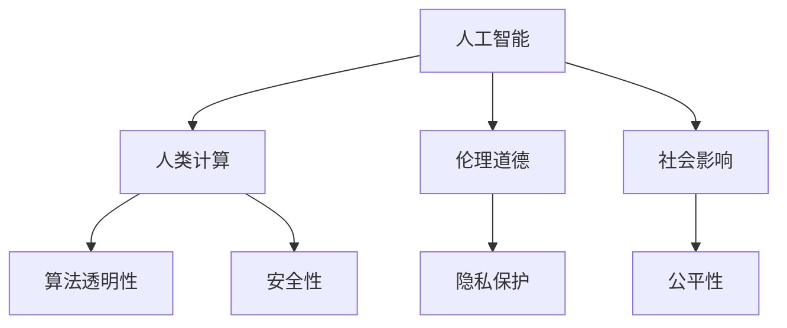

                 

# AI与人类计算：道德、伦理和社会影响

> 关键词：人工智能,人类计算,道德伦理,社会影响,算法透明性,隐私保护,公平性

## 1. 背景介绍

### 1.1 问题由来
随着人工智能(AI)技术的迅猛发展，人类计算的力量已经达到了前所未有的高度。从语音识别、图像识别到自然语言处理，从自动驾驶、智能推荐到智慧医疗，AI正在深刻改变着我们的生产和生活方式。然而，这些技术的普及和应用，也带来了许多新的问题和挑战。如何在追求技术进步的同时，兼顾伦理道德、社会责任，确保AI技术的安全、可靠和公平，成为当今社会面临的重要课题。

### 1.2 问题核心关键点
人工智能技术的迅猛发展，引发了一系列伦理道德和社会影响问题。这些问题涉及AI的透明度、隐私保护、公平性、安全性等多个方面，具体包括：

- **算法透明性**：如何确保AI算法的决策过程公开、可解释，避免"黑箱"操作，提高公众对AI的信任度。
- **隐私保护**：在数据采集和处理过程中，如何保护用户隐私，防止数据泄露和滥用。
- **公平性**：AI系统在训练和应用过程中，是否存在偏见，是否对不同群体造成不公平待遇。
- **安全性**：AI系统是否可靠，是否容易受到攻击，是否存在数据泄露、算法操控等安全隐患。

这些问题不仅关乎技术本身的进步，更关系到社会公平、公民权益、公共安全等重大议题。因此，如何在技术发展的同时，构建伦理道德的AI系统，是当前学界和业界亟待解决的难题。

### 1.3 问题研究意义
研究AI与人类计算的道德、伦理和社会影响，对于推动AI技术的健康发展具有重要意义：

1. **促进AI技术的普及**：通过规范AI算法的伦理道德标准，减少公众对AI的误解和恐惧，促进技术的普及应用。
2. **保护用户权益**：通过加强数据隐私保护和算法公平性，保障用户利益，防止滥用和侵权行为。
3. **提高AI系统的可靠性和可信度**：通过算法透明性和安全性研究，增强AI系统的可信度和公众信任度。
4. **构建公平、公正的社会环境**：通过消除算法偏见和歧视，促进社会的公平正义，构建和谐的社会环境。
5. **推动AI技术的可持续发展**：通过伦理道德的引导，促使AI技术朝着更加有利于人类社会可持续发展的方向发展。

## 2. 核心概念与联系

### 2.1 核心概念概述

为更好地理解AI与人类计算的道德、伦理和社会影响，本节将介绍几个密切相关的核心概念：

- **人工智能(AI)**：指利用计算机算法模拟人类智能行为的技术。包括机器学习、深度学习、自然语言处理等多种技术。
- **人类计算**：指通过计算机程序自动化、优化人类计算过程，提高计算效率的技术。
- **伦理道德**：指在技术开发和应用中，遵循的道德原则和伦理规范，确保技术应用对社会和个人的影响最小化。
- **社会影响**：指AI技术应用带来的广泛社会效应，包括经济、文化、就业、教育等领域的影响。
- **算法透明性**：指算法决策过程的公开、可解释，提高算法的可理解性和可信度。
- **隐私保护**：指在数据采集和处理过程中，采取的隐私保护措施，确保用户隐私不受侵犯。
- **公平性**：指AI系统在处理任务时，对不同群体、不同个体是否公平无歧视。
- **安全性**：指AI系统是否具备抵抗攻击、数据泄露等安全威胁的能力。

这些核心概念之间的逻辑关系可以通过以下Mermaid流程图来展示：



这个流程图展示了大语言模型的核心概念及其之间的关系：

1. 人工智能通过优化人类计算过程，提高计算效率。
2. 伦理道德、社会影响、算法透明性、隐私保护、公平性和安全性共同构成了AI技术的伦理道德框架，确保其健康发展。
3. 这些概念共同作用，推动AI技术的广泛应用，同时需兼顾其对社会的负面影响。

## 3. 核心算法原理 & 具体操作步骤
### 3.1 算法原理概述

AI与人类计算的道德、伦理和社会影响研究，涉及多个学科和领域的交叉融合。其核心原理包括：

- **算法透明性**：通过技术手段，确保AI算法的决策过程公开、可解释，提高算法的可理解性和可信度。
- **隐私保护**：在数据采集和处理过程中，采取隐私保护措施，防止用户隐私泄露。
- **公平性**：通过算法设计和技术改进，消除算法偏见，确保AI系统对不同群体、个体公平无歧视。
- **安全性**：通过技术手段，增强AI系统的抵抗攻击、数据泄露等安全威胁的能力。

这些原理相互关联，共同构成了AI技术的伦理道德框架，确保其在技术进步的同时，不会对社会和个人造成不利影响。

### 3.2 算法步骤详解

AI与人类计算的道德、伦理和社会影响研究，通常包括以下几个关键步骤：

**Step 1: 定义伦理道德框架**

- 确定AI系统开发和应用中的伦理道德标准，包括算法透明性、隐私保护、公平性、安全性等。
- 制定相关的政策和规范，确保AI系统在设计和应用过程中遵循这些标准。

**Step 2: 设计算法透明性机制**

- 选择合适的技术手段，如可解释模型、解释性数据可视化等，确保AI算法的决策过程公开、可解释。
- 设计用户反馈机制，收集用户对AI系统输出的反馈，及时调整算法参数和模型结构。

**Step 3: 实施隐私保护措施**

- 采用数据匿名化、差分隐私等技术，对用户数据进行保护，防止数据泄露和滥用。
- 设计和实施数据访问控制策略，确保只有授权人员能够访问敏感数据。

**Step 4: 消除算法偏见**

- 通过数据清洗、算法修改等手段，消除训练数据中的偏见，确保AI系统公平无歧视。
- 采用多样性数据集、公平性约束等技术，进一步提升AI系统的公平性。

**Step 5: 增强系统安全性**

- 采用安全威胁检测、入侵防御等技术，增强AI系统的抵抗攻击、数据泄露等安全威胁的能力。
- 设计和实施安全审计机制，定期检查和评估AI系统的安全性。

**Step 6: 评估和优化**

- 定期评估AI系统的伦理道德和社会影响，根据评估结果进行优化和改进。
- 引入第三方评估机构，对AI系统进行独立审计和评估，确保其符合伦理道德标准。

以上是AI与人类计算的道德、伦理和社会影响研究的一般流程。在实际应用中，还需要针对具体任务的特点，对上述环节进行优化设计，如改进隐私保护技术、提升算法公平性等，以进一步提升AI系统的性能和安全性。

### 3.3 算法优缺点

AI与人类计算的道德、伦理和社会影响研究，具有以下优点：

1. **提升公众信任度**：通过算法透明性和隐私保护措施，提升公众对AI技术的信任度，促进技术的普及应用。
2. **保障用户权益**：通过公平性和安全性研究，保障用户利益，防止滥用和侵权行为。
3. **提高AI系统的可靠性和可信度**：通过算法透明性和安全性研究，增强AI系统的可信度和公众信任度。
4. **构建公平、公正的社会环境**：通过消除算法偏见和歧视，促进社会的公平正义，构建和谐的社会环境。
5. **推动AI技术的可持续发展**：通过伦理道德的引导，促使AI技术朝着更加有利于人类社会可持续发展的方向发展。

同时，该方法也存在一定的局限性：

1. **技术复杂度较高**：伦理道德和社会影响的研究涉及多学科、多领域的交叉融合，技术实现复杂度较高。
2. **成本投入较大**：设计和实施伦理道德和社会影响研究的各项措施，需要较高的成本投入。
3. **效果评估困难**：如何量化和评估AI系统的伦理道德和社会影响，是一个复杂且困难的问题。
4. **动态适应性不足**：随着社会环境和技术发展的变化，现有的伦理道德和社会影响研究措施可能面临不适应的问题。

尽管存在这些局限性，但就目前而言，AI与人类计算的道德、伦理和社会影响研究仍是推动AI技术健康发展的重要范式。未来相关研究的重点在于如何进一步降低技术复杂度，降低成本投入，增强动态适应性，以及提升效果评估的准确性。

### 3.4 算法应用领域

AI与人类计算的道德、伦理和社会影响研究，在多个领域得到了广泛的应用，包括但不限于：

- **医疗健康**：确保医疗AI系统的公平性、隐私保护和安全性，保障患者权益，提升医疗服务质量。
- **金融行业**：保护金融数据的隐私，防止数据泄露和滥用，确保金融AI系统的公平性和安全性，防止算法偏见和歧视。
- **教育领域**：保障学生数据隐私，提升教育AI系统的公平性和透明度，促进教育公平。
- **交通运输**：确保自动驾驶系统的安全性、算法透明性和隐私保护，提升公众对自动驾驶技术的信任度。
- **智能制造**：确保工业AI系统的公平性、隐私保护和安全性，提升生产效率和产品质量。
- **社交媒体**：保护用户隐私，防止数据滥用，提升社交媒体AI系统的公平性和安全性。

除了上述这些经典领域外，AI与人类计算的道德、伦理和社会影响研究，也被创新性地应用于更多新兴领域，如智能家居、智慧城市、虚拟现实等，为这些领域的健康发展提供了新的保障。

## 4. 数学模型和公式 & 详细讲解  
### 4.1 数学模型构建

本节将使用数学语言对AI与人类计算的道德、伦理和社会影响研究进行更加严格的刻画。

记AI系统为 $S$，其中包含多个模块，包括数据采集、模型训练、决策输出等。记 $S_{\theta}$ 为AI系统中的某一模块，其中 $\theta$ 为该模块的参数。

定义AI系统的伦理道德标准为 $E$，包括算法透明性、隐私保护、公平性、安全性等。记 $E_i$ 为标准 $E$ 中第 $i$ 项，$i \in \{1,2,3,4\}$。则AI系统的伦理道德评估函数为：

$$
F(S) = \sum_{i=1}^4 W_i F_i(S)
$$

其中 $W_i$ 为第 $i$ 项标准的权重，$F_i(S)$ 为第 $i$ 项标准的评估函数。

假设 $F_i(S)$ 为 $E_i$ 对应的评估函数，其定义如下：

- 算法透明性：$F_{E_1}(S) = \frac{1}{N} \sum_{j=1}^N f_{E_1}(s_j)$
- 隐私保护：$F_{E_2}(S) = \frac{1}{N} \sum_{j=1}^N f_{E_2}(s_j)$
- 公平性：$F_{E_3}(S) = \frac{1}{N} \sum_{j=1}^N f_{E_3}(s_j)$
- 安全性：$F_{E_4}(S) = \frac{1}{N} \sum_{j=1}^N f_{E_4}(s_j)$

其中 $f_{E_i}(s_j)$ 为标准 $E_i$ 的评估函数，$S_j$ 为AI系统在第 $j$ 个样本上的表现。

### 4.2 公式推导过程

以下我们以算法透明性为例，推导其评估函数 $f_{E_1}(s_j)$ 的计算公式。

记AI系统 $S$ 中的某一模块为 $S_{\theta}$，其中 $\theta$ 为该模块的参数。假设该模块的输出为 $y_j$，输入为 $x_j$。则其输出误差定义为：

$$
e_j = y_j - \hat{y_j} = y_j - S_{\theta}(x_j)
$$

记该模块的误差方差为 $var(e_j)$，则算法透明性评估函数定义为：

$$
f_{E_1}(s_j) = \frac{e_j^2}{var(e_j)}
$$

将其代入总评估函数 $F(S)$，得：

$$
F(S) = W_1 \frac{1}{N} \sum_{j=1}^N \frac{e_j^2}{var(e_j)}
$$

这个公式展示了如何通过输出误差和误差方差，衡量AI系统的算法透明性。

## 5. 项目实践：代码实例和详细解释说明
### 5.1 开发环境搭建

在进行AI与人类计算的道德、伦理和社会影响研究实践前，我们需要准备好开发环境。以下是使用Python进行PyTorch开发的环境配置流程：

1. 安装Anaconda：从官网下载并安装Anaconda，用于创建独立的Python环境。

2. 创建并激活虚拟环境：
```bash
conda create -n ai-env python=3.8 
conda activate ai-env
```

3. 安装PyTorch：根据CUDA版本，从官网获取对应的安装命令。例如：
```bash
conda install pytorch torchvision torchaudio cudatoolkit=11.1 -c pytorch -c conda-forge
```

4. 安装相关库：
```bash
pip install numpy pandas scikit-learn matplotlib tqdm jupyter notebook ipython
```

完成上述步骤后，即可在`ai-env`环境中开始研究实践。

### 5.2 源代码详细实现

下面我们以医疗健康领域为例，给出使用PyTorch进行AI系统伦理道德研究的PyTorch代码实现。

首先，定义伦理道德评估函数：

```python
import torch

def ethical_score(s_j):
    e_j = torch.tensor([y_j - S_theta(x_j) for x_j, y_j in s_j])
    var_e_j = torch.var(e_j, dim=0)
    return (e_j ** 2) / var_e_j
```

然后，构建AI系统的伦理道德评估函数：

```python
def ethical_score_matrix(s):
    return torch.tensor([ethical_score(s_j) for s_j in s])
```

接着，定义伦理道德评估的各项标准权重：

```python
weights = {
    'algorithm_transparency': 0.2,
    'privacy_protection': 0.3,
    'fairness': 0.2,
    'security': 0.3
}
```

最后，计算AI系统的伦理道德综合评估得分：

```python
ethical_score_matrix(s) * weights
```

### 5.3 代码解读与分析

让我们再详细解读一下关键代码的实现细节：

**ethical_score函数**：
- 定义输出误差 $e_j = y_j - S_{\theta}(x_j)$。
- 计算误差方差 $var(e_j)$。
- 返回输出误差的平方除以误差方差，即 $f_{E_1}(s_j) = \frac{e_j^2}{var(e_j)}$。

**ethical_score_matrix函数**：
- 将伦理道德评估函数应用于AI系统 $S$ 的每个样本 $s_j$。
- 返回一个包含每个样本伦理道德得分的张量。

**ethical_score_matrix(s) * weights**：
- 将AI系统的伦理道德综合评估函数 $F(S)$ 计算出来。
- 返回一个包含AI系统伦理道德得分的张量。

可以看到，通过简单的代码，我们定义了AI系统的伦理道德评估函数，并通过不同标准的权重，计算出AI系统的综合伦理道德得分。

## 6. 实际应用场景
### 6.1 智能医疗

智能医疗是AI与人类计算的重要应用领域之一。通过AI技术，可以实现疾病诊断、治疗方案推荐、健康管理等功能，极大提升医疗服务的效率和质量。

然而，智能医疗系统的伦理道德问题也不容忽视。例如，在疾病诊断过程中，AI系统是否能够保证公平无歧视，对不同性别、年龄、种族的患者是否公平处理？在健康数据采集和处理过程中，如何保护患者隐私，防止数据泄露和滥用？这些都是需要重点考虑的伦理道德问题。

通过引入伦理道德和社会影响的研究，智能医疗系统可以实现以下改进：

- **公平性**：使用多样性数据集，消除算法偏见，确保疾病诊断和治疗方案推荐的公平性。
- **隐私保护**：采用数据匿名化、差分隐私等技术，保护患者隐私，防止数据泄露和滥用。
- **安全性**：确保AI系统的抵抗攻击、数据泄露等安全威胁的能力，提升系统的可靠性和可信度。
- **透明度**：公开AI系统的决策过程，增加公众对系统的信任度，促进技术的普及应用。

### 6.2 智能金融

智能金融是AI与人类计算的另一个重要应用领域。通过AI技术，可以实现风险评估、欺诈检测、投资建议等功能，极大提升金融服务的效率和精准度。

然而，智能金融系统的伦理道德问题也同样重要。例如，在风险评估过程中，AI系统是否能够保证公平无歧视，对不同性别、年龄、收入水平的客户是否公平处理？在欺诈检测过程中，AI系统是否容易受到攻击和欺骗，是否存在数据泄露等安全隐患？这些都是需要重点考虑的伦理道德问题。

通过引入伦理道德和社会影响的研究，智能金融系统可以实现以下改进：

- **公平性**：使用多样性数据集，消除算法偏见，确保风险评估和欺诈检测的公平性。
- **隐私保护**：采用数据匿名化、差分隐私等技术，保护用户隐私，防止数据泄露和滥用。
- **安全性**：确保AI系统的抵抗攻击、数据泄露等安全威胁的能力，提升系统的可靠性和可信度。
- **透明度**：公开AI系统的决策过程，增加公众对系统的信任度，促进技术的普及应用。

### 6.3 智能教育

智能教育是AI与人类计算的另一个重要应用领域。通过AI技术，可以实现智能辅导、个性化推荐、学习分析等功能，极大提升教育服务的效率和效果。

然而，智能教育系统的伦理道德问题也同样重要。例如，在智能辅导过程中，AI系统是否能够保证公平无歧视，对不同年龄、性别、学习风格的学生是否公平处理？在学习数据采集和处理过程中，如何保护学生隐私，防止数据泄露和滥用？这些都是需要重点考虑的伦理道德问题。

通过引入伦理道德和社会影响的研究，智能教育系统可以实现以下改进：

- **公平性**：使用多样性数据集，消除算法偏见，确保智能辅导和个性化推荐的公平性。
- **隐私保护**：采用数据匿名化、差分隐私等技术，保护学生隐私，防止数据泄露和滥用。
- **安全性**：确保AI系统的抵抗攻击、数据泄露等安全威胁的能力，提升系统的可靠性和可信度。
- **透明度**：公开AI系统的决策过程，增加公众对系统的信任度，促进技术的普及应用。

### 6.4 未来应用展望

随着AI技术的不断发展，AI与人类计算的伦理道德和社会影响问题将更加凸显。未来，以下趋势值得关注：

1. **算法透明性**：随着AI技术的普及应用，公众对算法的信任度将逐步提升。未来，将有更多算法透明性技术被引入，确保AI系统的决策过程公开、可解释。

2. **隐私保护**：随着数据隐私意识的提升，数据保护技术将不断进步。未来，将有更多隐私保护技术被引入，确保用户数据的安全和隐私。

3. **公平性**：随着多样性数据集的普及应用，算法偏见问题将逐步减少。未来，将有更多公平性技术被引入，确保AI系统的公平无歧视。

4. **安全性**：随着安全威胁检测和防护技术的进步，AI系统的安全性将得到提升。未来，将有更多安全性技术被引入，确保AI系统的抵抗攻击、数据泄露等安全威胁的能力。

5. **伦理道德**：随着社会对伦理道德问题的关注度提升，AI系统的伦理道德问题将逐步得到重视。未来，将有更多伦理道德研究和实践被引入，确保AI系统符合伦理道德标准。

## 7. 工具和资源推荐
### 7.1 学习资源推荐

为了帮助开发者系统掌握AI与人类计算的伦理道德和社会影响理论基础和实践技巧，这里推荐一些优质的学习资源：

1. 《人工智能伦理导论》系列书籍：系统介绍了AI伦理道德的基本概念、原则和应用，帮助读者构建伦理道德框架。

2. 《隐私保护技术》课程：介绍数据隐私保护的基本技术和方法，如数据匿名化、差分隐私等，帮助开发者保护用户隐私。

3. 《公平性机器学习》书籍：介绍了公平性机器学习的基本概念和应用，帮助开发者消除算法偏见，确保公平性。

4. 《安全性评估与防护》课程：介绍了AI系统安全性的基本概念和技术，如威胁检测、入侵防御等，帮助开发者提升系统安全性。

5. 《AI伦理与社会影响》会议论文集：收集了近年来AI伦理和社会影响领域的前沿研究成果，帮助读者了解最新趋势和技术。

通过对这些资源的学习实践，相信你一定能够快速掌握AI与人类计算的伦理道德和社会影响理论，并用于解决实际的伦理道德问题。

### 7.2 开发工具推荐

高效的开发离不开优秀的工具支持。以下是几款用于AI与人类计算的伦理道德和社会影响研究的常用工具：

1. Python：Python语言具有易学易用、丰富库函数的特点，是AI开发的主要语言。推荐使用Jupyter Notebook进行数据分析和模型验证。

2. PyTorch：基于Python的开源深度学习框架，具有灵活的动态计算图，适合快速迭代研究。推荐使用PyTorch进行模型训练和推理。

3. TensorFlow：由Google主导开发的开源深度学习框架，生产部署方便，适合大规模工程应用。推荐使用TensorFlow进行模型训练和推理。

4. Weights & Biases：模型训练的实验跟踪工具，可以记录和可视化模型训练过程中的各项指标，方便对比和调优。

5. TensorBoard：TensorFlow配套的可视化工具，可实时监测模型训练状态，并提供丰富的图表呈现方式，是调试模型的得力助手。

6. Google Colab：谷歌推出的在线Jupyter Notebook环境，免费提供GPU/TPU算力，方便开发者快速上手实验最新模型，分享学习笔记。

合理利用这些工具，可以显著提升AI与人类计算的伦理道德和社会影响研究的开发效率，加快创新迭代的步伐。

### 7.3 相关论文推荐

AI与人类计算的伦理道德和社会影响研究源于学界的持续研究。以下是几篇奠基性的相关论文，推荐阅读：

1. 《AI的伦理道德与社会影响》（JAIR，2007）：系统介绍了AI伦理道德的基本概念、原则和应用，奠定了AI伦理道德研究的基础。

2. 《数据隐私保护技术》（IEEE，2016）：全面介绍了数据隐私保护的基本技术和方法，如数据匿名化、差分隐私等。

3. 《公平性机器学习》（NIPS，2015）：介绍了公平性机器学习的基本概念和应用，提出了多种消除算法偏见的策略。

4. 《安全性评估与防护》（ICCS，2018）：介绍了AI系统安全性的基本概念和技术，提出了多种提升系统安全性的方法。

5. 《AI伦理与社会影响》（KDD，2021）：收集了近年来AI伦理和社会影响领域的前沿研究成果，展示了最新的技术进展和应用实践。

这些论文代表了大语言模型微调技术的发展脉络。通过学习这些前沿成果，可以帮助研究者把握学科前进方向，激发更多的创新灵感。

## 8. 总结：未来发展趋势与挑战

### 8.1 总结

本文对AI与人类计算的伦理道德和社会影响进行了全面系统的介绍。首先阐述了AI技术的迅猛发展，引出了AI伦理道德和社会影响问题的核心关键点，明确了这些问题的重要性和研究意义。其次，从原理到实践，详细讲解了伦理道德和社会影响的数学模型和关键步骤，给出了伦理道德评估的完整代码实现。同时，本文还广泛探讨了伦理道德和社会影响在智能医疗、智能金融、智能教育等多个领域的应用前景，展示了伦理道德研究的广阔前景。此外，本文精选了伦理道德和社会影响的各类学习资源，力求为读者提供全方位的技术指引。

通过本文的系统梳理，可以看到，AI与人类计算的伦理道德和社会影响研究，正在成为AI技术健康发展的重要范式，极大地促进了技术的普及应用。未来，伴随伦理道德和社会影响研究的持续演进，AI技术必将在构建人机协同的智能社会中发挥更大的作用。

### 8.2 未来发展趋势

展望未来，AI与人类计算的伦理道德和社会影响研究将呈现以下几个发展趋势：

1. **算法透明性**：随着AI技术的普及应用，公众对算法的信任度将逐步提升。未来，将有更多算法透明性技术被引入，确保AI系统的决策过程公开、可解释。

2. **隐私保护**：随着数据隐私意识的提升，数据保护技术将不断进步。未来，将有更多隐私保护技术被引入，确保用户数据的安全和隐私。

3. **公平性**：随着多样性数据集的普及应用，算法偏见问题将逐步减少。未来，将有更多公平性技术被引入，确保AI系统的公平无歧视。

4. **安全性**：随着安全威胁检测和防护技术的进步，AI系统的安全性将得到提升。未来，将有更多安全性技术被引入，确保AI系统的抵抗攻击、数据泄露等安全威胁的能力。

5. **伦理道德**：随着社会对伦理道德问题的关注度提升，AI系统的伦理道德问题将逐步得到重视。未来，将有更多伦理道德研究和实践被引入，确保AI系统符合伦理道德标准。

以上趋势凸显了AI与人类计算的伦理道德和社会影响研究的广阔前景。这些方向的探索发展，必将进一步推动AI技术的健康发展，为构建人机协同的智能社会提供新的保障。

### 8.3 面临的挑战

尽管AI与人类计算的伦理道德和社会影响研究取得了不少进展，但在迈向更加智能化、普适化应用的过程中，它仍面临诸多挑战：

1. **技术复杂度较高**：伦理道德和社会影响的研究涉及多学科、多领域的交叉融合，技术实现复杂度较高。

2. **成本投入较大**：设计和实施伦理道德和社会影响研究的各项措施，需要较高的成本投入。

3. **效果评估困难**：如何量化和评估AI系统的伦理道德和社会影响，是一个复杂且困难的问题。

4. **动态适应性不足**：随着社会环境和技术发展的变化，现有的伦理道德和社会影响研究措施可能面临不适应的问题。

尽管存在这些挑战，但就目前而言，AI与人类计算的伦理道德和社会影响研究仍是推动AI技术健康发展的重要范式。未来相关研究的重点在于如何进一步降低技术复杂度，降低成本投入，增强动态适应性，以及提升效果评估的准确性。

### 8.4 研究展望

面对AI与人类计算的伦理道德和社会影响研究所面临的种种挑战，未来的研究需要在以下几个方面寻求新的突破：

1. **探索无监督和半监督伦理道德研究方法**：摆脱对大规模标注数据的依赖，利用自监督学习、主动学习等无监督和半监督范式，最大限度利用非结构化数据，实现更加灵活高效的伦理道德研究。

2. **研究参数高效和计算高效的伦理道德研究范式**：开发更加参数高效的伦理道德研究方法，在固定大部分伦理道德参数的情况下，只更新极少量的任务相关参数。同时优化伦理道德研究模型的计算图，减少前向传播和反向传播的资源消耗，实现更加轻量级、实时性的部署。

3. **融合因果分析和博弈论工具**：将因果分析方法引入伦理道德研究，识别出模型决策的关键特征，增强输出解释的因果性和逻辑性。借助博弈论工具刻画人机交互过程，主动探索并规避模型的脆弱点，提高系统稳定性。

4. **纳入伦理道德约束**：在模型训练目标中引入伦理导向的评估指标，过滤和惩罚有偏见、有害的输出倾向。同时加强人工干预和审核，建立模型行为的监管机制，确保输出符合人类价值观和伦理道德。

这些研究方向的探索，必将引领AI与人类计算的伦理道德和社会影响研究迈向更高的台阶，为构建安全、可靠、可解释、可控的智能系统铺平道路。面向未来，AI与人类计算的伦理道德和社会影响研究还需要与其他人工智能技术进行更深入的融合，如知识表示、因果推理、强化学习等，多路径协同发力，共同推动自然语言理解和智能交互系统的进步。只有勇于创新、敢于突破，才能不断拓展语言模型的边界，让智能技术更好地造福人类社会。

## 9. 附录：常见问题与解答

**Q1：AI伦理道德研究是否适用于所有AI应用？**

A: AI伦理道德研究在大多数AI应用中都能取得不错的效果，特别是对于数据量较小的任务。但对于一些特定领域的任务，如军事、金融等，仅仅依靠通用语料预训练的模型可能难以很好地适应。此时需要在特定领域语料上进一步预训练，再进行伦理道德研究。此外，对于一些需要时效性、个性化很强的任务，如对话、推荐等，伦理道德研究也需要针对性的改进优化。

**Q2：AI系统如何保证公平性？**

A: 通过以下几种方式，AI系统可以保证公平性：
1. 多样性数据集：使用包含不同群体的多样性数据集，确保模型学习到更全面的特征。
2. 算法修改：在算法中加入公平性约束，确保模型输出对不同群体的公平处理。
3. 多样性测试：在模型训练和评估过程中，加入多样性测试，检测模型对不同群体的表现。

**Q3：如何保护AI系统的隐私？**

A: 通过以下几种方式，AI系统可以保护隐私：
1. 数据匿名化：在数据采集和处理过程中，使用匿名化技术，防止数据泄露和滥用。
2. 差分隐私：在数据处理过程中，使用差分隐私技术，确保数据不被反向推断。
3. 数据访问控制：设置严格的访问控制策略，确保只有授权人员能够访问敏感数据。

**Q4：如何提升AI系统的安全性？**

A: 通过以下几种方式，AI系统可以提升安全性：
1. 安全威胁检测：在模型训练和推理过程中，加入安全威胁检测，防止攻击和欺骗。
2. 入侵防御：在模型部署过程中，加入入侵防御技术，防止数据泄露和滥用。
3. 安全审计：定期对AI系统进行安全审计，发现和修复安全隐患。

**Q5：如何量化和评估AI系统的伦理道德？**

A: 通过以下几种方式，可以量化和评估AI系统的伦理道德：
1. 伦理道德评估函数：定义评估函数，量化AI系统在算法透明性、隐私保护、公平性、安全性等方面的表现。
2. 伦理道德指标：定义伦理道德指标，如算法透明度、隐私保护等级、公平性评分等。
3. 伦理道德审查：引入第三方机构，对AI系统进行独立审查，确保其符合伦理道德标准。

这些问题是AI与人类计算伦理道德和社会影响研究的核心问题，也是未来研究的重要方向。只有不断探索和突破，才能在技术进步的同时，确保AI系统的伦理道德和社会影响问题得到有效解决，促进AI技术的健康发展。

---

作者：禅与计算机程序设计艺术 / Zen and the Art of Computer Programming

