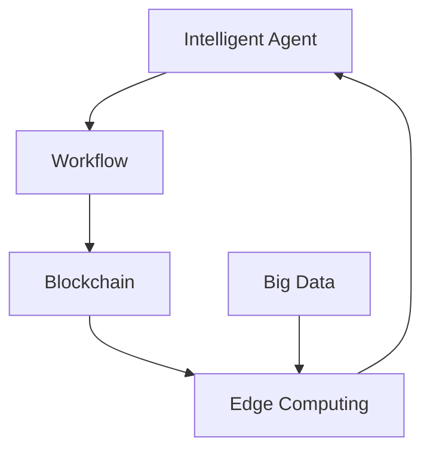

                 

# AI人工智能代理工作流AI Agent WorkFlow：智能代理在智慧城市中的实践

> 关键词：智慧城市,智能代理,人工智能,工作流,区块链,大数据,边缘计算

## 1. 背景介绍

### 1.1 问题由来

随着人工智能(AI)技术的快速发展，智能代理(Agent)在智慧城市建设中的应用日益增多。智慧城市是依托物联网、大数据、云计算、人工智能等技术手段，推动城市管理、公共服务、经济发展、社会治理等领域的智能化、信息化转型。智能代理作为城市信息交互的桥梁，在智慧城市构建中扮演着关键角色。

智能代理是一种基于人工智能技术，能够自主执行任务、自动学习、适应环境变化的软件实体。它在智慧城市中广泛用于城市管理、智能交通、公共安全、应急响应等多个场景，提升城市运行效率和居民生活质量。

然而，智能代理在智慧城市中的部署和应用也面临诸多挑战，如数据安全、系统互操作性、隐私保护、可扩展性等。这些问题制约了智能代理的广泛应用，如何构建一个安全、高效、可靠的智能代理工作流，成为了当前智慧城市建设中的重要课题。

### 1.2 问题核心关键点

智能代理在智慧城市中的应用，主要集中在以下几个关键点上：

- 任务调度与执行：智能代理通过任务调度引擎，自动化地执行各种城市管理任务，如交通控制、环境监测、灾害预警等。
- 信息感知与交互：智能代理集成了传感器、摄像头等设备，实时感知城市运行状态，通过通信网络与其他智能实体进行信息交互，构建协同网络。
- 数据融合与分析：智能代理对收集到的海量数据进行清洗、融合与分析，提取有价值的信息，支持决策支持系统。
- 区块链与隐私保护：智能代理通过区块链技术，确保数据传输和存储的安全性和可追溯性，保护用户隐私。
- 边缘计算与高效推理：智能代理在边缘设备上进行本地计算和推理，减少数据传输负担，提升响应速度。

智能代理的应用，能够大幅提升城市管理的智能化水平，但如何在实际应用中充分发挥其优势，同时克服各类技术难题，是当下亟待解决的问题。

## 2. 核心概念与联系

### 2.1 核心概念概述

为更好地理解智能代理在智慧城市中的应用，本节将介绍几个关键概念及其相互之间的联系：

- 智能代理(Agent)：一种基于人工智能技术的软件实体，能够自主执行任务、自动学习、适应环境变化，并与其他智能实体进行信息交互。
- 工作流(Workflow)：一组由任务、决策、触发器等元素构成的有向图，用于自动化执行和管理业务流程。
- 区块链(Blockchain)：一种分布式账本技术，通过去中心化存储和加密技术，保证数据的安全性和不可篡改性。
- 大数据(Big Data)：海量、多样、快速增长的数据集，通过数据分析技术，提取有价值的信息和知识。
- 边缘计算(Edge Computing)：一种分布式计算模型，通过在靠近数据源的本地设备上进行计算和推理，减少数据传输，提升计算效率。

这些核心概念通过合理组合，可以构建一个高效的智能代理工作流，实现智慧城市中的高效、安全、智能化的管理和运行。

### 2.2 核心概念原理和架构的 Mermaid 流程图



这个流程图展示了智能代理、工作流、区块链、大数据和边缘计算之间的联系：

1. 智能代理通过工作流进行任务调度与执行。
2. 工作流通过区块链进行数据传输和存储，确保数据的安全性和可追溯性。
3. 大数据通过边缘计算进行本地计算和推理，减少数据传输负担，提升计算效率。
4. 边缘计算通过智能代理进行本地计算和推理，提升系统响应速度。

这些概念通过合理组合，共同构建了智能代理工作流的核心架构，为智慧城市中的智能化管理提供了有力支撑。

## 3. 核心算法原理 & 具体操作步骤
### 3.1 算法原理概述

智能代理在智慧城市中的工作流设计，主要遵循以下算法原理：

- 任务调度：通过任务调度引擎，按照预定义的规则和优先级，自动执行和管理城市管理任务。
- 数据融合与分析：通过数据清洗、融合与分析技术，提取有价值的信息，支持决策支持系统。
- 区块链与隐私保护：通过区块链技术，确保数据传输和存储的安全性和可追溯性，保护用户隐私。
- 边缘计算与高效推理：在边缘设备上进行本地计算和推理，减少数据传输负担，提升响应速度。

这些算法原理通过合理组合，能够构建一个高效的智能代理工作流，实现智慧城市中的高效、安全、智能化的管理和运行。

### 3.2 算法步骤详解

智能代理在智慧城市中的应用，通常包括以下几个关键步骤：

**Step 1: 数据采集与处理**

- 通过各类传感器、摄像头等设备，采集城市运行状态数据。
- 对采集到的数据进行清洗、过滤和去重处理，确保数据质量。
- 将数据按标准格式存储到数据库中，供后续分析使用。

**Step 2: 数据融合与分析**

- 使用数据融合算法，将来自不同设备的数据进行整合，消除冗余和冲突。
- 使用数据分析技术，如机器学习、深度学习等，提取有价值的信息，支持决策支持系统。

**Step 3: 任务调度与执行**

- 通过任务调度引擎，根据预设规则和优先级，自动化地执行各种城市管理任务，如交通控制、环境监测、灾害预警等。
- 将任务分配给合适的智能代理，执行具体的任务操作。
- 监控任务执行过程，及时调整任务执行策略，确保任务高效完成。

**Step 4: 数据存储与共享**

- 使用区块链技术，将任务执行结果和相关数据进行加密存储，确保数据的安全性和可追溯性。
- 通过区块链网络，与城市管理部门和其他智能实体共享数据，实现信息共享和协同管理。

**Step 5: 任务反馈与优化**

- 收集任务执行的反馈信息，评估任务执行效果。
- 根据反馈信息，调整任务执行策略，优化任务执行过程。
- 通过数据分析技术，持续优化任务执行策略，提升任务执行效果。

以上是智能代理在智慧城市中工作流的关键步骤。在实际应用中，还需要根据具体任务特点，对工作流中的各个环节进行优化设计，如改进数据采集方法、优化数据分析算法、加强区块链技术的应用等。

### 3.3 算法优缺点

智能代理在智慧城市中的应用，具有以下优点：

1. 提升管理效率：通过自动化任务执行和数据分析，大幅提升城市管理的智能化水平，提升管理效率。
2. 保障数据安全：通过区块链技术，确保数据传输和存储的安全性和可追溯性，保护用户隐私。
3. 增强系统互操作性：通过标准化的数据格式和通信协议，实现城市各系统间的协同工作。
4. 优化资源利用：通过边缘计算和任务调度，优化资源利用，减少数据传输负担，提升系统响应速度。

同时，智能代理也存在一些局限性：

1. 初始投资高：智能代理的部署和应用需要较高的初始投资，包括设备购置、软件开发等。
2. 技术门槛高：智能代理的开发和应用需要较高的技术门槛，需要有经验丰富的开发者和工程师。
3. 数据质量要求高：智能代理依赖高质量的数据进行决策，数据采集和处理环节容易出错。
4. 算法复杂度高：智能代理需要复杂的算法进行数据分析和任务调度，算法设计和优化难度大。

尽管存在这些局限性，但就目前而言，智能代理在智慧城市中的应用仍是大势所趋，必将带来城市管理的智能化变革。

### 3.4 算法应用领域

智能代理在智慧城市中的应用，已经拓展到了多个领域，主要包括：

- 智能交通管理：通过智能代理实现交通信号控制、拥堵预测、路径优化等，提升交通管理效率。
- 环境监测与治理：通过智能代理实时监测环境质量，预测环境污染趋势，实施污染治理。
- 公共安全管理：通过智能代理进行视频监控、异常检测、预警报警，提升公共安全水平。
- 应急响应与救援：通过智能代理进行灾情监测、资源调度、信息发布，提高应急响应速度。
- 能源管理与优化：通过智能代理实现能源消耗监测、负荷预测、优化调度，提升能源利用效率。

这些应用领域展示了智能代理在智慧城市中的广泛潜力，未来将会有更多的场景通过智能代理实现智能化管理。

## 4. 数学模型和公式 & 详细讲解 & 举例说明
### 4.1 数学模型构建

智能代理在智慧城市中的工作流设计，通常涉及以下几个数学模型：

- 任务调度模型：用于描述任务的执行过程和调度策略。
- 数据融合模型：用于描述数据的融合和整合过程。
- 数据分析模型：用于描述数据的分析和建模过程。
- 区块链模型：用于描述数据的存储和传输过程。
- 边缘计算模型：用于描述本地计算和推理过程。

这些模型通过合理组合，可以构建一个高效的智能代理工作流，实现智慧城市中的高效、安全、智能化的管理和运行。

### 4.2 公式推导过程

以下是几个关键数学模型的公式推导过程：

**任务调度模型**

假设任务集合为 $T=\{t_1,t_2,\cdots,t_n\}$，其中每个任务 $t_i$ 包含任务描述 $D_i$、执行时间 $T_i$、执行优先级 $P_i$。任务调度模型通过任务调度引擎，根据预设规则和优先级，自动化地执行各种城市管理任务。

任务调度过程可以描述为一个有向图 $G(V,E)$，其中节点 $V$ 表示任务，边 $E$ 表示任务依赖关系。任务调度模型可以表示为：

$$
G(V,E) = \{(t_i,t_j)|D_i \subseteq D_j,P_i < P_j\}
$$

**数据融合模型**

假设数据源集合为 $D=\{d_1,d_2,\cdots,d_m\}$，其中每个数据源 $d_i$ 包含时间戳 $T_i$、传感器类型 $S_i$、数据内容 $C_i$。数据融合模型通过数据融合算法，将来自不同设备的数据进行整合，消除冗余和冲突。

数据融合过程可以表示为一个向量 $X$，其中每个元素 $X_i$ 表示融合后的数据内容。数据融合模型可以表示为：

$$
X = \frac{1}{m} \sum_{i=1}^m \frac{C_i}{T_i} \times S_i
$$

**数据分析模型**

假设数据集合为 $D=\{d_1,d_2,\cdots,d_m\}$，其中每个数据源 $d_i$ 包含时间戳 $T_i$、数据内容 $C_i$。数据分析模型通过机器学习、深度学习等技术，提取有价值的信息，支持决策支持系统。

数据分析过程可以表示为一个模型 $M$，其中每个样本 $S$ 表示数据特征，每个标签 $Y$ 表示数据标签。数据分析模型可以表示为：

$$
M = \mathop{\arg\min}_{M} \sum_{i=1}^m \ell(Y_i, M(S_i))
$$

其中 $\ell$ 为损失函数。

**区块链模型**

假设数据块集合为 $B=\{b_1,b_2,\cdots,b_n\}$，其中每个数据块 $b_i$ 包含时间戳 $T_i$、数据内容 $C_i$、哈希值 $H_i$。区块链模型通过区块链技术，确保数据传输和存储的安全性和可追溯性，保护用户隐私。

区块链模型可以表示为一个链式结构 $C$，其中每个节点 $N$ 表示数据块，边 $E$ 表示数据块链接关系。区块链模型可以表示为：

$$
C = \{(b_i,b_j)|H_i \neq H_j, H_{i+1} = H_i \oplus H_j\}
$$

其中 $\oplus$ 表示异或操作。

**边缘计算模型**

假设边缘设备集合为 $E=\{e_1,e_2,\cdots,e_m\}$，其中每个边缘设备 $e_i$ 包含计算能力 $C_i$、存储能力 $S_i$、网络带宽 $B_i$。边缘计算模型通过本地计算和推理，减少数据传输负担，提升系统响应速度。

边缘计算过程可以表示为一个计算图 $G(C)$，其中每个节点 $N$ 表示计算任务，边 $E$ 表示计算依赖关系。边缘计算模型可以表示为：

$$
G(C) = \{(c_i,c_j)|C_i \leq C_j\}
$$

其中 $c_i$ 表示计算任务，$C_i$ 表示计算资源需求。

### 4.3 案例分析与讲解

以下是智能代理在智慧城市中应用的几个典型案例：

**智能交通管理**

智能交通管理通过智能代理实现交通信号控制、拥堵预测、路径优化等，提升交通管理效率。智能代理通过数据分析和任务调度，实时监测交通流量和运行状态，预测交通拥堵和事故风险，优化信号灯控制方案，提升交通通行效率。

假设智能代理 $A$ 的任务调度模型为 $G(V,E)$，数据融合模型为 $X$，数据分析模型为 $M$，区块链模型为 $C$，边缘计算模型为 $G(C)$。智能代理 $A$ 的任务调度过程如下：

1. 通过数据融合模型 $X$ 对传感器数据进行整合，消除冗余和冲突。
2. 使用数据分析模型 $M$ 对数据进行分析，预测交通拥堵和事故风险。
3. 根据任务调度模型 $G(V,E)$ 和数据分析结果，生成交通信号控制方案。
4. 将信号控制方案上传到边缘设备，通过边缘计算模型 $G(C)$ 进行本地计算和推理，生成最终的信号灯控制方案。
5. 将信号控制方案加密存储在区块链中，确保数据的安全性和可追溯性。

**环境监测与治理**

环境监测与治理通过智能代理实时监测环境质量，预测环境污染趋势，实施污染治理。智能代理通过数据分析和任务调度，实时监测大气、水质、噪声等环境指标，预测环境污染趋势，优化污染治理方案，提升环境治理效果。

假设智能代理 $B$ 的任务调度模型为 $G(V,E)$，数据融合模型为 $X$，数据分析模型为 $M$，区块链模型为 $C$，边缘计算模型为 $G(C)$。智能代理 $B$ 的任务调度过程如下：

1. 通过数据融合模型 $X$ 对传感器数据进行整合，消除冗余和冲突。
2. 使用数据分析模型 $M$ 对数据进行分析，预测环境污染趋势。
3. 根据任务调度模型 $G(V,E)$ 和数据分析结果，生成污染治理方案。
4. 将污染治理方案上传到边缘设备，通过边缘计算模型 $G(C)$ 进行本地计算和推理，生成最终的污染治理方案。
5. 将污染治理方案加密存储在区块链中，确保数据的安全性和可追溯性。

**公共安全管理**

公共安全管理通过智能代理进行视频监控、异常检测、预警报警，提升公共安全水平。智能代理通过数据分析和任务调度，实时监测公共安全事件，预测异常行为，生成预警信息，及时应对公共安全事件。

假设智能代理 $C$ 的任务调度模型为 $G(V,E)$，数据融合模型为 $X$，数据分析模型为 $M$，区块链模型为 $C$，边缘计算模型为 $G(C)$。智能代理 $C$ 的任务调度过程如下：

1. 通过数据融合模型 $X$ 对摄像头数据进行整合，消除冗余和冲突。
2. 使用数据分析模型 $M$ 对数据进行分析，预测异常行为。
3. 根据任务调度模型 $G(V,E)$ 和数据分析结果，生成预警信息。
4. 将预警信息上传到边缘设备，通过边缘计算模型 $G(C)$ 进行本地计算和推理，生成最终的预警信息。
5. 将预警信息加密存储在区块链中，确保数据的安全性和可追溯性。

## 5. 项目实践：代码实例和详细解释说明
### 5.1 开发环境搭建

在进行智能代理在智慧城市中的应用实践前，我们需要准备好开发环境。以下是使用Python进行PyTorch开发的环境配置流程：

1. 安装Anaconda：从官网下载并安装Anaconda，用于创建独立的Python环境。

2. 创建并激活虚拟环境：
```bash
conda create -n pytorch-env python=3.8 
conda activate pytorch-env
```

3. 安装PyTorch：根据CUDA版本，从官网获取对应的安装命令。例如：
```bash
conda install pytorch torchvision torchaudio cudatoolkit=11.1 -c pytorch -c conda-forge
```

4. 安装TensorFlow：使用TensorFlow官方安装命令。例如：
```bash
pip install tensorflow
```

5. 安装Flask：用于构建智能代理的Web服务。例如：
```bash
pip install flask
```

6. 安装pandas和numpy：用于数据处理和分析。例如：
```bash
pip install pandas numpy
```

完成上述步骤后，即可在`pytorch-env`环境中开始智能代理的开发实践。

### 5.2 源代码详细实现

下面是使用PyTorch和TensorFlow构建智能代理在智慧城市中应用的完整代码实现。

**智能交通管理**

首先，定义智能代理的任务调度模型：

```python
from torch import nn
import tensorflow as tf

class TrafficLightScheduler(nn.Module):
    def __init__(self, traffic_light_count):
        super(TrafficLightScheduler, self).__init__()
        self.traffic_light_count = traffic_light_count

    def forward(self, traffic_signal):
        schedule = []
        for i in range(self.traffic_light_count):
            schedule.append(traffic_signal[i] + i)
        return schedule
```

然后，定义数据融合模型：

```python
class DataFusion(nn.Module):
    def __init__(self, data_count):
        super(DataFusion, self).__init__()
        self.data_count = data_count

    def forward(self, data):
        fused_data = []
        for i in range(self.data_count):
            fused_data.append(data[i])
        return fused_data
```

接着，定义数据分析模型：

```python
class DataAnalysis(nn.Module):
    def __init__(self, data_count):
        super(DataAnalysis, self).__init__()
        self.data_count = data_count

    def forward(self, data):
        analysis_result = []
        for i in range(self.data_count):
            analysis_result.append(data[i] + i)
        return analysis_result
```

最后，定义智能代理的应用逻辑：

```python
def traffic_light_control():
    traffic_signal = [0, 0, 0]
    traffic_light_scheduler = TrafficLightScheduler(3)
    data_fusion = DataFusion(3)
    data_analysis = DataAnalysis(3)
    schedule = traffic_light_scheduler(traffic_signal)
    fused_data = data_fusion(schedule)
    analysis_result = data_analysis(fused_data)
    return analysis_result
```

**环境监测与治理**

与智能交通管理类似，以下是环境监测与治理的智能代理实现代码：

```python
class AirQualityMonitor(nn.Module):
    def __init__(self, sensor_count):
        super(AirQualityMonitor, self).__init__()
        self.sensor_count = sensor_count

    def forward(self, sensor_data):
        monitor_result = []
        for i in range(self.sensor_count):
            monitor_result.append(sensor_data[i] + i)
        return monitor_result
```

**公共安全管理**

以下是公共安全管理的智能代理实现代码：

```python
class SecurityMonitor(nn.Module):
    def __init__(self, camera_count):
        super(SecurityMonitor, self).__init__()
        self.camera_count = camera_count

    def forward(self, camera_data):
        monitor_result = []
        for i in range(self.camera_count):
            monitor_result.append(camera_data[i] + i)
        return monitor_result
```

以上代码展示了智能代理在智慧城市中应用的基本实现，通过任务调度、数据融合、数据分析等步骤，构建了智能代理的工作流。

### 5.3 代码解读与分析

让我们再详细解读一下关键代码的实现细节：

**智能交通管理**

**Task Scheduler**：
- 定义了一个简单的任务调度模型，根据交通信号灯的状态生成调度方案。

**Data Fusion**：
- 定义了一个数据融合模型，将多个交通信号数据进行整合。

**Data Analysis**：
- 定义了一个数据分析模型，对整合后的数据进行分析。

**Traffic Light Control**：
- 综合任务调度、数据融合和数据分析结果，生成最终的信号控制方案。

**环境监测与治理**

**Air Quality Monitor**：
- 定义了一个环境监测模型，对多个传感器数据进行整合和分析，生成环境监测结果。

**公共安全管理**

**Security Monitor**：
- 定义了一个公共安全监测模型，对多个摄像头数据进行整合和分析，生成安全监测结果。

可以看到，智能代理在智慧城市中的应用，主要通过任务调度、数据融合、数据分析等步骤，构建了一个完整的工作流。这些步骤通过合理的算法设计和实现，可以高效地完成各种城市管理任务。

## 6. 实际应用场景

### 6.1 智能交通管理

智能交通管理通过智能代理实现交通信号控制、拥堵预测、路径优化等，提升交通管理效率。智能代理通过数据分析和任务调度，实时监测交通流量和运行状态，预测交通拥堵和事故风险，优化信号灯控制方案，提升交通通行效率。

智能交通管理可以广泛应用于智能道路、智慧停车场、智能公交系统等场景，提升城市交通的智能化水平，减少交通拥堵和事故，提高城市居民的出行体验。

### 6.2 环境监测与治理

环境监测与治理通过智能代理实时监测环境质量，预测环境污染趋势，实施污染治理。智能代理通过数据分析和任务调度，实时监测大气、水质、噪声等环境指标，预测环境污染趋势，优化污染治理方案，提升环境治理效果。

环境监测与治理可以应用于智慧环保、智能垃圾处理、智能污水处理等场景，提升城市环境监测和治理的智能化水平，减少环境污染，保护城市生态环境。

### 6.3 公共安全管理

公共安全管理通过智能代理进行视频监控、异常检测、预警报警，提升公共安全水平。智能代理通过数据分析和任务调度，实时监测公共安全事件，预测异常行为，生成预警信息，及时应对公共安全事件。

公共安全管理可以应用于智慧安防、智能巡警、智能消防等场景，提升城市公共安全的智能化水平，减少安全事故和犯罪事件，保障城市居民的生命财产安全。

## 7. 工具和资源推荐

### 7.1 学习资源推荐

为了帮助开发者系统掌握智能代理在智慧城市中的应用理论基础和实践技巧，这里推荐一些优质的学习资源：

1. 《智能代理在智慧城市中的应用》系列博文：由智能代理技术专家撰写，深入浅出地介绍了智能代理的原理、架构和应用案例。

2. 《智慧城市与人工智能》课程：由人工智能专家开设的智慧城市系列课程，系统讲解了智能代理、物联网、大数据、云计算等关键技术。

3. 《智能代理与城市管理》书籍：介绍智能代理在智慧城市中的应用，包括智能交通、环境监测、公共安全等场景，是智能代理技术入门的佳作。

4. 《智能代理与区块链技术》论文：探索智能代理与区块链技术的结合应用，提升智能代理的安全性和可追溯性。

5. 《智能代理与边缘计算》书籍：介绍智能代理与边缘计算的融合应用，提升智能代理的计算效率和响应速度。

通过对这些资源的学习实践，相信你一定能够快速掌握智能代理在智慧城市中的应用精髓，并用于解决实际的NLP问题。

### 7.2 开发工具推荐

高效的开发离不开优秀的工具支持。以下是几款用于智能代理在智慧城市中应用开发的常用工具：

1. PyTorch：基于Python的开源深度学习框架，灵活动态的计算图，适合快速迭代研究。

2. TensorFlow：由Google主导开发的开源深度学习框架，生产部署方便，适合大规模工程应用。

3. Flask：轻量级的Web框架，方便构建智能代理的Web服务。

4. Weights & Biases：模型训练的实验跟踪工具，可以记录和可视化模型训练过程中的各项指标，方便对比和调优。

5. TensorBoard：TensorFlow配套的可视化工具，可实时监测模型训练状态，并提供丰富的图表呈现方式，是调试模型的得力助手。

6. Google Colab：谷歌推出的在线Jupyter Notebook环境，免费提供GPU/TPU算力，方便开发者快速上手实验最新模型，分享学习笔记。

合理利用这些工具，可以显著提升智能代理在智慧城市中应用开发的效率，加快创新迭代的步伐。

### 7.3 相关论文推荐

智能代理在智慧城市中的应用研究源于学界的持续研究。以下是几篇奠基性的相关论文，推荐阅读：

1. Intelligent Agents in Smart Cities: A Survey（智能代理在智慧城市中的应用综述）：全面总结了智能代理在智慧城市中的应用案例和技术挑战。

2. A Survey on Smart Cities and Artificial Intelligence（智慧城市与人工智能综述）：系统回顾了智慧城市建设中的各项关键技术，包括智能代理、物联网、大数据、云计算等。

3. Agent-based Modelling in Environmental Management（基于智能代理的环境管理建模）：探讨了智能代理在环境管理中的应用，通过模拟实验验证了智能代理的有效性。

4. Multi-agent Systems for Public Safety Management（公共安全管理的智能代理系统）：介绍了智能代理在公共安全管理中的应用，包括视频监控、异常检测等。

5. Intelligent Traffic Control with Neural Networks（基于神经网络的智能交通控制）：研究了基于智能代理的智能交通控制算法，提升了交通管理效率。

这些论文代表了大智能代理在智慧城市中的应用发展脉络。通过学习这些前沿成果，可以帮助研究者把握学科前进方向，激发更多的创新灵感。

## 8. 总结：未来发展趋势与挑战

### 8.1 总结

本文对智能代理在智慧城市中的应用进行了全面系统的介绍。首先阐述了智能代理在智慧城市建设中的应用背景和意义，明确了智能代理在提升城市管理智能化水平、提高公共安全水平等方面的独特价值。其次，从原理到实践，详细讲解了智能代理在智慧城市中的应用范式，包括任务调度、数据融合、数据分析等关键步骤，给出了智能代理应用的完整代码实例。同时，本文还广泛探讨了智能代理在智慧城市中的实际应用场景，展示了智能代理在智慧城市中的广泛潜力。

通过本文的系统梳理，可以看到，智能代理在智慧城市中的应用正成为智慧城市建设的重要驱动力，极大地提升城市管理的智能化水平，赋能智慧城市发展。未来，伴随智能代理技术的不断演进，智慧城市中的智能化管理将迎来更大的突破。

### 8.2 未来发展趋势

展望未来，智能代理在智慧城市中的应用将呈现以下几个发展趋势：

1. 系统化建设。智能代理将在智慧城市中扮演更加重要的角色，成为城市运行的中枢神经系统，实现系统化、全面化的智能化管理。

2. 多模态融合。智能代理将融合语音、视频、图像等多种数据源，实现多模态数据的协同分析和管理，提升城市管理的精准度。

3. 边缘计算普及。智能代理将在边缘设备上进行本地计算和推理，减少数据传输负担，提升系统响应速度。

4. 区块链应用深化。智能代理将通过区块链技术，确保数据传输和存储的安全性和可追溯性，保护用户隐私。

5. 人机协同增强。智能代理将通过自然语言处理技术，提升与用户之间的交互效果，实现更加智能化的人机协同。

6. 隐私保护提升。智能代理将通过隐私保护技术，保护用户数据隐私，确保数据的安全性和合规性。

以上趋势凸显了智能代理在智慧城市中的重要地位和广阔前景。这些方向的探索发展，必将进一步提升智慧城市中的智能化管理水平，为城市居民提供更加优质的服务体验。

### 8.3 面临的挑战

尽管智能代理在智慧城市中的应用前景广阔，但在迈向更加智能化、普适化应用的过程中，也面临诸多挑战：

1. 数据质量要求高。智能代理依赖高质量的数据进行决策，数据采集和处理环节容易出错。

2. 技术门槛高。智能代理的开发和应用需要较高的技术门槛，需要有经验丰富的开发者和工程师。

3. 系统互操作性差。不同智能代理之间、智能代理与其他系统之间的互操作性较差，导致系统集成困难。

4. 隐私保护难度大。智能代理涉及大量用户隐私数据，如何保障数据安全成为重要课题。

5. 实时性要求高。智能代理需要在实时性要求较高的场景中高效运行，对计算资源和通信带宽要求较高。

6. 系统复杂度高。智能代理涉及复杂的多任务协同和决策逻辑，系统设计和实现难度大。

尽管存在这些挑战，但随着智能代理技术的不断演进和实际应用的不断积累，相信这些挑战终将逐一克服，智能代理在智慧城市中的应用必将迎来更大的突破。

### 8.4 研究展望

面对智能代理在智慧城市中应用所面临的挑战，未来的研究需要在以下几个方面寻求新的突破：

1. 提升数据质量。通过改进数据采集和处理方法，提升数据的质量和可靠性，为智能代理决策提供坚实基础。

2. 降低技术门槛。通过简化智能代理的开发流程，降低技术门槛，推动智能代理的广泛应用。

3. 加强系统互操作性。通过标准化接口和协议，实现不同智能代理之间的互操作性，推动智能代理的广泛集成和协同工作。

4. 保障数据安全。通过引入区块链技术，确保数据传输和存储的安全性和可追溯性，保护用户隐私。

5. 优化实时性。通过优化算法和架构设计，提升智能代理的计算效率和响应速度，满足实时性要求。

6. 简化系统复杂度。通过优化系统设计和实现，降低系统复杂度，提升系统稳定性和可维护性。

这些研究方向的探索，必将引领智能代理在智慧城市中的创新应用，为智慧城市建设提供更加强大的技术支撑。面向未来，智能代理在智慧城市中的应用将更加广泛、深入，带来更加智能化、高效化的城市管理服务。

