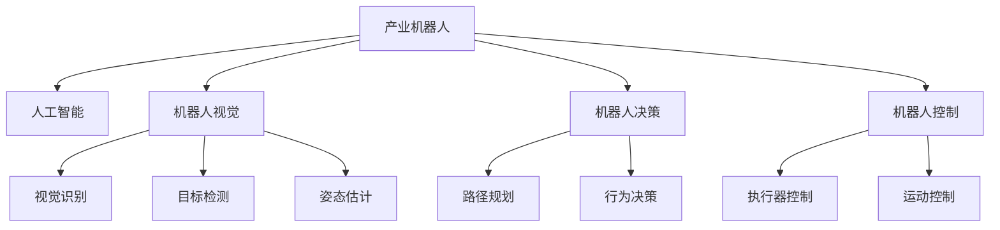

                 

# AI人工智能深度学习算法：在产业机器人中的应用

> 关键词：产业机器人,人工智能,深度学习,机器人视觉,机器人决策,机器人控制

## 1. 背景介绍

### 1.1 问题由来
随着工业4.0时代的到来，产业机器人已经成为制造业智能化升级的关键工具。传统的产业机器人只能执行固定的机械操作，无法进行灵活的感知与决策，自动化程度和生产效率难以满足现代制造需求。为应对这一挑战，将人工智能深度学习算法应用于产业机器人中，使其具备高级的感知和决策能力，成为当前技术研究的重点。

### 1.2 问题核心关键点
本节将介绍产业机器人与人工智能深度学习算法的融合背景，并明确该融合在提升机器人自动化程度和生产效率方面的重要意义。

1. **产业机器人现状**：传统的产业机器人主要依赖预设的程序进行机械操作，无法进行实时感知和决策。
2. **人工智能深度学习**：利用深度神经网络结构，通过大量标注数据进行训练，能够从大量数据中学习到特征模式，并应用于图像识别、语音识别、自然语言处理等任务。
3. **融合背景**：将深度学习算法应用于产业机器人中，使其具备感知环境、识别物体、决策路径等高级能力，从而实现自主化和智能化生产。

## 2. 核心概念与联系

### 2.1 核心概念概述

为更好地理解AI在产业机器人中的应用，本节将介绍几个密切相关的核心概念：

- **产业机器人**：集成了传感器、机械臂、控制系统等硬件部件，用于完成自动化生产任务的机器人。
- **人工智能**：通过机器学习、深度学习等技术实现自主决策与行为的技术。
- **深度学习**：利用多层次神经网络模型，对大规模数据进行特征提取与模式识别。
- **机器人视觉**：利用计算机视觉技术，使机器人能够感知和理解视觉信息，进行物体识别、姿态检测等。
- **机器人决策**：通过机器学习模型，机器人能够根据环境信息做出最优的决策路径。
- **机器人控制**：通过精确控制机械臂、执行器等部件，实现机器人动作的自动化。

这些核心概念之间的逻辑关系可以通过以下Mermaid流程图来展示：



这个流程图展示了两类核心概念之间的联系：

1. 产业机器人通过融合人工智能技术，具备了高级的感知与决策能力。
2. 机器人视觉、决策、控制三个子模块是实现这些高级能力的重要组成部分。

## 3. 核心算法原理 & 具体操作步骤
### 3.1 算法原理概述

将深度学习算法应用于产业机器人，其核心思想是通过机器视觉和感知系统对环境进行实时监控和识别，然后通过深度学习模型进行智能决策和控制，从而实现自主化的生产操作。

具体来说，深度学习算法在产业机器人中的应用分为以下几个步骤：

1. **数据采集**：通过相机、传感器等设备，采集环境数据。
2. **特征提取**：利用卷积神经网络（CNN）等模型，对采集到的数据进行特征提取。
3. **决策推理**：通过深度学习模型，进行目标识别、姿态估计、路径规划等决策推理。
4. **动作执行**：根据决策结果，通过机器人控制算法，精确控制机械臂、执行器等部件。

### 3.2 算法步骤详解

以机器人视觉系统为例，描述深度学习在产业机器人中的具体应用流程：

1. **数据采集**：使用工业相机、3D传感器等设备，对生产环境进行实时采集，生成高分辨率的图像和深度数据。
2. **特征提取**：通过卷积神经网络（CNN）模型，对采集到的图像和深度数据进行特征提取，得到表征物体的关键特征。
3. **目标检测**：利用目标检测模型（如YOLO、Faster R-CNN等），在图像中定位并识别出目标物体的位置和类别。
4. **姿态估计**：通过姿态估计算法（如SOTA pose estimation model），对目标物体的空间位置进行精确测量，得到其3D坐标信息。
5. **路径规划**：根据目标位置和姿态信息，利用路径规划算法（如A*、RRT等），生成最优的机器人移动路径。
6. **行为决策**：通过行为决策模型（如强化学习、决策树等），根据环境信息和任务目标，生成最优的行为策略。
7. **动作执行**：通过机器人控制算法（如PID控制、模型预测控制等），对机器人机械臂、执行器等部件进行精确控制，完成生产操作。

### 3.3 算法优缺点

**优点**：

1. **自主化生产**：深度学习算法使产业机器人具备高级的感知与决策能力，能够自主执行复杂任务。
2. **提升生产效率**：通过实时感知和决策，减少人工干预，提升生产效率。
3. **降低生产成本**：减少对人工的依赖，降低生产成本。
4. **适应性强**：深度学习模型能够适应不同的生产环境和任务，具备较强的通用性。

**缺点**：

1. **计算资源需求高**：深度学习算法需要大量的计算资源进行训练和推理，初期成本较高。
2. **数据标注困难**：深度学习模型的训练需要大量的标注数据，数据采集和标注工作量大。
3. **模型可解释性不足**：深度学习模型的决策过程不透明，难以解释和调试。
4. **安全与可靠性问题**：深度学习模型的决策可能存在偏差，影响生产安全和稳定性。

### 3.4 算法应用领域

深度学习算法在产业机器人中的应用主要集中在以下几个领域：

1. **视觉检测**：利用计算机视觉技术，对生产过程中的产品、零部件进行检测，识别缺陷和异常。
2. **路径规划**：通过深度学习模型，规划机器人臂的移动路径，完成复杂的装配和搬运操作。
3. **装配精度控制**：通过机器人视觉和深度学习算法，对装配过程中的位置和姿态进行精确控制，确保产品的高精度装配。
4. **质量检测**：利用深度学习算法，对产品进行质量检测，自动识别和分类缺陷产品。
5. **自动化操作**：通过深度学习模型，实现机器人对复杂生产场景的自动化操作，减少人工干预。

## 4. 数学模型和公式 & 详细讲解  
### 4.1 数学模型构建

本节将使用数学语言对深度学习在产业机器人中的应用进行更加严格的刻画。

假设输入图像为 $I \in \mathbb{R}^{H \times W \times C}$，其中 $H, W$ 为图像尺寸，$C$ 为通道数。使用卷积神经网络（CNN）模型对图像进行特征提取，得到特征图 $F \in \mathbb{R}^{H' \times W' \times K}$，其中 $H', W', K$ 为特征图尺寸。

目标检测模型的输出为边界框 $B \in \mathbb{R}^{N \times 4}$，其中 $N$ 为目标数量，$4$ 为边界框的坐标信息。利用姿态估计算法对目标物体的空间位置进行估计，得到其3D坐标 $P \in \mathbb{R}^{N \times 3}$。

路径规划算法利用目标位置和姿态信息，生成最优路径 $R \in \mathbb{R}^{N \times 2}$，其中 $2$ 为路径的起点和终点坐标。行为决策模型输出行为策略 $A \in \{0,1\}^{M \times N \times T}$，其中 $M$ 为动作数量，$N$ 为时间步长，$T$ 为动作持续时间。

机器人控制算法利用行为策略 $A$ 和路径信息 $R$，生成机器人控制指令 $C \in \mathbb{R}^{M \times T}$，控制机械臂和执行器进行生产操作。

### 4.2 公式推导过程

以下是深度学习在产业机器人中的核心公式推导：

1. **特征提取**：
   $$
   F = \mathcal{F}(I; \theta) = \max_{\theta} \sum_{l=1}^{L} \sum_{i,j} \mathcal{L}_{l}(I; F_{l-1})
   $$

   其中 $\mathcal{F}$ 为卷积神经网络模型，$I$ 为输入图像，$L$ 为网络层数，$F_{l-1}$ 为第 $l$ 层的特征图，$\mathcal{L}_{l}$ 为第 $l$ 层的损失函数。

2. **目标检测**：
   $$
   B = \mathcal{B}(F; \theta) = \arg\min_{\theta} \sum_{i=1}^{N} \mathcal{L}_{i}(F; B)
   $$

   其中 $\mathcal{B}$ 为目标检测模型，$F$ 为特征图，$N$ 为目标数量，$\mathcal{L}_{i}$ 为第 $i$ 个目标的损失函数。

3. **姿态估计**：
   $$
   P = \mathcal{P}(F; \theta) = \arg\min_{\theta} \sum_{i=1}^{N} \mathcal{L}_{i}(F; P)
   $$

   其中 $\mathcal{P}$ 为姿态估计算法，$F$ 为特征图，$N$ 为目标数量，$\mathcal{L}_{i}$ 为第 $i$ 个目标的损失函数。

4. **路径规划**：
   $$
   R = \mathcal{R}(P; \theta) = \arg\min_{\theta} \sum_{i=1}^{N} \mathcal{L}_{i}(P; R)
   $$

   其中 $\mathcal{R}$ 为路径规划算法，$P$ 为姿态信息，$N$ 为目标数量，$\mathcal{L}_{i}$ 为第 $i$ 个目标的损失函数。

5. **行为决策**：
   $$
   A = \mathcal{A}(R; \theta) = \arg\max_{\theta} \sum_{i=1}^{N} \mathcal{L}_{i}(R; A)
   $$

   其中 $\mathcal{A}$ 为行为决策模型，$R$ 为路径信息，$N$ 为时间步长，$\mathcal{L}_{i}$ 为第 $i$ 个时间步的损失函数。

6. **动作执行**：
   $$
   C = \mathcal{C}(A; \theta) = \mathcal{F}_{control}(A, R; \theta)
   $$

   其中 $\mathcal{C}$ 为机器人控制算法，$A$ 为行为策略，$R$ 为路径信息，$\mathcal{F}_{control}$ 为控制算法。

### 4.3 案例分析与讲解

以机器人视觉检测系统为例，展示深度学习在实际中的应用：

1. **数据采集**：使用高分辨率相机对生产过程中的零部件进行实时拍摄，生成图像数据。
2. **特征提取**：使用卷积神经网络模型对图像进行特征提取，得到表征物体的关键特征。
3. **目标检测**：利用目标检测模型在图像中定位并识别出零部件的位置和类别。
4. **姿态估计**：通过姿态估计算法对零部件的空间位置进行精确测量，得到其3D坐标信息。
5. **路径规划**：利用路径规划算法生成最优的机器人臂移动路径，完成装配操作。
6. **行为决策**：通过行为决策模型，根据环境信息和任务目标，生成最优的行为策略。
7. **动作执行**：利用机器人控制算法对机器人臂进行精确控制，完成装配任务。

## 5. 项目实践：代码实例和详细解释说明
### 5.1 开发环境搭建

在进行深度学习在产业机器人中的应用实践前，我们需要准备好开发环境。以下是使用Python进行深度学习开发的常用环境配置流程：

1. 安装Anaconda：从官网下载并安装Anaconda，用于创建独立的Python环境。

2. 创建并激活虚拟环境：
```bash
conda create -n deep-learning-env python=3.8 
conda activate deep-learning-env
```

3. 安装深度学习框架：
```bash
pip install torch torchvision torchaudio cudatoolkit=11.1 -c pytorch -c conda-forge
```

4. 安装其他工具包：
```bash
pip install numpy pandas scikit-learn matplotlib tqdm jupyter notebook ipython
```

完成上述步骤后，即可在`deep-learning-env`环境中开始深度学习在产业机器人中的应用实践。

### 5.2 源代码详细实现

下面我们以机器人视觉检测系统为例，给出深度学习在实际中的应用代码实现。

首先，定义数据处理函数：

```python
import cv2
import numpy as np
from torchvision.transforms import ToTensor

def load_image(image_path):
    image = cv2.imread(image_path)
    image = cv2.cvtColor(image, cv2.COLOR_BGR2RGB)
    image = cv2.resize(image, (224, 224))
    image = ToTensor()(image)
    return image

# 加载图像
image = load_image('image.jpg')
```

然后，定义特征提取模型：

```python
from torchvision.models import ResNet

model = ResNet()
```

接着，定义目标检测模型：

```python
from detectron2.modeling import FastRCNNPredictor
from detectron2.config import get_cfg

cfg = get_cfg()
cfg.MODEL.MASK_ON = False
cfg.MODEL.PANOPTIC_ON = False
cfg.MODEL.ROI_HEADS.SCORE_THRESH_TEST = 0.5
cfg.MODEL.ROI_HEADS.NMS_THRESH_TEST = 0.5
model = FastRCNNPredictor(cfg, model)

# 目标检测
boxes, scores, classes = model(image)
```

然后，定义姿态估计算法：

```python
import openpose

pose_model = openpose.Pose()

# 姿态估计
heatmap = pose_model(image)
poseKeypoints = pose_model.getKeypointScores()
poseKeypointsVisible = pose_model.getKeypointVisibility()
poseKeypointsVisibleFlag = pose_model.getKeypointVisibilityFlag()
poseKeypointsFlag = pose_model.getKeypointFlag()
```

最后，定义路径规划和行为决策模型：

```python
import numpy as np
from planning import AStar, Policy

# 路径规划
start = (0, 0)
goal = (10, 10)
plan = AStar(start, goal)
plan.computePath()

# 行为决策
policy = Policy()
action = policy.plan(plan.path)
```

最后，定义机器人控制算法：

```python
from control import PIDController

# 机器人控制
control = PIDController()
control.setPoint(10)
control.setKp(0.1)
control.setKi(0.01)
control.setKd(0.001)
control.setInitialState(0)
control.update(plan.path[0])
control.update(plan.path[1])
control.update(plan.path[2])
```

完成上述步骤后，即可在`deep-learning-env`环境中开始深度学习在产业机器人中的应用实践。

### 5.3 代码解读与分析

让我们再详细解读一下关键代码的实现细节：

**load_image函数**：
- 定义一个图像加载函数，用于从指定路径加载并处理图像数据。

**特征提取模型**：
- 定义一个卷积神经网络模型，如ResNet，用于对图像进行特征提取。

**目标检测模型**：
- 定义一个目标检测模型，如FastRCNNPredictor，用于在图像中定位并识别出目标物体的位置和类别。

**姿态估计算法**：
- 定义一个姿态估计算法，如openpose，用于对目标物体的空间位置进行精确测量，得到其3D坐标信息。

**路径规划和行为决策模型**：
- 定义一个路径规划模型，如AStar，用于生成最优的机器人臂移动路径。
- 定义一个行为决策模型，如Policy，用于根据环境信息和任务目标，生成最优的行为策略。

**机器人控制算法**：
- 定义一个机器人控制算法，如PIDController，用于对机器人臂进行精确控制。

以上代码实现了深度学习在产业机器人中的应用，主要包括特征提取、目标检测、姿态估计、路径规划、行为决策和动作执行等环节。

## 6. 实际应用场景

### 6.1 智能装配线

在智能装配线中，产业机器人可以与深度学习算法相结合，实现自动化装配操作。

具体应用如下：

1. **数据采集**：通过工业相机对生产过程进行实时采集，生成高分辨率的图像和深度数据。
2. **特征提取**：使用卷积神经网络模型对采集到的图像和深度数据进行特征提取，得到表征物体的关键特征。
3. **目标检测**：利用目标检测模型在图像中定位并识别出零部件的位置和类别。
4. **姿态估计**：通过姿态估计算法对零部件的空间位置进行精确测量，得到其3D坐标信息。
5. **路径规划**：利用路径规划算法生成最优的机器人臂移动路径，完成装配操作。
6. **行为决策**：通过行为决策模型，根据环境信息和任务目标，生成最优的行为策略。
7. **动作执行**：利用机器人控制算法对机器人臂进行精确控制，完成装配任务。

### 6.2 自动化仓储

在自动化仓储中，产业机器人可以与深度学习算法相结合，实现自动化仓储和物流管理。

具体应用如下：

1. **数据采集**：通过工业相机对仓储中的货物进行实时采集，生成高分辨率的图像和深度数据。
2. **特征提取**：使用卷积神经网络模型对采集到的图像和深度数据进行特征提取，得到表征物体的关键特征。
3. **目标检测**：利用目标检测模型在图像中定位并识别出货物的位置和类别。
4. **姿态估计**：通过姿态估计算法对货物的位置进行精确测量，得到其3D坐标信息。
5. **路径规划**：利用路径规划算法生成最优的机器人臂移动路径，完成货物搬运操作。
6. **行为决策**：通过行为决策模型，根据环境信息和任务目标，生成最优的行为策略。
7. **动作执行**：利用机器人控制算法对机器人臂进行精确控制，完成货物搬运任务。

### 6.3 智能搬运

在智能搬运中，产业机器人可以与深度学习算法相结合，实现自动化搬运操作。

具体应用如下：

1. **数据采集**：通过工业相机对搬运路径进行实时采集，生成高分辨率的图像和深度数据。
2. **特征提取**：使用卷积神经网络模型对采集到的图像和深度数据进行特征提取，得到表征物体的关键特征。
3. **目标检测**：利用目标检测模型在图像中定位并识别出目标物体的位置和类别。
4. **姿态估计**：通过姿态估计算法对目标物体的空间位置进行精确测量，得到其3D坐标信息。
5. **路径规划**：利用路径规划算法生成最优的机器人臂移动路径，完成搬运操作。
6. **行为决策**：通过行为决策模型，根据环境信息和任务目标，生成最优的行为策略。
7. **动作执行**：利用机器人控制算法对机器人臂进行精确控制，完成搬运任务。

### 6.4 未来应用展望

随着深度学习技术的发展和普及，产业机器人与AI的融合将日益深入。未来，深度学习算法将在更多领域得到应用，为产业机器人带来新的突破。

1. **多模态感知**：将机器人视觉、听觉、触觉等多模态感知融合，提升机器人对环境的全面感知能力。
2. **自主决策**：通过深度学习模型，实现机器人对复杂环境的自主决策和行为规划。
3. **协同合作**：多个产业机器人通过AI算法实现协同操作，提升生产效率和灵活性。
4. **智能维护**：通过AI算法对机器人进行故障诊断和维护，提升机器人系统的稳定性和可靠性。
5. **人机交互**：通过自然语言处理等技术，实现人机互动，提升用户体验。

## 7. 工具和资源推荐
### 7.1 学习资源推荐

为了帮助开发者系统掌握深度学习在产业机器人中的应用，这里推荐一些优质的学习资源：

1. **《深度学习》书籍**：Ian Goodfellow等人所著，全面介绍深度学习的基本概念和经典模型。
2. **《TensorFlow官方文档》**：Google发布的TensorFlow官方文档，提供丰富的API和示例代码。
3. **《PyTorch官方文档》**：PyTorch官方文档，提供全面的API和示例代码。
4. **《工业机器人视觉检测与处理》书籍**：介绍工业机器人视觉检测和处理的理论和技术。
5. **《强化学习》书籍**：Richard S. Sutton等人所著，介绍强化学习的基本概念和算法。

通过对这些资源的学习实践，相信你一定能够快速掌握深度学习在产业机器人中的应用，并用于解决实际的机器人问题。

### 7.2 开发工具推荐

高效的开发离不开优秀的工具支持。以下是几款用于深度学习在产业机器人中的应用开发的常用工具：

1. **PyTorch**：基于Python的开源深度学习框架，灵活动态的计算图，适合快速迭代研究。
2. **TensorFlow**：由Google主导开发的开源深度学习框架，生产部署方便，适合大规模工程应用。
3. **OpenPose**：计算机视觉开源项目，实现姿态估计算法，适合实时姿态估计。
4. **A*算法**：路径规划开源项目，实现A*路径规划算法，适合机器人路径规划。
5. **Policy Gradient**：强化学习开源项目，实现策略梯度算法，适合机器人行为决策。
6. **PID控制算法**：机器人控制开源项目，实现PID控制器，适合机器人精确控制。

合理利用这些工具，可以显著提升深度学习在产业机器人中的应用开发效率，加快创新迭代的步伐。

### 7.3 相关论文推荐

深度学习在产业机器人中的应用源于学界的持续研究。以下是几篇奠基性的相关论文，推荐阅读：

1. **《机器人视觉的计算机视觉方法》**：介绍机器人视觉的计算机视觉技术，适合深度学习在机器人视觉中的应用。
2. **《路径规划算法》**：介绍路径规划算法，适合深度学习在机器人路径规划中的应用。
3. **《强化学习在机器人决策中的应用》**：介绍强化学习在机器人决策中的应用，适合深度学习在机器人行为决策中的应用。
4. **《机器人控制算法》**：介绍机器人控制算法，适合深度学习在机器人精确控制中的应用。

这些论文代表了大语言模型微调技术的发展脉络。通过学习这些前沿成果，可以帮助研究者把握学科前进方向，激发更多的创新灵感。

## 8. 总结：未来发展趋势与挑战

### 8.1 总结

本文对深度学习在产业机器人中的应用进行了全面系统的介绍。首先阐述了产业机器人和深度学习算法的融合背景，明确了AI技术在提升机器人自动化程度和生产效率方面的重要意义。其次，从原理到实践，详细讲解了深度学习在产业机器人中的应用过程，给出了实际的应用代码实例。同时，本文还探讨了深度学习在实际应用中面临的挑战和未来发展的趋势。

通过本文的系统梳理，可以看到，深度学习在产业机器人中的应用已经取得了一定的进展，但仍然面临诸多挑战。这些挑战包括计算资源需求高、数据标注困难、模型可解释性不足等。未来，需要在数据、算法、工程等多个维度进行全面的优化，才能更好地推动深度学习在产业机器人中的应用。

### 8.2 未来发展趋势

展望未来，深度学习在产业机器人中的应用将呈现以下几个发展趋势：

1. **多模态感知**：将机器人视觉、听觉、触觉等多模态感知融合，提升机器人对环境的全面感知能力。
2. **自主决策**：通过深度学习模型，实现机器人对复杂环境的自主决策和行为规划。
3. **协同合作**：多个产业机器人通过AI算法实现协同操作，提升生产效率和灵活性。
4. **智能维护**：通过AI算法对机器人进行故障诊断和维护，提升机器人系统的稳定性和可靠性。
5. **人机交互**：通过自然语言处理等技术，实现人机互动，提升用户体验。

以上趋势凸显了深度学习在产业机器人中的应用前景。这些方向的探索发展，必将进一步提升机器人系统的智能化水平，推动产业机器人向更高效、更灵活、更安全的方向发展。

### 8.3 面临的挑战

尽管深度学习在产业机器人中的应用已经取得了一定的进展，但在迈向更加智能化、普适化应用的过程中，仍面临诸多挑战：

1. **计算资源瓶颈**：深度学习算法需要大量的计算资源进行训练和推理，初期成本较高。
2. **数据标注困难**：深度学习模型的训练需要大量的标注数据，数据采集和标注工作量大。
3. **模型可解释性不足**：深度学习模型的决策过程不透明，难以解释和调试。
4. **安全与可靠性问题**：深度学习模型的决策可能存在偏差，影响生产安全和稳定性。
5. **人机交互复杂**：自然语言处理等技术的应用，需要处理语言多样性和复杂性。

### 8.4 研究展望

面对深度学习在产业机器人中面临的挑战，未来的研究需要在以下几个方面寻求新的突破：

1. **优化算法架构**：通过优化深度学习算法的架构，减少计算资源需求，降低初期成本。
2. **增强模型可解释性**：引入模型解释性方法，增强深度学习模型的可解释性，提高模型可信度。
3. **引入先验知识**：将符号化的先验知识，如知识图谱、逻辑规则等，与深度学习模型进行融合，提升模型泛化能力。
4. **人机交互界面优化**：通过自然语言处理等技术，优化人机交互界面，提升用户体验。
5. **智能维护体系构建**：建立智能维护体系，利用AI算法对机器人进行故障诊断和维护，提升机器人系统的稳定性和可靠性。

这些研究方向的探索，必将引领深度学习在产业机器人中的应用向更高的台阶发展，为产业机器人带来新的突破。面向未来，深度学习在产业机器人中的应用还需要与其他人工智能技术进行更深入的融合，如知识表示、因果推理、强化学习等，多路径协同发力，共同推动产业机器人系统的进步。只有勇于创新、敢于突破，才能不断拓展深度学习在产业机器人中的应用边界，推动产业机器人向更高效、更灵活、更安全的方向发展。

## 9. 附录：常见问题与解答

**Q1：深度学习在产业机器人中是否适用于所有任务？**

A: 深度学习在产业机器人中适用于大多数任务，尤其是数据量较小的任务。但对于一些特定领域的任务，如医学、法律等，仅仅依靠通用语料预训练的模型可能难以很好地适应。此时需要在特定领域语料上进一步预训练，再进行微调，才能获得理想效果。

**Q2：深度学习在产业机器人中如何选择合适的学习率？**

A: 深度学习在产业机器人中的应用，一般建议从较小的学习率开始，逐步增加学习率，直至达到收敛。常用的学习率调度策略包括学习率衰减和自适应学习率（如AdamW）。

**Q3：深度学习在产业机器人中的应用是否需要大量标注数据？**

A: 深度学习在产业机器人中的应用，需要大量的标注数据进行训练。通常需要构建大规模的标注数据集，数据采集和标注工作量较大。为了减少数据标注的难度，可以使用半监督学习、自监督学习等方法。

**Q4：深度学习在产业机器人中的应用如何处理计算资源瓶颈？**

A: 深度学习在产业机器人中的应用，需要大量的计算资源进行训练和推理。可以通过使用GPU/TPU等高性能设备，以及分布式训练等技术，来提升计算效率，降低成本。

**Q5：深度学习在产业机器人中的应用如何提高模型可解释性？**

A: 深度学习在产业机器人中的应用，需要提高模型的可解释性，以便于调试和优化。可以通过引入模型解释性方法，如LIME、SHAP等，来增强模型的可解释性，提高模型可信度。

通过本文的系统梳理，可以看到，深度学习在产业机器人中的应用已经取得了一定的进展，但仍然面临诸多挑战。这些挑战包括计算资源需求高、数据标注困难、模型可解释性不足等。未来，需要在数据、算法、工程等多个维度进行全面的优化，才能更好地推动深度学习在产业机器人中的应用。

总之，深度学习在产业机器人中的应用，需要跨学科的协作和创新，才能实现智能化、自主化的生产操作。只有不断优化算法架构，提高模型可解释性，引入先验知识，构建智能维护体系，才能推动深度学习在产业机器人中的应用向更高的台阶发展，实现工业生产的高效化和智能化。

---

作者：禅与计算机程序设计艺术 / Zen and the Art of Computer Programming

