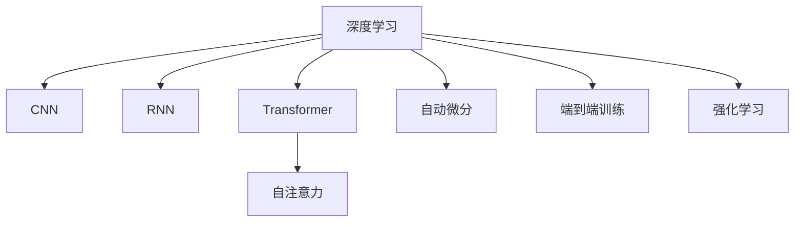

                 

# AI人工智能深度学习算法：在实时估计中的应用

> 关键词：深度学习,实时估计,算法,卷积神经网络,循环神经网络,Transformer模型,自动微分,端到端训练,强化学习

## 1. 背景介绍

在现代社会，数据的实时性和准确性成为决策的重要支撑。无论是金融交易、智能制造、智慧城市，还是自动驾驶、机器人导航，实时估计的应用场景无处不在。深度学习技术，尤其是深度神经网络（Deep Neural Networks, DNNs），已成为解决复杂数据估计问题的有效工具。本文将系统介绍深度学习算法在实时估计中的核心原理与实际应用，帮助读者理解深度学习技术在实时估计任务中的实现机制和优化策略。

### 1.1 问题由来

在深度学习之前，传统的统计学习方法如线性回归、支持向量机（Support Vector Machine, SVM）等在实时估计问题中取得了一定的成效。然而，这些方法往往难以处理高维度、非线性的数据结构，且对数据的假设较多，无法灵活适应实际应用场景。而深度学习，特别是卷积神经网络（Convolutional Neural Networks, CNNs）、循环神经网络（Recurrent Neural Networks, RNNs）以及Transformer模型等，通过引入多层次非线性映射，在处理复杂数据结构、捕捉高阶特征关系方面表现出巨大优势，成为了实时估计领域的核心工具。

深度学习的成功离不开算法的发展和工具的优化。例如，基于自动微分技术的端到端训练方法，使得模型的梯度可以直接回传，简化了优化流程。同时，强化学习等动态优化算法，在实时决策和控制任务中也展示出强大的潜力。本文将重点关注深度学习算法在实时估计中的应用，涵盖基本概念、核心算法、工程实践和应用场景等多个方面，全面探讨深度学习在实时估计中的应用前景和挑战。

### 1.2 问题核心关键点

实时估计涉及动态数据处理、高效模型训练和稳定推理输出。深度学习算法在实时估计中的应用，关键点如下：

1. **数据处理**：如何高效地处理并行数据流，同时确保数据流的实时性和稳定性。
2. **模型训练**：如何在有限时间内训练高效的模型，并应对动态环境中的数据变化。
3. **推理输出**：如何快速、准确地进行实时推理，保证决策的及时性和正确性。

本文将围绕这些关键点，深入分析深度学习算法在实时估计中的应用策略和实现方法，提出具体案例和优化建议。

## 2. 核心概念与联系

### 2.1 核心概念概述

为更好地理解深度学习算法在实时估计中的应用，本节将介绍几个密切相关的核心概念：

- **深度学习**：基于多层神经网络的一种机器学习技术，能够自动从数据中学习高级特征表示。
- **卷积神经网络（CNN）**：一种广泛用于图像识别和处理任务的深度神经网络，通过卷积操作提取空间局部特征。
- **循环神经网络（RNN）**：一种处理序列数据的深度神经网络，通过递归操作捕捉序列间的关系。
- **Transformer模型**：一种利用自注意力机制进行序列建模的深度神经网络，广泛应用于自然语言处理（NLP）领域。
- **自动微分**：一种通过反向传播计算梯度的技术，自动推导复杂模型的高阶导数。
- **端到端训练（End-to-End Training）**：将模型训练和优化过程集成到一个框架中，提高训练效率。
- **强化学习**：一种通过与环境交互，优化模型决策策略的学习方法，适用于实时动态决策场景。

这些概念之间的逻辑关系可以通过以下Mermaid流程图来展示：



这个流程图展示深度学习的核心概念及其之间的关系：

1. CNN用于图像识别和处理任务。
2. RNN用于序列数据建模，特别适用于时序数据。
3. Transformer通过自注意力机制，实现序列建模。
4. 自动微分技术使得端到端训练成为可能。
5. 强化学习用于动态决策和优化。

这些概念共同构成了深度学习在实时估计中的应用框架，使其能够高效处理动态数据，快速训练模型，稳定输出决策。

## 3. 核心算法原理 & 具体操作步骤

### 3.1 算法原理概述

深度学习在实时估计中的应用，主要通过构建高效的神经网络模型，利用自动微分技术和端到端训练方法，快速计算模型参数的梯度，并采用优化算法进行参数更新。其核心思想是通过多层非线性映射，自动学习数据的复杂表示，实现对动态数据的高效处理和实时估计。

形式化地，假设实时数据流为 $\{ x_t \}_{t=1}^T$，其中 $x_t \in \mathcal{X}$，目标为估计 $\hat{y}_t = f(x_t)$，其中 $f$ 为神经网络模型，$\hat{y}_t$ 为模型对 $x_t$ 的预测。模型的训练过程可表示为：

$$
\min_{\theta} \sum_{t=1}^T \mathcal{L}(\hat{y}_t, y_t)
$$

其中 $\mathcal{L}$ 为损失函数，$y_t$ 为真实标签。

### 3.2 算法步骤详解

深度学习在实时估计中的应用步骤包括数据预处理、模型构建、训练优化和推理预测。以下将详细介绍每个步骤的实现流程：

**Step 1: 数据预处理**

实时数据流的处理需要考虑数据流的实时性和稳定性。常见的数据预处理技术包括：

- **数据缓存**：使用环形缓冲区或滑动窗口技术，缓存实时数据，避免数据丢失。
- **数据增强**：通过对输入数据进行旋转、缩放、裁剪等变换，增加数据多样性，提高模型的泛化能力。
- **数据压缩**：通过量化、降维等方法，减少数据存储和传输的负担。

**Step 2: 模型构建**

构建高效的神经网络模型是深度学习在实时估计中的关键步骤。常见的模型包括：

- **卷积神经网络（CNN）**：适用于图像、语音等静态数据的实时估计。
- **循环神经网络（RNN）**：适用于时间序列数据的实时估计。
- **Transformer模型**：适用于自然语言处理（NLP）领域的实时估计任务，能够处理长文本序列。

**Step 3: 训练优化**

深度学习的训练过程需要高效、快速的梯度计算和参数更新。常见的优化方法包括：

- **随机梯度下降（SGD）**：通过随机抽样计算梯度，适用于大规模数据集。
- **AdamW**：自适应学习率的优化算法，能够自适应地调整学习率。
- **自适应梯度算法**：如Adagrad、Adadelta等，能够自适应地调整梯度步长。

**Step 4: 推理预测**

模型训练完成后，需要进行实时推理预测。常见的推理技术包括：

- **前向传播**：将输入数据传入模型，计算输出结果。
- **批处理**：对批量输入数据进行推理，提高计算效率。
- **异步推理**：通过多线程、多进程等技术，实现异步推理，提升推理速度。

### 3.3 算法优缺点

深度学习在实时估计中的应用，具有以下优点：

1. **高精度**：深度学习模型能够自动学习数据的复杂表示，实现高精度的估计。
2. **高效性**：通过并行计算和优化算法，深度学习模型能够高效处理大规模数据流。
3. **泛化能力**：深度学习模型能够学习到数据的高级特征表示，具有良好的泛化能力。

同时，深度学习在实时估计中也有一些局限性：

1. **高计算资源需求**：深度学习模型参数量大，计算复杂，需要高性能的计算设备和算法支持。
2. **训练时间长**：深度学习模型训练过程复杂，需要较长的训练时间。
3. **模型可解释性不足**：深度学习模型的黑盒特性，使得其决策过程难以解释。

尽管存在这些局限性，但深度学习在实时估计中的应用前景依然广阔，尤其是在图像、语音、自然语言处理等数据密集型领域，深度学习已经展示出卓越的性能。

### 3.4 算法应用领域

深度学习在实时估计中的应用领域非常广泛，包括但不限于：

- **图像识别**：通过CNN模型，实时识别和分类图像。
- **语音识别**：通过RNN或Transformer模型，实时转录和识别语音。
- **自然语言处理（NLP）**：通过Transformer模型，实时理解、生成和翻译文本。
- **智能驾驶**：通过RNN和CNN模型，实时感知和决策。
- **机器人导航**：通过CNN和Transformer模型，实时规划路径和执行动作。
- **金融交易**：通过RNN和Transformer模型，实时预测市场动态。

随着深度学习技术的不断进步，其应用领域将进一步拓展，为各行各业带来新的变革和机遇。

## 4. 数学模型和公式 & 详细讲解 & 举例说明

### 4.1 数学模型构建

在实时估计中，深度学习模型需要能够高效处理动态数据流。以下以卷积神经网络（CNN）和循环神经网络（RNN）为例，构建深度学习模型。

**CNN模型**：

假设输入数据为图像 $x \in \mathbb{R}^{C \times H \times W}$，其中 $C$ 为通道数，$H$ 和 $W$ 为图像高度和宽度。CNN模型的基本结构包括卷积层、池化层和全连接层。

- **卷积层**：通过卷积操作提取图像的局部特征。
- **池化层**：通过降采样操作，减少特征图的大小和计算量。
- **全连接层**：将特征图转换为分类结果。

CNN的数学模型可以表示为：

$$
y = h(\theta, x) = f_w(x) + b
$$

其中 $f_w(x) = \sum_{i=1}^{N} w_i x_i + b$ 为线性变换，$h(\theta, x)$ 为激活函数，$\theta$ 为模型参数。

**RNN模型**：

假设输入数据为序列 $x = \{x_t\}_{t=1}^T$，其中 $x_t \in \mathbb{R}^d$，$d$ 为输入向量维度。RNN模型的基本结构包括循环层和输出层。

- **循环层**：通过循环神经网络，捕捉序列间的关系。
- **输出层**：将序列信息转换为预测结果。

RNN的数学模型可以表示为：

$$
y_t = h(\theta, x) = f_w(x_t, x_{t-1}, ..., x_1)
$$

其中 $f_w(x_t, x_{t-1}, ..., x_1)$ 为RNN的状态更新函数，$\theta$ 为模型参数。

### 4.2 公式推导过程

**CNN公式推导**：

假设CNN模型由 $L$ 层卷积层、池化层和全连接层组成。输入数据为 $x \in \mathbb{R}^{C \times H \times W}$，输出数据为 $y \in \mathbb{R}^k$，其中 $k$ 为分类数目。

卷积层公式推导如下：

$$
f_{w}^{(l)}(x) = \sum_{i=1}^{n} w_{i}^{(l)} * x + b^{(l)}
$$

其中 $n$ 为卷积核数量，$w^{(l)}$ 为卷积核参数，$*$ 表示卷积操作。

池化层公式推导如下：

$$
p^{(l)} = \max\limits_{i=1}^{H} \max\limits_{j=1}^{W} f_{w}^{(l)}(x)
$$

其中 $p^{(l)}$ 为池化后特征图，$*$ 表示池化操作。

全连接层公式推导如下：

$$
y = f_w(x) + b
$$

其中 $f_w(x) = \sum_{i=1}^{N} w_i x_i + b$ 为线性变换，$h(\theta, x)$ 为激活函数，$\theta$ 为模型参数。

**RNN公式推导**：

假设RNN模型由 $L$ 层循环层和输出层组成。输入数据为 $x = \{x_t\}_{t=1}^T$，其中 $x_t \in \mathbb{R}^d$，$d$ 为输入向量维度。

循环层公式推导如下：

$$
h_t = f_w(x_t, h_{t-1})
$$

其中 $f_w(x_t, h_{t-1})$ 为RNN的状态更新函数，$\theta$ 为模型参数。

输出层公式推导如下：

$$
y = f_w(h_T)
$$

其中 $h_T$ 为最终状态，$f_w(h_T)$ 为输出函数。

### 4.3 案例分析与讲解

以图像分类任务为例，展示CNN在实时估计中的应用。

假设输入数据为 $x \in \mathbb{R}^{C \times H \times W}$，其中 $C=3$，$H=224$，$W=224$，表示输入为一幅 $224 \times 224$ 的RGB图像。输出数据为 $y \in \mathbb{R}^k$，其中 $k=1000$，表示分类数目为1000个。

**CNN模型构建**：

假设CNN模型由3个卷积层、2个池化层和1个全连接层组成。

- **卷积层1**：3个卷积核，$3 \times 3$ 的卷积核大小，$64$ 的卷积核数量，步长 $1$，$relu$ 激活函数。
- **池化层1**：$2 \times 2$ 的池化大小，步长 $2$，$2$ 的池化核数量，$relu$ 激活函数。
- **卷积层2**：3个卷积核，$3 \times 3$ 的卷积核大小，$128$ 的卷积核数量，步长 $1$，$relu$ 激活函数。
- **池化层2**：$2 \times 2$ 的池化大小，步长 $2$，$2$ 的池化核数量，$relu$ 激活函数。
- **全连接层**：$512$ 的输出向量维度，$softmax$ 激活函数。

**公式推导**：

卷积层1公式推导如下：

$$
f_{w}^{(1)}(x) = \sum_{i=1}^{3} w_{i}^{(1)} * x_i + b^{(1)}
$$

池化层1公式推导如下：

$$
p^{(1)} = \max\limits_{i=1}^{224} \max\limits_{j=1}^{224} f_{w}^{(1)}(x)
$$

卷积层2公式推导如下：

$$
f_{w}^{(2)}(x) = \sum_{i=1}^{3} w_{i}^{(2)} * x_i + b^{(2)}
$$

池化层2公式推导如下：

$$
p^{(2)} = \max\limits_{i=1}^{112} \max\limits_{j=1}^{112} f_{w}^{(2)}(x)
$$

全连接层公式推导如下：

$$
y = f_w(x) + b
$$

其中 $f_w(x) = \sum_{i=1}^{8192} w_i x_i + b$ 为线性变换，$h(\theta, x)$ 为激活函数，$\theta$ 为模型参数。

## 5. 项目实践：代码实例和详细解释说明

### 5.1 开发环境搭建

在进行深度学习项目实践前，需要搭建好开发环境。以下是使用Python和PyTorch搭建深度学习环境的步骤：

1. 安装Python：从官网下载并安装Python 3.7及以上版本。
2. 安装PyTorch：通过pip安装PyTorch，建议使用conda环境管理依赖。
3. 安装相关库：使用pip安装常用的深度学习库，如torchvision、numpy、matplotlib等。
4. 安装GPU驱动：如果使用GPU进行训练和推理，需要安装相应的GPU驱动和CUDA工具包。
5. 配置环境变量：设置Python路径和环境变量，保证环境一致性。

### 5.2 源代码详细实现

以图像分类任务为例，展示使用PyTorch实现CNN模型的过程。

**数据预处理**：

```python
import torch
from torchvision import transforms, datasets

# 定义数据预处理
transform = transforms.Compose([
    transforms.Resize(224),
    transforms.ToTensor(),
    transforms.Normalize(mean=[0.485, 0.456, 0.406], std=[0.229, 0.224, 0.225])
])

# 加载数据集
train_set = datasets.CIFAR10(root='data', train=True, download=True, transform=transform)
test_set = datasets.CIFAR10(root='data', train=False, download=True, transform=transform)

# 创建数据加载器
train_loader = torch.utils.data.DataLoader(train_set, batch_size=64, shuffle=True)
test_loader = torch.utils.data.DataLoader(test_set, batch_size=64, shuffle=False)
```

**模型构建**：

```python
import torch.nn as nn
import torch.nn.functional as F

# 定义CNN模型
class CNN(nn.Module):
    def __init__(self):
        super(CNN, self).__init__()
        self.conv1 = nn.Conv2d(3, 64, kernel_size=3, stride=1, padding=1)
        self.pool1 = nn.MaxPool2d(kernel_size=2, stride=2)
        self.conv2 = nn.Conv2d(64, 128, kernel_size=3, stride=1, padding=1)
        self.pool2 = nn.MaxPool2d(kernel_size=2, stride=2)
        self.fc1 = nn.Linear(8192, 512)
        self.fc2 = nn.Linear(512, 1000)

    def forward(self, x):
        x = F.relu(self.conv1(x))
        x = F.max_pool2d(x, 2)
        x = F.relu(self.conv2(x))
        x = F.max_pool2d(x, 2)
        x = x.view(-1, 8192)
        x = F.relu(self.fc1(x))
        x = self.fc2(x)
        return x

# 创建模型实例
model = CNN()
```

**训练优化**：

```python
import torch.optim as optim

# 定义优化器
optimizer = optim.Adam(model.parameters(), lr=0.001)

# 定义损失函数
criterion = nn.CrossEntropyLoss()

# 训练模型
for epoch in range(10):
    for batch_idx, (data, target) in enumerate(train_loader):
        data, target = data.to(device), target.to(device)
        optimizer.zero_grad()
        output = model(data)
        loss = criterion(output, target)
        loss.backward()
        optimizer.step()
```

**推理预测**：

```python
# 加载测试数据
test_data = test_loader.dataset
test_loader = torch.utils.data.DataLoader(test_data, batch_size=64, shuffle=False)

# 推理预测
model.eval()
with torch.no_grad():
    correct = 0
    total = 0
    for data, target in test_loader:
        data, target = data.to(device), target.to(device)
        output = model(data)
        _, predicted = torch.max(output.data, 1)
        total += target.size(0)
        correct += (predicted == target).sum().item()
    print('Accuracy of the model on the test images: %d %%' % (100 * correct / total))
```

### 5.3 代码解读与分析

**数据预处理**：

数据预处理主要包括数据增强、归一化等步骤。通过PyTorch的`transforms`模块，可以轻松实现这些预处理操作。在实际应用中，需要根据数据特征进行适当的调整。

**模型构建**：

模型构建需要使用PyTorch的`nn.Module`类进行定义。其中，卷积层、池化层、全连接层等组件可以通过`nn`模块中的函数快速构建。在实际应用中，需要根据任务需求设计合适的网络结构。

**训练优化**：

训练过程需要使用优化器、损失函数等组件。优化器可以选择SGD、Adam等算法，损失函数可以选择交叉熵损失、均方误差损失等。在实际应用中，需要根据任务需求选择适合的算法和损失函数。

**推理预测**：

推理过程需要使用模型的`eval()`模式，禁用梯度计算。在实际应用中，需要根据任务需求进行适当的调整，如使用多线程、多进程等技术实现异步推理。

## 6. 实际应用场景

深度学习在实时估计中的应用场景非常广泛，以下列举几个典型应用：

### 6.1 金融交易

在金融交易中，实时数据流（如股票价格、交易量等）的实时估计和预测对决策至关重要。通过RNN和Transformer模型，可以实时分析市场动态，预测价格趋势，辅助交易决策。

**案例分析**：

一家金融机构希望实时预测股票价格趋势，可以使用RNN模型对历史价格和交易量数据进行建模，预测未来的价格变化。通过端到端训练和强化学习技术，模型可以在动态市场环境中不断优化预测结果。

**应用挑战**：

金融市场的复杂性和不确定性，使得实时估计任务难度大。模型需要在高维度、非线性数据中学习复杂模式，同时需要处理数据流的实时性和稳定性。

### 6.2 智能制造

在智能制造中，实时估计传感器数据（如温度、压力等）对于生产线的稳定运行至关重要。通过CNN模型，可以实时分析传感器数据，进行异常检测和故障预测。

**案例分析**：

一家制造企业希望实时检测生产线上的异常情况，可以使用CNN模型对传感器数据进行图像处理和特征提取，实时识别和定位异常点。通过端到端训练和强化学习技术，模型可以在动态环境中不断优化预测结果。

**应用挑战**：

传感器数据的实时性和多样性，使得实时估计任务复杂。模型需要在高维度、非线性数据中学习复杂模式，同时需要处理数据流的实时性和稳定性。

### 6.3 智慧城市

在智慧城市中，实时估计交通流量、空气质量等数据对于城市管理至关重要。通过RNN和Transformer模型，可以实时分析交通和环境数据，进行智能决策。

**案例分析**：

一家智慧城市管理公司希望实时预测交通流量，可以使用RNN模型对历史交通数据进行建模，预测未来的交通情况。通过端到端训练和强化学习技术，模型可以在动态环境中不断优化预测结果。

**应用挑战**：

交通和环境数据的复杂性和实时性，使得实时估计任务难度大。模型需要在高维度、非线性数据中学习复杂模式，同时需要处理数据流的实时性和稳定性。

### 6.4 未来应用展望

未来，深度学习在实时估计中的应用将进一步拓展，为各行各业带来新的变革和机遇：

1. **自动化决策**：通过深度学习模型，实现自动化的实时决策，提高效率和准确性。
2. **动态优化**：通过强化学习等动态优化算法，实现实时环境中的最优决策。
3. **跨模态融合**：将视觉、语音、文本等多模态数据融合，实现更全面的实时估计。
4. **端到端部署**：将深度学习模型部署到嵌入式设备、移动设备等边缘设备上，实现实时推理。
5. **模型压缩和优化**：通过模型压缩、量化等技术，优化深度学习模型的计算资源需求，提升实时推理性能。

## 7. 工具和资源推荐

### 7.1 学习资源推荐

深度学习在实时估计中的应用涉及多个领域，以下是一些推荐的学习资源：

1. **《深度学习》书籍**：Ian Goodfellow、Yoshua Bengio和Aaron Courville合著的《深度学习》（Deep Learning）是深度学习的经典教材，涵盖了深度学习的基本概念和算法。
2. **PyTorch官方文档**：PyTorch官方文档提供了详细的深度学习框架介绍和API参考，是学习深度学习的必备资源。
3. **Coursera《深度学习专项课程》**：由深度学习领域的知名专家Andrew Ng主讲的Coursera深度学习专项课程，从基础到进阶，系统介绍深度学习的理论和实践。
4. **Kaggle竞赛**：Kaggle是一个数据科学竞赛平台，通过参加各类竞赛，可以积累实战经验，了解前沿技术。
5. **Deep Learning AMC（Deep Learning Assessment and Mastery Check）**：Deep Learning AMC是一个在线测试平台，通过完成测试题，评估深度学习的掌握程度。

### 7.2 开发工具推荐

深度学习在实时估计中的应用需要高效的工具支持，以下是一些推荐的开发工具：

1. **PyTorch**：PyTorch是一个灵活高效的深度学习框架，提供了自动微分、动态计算图等特性，适合研究和应用开发。
2. **TensorFlow**：TensorFlow是一个功能丰富的深度学习框架，支持分布式训练和优化，适用于大规模应用场景。
3. **MXNet**：MXNet是一个高效的深度学习框架，支持多种编程语言和硬件平台，适合工业级应用。
4. **Jupyter Notebook**：Jupyter Notebook是一个交互式开发环境，支持Python、R等语言，适合研究和教学。
5. **Google Colab**：Google Colab是一个在线Jupyter Notebook环境，提供免费的GPU和TPU资源，方便开发者快速进行实验。

### 7.3 相关论文推荐

深度学习在实时估计中的应用得益于众多研究者的努力，以下是几篇奠基性的相关论文，推荐阅读：

1. **《深度学习》（Deep Learning）**：Goodfellow等人著，全面介绍了深度学习的原理和算法。
2. **《ImageNet Classification with Deep Convolutional Neural Networks》**：Krizhevsky等人著，展示了CNN在图像分类任务中的卓越性能。
3. **《LSTM: A Search Space Odyssey Through Time》**：Hochreiter等人著，详细介绍了LSTM在序列建模中的优势。
4. **《Attention is All You Need》**：Vaswani等人著，提出了Transformer模型，展示了其在自然语言处理（NLP）领域的强大性能。
5. **《End-to-End Training of Deep Semantic Segmentation Models with Image-Specific Losses》**：Philschmid等人著，展示了端到端训练方法在图像分割任务中的优势。

这些论文代表了大深度学习在实时估计中的发展脉络，通过学习这些前沿成果，可以帮助研究者把握学科前进方向，激发更多的创新灵感。

## 8. 总结：未来发展趋势与挑战

### 8.1 总结

本文对深度学习在实时估计中的应用进行了全面系统的介绍。首先阐述了深度学习在实时估计中的核心原理和应用流程，重点关注CNN、RNN和Transformer等模型的构建和训练，详细讲解了模型构建、训练优化和推理预测等关键步骤。通过系统梳理，读者能够理解深度学习在实时估计中的应用机制，掌握其实现策略。

通过本文的介绍，可以看到，深度学习在实时估计中的应用前景广阔，尤其是CNN、RNN和Transformer等模型，已经在图像、语音、自然语言处理等众多领域展示了卓越的性能。未来，随着深度学习技术的不断发展，其在实时估计中的应用将更加广泛和深入，为各行各业带来新的变革和机遇。

### 8.2 未来发展趋势

深度学习在实时估计中的应用将呈现以下几个发展趋势：

1. **模型规模增大**：随着算力成本的下降和数据规模的扩张，深度学习模型的参数量将继续增加，模型的泛化能力和精确度将进一步提升。
2. **实时优化**：强化学习等动态优化算法，将更加广泛应用于实时决策和控制任务中，提升决策的效率和准确性。
3. **跨模态融合**：深度学习模型将更加注重多模态数据的融合，实现更全面的实时估计。
4. **端到端部署**：深度学习模型将更加注重端到端的部署，实现高效、可靠的实时推理。
5. **模型压缩和优化**：通过模型压缩、量化等技术，优化深度学习模型的计算资源需求，提升实时推理性能。

这些趋势凸显了深度学习在实时估计中的广阔前景，其应用领域将进一步拓展，为各行各业带来新的变革和机遇。

### 8.3 面临的挑战

尽管深度学习在实时估计中的应用前景广阔，但在实际应用中也面临诸多挑战：

1. **计算资源需求高**：深度学习模型参数量大，计算复杂，需要高性能的计算设备和算法支持。
2. **数据获取困难**：实时数据的获取和处理难度大，需要高质量的数据标注和数据增强技术。
3. **模型可解释性不足**：深度学习模型的黑盒特性，使得其决策过程难以解释。
4. **实时性要求高**：深度学习模型需要实时处理大量数据流，对系统架构和算法设计要求高。
5. **安全性和鲁棒性**：深度学习模型需要在高维度、非线性数据中学习复杂模式，模型的鲁棒性和安全性需要进一步提升。

尽管存在这些挑战，但深度学习在实时估计中的应用前景依然广阔，未来需要进一步优化算法和工具，提升深度学习模型的性能和实用性。

### 8.4 研究展望

面对深度学习在实时估计中面临的挑战，未来的研究方向需要在以下几个方面寻求新的突破：

1. **模型压缩和优化**：开发更高效的模型压缩和优化技术，提升深度学习模型的实时推理性能。
2. **多模态融合**：研究多模态数据的融合技术，实现更全面的实时估计。
3. **动态优化**：开发更加高效的动态优化算法，提升深度学习模型的实时决策能力。
4. **可解释性增强**：研究深度学习模型的可解释性增强技术，提升模型的透明性和可信度。
5. **端到端训练**：研究端到端训练方法，提升深度学习模型的整体性能。

这些研究方向的探索，必将引领深度学习在实时估计中的应用迈向更高的台阶，为各行各业带来新的变革和机遇。

## 9. 附录：常见问题与解答

**Q1：深度学习模型如何在实时估计中提高效率？**

A: 深度学习模型在实时估计中的效率提升，主要依赖于以下几个方面：

1. **数据缓存和增强**：通过数据缓存和数据增强技术，可以稳定数据流，提高数据处理的实时性和多样性。
2. **模型压缩和量化**：通过模型压缩和量化技术，可以减小模型参数量，降低计算资源需求。
3. **并行计算和分布式训练**：通过并行计算和分布式训练技术，可以加速模型训练和推理。
4. **端到端训练和优化**：通过端到端训练和优化技术，可以减少中间环节，提高系统效率。

这些技术在实际应用中需要根据具体任务进行灵活选择和组合，以实现最佳的效率提升。

**Q2：如何在实时估计中处理数据流的实时性和稳定性？**

A: 处理数据流的实时性和稳定性是深度学习在实时估计中的关键挑战。以下是一些常用的方法：

1. **数据缓存**：使用环形缓冲区或滑动窗口技术，缓存实时数据，避免数据丢失。
2. **数据增强**：通过对输入数据进行旋转、缩放、裁剪等变换，增加数据多样性，提高模型的泛化能力。
3. **数据压缩**：通过量化、降维等方法，减少数据存储和传输的负担。
4. **并行计算**：通过多线程、多进程等技术，实现数据流的并行处理。
5. **异步推理**：通过多线程、多进程等技术，实现异步推理，提升推理速度。

这些技术在实际应用中需要根据具体任务进行灵活选择和组合，以实现最佳的实时性和稳定性。

**Q3：如何在实时估计中提高深度学习模型的泛化能力？**

A: 提高深度学习模型的泛化能力，主要依赖于以下几个方面：

1. **数据多样性**：通过增加数据的多样性，可以提高模型的泛化能力。
2. **数据增强**：通过对输入数据进行旋转、缩放、裁剪等变换，增加数据多样性，提高模型的泛化能力。
3. **模型压缩和量化**：通过模型压缩和量化技术，减小模型参数量，降低计算资源需求。
4. **正则化技术**：通过L2正则、Dropout等技术，防止模型过拟合，提升模型的泛化能力。
5. **迁移学习**：通过迁移学习技术，将预训练模型的知识迁移到目标任务中，提高模型的泛化能力。

这些技术在实际应用中需要根据具体任务进行灵活选择和组合，以实现最佳的泛化能力提升。

**Q4：深度学习模型在实时估计中的优势和局限性是什么？**

A: 深度学习模型在实时估计中的优势和局限性如下：

1. **优势**：
   - **高精度**：深度学习模型能够自动学习数据的复杂表示，实现高精度的估计。
   - **高效性**：通过并行计算和优化算法，深度学习模型能够高效处理大规模数据流。
   - **泛化能力**：深度学习模型能够学习到数据的高级特征表示，具有良好的泛化能力。

2. **局限性**：
   - **计算资源需求高**：深度学习模型参数量大，计算复杂，需要高性能的计算设备和算法支持。
   - **训练时间长**：深度学习模型训练过程复杂，需要较长的训练时间。
   - **模型可解释性不足**：深度学习模型的黑盒特性，使得其决策过程难以解释。

尽管存在这些局限性，但深度学习在实时估计中的应用前景依然广阔，尤其是在图像、语音、自然语言处理等数据密集型领域，深度学习已经展示出卓越的性能。

**Q5：深度学习模型在实时估计中的实际应用场景有哪些？**

A: 深度学习模型在实时估计中的实际应用场景非常广泛，包括但不限于：

1. **金融交易**：实时估计股票价格趋势，辅助交易决策。
2. **智能制造**：实时估计传感器数据，进行异常检测和故障预测。
3. **智慧城市**：实时估计交通流量、空气质量等数据，进行智能决策。
4. **自动驾驶**：实时估计道路和车辆信息，进行智能导航和决策。
5. **医疗诊断**：实时估计医疗影像，辅助疾病诊断和治疗。

这些应用场景展示了深度学习在实时估计中的强大潜力和广阔前景。

---

作者：禅与计算机程序设计艺术 / Zen and the Art of Computer Programming

