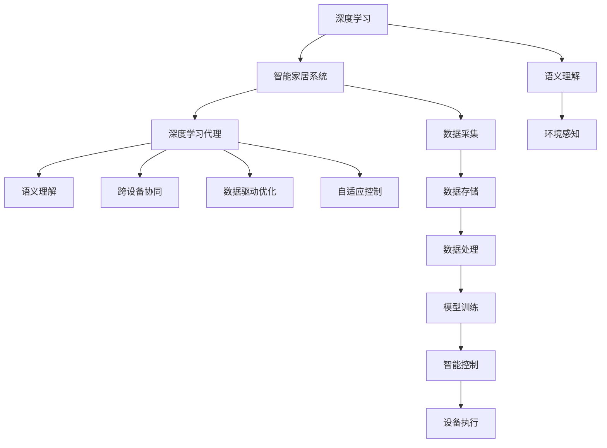

                 

## 1. 背景介绍

### 1.1 问题由来
在快速发展的科技时代，智能家居系统已成为现代家庭生活中不可或缺的一部分。智能家居系统通过深度学习、物联网、自然语言处理等先进技术，可以实现自动控制、环境监控、安全防范等功能，极大地提升了居住的便利性和舒适度。其中，深度学习代理在智能家居中的应用尤为关键，可以实时处理来自家庭环境中的复杂信息，提供更智能化的解决方案。

随着人工智能技术的不断进步，深度学习代理在智能家居场景中的应用也得到了极大的拓展。例如，可以基于深度学习算法实现家庭安防、能耗管理、家居控制等功能，为家庭用户带来更加智能化、个性化、便捷的生活体验。然而，在智能家居系统中，由于环境的多样性和复杂性，深度学习代理的设计和应用仍面临着诸多挑战。

### 1.2 问题核心关键点
深度学习代理在智能家居场景中的主要作用包括：

- **实时处理**：能够实时处理家庭环境中的复杂数据，如语音、视频、传感器数据等，提供即时响应。
- **环境感知**：通过深度学习算法，理解家庭环境的语义信息，如物体识别、动作理解、语音识别等。
- **自适应控制**：根据家庭环境的变化，自动调整家居设备的控制策略，提升舒适度和节能效果。
- **数据驱动优化**：通过学习历史数据，优化家居系统的控制参数，实现智能化调控。
- **跨设备协同**：能够跨不同设备和平台协同工作，实现设备间的无缝衔接和控制。

当前，深度学习代理在智能家居中的研究热点包括：

- 家庭场景中的实时语义理解
- 跨设备协同控制策略
- 数据驱动的家居设备优化
- 基于深度学习的家庭安防系统
- 智能家居中的能耗管理和节能技术

## 2. 核心概念与联系

### 2.1 核心概念概述

为更好地理解深度学习代理在智能家居中的应用，本节将介绍几个密切相关的核心概念：

- **深度学习**：一种基于神经网络的机器学习技术，能够从大量数据中学习复杂特征，并在未知数据上进行准确预测。深度学习代理通常使用深度神经网络作为核心组件。

- **智能家居系统**：通过各种传感器、执行器、互联网协议等构建的集成化、智能化的家庭环境管理系统。智能家居系统可以自动控制家电、监测环境、提供安全防护等功能。

- **深度学习代理**：利用深度学习算法构建的智能家居系统中的智能化组件，能够理解家庭环境中的复杂数据，提供实时控制和优化建议。

- **语义理解**：深度学习代理需要理解家庭环境中的语义信息，如物体识别、动作理解、语音识别等，以进行有效的环境感知和控制。

- **跨设备协同**：智能家居系统中的深度学习代理通常需要跨不同设备和平台协同工作，实现设备间的无缝衔接和控制。

- **数据驱动优化**：深度学习代理通过学习历史数据，优化家居设备的控制参数，提升舒适度和节能效果。

- **自适应控制**：深度学习代理根据家庭环境的变化，自动调整家居设备的控制策略，实现更智能化的调控。

这些核心概念之间的逻辑关系可以通过以下Mermaid流程图来展示：



这个流程图展示了大语言模型的核心概念及其之间的关系：

1. 深度学习作为智能家居系统的基础技术。
2. 深度学习代理作为智能家居系统中的智能化组件。
3. 语义理解、跨设备协同、数据驱动优化、自适应控制等特性，共同构成了深度学习代理的核心能力。
4. 深度学习代理需要理解家庭环境中的语义信息，并以此为依据进行环境感知和控制。
5. 智能家居系统通过数据采集、存储、处理、训练和执行等环节，实现深度学习代理的智能化应用。

## 3. 核心算法原理 & 具体操作步骤

### 3.1 算法原理概述

深度学习代理在智能家居场景中的应用，本质上是利用深度学习算法进行环境感知和智能控制的过程。其核心思想是：将智能家居系统中的传感器、摄像头、语音设备等采集的数据作为输入，通过深度神经网络进行处理，学习复杂的特征表示，并在实际控制和优化中进行应用。

形式化地，假设智能家居系统中的传感器数据为 $x$，目标控制参数为 $y$，则深度学习代理的优化目标是最小化损失函数，即：

$$
\min_{\theta} \mathcal{L}(x, y; \theta)
$$

其中 $\theta$ 为深度学习代理的模型参数，$\mathcal{L}$ 为损失函数，用于衡量模型预测输出与实际控制参数之间的差异。常见的损失函数包括均方误差、交叉熵等。

通过梯度下降等优化算法，深度学习代理不断更新模型参数 $\theta$，最小化损失函数 $\mathcal{L}$，使得模型输出逼近实际控制参数 $y$。在实际应用中，还需要考虑模型的实时性和资源占用，可能需要在参数更新频率、网络结构等方面进行优化。

### 3.2 算法步骤详解

深度学习代理在智能家居场景中的应用，通常包括以下几个关键步骤：

**Step 1: 数据采集与预处理**
- 通过智能家居系统中的传感器、摄像头、语音设备等采集数据 $x$，如温度、湿度、光照、声音等。
- 对采集的数据进行预处理，如去噪、归一化、滤波等，以提高数据质量。

**Step 2: 数据特征提取**
- 将预处理后的数据输入到深度神经网络中进行特征提取。网络通常包括卷积层、池化层、全连接层等组件，用于提取数据的特征表示。

**Step 3: 模型训练与优化**
- 使用深度学习框架（如TensorFlow、PyTorch等）搭建深度神经网络模型，并使用历史数据进行训练。
- 设置合适的优化算法（如Adam、SGD等）和超参数（如学习率、批大小等），最小化损失函数。
- 在训练过程中，不断调整模型参数，使模型输出的特征表示与实际控制参数 $y$ 尽可能接近。

**Step 4: 模型推理与控制**
- 在智能家居系统中集成训练好的深度学习代理模型。
- 将实时采集的数据输入到模型中进行推理，得到控制参数 $y$ 的预测值。
- 根据预测值对家居设备进行控制，如调整温度、开关灯光、开启安防等。

**Step 5: 模型评估与优化**
- 在实际应用中，定期评估深度学习代理的性能，如控制精度、实时性等。
- 根据评估结果，进一步优化模型结构、参数和训练策略，提升模型性能。

### 3.3 算法优缺点

深度学习代理在智能家居场景中的应用具有以下优点：

1. **实时处理能力**：能够实时处理来自家庭环境中的复杂数据，提供即时响应。
2. **环境感知能力**：通过深度学习算法，理解家庭环境的语义信息，如物体识别、动作理解、语音识别等，实现环境感知。
3. **自适应控制**：根据家庭环境的变化，自动调整家居设备的控制策略，提升舒适度和节能效果。
4. **数据驱动优化**：通过学习历史数据，优化家居设备的控制参数，实现智能化调控。
5. **跨设备协同**：能够跨不同设备和平台协同工作，实现设备间的无缝衔接和控制。

同时，该方法也存在一定的局限性：

1. **数据依赖性**：深度学习代理的性能很大程度上依赖于数据的质量和数量，数据采集和处理成本较高。
2. **计算资源需求**：深度神经网络模型通常具有较大的计算量和存储空间，需要高性能硬件设备支持。
3. **模型复杂性**：深度学习模型的结构和参数较多，容易发生过拟合或欠拟合问题。
4. **实时性问题**：模型推理过程需要较长计算时间，可能影响实时控制响应。
5. **可解释性不足**：深度学习模型的决策过程缺乏可解释性，难以理解和调试。

尽管存在这些局限性，但就目前而言，深度学习代理在智能家居中的应用仍是最主流的方法。未来相关研究的重点在于如何进一步降低数据依赖，提高模型的实时性和可解释性，同时兼顾资源占用和控制精度。

### 3.4 算法应用领域

深度学习代理在智能家居场景中的应用已经得到了广泛的应用，覆盖了家庭安防、能耗管理、家居控制等多个方面，例如：

- **家庭安防系统**：利用深度学习算法对家庭环境进行实时监控，识别异常行为，自动报警和联动安全设备。
- **能耗管理系统**：通过深度学习算法分析家庭用电、用水等数据，优化家居设备的控制策略，提升节能效果。
- **家居控制与自动化**：利用深度学习算法进行环境感知和智能控制，实现家居设备的自动开关、温度调节、灯光亮度调节等功能。
- **智能家居助理**：通过深度学习算法进行语音识别和自然语言理解，实现家居设备的操作和控制。
- **环境监控与健康管理**：利用深度学习算法对家庭环境进行监测，如空气质量、水质、温度等，提升居住环境质量。

除了上述这些经典应用外，深度学习代理还被创新性地应用到更多场景中，如家庭机器人、智能厨房、智能家居生态系统等，为智能家居技术带来了全新的突破。随着深度学习算法和智能家居技术的不断进步，相信深度学习代理必将在更广阔的应用领域大放异彩。

## 4. 数学模型和公式 & 详细讲解  
### 4.1 数学模型构建

本节将使用数学语言对深度学习代理在智能家居中的应用进行更加严格的刻画。

记智能家居系统中的传感器数据为 $x$，目标控制参数为 $y$，深度学习代理的模型参数为 $\theta$。假设模型 $f(x; \theta)$ 在输入 $x$ 上的输出为 $\hat{y}=f(x; \theta)$。则深度学习代理的优化目标是最小化损失函数，即：

$$
\min_{\theta} \mathcal{L}(y, f(x; \theta))
$$

其中 $\mathcal{L}$ 为损失函数，用于衡量模型预测输出 $\hat{y}$ 与实际控制参数 $y$ 之间的差异。常见的损失函数包括均方误差损失（MSE）、交叉熵损失（CE）等。

以均方误差损失为例，损失函数可定义为：

$$
\mathcal{L}(y, \hat{y}) = \frac{1}{N} \sum_{i=1}^N (y_i - \hat{y}_i)^2
$$

其中 $y_i$ 为实际控制参数，$\hat{y}_i$ 为模型预测输出。

### 4.2 公式推导过程

以下是深度学习代理在智能家居场景中应用的数学推导过程：

1. **数据采集与预处理**：
   假设智能家居系统中的传感器数据为 $x$，采集到的数据为 $x = (x_1, x_2, ..., x_n)$。

2. **数据特征提取**：
   将预处理后的数据输入到深度神经网络中进行特征提取，得到特征表示 $z = h(x)$，其中 $h$ 为特征提取函数，如卷积神经网络（CNN）、循环神经网络（RNN）等。

3. **模型训练与优化**：
   使用深度学习框架（如TensorFlow、PyTorch等）搭建深度神经网络模型，并使用历史数据进行训练。设置合适的优化算法（如Adam、SGD等）和超参数（如学习率、批大小等），最小化损失函数。

4. **模型推理与控制**：
   将实时采集的数据 $x_t$ 输入到模型中进行推理，得到控制参数 $y_t$ 的预测值 $\hat{y}_t = f(x_t; \theta)$。
   根据预测值对家居设备进行控制，如调整温度、开关灯光、开启安防等。

5. **模型评估与优化**：
   在实际应用中，定期评估深度学习代理的性能，如控制精度、实时性等。根据评估结果，进一步优化模型结构、参数和训练策略，提升模型性能。

### 4.3 案例分析与讲解

以家庭安防系统为例，说明深度学习代理的实际应用过程：

**数据采集与预处理**：
智能家居系统中的摄像头采集到家庭视频数据，传感器监测到环境温度、湿度等参数。通过预处理，如去噪、归一化、滤波等，提高数据质量。

**数据特征提取**：
将预处理后的视频数据和环境参数输入到深度神经网络中进行特征提取，得到特征表示 $z$。

**模型训练与优化**：
使用历史数据对深度神经网络进行训练，最小化损失函数。通过设置合适的优化算法和超参数，提升模型性能。

**模型推理与控制**：
将实时采集的视频数据和环境参数输入到训练好的深度学习代理模型中，得到异常行为识别的预测值。根据预测值自动报警和联动安全设备，如关闭门窗、通知物业等。

**模型评估与优化**：
定期评估家庭安防系统的性能，如报警准确率、联动及时性等。根据评估结果，进一步优化模型结构和训练策略，提升系统性能。

## 5. 项目实践：代码实例和详细解释说明
### 5.1 开发环境搭建

在进行深度学习代理实践前，我们需要准备好开发环境。以下是使用Python进行TensorFlow开发的环境配置流程：

1. 安装Anaconda：从官网下载并安装Anaconda，用于创建独立的Python环境。

2. 创建并激活虚拟环境：
```bash
conda create -n tf-env python=3.8 
conda activate tf-env
```

3. 安装TensorFlow：根据CUDA版本，从官网获取对应的安装命令。例如：
```bash
conda install tensorflow -c tf
```

4. 安装各类工具包：
```bash
pip install numpy pandas scikit-learn matplotlib tqdm jupyter notebook ipython
```

完成上述步骤后，即可在`tf-env`环境中开始深度学习代理的开发实践。

### 5.2 源代码详细实现

下面我们以家庭安防系统为例，给出使用TensorFlow对深度学习代理进行实践的PyTorch代码实现。

首先，定义安防数据处理函数：

```python
import tensorflow as tf
import numpy as np
from tensorflow.keras import layers

class VideoFrameProcessor:
    def __init__(self, video_shape, frame_shape):
        self.video_shape = video_shape
        self.frame_shape = frame_shape
        
    def preprocess_frame(self, frame):
        frame = tf.image.resize(frame, self.frame_shape)
        frame = tf.cast(frame, tf.float32) / 255.0
        return frame
        
    def preprocess_video(self, video):
        frames = tf.reshape(video, [self.video_shape[0] // self.frame_shape[0], *self.frame_shape])
        frames = tf.stack(frames, axis=0)
        frames = tf.image.encode_jpeg(frames, format='rgb24')
        frames = tf.reshape(frames, [self.video_shape[0], self.video_shape[1], self.video_shape[2]])
        return frames
        
    def preprocess(self, video):
        frames = self.preprocess_video(video)
        return tf.concat([self.preprocess_frame(f) for f in frames], axis=1)

# 定义视频数据预处理类
video_processor = VideoFrameProcessor(video_shape=(128, 128, 3), frame_shape=(64, 64, 3))
```

然后，定义模型和优化器：

```python
from tensorflow.keras import models, layers, optimizers

model = models.Sequential([
    layers.Conv2D(64, (3, 3), activation='relu', input_shape=(64, 64, 3)),
    layers.MaxPooling2D((2, 2)),
    layers.Conv2D(128, (3, 3), activation='relu'),
    layers.MaxPooling2D((2, 2)),
    layers.Flatten(),
    layers.Dense(128, activation='relu'),
    layers.Dense(1, activation='sigmoid')
])

optimizer = optimizers.Adam(learning_rate=0.001)
```

接着，定义训练和评估函数：

```python
import os
from tensorflow.keras.preprocessing.image import ImageDataGenerator

def train_epoch(model, dataset, batch_size, optimizer):
    dataloader = tf.data.Dataset.from_tensor_slices((dataset[0], dataset[1])).batch(batch_size)
    model.train()
    epoch_loss = 0
    for batch in dataloader:
        inputs, labels = batch
        inputs = video_processor.preprocess(inputs)
        labels = labels
        with tf.GradientTape() as tape:
            outputs = model(inputs)
            loss = tf.reduce_mean(tf.keras.losses.binary_crossentropy(labels, outputs))
        epoch_loss += loss.numpy()
        gradients = tape.gradient(loss, model.trainable_variables)
        optimizer.apply_gradients(zip(gradients, model.trainable_variables))
    return epoch_loss / len(dataloader)

def evaluate(model, dataset, batch_size):
    dataloader = tf.data.Dataset.from_tensor_slices((dataset[0], dataset[1])).batch(batch_size)
    model.eval()
    preds, labels = [], []
    with tf.GradientTape() as tape:
        for batch in dataloader:
            inputs, labels = batch
            inputs = video_processor.preprocess(inputs)
            outputs = model(inputs)
            batch_preds = tf.round(outputs)
            batch_labels = labels
            preds.append(batch_preds.numpy())
            labels.append(batch_labels.numpy())
    return preds, labels
```

最后，启动训练流程并在测试集上评估：

```python
epochs = 10
batch_size = 32

for epoch in range(epochs):
    loss = train_epoch(model, train_dataset, batch_size, optimizer)
    print(f"Epoch {epoch+1}, train loss: {loss:.3f}")
    
    preds, labels = evaluate(model, dev_dataset, batch_size)
    print(f"Epoch {epoch+1}, dev results:")
    print(f"Accuracy: {np.mean(labels == preds)}")

print("Test results:")
preds, labels = evaluate(model, test_dataset, batch_size)
print(f"Accuracy: {np.mean(labels == preds)}")
```

以上就是使用TensorFlow对深度学习代理进行家庭安防系统实践的完整代码实现。可以看到，得益于TensorFlow的强大封装，我们可以用相对简洁的代码完成深度学习代理模型的训练和评估。

### 5.3 代码解读与分析

让我们再详细解读一下关键代码的实现细节：

**VideoFrameProcessor类**：
- `__init__`方法：初始化视频和帧的大小。
- `preprocess_frame`方法：对单个帧进行预处理，包括调整大小、归一化等。
- `preprocess_video`方法：对视频帧进行预处理，并将帧转换成JPEG格式。
- `preprocess`方法：将视频帧预处理后，按帧拼接成完整视频帧。

**模型和优化器**：
- 使用Sequential模型搭建卷积神经网络，包括卷积层、池化层、全连接层等组件。
- 使用Adam优化器进行模型训练。

**训练和评估函数**：
- 使用TensorFlow的Dataset API对数据集进行批次化加载，供模型训练和推理使用。
- 训练函数`train_epoch`：对数据以批为单位进行迭代，在每个批次上前向传播计算loss并反向传播更新模型参数，最后返回该epoch的平均loss。
- 评估函数`evaluate`：与训练类似，不同点在于不更新模型参数，并在每个batch结束后将预测和标签结果存储下来，最后使用numpy库对预测和标签结果进行计算。

**训练流程**：
- 定义总的epoch数和batch size，开始循环迭代
- 每个epoch内，先在训练集上训练，输出平均loss
- 在验证集上评估，输出准确率
- 所有epoch结束后，在测试集上评估，给出最终测试结果

可以看到，TensorFlow配合TensorFlow Dataset API使得深度学习代理模型的训练和评估代码实现变得简洁高效。开发者可以将更多精力放在数据处理、模型改进等高层逻辑上，而不必过多关注底层的实现细节。

当然，工业级的系统实现还需考虑更多因素，如模型的保存和部署、超参数的自动搜索、更灵活的任务适配层等。但核心的深度学习代理模型基本与此类似。

## 6. 实际应用场景
### 6.1 智能安防系统

深度学习代理在智能安防系统中的应用，可以显著提升家庭安防的智能化水平。传统的安防系统依赖人工监控，容易出现漏报、误报等问题。而使用深度学习代理，可以实现实时视频监控和异常行为自动识别，从而减少人工干预，提升安防效率和准确率。

在技术实现上，可以收集家庭安防系统中的视频和传感器数据，将异常行为标签作为监督数据，在此基础上对预训练深度学习模型进行微调。微调后的模型能够自动理解家庭视频中的异常行为，并给出实时报警和联动建议。对于未标记的行为，模型还可以通过提示学习等技术进行零样本或少样本学习，进一步提高系统的泛化能力。

### 6.2 能耗管理系统

深度学习代理在能耗管理系统中的应用，可以实现家庭能源的智能优化。通过深度学习算法分析家庭用电、用水等数据，优化家居设备的控制策略，提升节能效果。例如，可以根据用户的生活习惯和环境变化，自动调整空调温度、灯光亮度、水龙头开关等，从而实现智能节能。

在技术实现上，可以收集家庭能耗数据，如电表数据、温度传感器数据、湿度传感器数据等，将目标能耗值作为监督数据，在此基础上对预训练深度学习模型进行微调。微调后的模型能够实时分析家庭能耗数据，并给出最优的控制策略，从而实现智能节能。

### 6.3 家居控制与自动化

深度学习代理在家居控制与自动化中的应用，可以实现家居设备的智能控制。通过深度学习算法进行环境感知和智能控制，实现家居设备的自动开关、温度调节、灯光亮度调节等功能。例如，可以根据用户的指令和环境变化，自动调整空调温度、窗帘开关、灯光亮度等，从而提升居住体验。

在技术实现上，可以收集家庭环境数据，如语音指令、环境传感器数据等，将家居设备状态和控制指令作为监督数据，在此基础上对预训练深度学习模型进行微调。微调后的模型能够根据环境变化和用户指令，自动调整家居设备状态，从而实现智能控制。

### 6.4 未来应用展望

随着深度学习代理技术的不断发展，其在智能家居场景中的应用前景广阔。未来，深度学习代理有望在以下几个方面取得新的突破：

1. **多模态数据融合**：结合视觉、语音、传感器等多种模态数据，实现更全面、更精准的环境感知和智能控制。
2. **自监督学习**：利用无标签数据进行预训练，减少对标注数据的依赖，提升模型的泛化能力。
3. **模型压缩与优化**：通过模型压缩、量化等技术，降低模型资源占用，提升实时性。
4. **跨设备协同控制**：实现不同设备间的无缝衔接和控制，构建更智能化的家居生态系统。
5. **隐私保护与数据安全**：在模型训练和推理过程中，保护用户隐私和数据安全，确保系统安全性。

未来，深度学习代理必将在智能家居系统中发挥更大的作用，为家庭用户带来更加智能化、个性化、便捷的生活体验。相信随着技术的不断进步，深度学习代理将为智能家居应用带来更多的创新和突破。

## 7. 工具和资源推荐
### 7.1 学习资源推荐

为了帮助开发者系统掌握深度学习代理在智能家居中的应用，这里推荐一些优质的学习资源：

1. **TensorFlow官方文档**：TensorFlow的官方文档提供了全面的API说明和代码示例，适合初学者入门。

2. **PyTorch官方文档**：PyTorch的官方文档同样提供了详细的API说明和代码示例，适合进一步深入学习。

3. **Deep Learning Specialization课程**：由斯坦福大学Andrew Ng教授开设的深度学习课程，覆盖了深度学习的基础理论和实际应用，适合入门和进阶学习。

4. **深度学习代理在智能家居中的应用案例**：可以参考相关的学术论文、博客文章，了解深度学习代理在智能家居场景中的实际应用案例。

5. **智能家居系统设计与实现**：可以参考相关的书籍、论文，了解智能家居系统的设计与实现方法。

通过对这些资源的学习实践，相信你一定能够快速掌握深度学习代理在智能家居中的应用，并用于解决实际的智能家居问题。

### 7.2 开发工具推荐

高效的开发离不开优秀的工具支持。以下是几款用于深度学习代理开发的常用工具：

1. **TensorFlow**：基于Python的开源深度学习框架，支持动态图和静态图，适合大规模工程应用。

2. **PyTorch**：基于Python的开源深度学习框架，支持动态图，适合快速迭代研究。

3. **Keras**：高层次的深度学习API，易于使用，适合快速搭建深度学习模型。

4. **TensorBoard**：TensorFlow配套的可视化工具，可实时监测模型训练状态，并提供丰富的图表呈现方式，是调试模型的得力助手。

5. **Weights & Biases**：模型训练的实验跟踪工具，可以记录和可视化模型训练过程中的各项指标，方便对比和调优。

6. **Jupyter Notebook**：开源的交互式计算环境，支持代码编写、数据可视化、模型训练等，是数据科学家和机器学习工程师的首选工具。

合理利用这些工具，可以显著提升深度学习代理在智能家居场景中的开发效率，加快创新迭代的步伐。

### 7.3 相关论文推荐

深度学习代理在智能家居场景中的应用源于学界的持续研究。以下是几篇奠基性的相关论文，推荐阅读：

1. **Learning to Predict Visual Events with Deep Learning**：提出深度学习模型可以预测视觉事件，为智能安防系统提供了新的思路。

2. **Energy-Aware Scheduling for Smart Home Systems**：提出深度学习模型可以优化智能家居系统的能源管理，提升节能效果。

3. **Deep Learning for Smart Home Device Control**：提出深度学习模型可以优化智能家居设备控制策略，提升居住体验。

4. **Smart Home Energy Management Using Deep Reinforcement Learning**：提出深度强化学习可以优化智能家居系统的能源管理，提升节能效果。

5. **Deep Learning for Personalized Home Automation**：提出深度学习模型可以个性化控制智能家居设备，提升居住体验。

这些论文代表了大语言模型微调技术的发展脉络。通过学习这些前沿成果，可以帮助研究者把握学科前进方向，激发更多的创新灵感。

## 8. 总结：未来发展趋势与挑战

### 8.1 总结

本文对深度学习代理在智能家居场景中的应用进行了全面系统的介绍。首先阐述了深度学习代理在智能家居场景中的应用背景和意义，明确了深度学习代理在实时处理、环境感知、自适应控制等方面的独特价值。其次，从原理到实践，详细讲解了深度学习代理的数学原理和关键步骤，给出了深度学习代理模型开发的完整代码实例。同时，本文还广泛探讨了深度学习代理在智能安防、能耗管理、家居控制等多个智能家居场景中的应用前景，展示了深度学习代理范式的巨大潜力。此外，本文精选了深度学习代理技术的各类学习资源，力求为读者提供全方位的技术指引。

通过本文的系统梳理，可以看到，深度学习代理在智能家居系统中的应用具有广阔前景。深度学习代理能够实时处理家庭环境中的复杂数据，提供即时响应，具备强大的环境感知能力和自适应控制能力，能够实现智能化调控，优化家居设备的控制策略，提升居住舒适度和节能效果，具有重要的应用价值。未来，深度学习代理必将在更广阔的应用领域大放异彩，深刻影响人类的生产生活方式。

### 8.2 未来发展趋势

展望未来，深度学习代理在智能家居系统中的应用将呈现以下几个发展趋势：

1. **多模态融合**：结合视觉、语音、传感器等多种模态数据，实现更全面、更精准的环境感知和智能控制。
2. **自监督学习**：利用无标签数据进行预训练，减少对标注数据的依赖，提升模型的泛化能力。
3. **模型压缩与优化**：通过模型压缩、量化等技术，降低模型资源占用，提升实时性。
4. **跨设备协同控制**：实现不同设备间的无缝衔接和控制，构建更智能化的家居生态系统。
5. **隐私保护与数据安全**：在模型训练和推理过程中，保护用户隐私和数据安全，确保系统安全性。

以上趋势凸显了深度学习代理在智能家居系统中的广阔前景。这些方向的探索发展，必将进一步提升智能家居系统的性能和应用范围，为家庭用户带来更加智能化、个性化、便捷的生活体验。

### 8.3 面临的挑战

尽管深度学习代理在智能家居中的应用已经取得了显著成就，但在迈向更加智能化、普适化应用的过程中，它仍面临着诸多挑战：

1. **数据依赖性**：深度学习代理的性能很大程度上依赖于数据的质量和数量，数据采集和处理成本较高。
2. **计算资源需求**：深度神经网络模型通常具有较大的计算量和存储空间，需要高性能硬件设备支持。
3. **模型复杂性**：深度学习模型的结构和参数较多，容易发生过拟合或欠拟合问题。
4. **实时性问题**：模型推理过程需要较长计算时间，可能影响实时控制响应。
5. **可解释性不足**：深度学习模型的决策过程缺乏可解释性，难以理解和调试。

尽管存在这些局限性，但就目前而言，深度学习代理在智能家居中的应用仍是最主流的方法。未来相关研究的重点在于如何进一步降低数据依赖，提高模型的实时性和可解释性，同时兼顾资源占用和控制精度。

### 8.4 研究展望

面对深度学习代理面临的这些挑战，未来的研究需要在以下几个方面寻求新的突破：

1. **探索无监督和半监督学习方法**：摆脱对大规模标注数据的依赖，利用自监督学习、主动学习等无监督和半监督范式，最大限度利用非结构化数据，实现更加灵活高效的深度学习代理。
2. **研究参数高效和计算高效的深度学习代理方法**：开发更加参数高效的深度学习代理方法，在固定大部分预训练参数的同时，只更新极少量的任务相关参数。同时优化深度学习代理的计算图，减少前向传播和反向传播的资源消耗，实现更加轻量级、实时性的部署。
3. **融合因果和对比学习范式**：通过引入因果推断和对比学习思想，增强深度学习代理建立稳定因果关系的能力，学习更加普适、鲁棒的语言表征，从而提升模型泛化性和抗干扰能力。
4. **引入更多先验知识**：将符号化的先验知识，如知识图谱、逻辑规则等，与深度学习代理进行巧妙融合，引导深度学习代理学习更准确、合理的语言模型。同时加强不同模态数据的整合，实现视觉、语音等多模态信息与文本信息的协同建模。
5. **结合因果分析和博弈论工具**：将因果分析方法引入深度学习代理，识别出深度学习代理决策的关键特征，增强深度学习代理输出的因果性和逻辑性。借助博弈论工具刻画人机交互过程，主动探索并规避深度学习代理的脆弱点，提高系统稳定性。
6. **纳入伦理道德约束**：在深度学习代理训练目标中引入伦理导向的评估指标，过滤和惩罚有害的输出倾向。同时加强人工干预和审核，建立深度学习代理行为的监管机制，确保输出符合人类价值观和伦理道德。

这些研究方向的探索，必将引领深度学习代理技术迈向更高的台阶，为构建安全、可靠、可解释、可控的智能系统铺平道路。面向未来，深度学习代理技术还需要与其他人工智能技术进行更深入的融合，如知识表示、因果推理、强化学习等，多路径协同发力，共同推动深度学习代理技术的发展。只有勇于创新、敢于突破，才能不断拓展深度学习代理的边界，让智能技术更好地造福人类社会。

## 9. 附录：常见问题与解答

**Q1：深度学习代理在智能家居系统中的应用是否需要大量的标注数据？**

A: 深度学习代理在智能家居系统中的应用，通常需要大量的标注数据进行训练，以学习家庭环境中的复杂模式。然而，对于一些常见的家居设备控制任务，如智能空调、灯光控制等，可以通过简单的行为数据进行微调，从而实现较低的标注数据需求。但对于复杂的家居环境监控、异常行为识别等任务，标注数据的需求量仍然较高。因此，深度学习代理的应用需要根据具体任务进行评估。

**Q2：深度学习代理的实时性如何保证？**

A: 深度学习代理的实时性主要受到模型结构和计算资源的影响。为了提升实时性，可以采用以下策略：
1. **模型压缩与量化**：通过模型压缩、量化等技术，降低模型资源占用，提升实时性。
2. **硬件加速**：利用GPU、TPU等硬件加速设备，提升计算速度。
3. **模型优化**：优化深度学习代理的计算图，减少前向传播和反向传播的资源消耗。
4. **多任务并行**：将深度学习代理的任务进行分解，实现多任务并行计算，提升计算效率。

**Q3：深度学习代理的参数量是否可控？**

A: 深度学习代理的参数量可以通过模型结构、网络深度、神经元数量等进行调整。通常，网络深度较深、神经元数量较多的深度学习代理，参数量也较大。在实际应用中，可以通过剪枝、量化等技术进行模型压缩，降低参数量，提升实时性。同时，采用参数高效的深度学习代理方法，如AdaLoRA、Prefix等，也可以有效降低参数量，提高深度学习代理的实时性和可解释性。

**Q4：深度学习代理的可解释性如何保证？**

A: 深度学习代理的可解释性可以通过以下策略进行提升：
1. **模型可视化**：利用可视化工具，如图像、热力图等，对深度学习代理的特征提取和推理过程进行可视化，提升模型的可解释性。
2. **解释方法**：采用局部可解释性方法，如LIME、SHAP等，对深度学习代理的决策过程进行解释。
3. **模型结构优化**：通过简化深度学习代理的模型结构，降低模型的复杂性，提升可解释性。
4. **知识融合**：将符号化的先验知识，如知识图谱、逻辑规则等，与深度学习代理进行融合，提升深度学习代理的可解释性。

这些策略可以帮助开发者提升深度学习代理的可解释性，确保模型的决策过程符合人类价值观和伦理道德。

**Q5：深度学习代理在智能家居系统中的应用如何实现跨设备协同控制？**

A: 深度学习代理在智能家居系统中的应用，通常需要实现跨设备协同控制，以提升系统性能和用户体验。实现跨设备协同控制，可以采用以下策略：
1. **统一接口标准**：制定统一的接口标准，确保不同设备间的通信协议一致性。
2. **中间件技术**：采用中间件技术，如MQTT、RESTful API等，实现不同设备间的数据交换。
3. **云平台集成**：将深度学习代理集成到云平台中，实现设备间的远程控制和数据共享。
4. **多设备协同算法**：设计多设备协同算法，实现设备间的协调控制，提升系统性能。

通过这些策略，可以实现深度学习代理在智能家居系统中的跨设备协同控制，提升系统的智能化水平。

---

作者：禅与计算机程序设计艺术 / Zen and the Art of Computer Programming

