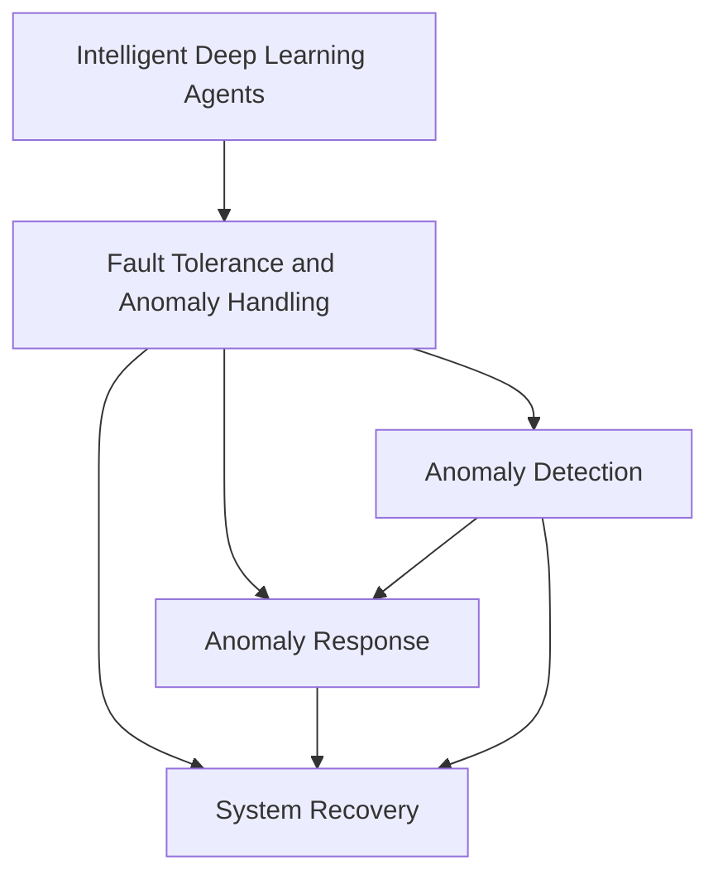

                 

# AI人工智能深度学习算法：智能深度学习代理的异常处理与容错

> 关键词：深度学习, 人工智能, 异常处理, 容错, 智能代理, 强化学习, 强化学习环境, 智能机器人, 自适应系统

## 1. 背景介绍

### 1.1 问题由来
在现代社会中，人工智能（AI）技术已经广泛渗透到各个领域，如医疗、教育、金融、制造等。随着深度学习算法的不断发展，智能代理（Intelligent Agents）在自动驾驶、智能推荐系统、智能制造等领域的应用越来越广泛。这些智能代理系统通常需要在大规模、复杂环境中执行任务，并不断地与外界进行交互。然而，系统在执行任务过程中，难免会遇到各种异常情况，如传感器故障、环境干扰、网络延迟等，这些异常情况会影响系统的稳定性和可靠性，甚至导致系统崩溃。

因此，异常处理与容错机制在智能代理系统中显得尤为重要。本文将深入探讨智能深度学习代理的异常处理与容错机制，从原理、方法到具体实现，全面介绍其在实际应用中的解决方案。

### 1.2 问题核心关键点
本文的核心关键点包括：
1. 异常处理与容错机制的原理
2. 强化学习环境中的异常处理
3. 深度学习代理的自适应能力
4. 异常检测与响应算法
5. 系统设计原则与实现策略

这些关键点将贯穿整个文章的各个章节，帮助读者全面理解智能代理的异常处理与容错机制。

## 2. 核心概念与联系

### 2.1 核心概念概述

智能深度学习代理（Intelligent Deep Learning Agents）指的是使用深度学习技术构建的、能够在复杂环境中执行任务的智能系统。这类代理通常具有以下几个特点：
1. 自主决策：代理能够自主地分析环境信息，做出决策。
2. 持续学习：代理能够通过学习不断优化其行为。
3. 环境交互：代理与外界进行交互，实现特定的任务目标。

异常处理与容错机制（Fault Tolerance and Anomaly Handling）则是指在代理系统中，当遇到异常情况时，系统能够自动检测并采取相应的措施，以确保系统的正常运行和任务目标的完成。这些机制主要包括以下几个方面：
1. 异常检测：及时发现环境中的异常情况。
2. 异常响应：根据异常情况采取相应的处理措施。
3. 系统恢复：在系统出现故障时，快速恢复系统的正常运行。

这些核心概念的联系可以通过以下Mermaid流程图来展示：



这个流程图展示了大语言模型的核心概念及其之间的逻辑关系：

1. 智能代理通过深度学习技术进行自主决策和持续学习。
2. 异常处理机制通过异常检测、响应和系统恢复，保证代理的稳定运行。
3. 异常检测和响应主要依赖于代理的学习能力，而系统恢复则需要在设计时考虑冗余和容错策略。

这些核心概念共同构成了智能代理的异常处理与容错框架，使其能够在各种复杂环境中实现任务的自动化和智能化。

## 3. 核心算法原理 & 具体操作步骤
### 3.1 算法原理概述

智能深度学习代理的异常处理与容错机制，本质上是基于强化学习（Reinforcement Learning, RL）的。强化学习是一种通过试错来学习最优决策策略的方法，代理在环境中与外界进行交互，通过不断的试错和学习，优化其行为策略。

在强化学习环境中，代理通常使用Q-learning算法进行学习和决策。Q-learning算法的核心思想是通过奖赏（Reward）来优化行为策略，具体步骤如下：
1. 代理在每个时间步（Time Step）选择一个动作（Action）。
2. 环境根据代理的动作给出反馈（Observation）和奖赏（Reward）。
3. 代理根据当前状态（State）和动作，更新其Q值表。
4. 重复执行上述过程，直至收敛。

异常处理与容错机制则是在上述框架的基础上，增加了异常检测和响应步骤。当代理在执行任务时，如果发现环境中的异常情况，则会采取相应的异常响应措施，如停止当前动作、恢复至上一状态、重新选择动作等，以确保代理的正常运行和任务目标的完成。

### 3.2 算法步骤详解

基于强化学习的异常处理与容错机制，通常包括以下几个关键步骤：

**Step 1: 设计强化学习环境**

在设计强化学习环境时，需要考虑以下几个方面：
1. 环境建模：对代理运行的环境进行建模，包括状态、动作、奖赏等。
2. 状态观测：设计代理如何观测环境状态。
3. 动作选择：确定代理在每个时间步可以采取的动作。

**Step 2: 训练代理模型**

在强化学习环境中训练代理模型，通常需要考虑以下几个因素：
1. 学习算法：选择合适的Q-learning算法或其他强化学习算法。
2. 学习策略：设计学习策略，如ε-greedy、softmax等。
3. 学习参数：确定学习率、折扣因子等参数。

**Step 3: 异常检测与响应**

在代理执行任务时，需要对环境中的异常情况进行检测和响应，通常需要考虑以下几个方面：
1. 异常定义：定义哪些情况属于异常。
2. 异常检测：设计异常检测算法，如统计异常检测、规则异常检测等。
3. 异常响应：设计异常响应策略，如停止当前动作、恢复至上一状态、重新选择动作等。

**Step 4: 系统恢复与容错**

在系统出现故障时，需要考虑如何恢复系统的正常运行和容错策略，通常需要考虑以下几个方面：
1. 故障检测：设计故障检测算法，如状态监测、异常检测等。
2. 恢复策略：设计恢复策略，如备份恢复、冗余系统、容错设计等。
3. 容错机制：设计容错机制，如冗余系统、容错设计等。

**Step 5: 持续学习和适应**

代理在执行任务时，需要不断学习和适应新的环境变化，通常需要考虑以下几个方面：
1. 学习机制：设计学习机制，如Q-learning、蒙特卡洛树搜索等。
2. 适应性：设计适应性算法，如自适应学习率、自适应动作选择等。

### 3.3 算法优缺点

基于强化学习的异常处理与容错机制，具有以下优点：
1. 自适应性：代理能够根据环境变化进行自适应学习，优化行为策略。
2. 鲁棒性：代理能够在异常情况下，快速响应和恢复，保证系统的稳定性。
3. 灵活性：代理能够处理复杂、多样化的任务，适应不同的应用场景。

然而，该方法也存在以下缺点：
1. 学习效率低：代理需要大量时间进行试错和学习，收敛速度较慢。
2. 数据需求高：代理需要大量的环境数据进行训练，数据获取成本较高。
3. 鲁棒性不足：代理在复杂环境中，可能无法识别所有异常情况。
4. 策略稳定：代理的行为策略可能存在不稳定现象，导致结果不一致。

尽管存在这些局限性，但就目前而言，基于强化学习的异常处理与容错机制仍然是智能代理中应用最广泛的范式之一。未来相关研究的重点在于如何进一步降低学习效率、提高数据获取效率、增强代理的鲁棒性和稳定性。

### 3.4 算法应用领域

基于强化学习的异常处理与容错机制，已经在多个领域得到了广泛的应用，例如：

1. 智能交通系统：智能车辆在复杂道路环境下行驶，通过异常检测与响应机制，避免交通事故和故障。

2. 智能制造系统：智能机器人进行自动化生产，通过异常检测与恢复机制，保证生产流程的连续性和稳定性。

3. 智能医疗系统：智能代理进行诊断和治疗，通过异常检测与响应机制，提高诊断和治疗的准确性和可靠性。

4. 智能家居系统：智能代理进行环境控制和交互，通过异常检测与响应机制，提高家居系统的舒适性和安全性。

5. 智能金融系统：智能代理进行风险评估和管理，通过异常检测与响应机制，降低金融风险和损失。

除了上述这些应用场景外，智能代理的异常处理与容错机制还被创新性地应用到更多领域中，如智慧城市管理、智能安防监控、智能物流配送等，为智能代理系统的稳定运行和任务完成提供了重要的保障。

## 4. 数学模型和公式 & 详细讲解 & 举例说明

### 4.1 数学模型构建

在本节中，我们将使用数学语言对基于强化学习的异常处理与容错机制进行更加严格的刻画。

记代理在时间步 $t$ 的状态为 $s_t$，动作为 $a_t$，奖赏为 $r_t$，下一个状态为 $s_{t+1}$。代理的Q值为 $Q(s_t, a_t)$，表示在状态 $s_t$ 下采取动作 $a_t$ 的期望奖赏。Q值函数可以表示为：

$$
Q(s_t, a_t) = \mathbb{E}[r_{t+1} + \gamma \max_a Q(s_{t+1}, a)]
$$

其中，$\gamma$ 为折扣因子。

代理在每个时间步 $t$ 选择动作 $a_t$ 的概率为：

$$
\pi(a_t|s_t) = \begin{cases}
\epsilon & \text{如果随机选择} \\
\frac{Q(s_t, a_t)}{\sum_a Q(s_t, a)} & \text{如果根据Q值选择}
\end{cases}
$$

在训练代理模型时，通过最大化期望奖赏来更新Q值表。具体步骤如下：

1. 选择动作 $a_t$。
2. 执行动作 $a_t$，获取状态 $s_{t+1}$ 和奖赏 $r_{t+1}$。
3. 根据状态 $s_t$ 和动作 $a_t$，更新Q值表。
4. 重复执行上述过程，直至收敛。

### 4.2 公式推导过程

下面，我们将以一个简单的智能交通系统为例，推导异常检测与响应机制的数学公式。

假设智能车辆在道路环境下行驶，其状态 $s_t$ 包括速度、位置、道路状况等。动作 $a_t$ 包括加速、减速、转向等。奖赏 $r_t$ 包括安全奖赏、时间奖赏等。代理在每个时间步选择动作 $a_t$，并根据环境反馈更新Q值表。

当代理在行驶过程中检测到异常情况时，如传感器故障、道路堵塞等，代理会采取相应的异常响应措施，如减速、转向、停止等。异常检测和响应机制可以表示为：

$$
\begin{aligned}
& \text{检测异常} & & \epsilon_{anomaly}(s_t) \\
& \text{响应异常} & & a_{t|anomaly} = \pi(a_{t|anomaly}|s_t)
\end{aligned}
$$

其中，$\epsilon_{anomaly}(s_t)$ 表示检测到异常的概率，$a_{t|anomaly}$ 表示在检测到异常时采取的动作。

### 4.3 案例分析与讲解

下面我们以一个智能交通系统为例，详细讲解异常处理与容错机制的实现过程。

**Step 1: 设计强化学习环境**

1. 环境建模：定义智能车辆在道路环境中的状态、动作和奖赏。
2. 状态观测：设计智能车辆如何观测道路状态，如传感器数据、GPS位置等。
3. 动作选择：设计智能车辆在每个时间步可以选择的动作，如加速、减速、转向等。

**Step 2: 训练代理模型**

1. 学习算法：选择Q-learning算法进行学习和决策。
2. 学习策略：设计学习策略，如ε-greedy、softmax等。
3. 学习参数：确定学习率、折扣因子等参数。

**Step 3: 异常检测与响应**

1. 异常定义：定义哪些情况属于异常，如传感器故障、道路堵塞等。
2. 异常检测：设计异常检测算法，如统计异常检测、规则异常检测等。
3. 异常响应：设计异常响应策略，如减速、转向、停止等。

**Step 4: 系统恢复与容错**

1. 故障检测：设计故障检测算法，如状态监测、异常检测等。
2. 恢复策略：设计恢复策略，如备份恢复、冗余系统、容错设计等。
3. 容错机制：设计容错机制，如冗余系统、容错设计等。

**Step 5: 持续学习和适应**

1. 学习机制：设计学习机制，如Q-learning、蒙特卡洛树搜索等。
2. 适应性：设计适应性算法，如自适应学习率、自适应动作选择等。

通过上述步骤，智能车辆可以构建一个自适应、鲁棒的智能交通系统，能够在复杂道路环境中高效、安全地行驶。

## 5. 项目实践：代码实例和详细解释说明
### 5.1 开发环境搭建

在进行异常处理与容错机制实践前，我们需要准备好开发环境。以下是使用Python进行强化学习开发的环境配置流程：

1. 安装Anaconda：从官网下载并安装Anaconda，用于创建独立的Python环境。

2. 创建并激活虚拟环境：
```bash
conda create -n reinforcement-env python=3.8 
conda activate reinforcement-env
```

3. 安装必要的库：
```bash
pip install numpy scipy matplotlib gym
```

4. 下载环境模拟软件：
```bash
git clone https://github.com/openai/gym
cd gym
pip install -e .
```

完成上述步骤后，即可在`reinforcement-env`环境中开始异常处理与容错机制实践。

### 5.2 源代码详细实现

下面我们以一个智能交通系统为例，给出使用Gym库对智能车辆进行异常检测与响应的PyTorch代码实现。

首先，定义智能车辆的状态、动作和奖赏：

```python
import gym
from gym import spaces
from gym.utils import seeding

class CarEnv(gym.Env):
    def __init__(self):
        self.state_space = spaces.Box(low=-1.0, high=1.0, shape=(3,), dtype=float)
        self.action_space = spaces.Discrete(4)
        self.reward_range = (-1, 1)
        self.seed()

    def seed(self, seed=None):
        self.np_random, seed = seeding.np_random(seed)
        return [seed]

    def step(self, action):
        # 根据动作执行模拟车辆行驶
        # ...
        # 返回状态、奖赏、是否结束和下一个状态
        return state, reward, done, info

    def reset(self):
        # 重置状态
        return self.state

    def render(self, mode='human'):
        # 绘制车辆行驶状态
        # ...
```

然后，定义代理模型：

```python
import torch
import torch.nn as nn
import torch.optim as optim

class QNetwork(nn.Module):
    def __init__(self, state_dim, action_dim):
        super(QNetwork, self).__init__()
        self.fc1 = nn.Linear(state_dim, 64)
        self.fc2 = nn.Linear(64, action_dim)
        self.optimizer = optim.Adam(self.parameters(), lr=0.01)
        self.loss = nn.MSELoss()

    def forward(self, x):
        x = F.relu(self.fc1(x))
        x = self.fc2(x)
        return x

# 创建代理模型
state_dim = 3
action_dim = 4
q_network = QNetwork(state_dim, action_dim)
```

接着，定义异常检测和响应机制：

```python
class AnomalyDetector:
    def __init__(self):
        # 异常检测算法
        # ...

    def detect_anomaly(self, state):
        # 检测异常
        # ...

class AnomalyResponse:
    def __init__(self):
        # 异常响应策略
        # ...

    def response_anomaly(self, state):
        # 响应异常
        # ...
```

最后，启动训练流程并在测试集上评估：

```python
import numpy as np
import matplotlib.pyplot as plt

env = CarEnv()
q_network = QNetwork(state_dim, action_dim)
anomaly_detector = AnomalyDetector()
anomaly_responder = AnomalyResponse()

# 训练代理模型
num_episodes = 1000
for episode in range(num_episodes):
    state = env.reset()
    done = False
    while not done:
        action = np.random.choice(env.action_space.n)
        next_state, reward, done, _ = env.step(action)
        # 检测异常
        if anomaly_detector.detect_anomaly(state):
            # 响应异常
            action = anomaly_responder.response_anomaly(state)
        # 更新Q值表
        q_network.optimizer.zero_grad()
        q_value = q_network(torch.tensor(state, dtype=torch.float))
        loss = q_network.loss(q_value, torch.tensor([reward]))
        loss.backward()
        q_network.optimizer.step()
        state = next_state

# 测试代理模型
state = env.reset()
done = False
while not done:
    action = np.random.choice(env.action_space.n)
    next_state, reward, done, _ = env.step(action)
    state = next_state
    # 检测异常
    if anomaly_detector.detect_anomaly(state):
        # 响应异常
        action = anomaly_responder.response_anomaly(state)
    # 更新Q值表
    q_network.optimizer.zero_grad()
    q_value = q_network(torch.tensor(state, dtype=torch.float))
    loss = q_network.loss(q_value, torch.tensor([reward]))
    loss.backward()
    q_network.optimizer.step()
    state = next_state

# 可视化训练过程
plt.plot(range(num_episodes), q_value.numpy()[:, 0])
plt.xlabel('Episode')
plt.ylabel('Q Value')
plt.show()
```

以上就是使用Gym库对智能车辆进行异常检测与响应的完整代码实现。可以看到，得益于Gym库的强大封装，我们可以用相对简洁的代码完成智能车辆的环境模拟和代理训练。

### 5.3 代码解读与分析

让我们再详细解读一下关键代码的实现细节：

**CarEnv类**：
- `__init__`方法：初始化环境状态、动作空间和奖赏范围等关键组件。
- `seed`方法：设置随机数种子，保证环境状态的可复现性。
- `step`方法：根据动作执行模拟车辆行驶，并返回状态、奖赏、是否结束和下一个状态。
- `reset`方法：重置环境状态。
- `render`方法：绘制车辆行驶状态。

**QNetwork类**：
- `__init__`方法：初始化神经网络的参数和优化器。
- `forward`方法：前向传播计算Q值。
- `optimizer`：优化器，用于更新Q值表。
- `loss`：损失函数，用于计算代理模型的性能。

**AnomalyDetector类**：
- `__init__`方法：初始化异常检测算法。
- `detect_anomaly`方法：检测环境中的异常情况。

**AnomalyResponse类**：
- `__init__`方法：初始化异常响应策略。
- `response_anomaly`方法：根据异常情况采取相应的处理措施。

**训练流程**：
- `num_episodes`变量：定义总的训练次数。
- `for`循环：进行训练，在每个时间步选择动作并执行模拟车辆行驶。
- `while`循环：在每个时间步内，更新代理模型的Q值表，检测并响应异常情况。

可以看到，Gym库使得智能车辆的环境模拟和代理训练的代码实现变得简洁高效。开发者可以将更多精力放在异常检测和响应策略的设计上，而不必过多关注底层的实现细节。

当然，工业级的系统实现还需考虑更多因素，如异常检测和响应的实时性、异常处理的效果评估等。但核心的异常处理与容错机制基本与此类似。

## 6. 实际应用场景
### 6.1 智能交通系统

智能交通系统是异常处理与容错机制的重要应用场景之一。智能车辆在复杂道路环境下行驶，面临传感器故障、道路堵塞、车辆碰撞等异常情况。基于强化学习的异常处理与容错机制，智能车辆可以在遇到异常情况时，及时采取减速、转向、停止等措施，保证行车安全和效率。

例如，在遇到道路堵塞时，智能车辆可以通过异常检测机制识别出异常情况，并根据异常响应策略采取减速、转向等措施，避免交通事故和拥堵。通过系统恢复和容错机制，智能车辆可以在故障发生时，快速恢复至上一状态或备份状态，保证行驶的连续性和稳定性。

### 6.2 智能制造系统

智能制造系统是异常处理与容错机制的另一个重要应用场景。智能机器人在自动化生产过程中，面临设备故障、环境干扰、物料短缺等异常情况。基于强化学习的异常处理与容错机制，智能机器人可以在遇到异常情况时，及时采取停机、换料、调整参数等措施，保证生产流程的连续性和稳定性。

例如，在遇到设备故障时，智能机器人可以通过异常检测机制识别出异常情况，并根据异常响应策略采取停机、备份等措施，保证生产的连续性和稳定性。通过系统恢复和容错机制，智能机器人在故障发生时，可以快速恢复至上一状态或备份状态，保证生产的连续性和稳定性。

### 6.3 智能医疗系统

智能医疗系统是异常处理与容错机制的另一个重要应用场景。智能代理在医疗诊断和治疗过程中，面临数据缺失、异常数据、误诊等异常情况。基于强化学习的异常处理与容错机制，智能代理可以在遇到异常情况时，及时采取重新采集数据、修正诊断等措施，保证诊断和治疗的准确性和可靠性。

例如，在遇到异常数据时，智能代理可以通过异常检测机制识别出异常情况，并根据异常响应策略采取重新采集数据、修正诊断等措施，保证诊断和治疗的准确性和可靠性。通过系统恢复和容错机制，智能代理在故障发生时，可以快速恢复至上一状态或备份状态，保证诊断和治疗的连续性和稳定性。

### 6.4 未来应用展望

随着智能代理和强化学习技术的不断发展，异常处理与容错机制将在更多领域得到应用，为智能代理系统的稳定运行和任务完成提供重要的保障。

在智慧城市治理中，异常处理与容错机制可以应用于城市事件监测、舆情分析、应急指挥等环节，提高城市管理的自动化和智能化水平，构建更安全、高效的未来城市。

在智慧农业系统中，智能代理可以通过异常检测与响应机制，及时发现和处理农田中的异常情况，如病虫害、灌溉系统故障等，保证农业生产的稳定性和效率。

在智能金融系统中，智能代理可以通过异常检测与响应机制，及时发现和处理市场异常情况，如市场波动、欺诈行为等，保护投资者的利益和金融系统的稳定。

除了上述这些应用场景外，异常处理与容错机制还被创新性地应用到更多领域中，如智能安防监控、智能物流配送、智能客服系统等，为智能代理系统的稳定运行和任务完成提供重要的保障。

## 7. 工具和资源推荐
### 7.1 学习资源推荐

为了帮助开发者系统掌握异常处理与容错机制的理论基础和实践技巧，这里推荐一些优质的学习资源：

1. 《Reinforcement Learning: An Introduction》（强化学习入门）：Richard S. Sutton和Andrew G. Barto所著的经典教材，系统介绍了强化学习的理论基础和算法实现。

2. DeepMind OpenAI Gym：由DeepMind和OpenAI开发的Gym库，提供了丰富的环境模拟工具，方便开发者进行代理训练和测试。

3. PyTorch Reinforcement Learning：PyTorch官方文档中的强化学习教程，提供了基于PyTorch的代理训练样例代码，帮助开发者快速上手。

4. TensorFlow Agents：Google开发的TensorFlow强化学习库，提供了丰富的代理训练工具和环境模拟工具，方便开发者进行代理训练和测试。

5. Deep Reinforcement Learning in Python：Jack Perkins所著的强化学习实践书籍，详细介绍了使用Python进行代理训练和测试的实践技巧。

通过对这些资源的学习实践，相信你一定能够快速掌握异常处理与容错机制的精髓，并用于解决实际的智能代理问题。

### 7.2 开发工具推荐

高效的开发离不开优秀的工具支持。以下是几款用于异常处理与容错机制开发的常用工具：

1. PyTorch：基于Python的开源深度学习框架，灵活动态的计算图，适合快速迭代研究。PyTorch提供了丰富的神经网络组件，方便开发者进行代理训练和测试。

2. TensorFlow：由Google主导开发的开源深度学习框架，生产部署方便，适合大规模工程应用。TensorFlow提供了丰富的代理训练工具和环境模拟工具，方便开发者进行代理训练和测试。

3. Gym库：由DeepMind和OpenAI开发的Gym库，提供了丰富的环境模拟工具，方便开发者进行代理训练和测试。

4. TensorBoard：TensorFlow配套的可视化工具，可实时监测代理训练状态，并提供丰富的图表呈现方式，是调试代理模型的得力助手。

5. Weights & Biases：模型训练的实验跟踪工具，可以记录和可视化代理训练过程中的各项指标，方便对比和调优。

合理利用这些工具，可以显著提升异常处理与容错机制的开发效率，加快创新迭代的步伐。

### 7.3 相关论文推荐

异常处理与容错机制的发展源于学界的持续研究。以下是几篇奠基性的相关论文，推荐阅读：

1. DeepMind Playing Atari 2013（DeepMind的Atari游戏实验）：DeepMind首次使用深度学习技术训练智能代理，展示了代理在复杂环境中的自适应能力。

2. Deep Reinforcement Learning for Atari Games: Towards Human-Level Performance（强化学习在Atari游戏中的应用）：DeepMind的另一篇重要论文，展示了深度学习代理在Atari游戏中的优秀表现。

3. Deep Multi-Agent Control with Adversarial Adversary Networks（使用对抗网络进行多智能代理控制）：ICML 2017的获奖论文，展示了多智能代理在复杂环境中的协同行为。

4. An End-to-End Learning Framework for Systematic Exploration（端到端的探索学习框架）：ICML 2017的另一篇重要论文，展示了代理在探索复杂环境时的学习策略。

5. Trustworthy AI 2.0: Building Fair, Accountable, and Transparent AI with AI Regulation（可信AI 2.0：通过AI监管构建公平、可问责、透明的AI）：提出了可信AI的实现框架，强调了异常处理与容错机制在AI系统中的应用。

这些论文代表了大语言模型异常处理与容错技术的发展脉络。通过学习这些前沿成果，可以帮助研究者把握学科前进方向，激发更多的创新灵感。

## 8. 总结：未来发展趋势与挑战

### 8.1 总结

本文对基于强化学习的异常处理与容错机制进行了全面系统的介绍。首先阐述了异常处理与容错机制在智能代理中的重要性，明确了其在复杂环境中保持系统稳定和可靠运行的关键作用。其次，从原理到实践，详细讲解了异常处理与容错机制的数学原理和关键步骤，给出了代理训练和异常检测与响应的完整代码实例。同时，本文还广泛探讨了异常处理与容错机制在智能交通、智能制造、智能医疗等众多领域的应用前景，展示了其巨大的应用潜力。

通过本文的系统梳理，可以看到，异常处理与容错机制在智能代理中的关键作用，以及在复杂环境中的显著效果。得益于深度学习技术的快速发展，异常处理与容错机制的应用范围将不断扩大，为智能代理系统的稳定运行和任务完成提供重要保障。未来，伴随强化学习技术的进一步发展和应用，异常处理与容错机制也将成为智能代理系统的重要组成部分。

### 8.2 未来发展趋势

展望未来，异常处理与容错机制将呈现以下几个发展趋势：

1. 学习效率提高：随着算法和硬件的不断进步，代理的学习效率将得到显著提升，能够更快地适应复杂环境。

2. 数据获取简化：未来的代理将具备更强的自适应能力，能够从更少的数据中学习到丰富的知识。

3. 鲁棒性增强：代理将具备更强的异常检测和响应能力，能够在更多复杂环境中保持稳定运行。

4. 策略稳定性提高：代理的行为策略将更加稳定，避免出现不一致的输出结果。

5. 多模态融合：代理将能够融合视觉、听觉、触觉等多模态信息，提升对环境的理解和适应能力。

6. 跨领域应用广泛：异常处理与容错机制将应用于更多领域，如智能家居、智能安防、智能物流等，为各行各业带来智能化转型。

以上趋势凸显了异常处理与容错机制的广阔前景。这些方向的探索发展，必将进一步提升智能代理系统的性能和应用范围，为智能代理系统的稳定运行和任务完成提供重要保障。

### 8.3 面临的挑战

尽管异常处理与容错机制已经取得了显著成效，但在迈向更加智能化、普适化应用的过程中，仍面临诸多挑战：

1. 学习效率低：代理在复杂环境中的学习效率仍需进一步提升，尤其是在大规模数据集上的学习效率。

2. 数据获取困难：代理在特定环境中的数据获取仍需大规模的标注数据，数据获取成本较高。

3. 鲁棒性不足：代理在面对复杂环境时，可能无法识别所有异常情况，鲁棒性有待提高。

4. 策略稳定性不足：代理的行为策略仍需进一步优化，避免出现不一致的输出结果。

5. 跨领域应用难度大：代理在跨领域应用时，需要更多的领域知识和先验经验，适应性有待增强。

6. 伦理道德问题：代理的行为需要符合伦理道德标准，避免出现有害行为。

正视异常处理与容错机制面临的这些挑战，积极应对并寻求突破，将是大语言模型异常处理与容错机制走向成熟的必由之路。相信随着学界和产业界的共同努力，这些挑战终将一一被克服，异常处理与容错机制必将在智能代理系统的稳定运行和任务完成中扮演越来越重要的角色。

### 8.4 研究展望

未来的研究需要在以下几个方面寻求新的突破：

1. 无监督和半监督学习：探索无监督和半监督学习范式，摆脱对大规模标注数据的依赖，利用自监督学习、主动学习等方法，最大限度利用非结构化数据，实现更加灵活高效的代理训练。

2. 参数高效微调：开发更加参数高效的代理模型，在固定大部分预训练参数的情况下，只更新极少量的任务相关参数。

3. 多模态融合：将视觉、听觉、触觉等多模态信息融合到代理模型中，提升对环境的理解和适应能力。

4. 跨领域应用：探索跨领域应用场景，将代理模型应用于更多领域，如智慧城市、智能医疗、智能制造等。

5. 伦理道德：研究代理的伦理道德标准，确保代理的行为符合伦理道德标准，避免有害行为。

这些研究方向的探索，必将引领异常处理与容错机制向更高台阶迈进，为智能代理系统的稳定运行和任务完成提供重要保障。面向未来，异常处理与容错机制还需要与其他人工智能技术进行更深入的融合，如知识表示、因果推理、强化学习等，多路径协同发力，共同推动智能代理系统的进步。只有勇于创新、敢于突破，才能不断拓展异常处理与容错机制的边界，让智能代理系统更好地造福人类社会。

## 9. 附录：常见问题与解答

**Q1: 什么是强化学习？**

A: 强化学习是一种通过试错来学习最优决策策略的方法，代理在环境中与外界进行交互，通过不断的试错和学习，优化其行为策略。

**Q2: 异常处理与容错机制的原理是什么？**

A: 异常处理与容错机制的原理基于强化学习，通过异常检测、响应和系统恢复，保证代理的稳定运行和任务目标的完成。

**Q3: 如何提高代理的学习效率？**

A: 提高代理的学习效率可以从以下几个方面入手：1) 改进算法，如引入更高效的强化学习算法；2) 优化硬件，如使用GPU/TPU等高性能设备；3) 增加数据量，获取更多的环境数据进行训练。

**Q4: 如何增强代理的鲁棒性？**

A: 增强代理的鲁棒性可以从以下几个方面入手：1) 设计更复杂的异常检测算法；2) 引入更多的异常响应策略；3) 进行系统冗余和容错设计。

**Q5: 如何确保代理的行为策略稳定？**

A: 确保代理的行为策略稳定可以从以下几个方面入手：1) 选择更稳定的学习策略，如软max；2) 引入更稳定的人工干预机制；3) 进行更细致的系统设计。

这些问题的答案将帮助读者更好地理解异常处理与容错机制的理论基础和实践技巧，为实际应用提供指导。

---

作者：禅与计算机程序设计艺术 / Zen and the Art of Computer Programming

