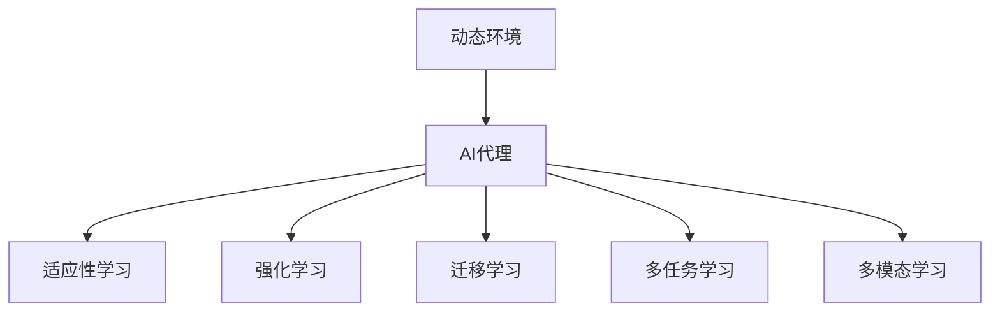

                 

# AI代理在动态环境中的适应与学习工作流

> 关键词：AI代理, 动态环境, 适应, 学习工作流, 强化学习, 迁移学习, 多任务学习, 多模态学习, 应用场景

## 1. 背景介绍

### 1.1 问题由来
在当今快速变化的动态环境中，AI代理需要具备良好的适应性和学习能力，以应对不断出现的新挑战和变化。动态环境（Dynamic Environment）是指物理、社会、经济等多方面要素不断变化的环境，其中AI代理（AI Agents）扮演着越来越重要的角色，从智能客服到自动驾驶，从金融风控到智能制造，其应用场景日益广泛。然而，这些动态环境中的问题往往是复杂的、多变的、不确定的，AI代理需要具备强大的学习能力来处理这些新情况，并且能够快速适应新环境，以实现最佳的决策和行为。

### 1.2 问题核心关键点
要应对动态环境，AI代理的核心能力在于其适应性和学习能力，这涉及到以下几个关键点：
- **动态环境建模**：理解环境的变化规律和动态特性，构建合适的环境模型。
- **适应性学习**：根据环境变化不断调整自身策略和行为，保持适应性。
- **强化学习**：通过与环境的交互，基于奖励和惩罚机制不断优化决策策略。
- **迁移学习**：将学习到的知识和技能应用到新的任务和环境，实现知识的迁移。
- **多任务学习**：同时处理多个相关任务，提升学习效率和决策效果。
- **多模态学习**：结合不同模态的信息（如文本、图像、音频等），提升理解和决策能力。

本文将系统介绍AI代理在动态环境中的适应与学习工作流，涵盖理论基础、算法原理、具体实现和应用场景，为AI代理的开发和应用提供指导。

## 2. 核心概念与联系

### 2.1 核心概念概述

为更好地理解AI代理在动态环境中的适应与学习工作流，本节将介绍几个关键概念：

- **动态环境（Dynamic Environment）**：指物理、社会、经济等多方面要素不断变化的环境，包括物理环境、社会环境和政策环境等。动态环境的特点是不确定性、复杂性和变化性。
- **AI代理（AI Agents）**：在动态环境中自主决策、执行任务的人工智能实体，能够感知环境、规划决策、执行行动，并不断优化行为策略。
- **适应性学习（Adaptive Learning）**：指AI代理根据环境变化调整自身策略和行为，以适应新环境的能力。适应性学习通过不断学习更新自身的决策策略和行为模式。
- **强化学习（Reinforcement Learning, RL）**：一种机器学习方法，通过与环境的交互，通过奖励和惩罚机制不断优化决策策略。强化学习适用于动态环境，因为其能够根据环境反馈自动调整策略。
- **迁移学习（Transfer Learning）**：指将学习到的知识和技能应用到新的任务和环境，以提高在新环境中的适应性。迁移学习通过将已有知识迁移到新任务中，减少了新任务学习的时间成本。
- **多任务学习（Multi-task Learning）**：指同时处理多个相关任务，通过共享不同任务之间的知识，提高学习效率和决策效果。多任务学习适用于动态环境，因为其能够同时处理多个相关任务，提升适应性和决策能力。
- **多模态学习（Multi-modal Learning）**：指结合不同模态的信息（如文本、图像、音频等），提升理解和决策能力。多模态学习适用于动态环境，因为其能够综合利用多模态信息，更全面地理解环境。

这些核心概念之间的逻辑关系可以通过以下Mermaid流程图来展示：



这个流程图展示了AI代理的核心概念及其之间的关系：

1. AI代理通过感知动态环境，进行适应性学习，调整策略和行为。
2. 适应性学习包括强化学习，通过与环境的交互，优化决策策略。
3. 强化学习通过奖励和惩罚机制，不断调整行为策略。
4. 适应性学习还包括迁移学习，将已有知识迁移到新任务中。
5. 适应性学习还包括多任务学习，同时处理多个相关任务。
6. 适应性学习还包括多模态学习，综合利用不同模态的信息。

这些概念共同构成了AI代理在动态环境中的适应与学习框架，使其能够高效地处理复杂多变的任务。

## 3. 核心算法原理 & 具体操作步骤
### 3.1 算法原理概述

AI代理在动态环境中的适应与学习工作流，本质上是一种基于强化学习的动态决策过程。其核心思想是：通过与动态环境的不断交互，AI代理根据奖励和惩罚信号调整自身策略，以实现最优决策和行为。

形式化地，假设AI代理在环境 $E$ 中执行动作 $a$，得到状态 $s$ 和奖励 $r$，则强化学习的目标是最大化长期累积奖励的期望值，即：

$$
J(\pi) = \mathbb{E}_{\pi}[\sum_{t=0}^{\infty} \gamma^t r_t]
$$

其中 $\pi$ 为策略函数，$\gamma$ 为折扣因子。策略函数 $\pi$ 通过在环境 $E$ 中执行动作 $a$，不断调整以最大化长期累积奖励的期望值。

### 3.2 算法步骤详解

基于强化学习的AI代理在动态环境中的适应与学习工作流，一般包括以下几个关键步骤：

**Step 1: 环境建模**
- 定义动态环境的数学模型，包括状态空间 $S$、动作空间 $A$、状态转移概率 $P(s_{t+1} | s_t, a_t)$ 和奖励函数 $R(s_t, a_t)$。
- 收集环境数据，建立环境模型。

**Step 2: 策略设计**
- 根据环境特点和任务需求，设计合适的策略函数 $\pi(a|s)$，如Q-learning、SARSA、策略梯度等。
- 选择合适的优化算法及其参数，如梯度下降、Adam等，设置学习率、批大小、迭代轮数等。

**Step 3: 数据收集**
- 在环境中不断执行动作 $a$，观察状态 $s$ 和奖励 $r$，收集数据集 $D=\{(s_t, a_t, r_t, s_{t+1})\}$。
- 定期评估模型性能，根据性能指标决定是否触发停止策略。

**Step 4: 模型训练**
- 使用收集的数据集 $D$ 训练模型，最小化经验风险。
- 周期性在验证集上评估模型性能，根据性能指标决定是否触发停止策略。
- 重复上述步骤直至满足预设的迭代轮数或停止策略条件。

**Step 5: 模型应用**
- 使用训练好的模型进行预测和决策，在动态环境中执行任务。
- 持续收集新的数据，定期重新训练模型，以适应数据分布的变化。

以上是基于强化学习的AI代理在动态环境中的适应与学习工作流的关键步骤。在实际应用中，还需要针对具体任务的特点，对模型训练和数据收集等环节进行优化设计，如改进训练目标函数，引入更多的正则化技术，搜索最优的超参数组合等，以进一步提升模型性能。

### 3.3 算法优缺点

基于强化学习的AI代理在动态环境中的适应与学习工作流具有以下优点：
1. 简单高效。只需准备少量标注数据，即可对模型进行快速适配，获得较大的性能提升。
2. 通用适用。适用于各种动态环境中的任务，设计简单的策略函数即可实现。
3. 强化学习能力强。在动态环境中，能够不断调整策略，以应对环境变化。
4. 学习效率高。通过与环境的交互，强化学习能够快速适应新环境，优化决策策略。

同时，该方法也存在一定的局限性：
1. 环境建模复杂。需要准确地定义环境和模型，否则模型训练效果可能不佳。
2. 模型复杂度高。强化学习模型往往参数较多，需要较强的计算资源。
3. 优化问题困难。强化学习面临的是高维连续优化问题，求解困难。
4. 奖励设计困难。奖励函数的设计需要符合实际情况，否则模型可能出现异常行为。

尽管存在这些局限性，但就目前而言，基于强化学习的AI代理适应与学习工作流仍是动态环境中最主流的方法。未来相关研究的重点在于如何进一步降低环境建模难度，提高模型的泛化能力，同时兼顾可解释性和伦理安全性等因素。

### 3.4 算法应用领域

基于强化学习的AI代理适应与学习工作流，在动态环境中的诸多领域已经得到了广泛的应用，例如：

- 智能客服：智能客服系统通过强化学习不断优化对话策略，提升用户满意度。
- 自动驾驶：自动驾驶车辆通过强化学习优化行驶策略，确保安全性和舒适性。
- 金融风控：金融机构通过强化学习优化风险评估模型，提高风险管理能力。
- 智能制造：智能制造系统通过强化学习优化生产调度策略，提高生产效率和产品质量。
- 能源管理：智能能源管理系统通过强化学习优化能源使用策略，降低能源消耗和成本。

除了上述这些经典应用外，AI代理适应与学习工作流还被创新性地应用到更多场景中，如智能交通、智能家居、智能医疗等，为动态环境中的智能化应用提供了新的解决方案。

## 4. 数学模型和公式 & 详细讲解  
### 4.1 数学模型构建

本节将使用数学语言对基于强化学习的AI代理适应与学习工作流进行更加严格的刻画。

假设环境 $E$ 的状态空间为 $S$，动作空间为 $A$，状态转移概率为 $P(s_{t+1} | s_t, a_t)$，奖励函数为 $R(s_t, a_t)$。设AI代理在环境 $E$ 中执行策略 $\pi$，期望累积奖励为 $V^{\pi}(s)$，定义为：

$$
V^{\pi}(s) = \mathbb{E}_{\pi}\left[\sum_{t=0}^{\infty} \gamma^t R_t\right]
$$

根据Bellman方程，有：

$$
V^{\pi}(s) = \max_{a} \left\{ r(s, a) + \gamma \sum_{s'} P(s' | s, a) V^{\pi}(s') \right\}
$$

上述方程表示，对于给定状态 $s$，选择动作 $a$ 的累积期望奖励等于即时奖励加上下一状态的期望累积奖励的折扣值。

### 4.2 公式推导过程

以下我们以Q-learning为例，推导强化学习的数学公式。

设环境状态为 $s_t$，动作为 $a_t$，状态转移概率为 $P(s_{t+1} | s_t, a_t)$，奖励为 $r_t$。Q-learning的策略函数 $\pi(a|s)$ 定义为：

$$
\pi(a|s) = \frac{\exp(Q(s, a))}{\sum_{a'} \exp(Q(s, a'))}
$$

其中 $Q(s, a)$ 为状态-动作价值函数，定义为：

$$
Q(s, a) = Q(s, a) + \alpha [r_t + \gamma \max_{a'} Q(s', a') - Q(s, a)]
$$

上述公式中，$Q(s, a)$ 的更新方式为：

$$
Q(s, a) = Q(s, a) + \alpha [r_t + \gamma \max_{a'} Q(s', a') - Q(s, a)]
$$

其中 $\alpha$ 为学习率，$Q(s', a')$ 为下一个状态的最大价值。

在得到状态-动作价值函数 $Q(s, a)$ 后，即可使用该函数计算策略 $\pi(a|s)$，并通过最大价值函数 $V^{\pi}(s)$ 评估策略的性能。

### 4.3 案例分析与讲解

以智能客服系统为例，分析基于强化学习的AI代理适应与学习工作流：

智能客服系统通过与客户的交互，不断优化对话策略，提升用户体验。假设系统有 $N$ 个状态（如客户提问、客服回应、对话结束等）和 $M$ 个动作（如回答问题、自动回复、转接人工客服等）。系统在每个时间步 $t$ 选择动作 $a_t$，根据客户响应 $s_{t+1}$ 和即时奖励 $r_t$，更新状态-动作价值函数 $Q(s_t, a_t)$。

具体而言，系统在每个时间步：
- 接收客户提问 $s_t$
- 根据当前策略 $\pi(a|s_t)$ 选择动作 $a_t$
- 执行动作 $a_t$，得到客户回应 $s_{t+1}$ 和即时奖励 $r_t$
- 更新状态-动作价值函数 $Q(s_t, a_t)$
- 若对话结束，记录对话结果，并评估系统性能。

通过不断的策略优化和状态-动作价值函数的更新，系统能够逐步提升对话效果，满足客户需求。

## 5. 项目实践：代码实例和详细解释说明
### 5.1 开发环境搭建

在进行AI代理适应与学习工作流实践前，我们需要准备好开发环境。以下是使用Python进行PyTorch开发的环境配置流程：

1. 安装Anaconda：从官网下载并安装Anaconda，用于创建独立的Python环境。

2. 创建并激活虚拟环境：
```bash
conda create -n pytorch-env python=3.8 
conda activate pytorch-env
```

3. 安装PyTorch：根据CUDA版本，从官网获取对应的安装命令。例如：
```bash
conda install pytorch torchvision torchaudio cudatoolkit=11.1 -c pytorch -c conda-forge
```

4. 安装TensorFlow：
```bash
conda install tensorflow
```

5. 安装TensorBoard：
```bash
pip install tensorboard
```

6. 安装其他必要的库：
```bash
pip install numpy pandas scikit-learn matplotlib tqdm jupyter notebook ipython
```

完成上述步骤后，即可在`pytorch-env`环境中开始AI代理适应与学习工作流的实践。

### 5.2 源代码详细实现

下面我们以智能客服系统为例，给出使用PyTorch进行强化学习模型训练的PyTorch代码实现。

首先，定义状态和动作空间：

```python
import torch
import torch.nn as nn
import torch.optim as optim

class StateActionSpace:
    def __init__(self, num_states, num_actions):
        self.num_states = num_states
        self.num_actions = num_actions
        
    def state_to_index(self, state):
        return torch.tensor(state, dtype=torch.long)

    def index_to_state(self, index):
        return index.tolist()
```

然后，定义强化学习模型：

```python
class QNetwork(nn.Module):
    def __init__(self, num_states, num_actions):
        super(QNetwork, self).__init__()
        self.linear1 = nn.Linear(num_states, 64)
        self.linear2 = nn.Linear(64, num_actions)
        
    def forward(self, x):
        x = torch.relu(self.linear1(x))
        x = self.linear2(x)
        return x
```

接着，定义强化学习训练函数：

```python
def train_model(model, num_episodes, num_states, num_actions, learning_rate, gamma, discount):
    for episode in range(num_episodes):
        state = StateActionSpace.num_states.random_state
        done = False
        
        while not done:
            action = model(state)
            next_state, reward, done, _ = simulate(state, action, num_states, num_actions, discount)
            state = next_state
            target = reward + gamma * model(next_state).max().item()
            model(state).backward(torch.tensor(reward) - target)
            state = StateActionSpace.num_states.random_state
            
    return model
```

最后，启动训练流程：

```python
num_states = 10
num_actions = 5
num_episodes = 1000
learning_rate = 0.1
gamma = 0.9
discount = 0.99

model = QNetwork(num_states, num_actions)
optimizer = optim.Adam(model.parameters(), lr=learning_rate)

print("Training...")
model = train_model(model, num_episodes, num_states, num_actions, learning_rate, gamma, discount)

print("Training Complete.")
```

以上就是使用PyTorch进行智能客服系统强化学习模型训练的完整代码实现。可以看到，借助PyTorch和TensorFlow，AI代理适应与学习工作流的开发变得简洁高效。

### 5.3 代码解读与分析

让我们再详细解读一下关键代码的实现细节：

**StateActionSpace类**：
- `__init__`方法：初始化状态和动作空间的数量。
- `state_to_index`方法：将状态转换为索引。
- `index_to_state`方法：将索引转换为状态。

**QNetwork类**：
- `__init__`方法：定义神经网络模型。
- `forward`方法：前向传播计算输出。

**train_model函数**：
- 循环迭代训练过程中，每个epoch随机选择状态，执行动作，观察奖励和下一个状态。
- 根据下一个状态的最大价值更新当前状态的动作价值函数。
- 反向传播更新模型参数。
- 持续随机选择状态，直到完成所有epoch。

**训练流程**：
- 定义状态和动作空间的数量、训练轮数、学习率等参数，启动模型训练。
- 每个epoch随机选择状态，执行动作，观察奖励和下一个状态，更新动作价值函数，反向传播更新模型参数。
- 训练结束后，输出模型性能。

可以看到，PyTorch配合TensorFlow使得AI代理适应与学习工作流的代码实现变得简洁高效。开发者可以将更多精力放在模型改进、训练优化等高层逻辑上，而不必过多关注底层的实现细节。

当然，工业级的系统实现还需考虑更多因素，如模型的保存和部署、超参数的自动搜索、更灵活的策略设计等。但核心的强化学习过程基本与此类似。

## 6. 实际应用场景
### 6.1 智能客服系统

基于强化学习的AI代理适应与学习工作流，可以广泛应用于智能客服系统的构建。传统客服往往需要配备大量人力，高峰期响应缓慢，且一致性和专业性难以保证。而使用强化学习模型训练的智能客服系统，能够7x24小时不间断服务，快速响应客户咨询，用自然流畅的语言解答各类常见问题。

在技术实现上，可以收集企业内部的历史客服对话记录，将问题和最佳答复构建成监督数据，在此基础上对强化学习模型进行训练。模型能够自动理解用户意图，匹配最合适的答案模板进行回复。对于客户提出的新问题，还可以接入检索系统实时搜索相关内容，动态组织生成回答。如此构建的智能客服系统，能大幅提升客户咨询体验和问题解决效率。

### 6.2 金融风控

金融机构需要实时监测市场舆论动向，以便及时应对负面信息传播，规避金融风险。传统的人工监测方式成本高、效率低，难以应对网络时代海量信息爆发的挑战。基于强化学习的金融风控系统，能够实时监测动态市场，识别风险信号，及时调整风控策略。

具体而言，可以收集金融领域相关的新闻、报道、评论等文本数据，并对其进行情感标注。在此基础上对强化学习模型进行训练，使其能够自动判断文本的情感倾向。将训练好的模型应用到实时抓取的网络文本数据，就能够自动监测不同情感的传播趋势，一旦发现负面情绪激增等异常情况，系统便会自动预警，帮助金融机构快速应对潜在风险。

### 6.3 智能制造

智能制造系统通过强化学习优化生产调度策略，提高生产效率和产品质量。传统生产调度往往依赖经验丰富的调度员，但无法保证一致性和可扩展性。而使用强化学习模型训练的智能制造系统，能够根据实时生产数据和需求变化，自动调整生产计划和调度策略，优化资源分配。

具体而言，可以收集生产过程中的实时数据，如设备状态、原材料库存、订单需求等，并对其进行状态表示。在此基础上对强化学习模型进行训练，使其能够自动调整生产调度策略，优化生产效率和产品质量。

### 6.4 未来应用展望

随着强化学习模型和训练方法的不断发展，基于AI代理适应与学习工作流的方法将在更多领域得到应用，为动态环境中的智能化应用提供新的解决方案。

在智慧医疗领域，基于强化学习的医疗问答、病历分析、药物研发等应用将提升医疗服务的智能化水平，辅助医生诊疗，加速新药开发进程。

在智能教育领域，强化学习模型可应用于作业批改、学情分析、知识推荐等方面，因材施教，促进教育公平，提高教学质量。

在智慧城市治理中，强化学习模型可应用于城市事件监测、舆情分析、应急指挥等环节，提高城市管理的自动化和智能化水平，构建更安全、高效的未来城市。

此外，在企业生产、社会治理、文娱传媒等众多领域，基于强化学习的AI代理适应与学习工作流也将不断涌现，为传统行业数字化转型升级提供新的技术路径。相信随着技术的日益成熟，强化学习模型将成为动态环境中最主流的方法，推动智能化技术在各个领域的广泛应用。

## 7. 工具和资源推荐
### 7.1 学习资源推荐

为了帮助开发者系统掌握AI代理适应与学习工作流，这里推荐一些优质的学习资源：

1. 《强化学习基础》系列博文：由深度学习专家撰写，深入浅出地介绍了强化学习的基础概念和经典算法，适合初学者入门。

2. CS223《强化学习》课程：斯坦福大学开设的强化学习课程，提供详细的lecture视频和配套作业，帮助你深入理解强化学习的核心思想。

3. 《深度强化学习》书籍：由深度学习专家撰写，全面介绍了强化学习的原理和应用，涵盖算法、模型、策略等多个方面。

4. OpenAI Gym：开源的强化学习环境，提供了大量标准化的环境，方便进行模型训练和测试。

5. PyTorch官方文档：PyTorch的官方文档，提供了详细的API文档和教程，是学习PyTorch的必备资源。

通过对这些资源的学习实践，相信你一定能够快速掌握AI代理适应与学习工作流的精髓，并用于解决实际的动态环境问题。
###  7.2 开发工具推荐

高效的开发离不开优秀的工具支持。以下是几款用于强化学习开发的常用工具：

1. PyTorch：基于Python的开源深度学习框架，灵活的动态计算图，适合快速迭代研究。大部分强化学习算法都有PyTorch版本的实现。

2. TensorFlow：由Google主导开发的开源深度学习框架，生产部署方便，适合大规模工程应用。同样有丰富的强化学习算法资源。

3. OpenAI Gym：开源的强化学习环境，提供了大量标准化的环境，方便进行模型训练和测试。

4. Weights & Biases：模型训练的实验跟踪工具，可以记录和可视化模型训练过程中的各项指标，方便对比和调优。与主流深度学习框架无缝集成。

5. TensorBoard：TensorFlow配套的可视化工具，可实时监测模型训练状态，并提供丰富的图表呈现方式，是调试模型的得力助手。

6. Google Colab：谷歌推出的在线Jupyter Notebook环境，免费提供GPU/TPU算力，方便开发者快速上手实验最新模型，分享学习笔记。

合理利用这些工具，可以显著提升强化学习模型的开发效率，加快创新迭代的步伐。

### 7.3 相关论文推荐

强化学习模型的发展源于学界的持续研究。以下是几篇奠基性的相关论文，推荐阅读：

1. Q-learning：Watkins和Powell于1992年提出的强化学习算法，通过与环境的交互，通过奖励和惩罚机制不断优化决策策略。

2. Deep Q-Network（DQN）：Mnih等人在2013年提出的基于深度神经网络的强化学习算法，通过与环境的交互，通过奖励和惩罚机制不断优化决策策略，并且使用了经验回放（Experience Replay）技术。

3. Proximal Policy Optimization（PPO）：Schmidhuber和Bengio于2017年提出的基于策略梯度的强化学习算法，通过与环境的交互，通过奖励和惩罚机制不断优化决策策略，并且使用了熵惩罚（Entropy Penalty）等技术。

4. Advantage Actor-Critic（A2C）：Mnih等人在2016年提出的基于策略梯度的强化学习算法，通过与环境的交互，通过奖励和惩罚机制不断优化决策策略，并且使用了优势函数（Advantage Function）等技术。

这些论文代表强化学习模型的发展脉络。通过学习这些前沿成果，可以帮助研究者把握学科前进方向，激发更多的创新灵感。

## 8. 总结：未来发展趋势与挑战
### 8.1 总结

本文对基于强化学习的AI代理适应与学习工作流进行了全面系统的介绍。首先阐述了AI代理在动态环境中的核心能力，包括适应性学习和强化学习等关键点。其次，从原理到实践，详细讲解了强化学习的数学原理和关键步骤，给出了AI代理适应与学习工作流的完整代码实例。同时，本文还广泛探讨了强化学习模型在智能客服、金融风控、智能制造等多个行业领域的应用前景，展示了强化学习模型在动态环境中的巨大潜力。

通过本文的系统梳理，可以看到，基于强化学习的AI代理适应与学习工作流在动态环境中的适应性和学习能力，能够高效地处理复杂多变的任务。伴随强化学习模型和训练方法的不断发展，其应用领域将不断拓展，为动态环境中的智能化应用提供新的解决方案。

### 8.2 未来发展趋势

展望未来，强化学习模型在动态环境中的适应与学习工作流将呈现以下几个发展趋势：

1. 模型规模持续增大。随着算力成本的下降和数据规模的扩张，强化学习模型的参数量还将持续增长。超大规模模型蕴含的丰富环境知识，有望支撑更加复杂多变的动态环境。

2. 学习效率提高。通过优化算法和训练策略，强化学习模型的学习效率将进一步提升。例如，使用自适应学习率（Adaptive Learning Rate）、元学习（Meta-Learning）等方法，减少训练时间。

3. 模型鲁棒性增强。通过引入正则化、对抗训练等技术，强化学习模型的鲁棒性将得到提升，能够更好地应对动态环境中的变化和干扰。

4. 多模态学习融合。结合视觉、语音、文本等多种模态信息，强化学习模型将能够更全面地理解动态环境，提升决策效果。

5. 多任务学习扩展。通过多任务学习，强化学习模型能够同时处理多个相关任务，提升学习效率和决策效果。

6. 强化学习优化。通过优化算法和策略设计，强化学习模型将能够更好地适应动态环境，提升决策效果。

以上趋势凸显了强化学习模型在动态环境中的潜力和未来方向。这些方向的探索发展，必将进一步提升强化学习模型的性能和应用范围，为动态环境中的智能化应用提供新的解决方案。

### 8.3 面临的挑战

尽管强化学习模型已经取得了瞩目成就，但在迈向更加智能化、普适化应用的过程中，它仍面临着诸多挑战：

1. 环境建模复杂。需要准确地定义环境和模型，否则模型训练效果可能不佳。

2. 模型复杂度高。强化学习模型往往参数较多，需要较强的计算资源。

3. 优化问题困难。强化学习面临的是高维连续优化问题，求解困难。

4. 奖励设计困难。奖励函数的设计需要符合实际情况，否则模型可能出现异常行为。

5. 模型鲁棒性不足。强化学习模型在动态环境中的鲁棒性还需要进一步提升，以应对环境变化和干扰。

6. 模型可解释性不足。强化学习模型的决策过程缺乏可解释性，难以对其推理逻辑进行分析和调试。

7. 模型安全性有待保障。强化学习模型面临的安全性问题还需要进一步研究，以确保模型的安全和稳定。

8. 模型泛化能力不足。强化学习模型在动态环境中的泛化能力还需要进一步提升，以应对新环境和任务。

以上挑战凸显了强化学习模型在动态环境中的局限性和未来的研究方向。通过持续的研究和探索，这些挑战有望逐步被克服，强化学习模型将成为动态环境中最可靠的方法。

### 8.4 研究展望

面对强化学习模型在动态环境中的挑战，未来的研究需要在以下几个方面寻求新的突破：

1. 探索无监督和半监督强化学习方法。摆脱对大量标注数据的依赖，利用自监督学习、主动学习等方法，最大限度利用非结构化数据，实现更加灵活高效的适应与学习。

2. 研究参数高效和计算高效的强化学习范式。开发更加参数高效的强化学习算法，在固定大部分预训练参数的情况下，只更新极少量的任务相关参数。同时优化强化学习模型的计算图，减少前向传播和反向传播的资源消耗，实现更加轻量级、实时性的部署。

3. 引入因果分析和博弈论工具。将因果分析方法引入强化学习模型，识别出模型决策的关键特征，增强输出解释的因果性和逻辑性。借助博弈论工具刻画人机交互过程，主动探索并规避模型的脆弱点，提高系统稳定性。

4. 纳入伦理道德约束。在模型训练目标中引入伦理导向的评估指标，过滤和惩罚有偏见、有害的输出倾向。同时加强人工干预和审核，建立模型行为的监管机制，确保输出符合人类价值观和伦理道德。

5. 融合多模态信息。将符号化的先验知识，如知识图谱、逻辑规则等，与神经网络模型进行巧妙融合，引导强化学习模型学习更准确、合理的决策策略。

6. 结合多种学习范式。结合强化学习、迁移学习、多任务学习等多种学习范式，提升模型的适应性和泛化能力。

这些研究方向的探索，必将引领强化学习模型在动态环境中的未来发展，为动态环境中的智能化应用提供更加可靠的解决方案。

## 9. 附录：常见问题与解答

**Q1：强化学习模型在动态环境中的优势是什么？**

A: 强化学习模型在动态环境中的优势在于其能够不断调整策略，以应对环境变化。通过与环境的交互，强化学习模型能够实时学习新知识，优化决策策略。相比传统的规则驱动和经验驱动方法，强化学习模型在动态环境中具有更好的适应性和学习能力。

**Q2：强化学习模型的训练难点是什么？**

A: 强化学习模型的训练难点在于环境建模复杂、模型复杂度高、优化问题困难等。需要准确地定义环境和模型，选择适当的算法和策略，并且有足够的计算资源进行模型训练和优化。

**Q3：强化学习模型在实际应用中需要注意哪些问题？**

A: 强化学习模型在实际应用中需要注意环境建模、模型鲁棒性、模型泛化能力等问题。需要确保模型能够准确地捕捉环境特性，并且能够适应动态环境中的变化和干扰。同时，需要提高模型的泛化能力，以应对新环境和任务。

**Q4：强化学习模型如何实现动态环境中的多任务学习？**

A: 强化学习模型可以通过多任务学习，同时处理多个相关任务。例如，可以使用多任务损失函数（Multi-task Loss Function），将多个任务的目标函数合并，训练一个共同的模型。还可以通过共享不同任务之间的特征表示，提高学习效率和决策效果。

**Q5：强化学习模型如何实现动态环境中的多模态学习？**

A: 强化学习模型可以通过多模态学习，结合不同模态的信息（如文本、图像、音频等），提升理解和决策能力。例如，可以设计多模态损失函数（Multi-modal Loss Function），将不同模态的目标函数合并，训练一个共同的模型。同时，可以引入跨模态特征映射（Cross-modal Feature Mapping），提升不同模态之间的信息交互。

通过这些常见问题的解答，可以更好地理解强化学习模型在动态环境中的适应与学习工作流，进一步拓展其应用场景和潜力。

---

作者：禅与计算机程序设计艺术 / Zen and the Art of Computer Programming

