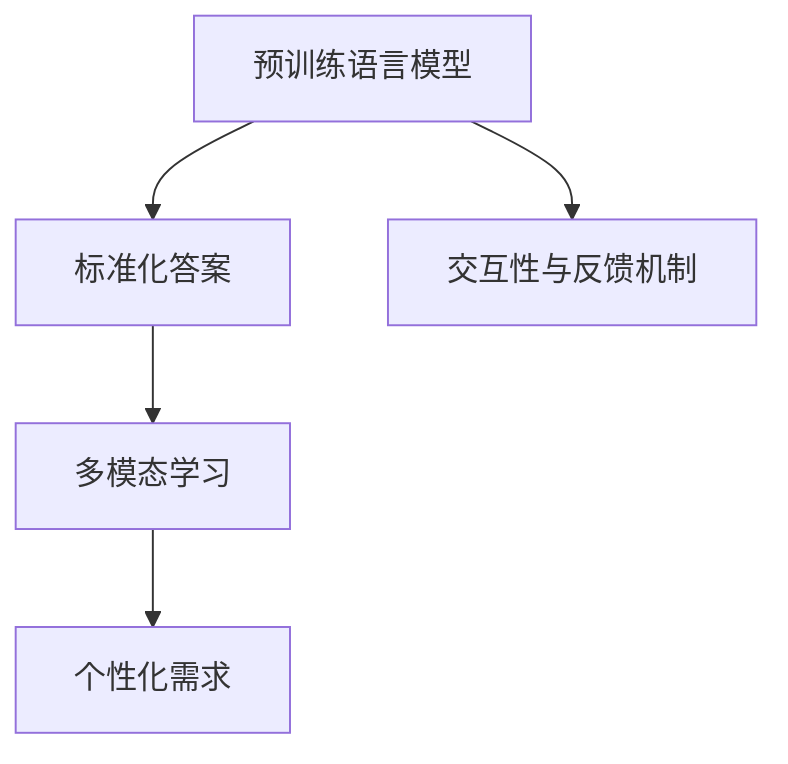

                 

# AI写作的局限：标准化答案 vs 个性化需求

> 关键词：AI写作, 标准化答案, 个性化需求, 自然语言生成(NLG), 深度学习, 多模态学习, 交互性

## 1. 背景介绍

随着人工智能技术的不断发展，自然语言生成(NLG)技术在自动化写作、智能客服、内容生成等领域得到了广泛应用。目前，主流的NLG系统通常是基于深度学习的预训练语言模型(如GPT-3、T5等)进行构建的。然而，尽管这些模型在文本生成、对话生成、文本摘要等方面取得了显著进展，但仍然面临着一些局限性。

### 1.1 标准化答案与个性化需求

AI写作的核心目标是生成具有高质量、可读性强的文本。然而，当前大部分NLG系统输出的是标准化答案，即对给定输入应用统一的处理方式，忽略了个体和上下文的多样性需求。这在处理大量相同的标准化问题时表现优异，但面对个性化的需求时，系统的灵活性和多样性不足。

### 1.2 问题核心关键点

1. **个性化与标准化之间的平衡**：如何在不牺牲系统性能的前提下，兼顾标准化答案的准确性和个性化需求的灵活性。
2. **多模态信息的融合**：如何将文本、语音、图像等不同模态的信息进行有效整合，以生成更丰富的响应。
3. **交互性与反馈机制**：如何在交互过程中收集用户的反馈，并根据反馈不断优化输出。
4. **情感与语境的感知**：如何更好地理解用户的情感和语境，以生成更贴近用户需求的文本。
5. **隐私与安全**：如何在生成文本时保障用户隐私，防止敏感信息泄露。

## 2. 核心概念与联系

### 2.1 核心概念概述

为了更好地理解AI写作在标准化答案与个性化需求之间的平衡，本节将介绍几个关键概念：

- **自然语言生成(NLG)**：使用人工智能技术自动生成自然语言文本的过程。
- **预训练语言模型**：在大规模无标签文本数据上进行预训练的深度学习模型，如GPT、BERT、T5等。
- **标准化答案**：对于给定输入，系统生成的统一、标准的回答。
- **个性化需求**：根据不同用户、上下文和场景，生成具有个性化特征的文本。
- **多模态学习**：融合文本、语音、图像等多模态信息的深度学习过程。
- **交互性与反馈机制**：在生成过程中通过与用户的互动，收集反馈并进行优化。

这些概念之间的关系可以通过以下Mermaid流程图来展示：



这个流程图展示了预训练语言模型在生成标准化答案的过程中，通过多模态学习和交互性与反馈机制，逐步转向生成个性化需求的能力。

## 3. 核心算法原理 & 具体操作步骤

### 3.1 算法原理概述

基于预训练语言模型的AI写作，本质上是一个基于序列生成模型的自然语言生成过程。其核心思想是：将文本生成任务视作序列预测问题，通过最大化预测输出和真实文本的交叉熵损失，训练生成模型。具体而言，对于给定输入序列 $x_1,\cdots,x_n$，模型生成文本 $y_1,\cdots,y_m$，并希望最大化 $P(Y|X)$。

### 3.2 算法步骤详解

基于预训练语言模型的AI写作过程主要包括以下几个关键步骤：

**Step 1: 准备预训练模型和数据集**

- 选择合适的预训练语言模型 $M_{\theta}$ 作为初始化参数，如GPT、BERT、T5等。
- 准备训练集和验证集，并划分为训练集 $D_{train}$ 和测试集 $D_{test}$。

**Step 2: 数据预处理**

- 对输入文本进行分词、去除停用词、词性标注等预处理操作。
- 对于多模态输入，需要将不同模态的数据进行融合和预处理。

**Step 3: 模型训练**

- 将预处理后的数据输入模型，前向传播计算损失函数。
- 反向传播计算模型参数的梯度，并使用优化器进行参数更新。
- 在验证集上评估模型性能，根据性能调整超参数。

**Step 4: 模型评估**

- 在测试集上评估模型性能，对比微调前后的效果。

**Step 5: 交互式生成**

- 将模型嵌入到实际应用系统中，如智能客服、内容生成等场景中，进行交互式生成。

### 3.3 算法优缺点

基于预训练语言模型的AI写作具有以下优点：

- **快速生成高质量文本**：预训练模型具有强大的语言生成能力，可以快速生成高质量的文本内容。
- **适用范围广**：适用于各种文本生成任务，如对话生成、文本摘要、内容生成等。
- **技术成熟**：已有大量研究和实践经验，技术成熟度较高。

同时，该方法也存在一定的局限性：

- **缺乏个性化**：标准化答案无法满足不同用户的个性化需求。
- **数据依赖**：模型的效果很大程度上依赖于训练数据的质量和数量。
- **冷启动问题**：新领域或小样本数据上的性能表现较差。
- **模型复杂度高**：参数量巨大，计算和存储成本高。

### 3.4 算法应用领域

基于预训练语言模型的AI写作技术在多个领域得到了应用，例如：

- **智能客服**：生成标准化的客服回复，提升服务效率。
- **内容生成**：自动生成新闻、博客、产品描述等内容，降低内容生产成本。
- **教育培训**：生成个性化学习材料，辅助学生学习。
- **医学咨询**：生成医学科普文章，帮助患者理解疾病。
- **法律咨询**：生成标准化的法律咨询回复，提供基础法律知识。

## 4. 数学模型和公式 & 详细讲解 & 举例说明

### 4.1 数学模型构建

假设文本生成任务为 $x$ 生成 $y$，即对于给定输入 $x$，模型输出文本序列 $y$。基于序列生成模型的数学模型可以表示为：

$$
P(Y|X) = \prod_{t=1}^{T} P(y_t|y_{<t},x)
$$

其中 $y_{<t}$ 表示到第 $t-1$ 个位置的上下文信息。模型的目标是最大化 $P(Y|X)$。

### 4.2 公式推导过程

对于序列生成模型，常用的训练目标是最大化以下似然函数：

$$
\mathcal{L} = -\frac{1}{N}\sum_{i=1}^{N}\sum_{t=1}^{T} \log P(y_t|y_{<t},x)
$$

在训练过程中，使用优化器（如Adam、SGD等）更新模型参数 $\theta$，使得损失函数 $\mathcal{L}$ 最小化。

### 4.3 案例分析与讲解

以GPT-3模型为例，其基于Transformer结构，通过自回归方式生成文本。在训练过程中，GPT-3模型会生成一个长度为 $T$ 的文本序列，每个位置的概率 $P(y_t|y_{<t},x)$ 可通过自回归模型计算：

$$
P(y_t|y_{<t},x) = \frac{exp(softmax(f_{\theta}(x, y_{<t}))}{\sum_{y \in \mathcal{Y}}exp(softmax(f_{\theta}(x, y_{<t}))}
$$

其中 $f_{\theta}$ 是模型参数化的变换函数，$\mathcal{Y}$ 是可能生成的词汇表。

## 5. 项目实践：代码实例和详细解释说明

### 5.1 开发环境搭建

在进行AI写作实践前，我们需要准备好开发环境。以下是使用Python进行PyTorch开发的环境配置流程：

1. 安装Anaconda：从官网下载并安装Anaconda，用于创建独立的Python环境。

2. 创建并激活虚拟环境：
```bash
conda create -n pytorch-env python=3.8 
conda activate pytorch-env
```

3. 安装PyTorch：根据CUDA版本，从官网获取对应的安装命令。例如：
```bash
conda install pytorch torchvision torchaudio cudatoolkit=11.1 -c pytorch -c conda-forge
```

4. 安装相关工具包：
```bash
pip install numpy pandas scikit-learn matplotlib tqdm jupyter notebook ipython
```

完成上述步骤后，即可在`pytorch-env`环境中开始AI写作实践。

### 5.2 源代码详细实现

下面我们以生成对话文本的任务为例，给出使用Transformers库进行GPT-3微调的PyTorch代码实现。

首先，定义数据预处理函数：

```python
from transformers import GPT2Tokenizer
import torch

def tokenize(text):
    tokenizer = GPT2Tokenizer.from_pretrained('gpt2')
    tokens = tokenizer.encode(text, return_tensors='pt')
    return tokens

# 定义模型和优化器
from transformers import GPT2LMHeadModel

model = GPT2LMHeadModel.from_pretrained('gpt2')
optimizer = torch.optim.Adam(model.parameters(), lr=2e-5)

# 定义训练函数
def train_epoch(model, tokenizer, data, batch_size, optimizer):
    model.train()
    loss = 0
    for batch in data:
        input_ids = tokenize(batch)
        model.zero_grad()
        outputs = model(input_ids)
        loss += outputs.loss
        loss.backward()
        optimizer.step()
    return loss / len(data)

# 定义评估函数
def evaluate(model, tokenizer, data, batch_size):
    model.eval()
    with torch.no_grad():
        loss = 0
        for batch in data:
            input_ids = tokenize(batch)
            outputs = model(input_ids)
            loss += outputs.loss
        return loss / len(data)
```

然后，使用预处理好的数据进行模型训练和评估：

```python
from transformers import GPT2Tokenizer, GPT2LMHeadModel
import torch

tokenizer = GPT2Tokenizer.from_pretrained('gpt2')
model = GPT2LMHeadModel.from_pretrained('gpt2')

optimizer = torch.optim.Adam(model.parameters(), lr=2e-5)

train_dataset = ...
dev_dataset = ...
test_dataset = ...

epochs = 5
batch_size = 16

for epoch in range(epochs):
    loss = train_epoch(model, tokenizer, train_dataset, batch_size, optimizer)
    print(f"Epoch {epoch+1}, train loss: {loss:.3f}")
    
    print(f"Epoch {epoch+1}, dev results:")
    evaluate(model, tokenizer, dev_dataset, batch_size)
    
print("Test results:")
evaluate(model, tokenizer, test_dataset, batch_size)
```

以上就是使用PyTorch对GPT-3进行对话生成任务的完整代码实现。可以看到，得益于Transformers库的强大封装，我们可以用相对简洁的代码完成GPT-3的微调。

### 5.3 代码解读与分析

让我们再详细解读一下关键代码的实现细节：

**tokenize函数**：
- 定义了一个tokenize函数，用于将输入文本转换为模型可接受的token序列。
- 使用了预训练好的GPT2Tokenizer，将文本编码成token ids，并返回一个PyTorch张量。

**train_epoch函数**：
- 定义了一个train_epoch函数，用于对模型进行单批次训练。
- 模型进入训练模式，前向传播计算损失函数，反向传播更新模型参数。
- 周期性在验证集上评估模型性能，根据性能调整超参数。

**evaluate函数**：
- 定义了一个evaluate函数，用于对模型进行评估。
- 与训练类似，不同点在于不更新模型参数，并在每个batch结束后将预测和标签结果存储下来，最后使用平均损失评估模型性能。

**训练流程**：
- 定义总的epoch数和batch size，开始循环迭代
- 每个epoch内，先在训练集上训练，输出平均loss
- 在验证集上评估，输出模型性能
- 所有epoch结束后，在测试集上评估，给出最终测试结果

可以看到，PyTorch配合Transformers库使得GPT-3微调的代码实现变得简洁高效。开发者可以将更多精力放在数据处理、模型改进等高层逻辑上，而不必过多关注底层的实现细节。

当然，工业级的系统实现还需考虑更多因素，如模型的保存和部署、超参数的自动搜索、更灵活的任务适配层等。但核心的微调范式基本与此类似。

## 6. 实际应用场景

### 6.1 智能客服系统

基于预训练语言模型的AI写作技术可以广泛应用于智能客服系统的构建。传统客服往往需要配备大量人力，高峰期响应缓慢，且一致性和专业性难以保证。而使用微调后的写作模型，可以7x24小时不间断服务，快速响应客户咨询，用自然流畅的语言解答各类常见问题。

在技术实现上，可以收集企业内部的历史客服对话记录，将问题和最佳答复构建成监督数据，在此基础上对预训练写作模型进行微调。微调后的写作模型能够自动理解用户意图，匹配最合适的答案模板进行回复。对于客户提出的新问题，还可以接入检索系统实时搜索相关内容，动态组织生成回答。如此构建的智能客服系统，能大幅提升客户咨询体验和问题解决效率。

### 6.2 金融舆情监测

金融机构需要实时监测市场舆论动向，以便及时应对负面信息传播，规避金融风险。传统的人工监测方式成本高、效率低，难以应对网络时代海量信息爆发的挑战。基于预训练语言模型的文本生成技术，为金融舆情监测提供了新的解决方案。

具体而言，可以收集金融领域相关的新闻、报道、评论等文本数据，并对其进行主题标注和情感标注。在此基础上对预训练语言模型进行微调，使其能够自动判断文本属于何种主题，情感倾向是正面、中性还是负面。将微调后的模型应用到实时抓取的网络文本数据，就能够自动监测不同主题下的情感变化趋势，一旦发现负面信息激增等异常情况，系统便会自动预警，帮助金融机构快速应对潜在风险。

### 6.3 个性化推荐系统

当前的推荐系统往往只依赖用户的历史行为数据进行物品推荐，无法深入理解用户的真实兴趣偏好。基于预训练语言模型的文本生成技术，可以更好地挖掘用户行为背后的语义信息，从而提供更精准、多样的推荐内容。

在实践中，可以收集用户浏览、点击、评论、分享等行为数据，提取和用户交互的物品标题、描述、标签等文本内容。将文本内容作为模型输入，用户的后续行为（如是否点击、购买等）作为监督信号，在此基础上微调预训练语言模型。微调后的模型能够从文本内容中准确把握用户的兴趣点。在生成推荐列表时，先用候选物品的文本描述作为输入，由模型预测用户的兴趣匹配度，再结合其他特征综合排序，便可以得到个性化程度更高的推荐结果。

### 6.4 未来应用展望

随着预训练语言模型和文本生成技术的不断发展，基于微调范式将在更多领域得到应用，为传统行业带来变革性影响。

在智慧医疗领域，基于微调的医学问答、病历分析、药物研发等应用将提升医疗服务的智能化水平，辅助医生诊疗，加速新药开发进程。

在智能教育领域，微调技术可应用于作业批改、学情分析、知识推荐等方面，因材施教，促进教育公平，提高教学质量。

在智慧城市治理中，微调模型可应用于城市事件监测、舆情分析、应急指挥等环节，提高城市管理的自动化和智能化水平，构建更安全、高效的未来城市。

此外，在企业生产、社会治理、文娱传媒等众多领域，基于大模型微调的人工智能应用也将不断涌现，为经济社会发展注入新的动力。相信随着技术的日益成熟，微调方法将成为人工智能落地应用的重要范式，推动人工智能技术在垂直行业的规模化落地。

## 7. 工具和资源推荐

### 7.1 学习资源推荐

为了帮助开发者系统掌握预训练语言模型微调的理论基础和实践技巧，这里推荐一些优质的学习资源：

1. 《Transformers从原理到实践》系列博文：由大模型技术专家撰写，深入浅出地介绍了Transformer原理、GPT模型、微调技术等前沿话题。

2. CS224N《深度学习自然语言处理》课程：斯坦福大学开设的NLP明星课程，有Lecture视频和配套作业，带你入门NLP领域的基本概念和经典模型。

3. 《Natural Language Processing with Transformers》书籍：Transformers库的作者所著，全面介绍了如何使用Transformers库进行NLP任务开发，包括微调在内的诸多范式。

4. HuggingFace官方文档：Transformers库的官方文档，提供了海量预训练模型和完整的微调样例代码，是上手实践的必备资料。

5. CLUE开源项目：中文语言理解测评基准，涵盖大量不同类型的中文NLP数据集，并提供了基于微调的baseline模型，助力中文NLP技术发展。

通过对这些资源的学习实践，相信你一定能够快速掌握预训练语言模型微调的精髓，并用于解决实际的NLP问题。

### 7.2 开发工具推荐

高效的开发离不开优秀的工具支持。以下是几款用于预训练语言模型微调开发的常用工具：

1. PyTorch：基于Python的开源深度学习框架，灵活动态的计算图，适合快速迭代研究。大部分预训练语言模型都有PyTorch版本的实现。

2. TensorFlow：由Google主导开发的开源深度学习框架，生产部署方便，适合大规模工程应用。同样有丰富的预训练语言模型资源。

3. Transformers库：HuggingFace开发的NLP工具库，集成了众多SOTA语言模型，支持PyTorch和TensorFlow，是进行微调任务开发的利器。

4. Weights & Biases：模型训练的实验跟踪工具，可以记录和可视化模型训练过程中的各项指标，方便对比和调优。与主流深度学习框架无缝集成。

5. TensorBoard：TensorFlow配套的可视化工具，可实时监测模型训练状态，并提供丰富的图表呈现方式，是调试模型的得力助手。

6. Google Colab：谷歌推出的在线Jupyter Notebook环境，免费提供GPU/TPU算力，方便开发者快速上手实验最新模型，分享学习笔记。

合理利用这些工具，可以显著提升预训练语言模型微调任务的开发效率，加快创新迭代的步伐。

### 7.3 相关论文推荐

预训练语言模型和微调技术的发展源于学界的持续研究。以下是几篇奠基性的相关论文，推荐阅读：

1. Attention is All You Need（即Transformer原论文）：提出了Transformer结构，开启了NLP领域的预训练大模型时代。

2. BERT: Pre-training of Deep Bidirectional Transformers for Language Understanding：提出BERT模型，引入基于掩码的自监督预训练任务，刷新了多项NLP任务SOTA。

3. Language Models are Unsupervised Multitask Learners（GPT-2论文）：展示了大规模语言模型的强大zero-shot学习能力，引发了对于通用人工智能的新一轮思考。

4. Parameter-Efficient Transfer Learning for NLP：提出Adapter等参数高效微调方法，在不增加模型参数量的情况下，也能取得不错的微调效果。

5. Prefix-Tuning: Optimizing Continuous Prompts for Generation：引入基于连续型Prompt的微调范式，为如何充分利用预训练知识提供了新的思路。

6. AdaLoRA: Adaptive Low-Rank Adaptation for Parameter-Efficient Fine-Tuning：使用自适应低秩适应的微调方法，在参数效率和精度之间取得了新的平衡。

这些论文代表了大语言模型微调技术的发展脉络。通过学习这些前沿成果，可以帮助研究者把握学科前进方向，激发更多的创新灵感。

## 8. 总结：未来发展趋势与挑战

### 8.1 总结

本文对基于预训练语言模型的AI写作方法进行了全面系统的介绍。首先阐述了AI写作在标准化答案与个性化需求之间的平衡问题，明确了微调在生成个性化文本方面的重要性。其次，从原理到实践，详细讲解了预训练语言模型的训练过程和优化策略，给出了微调任务开发的完整代码实例。同时，本文还广泛探讨了微调方法在智能客服、金融舆情、个性化推荐等多个行业领域的应用前景，展示了微调范式的巨大潜力。此外，本文精选了微调技术的各类学习资源，力求为读者提供全方位的技术指引。

通过本文的系统梳理，可以看到，基于预训练语言模型的AI写作技术正在成为NLP领域的重要范式，极大地拓展了语言模型的应用边界，催生了更多的落地场景。尽管存在一些局限性，但未来在模型规模、参数效率、多模态融合等方面的持续探索，必将进一步提升AI写作的质量和灵活性，使其更好地服务于各行业的需求。

### 8.2 未来发展趋势

展望未来，基于预训练语言模型的AI写作技术将呈现以下几个发展趋势：

1. **模型规模持续增大**：随着算力成本的下降和数据规模的扩张，预训练语言模型的参数量还将持续增长。超大规模语言模型蕴含的丰富语言知识，有望支撑更加复杂多变的文本生成任务。

2. **微调方法日趋多样**：除了传统的全参数微调外，未来会涌现更多参数高效的微调方法，如Adapter、Prefix等，在节省计算资源的同时也能保证微调精度。

3. **持续学习成为常态**：随着数据分布的不断变化，微调模型也需要持续学习新知识以保持性能。如何在不遗忘原有知识的同时，高效吸收新样本信息，将成为重要的研究课题。

4. **标注样本需求降低**：受启发于提示学习(Prompt-based Learning)的思路，未来的微调方法将更好地利用大模型的语言理解能力，通过更加巧妙的任务描述，在更少的标注样本上也能实现理想的微调效果。

5. **多模态微调崛起**：当前的微调主要聚焦于纯文本数据，未来会进一步拓展到图像、视频、语音等多模态数据微调。多模态信息的融合，将显著提升语言模型对现实世界的理解和建模能力。

6. **情感与语境的感知**：未来的AI写作技术将更好地理解用户的情感和语境，以生成更贴近用户需求的文本。

以上趋势凸显了基于预训练语言模型的AI写作技术的广阔前景。这些方向的探索发展，必将进一步提升AI写作的质量和应用范围，为智能交互系统带来新的突破。

### 8.3 面临的挑战

尽管基于预训练语言模型的AI写作技术已经取得了瞩目成就，但在迈向更加智能化、普适化应用的过程中，它仍面临着诸多挑战：

1. **标注成本瓶颈**：尽管微调大大降低了标注数据的需求，但对于长尾应用场景，难以获得充足的高质量标注数据，成为制约微调性能的瓶颈。如何进一步降低微调对标注样本的依赖，将是一大难题。

2. **模型鲁棒性不足**：当前微调模型面对域外数据时，泛化性能往往大打折扣。对于测试样本的微小扰动，微调模型的预测也容易发生波动。如何提高微调模型的鲁棒性，避免灾难性遗忘，还需要更多理论和实践的积累。

3. **推理效率有待提高**：大规模语言模型虽然精度高，但在实际部署时往往面临推理速度慢、内存占用大等效率问题。如何在保证性能的同时，简化模型结构，提升推理速度，优化资源占用，将是重要的优化方向。

4. **可解释性亟需加强**：当前微调模型更像是"黑盒"系统，难以解释其内部工作机制和决策逻辑。对于医疗、金融等高风险应用，算法的可解释性和可审计性尤为重要。如何赋予微调模型更强的可解释性，将是亟待攻克的难题。

5. **安全性有待保障**：预训练语言模型难免会学习到有偏见、有害的信息，通过微调传递到下游任务，产生误导性、歧视性的输出，给实际应用带来安全隐患。如何从数据和算法层面消除模型偏见，避免恶意用途，确保输出的安全性，也将是重要的研究课题。

6. **知识整合能力不足**：现有的微调模型往往局限于任务内数据，难以灵活吸收和运用更广泛的先验知识。如何让微调过程更好地与外部知识库、规则库等专家知识结合，形成更加全面、准确的信息整合能力，还有很大的想象空间。

正视AI写作面临的这些挑战，积极应对并寻求突破，将是大模型微调走向成熟的必由之路。相信随着学界和产业界的共同努力，这些挑战终将一一被克服，预训练语言模型微调必将在构建人机协同的智能时代中扮演越来越重要的角色。

### 8.4 研究展望

面对预训练语言模型微调所面临的种种挑战，未来的研究需要在以下几个方面寻求新的突破：

1. **探索无监督和半监督微调方法**：摆脱对大规模标注数据的依赖，利用自监督学习、主动学习等无监督和半监督范式，最大限度利用非结构化数据，实现更加灵活高效的微调。

2. **研究参数高效和计算高效的微调范式**：开发更加参数高效的微调方法，在固定大部分预训练参数的同时，只更新极少量的任务相关参数。同时优化微调模型的计算图，减少前向传播和反向传播的资源消耗，实现更加轻量级、实时性的部署。

3. **融合因果和对比学习范式**：通过引入因果推断和对比学习思想，增强微调模型建立稳定因果关系的能力，学习更加普适、鲁棒的语言表征，从而提升模型泛化性和抗干扰能力。

4. **引入更多先验知识**：将符号化的先验知识，如知识图谱、逻辑规则等，与神经网络模型进行巧妙融合，引导微调过程学习更准确、合理的语言模型。同时加强不同模态数据的整合，实现视觉、语音等多模态信息与文本信息的协同建模。

5. **结合因果分析和博弈论工具**：将因果分析方法引入微调模型，识别出模型决策的关键特征，增强输出解释的因果性和逻辑性。借助博弈论工具刻画人机交互过程，主动探索并规避模型的脆弱点，提高系统稳定性。

6. **纳入伦理道德约束**：在模型训练目标中引入伦理导向的评估指标，过滤和惩罚有偏见、有害的输出倾向。同时加强人工干预和审核，建立模型行为的监管机制，确保输出符合人类价值观和伦理道德。

这些研究方向的探索，必将引领预训练语言模型微调技术迈向更高的台阶，为构建安全、可靠、可解释、可控的智能系统铺平道路。面向未来，预训练语言模型微调技术还需要与其他人工智能技术进行更深入的融合，如知识表示、因果推理、强化学习等，多路径协同发力，共同推动自然语言理解和智能交互系统的进步。只有勇于创新、敢于突破，才能不断拓展语言模型的边界，让智能技术更好地造福人类社会。

## 9. 附录：常见问题与解答

**Q1：预训练语言模型微调是否适用于所有NLP任务？**

A: 预训练语言模型微调在大多数NLP任务上都能取得不错的效果，特别是对于数据量较小的任务。但对于一些特定领域的任务，如医学、法律等，仅仅依靠通用语料预训练的模型可能难以很好地适应。此时需要在特定领域语料上进一步预训练，再进行微调，才能获得理想效果。此外，对于一些需要时效性、个性化很强的任务，如对话、推荐等，微调方法也需要针对性的改进优化。

**Q2：预训练语言模型微调是否依赖标注数据？**

A: 预训练语言模型微调的效果很大程度上依赖于标注数据的质量和数量。因此，获取高质量、多样化的标注数据是微调的关键。标注数据不足或标注质量差会导致模型泛化性能下降。在实际应用中，可以通过数据增强、主动学习等方法增加标注样本数量和质量。

**Q3：微调过程中如何选择合适的学习率？**

A: 微调的学习率一般要比预训练时小1-2个数量级，如果使用过大的学习率，容易破坏预训练权重，导致过拟合。一般建议从1e-5开始调参，逐步减小学习率，直至收敛。也可以使用warmup策略，在开始阶段使用较小的学习率，再逐渐过渡到预设值。

**Q4：预训练语言模型微调如何缓解过拟合问题？**

A: 缓解预训练语言模型微调的过拟合问题，可以采取以下策略：
1. 数据增强：通过回译、近义替换等方式扩充训练集。
2. 正则化：使用L2正则、Dropout、Early Stopping等避免过拟合。
3. 对抗训练：引入对抗样本，提高模型鲁棒性。
4. 参数高效微调：只调整少量参数(如Adapter、Prefix等)，减小过拟合风险。
5. 多模型集成：训练多个微调模型，取平均输出，抑制过拟合。

这些策略往往需要根据具体任务和数据特点进行灵活组合。只有在数据、模型、训练、推理等各环节进行全面优化，才能最大限度地发挥预训练语言模型微调的威力。

**Q5：预训练语言模型微调在落地部署时需要注意哪些问题？**

A: 将预训练语言模型微调模型转化为实际应用，还需要考虑以下因素：
1. 模型裁剪：去除不必要的层和参数，减小模型尺寸，加快推理速度。
2. 量化加速：将浮点模型转为定点模型，压缩存储空间，提高计算效率。
3. 服务化封装：将模型封装为标准化服务接口，便于集成调用。
4. 弹性伸缩：根据请求流量动态调整资源配置，平衡服务质量和成本。
5. 监控告警：实时采集系统指标，设置异常告警阈值，确保服务稳定性。
6. 安全防护：采用访问鉴权、数据脱敏等措施，保障数据和模型安全。

预训练语言模型微调为NLP应用开启了广阔的想象空间，但如何将强大的性能转化为稳定、高效、安全的业务价值，还需要工程实践的不断打磨。

---

作者：禅与计算机程序设计艺术 / Zen and the Art of Computer Programming

