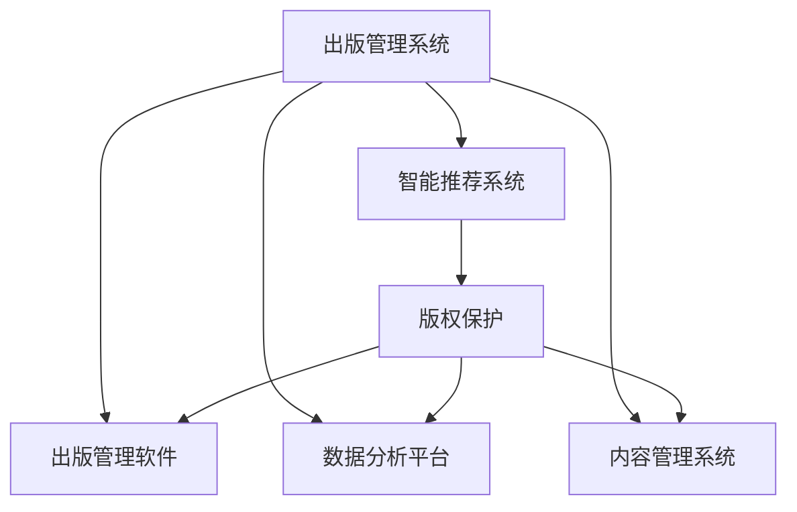

                 

# AI出版业的动态：场景驱动的技术更新

> 关键词：出版行业,人工智能,机器学习,深度学习,自然语言处理(NLP),出版管理系统,智能推荐,版权保护

## 1. 背景介绍

### 1.1 问题由来
随着互联网和数字化技术的发展，出版业正经历着前所未有的变革。数字出版物的普及使得出版商和作者面临巨大的挑战，传统的纸质出版方式逐渐被数字化、网络化取代。同时，读者对内容的需求也日益个性化、多样化，传统的出版流程难以满足这种需求。

在这样的背景下，出版业正积极寻求技术创新，通过人工智能、大数据等手段提升出版的效率和质量。人工智能技术的引入，尤其是在出版管理、内容推荐、版权保护等方面的应用，正在逐步改变出版业的运行模式，促进出版业的数字化转型。

### 1.2 问题核心关键点
当前出版业中的AI技术应用，主要集中在以下几个方面：

- 出版管理系统：通过人工智能技术，优化出版流程，提高出版效率，降低运营成本。
- 智能推荐系统：根据读者的阅读习惯和偏好，推荐适合的出版物，提升用户体验。
- 版权保护：利用AI技术，检测盗版和侵权行为，保护作者的合法权益。

这些AI应用的核心关键点在于场景驱动的技术更新。通过深入理解出版业的具体需求和痛点，针对性地引入AI技术，从而提升出版业的运营效率和用户体验。

## 2. 核心概念与联系

### 2.1 核心概念概述

为了更好地理解出版业中AI技术的应用，本节将介绍几个关键概念及其相互关系：

- 人工智能(Artificial Intelligence, AI)：通过模拟人类智能行为，实现对复杂问题的自动处理和决策。
- 出版管理系统(Publishing Management System)：指利用信息技术对出版物生产、营销、销售等环节进行全面管理，以提高出版效率和运营效果。
- 智能推荐系统(Intelligent Recommendation System)：通过分析用户的行为和偏好，推荐合适的出版物内容，提升用户体验。
- 版权保护(Copyright Protection)：利用AI技术检测和打击盗版、侵权行为，保护作者的合法权益。

这些概念之间的逻辑关系可以通过以下Mermaid流程图来展示：



这个流程图展示了一些关键概念之间的联系：

1. 出版管理系统使用出版管理软件、数据分析平台和内容管理系统等工具，实现对出版物生产的全面管理。
2. 智能推荐系统依托数据分析平台和内容管理系统，根据用户行为和偏好推荐合适的出版物。
3. 版权保护系统通过数据分析平台和内容管理系统，检测和打击盗版、侵权行为，保护作者的合法权益。

## 3. 核心算法原理 & 具体操作步骤
### 3.1 算法原理概述

AI技术在出版业中的应用，基于其强大的数据处理和分析能力，通过自动化、智能化手段提升出版业各个环节的效率和准确性。以下是一些核心算法原理：

- **机器学习(Machine Learning, ML)**：通过对大量数据的学习，发现其中的规律和模式，用于分类、聚类、回归等任务。在出版业中，机器学习可以用于内容推荐、版权保护等场景。
- **深度学习(Deep Learning, DL)**：基于多层次神经网络模型，实现对复杂数据和非线性关系的建模。深度学习在出版业中的应用包括出版管理系统、智能推荐系统等。
- **自然语言处理(Natural Language Processing, NLP)**：通过算法实现对自然语言的处理，包括文本分类、情感分析、命名实体识别等任务。在出版业中，NLP技术用于版权保护和出版管理系统。

### 3.2 算法步骤详解

AI技术在出版业中的应用，通常遵循以下步骤：

**Step 1: 数据准备**
- 收集出版物相关的数据，包括出版流程、用户行为、版权信息等。
- 对数据进行清洗和预处理，如去除噪声、填充缺失值等。

**Step 2: 模型训练**
- 选择适合的算法和模型结构，如线性回归、随机森林、卷积神经网络(CNN)、循环神经网络(RNN)等。
- 将处理后的数据分为训练集和测试集，用于模型的训练和评估。
- 使用训练集数据，优化模型参数，直到模型性能达到预期。

**Step 3: 模型部署**
- 将训练好的模型部署到出版管理系统中，实现自动化的智能化处理。
- 对模型进行监控和维护，确保其在实际应用中的稳定性和可靠性。

**Step 4: 效果评估**
- 使用测试集数据，评估模型在实际场景中的效果。
- 根据评估结果，调整模型参数或选择新的算法，提升模型性能。

### 3.3 算法优缺点

AI技术在出版业中的应用，具有以下优点：

- **效率提升**：通过自动化、智能化的处理，大大提高出版业的运营效率，降低人力成本。
- **决策支持**：提供科学的决策依据，帮助出版商和作者做出更优的决策。
- **用户体验提升**：智能推荐系统等应用，提升读者的阅读体验和满意度。

同时，AI技术也存在一些局限性：

- **数据依赖**：AI技术的效果很大程度上依赖于数据的质量和数量。在出版业中，数据的获取和处理需要时间和资源。
- **技术门槛**：AI技术的引入需要一定的技术积累和人才储备。出版业中小企业可能难以承受高昂的技术成本。
- **隐私保护**：出版业中的AI应用需要处理大量用户数据，如何保护用户隐私，是一个需要解决的问题。
- **模型复杂性**：复杂的深度学习模型需要大量的计算资源和存储空间，可能对出版商的硬件设备提出较高的要求。

## 4. 数学模型和公式 & 详细讲解 & 举例说明

### 4.1 数学模型构建

以智能推荐系统为例，其数学模型可以表示为：

$$
R(u,v) = f(u,v;\theta)
$$

其中 $u$ 表示用户，$v$ 表示出版物，$f$ 为推荐函数，$\theta$ 为模型参数。推荐函数可以基于协同过滤、内容推荐、混合模型等多种算法。

### 4.2 公式推导过程

以协同过滤算法为例，其基本思路是通过找到与用户 $u$ 兴趣相似的用户 $u'$，推荐其喜欢的出版物 $v'$。具体公式如下：

$$
R(u,v) = \sum_{u'}\alpha_{uu'}R(u',v')
$$

其中 $\alpha_{uu'}$ 表示用户 $u$ 和用户 $u'$ 之间的相似度，$R(u',v')$ 表示用户 $u'$ 对出版物 $v'$ 的评分。

### 4.3 案例分析与讲解

假设一个出版商有一个电商平台，希望通过AI技术为用户推荐适合的出版物。具体步骤如下：

1. **数据准备**：收集用户的历史购买记录、浏览历史、评分记录等数据。
2. **模型训练**：使用协同过滤算法，训练出一个推荐模型。
3. **模型部署**：将训练好的模型部署到推荐系统中，实时为用户推荐出版物。
4. **效果评估**：使用A/B测试等方法，评估推荐系统的效果，调整模型参数。

## 5. 项目实践：代码实例和详细解释说明
### 5.1 开发环境搭建

在开发出版业中的AI应用时，需要以下环境：

1. **编程语言**：Python是常用的编程语言，适合开发复杂的算法和模型。
2. **框架和库**：常用的深度学习框架如TensorFlow、PyTorch，自然语言处理库如NLTK、SpaCy。
3. **数据库**：用于存储出版物数据、用户行为数据等。
4. **云计算平台**：如AWS、阿里云等，提供强大的计算资源和存储资源。

### 5.2 源代码详细实现

以下是一个简单的出版物推荐系统的代码实现：

```python
import pandas as pd
from sklearn.feature_extraction.text import TfidfVectorizer
from sklearn.metrics.pairwise import cosine_similarity
from sklearn.decomposition import TruncatedSVD

# 数据准备
data = pd.read_csv('user_data.csv')
user_ids = data['user_id']
items = data['item_id']
ratings = data['rating']

# 用户-物品评分矩阵
user_item_ratings = pd.DataFrame(ratings, columns=items)

# 特征提取
vectorizer = TfidfVectorizer()
user_item_features = vectorizer.fit_transform(user_item_ratings)

# SVD降维
svd = TruncatedSVD(n_components=50)
user_item_svd = svd.fit_transform(user_item_features)

# 计算相似度
similarities = cosine_similarity(user_item_svd, user_item_svd)

# 推荐函数
def recommend(user_id):
    user_row = similarities[user_id]
    user_idx = np.argsort(user_row)[-10:]
    recommended_items = [item for item in items if user_row[item] > 0.3 and item not in ratings]
    return recommended_items

# 测试推荐系统
recommended_items = recommend(12345)
print(recommended_items)
```

### 5.3 代码解读与分析

上述代码中，首先通过Pandas库读取用户数据，并构建用户-物品评分矩阵。接着，使用TF-IDF特征提取器提取评分矩阵的特征，并使用SVD进行降维。最后，计算用户之间的相似度，并根据相似度推荐物品。

## 6. 实际应用场景

### 6.1 出版管理系统

出版管理系统是出版业中应用最广泛的AI技术之一。其主要功能包括：

- **出版流程管理**：自动化处理出版流程，从稿件接收、编辑、校对、排版到印刷、发货等环节，提升出版效率。
- **库存管理**：自动管理出版物的库存，实时监控库存状态，避免缺货或积压。
- **财务分析**：通过数据分析，预测销售趋势，优化成本和定价策略。

出版管理系统的AI应用包括：

- **自动化编辑**：使用NLP技术，自动校正拼写、语法错误，提升编辑效率。
- **自动化校对**：通过OCR技术，自动识别文档中的错误，提升校对速度和准确性。
- **自动排版**：使用机器学习算法，自动排版版面，优化排版效果。

### 6.2 智能推荐系统

智能推荐系统是提升用户阅读体验的重要手段。其主要功能包括：

- **个性化推荐**：根据用户的历史行为和偏好，推荐适合的出版物。
- **相关推荐**：推荐与当前出版物相关的其他出版物，丰富用户阅读内容。
- **热门推荐**：推荐当前热门的出版物，帮助用户了解最新的出版动态。

智能推荐系统的AI应用包括：

- **协同过滤**：通过分析用户的历史行为，推荐用户感兴趣的其他出版物。
- **内容推荐**：通过分析出版物的特征，推荐内容相似的出版物。
- **混合模型**：结合协同过滤和内容推荐等多种算法，提升推荐效果。

### 6.3 版权保护

版权保护是出版业中不可忽视的重要问题。其主要功能包括：

- **盗版检测**：检测盗版出版物，保护作者的合法权益。
- **侵权打击**：通过AI技术，打击侵权行为，维护市场秩序。
- **版权登记**：自动登记出版物版权信息，方便版权管理。

版权保护的AI应用包括：

- **图像识别**：通过图像识别技术，检测盗版图书的封面和内容。
- **文本匹配**：通过NLP技术，检测侵权出版物的文本内容。
- **区块链技术**：利用区块链技术，记录出版物的版权信息，防止篡改。

## 7. 工具和资源推荐

### 7.1 学习资源推荐

为了帮助开发者系统掌握出版业中的AI技术，这里推荐一些优质的学习资源：

1. **Coursera上的“数据科学基础”课程**：由约翰·霍普金斯大学开设，涵盖数据处理、机器学习等基础知识。
2. **Udacity上的“深度学习与自然语言处理”课程**：由Google DeepMind开源，介绍深度学习和NLP技术。
3. **Kaggle上的出版业数据集**：提供大量的出版业数据集，供用户进行实践和竞赛。
4. **斯坦福大学的CS224N课程**：介绍自然语言处理的最新进展，涵盖NLP的各种任务。
5. **《深度学习在出版业中的应用》书籍**：由出版业资深专家撰写，系统介绍AI技术在出版业中的应用案例。

通过对这些资源的学习实践，相信你一定能够快速掌握出版业中的AI技术，并用于解决实际的出版问题。

### 7.2 开发工具推荐

高效的开发离不开优秀的工具支持。以下是几款用于出版业AI开发的常用工具：

1. **Python**：通用的编程语言，适合开发复杂的算法和模型。
2. **TensorFlow**：谷歌开源的深度学习框架，生产部署方便，适合大规模工程应用。
3. **PyTorch**：Facebook开源的深度学习框架，灵活性高，适合研究和原型开发。
4. **Keras**：高层次的深度学习框架，易于上手，适合初学者。
5. **NLTK**：Python的自然语言处理库，提供了丰富的NLP工具。
6. **Scikit-learn**：Python的机器学习库，提供了各种经典算法和工具。

合理利用这些工具，可以显著提升出版业AI开发的效率，加快创新迭代的步伐。

### 7.3 相关论文推荐

出版业中的AI技术发展源于学界的持续研究。以下是几篇奠基性的相关论文，推荐阅读：

1. **《基于机器学习的出版物推荐系统研究》**：介绍机器学习在出版物推荐中的应用。
2. **《出版业中的版权保护技术研究》**：介绍版权保护中AI技术的应用。
3. **《深度学习在出版业中的应用》**：介绍深度学习在出版业中的各种应用。
4. **《出版业中的智能管理系统研究》**：介绍智能管理系统中AI技术的应用。

这些论文代表了大语言模型微调技术的发展脉络。通过学习这些前沿成果，可以帮助研究者把握学科前进方向，激发更多的创新灵感。

## 8. 总结：未来发展趋势与挑战

### 8.1 总结

本文对出版业中的AI技术进行了全面系统的介绍。首先阐述了出版业中AI技术的应用背景和意义，明确了AI技术在出版流程、智能推荐、版权保护等方面的应用价值。其次，从原理到实践，详细讲解了出版业中的AI技术应用流程，提供了出版业中AI应用的完整代码实例。同时，本文还探讨了AI技术在出版业中的应用场景，展示了AI技术在出版业中的广阔前景。

通过本文的系统梳理，可以看到，AI技术正在成为出版业的重要工具，极大地提升了出版业的运营效率和用户体验。未来，伴随AI技术的不断进步，出版业将在智能化、数字化、个性化方面迎来更多突破。

### 8.2 未来发展趋势

展望未来，出版业中的AI技术将呈现以下几个发展趋势：

1. **智能化提升**：通过AI技术，出版商将能够更准确地预测市场需求，优化生产流程，提升运营效率。
2. **个性化增强**：基于用户行为和偏好的AI推荐系统，将进一步提升用户的阅读体验和满意度。
3. **版权保护加强**：通过AI技术，检测和打击盗版、侵权行为，保护作者的合法权益。
4. **自动化增强**：自动化编辑、校对、排版等技术，将进一步提升出版效率，降低人力成本。
5. **跨界融合**：AI技术将与其他技术（如区块链、大数据）结合，提升出版业的数字化水平。

这些趋势凸显了AI技术在出版业中的广泛应用前景。AI技术的不断演进，将为出版业带来更多的创新和机遇，推动出版业的数字化转型。

### 8.3 面临的挑战

尽管AI技术在出版业中的应用已经取得一定进展，但在迈向更加智能化、普适化应用的过程中，仍面临诸多挑战：

1. **数据质量问题**：出版业的数据质量问题较多，如数据不完整、噪声等，可能会影响AI模型的效果。
2. **技术门槛**：AI技术的应用需要一定的技术积累和人才储备，中小企业可能难以承担高昂的技术成本。
3. **隐私保护**：出版业中的AI应用需要处理大量用户数据，如何保护用户隐私，是一个需要解决的问题。
4. **模型复杂性**：复杂的深度学习模型需要大量的计算资源和存储空间，可能对出版商的硬件设备提出较高的要求。

这些挑战需要业界共同努力，通过技术创新和资源整合，不断优化AI应用，提升出版业的智能化水平。

### 8.4 研究展望

面对出版业中的AI应用所面临的挑战，未来的研究需要在以下几个方面寻求新的突破：

1. **数据质量提升**：通过数据清洗、去噪等手段，提升出版业中数据的质量。
2. **技术门槛降低**：通过开源技术、云计算等方式，降低AI技术应用的门槛，让更多中小企业能够应用AI技术。
3. **隐私保护加强**：开发隐私保护技术，保护用户数据隐私。
4. **模型简化**：研究更高效的模型算法，降低对计算资源和存储空间的需求。
5. **跨界应用探索**：探索AI技术与其他技术（如区块链、大数据）的结合应用，提升出版业的数字化水平。

这些研究方向将引领出版业中的AI应用不断向前，为出版业的数字化转型提供新的思路和方法。

## 9. 附录：常见问题与解答

**Q1：AI技术在出版业中的应用是否会取代人工编辑？**

A: AI技术在出版业中的应用，主要是辅助人工编辑，提升编辑效率和质量，而不是取代人工编辑。AI技术可以用于自动校正拼写、语法错误，快速生成目录、索引等辅助编辑工作，但不能完全替代人工编辑。出版商仍然需要专业的编辑人员进行内容审核和创意策划。

**Q2：出版商如何选择适合的AI技术应用？**

A: 出版商在选择AI技术应用时，需要考虑以下因素：

1. **需求分析**：明确自身业务需求，选择合适的AI应用场景。
2. **技术评估**：评估AI技术的性能、可靠性和安全性，选择合适的技术方案。
3. **资源投入**：评估自身的技术能力和资源投入，确定AI应用实施的可行性。
4. **市场反馈**：通过试运行等方式，收集市场反馈，优化AI应用。

**Q3：如何保护出版业中的用户数据隐私？**

A: 出版业中的AI应用需要处理大量用户数据，如何保护用户数据隐私是一个重要问题。以下是一些常见的方法：

1. **数据匿名化**：对用户数据进行匿名化处理，保护用户隐私。
2. **数据加密**：对用户数据进行加密处理，防止数据泄露。
3. **访问控制**：限制对敏感数据的访问权限，保护数据安全。
4. **隐私保护技术**：如差分隐私、联邦学习等技术，保护用户隐私。

**Q4：出版商应该如何应对AI技术带来的挑战？**

A: 出版商应该从以下几个方面应对AI技术带来的挑战：

1. **数据质量提升**：通过数据清洗、去噪等手段，提升出版业中数据的质量。
2. **技术门槛降低**：通过开源技术、云计算等方式，降低AI技术应用的门槛，让更多中小企业能够应用AI技术。
3. **隐私保护加强**：开发隐私保护技术，保护用户数据隐私。
4. **模型简化**：研究更高效的模型算法，降低对计算资源和存储空间的需求。

**Q5：如何评估出版业中AI应用的效果？**

A: 出版业中AI应用的效果评估可以通过以下指标：

1. **效率提升**：评估AI技术对出版流程的自动化程度，提升效率的百分比。
2. **成本降低**：评估AI技术对运营成本的降低效果，降低成本的百分比。
3. **用户体验**：通过用户满意度调查等方式，评估AI技术对用户体验的提升效果。
4. **效果指标**：如点击率、转化率、推荐准确率等，评估AI技术对业务目标的达成效果。

这些指标可以帮助出版商评估AI应用的效果，优化技术应用。

---

作者：禅与计算机程序设计艺术 / Zen and the Art of Computer Programming

