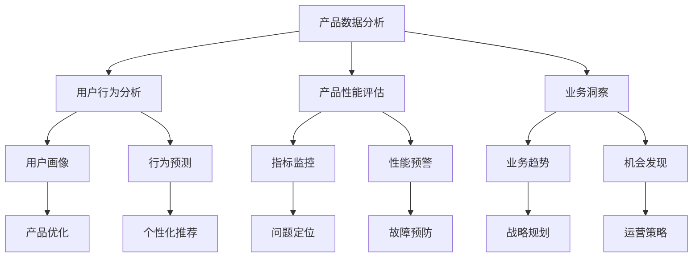

                 

## 1. 背景介绍

### 1.1 问题由来

在当今竞争激烈的互联网行业中，AI创业公司面临着众多挑战：如何在激烈的市场竞争中脱颖而出，如何快速响应用户需求，如何准确把握业务痛点，如何高效分配资源，如何进行产品迭代优化，如何监测和评估业务表现，等等。这一切都离不开深入的产品数据分析。产品数据分析不仅仅是业务增长的工具，更是AI创业公司持续迭代、精准决策的核心支撑。

### 1.2 问题核心关键点

产品数据分析的核心在于利用数据挖掘、机器学习、自然语言处理等技术手段，对产品使用数据进行深入分析和建模，从而提升产品体验、优化业务流程、提高决策精准性。具体包括：

- 用户行为分析：识别用户行为模式，理解用户需求和痛点。
- 产品性能评估：测量产品各项指标，监控性能波动。
- 业务洞察：挖掘数据背后的业务规律，为公司战略规划提供支撑。

这些关键点构成了产品数据分析的基本框架，帮助AI创业公司把握业务脉搏，提升产品竞争力。

### 1.3 问题研究意义

深入理解用户行为、产品性能和业务洞察，对于AI创业公司而言至关重要。有效的产品数据分析：

- 可以精准定位用户需求，提升用户体验，增强用户粘性，实现业务增长。
- 可以实时监控产品性能，快速识别问题，提升产品稳定性，降低故障率。
- 可以深入挖掘数据价值，发现新业务机会，优化运营策略，优化产品迭代路径。
- 可以为公司高层决策提供数据支撑，避免主观臆断，提升决策质量。

## 2. 核心概念与联系

### 2.1 核心概念概述

为更好地理解产品数据分析的全貌，本节将介绍几个关键概念及其相互联系：

- **产品数据分析(Product Analytics)**：通过对产品使用数据进行深度挖掘，理解用户行为、评估产品性能，从而提升产品体验、优化业务流程的科学方法。
- **用户行为分析(User Behavior Analysis)**：通过分析用户在产品中的使用数据，识别行为模式，理解需求和痛点，指导产品迭代方向。
- **产品性能评估(Product Performance Assessment)**：通过统计和分析产品的各项指标，测量产品性能，监控性能波动，为产品优化提供数据支撑。
- **业务洞察(Business Insight)**：通过对业务数据和产品数据进行深度分析，挖掘数据背后的业务规律，为公司战略规划提供科学依据。
- **数据仓库(Data Warehouse)**：集中管理、存储各类业务数据的系统平台，为数据分析提供数据支持。
- **数据可视化(Data Visualization)**：将数据分析结果以直观图形展示，方便理解、决策。
- **机器学习(Machine Learning)**：通过构建数据分析模型，自动化提取数据特征，提升分析准确性。

这些概念之间的逻辑关系可以通过以下Mermaid流程图来展示：



这个流程图展示了几类关键概念及其关系：

1. **产品数据分析**是核心，通过用户行为分析、产品性能评估、业务洞察等手段实现。
2. **用户行为分析**关注用户画像和行为预测，指导产品优化和个性化推荐。
3. **产品性能评估**侧重指标监控和性能预警，提升产品稳定性和用户体验。
4. **业务洞察**关注业务趋势和机会发现，支持战略规划和运营策略优化。
5. **数据仓库和数据可视化**提供数据分析的基础支持。
6. **机器学习**提升数据分析的自动化和精准性。

## 3. 核心算法原理 & 具体操作步骤
### 3.1 算法原理概述

产品数据分析的本质是对大规模数据进行清洗、提取、建模、可视化，从而实现对业务数据的深度理解和洞察。这一过程通常涉及以下几个关键步骤：

1. **数据收集**：从产品使用日志、用户反馈、业务报表等多个渠道收集数据。
2. **数据清洗**：对原始数据进行格式转换、缺失值填充、异常值处理等操作，保证数据质量。
3. **特征提取**：从数据中提取出关键特征，用于后续建模分析。
4. **模型构建**：利用机器学习、自然语言处理等技术，构建数据分析模型。
5. **数据分析**：通过模型对数据进行深度分析，挖掘用户行为模式、产品性能指标、业务规律等。
6. **数据可视化**：将分析结果以直观图形展示，便于理解、决策。

### 3.2 算法步骤详解

#### 3.2.1 数据收集

数据收集是产品数据分析的基础。主要数据来源包括：

- **产品使用日志**：记录用户操作路径、事件、时间戳等数据。
- **用户反馈数据**：通过问卷调查、用户评论、应用评分等渠道收集用户反馈。
- **业务报表数据**：从财务报表、客户关系管理系统等渠道获取业务数据。
- **社交媒体数据**：通过爬虫等技术，从社交媒体平台获取用户讨论和评价数据。
- **第三方数据源**：如公开数据库、统计年鉴、行业报告等。

#### 3.2.2 数据清洗

数据清洗是为了去除噪声、缺失值和不一致性，确保数据质量。主要步骤包括：

- **格式转换**：将不同格式的数据转换为统一的格式，方便后续处理。
- **缺失值处理**：对缺失值进行填充或删除，保证数据的完整性。
- **异常值处理**：识别和处理异常值，避免对模型产生不良影响。

#### 3.2.3 特征提取

特征提取是将原始数据转化为可用于建模的特征。常用的方法包括：

- **统计特征**：如均值、方差、最大值、最小值等。
- **文本特征**：如词频、TF-IDF、情感分析结果等。
- **时序特征**：如时间序列、滑动窗口等。
- **行为特征**：如点击率、停留时间、页面浏览深度等。

#### 3.2.4 模型构建

模型构建是产品数据分析的核心。常用的建模方法包括：

- **统计分析**：如回归分析、方差分析等，用于探索变量之间的关系。
- **机器学习**：如分类、回归、聚类等，用于构建预测模型。
- **深度学习**：如神经网络、卷积神经网络、循环神经网络等，用于处理复杂数据。
- **自然语言处理**：如词向量、文本分类、情感分析等，用于处理文本数据。

#### 3.2.5 数据分析

数据分析是对模型构建结果进行深入挖掘和解释。主要方法包括：

- **用户行为模式分析**：通过聚类分析、关联规则挖掘等方法，识别用户行为模式。
- **产品性能指标分析**：通过均值、方差、标准差等统计量，评估产品性能。
- **业务趋势分析**：通过时间序列分析、因果推断等方法，挖掘业务规律。

#### 3.2.6 数据可视化

数据可视化是将数据分析结果以图形展示，方便理解、决策。主要工具和方法包括：

- **图表工具**：如Tableau、PowerBI、D3.js等，用于创建各类图形。
- **交互式可视化**：如Plotly、Bokeh等，用于创建可交互的图形。
- **热力图**：用于展示数据分布和相关性。
- **时间序列图**：用于展示业务趋势和时间规律。

### 3.3 算法优缺点

产品数据分析具有以下优点：

- **客观性**：数据驱动的决策更加客观，避免了主观臆断。
- **全面性**：数据分析覆盖面广，能够全面了解业务现状。
- **及时性**：通过实时数据监测，能够快速响应业务变化。
- **可扩展性**：基于技术手段，能够灵活扩展分析方法和数据来源。

同时，也存在以下缺点：

- **数据质量依赖**：分析结果的质量很大程度上依赖于原始数据的质量。
- **模型复杂性**：构建准确模型需要高水平的数据科学技能和计算资源。
- **结果解读难度**：数据分析结果可能复杂，需要深入解读和理解。
- **业务洞察局限**：数据分析结果主要关注数据表象，可能无法深入挖掘业务本质。

### 3.4 算法应用领域

产品数据分析在各行各业均有广泛应用，具体包括：

- **电子商务**：分析用户购买行为，优化推荐系统，提升转化率。
- **金融服务**：评估客户风险，优化客户服务，提升客户满意度。
- **医疗健康**：监测患者健康状况，预测疾病风险，优化医疗服务。
- **教育培训**：分析学生学习行为，优化教学内容，提升学习效果。
- **媒体娱乐**：分析用户观看行为，优化内容推荐，提升用户粘性。
- **城市治理**：分析交通流量，优化交通管理，提升城市效率。

## 4. 数学模型和公式 & 详细讲解 & 举例说明

### 4.1 数学模型构建

#### 4.1.1 用户行为模型

用户行为模型通常通过统计和机器学习方法构建。假设有用户行为数据 $D=\{(x_i,y_i)\}_{i=1}^N$，其中 $x_i$ 为用户行为特征，$y_i$ 为行为标签。常见的用户行为模型包括：

- **聚类分析**：将用户分为不同行为类别，通过K-means等算法实现。
- **关联规则挖掘**：通过Apriori等算法，挖掘用户行为之间的关联关系。

#### 4.1.2 产品性能指标

产品性能指标通常通过统计方法计算。假设有产品性能数据 $D=\{(x_i,y_i)\}_{i=1}^N$，其中 $x_i$ 为产品性能特征，$y_i$ 为性能指标。常见的产品性能指标包括：

- **点击率**：$CR= \frac{\text{点击次数}}{\text{曝光次数}}$
- **转化率**：$CVR= \frac{\text{转化次数}}{\text{点击次数}}$
- **留存率**：$CRR= \frac{\text{第n日活跃用户数}}{\text{第1日活跃用户数}}$
- **跳出率**：$BPR= \frac{\text{跳出次数}}{\text{总访问次数}}$

#### 4.1.3 业务趋势模型

业务趋势模型通常通过时间序列分析方法构建。假设有业务数据 $D=\{(x_i,y_i,t)\}_{i=1}^N$，其中 $x_i$ 为业务特征，$y_i$ 为业务指标，$t$ 为时间戳。常见的业务趋势模型包括：

- **ARIMA模型**：$y_i=\phi_i+\theta_i u_i+\psi_i y_{i-1}+\delta_i \epsilon_i$，其中 $\phi_i$ 为趋势项，$\theta_i$ 为季节性项，$\psi_i$ 为自回归项，$\delta_i$ 为白噪声项。
- **因果推断**：通过Granger因果关系检验等方法，挖掘因果关系。

### 4.2 公式推导过程

#### 4.2.1 用户行为模型公式推导

假设用户行为数据 $D=\{(x_i,y_i)\}_{i=1}^N$，其中 $x_i$ 为用户行为特征，$y_i$ 为行为标签。采用K-means算法进行聚类分析：

- **输入**：$D=\{(x_i,y_i)\}_{i=1}^N$
- **输出**：$K$ 个聚类中心 $c_1,\cdots,c_K$
- **步骤**：
  1. 初始化 $K$ 个聚类中心 $c_1,\cdots,c_K$
  2. 对于每个样本 $x_i$，计算其到每个聚类中心的距离 $d_i$
  3. 将样本 $x_i$ 分配到距离最近的聚类中心 $c_k$
  4. 更新聚类中心 $c_k$
  5. 重复步骤2-4，直到收敛

聚类分析的数学公式为：

$$
d(x_i, c_k) = \frac{\sum_{i=1}^N \sum_{k=1}^K d(x_i, c_k)^2}{NK}
$$

其中 $d(x_i, c_k)$ 为样本 $x_i$ 到聚类中心 $c_k$ 的距离，$N$ 为样本数，$K$ 为聚类数。

#### 4.2.2 产品性能指标公式推导

假设产品性能数据 $D=\{(x_i,y_i)\}_{i=1}^N$，其中 $x_i$ 为产品性能特征，$y_i$ 为性能指标。假设采用线性回归模型进行建模：

- **输入**：$D=\{(x_i,y_i)\}_{i=1}^N$
- **输出**：回归模型 $\hat{y} = \theta_0 + \sum_{i=1}^p \theta_i x_i$
- **步骤**：
  1. 最小化残差平方和 $SSR = \sum_{i=1}^N (\hat{y}_i - y_i)^2$
  2. 解线性方程组 $\hat{\theta} = (X^TX)^{-1}X^Ty$
  3. 计算性能指标

线性回归的数学公式为：

$$
SSR = \sum_{i=1}^N (\hat{y}_i - y_i)^2 = \sum_{i=1}^N (\theta_0 + \sum_{i=1}^p \theta_i x_i - y_i)^2
$$

其中 $\hat{y}_i$ 为预测值，$y_i$ 为真实值，$\theta_0,\theta_i$ 为模型参数，$X$ 为特征矩阵。

#### 4.2.3 业务趋势模型公式推导

假设业务数据 $D=\{(x_i,y_i,t)\}_{i=1}^N$，其中 $x_i$ 为业务特征，$y_i$ 为业务指标，$t$ 为时间戳。采用ARIMA模型进行建模：

- **输入**：$D=\{(x_i,y_i,t)\}_{i=1}^N$
- **输出**：时间序列模型 $y_t = \phi_t + \theta_t u_t + \psi_t y_{t-1} + \delta_t \epsilon_t$
- **步骤**：
  1. 对业务数据进行平稳性检验
  2. 根据平稳性检验结果，选择合适的ARIMA模型
  3. 计算模型参数
  4. 进行模型预测

ARIMA模型的数学公式为：

$$
\hat{y}_t = \phi_t + \theta_t u_t + \psi_t \hat{y}_{t-1} + \delta_t \epsilon_t
$$

其中 $\hat{y}_t$ 为预测值，$\phi_t$ 为趋势项，$\theta_t$ 为季节性项，$\psi_t$ 为自回归项，$\delta_t$ 为白噪声项，$u_t$ 为随机误差项，$\epsilon_t$ 为白噪声项。

### 4.3 案例分析与讲解

#### 4.3.1 用户行为模型案例

假设某电商平台的订单数据，通过K-means算法进行用户行为聚类：

- **数据来源**：电商平台订单数据
- **数据特征**：用户ID、购买金额、购买频率、购买品类
- **聚类数**：K=4
- **算法实现**：Python中采用scikit-learn库实现K-means聚类

代码实现如下：

```python
from sklearn.cluster import KMeans
import pandas as pd

# 加载订单数据
data = pd.read_csv('orders.csv')

# 选择特征
features = ['amount', 'frequency', 'category']

# 进行K-means聚类
kmeans = KMeans(n_clusters=4, random_state=42)
kmeans.fit(data[features])

# 输出聚类结果
labels = kmeans.labels_
print(labels)
```

#### 4.3.2 产品性能指标案例

假设某电商平台的商品评价数据，通过线性回归模型进行点击率预测：

- **数据来源**：电商平台商品评价数据
- **数据特征**：商品ID、用户ID、点击次数、购买次数
- **预测指标**：点击率
- **算法实现**：Python中采用scikit-learn库实现线性回归

代码实现如下：

```python
from sklearn.linear_model import LinearRegression
import pandas as pd

# 加载评价数据
data = pd.read_csv('reviews.csv')

# 选择特征
features = ['user_id', 'click_count', 'purchase_count']

# 进行线性回归预测
lr = LinearRegression()
lr.fit(data[features], data['click_rate'])

# 输出预测结果
predictions = lr.predict(data[features])
print(predictions)
```

#### 4.3.3 业务趋势模型案例

假设某金融公司的交易数据，通过ARIMA模型进行交易量预测：

- **数据来源**：金融公司交易数据
- **数据特征**：时间戳、交易金额、交易次数
- **预测指标**：交易量
- **算法实现**：Python中采用statsmodels库实现ARIMA模型

代码实现如下：

```python
import statsmodels.api as sm
import pandas as pd

# 加载交易数据
data = pd.read_csv('trades.csv')

# 选择特征
features = ['timestamp', 'amount', 'count']

# 进行ARIMA模型预测
model = sm.tsa.statespace.SARIMAX(data['amount'], model='sARIMA(1,1,1)(1,1,0)[96:]', enforce_stationarity=False, enforce_invertibility=False)
results = model.fit()

# 输出预测结果
predictions = results.fittedvalues
print(predictions)
```

## 5. 项目实践：代码实例和详细解释说明

### 5.1 开发环境搭建

#### 5.1.1 Python环境

- **安装Python**：从官网下载并安装Python 3.7以上版本。
- **安装虚拟环境**：通过虚拟环境管理包（如virtualenv）创建虚拟环境，保证各项目环境隔离。

```bash
pip install virtualenv
virtualenv myenv
source myenv/bin/activate
```

#### 5.1.2 数据集准备

- **数据收集**：通过爬虫、API、文件读取等方式收集数据，并存入本地。
- **数据清洗**：使用Pandas库进行数据清洗，去除噪声、缺失值、异常值。
- **数据存储**：将清洗后的数据存入数据库或文件，方便后续查询和分析。

### 5.2 源代码详细实现

#### 5.2.1 用户行为分析

通过K-means聚类算法进行用户行为分析：

```python
from sklearn.cluster import KMeans
import pandas as pd

# 加载用户行为数据
data = pd.read_csv('user_behavior.csv')

# 选择特征
features = ['click_rate', 'session_time', 'purchase_frequency']

# 进行K-means聚类
kmeans = KMeans(n_clusters=4, random_state=42)
kmeans.fit(data[features])

# 输出聚类结果
labels = kmeans.labels_
print(labels)
```

#### 5.2.2 产品性能评估

通过线性回归模型进行产品性能评估：

```python
from sklearn.linear_model import LinearRegression
import pandas as pd

# 加载产品性能数据
data = pd.read_csv('product_performance.csv')

# 选择特征
features = ['price', 'avg_rating', 'num_reviews']

# 进行线性回归预测
lr = LinearRegression()
lr.fit(data[features], data['conversion_rate'])

# 输出预测结果
predictions = lr.predict(data[features])
print(predictions)
```

#### 5.2.3 业务趋势分析

通过ARIMA模型进行业务趋势分析：

```python
import statsmodels.api as sm
import pandas as pd

# 加载业务趋势数据
data = pd.read_csv('business_trend.csv')

# 选择特征
features = ['timestamp', 'revenue', 'discount_rate']

# 进行ARIMA模型预测
model = sm.tsa.statespace.SARIMAX(data['revenue'], model='sARIMA(1,1,1)(1,1,0)[96:]', enforce_stationarity=False, enforce_invertibility=False)
results = model.fit()

# 输出预测结果
predictions = results.fittedvalues
print(predictions)
```

### 5.3 代码解读与分析

#### 5.3.1 用户行为分析代码解读

- **数据加载**：通过Pandas库加载CSV格式的数据。
- **特征选择**：选择点击率、会话时间和购买频率等关键特征。
- **K-means聚类**：使用scikit-learn库的KMeans算法进行聚类分析。
- **聚类结果输出**：获取聚类标签，方便后续分析。

#### 5.3.2 产品性能评估代码解读

- **数据加载**：通过Pandas库加载CSV格式的数据。
- **特征选择**：选择价格、平均评分和评论数量等关键特征。
- **线性回归预测**：使用scikit-learn库的LinearRegression算法进行线性回归预测。
- **预测结果输出**：获取预测的点击率，用于产品性能评估。

#### 5.3.3 业务趋势分析代码解读

- **数据加载**：通过Pandas库加载CSV格式的数据。
- **特征选择**：选择时间戳、收入和折扣率等关键特征。
- **ARIMA模型预测**：使用statsmodels库的SARIMAX算法进行ARIMA模型预测。
- **预测结果输出**：获取预测的收入，用于业务趋势分析。

### 5.4 运行结果展示

#### 5.4.1 用户行为分析结果

- **聚类结果**：将用户分为4类，每类用户行为模式有所不同。
- **特征分布**：各聚类用户在特征空间的分布情况。

#### 5.4.2 产品性能评估结果

- **预测结果**：不同特征下，产品性能指标的预测值。
- **性能评估**：模型预测结果与实际数据的对比，评估模型准确性。

#### 5.4.3 业务趋势分析结果

- **预测结果**：不同时间点，业务指标的预测值。
- **趋势分析**：业务指标的趋势变化，揭示业务规律。

## 6. 实际应用场景

### 6.1 电商平台的用户行为分析

#### 6.1.1 问题背景

某电商平台希望通过用户行为分析，了解用户购买行为模式，优化推荐系统，提升用户粘性和转化率。

#### 6.1.2 解决方案

- **数据收集**：收集用户的浏览、点击、购买等行为数据。
- **特征提取**：提取用户ID、购买金额、购买频率、购买品类等关键特征。
- **聚类分析**：通过K-means聚类算法，将用户分为不同行为类别。
- **用户画像**：根据聚类结果，构建不同用户画像，指导推荐系统优化。
- **个性化推荐**：根据用户画像，推荐最符合用户兴趣的商品。

#### 6.1.3 应用效果

- **用户粘性提升**：通过个性化推荐，提升用户购买意愿。
- **转化率提高**：通过优化推荐系统，提高商品转化率。

### 6.2 金融公司的业务趋势分析

#### 6.2.1 问题背景

某金融公司希望通过业务趋势分析，预测市场变化，优化投资策略，提升收益。

#### 6.2.2 解决方案

- **数据收集**：收集金融市场数据，包括交易量、交易金额、交易时间等。
- **特征提取**：提取时间戳、交易金额、交易次数等关键特征。
- **ARIMA模型预测**：通过ARIMA模型，预测市场交易量变化趋势。
- **投资决策**：根据预测结果，优化投资策略，提升收益。

#### 6.2.3 应用效果

- **市场预测准确**：通过ARIMA模型，提升市场预测准确性。
- **投资策略优化**：根据预测结果，优化投资组合，提升收益。

## 7. 工具和资源推荐

### 7.1 学习资源推荐

#### 7.1.1 书籍推荐

- **《数据科学与机器学习实战》**：介绍数据科学和机器学习的实战应用，涵盖多种数据分析方法。
- **《Python数据科学手册》**：介绍Python在数据科学中的应用，包括数据清洗、数据可视化、机器学习等。
- **《深度学习》**：全面介绍深度学习理论和方法，适合有一定编程基础的读者。

#### 7.1.2 课程推荐

- **Coursera《数据科学专业认证》**：由约翰霍普金斯大学开设，涵盖数据科学核心课程。
- **edX《数据科学与机器学习》**：由加州大学伯克利分校开设，适合初学者的入门课程。
- **Udacity《深度学习纳米学位》**：由Udacity与斯坦福大学合作，涵盖深度学习核心课程。

#### 7.1.3 社区推荐

- **Kaggle**：数据科学竞赛平台，提供大量开源数据集和社区资源。
- **GitHub**：全球最大的开源代码托管平台，汇集了众多数据分析和机器学习项目。
- **Stack Overflow**：程序员问答社区，提供大量技术问题解答和讨论。

### 7.2 开发工具推荐

#### 7.2.1 数据处理工具

- **Pandas**：Python中的数据处理库，适合处理结构化数据。
- **NumPy**：Python中的数值计算库，适合处理大量数值数据。
- **SciPy**：Python中的科学计算库，适合处理复杂的数值计算和优化问题。

#### 7.2.2 数据可视化工具

- **Tableau**：商业级数据可视化工具，支持多种数据源和图表类型。
- **PowerBI**：微软推出的数据可视化工具，支持交互式图表和报表。
- **D3.js**：JavaScript库，支持创建高度自定义的交互式图表。

#### 7.2.3 机器学习库

- **scikit-learn**：Python中的机器学习库，提供多种经典算法实现。
- **TensorFlow**：Google推出的深度学习框架，适合构建复杂神经网络模型。
- **PyTorch**：Facebook推出的深度学习框架，支持动态图和静态图，适合快速迭代实验。

### 7.3 相关论文推荐

#### 7.3.1 用户行为分析论文

- **《用户行为分析：方法与实践》**：介绍用户行为分析的基本方法和案例实践。
- **《聚类分析：理论与应用》**：介绍聚类分析的理论和实际应用，涵盖多种聚类算法。
- **《用户行为预测：方法与技术》**：介绍用户行为预测的方法和工具，涵盖多种机器学习算法。

#### 7.3.2 产品性能评估论文

- **《电商平台的点击率预测》**：介绍基于机器学习的点击率预测方法，提升电商平台的推荐效果。
- **《金融产品的转化率评估》**：介绍金融产品的转化率评估方法，优化金融产品的设计和营销策略。
- **《产品的留存率分析》**：介绍产品的留存率分析方法，提升产品的用户粘性。

#### 7.3.3 业务趋势分析论文

- **《时间序列分析：理论与实践》**：介绍时间序列分析的理论和实际应用，涵盖多种时间序列模型。
- **《因果推断：理论与方法》**：介绍因果推断的理论和方法，提升数据分析的准确性和可信度。
- **《业务趋势预测：方法与模型》**：介绍业务趋势预测的方法和模型，提升业务决策的科学性。

## 8. 总结：未来发展趋势与挑战

### 8.1 研究成果总结

产品数据分析已成为AI创业公司中不可或缺的核心工具，通过深入挖掘用户行为、评估产品性能、挖掘业务规律，实现业务增长和优化决策。近年来，随着技术的不断发展，产品数据分析的应用领域和分析方法也在不断扩展和深化。

### 8.2 未来发展趋势

#### 8.2.1 数据源多样化

未来的产品数据分析将更加依赖多源数据融合，涵盖用户行为数据、业务数据、社交媒体数据等。通过多源数据融合，提升数据分析的全面性和准确性。

#### 8.2.2 数据分析自动化

未来的数据分析将更多依赖自动化技术，如自动化数据清洗、自动化特征提取、自动化模型构建等。通过自动化技术，提升数据分析的效率和精度。

#### 8.2.3 实时数据分析

未来的数据分析将更加注重实时性，通过流式数据处理和实时计算，实现对业务数据的实时监测和预测。实时数据分析将成为AI创业公司中重要的决策支撑工具。

#### 8.2.4 深度学习模型应用

未来的数据分析将更多依赖深度学习模型，如神经网络、卷积神经网络、循环神经网络等。通过深度学习模型，提升数据分析的深度和精准性。

### 8.3 面临的挑战

#### 8.3.1 数据隐私问题

随着数据的重要性日益凸显，数据隐私保护也成为越来越重要的课题。未来的数据分析需要更加注重数据隐私和安全，确保用户数据的合法合规使用。

#### 8.3.2 数据质量问题

数据分析的质量很大程度上依赖于原始数据的质量。未来的数据分析需要更加注重数据清洗和预处理，确保数据的完整性和一致性。

#### 8.3.3 技术复杂性

深度学习等复杂算法的应用，需要较高的技术门槛和计算资源。未来的数据分析需要更加注重技术普及和人才培养，提升数据科学技能。

#### 8.3.4 模型可解释性

深度学习等复杂算法的可解释性不足，难以解释模型的决策过程。未来的数据分析需要更加注重模型的可解释性，提升算法的透明性和可信度。

### 8.4 研究展望

未来的产品数据分析将更多依赖多源数据融合、自动化技术、实时数据分析和深度学习模型。同时，也需要注重数据隐私保护、数据质量提升、技术普及和模型可解释性。通过多方面的努力，提升产品数据分析的全面性、准确性和实效性，为AI创业公司提供强大的数据支撑。

## 9. 附录：常见问题与解答

### 9.1 常见问题

#### Q1：什么是产品数据分析？

A: 产品数据分析是对产品使用数据进行深度挖掘，理解用户行为、评估产品性能，从而提升产品体验、优化业务流程的科学方法。

#### Q2：如何选择合适的数据分析模型？

A: 选择合适的数据分析模型需要考虑数据类型、业务需求和计算资源等因素。一般来说，回归分析适用于连续型数据，分类分析适用于离散型数据，聚类分析适用于用户行为分析，时间序列分析适用于业务趋势预测。

#### Q3：数据分析结果如何解读？

A: 数据分析结果通常包含各类指标、图表和报告，需要结合业务背景进行解读。例如，用户行为分析结果可以揭示用户行为模式，产品性能评估结果可以识别性能瓶颈，业务趋势分析结果可以发现业务规律。

#### Q4：如何提升数据分析的自动化水平？

A: 提升数据分析的自动化水平，可以通过引入自动化数据清洗、自动化特征提取、自动化模型构建等技术手段。例如，使用Python中的Pandas库进行数据清洗，使用scikit-learn库进行自动化模型构建。

#### Q5：如何进行实时数据分析？

A: 实时数据分析通常需要引入流式数据处理和实时计算技术，如Apache Kafka、Apache Flink等。通过流式数据处理，可以实现对业务数据的实时监测和预测。

---

作者：禅与计算机程序设计艺术 / Zen and the Art of Computer Programming

