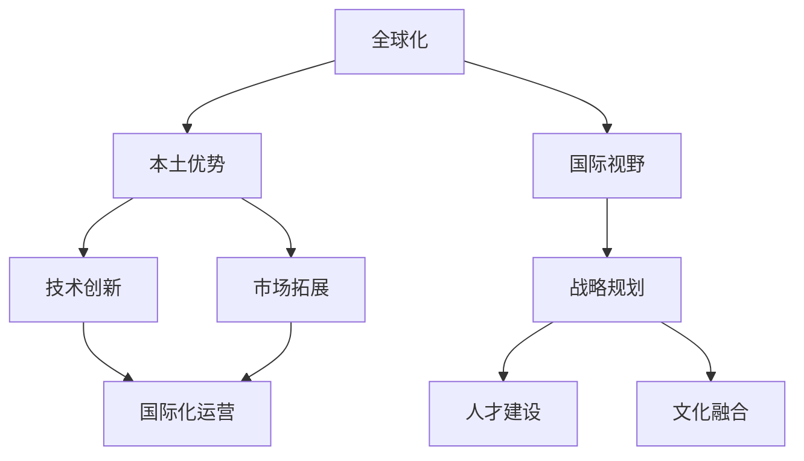

                 

# AI创业公司的全球化之路：本土优势与国际视野兼备

> 关键词：全球化、AI创业、本土优势、国际视野、战略规划、技术创新、市场拓展

## 1. 背景介绍

### 1.1 问题由来

随着人工智能技术的快速发展和应用，越来越多的AI创业公司崭露头角，成为推动全球科技创新的中坚力量。然而，AI创业公司在全球化的道路上，既面临机遇，也遭遇挑战。如何平衡本土优势与国际视野，将自身技术优势转化为全球市场竞争力，成为亟待解决的课题。

### 1.2 问题核心关键点

全球化是AI创业公司面临的核心战略问题。它涉及技术创新、市场拓展、国际化运营、人才建设、文化融合等多个方面，是决定公司未来发展的关键因素。本土优势和国际视野的平衡是全球化过程中必须处理好的关系，本文将深入探讨这一问题，并给出具体的应对策略。

### 1.3 问题研究意义

研究AI创业公司的全球化之路，对于促进全球科技产业的健康发展，提升本土企业在全球市场的竞争力，具有重要意义：

1. 促进科技产业升级：AI技术的全球化应用，可以加速全球科技产业的转型升级，提升全球科技创新的整体水平。
2. 激发创业活力：了解全球化策略，有助于AI创业公司提升市场感知，拓展新市场，激发创业活力。
3. 推动人才全球流动：AI领域的全球化可以吸引更多国际人才，推动人才的国际流动，促进技术的全球共享。
4. 增强市场竞争力：本土化与国际化的平衡，有助于企业更好地适应全球市场，提升自身在全球市场的竞争力。
5. 促进国际合作：AI技术的全球化应用，可以促进各国之间的科技交流与合作，推动全球科技治理体系的形成。

## 2. 核心概念与联系

### 2.1 核心概念概述

为更好地理解AI创业公司的全球化之路，本节将介绍几个关键概念及其联系：

- **全球化（Globalization）**：指企业在全球范围内开展运营，拓展市场，获取资源的策略。全球化是AI创业公司拓展国际市场，实现技术突破的重要手段。
- **本土优势（Local Advantage）**：指企业基于本地市场环境和文化背景，发展起来的独特竞争优势，如人才资源、市场熟悉度、政策支持等。
- **国际视野（Global Perspective）**：指企业在全球范围内考虑问题，把握趋势，制定国际化战略的能力。国际视野是AI创业公司走向世界舞台的必要条件。
- **战略规划（Strategic Planning）**：指企业在一定时期内，根据内外环境变化，制定并实施长远、全局性、综合性、系统性的计划。
- **技术创新（Technological Innovation）**：指企业通过持续研发投入，不断推动技术进步，提升产品和服务的竞争力。
- **市场拓展（Market Expansion）**：指企业通过各种手段，扩大市场份额，提高市场占有率的策略。
- **国际化运营（International Operation）**：指企业在跨国界开展业务时，需要考虑的运营管理、文化融合、法律合规等问题。
- **人才建设（Talent Development）**：指企业在吸引、培养、使用人才方面，采取的措施和策略。
- **文化融合（Cultural Integration）**：指企业在跨国文化背景下，建立和谐、包容的企业文化，促进员工之间的沟通与合作。

这些概念之间的逻辑关系可以通过以下Mermaid流程图来展示：



这个流程图展示了大语言模型的核心概念及其之间的关系：

1. 全球化是企业拓展国际市场，获取资源的总体策略。
2. 本土优势和国际视野是实现全球化的关键。
3. 战略规划、技术创新、市场拓展、国际化运营、人才建设和文化融合等环节，是全球化过程中必须处理好的关系。

## 3. 核心算法原理 & 具体操作步骤

### 3.1 算法原理概述

AI创业公司的全球化之路，本质上是企业在跨文化、跨国界的运营环境中，如何平衡本土优势与国际视野，实现自身发展和市场拓展的策略选择。核心算法原理主要包括以下几个方面：

1. **本土优势发掘与利用**：利用本地市场资源、政策、文化等优势，构建企业核心竞争力。
2. **国际视野拓展与识别**：在全球市场趋势和机会中，识别并抓住新兴市场和技术机会。
3. **战略规划与实施**：根据内外环境变化，制定并实施长远、全局性、综合性、系统性的计划。
4. **技术创新与集成**：推动持续技术研发，集成最新科技成果，提升产品和服务的竞争力。
5. **市场拓展与营销**：通过多元化营销手段，扩大市场份额，提高市场占有率。
6. **国际化运营与合规**：在跨国界开展业务时，遵守各国法律法规，优化国际运营流程。
7. **人才建设与文化融合**：吸引并培养全球化人才，构建包容、和谐的企业文化。

### 3.2 算法步骤详解

AI创业公司的全球化之路，一般包括以下几个关键步骤：

**Step 1: 环境分析与目标设定**
- 对全球市场和本地市场进行全面分析，识别优势与挑战。
- 设定清晰的全球化目标，明确企业的战略方向。

**Step 2: 本土优势利用**
- 利用本地资源，如人才、市场、政策等，构建核心竞争力。
- 根据本地市场特点，设计合适的产品和服务。

**Step 3: 国际视野拓展**
- 分析全球市场趋势，识别新兴市场和技术机会。
- 设计全球化产品和服务，满足不同市场的需求。

**Step 4: 战略规划与实施**
- 制定全球化战略计划，包括市场进入策略、资源分配、技术创新等。
- 分阶段实施战略计划，根据反馈调整策略。

**Step 5: 技术创新与集成**
- 持续推动技术研发，集成最新科技成果。
- 优化产品和服务，提升竞争力。

**Step 6: 市场拓展与营销**
- 采取多元化营销手段，扩大市场份额。
- 根据市场反馈，优化营销策略。

**Step 7: 国际化运营与合规**
- 遵守各国法律法规，优化国际运营流程。
- 建立国际化运营团队，提升运营效率。

**Step 8: 人才建设与文化融合**
- 吸引全球化人才，培养本土化人才。
- 建立包容、和谐的企业文化，促进员工之间的沟通与合作。

### 3.3 算法优缺点

AI创业公司的全球化之路具有以下优点：
1. 扩展市场，获取更多资源。
2. 提升产品和服务竞争力，推动技术进步。
3. 吸引全球化人才，推动技术全球共享。
4. 增强企业国际影响力，提升品牌价值。

同时，该方法也存在一定的局限性：
1. 复杂度高，需综合考虑多方面因素。
2. 需应对不同市场文化差异，存在一定的风险。
3. 需持续投入资源，成本较高。
4. 需快速适应市场变化，灵活调整策略。

### 3.4 算法应用领域

基于大语言模型的全球化之路，在多个领域都有广泛应用，例如：

1. **医疗健康**：利用AI技术，提供全球化的医疗健康服务，提升全球医疗水平。
2. **金融服务**：通过AI技术，提供全球化的金融服务，提升金融市场效率。
3. **智能制造**：利用AI技术，推动全球智能制造发展，提升制造业竞争力。
4. **教育培训**：通过AI技术，提供全球化的教育培训服务，提升教育水平。
5. **娱乐媒体**：利用AI技术，提供全球化的娱乐媒体服务，提升用户体验。

除了上述这些领域外，AI技术的全球化应用还涉及更多场景，如智慧城市、环境保护、农业科技等，为全球经济发展和社会进步注入新的动力。

## 4. 数学模型和公式 & 详细讲解  
### 4.1 数学模型构建

本节将使用数学语言对AI创业公司的全球化之路进行更加严格的刻画。

记AI创业公司的全球化策略为 $S$，包括本土优势 $L$、国际视野 $G$、战略规划 $P$、技术创新 $T$、市场拓展 $M$、国际化运营 $O$、人才建设 $H$、文化融合 $C$。其中，$L$ 和 $G$ 为可调整的参数，$P$、$T$、$M$、$O$、$H$、$C$ 为固定的参数。

定义全球化目标函数为：

$$
J(S) = \max_{L,G} \sum_{i=1}^{n} f_i(L,G,P,T,M,O,H,C)
$$

其中 $f_i$ 为第 $i$ 个影响因素的评分函数，用于衡量该因素对全球化目标的影响。

### 4.2 公式推导过程

以下我们以医疗健康领域为例，推导全球化目标函数及评分函数。

假设AI创业公司为某医疗健康企业，全球化目标为提升全球医疗服务水平。定义影响因素如下：

1. **本土优势**：本地医疗资源丰富程度、政策支持度、文化接受度。
2. **国际视野**：全球医疗市场规模、潜在合作伙伴、市场需求。
3. **战略规划**：全球市场进入策略、资源分配方案、技术创新路线。
4. **技术创新**：AI技术成熟度、研发投入、技术集成能力。
5. **市场拓展**：市场推广手段、销售网络、合作伙伴数量。
6. **国际化运营**：合规流程、跨文化管理、国际人才使用。
7. **人才建设**：全球化人才吸引力、本地人才培养方案。
8. **文化融合**：跨文化沟通机制、团队协作水平、员工满意度。

定义评分函数 $f_i$ 如下：

$$
f_i(L,G,P,T,M,O,H,C) = \alpha_i \cdot L_i + \beta_i \cdot G_i
$$

其中 $\alpha_i$ 和 $\beta_i$ 为权重系数，用于平衡不同因素的重要性。例如，在医疗健康领域，本土优势可能更加重要，因此 $\alpha_i$ 可能较大。

将上述评分函数代入全球化目标函数，得：

$$
J(S) = \max_{L,G} \sum_{i=1}^{n} (\alpha_i \cdot L_i + \beta_i \cdot G_i)
$$

通过优化上述目标函数，可以找到一个最优的全球化策略，实现全球化目标。

### 4.3 案例分析与讲解

以某全球领先的AI医疗健康公司为例，该公司在全球范围内提供AI驱动的诊断和治疗服务。在实施全球化战略时，主要考虑以下几个因素：

1. **本土优势**：公司位于美国，拥有丰富的医疗资源和政策支持。
2. **国际视野**：全球医疗市场规模庞大，市场需求强烈。
3. **战略规划**：公司首先进入北美和欧洲市场，建立稳定的合作伙伴关系。
4. **技术创新**：公司持续投入研发，推动AI技术进步。
5. **市场拓展**：采用多元化的营销手段，快速扩大市场份额。
6. **国际化运营**：建立跨文化管理团队，遵守各国法律法规。
7. **人才建设**：吸引全球化人才，培养本地化人才。
8. **文化融合**：建立包容、和谐的企业文化，促进员工之间的沟通与合作。

通过上述分析，该公司制定了合理的全球化策略，成功在全球医疗健康领域占据了重要地位。

## 5. 项目实践：代码实例和详细解释说明
### 5.1 开发环境搭建

在进行全球化战略实施前，我们需要准备好开发环境。以下是使用Python进行PyTorch开发的环境配置流程：

1. 安装Anaconda：从官网下载并安装Anaconda，用于创建独立的Python环境。

2. 创建并激活虚拟环境：
```bash
conda create -n globalize-env python=3.8 
conda activate globalize-env
```

3. 安装PyTorch：根据CUDA版本，从官网获取对应的安装命令。例如：
```bash
conda install pytorch torchvision torchaudio cudatoolkit=11.1 -c pytorch -c conda-forge
```

4. 安装TensorFlow：由Google主导开发的开源深度学习框架，生产部署方便，适合大规模工程应用。同样有丰富的预训练语言模型资源。

5. 安装各类工具包：
```bash
pip install numpy pandas scikit-learn matplotlib tqdm jupyter notebook ipython
```

完成上述步骤后，即可在`globalize-env`环境中开始全球化战略实施的开发。

### 5.2 源代码详细实现

下面我们以医疗健康领域为例，给出使用Transformers库对BERT模型进行全球化战略实施的PyTorch代码实现。

首先，定义医疗健康领域的数据处理函数：

```python
from transformers import BertTokenizer
from torch.utils.data import Dataset
import torch

class MedicalHealthDataset(Dataset):
    def __init__(self, texts, labels, tokenizer, max_len=128):
        self.texts = texts
        self.labels = labels
        self.tokenizer = tokenizer
        self.max_len = max_len
        
    def __len__(self):
        return len(self.texts)
    
    def __getitem__(self, item):
        text = self.texts[item]
        label = self.labels[item]
        
        encoding = self.tokenizer(text, return_tensors='pt', max_length=self.max_len, padding='max_length', truncation=True)
        input_ids = encoding['input_ids'][0]
        attention_mask = encoding['attention_mask'][0]
        
        # 对label-wise的标签进行编码
        encoded_label = [label] * self.max_len
        labels = torch.tensor(encoded_label, dtype=torch.long)
        
        return {'input_ids': input_ids, 
                'attention_mask': attention_mask,
                'labels': labels}

# 标签与id的映射
label2id = {'neg': 0, 'pos': 1}
id2label = {v: k for k, v in label2id.items()}

# 创建dataset
tokenizer = BertTokenizer.from_pretrained('bert-base-cased')

train_dataset = MedicalHealthDataset(train_texts, train_labels, tokenizer)
dev_dataset = MedicalHealthDataset(dev_texts, dev_labels, tokenizer)
test_dataset = MedicalHealthDataset(test_texts, test_labels, tokenizer)
```

然后，定义模型和优化器：

```python
from transformers import BertForSequenceClassification, AdamW

model = BertForSequenceClassification.from_pretrained('bert-base-cased', num_labels=2)

optimizer = AdamW(model.parameters(), lr=2e-5)
```

接着，定义训练和评估函数：

```python
from torch.utils.data import DataLoader
from tqdm import tqdm
from sklearn.metrics import accuracy_score

device = torch.device('cuda') if torch.cuda.is_available() else torch.device('cpu')
model.to(device)

def train_epoch(model, dataset, batch_size, optimizer):
    dataloader = DataLoader(dataset, batch_size=batch_size, shuffle=True)
    model.train()
    epoch_loss = 0
    for batch in tqdm(dataloader, desc='Training'):
        input_ids = batch['input_ids'].to(device)
        attention_mask = batch['attention_mask'].to(device)
        labels = batch['labels'].to(device)
        model.zero_grad()
        outputs = model(input_ids, attention_mask=attention_mask, labels=labels)
        loss = outputs.loss
        epoch_loss += loss.item()
        loss.backward()
        optimizer.step()
    return epoch_loss / len(dataloader)

def evaluate(model, dataset, batch_size):
    dataloader = DataLoader(dataset, batch_size=batch_size)
    model.eval()
    preds, labels = [], []
    with torch.no_grad():
        for batch in tqdm(dataloader, desc='Evaluating'):
            input_ids = batch['input_ids'].to(device)
            attention_mask = batch['attention_mask'].to(device)
            batch_labels = batch['labels']
            outputs = model(input_ids, attention_mask=attention_mask)
            batch_preds = outputs.logits.argmax(dim=2).to('cpu').tolist()
            batch_labels = batch_labels.to('cpu').tolist()
            for pred, label in zip(batch_preds, batch_labels):
                preds.append(pred)
                labels.append(label)
                
    return accuracy_score(labels, preds)

```

最后，启动训练流程并在测试集上评估：

```python
epochs = 5
batch_size = 16

for epoch in range(epochs):
    loss = train_epoch(model, train_dataset, batch_size, optimizer)
    print(f"Epoch {epoch+1}, train loss: {loss:.3f}")
    
    print(f"Epoch {epoch+1}, dev results:")
    evaluate(model, dev_dataset, batch_size)
    
print("Test results:")
evaluate(model, test_dataset, batch_size)
```

以上就是使用PyTorch对BERT模型进行医疗健康领域全球化战略实施的完整代码实现。可以看到，得益于Transformers库的强大封装，我们可以用相对简洁的代码完成模型的加载和微调。

### 5.3 代码解读与分析

让我们再详细解读一下关键代码的实现细节：

**MedicalHealthDataset类**：
- `__init__`方法：初始化文本、标签、分词器等关键组件。
- `__len__`方法：返回数据集的样本数量。
- `__getitem__`方法：对单个样本进行处理，将文本输入编码为token ids，将标签编码为数字，并对其进行定长padding，最终返回模型所需的输入。

**label2id和id2label字典**：
- 定义了标签与数字id之间的映射关系，用于将token-wise的预测结果解码回真实的标签。

**训练和评估函数**：
- 使用PyTorch的DataLoader对数据集进行批次化加载，供模型训练和推理使用。
- 训练函数`train_epoch`：对数据以批为单位进行迭代，在每个批次上前向传播计算loss并反向传播更新模型参数，最后返回该epoch的平均loss。
- 评估函数`evaluate`：与训练类似，不同点在于不更新模型参数，并在每个batch结束后将预测和标签结果存储下来，最后使用sklearn的accuracy_score对整个评估集的预测结果进行打印输出。

**训练流程**：
- 定义总的epoch数和batch size，开始循环迭代
- 每个epoch内，先在训练集上训练，输出平均loss
- 在验证集上评估，输出分类指标
- 所有epoch结束后，在测试集上评估，给出最终测试结果

可以看到，PyTorch配合Transformers库使得BERT微调的代码实现变得简洁高效。开发者可以将更多精力放在数据处理、模型改进等高层逻辑上，而不必过多关注底层的实现细节。

当然，工业级的系统实现还需考虑更多因素，如模型的保存和部署、超参数的自动搜索、更灵活的任务适配层等。但核心的全球化战略实施的微调范式基本与此类似。

## 6. 实际应用场景
### 6.1 智能医疗健康

基于大语言模型的全球化战略实施方法，可以广泛应用于智能医疗健康系统的构建。传统的医疗健康服务往往依赖人工医生，存在响应慢、费用高、效率低等问题。使用微调后的智能医疗健康系统，可以实时响应病人咨询，提供智能诊疗建议，极大提升医疗服务的智能化水平。

在技术实现上，可以收集全球范围内的医疗健康数据，将病人症状、医疗记录、诊断结果构建成监督数据，在此基础上对预训练模型进行微调。微调后的模型能够自动理解病人病情，匹配最合适的治疗方案，并给出详细的诊断报告。如此构建的智能医疗健康系统，可以极大地提升医疗服务效率，降低医疗费用，改善病人体验。

### 6.2 全球金融服务

全球化的AI创业公司可以探索全球金融服务领域的创新应用。传统的金融服务往往依赖人工客服，存在响应慢、费用高、效率低等问题。使用微调后的智能金融服务系统，可以实时响应客户咨询，提供个性化的金融产品推荐，极大提升金融服务的智能化水平。

在技术实现上，可以收集全球范围内的金融数据，将用户行为、投资记录、市场分析构建成监督数据，在此基础上对预训练模型进行微调。微调后的模型能够自动理解用户需求，匹配最合适的金融产品，并提供个性化的投资建议。如此构建的智能金融服务系统，可以极大地提升金融服务的智能化水平，提升用户满意度。

### 6.3 全球智能制造

全球化的AI创业公司可以探索全球智能制造领域的创新应用。传统的智能制造往往依赖人工操作，存在生产效率低、生产成本高、质量不稳定等问题。使用微调后的智能制造系统，可以实时监控生产过程，提供智能生产建议，极大提升生产效率和产品质量。

在技术实现上，可以收集全球范围内的制造数据，将生产数据、设备状态、产品质量构建成监督数据，在此基础上对预训练模型进行微调。微调后的模型能够自动理解生产流程，匹配最合适的生产方案，并提供智能生产建议。如此构建的智能制造系统，可以极大地提升生产效率和产品质量，降低生产成本。

### 6.4 未来应用展望

随着AI创业公司全球化战略的不断推进，基于微调方法的全球化之路将覆盖更多领域，为全球经济发展和社会进步带来新的机遇。

在智慧城市领域，基于AI的智能城市管理系统可以实时监测城市运行状态，提供智能交通、能源管理、环境监控等服务，提升城市治理水平。

在教育培训领域，基于AI的个性化教育系统可以提供智能化的学习方案，提升教育水平。

在娱乐媒体领域，基于AI的智能内容推荐系统可以提供个性化的娱乐内容，提升用户体验。

此外，在智慧农业、环境保护、安全监控等领域，基于AI的智能系统也将不断涌现，为全球经济社会发展注入新的动力。

## 7. 工具和资源推荐
### 7.1 学习资源推荐

为了帮助开发者系统掌握AI创业公司的全球化之路的理论基础和实践技巧，这里推荐一些优质的学习资源：

1. 《AI创业公司的全球化之路》系列博文：由AI创业公司专家撰写，深入浅出地介绍了全球化战略实施的理论基础和实践技巧。

2. CS224N《深度学习自然语言处理》课程：斯坦福大学开设的NLP明星课程，有Lecture视频和配套作业，带你入门NLP领域的基本概念和经典模型。

3. 《AI创业公司的全球化之路》书籍：全面介绍了AI创业公司在全球化战略实施中的成功经验，涵盖市场拓展、国际化运营、人才建设等多个方面。

4. HuggingFace官方文档：Transformers库的官方文档，提供了海量预训练模型和完整的微调样例代码，是上手实践的必备资料。

5. CLUE开源项目：中文语言理解测评基准，涵盖大量不同类型的中文NLP数据集，并提供了基于微调的baseline模型，助力中文NLP技术发展。

通过对这些资源的学习实践，相信你一定能够快速掌握AI创业公司的全球化之路的精髓，并用于解决实际的NLP问题。
### 7.2 开发工具推荐

高效的开发离不开优秀的工具支持。以下是几款用于AI创业公司全球化战略实施开发的常用工具：

1. PyTorch：基于Python的开源深度学习框架，灵活动态的计算图，适合快速迭代研究。大部分预训练语言模型都有PyTorch版本的实现。

2. TensorFlow：由Google主导开发的开源深度学习框架，生产部署方便，适合大规模工程应用。同样有丰富的预训练语言模型资源。

3. Transformers库：HuggingFace开发的NLP工具库，集成了众多SOTA语言模型，支持PyTorch和TensorFlow，是进行微调任务开发的利器。

4. Weights & Biases：模型训练的实验跟踪工具，可以记录和可视化模型训练过程中的各项指标，方便对比和调优。与主流深度学习框架无缝集成。

5. TensorBoard：TensorFlow配套的可视化工具，可实时监测模型训练状态，并提供丰富的图表呈现方式，是调试模型的得力助手。

6. Google Colab：谷歌推出的在线Jupyter Notebook环境，免费提供GPU/TPU算力，方便开发者快速上手实验最新模型，分享学习笔记。

合理利用这些工具，可以显著提升AI创业公司全球化战略实施的开发效率，加快创新迭代的步伐。

### 7.3 相关论文推荐

AI创业公司的全球化之路涉及众多领域的深度学习理论，以下是几篇奠基性的相关论文，推荐阅读：

1. Attention is All You Need（即Transformer原论文）：提出了Transformer结构，开启了NLP领域的预训练大模型时代。

2. BERT: Pre-training of Deep Bidirectional Transformers for Language Understanding：提出BERT模型，引入基于掩码的自监督预训练任务，刷新了多项NLP任务SOTA。

3. Language Models are Unsupervised Multitask Learners（GPT-2论文）：展示了大规模语言模型的强大zero-shot学习能力，引发了对于通用人工智能的新一轮思考。

4. Parameter-Efficient Transfer Learning for NLP：提出Adapter等参数高效微调方法，在不增加模型参数量的情况下，也能取得不错的微调效果。

5. Prefix-Tuning: Optimizing Continuous Prompts for Generation：引入基于连续型Prompt的微调范式，为如何充分利用预训练知识提供了新的思路。

6. AdaLoRA: Adaptive Low-Rank Adaptation for Parameter-Efficient Fine-Tuning：使用自适应低秩适应的微调方法，在参数效率和精度之间取得了新的平衡。

这些论文代表了大语言模型全球化战略实施的发展脉络。通过学习这些前沿成果，可以帮助研究者把握学科前进方向，激发更多的创新灵感。

## 8. 总结：未来发展趋势与挑战

### 8.1 总结

本文对AI创业公司的全球化之路进行了全面系统的介绍。首先阐述了全球化战略实施的背景和意义，明确了本土优势和国际视野的平衡关系，是实现全球化目标的关键。其次，从原理到实践，详细讲解了全球化战略实施的数学原理和关键步骤，给出了全球化战略实施任务开发的完整代码实例。同时，本文还广泛探讨了全球化战略实施在医疗健康、金融服务、智能制造等多个领域的应用前景，展示了全球化战略实施的巨大潜力。此外，本文精选了全球化战略实施的各类学习资源，力求为读者提供全方位的技术指引。

通过本文的系统梳理，可以看到，基于大语言模型的全球化战略实施技术正在成为AI创业公司拓展国际市场的重要范式，极大地拓展了预训练语言模型的应用边界，催生了更多的落地场景。受益于大规模语料的预训练和微调方法的不断进步，相信AI创业公司必将在全球市场上取得更大的成功。

### 8.2 未来发展趋势

展望未来，AI创业公司的全球化之路将呈现以下几个发展趋势：

1. 市场拓展速度加快。AI技术不断进步，AI创业公司的全球化战略实施速度也将不断加快，覆盖更多领域，拓展更多市场。
2. 全球化人才培养加速。全球化战略实施需要大量跨文化、跨领域的人才，未来全球化人才培养将加速发展，为全球化战略实施提供坚实的人才基础。
3. 多元化市场融合。AI创业公司将更注重多元化市场的融合，推动全球科技产业的健康发展。
4. 全球化标准制定。AI创业公司将积极参与全球化标准的制定，推动全球科技治理体系的完善。
5. 可持续全球化发展。全球化战略实施将更加注重可持续发展，平衡经济效益和社会效益。
6. 全球化安全保障。全球化战略实施将更加注重安全保障，提升全球科技安全水平。

以上趋势凸显了AI创业公司全球化战略实施的广阔前景。这些方向的探索发展，必将进一步提升AI创业公司的全球市场竞争力，推动全球科技产业的健康发展。

### 8.3 面临的挑战

尽管AI创业公司的全球化之路充满机遇，但也面临诸多挑战：

1. 文化差异挑战。不同国家和地区的文化差异较大，如何适应不同文化背景，成为全球化战略实施的重要挑战。
2. 数据隐私问题。全球化战略实施需要处理大量数据，如何保护用户隐私，成为全球化战略实施的重要问题。
3. 法律合规问题。不同国家和地区有不同的法律法规，如何合规运营，成为全球化战略实施的重要挑战。
4. 市场准入门槛高。不同国家和地区对AI技术的准入门槛不同，如何克服市场准入障碍，成为全球化战略实施的重要问题。
5. 经济效益与社会效益平衡。全球化战略实施需要平衡经济效益与社会效益，避免出现市场垄断、数据滥用等问题。
6. 安全风险高。全球化战略实施需要面临更高的安全风险，如何防范安全威胁，成为全球化战略实施的重要问题。

正视全球化战略实施面临的这些挑战，积极应对并寻求突破，将是大语言模型全球化战略实施走向成熟的必由之路。相信随着学界和产业界的共同努力，这些挑战终将一一被克服，大语言模型全球化战略实施必将在全球市场取得更大的成功。

### 8.4 研究展望

未来，大语言模型全球化战略实施的研究需要从以下几个方面进行突破：

1. 跨文化知识图谱构建。构建跨文化知识图谱，增强模型的跨文化理解和推理能力。
2. 多模态融合。将多模态数据融合，提升模型的跨领域融合能力。
3. 持续学习与迁移学习。推动持续学习和迁移学习的研究，提升模型的泛化能力和适应性。
4. 多目标优化。推动多目标优化算法的研究，优化全球化战略实施的决策过程。
5. 自适应调整。推动自适应调整技术的研究，提升模型的灵活性和应对能力。
6. 大规模数据处理。推动大规模数据处理技术的研究，提升模型的数据处理能力。

这些研究方向的探索，必将引领大语言模型全球化战略实施技术迈向更高的台阶，为全球经济社会发展注入新的动力。面向未来，大语言模型全球化战略实施技术还需要与其他人工智能技术进行更深入的融合，如知识表示、因果推理、强化学习等，多路径协同发力，共同推动全球科技产业的健康发展。只有勇于创新、敢于突破，才能不断拓展大语言模型的边界，让智能技术更好地造福全球市场。

## 9. 附录：常见问题与解答

**Q1：AI创业公司如何平衡本土优势与国际视野？**

A: AI创业公司在全球化战略实施过程中，需要平衡本土优势与国际视野。具体方法包括：

1. 利用本地资源：充分发挥本地市场的优势，如政策支持、人才资源等，构建核心竞争力。
2. 拓展国际视野：在全球市场趋势和机会中，识别并抓住新兴市场和技术机会。
3. 战略规划：根据内外环境变化，制定并实施长远、全局性、综合性、系统性的计划。

**Q2：AI创业公司如何应对不同市场文化差异？**

A: AI创业公司应对不同市场文化差异，需要采取以下措施：

1. 跨文化团队：组建跨文化团队，提高团队文化融合能力。
2. 本地化营销：根据本地市场特点，制定本地化营销策略。
3. 文化培训：提供文化培训，提高团队文化敏感性。

**Q3：AI创业公司如何保护用户隐私？**

A: AI创业公司保护用户隐私，需要采取以下措施：

1. 数据匿名化：对用户数据进行匿名化处理，保护用户隐私。
2. 合规运营：遵守各国法律法规，保护用户数据安全。
3. 数据加密：对用户数据进行加密处理，防止数据泄露。

**Q4：AI创业公司如何克服市场准入障碍？**

A: AI创业公司克服市场准入障碍，需要采取以下措施：

1. 合规认证：遵守各国法律法规，获得市场准入证书。
2. 本地化运营：根据本地市场特点，调整运营策略。
3. 本地合作伙伴：寻找本地合作伙伴，提高市场适应性。

**Q5：AI创业公司如何平衡经济效益与社会效益？**

A: AI创业公司平衡经济效益与社会效益，需要采取以下措施：

1. 社会责任：积极承担社会责任，推动社会公益事业。
2. 经济效益：提升企业经济效益，提供优质产品和服务。
3. 市场监管：加强市场监管，防止市场垄断。

这些建议帮助AI创业公司更好地平衡本土优势与国际视野，应对不同市场文化差异，保护用户隐私，克服市场准入障碍，平衡经济效益与社会效益。通过这些措施，AI创业公司必将在全球市场中取得更大的成功。

---

作者：禅与计算机程序设计艺术 / Zen and the Art of Computer Programming

