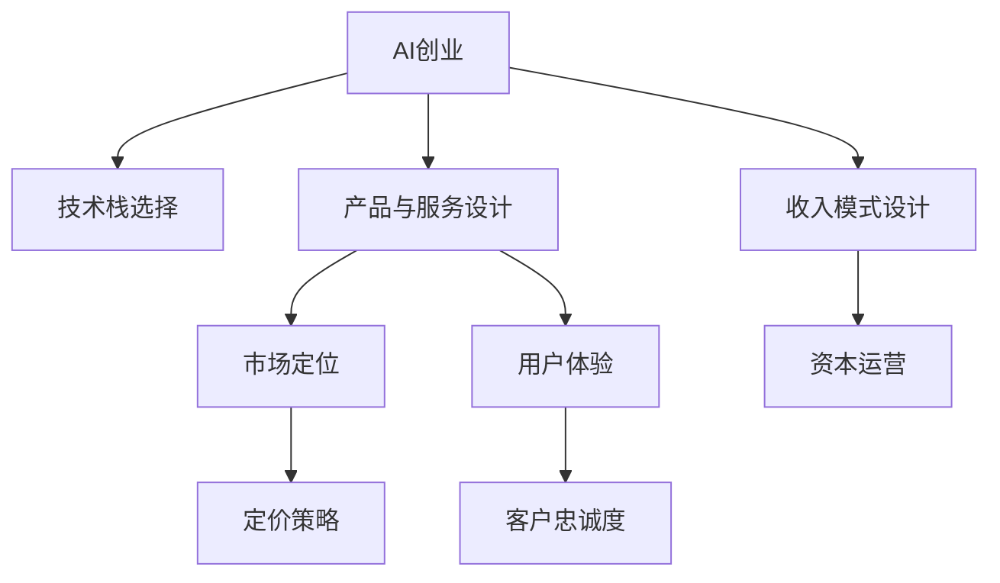

                 

# AI创业公司的商业模式创新路径

> 关键词：AI创业、商业模式、创新路径、技术栈、市场策略、资本运营

## 1. 背景介绍

### 1.1 问题由来
随着人工智能技术的迅猛发展，越来越多的初创企业开始围绕AI展开业务，探索新的商业模式和市场机会。但AI技术的应用并非一帆风顺，不少企业在AI创业的征程中遭遇失败。究其原因，除了技术因素外，商业模式设计的不合理也是重要原因。合理的商业模式能够为AI创业公司提供持续的驱动力和稳定发展的保障。本文将对AI创业公司的商业模式创新路径进行详细探讨，为创业者提供有益的参考。

### 1.2 问题核心关键点
AI创业公司商业模式的核心在于如何实现技术价值和商业价值的有效结合，形成可持续发展的商业模式。其关键点包括：
- 技术栈的选择与优化。
- 产品与服务的设计与开发。
- 市场定位与目标客户的选择。
- 定价策略与收入模式的设计。
- 资本运营与融资策略。
- 用户体验与客户忠诚度的建立。

## 2. 核心概念与联系

### 2.1 核心概念概述

为了更好地理解AI创业公司的商业模式创新路径，本节将介绍几个密切相关的核心概念：

- AI创业：利用人工智能技术进行创新创业，开发有竞争力的产品或服务。
- 技术栈：指支持企业核心业务所需的软件技术体系，包括编程语言、框架、库等。
- 产品与服务：企业提供的满足市场需求的产品或服务。
- 市场定位：企业选择目标市场，并明确其在市场中的定位。
- 定价策略：企业制定产品或服务的定价方案，包括价格水平、折扣、优惠等。
- 收入模式：企业从产品或服务中获得收入的方式，如订阅、按需付费等。
- 资本运营：企业融资、投资和资本运作的策略，包括初创期的天使投资、成长期的风险投资等。
- 用户体验：用户在使用产品或服务时的体验感受，包括易用性、功能完备性等。
- 客户忠诚度：用户对产品或服务的长期满意度和忠实程度，直接影响企业业务的持续性和扩展性。

这些概念之间的逻辑关系可以通过以下Mermaid流程图来展示：



这个流程图展示了一幅完整的AI创业商业模式链条，从技术选择到最终实现收入，再到提升用户满意度和忠诚度，每一步都息息相关，共同构成了一个可持续发展的商业模式。

## 3. 核心算法原理 & 具体操作步骤
### 3.1 算法原理概述

AI创业公司的商业模式创新，本质上是将AI技术与商业运营结合的过程。其核心算法原理包括以下几点：

- 技术栈评估与优化：选择与产品匹配的技术栈，并不断优化以提升系统性能。
- 产品与服务迭代：根据市场需求和用户反馈，不断优化产品功能和用户体验。
- 市场定位与推广：明确目标市场和用户群体，制定精准的推广策略。
- 定价与收入管理：设计合理的定价策略和收入模式，确保收入与成本的平衡。
- 资本运营与投资：通过有效的融资和资本运作，确保企业的长期可持续发展。

### 3.2 算法步骤详解

基于上述原理，AI创业公司的商业模式创新路径可以分为以下关键步骤：

**Step 1: 技术栈评估与选择**
- 明确核心业务需求，选择合适的技术栈。
- 综合考虑技术成熟度、开发成本、性能要求等因素。
- 选择开源工具和社区支持的平台，降低开发风险。
- 持续关注技术发展，适时升级或更换技术栈。

**Step 2: 产品与服务设计**
- 根据市场需求和用户反馈，设计满足目标用户需求的产品或服务。
- 通过用户调研、数据驱动等手段，获取产品功能需求和用户体验反馈。
- 敏捷开发，快速迭代，不断优化产品性能和用户体验。

**Step 3: 市场定位与推广**
- 明确目标市场和用户群体，定位产品或服务的核心价值和竞争优势。
- 制定精准的营销策略，包括内容营销、社区建设、品牌推广等。
- 结合线上线下渠道，提升品牌知名度和市场占有率。

**Step 4: 定价与收入管理**
- 根据产品成本和市场需求，设计合理的定价策略。
- 考虑灵活定价策略，如按需付费、订阅制等，满足不同用户需求。
- 管理好收入与成本，确保企业的财务健康和可持续发展。

**Step 5: 资本运营与投资**
- 制定合理的融资计划，包括天使投资、风险投资等。
- 通过投资并购等方式，扩展业务范围和提升市场竞争力。
- 合理运用资本，进行业务扩展和技术升级，实现长期增长。

**Step 6: 用户体验与客户忠诚度提升**
- 持续关注用户反馈，不断优化产品和服务。
- 提供优质的客户服务和售后支持，增强用户满意度。
- 设计忠诚度计划，如积分奖励、会员制度等，提升用户忠诚度。

### 3.3 算法优缺点

AI创业公司商业模式的优点：
- 技术领先性：采用最新的人工智能技术，具有更高的技术壁垒和市场竞争力。
- 创新性：灵活的产品设计和服务模式，能够快速响应市场变化。
- 高盈利潜力：通过高附加值的服务和高效率的运营，实现较高的利润率。

其缺点主要在于：
- 技术复杂性：AI技术复杂，开发和维护成本高。
- 市场不确定性：市场需求变化快，产品快速迭代压力较大。
- 资本需求大：初期投入大，需要足够的资本支持。
- 数据隐私风险：处理大量用户数据，面临隐私和安全性问题。

## 4. 数学模型和公式 & 详细讲解 & 举例说明
### 4.1 数学模型构建

在AI创业公司商业模式的优化过程中，涉及到多个维度的数学模型和公式。以下是几个核心模型的构建与公式推导：

**收入模型**
- 假设产品或服务的总收入为 $R$，其中 $R_1$ 为直接收入，$R_2$ 为间接收入。
- $R_1$ 可以表示为：
$$
R_1 = N \times P
$$
其中 $N$ 为销售额，$P$ 为单价。

- $R_2$ 可以表示为：
$$
R_2 = \sum_{i=1}^{n} \delta_i \times C_i
$$
其中 $n$ 为间接收入来源的数量，$\delta_i$ 为第 $i$ 个来源的占比，$C_i$ 为第 $i$ 个来源的成本。

**成本模型**
- 假设总成本为 $C$，其中 $C_1$ 为固定成本，$C_2$ 为变动成本。
- $C_1$ 可以表示为：
$$
C_1 = C_f + C_o + C_m
$$
其中 $C_f$ 为固定人员成本，$C_o$ 为固定运营成本，$C_m$ 为固定维护成本。

- $C_2$ 可以表示为：
$$
C_2 = C_v + C_i + C_s
$$
其中 $C_v$ 为变动人员成本，$C_i$ 为变动运营成本，$C_s$ 为变动维护成本。

**利润模型**
- 假设利润为 $P$，则有：
$$
P = R - C
$$
其中 $R$ 为总收入，$C$ 为总成本。

### 4.2 公式推导过程

以收入模型为例，推导过程如下：

**直接收入模型推导**
- $R_1$ 的推导基于销售量的乘积：
$$
R_1 = N \times P
$$
其中 $N$ 为销售额，$P$ 为单价。
- 假设 $N$ 为市场销售量，$P$ 为产品单价，则有：
$$
N = A \times C
$$
其中 $A$ 为市场覆盖率，$C$ 为单位客户消费。
- 代入上述公式，得到：
$$
R_1 = A \times C \times P
$$

**间接收入模型推导**
- $R_2$ 的推导基于多种收入来源的加权和：
$$
R_2 = \sum_{i=1}^{n} \delta_i \times C_i
$$
其中 $n$ 为间接收入来源的数量，$\delta_i$ 为第 $i$ 个来源的占比，$C_i$ 为第 $i$ 个来源的成本。
- 假设 $\delta_i$ 为第 $i$ 个来源的占比，$C_i$ 为第 $i$ 个来源的成本，则有：
$$
R_2 = \delta_1 \times C_1 + \delta_2 \times C_2 + \cdots + \delta_n \times C_n
$$
其中 $C_1, C_2, \ldots, C_n$ 为不同收入来源的成本。

**成本模型推导**
- $C$ 的推导基于固定成本和变动成本的加总：
$$
C = C_1 + C_2
$$
其中 $C_1$ 为固定成本，$C_2$ 为变动成本。
- 假设 $C_1$ 为固定成本，$C_2$ 为变动成本，则有：
$$
C_1 = C_f + C_o + C_m
$$
$$
C_2 = C_v + C_i + C_s
$$
其中 $C_f, C_o, C_m$ 为固定成本的组成部分，$C_v, C_i, C_s$ 为变动成本的组成部分。

**利润模型推导**
- 利润模型的推导基于收入和成本的差值：
$$
P = R - C
$$
其中 $R$ 为总收入，$C$ 为总成本。
- 代入上述公式，得到：
$$
P = (A \times C \times P) - (C_f + C_o + C_m + C_v + C_i + C_s)
$$

### 4.3 案例分析与讲解

以一个AI医疗诊断系统为例，其商业模式的设计过程如下：

- **技术栈选择与优化**：选择TensorFlow作为核心技术栈，使用深度学习框架和数据处理库进行产品开发。
- **产品与服务设计**：设计AI医疗诊断系统，通过深度学习模型分析医学影像和病历数据，辅助医生进行诊断。
- **市场定位与推广**：定位面向大型医院和医疗中心，提供SaaS平台和API接口，通过合作伙伴和在线营销推广。
- **定价与收入管理**：采用按需付费模式，根据诊断次数和影像数据量收费，并设置一定的免费试用期。
- **资本运营与投资**：初期获得天使投资支持，后期进行风险投资融资，扩大市场份额和技术研发。
- **用户体验与客户忠诚度提升**：提供实时诊断报告和后续医疗建议，建立客户档案，增强用户粘性。

## 5. 项目实践：代码实例和详细解释说明
### 5.1 开发环境搭建

要进行AI创业公司的商业模式创新，需要搭建一个完整的开发环境。以下是搭建开发环境的流程：

1. 安装Python环境：使用Anaconda或Miniconda安装Python，并创建虚拟环境。
2. 安装必要的库和框架：安装TensorFlow、PyTorch、Keras等深度学习库，以及Flask、Django等Web框架。
3. 部署数据库和云服务：选择AWS、阿里云等云平台，部署MySQL、Redis等数据库服务。
4. 设置CI/CD管道：使用GitLab CI/CD，实现代码版本控制和自动化测试。
5. 部署监控工具：使用Prometheus、Grafana等监控工具，实时监测系统运行状态。

### 5.2 源代码详细实现

以下是一个AI医疗诊断系统的代码实现示例：

```python
from tensorflow.keras.models import Sequential
from tensorflow.keras.layers import Conv2D, MaxPooling2D, Flatten, Dense

# 定义模型结构
model = Sequential([
    Conv2D(32, (3, 3), activation='relu', input_shape=(128, 128, 3)),
    MaxPooling2D((2, 2)),
    Conv2D(64, (3, 3), activation='relu'),
    MaxPooling2D((2, 2)),
    Flatten(),
    Dense(64, activation='relu'),
    Dense(1, activation='sigmoid')
])

# 编译模型
model.compile(optimizer='adam', loss='binary_crossentropy', metrics=['accuracy'])

# 训练模型
model.fit(X_train, y_train, epochs=10, batch_size=32, validation_data=(X_val, y_val))

# 预测
y_pred = model.predict(X_test)
```

这段代码实现了使用卷积神经网络(CNN)进行医学影像分类。其中，`X_train`和`y_train`是训练数据和标签，`X_val`和`y_val`是验证数据和标签，`X_test`是测试数据，`y_test`是测试标签。

### 5.3 代码解读与分析

在代码实现中，首先定义了一个包含卷积层和全连接层的神经网络模型。然后通过`compile`方法指定优化器、损失函数和评价指标。接着使用`fit`方法进行模型训练，并通过`predict`方法进行预测。

## 6. 实际应用场景

### 6.1 智能医疗
AI医疗诊断系统可以应用于智能医疗领域，通过分析医学影像、电子病历等数据，辅助医生进行诊断和治疗方案制定，提高诊疗效率和准确性。

### 6.2 金融风控
AI风控系统可以应用于金融领域，通过分析用户行为数据，识别风险用户和欺诈行为，保护金融机构资产安全。

### 6.3 智能客服
AI客服机器人可以应用于企业客服领域，通过自然语言处理技术，提供24小时不间断的智能客服服务，提升客户满意度。

### 6.4 未来应用展望
未来，AI创业公司将在更多领域展开创新，如智慧城市、智能制造、教育科技等。通过优化商业模式，结合AI技术，推动各行各业实现智能化转型。

## 7. 工具和资源推荐
### 7.1 学习资源推荐

为了帮助创业者掌握AI创业公司的商业模式设计，推荐以下学习资源：

1. 《商业模式画布》书籍：由亚历山大·奥斯特瓦德等人所著，系统介绍商业模式设计方法。
2. 《人工智能创业指南》在线课程：由Udacity等平台提供，涵盖AI创业的各个环节。
3. 《精益创业》书籍：由埃里克·莱斯等人所著，提供创业实践指导。
4. 《企业资本运作》课程：由北京大学等机构提供，涵盖企业融资和资本运营的全面知识。

### 7.2 开发工具推荐

以下是一些常用的AI创业开发工具：

1. Jupyter Notebook：轻量级的数据分析和编程环境，支持多种编程语言和可视化工具。
2. GitLab CI/CD：持续集成和持续部署工具，自动构建、测试和部署代码。
3. AWS、阿里云：云计算平台，提供高效的云服务和基础设施支持。
4. TensorBoard：可视化工具，用于监控模型训练过程和指标。

### 7.3 相关论文推荐

以下是几篇关于AI创业公司商业模式设计的经典论文，供进一步深入阅读：

1. 《AI创业公司商业模式创新》论文：探讨AI创业公司的商业模式设计和优化。
2. 《AI创业公司资本运营》论文：分析AI创业公司的融资策略和资本运作。
3. 《AI创业公司用户体验》论文：讨论AI创业公司的用户体验设计和管理。

## 8. 总结：未来发展趋势与挑战

### 8.1 研究成果总结

本文从技术栈选择、产品与服务设计、市场定位与推广、定价与收入管理、资本运营与投资、用户体验与客户忠诚度提升等多个方面，系统阐述了AI创业公司的商业模式创新路径。通过案例分析和代码示例，详细解释了商业模式的实现过程和关键因素。

### 8.2 未来发展趋势

未来AI创业公司商业模式将呈现以下几个趋势：

1. 技术融合：AI技术与其他技术（如区块链、物联网等）的融合将更加广泛，形成更为强大的综合竞争力。
2. 数据驱动：更多企业将通过数据驱动的方式，优化产品设计和市场推广策略，提升用户满意度和忠诚度。
3. 生态构建：通过构建开源社区和合作伙伴网络，增强企业生态系统，实现资源共享和协同创新。
4. 个性化服务：提供更个性化的产品和服务，满足用户多样化的需求，提高用户粘性和忠诚度。
5. 智能制造：AI技术在制造业的广泛应用，将推动智能化生产和服务，提升生产效率和产品质量。

### 8.3 面临的挑战

AI创业公司商业模式创新过程中，仍面临以下挑战：

1. 技术挑战：AI技术的复杂性和高成本，可能导致技术开发和运营困难。
2. 市场竞争：激烈的市场竞争可能导致产品同质化，难以形成差异化竞争优势。
3. 数据隐私：处理大量用户数据，面临隐私和安全性问题，需要制定严格的数据保护政策。
4. 资金短缺：初期投入大，融资困难可能导致企业发展受阻。
5. 用户体验：如何提供优质的用户体验，增强用户粘性，是长期运营的关键。

### 8.4 研究展望

未来需要在技术、市场、数据、资金和用户体验等多个方面进行深入研究，提升AI创业公司的商业模式创新能力。通过不断优化产品设计、市场推广和资本运作，实现AI创业公司的可持续发展。

## 9. 附录：常见问题与解答

**Q1: 如何选择合适的技术栈？**

A: 应考虑技术成熟度、开发成本、性能要求、社区支持等因素。优先选择开源工具和社区活跃的框架。

**Q2: 如何设计合理的定价策略？**

A: 根据产品成本和市场需求，设计灵活的定价策略，如按需付费、订阅制等，满足不同用户需求。

**Q3: 如何提升用户体验？**

A: 通过不断优化产品功能和交互设计，提升用户体验。提供优质的客户服务和售后支持，增强用户满意度。

**Q4: 如何应对市场竞争？**

A: 通过差异化产品设计、精准的市场定位和有效的营销策略，形成竞争优势。不断创新，保持技术领先性。

**Q5: 如何管理数据隐私和安全？**

A: 制定严格的数据保护政策，确保用户数据的安全性和隐私性。采用先进的数据加密和安全技术，防止数据泄露。

---

作者：禅与计算机程序设计艺术 / Zen and the Art of Computer Programming

