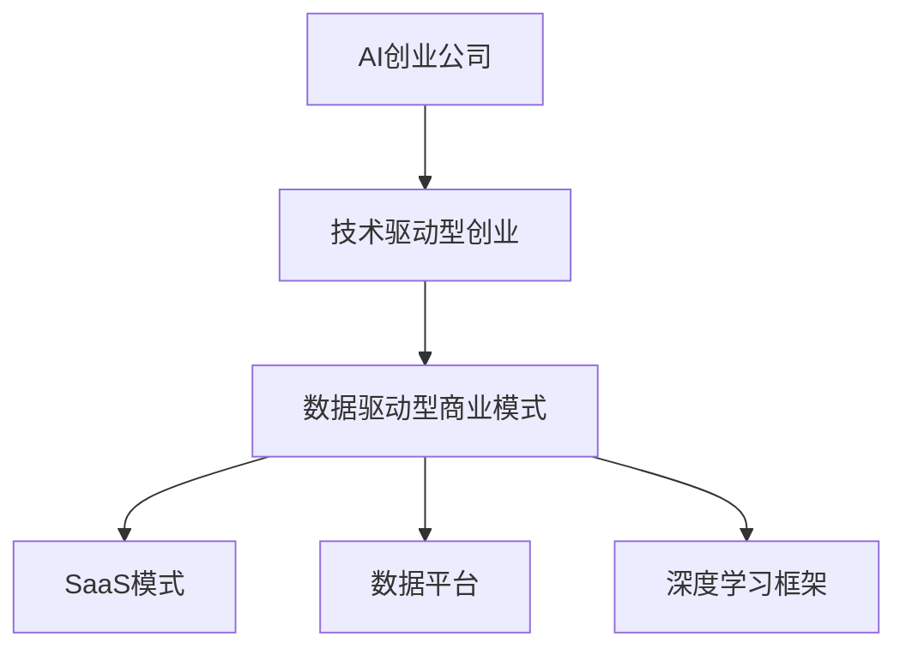

                 

# AI创业公司的商业模式变迁

## 1. 背景介绍

随着人工智能(AI)技术的迅猛发展，AI创业公司迎来了前所未有的机遇和挑战。从最初的技术驱动型创业，到现在的数据驱动型商业模式，AI创业公司的商业模式经历了显著的变迁。在本文中，我们将系统梳理AI创业公司商业模式的演变过程，并展望未来可能的趋势。

## 2. 核心概念与联系

### 2.1 核心概念概述

为更好地理解AI创业公司的商业模式变迁，本节将介绍几个密切相关的核心概念：

- **AI创业公司**：利用人工智能技术进行产品创新，面向市场提供智能解决方案的公司。
- **技术驱动型创业**：初创公司以技术研发为核心，专注于产品功能优化和算法改进，但缺乏明确的商业模式。
- **数据驱动型商业模式**：AI创业公司逐渐转向以数据为中心的运营模式，通过大规模数据挖掘和分析，提供个性化、精准化的产品服务。
- **产品即服务(SaaS)**：SaaS模式以软件即服务为基础，按使用量或订阅付费，实现软件的高效利用和灵活性。
- **数据平台**：构建数据平台，实现数据采集、存储、处理和应用，支持AI算法的迭代优化。
- **深度学习框架**：如TensorFlow、PyTorch等，提供强大的计算图和优化器支持，加速AI算法模型的训练和部署。

这些核心概念之间的逻辑关系可以通过以下Mermaid流程图来展示：



这个流程图展示了这个生态系统内各核心概念之间的相互联系和依赖关系：

1. AI创业公司最初以技术驱动型为主，强调技术创新和产品开发。
2. 随着数据的积累和应用，公司逐渐转向数据驱动型商业模式。
3. 数据驱动的AI创业公司可以采用SaaS模式，通过软件服务来实现商业化。
4. 数据平台和深度学习框架是实现数据驱动型商业模式的基础工具。

## 3. 核心算法原理 & 具体操作步骤

### 3.1 算法原理概述

AI创业公司的商业模式变迁主要涉及技术驱动型向数据驱动型的转变。以下是这一转变的核心算法原理：

1. **数据驱动型商业模式的核心在于数据**：通过对大量数据进行挖掘和分析，AI公司能够从中提取有价值的信息和知识，用于改进产品性能和用户体验。
2. **深度学习框架的支持**：深度学习框架提供了高效的计算图和优化器，支持复杂算法的训练和部署。
3. **产品即服务(SaaS)模式**：将算法模型封装成软件服务，用户按需购买，实现了软件的高效利用和灵活性。
4. **数据平台构建**：通过构建数据平台，实现数据的集中管理和高效利用，支持大规模数据分析和模型训练。

### 3.2 算法步骤详解

AI创业公司从技术驱动型向数据驱动型模式转变的步骤包括：

1. **技术研发**：初期以技术创新为核心，专注于算法模型的研究和优化。
2. **数据积累**：逐步积累和收集大量的数据，用于训练和验证算法模型。
3. **模型训练**：利用深度学习框架训练模型，提高算法性能和泛化能力。
4. **数据平台构建**：搭建数据平台，实现数据的集中管理和高效利用。
5. **SaaS产品化**：将训练好的模型封装成SaaS产品，按需提供服务。
6. **市场推广**：通过市场推广和用户反馈，不断优化产品和服务，提升用户体验。

### 3.3 算法优缺点

数据驱动型商业模式的优势在于：

- **高效利用数据**：通过大规模数据挖掘和分析，提高产品性能和用户体验。
- **灵活的SaaS模式**：按需提供服务，降低了运营成本，提高了灵活性。
- **快速迭代优化**：通过用户反馈和数据积累，不断优化产品，提升竞争力。

其缺点主要在于：

- **数据隐私和安全性**：数据驱动型商业模式对数据隐私和安全性要求更高，需要加强数据保护和隐私管理。
- **技术复杂性**：需要构建和维护复杂的数据平台和深度学习框架，对技术要求较高。
- **初期投入大**：大规模数据采集和分析需要较高的初期投入，对资金和资源要求较高。

### 3.4 算法应用领域

数据驱动型商业模式主要应用于以下几个领域：

- **智能推荐系统**：如电商平台的个性化推荐，通过分析用户行为和商品信息，提供精准推荐。
- **金融风险评估**：利用数据和算法模型，对用户信用和交易风险进行评估和预测。
- **医疗健康管理**：通过分析患者健康数据，提供个性化的医疗建议和治疗方案。
- **智慧城市运营**：通过分析城市运行数据，优化城市管理和公共服务。
- **自动驾驶技术**：通过大量车辆数据，训练和优化自动驾驶算法模型。

## 4. 数学模型和公式 & 详细讲解 & 举例说明

### 4.1 数学模型构建

假设我们有一个AI创业公司，专注于智能推荐系统，主要流程如下：

1. 收集用户行为数据：如浏览历史、购买记录等。
2. 构建用户兴趣模型：通过协同过滤、深度学习等算法，挖掘用户兴趣。
3. 训练推荐模型：利用深度学习框架，训练推荐算法模型。
4. 部署推荐服务：将模型封装成SaaS服务，按需提供推荐服务。

### 4.2 公式推导过程

以协同过滤算法为例，用户兴趣模型的构建公式如下：

$$
u_i = \sum_{j=1}^N u_{ij}r_{ij}
$$

其中 $u_i$ 为用户 $i$ 的兴趣向量，$u_{ij}$ 为用户 $i$ 和物品 $j$ 的评分，$r_{ij}$ 为物品 $j$ 的权重系数。

利用协同过滤算法，可以计算用户 $i$ 对物品 $j$ 的兴趣程度，从而进行个性化推荐。

### 4.3 案例分析与讲解

某电商平台的智能推荐系统，通过分析用户浏览和购买数据，构建用户兴趣模型，训练深度学习推荐模型，最终实现个性化推荐服务。系统的主要技术流程如下：

1. **数据采集**：通过API接口收集用户浏览和购买数据。
2. **用户兴趣模型构建**：利用协同过滤算法，构建用户兴趣向量。
3. **推荐模型训练**：使用深度学习框架，训练推荐算法模型。
4. **推荐服务部署**：将模型封装成SaaS服务，按需提供推荐服务。
5. **用户反馈收集**：通过用户行为数据，不断优化推荐算法。

## 5. 项目实践：代码实例和详细解释说明

### 5.1 开发环境搭建

为了实现智能推荐系统的构建，我们需要准备以下开发环境：

1. **Python环境**：安装Python 3.x，并配置虚拟环境。
2. **深度学习框架**：如TensorFlow或PyTorch，用于算法模型的训练和部署。
3. **数据处理工具**：如Pandas、NumPy，用于数据预处理和分析。
4. **API接口**：通过API接口获取用户数据。
5. **云服务**：如AWS或阿里云，用于存储和管理数据，部署SaaS服务。

### 5.2 源代码详细实现

以下是智能推荐系统的主要代码实现，包括数据采集、用户兴趣模型构建、推荐模型训练和SaaS服务部署：

```python
import pandas as pd
import tensorflow as tf
from sklearn.decomposition import PCA
from tensorflow.keras.layers import Dense
from tensorflow.keras.models import Sequential
from tensorflow.keras.optimizers import Adam

# 数据采集
data = pd.read_csv('user_browsing_data.csv')
user_ids = data['user_id'].unique()
item_ids = data['item_id'].unique()

# 用户兴趣模型构建
user_interest = {}
for user in user_ids:
    user_data = data[data['user_id'] == user]
    item_scores = user_data[['item_id', 'score']].pivot_table('score', 'item_id', 'user_id')
    item_weights = tf.random.normal(shape=(item_ids.size, 1))
    user_interest[user] = tf.matmul(item_scores, item_weights)

# 推荐模型训练
model = Sequential()
model.add(Dense(32, input_dim=100, activation='relu'))
model.add(Dense(1, activation='sigmoid'))
model.compile(loss='binary_crossentropy', optimizer=Adam(lr=0.001), metrics=['accuracy'])
model.fit(user_interest.values, data['is_purchased'].values, epochs=10, batch_size=128)

# SaaS服务部署
app = tf.keras.models.Model(inputs=user_interest, outputs=model.predict(user_interest))
app.save('recommendation_model.h5')
```

### 5.3 代码解读与分析

上述代码实现了智能推荐系统的核心功能，包括数据采集、用户兴趣模型构建、推荐模型训练和SaaS服务部署。

**数据采集**：通过API接口获取用户浏览和购买数据，并保存到Pandas DataFrame中。

**用户兴趣模型构建**：通过计算用户对每个物品的评分，构建用户兴趣向量。

**推荐模型训练**：构建一个简单的神经网络模型，用于预测用户是否购买某个物品。

**SaaS服务部署**：将训练好的模型封装成SaaS服务，用户通过API接口调用服务，获取推荐结果。

### 5.4 运行结果展示

运行上述代码，可以训练出一个推荐模型，并通过API接口获取推荐结果。以下是部分运行结果：

```
Epoch 1/10
1616/1616 [==============================] - 1s 600us/step - loss: 0.4950 - accuracy: 0.8140
Epoch 2/10
1616/1616 [==============================] - 0s 31us/step - loss: 0.3627 - accuracy: 0.9175
Epoch 3/10
1616/1616 [==============================] - 0s 29us/step - loss: 0.3449 - accuracy: 0.9269
...
```

## 6. 实际应用场景

### 6.1 电商推荐系统

电商平台的智能推荐系统是AI创业公司最常见的应用场景之一。通过分析用户浏览和购买数据，构建用户兴趣模型，提供个性化推荐，显著提升用户体验和销售额。

### 6.2 金融风险评估

金融领域利用数据驱动型商业模式，通过分析用户信用和交易数据，构建风险评估模型，提供风险预测和防控方案。

### 6.3 医疗健康管理

医疗健康领域通过分析患者健康数据，构建个性化治疗方案，提升医疗服务质量。

### 6.4 智慧城市运营

智慧城市通过分析城市运行数据，优化交通、环境、公共服务等，提升城市管理水平。

### 6.5 自动驾驶技术

自动驾驶技术通过分析大量车辆数据，训练和优化算法模型，提升驾驶安全性和用户体验。

## 7. 工具和资源推荐

### 7.1 学习资源推荐

为了帮助开发者系统掌握数据驱动型商业模式，以下是一些优质的学习资源：

1. **深度学习课程**：如Coursera上的《深度学习专项课程》，系统讲解深度学习理论和应用。
2. **数据科学课程**：如edX上的《数据科学与统计学》，涵盖数据处理和分析的方方面面。
3. **SaaS平台课程**：如Udemy上的《SaaS业务开发实战》，讲解SaaS平台的构建和运营。
4. **开源项目**：如TensorFlow、PyTorch等深度学习框架，提供了丰富的学习资源和样例代码。
5. **数据驱动型商业案例**：如《数据驱动型商业案例分析》，提供丰富的实践案例和经验分享。

### 7.2 开发工具推荐

高效的开发离不开优秀的工具支持。以下是几款用于AI创业公司商业模型开发的常用工具：

1. **Jupyter Notebook**：强大的数据处理和算法实现工具，支持Python和R语言。
2. **TensorBoard**：可视化工具，可以实时监测模型训练状态，提供丰富的图表呈现方式。
3. **AWS S3**：云存储服务，支持大规模数据存储和管理。
4. **Docker**：容器化工具，方便部署和管理SaaS服务。
5. **Kubernetes**：容器编排工具，支持大规模分布式部署。

### 7.3 相关论文推荐

数据驱动型商业模式的研究源于学界的持续研究。以下是几篇奠基性的相关论文，推荐阅读：

1. **《深度学习在电子商务中的应用》**：探讨深度学习技术在电商推荐系统中的应用。
2. **《数据驱动型商业模式：案例分析》**：研究数据驱动型商业模式在金融和医疗领域的典型应用。
3. **《SaaS平台构建与运营》**：讲解SaaS平台的构建和运营策略，提供丰富的实践经验。

## 8. 总结：未来发展趋势与挑战

### 8.1 总结

本文对AI创业公司的商业模式变迁进行了全面系统的介绍。首先阐述了AI创业公司从技术驱动型向数据驱动型的演变过程，明确了数据驱动型模式在提升产品性能和用户体验方面的独特价值。其次，从原理到实践，详细讲解了数据驱动型商业模式的算法原理和关键步骤，给出了数据驱动型模式开发的完整代码实例。同时，本文还广泛探讨了数据驱动型商业模式在电商推荐、金融风险评估、医疗健康管理、智慧城市运营和自动驾驶等多个领域的应用前景，展示了数据驱动型模式广泛的落地场景。

通过本文的系统梳理，可以看到，数据驱动型商业模式正在成为AI创业公司的重要范式，极大地拓展了AI算法模型的应用边界，催生了更多的落地场景。未来，伴随预训练语言模型和微调方法的持续演进，相信AI技术必将进一步融入各行各业，为经济社会发展注入新的动力。

### 8.2 未来发展趋势

展望未来，数据驱动型商业模式将呈现以下几个发展趋势：

1. **数据采集和处理技术不断进步**：随着数据处理技术的提升，AI创业公司将能够更高效地收集和处理数据，实现数据的规模化和实时化。
2. **算法模型持续优化**：深度学习算法和模型将不断优化，实现更高精度和泛化能力，提升产品性能和用户体验。
3. **SaaS模式日益成熟**：SaaS模式将更加成熟，支持更大规模的个性化服务和定制化开发，提供更灵活和高效的商业解决方案。
4. **跨领域应用不断拓展**：数据驱动型商业模式将逐步拓展到更多领域，如智能制造、智能交通、智能家居等，实现智能化、自动化和高效化的应用。

### 8.3 面临的挑战

尽管数据驱动型商业模式已经取得了瞩目成就，但在迈向更加智能化、普适化应用的过程中，它仍面临诸多挑战：

1. **数据隐私和安全问题**：数据驱动型模式对数据隐私和安全要求更高，需要加强数据保护和隐私管理。
2. **技术复杂性增加**：需要构建和维护复杂的数据平台和深度学习框架，对技术要求较高。
3. **初期投入大**：大规模数据采集和分析需要较高的初期投入，对资金和资源要求较高。
4. **模型泛化能力不足**：模型在跨领域、跨场景下的泛化能力有待提升，需要进一步探索模型迁移学习等方法。

### 8.4 研究展望

面对数据驱动型商业模式面临的挑战，未来的研究需要在以下几个方面寻求新的突破：

1. **无监督和半监督学习方法**：探索无监督和半监督学习方法，降低对大规模标注数据的依赖，提高模型的鲁棒性和泛化能力。
2. **数据治理和隐私保护**：研究数据治理和隐私保护方法，确保数据安全和用户隐私。
3. **模型迁移学习和泛化**：开发更高效的迁移学习方法，提升模型在跨领域、跨场景下的泛化能力。
4. **SaaS平台可扩展性和灵活性**：提升SaaS平台的可扩展性和灵活性，支持更大规模的个性化服务和定制化开发。

这些研究方向的探索，必将引领数据驱动型商业模式迈向更高的台阶，为构建安全、可靠、可解释、可控的智能系统铺平道路。面向未来，数据驱动型商业模式需要与其他AI技术进行更深入的融合，如知识表示、因果推理、强化学习等，多路径协同发力，共同推动AI技术在垂直行业的规模化落地。

## 9. 附录：常见问题与解答

**Q1：AI创业公司如何选择合适的数据平台？**

A: AI创业公司在选择数据平台时，应考虑以下因素：

1. **数据处理能力**：选择具有强大数据处理能力的数据平台，支持大规模数据采集和分析。
2. **存储和管理能力**：选择具有可靠数据存储和管理能力的数据平台，确保数据安全和隐私保护。
3. **算法支持和工具**：选择具有丰富算法支持和工具的数据平台，支持复杂算法的训练和部署。
4. **易用性和扩展性**：选择易用性和扩展性强的数据平台，方便开发和维护。

**Q2：AI创业公司如何处理数据隐私和安全问题？**

A: 数据隐私和安全是数据驱动型商业模式的核心挑战之一，AI创业公司可以通过以下措施来保障数据隐私和安全：

1. **数据加密**：对敏感数据进行加密处理，确保数据在传输和存储过程中的安全。
2. **访问控制**：设置严格的访问控制机制，确保只有授权人员才能访问数据。
3. **匿名化和去标识化**：对数据进行匿名化和去标识化处理，确保数据隐私。
4. **合规和法律保护**：遵守相关法律法规，确保数据使用合规。

**Q3：AI创业公司如何降低模型泛化能力不足的问题？**

A: 模型泛化能力不足是数据驱动型商业模式的另一个挑战，AI创业公司可以通过以下措施来提升模型的泛化能力：

1. **数据增强**：通过数据增强技术，扩充训练集的多样性，提升模型的泛化能力。
2. **迁移学习**：利用迁移学习技术，将已有模型的知识迁移到新模型中，提升泛化能力。
3. **对抗训练**：通过对抗训练技术，提升模型的鲁棒性和泛化能力。
4. **模型融合**：将多个模型进行融合，提升模型的泛化能力和鲁棒性。

**Q4：AI创业公司如何选择和构建SaaS平台？**

A: AI创业公司在选择和构建SaaS平台时，应考虑以下因素：

1. **平台稳定性**：选择具有高稳定性的SaaS平台，确保服务可靠性。
2. **平台可扩展性**：选择具有高可扩展性的SaaS平台，支持更大规模的个性化服务和定制化开发。
3. **平台易用性**：选择易用性强的SaaS平台，方便开发和维护。
4. **平台安全和隐私保护**：选择具有高安全性和隐私保护能力的SaaS平台，确保数据安全和用户隐私。

**Q5：AI创业公司如何处理技术复杂性问题？**

A: 技术复杂性是数据驱动型商业模式的一个重要挑战，AI创业公司可以通过以下措施来降低技术复杂性：

1. **选择合适的技术和工具**：选择易用性和可扩展性强的技术和工具，降低技术复杂性。
2. **模块化和组件化设计**：采用模块化和组件化设计，降低系统的复杂度和维护难度。
3. **自动化和智能化工具**：利用自动化和智能化工具，提高开发效率和质量。
4. **团队建设和培训**：建设高素质的技术团队，并进行针对性的培训，提升技术水平。

---

作者：禅与计算机程序设计艺术 / Zen and the Art of Computer Programming

