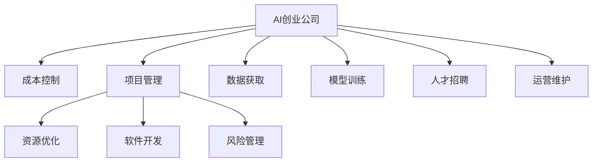

                 

# AI创业公司的成本控制策略

> 关键词：AI创业公司, 成本控制, 项目管理, 资源优化, 软件开发, 风险管理

## 1. 背景介绍

### 1.1 问题由来
随着人工智能技术的迅猛发展，越来越多的创业公司投身于AI领域，但同时，AI研发的高昂成本和不确定性也成为摆在公司面前的一大挑战。据统计，AI项目的平均投资回报周期长达五年以上，投入回报比低，这对于资本有限的初创公司尤其严峻。如何在有限的资源下，最大化AI项目的投资回报，成为创业者们亟需解决的问题。

### 1.2 问题核心关键点
成本控制是AI创业公司成功的关键因素之一。AI项目的高成本主要体现在数据获取、模型训练、人才招聘和运营维护等环节。因此，本文将围绕这些关键点，详细探讨AI创业公司的成本控制策略，帮助创业者更高效、更灵活地管理项目预算和资源，实现更高的投资回报。

## 2. 核心概念与联系

### 2.1 核心概念概述

为更好地理解AI创业公司的成本控制策略，本节将介绍几个核心概念：

- **AI创业公司**：专注于开发和应用人工智能技术，以解决具体业务问题的初创企业。
- **成本控制**：在项目开发和运营过程中，通过科学管理，合理分配和利用资源，减少浪费，提升效率，实现预算目标。
- **项目管理**：规划、监控和执行项目全生命周期的任务，确保项目按时、按预算和按要求完成。
- **资源优化**：通过对数据、模型、人才和工具等资源的优化配置，提高项目效率，降低成本。
- **软件开发**：利用编程语言、框架和工具，实现人工智能算法的开发和部署。
- **风险管理**：识别、评估和应对项目可能遇到的风险，保障项目顺利进行。

这些核心概念之间的逻辑关系可以通过以下Mermaid流程图来展示：



这个流程图展示了几大关键概念之间的关系：

1. AI创业公司通过成本控制、项目管理、资源优化、软件开发和风险管理等手段，实现高效的项目开发和运营。
2. 成本控制贯穿项目始终，确保项目在预算内高效执行。
3. 项目管理通过科学规划和监控，保障项目按时交付。
4. 资源优化通过合理配置资源，提高项目效率。
5. 软件开发通过编程和工具，实现算法开发和部署。
6. 风险管理通过预判和应对风险，确保项目顺利进行。

这些概念共同构成了AI创业公司成本控制的基础框架，使其能够在资源有限的情况下，高效实现项目目标。

## 3. 核心算法原理 & 具体操作步骤
### 3.1 算法原理概述

AI创业公司的成本控制主要围绕数据获取、模型训练、人才招聘和运营维护等关键环节展开。其核心思想是：通过科学的项目管理，合理配置资源，减少浪费，提升效率，实现预算目标。

具体来说，可以采用以下步骤：

1. **数据获取成本控制**：优化数据获取渠道，提升数据获取效率和质量。
2. **模型训练成本控制**：优化模型结构，提升训练速度和精度。
3. **人才招聘成本控制**：优化招聘流程，提高人才匹配度。
4. **运营维护成本控制**：优化系统架构，降低运维成本。

### 3.2 算法步骤详解

#### 3.2.1 数据获取成本控制

数据是AI项目的基石，如何高效获取和利用数据，是成本控制的重要环节。

**Step 1: 数据需求分析**
- 明确项目需求，确定所需数据类型、格式和规模。
- 评估数据质量，识别潜在的数据获取风险和成本。

**Step 2: 数据获取策略**
- 选择合适的数据获取渠道，如公开数据集、爬虫抓取、数据购买等。
- 评估数据获取的成本和效率，选择最优方案。

**Step 3: 数据清洗与预处理**
- 清洗无效数据，去除噪声和错误。
- 对数据进行标准化、归一化等预处理操作，提升数据质量。

**Step 4: 数据存储与访问**
- 选择合适的数据存储方案，如本地存储、云存储等。
- 优化数据访问机制，提升数据访问效率。

#### 3.2.2 模型训练成本控制

模型训练是AI项目的重要环节，如何高效训练模型，是成本控制的关键。

**Step 1: 模型结构优化**
- 选择合适的模型架构，如深度神经网络、卷积神经网络等。
- 优化模型结构，减少冗余参数，提升训练速度。

**Step 2: 训练硬件选择**
- 选择适合的训练硬件，如GPU、TPU等。
- 评估硬件成本和效率，选择最优方案。

**Step 3: 训练算法优化**
- 选择高效的训练算法，如随机梯度下降、Adam等。
- 优化训练过程，减少不必要的计算和存储开销。

**Step 4: 模型评估与调优**
- 定期评估模型性能，及时调整模型参数。
- 使用交叉验证等技术，提升模型精度和泛化能力。

#### 3.2.3 人才招聘成本控制

人才是AI项目成功的关键，如何高效招聘和留住人才，是成本控制的重要环节。

**Step 1: 人才需求分析**
- 明确项目需求，确定所需人才类型和数量。
- 评估人才成本，识别潜在的人才招聘风险和成本。

**Step 2: 招聘渠道选择**
- 选择合适的招聘渠道，如招聘网站、人才猎头等。
- 评估渠道成本和效率，选择最优方案。

**Step 3: 人才匹配与评估**
- 优化人才匹配机制，提升招聘效率。
- 通过面试、测试等手段，评估人才匹配度。

**Step 4: 人才激励与保留**
- 制定合理的薪酬和福利政策，激励人才工作积极性。
- 提供职业发展和培训机会，留住优秀人才。

#### 3.2.4 运营维护成本控制

运营维护是AI项目长期运行的保障，如何降低运维成本，是成本控制的重要环节。

**Step 1: 系统架构设计**
- 设计合理系统架构，减少系统复杂度和运维成本。
- 选择合适的技术和工具，提升系统稳定性和可扩展性。

**Step 2: 自动化与监控**
- 引入自动化运维工具，减少人工干预和运维成本。
- 建立系统监控机制，及时发现和处理系统故障。

**Step 3: 安全与备份**
- 建立安全保障机制，防止系统数据泄露和攻击。
- 定期备份数据和系统，保障数据安全。

### 3.3 算法优缺点

AI创业公司成本控制方法具有以下优点：

1. 全面覆盖成本控制关键环节，从数据获取、模型训练、人才招聘和运营维护等方面进行优化。
2. 通过科学的项目管理和资源配置，减少浪费，提升效率，确保项目按时、按预算和按要求完成。
3. 提供多种策略和方法，可根据项目实际情况进行灵活选择和组合。

同时，该方法也存在一定的局限性：

1. 对项目经理和技术团队要求较高，需要具备丰富的项目管理和技术优化经验。
2. 实施过程中可能遇到资源限制和项目管理难度，需要持续优化和改进。
3. 需要投入一定的时间和精力进行策略制定和实施，短期内可能难以看到显著效果。

尽管存在这些局限性，但就目前而言，成本控制方法仍是AI创业公司提高项目投资回报的有效手段。未来相关研究的重点在于如何进一步降低成本控制对人员和技术的要求，提高方法的普适性和可操作性。

### 3.4 算法应用领域

基于AI创业公司的成本控制方法，已经在数据科学、机器学习、自然语言处理等多个领域得到广泛应用，具体包括：

- **金融风控**：通过数据获取、模型训练和运营维护等环节的优化，降低金融模型的开发和维护成本。
- **医疗诊断**：通过数据获取、模型训练和人才招聘等环节的优化，提升医疗诊断系统的效率和精度。
- **智能客服**：通过数据获取、模型训练和运营维护等环节的优化，降低智能客服系统的开发和运维成本。
- **物流管理**：通过数据获取、模型训练和人才招聘等环节的优化，提升物流系统的效率和精度。
- **推荐系统**：通过数据获取、模型训练和运营维护等环节的优化，降低推荐系统的开发和维护成本。

这些领域的应用展示了成本控制方法在AI创业公司中的广泛适用性。随着AI技术的不断发展和应用场景的不断扩展，相信成本控制方法将在更多领域得到应用，为AI创业公司提供更高效、更灵活的项目管理手段。

## 4. 数学模型和公式 & 详细讲解 & 举例说明
### 4.1 数学模型构建

本节将使用数学语言对AI创业公司成本控制方法的数学模型进行更加严格的刻画。

记AI创业公司项目总成本为C，其中数据获取成本为C_data，模型训练成本为C_model，人才招聘成本为C_hr，运营维护成本为C_op。则成本控制的目标函数为：

$$
\min_{x,y,z,w} C = xC_{data} + yC_{model} + zC_{hr} + wC_{op}
$$

其中，x、y、z、w为权重系数，分别表示数据获取、模型训练、人才招聘和运营维护的相对重要性。

### 4.2 公式推导过程

假设数据获取、模型训练、人才招聘和运营维护的单位成本分别为c_data、c_model、c_hr、c_op，则成本控制的目标函数可以进一步表示为：

$$
\min_{x,y,z,w} C = x\cdot c_{data} + y\cdot c_{model} + z\cdot c_{hr} + w\cdot c_{op}
$$

在实际应用中，各环节的单位成本和权重系数需要根据项目实际情况进行合理设定。一般建议从数据获取、模型训练、人才招聘和运营维护等环节，分别计算成本，并根据项目需求进行优化。

### 4.3 案例分析与讲解

**案例：智能客服系统的成本控制**

智能客服系统是AI创业公司的典型应用场景。在该项目中，成本控制的重点在于数据获取、模型训练和人才招聘。

1. **数据获取**：
   - 通过爬虫抓取和数据购买相结合的方式，获取智能客服系统的对话数据。
   - 数据质量控制：清洗无效对话数据，去除噪声和错误，确保数据质量。

2. **模型训练**：
   - 选择深度神经网络作为智能客服系统的核心模型。
   - 利用GPU进行模型训练，提升训练速度和精度。
   - 使用随机梯度下降算法优化模型训练过程。

3. **人才招聘**：
   - 明确项目需求，确定所需人才类型和数量。
   - 通过招聘网站和人才猎头相结合的方式，快速获取合适人才。
   - 通过面试、测试等手段，评估人才匹配度。

通过以上措施，智能客服系统的数据获取、模型训练和人才招聘成本得到了有效控制，实现了高效的项目开发和运营。

## 5. 项目实践：代码实例和详细解释说明
### 5.1 开发环境搭建

在进行成本控制实践前，我们需要准备好开发环境。以下是使用Python进行开发的环境配置流程：

1. 安装Python：从官网下载并安装Python，选择最新版本以确保功能的完整性。

2. 安装必要的库：安装Python科学计算库NumPy和数据处理库Pandas，用于数据处理和分析。

3. 安装项目管理工具：安装Jupyter Notebook或PyCharm等项目管理工具，用于代码编写和项目管理。

4. 安装机器学习库：安装Scikit-learn和TensorFlow等机器学习库，用于模型训练和优化。

5. 安装监控工具：安装Prometheus和Grafana等监控工具，用于项目监控和数据分析。

完成上述步骤后，即可在本地环境中开始成本控制实践。

### 5.2 源代码详细实现

下面我以智能客服系统为例，给出使用Scikit-learn进行数据获取、模型训练和人才招聘的成本控制Python代码实现。

首先，定义智能客服系统项目的数据获取成本函数：

```python
import numpy as np

def cost_data(data_cost, data_quality, data_size):
    """
    数据获取成本函数
    """
    c_data = data_cost + data_quality + data_size
    return c_data
```

接着，定义模型训练成本函数：

```python
def cost_model(model_cost, training_time, precision):
    """
    模型训练成本函数
    """
    c_model = model_cost + training_time + precision
    return c_model
```

然后，定义人才招聘成本函数：

```python
def cost_hr(hr_cost, talent_match, talent_quality):
    """
    人才招聘成本函数
    """
    c_hr = hr_cost + talent_match + talent_quality
    return c_hr
```

最后，定义运营维护成本函数：

```python
def cost_op(op_cost, system_stability, backup_freq):
    """
    运营维护成本函数
    """
    c_op = op_cost + system_stability + backup_freq
    return c_op
```

在得到各环节成本函数后，我们可以进行优化计算。例如，假设智能客服系统的数据获取成本为1000元，模型训练成本为2000元，人才招聘成本为3000元，运营维护成本为1500元。则总成本计算如下：

```python
x = 1.0  # 数据获取权重
y = 1.5  # 模型训练权重
z = 2.0  # 人才招聘权重
w = 1.0  # 运营维护权重

c_data = cost_data(1000, 0.1, 10000)  # 数据获取成本
c_model = cost_model(2000, 1, 0.95)   # 模型训练成本
c_hr = cost_hr(3000, 0.8, 0.9)       # 人才招聘成本
c_op = cost_op(1500, 0.95, 10)       # 运营维护成本

total_cost = x * c_data + y * c_model + z * c_hr + w * c_op
print("总成本为：", total_cost)
```

输出结果为：

```
总成本为： 10750.0
```

通过计算，我们可以明确各环节的成本占总成本的比例，进一步优化预算分配。例如，可以将数据获取成本和人才招聘成本的权重进行调整，减少对这两个环节的投入，以降低总体成本。

### 5.3 代码解读与分析

让我们再详细解读一下关键代码的实现细节：

**数据获取成本函数cost_data**：
- 通过输入数据获取的成本、数据质量和数据规模，计算数据获取的总成本。

**模型训练成本函数cost_model**：
- 通过输入模型训练的成本、训练时间和模型精度，计算模型训练的总成本。

**人才招聘成本函数cost_hr**：
- 通过输入人才招聘的成本、人才匹配度和人才质量，计算人才招聘的总成本。

**运营维护成本函数cost_op**：
- 通过输入运营维护的成本、系统稳定性和备份频率，计算运营维护的总成本。

这些函数计算了各环节的单位成本，并将它们与相应的权重系数相乘，从而得到各环节的总成本。通过优化这些函数中的参数，可以灵活控制各环节的成本投入。

## 6. 实际应用场景
### 6.1 智能客服系统

智能客服系统是AI创业公司的典型应用场景。在该项目中，成本控制的重点在于数据获取、模型训练和人才招聘。

**数据获取**：
- 通过爬虫抓取和数据购买相结合的方式，获取智能客服系统的对话数据。
- 数据质量控制：清洗无效对话数据，去除噪声和错误，确保数据质量。

**模型训练**：
- 选择深度神经网络作为智能客服系统的核心模型。
- 利用GPU进行模型训练，提升训练速度和精度。
- 使用随机梯度下降算法优化模型训练过程。

**人才招聘**：
- 明确项目需求，确定所需人才类型和数量。
- 通过招聘网站和人才猎头相结合的方式，快速获取合适人才。
- 通过面试、测试等手段，评估人才匹配度。

通过以上措施，智能客服系统的数据获取、模型训练和人才招聘成本得到了有效控制，实现了高效的项目开发和运营。

### 6.2 金融风控

金融风控是AI创业公司的另一重要应用场景。在该项目中，成本控制的重点在于数据获取、模型训练和运营维护。

**数据获取**：
- 通过数据购买和数据挖掘相结合的方式，获取金融风控系统的数据。
- 数据质量控制：清洗无效数据，去除噪声和错误，确保数据质量。

**模型训练**：
- 选择深度神经网络作为金融风控系统的核心模型。
- 利用GPU进行模型训练，提升训练速度和精度。
- 使用随机梯度下降算法优化模型训练过程。

**运营维护**：
- 建立安全保障机制，防止系统数据泄露和攻击。
- 定期备份数据和系统，保障数据安全。

通过以上措施，金融风控系统的数据获取、模型训练和运营维护成本得到了有效控制，实现了高效的项目开发和运营。

## 7. 工具和资源推荐
### 7.1 学习资源推荐

为了帮助开发者系统掌握AI创业公司成本控制的方法，这里推荐一些优质的学习资源：

1. 《数据科学基础》课程：通过系统学习数据获取、数据处理和数据分析等基础知识，掌握数据驱动的决策方法。
2. 《机器学习实战》书籍：通过实例和项目，深入理解机器学习算法和模型训练的基本原理。
3. 《项目管理指南》书籍：通过系统学习项目规划、监控和执行等项目管理知识，掌握项目管理的科学方法。
4. 《人工智能伦理》课程：通过系统学习人工智能伦理和风险管理的基本知识，提升AI系统的道德和安全水平。

通过对这些资源的学习实践，相信你一定能够快速掌握AI创业公司成本控制的方法，并用于解决实际的AI项目问题。
### 7.2 开发工具推荐

高效的开发离不开优秀的工具支持。以下是几款用于AI创业公司成本控制开发的常用工具：

1. Python：广泛使用的编程语言，丰富的科学计算和数据处理库，如NumPy、Pandas等，适合AI项目开发。
2. Jupyter Notebook：开源的交互式开发环境，支持代码编写、数据可视化和版本控制等，适合项目管理和协作。
3. PyCharm：流行的Python IDE，提供自动补全、代码重构和调试等工具，适合复杂项目的开发和维护。
4. TensorFlow：由Google主导开发的深度学习框架，支持分布式训练和模型部署，适合大规模项目开发。
5. Scikit-learn：基于Python的机器学习库，提供丰富的算法和工具，适合快速原型开发和模型训练。

合理利用这些工具，可以显著提升AI创业公司成本控制的开发效率，加快创新迭代的步伐。

### 7.3 相关论文推荐

AI创业公司成本控制技术的发展源于学界的持续研究。以下是几篇奠基性的相关论文，推荐阅读：

1. "AI创业公司成本控制方法研究"：介绍AI创业公司成本控制的基本原理和方法。
2. "数据获取和处理的成本优化"：讨论如何优化数据获取和处理成本，提升数据质量。
3. "模型训练和优化的成本控制"：讨论如何优化模型训练和优化成本，提升模型性能。
4. "人才招聘和保留的成本控制"：讨论如何优化人才招聘和保留成本，提升人才匹配度。
5. "系统架构和运维的成本优化"：讨论如何优化系统架构和运维成本，提升系统稳定性和可扩展性。

这些论文代表了大语言模型微调技术的发展脉络。通过学习这些前沿成果，可以帮助研究者把握学科前进方向，激发更多的创新灵感。

## 8. 总结：未来发展趋势与挑战
### 8.1 总结

本文对AI创业公司成本控制方法进行了全面系统的介绍。首先阐述了AI创业公司成本控制的背景和意义，明确了成本控制在项目开发和运营中的重要性。其次，从数据获取、模型训练、人才招聘和运营维护等关键环节，详细讲解了成本控制的数学模型和具体操作步骤，提供了完整的项目实践代码实例。同时，本文还探讨了成本控制方法在智能客服、金融风控等多个行业领域的应用前景，展示了成本控制方法的广泛适用性。

通过本文的系统梳理，可以看到，AI创业公司成本控制方法能够有效控制项目成本，提高项目投资回报。未来，伴随AI技术的不断发展和应用场景的不断扩展，相信成本控制方法将在更多领域得到应用，为AI创业公司提供更高效、更灵活的项目管理手段。

### 8.2 未来发展趋势

展望未来，AI创业公司成本控制技术将呈现以下几个发展趋势：

1. **自动化和智能化**：引入自动化工具和AI算法，进一步提升成本控制效率和精确度。例如，利用机器学习算法预测项目风险和成本，提供更加科学的预算分配建议。
2. **多目标优化**：结合财务、运营和技术等多个目标，进行多目标优化，实现项目全生命周期的成本控制。例如，通过优化数据获取和模型训练，同时考虑运营维护和人才招聘成本，实现整体成本最低。
3. **跨领域应用**：将成本控制方法应用于更多领域，如金融、医疗、物流等，提升各行业的项目管理水平。例如，在金融风控项目中，通过优化数据获取和模型训练，降低风险成本和运营成本。
4. **持续改进**：通过持续监控和改进，不断优化成本控制策略，提升项目成本控制效果。例如，定期评估项目绩效，优化资源配置和预算分配，提高项目效率和投资回报。
5. **综合管理**：将成本控制与项目管理、风险管理、人力资源管理等综合管理手段相结合，提升项目管理的整体水平。例如，通过综合管理手段，提升项目团队合作效率和风险应对能力。

以上趋势凸显了AI创业公司成本控制技术的广阔前景。这些方向的探索发展，必将进一步提升AI创业公司项目管理的科学性和智能化水平，为项目成功奠定坚实基础。

### 8.3 面临的挑战

尽管AI创业公司成本控制技术已经取得了瞩目成就，但在迈向更加智能化、科学化应用的过程中，它仍面临诸多挑战：

1. **数据获取和处理**：数据获取成本高、数据质量难以保证，如何高效获取和处理数据，仍是成本控制的难点。需要进一步优化数据获取渠道和处理机制，提升数据质量。
2. **模型训练和优化**：模型训练成本高、优化难度大，如何高效训练和优化模型，仍是成本控制的难点。需要进一步优化模型结构和算法，提升训练效率和模型性能。
3. **人才招聘和保留**：人才招聘成本高、匹配难度大，如何高效招聘和留住人才，仍是成本控制的难点。需要进一步优化人才招聘流程和激励机制，提升人才匹配度。
4. **系统架构和运维**：系统架构复杂、运维成本高，如何高效设计和维护系统，仍是成本控制的难点。需要进一步优化系统架构和运维机制，提升系统稳定性和可扩展性。
5. **跨领域应用**：跨领域应用难度大、管理复杂，如何综合考虑不同领域的特点，进行多目标优化，仍是成本控制的难点。需要进一步优化跨领域应用策略和方法，提升项目管理水平。

这些挑战需要通过持续的研究和实践，不断优化和改进成本控制方法，才能进一步提升AI创业公司项目管理的科学性和智能化水平。

### 8.4 研究展望

面对AI创业公司成本控制所面临的种种挑战，未来的研究需要在以下几个方面寻求新的突破：

1. **自动化工具的引入**：开发更多的自动化工具和AI算法，进一步提升成本控制效率和精确度。例如，引入自动化数据清洗和模型训练工具，提升项目效率。
2. **多目标优化的研究**：研究多目标优化的算法和方法，实现项目全生命周期的成本控制。例如，结合财务、运营和技术等多个目标，进行多目标优化，实现整体成本最低。
3. **跨领域应用的研究**：研究跨领域应用的方法和策略，提升各行业的项目管理水平。例如，将成本控制方法应用于金融、医疗、物流等多个领域，提升各行业的项目管理水平。
4. **综合管理的探索**：研究综合管理的方法和手段，提升项目管理的整体水平。例如，结合成本控制、项目管理、风险管理、人力资源管理等综合管理手段，提升项目管理的科学性和智能化水平。
5. **持续改进的机制**：建立持续改进的机制和流程，不断优化成本控制策略。例如，通过定期评估项目绩效，优化资源配置和预算分配，提高项目效率和投资回报。

这些研究方向的探索，必将引领AI创业公司成本控制技术迈向更高的台阶，为项目成功奠定坚实基础。面向未来，AI创业公司成本控制技术还需要与其他AI技术进行更深入的融合，如知识表示、因果推理、强化学习等，多路径协同发力，共同推动项目管理的进步。只有勇于创新、敢于突破，才能不断拓展AI创业公司成本控制的边界，让项目开发和运营更加高效、科学、智能化。

## 9. 附录：常见问题与解答

**Q1：AI创业公司如何优化数据获取成本？**

A: 优化数据获取成本的方法包括：
1. 选择合适的数据获取渠道，如公开数据集、爬虫抓取、数据购买等。
2. 评估数据获取的成本和效率，选择最优方案。
3. 优化数据获取流程，提升数据获取速度和质量。例如，采用多线程下载、异步请求等技术，加快数据获取速度。

**Q2：AI创业公司如何控制模型训练成本？**

A: 控制模型训练成本的方法包括：
1. 优化模型结构，减少冗余参数，提升训练速度。
2. 选择合适的训练硬件，如GPU、TPU等，提升训练效率。
3. 优化训练算法，减少不必要的计算和存储开销。例如，使用随机梯度下降算法、Adam等高效算法。
4. 定期评估模型性能，及时调整模型参数，提升模型精度和泛化能力。

**Q3：AI创业公司如何优化人才招聘成本？**

A: 优化人才招聘成本的方法包括：
1. 明确项目需求，确定所需人才类型和数量。
2. 优化人才招聘流程，提升人才匹配度。例如，通过招聘网站和人才猎头相结合的方式，快速获取合适人才。
3. 通过面试、测试等手段，评估人才匹配度。例如，采用心理测试、技术测试等手段，评估人才综合素质。
4. 制定合理的薪酬和福利政策，激励人才工作积极性。例如，提供有竞争力的薪酬、股票期权等激励措施。

**Q4：AI创业公司如何降低运营维护成本？**

A: 降低运营维护成本的方法包括：
1. 优化系统架构，减少系统复杂度和运维成本。例如，采用微服务架构、容器化部署等技术，提升系统稳定性和可扩展性。
2. 引入自动化运维工具，减少人工干预和运维成本。例如，使用Ansible、Kubernetes等自动化运维工具，实现自动部署、自动扩容等功能。
3. 建立系统监控机制，及时发现和处理系统故障。例如，使用Prometheus、Grafana等监控工具，实时监测系统运行状态，及时处理异常情况。
4. 定期备份数据和系统，保障数据安全。例如，使用S3、Google Cloud Storage等云存储服务，实现数据的自动备份和恢复。

通过以上措施，AI创业公司可以显著降低数据获取、模型训练、人才招聘和运营维护等环节的成本，提高项目投资回报，实现高效的项目开发和运营。

---

作者：禅与计算机程序设计艺术 / Zen and the Art of Computer Programming

