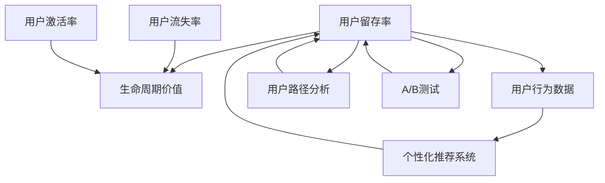

                 

# AI创业公司的用户留存策略

## 1. 背景介绍

### 1.1 问题由来

随着互联网和移动互联网的普及，AI创业公司如雨后春笋般涌现。在激烈的市场竞争中，用户留存成为了AI公司成功的关键因素之一。早期获客虽然可以迅速扩大用户基数，但用户流失问题往往难以避免。如何有效提高用户留存率，增强用户粘性，是AI创业公司必须面对的重要挑战。

用户留存率是衡量创业公司产品竞争力和市场地位的关键指标之一。持续稳定的用户留存率能够保证产品长期健康发展，从而更好地实现商业价值。根据多项研究，一个稳定留存的客户带来的 lifetime value （生命周期价值）远高于获取新客户的成本。

### 1.2 问题核心关键点

AI创业公司的用户留存策略，主要围绕以下几个关键点展开：

- **用户体验**：产品界面友好、功能实用、操作简便，是留住用户的基础。
- **产品价值**：产品应具备解决用户痛点、提供实质价值的能力。
- **数据驱动**：通过数据分析，精准把握用户需求和行为特征，优化产品迭代。
- **个性化推荐**：基于用户行为数据，提供定制化内容推荐，增强用户体验。
- **交互设计**：通过优质的交互设计，增加用户参与度和忠诚度。
- **社区建设**：构建活跃的在线社区，提升用户粘性和忠诚度。
- **持续改进**：持续收集用户反馈，不断优化产品和服务。

## 2. 核心概念与联系

### 2.1 核心概念概述

为更好地理解用户留存策略的原理和实现方法，本节将介绍几个密切相关的核心概念：

- **用户留存率（User Retention Rate）**：指在一段时间内，继续使用产品的用户占初始用户数的比例。高用户留存率意味着用户对产品的忠诚度较高。
- **生命周期价值（Lifetime Value）**：用户在其生命周期内，为产品带来的总收益。高用户留存率能够提升产品生命周期价值，实现更高效的商业回报。
- **用户流失率（Churn Rate）**：指在一段时间内，停止使用产品的用户占初始用户数的比例。低用户流失率意味着产品更具吸引力。
- **用户激活率（User Activation Rate）**：指首次使用产品的用户占总用户数的比例。高用户激活率表明产品的吸引力强，用户体验好。
- **用户行为数据（User Behavior Data）**：用户在使用产品过程中的点击、浏览、互动等行为数据，是分析用户需求和行为特征的重要依据。
- **个性化推荐系统（Personalized Recommendation System）**：基于用户行为数据，为每个用户提供个性化的内容推荐，提升用户满意度和留存率。
- **用户路径分析（User Journey Analysis）**：通过分析用户在产品内的行为路径，识别关键节点和问题点，优化用户体验。
- **A/B测试（A/B Testing）**：通过对比不同版本的产品功能或设计，科学评估其效果，实现精准优化。

这些核心概念之间的逻辑关系可以通过以下Mermaid流程图来展示：



这个流程图展示了一系列关键概念之间的内在联系：

1. 用户留存率和生命周期价值密切相关，高留存率带来高价值。
2. 用户流失率和用户激活率对生命周期价值有重要影响，低流失率和高激活率能显著提升价值。
3. 用户行为数据是分析用户需求、优化产品、实现个性化推荐和路径分析的基础。
4. 个性化推荐和路径分析通过精准把握用户需求，提升用户满意度和留存率。
5. A/B测试通过对比实验验证优化效果，持续提升用户体验。

## 3. 核心算法原理 & 具体操作步骤

### 3.1 算法原理概述

AI创业公司的用户留存策略，其核心思想是通过数据驱动的方法，精准把握用户需求和行为特征，优化产品设计和功能，提升用户体验，实现用户留存。

具体而言，用户留存策略的实现通常包括以下几个关键步骤：

1. **数据收集**：通过各种渠道收集用户行为数据，如点击、浏览、购买、评分等。
2. **数据分析**：使用机器学习算法分析用户数据，发现用户行为模式和需求特征。
3. **产品优化**：根据分析结果，优化产品界面、功能、内容等，提升用户体验。
4. **个性化推荐**：基于用户行为数据，提供定制化推荐，满足用户个性化需求。
5. **用户互动**：通过优化互动设计，增加用户参与度和忠诚度。
6. **社区建设**：构建活跃的在线社区，增强用户粘性和忠诚度。
7. **持续改进**：持续收集用户反馈，不断优化产品和服务。

### 3.2 算法步骤详解

基于上述思路，用户留存策略的实现步骤可以进一步细化为以下几个阶段：

#### 阶段一：数据收集与清洗

**数据收集**：
1. **用户行为数据**：通过网页、应用等收集用户的点击、浏览、购买、评分等行为数据。
2. **用户反馈数据**：收集用户在应用内的评论、建议、评分等反馈数据。
3. **第三方数据**：通过第三方数据源获取用户的社交媒体、搜索引擎行为等数据。

**数据清洗**：
1. **数据去重**：去除重复数据，避免冗余。
2. **数据归一化**：将不同来源的数据格式统一，便于后续分析。
3. **数据补全**：填补缺失数据，确保数据完整性。
4. **异常值检测与处理**：检测并处理异常值，避免噪声干扰。

#### 阶段二：数据分析与用户画像

**数据分析**：
1. **用户行为分析**：使用统计分析、聚类分析、时序分析等方法，发现用户行为模式。
2. **用户需求分析**：使用文本分析、情感分析等技术，理解用户需求和痛点。
3. **用户画像建模**：构建用户画像模型，刻画用户的核心特征。

**用户画像**：
1. **基本信息画像**：包括年龄、性别、职业等基本信息。
2. **行为画像**：包括用户的使用习惯、偏好等行为特征。
3. **需求画像**：包括用户的主要需求、痛点等。

#### 阶段三：产品优化与个性化推荐

**产品优化**：
1. **界面优化**：通过A/B测试，对比不同界面设计，找到用户最喜欢的布局和元素。
2. **功能优化**：基于用户需求，增加和优化产品功能。
3. **性能优化**：通过性能测试，确保产品稳定性和流畅性。

**个性化推荐**：
1. **推荐算法选择**：根据数据特点和业务需求，选择合适的推荐算法，如协同过滤、基于内容的推荐、深度学习推荐等。
2. **模型训练与优化**：训练推荐模型，根据用户行为数据进行预测，提升推荐效果。
3. **推荐系统部署**：将训练好的模型部署到产品中，实现个性化推荐功能。

#### 阶段四：用户互动与社区建设

**用户互动**：
1. **互动设计**：设计易于操作、功能强大的交互界面，增加用户参与度。
2. **互动活动**：设计有趣的活动和挑战，吸引用户参与。
3. **用户奖励**：通过积分、优惠券等方式，激励用户参与。

**社区建设**：
1. **社区规划**：规划社区结构，设计社区功能。
2. **社区运营**：发布优质内容，活跃社区氛围，吸引用户参与。
3. **用户管理**：构建用户管理系统，优化用户体验。

#### 阶段五：持续改进与反馈循环

**持续改进**：
1. **用户反馈收集**：通过应用内反馈、第三方调研等方式，持续收集用户反馈。
2. **产品迭代优化**：基于用户反馈，快速迭代产品，优化用户体验。
3. **市场调研**：通过市场调研，了解用户需求变化，调整产品策略。

**反馈循环**：
1. **数据驱动决策**：将用户反馈数据转化为决策依据，不断优化产品。
2. **迭代更新**：定期更新产品，引入新功能，提升用户体验。
3. **持续监控**：持续监控产品数据，发现问题及时调整。

### 3.3 算法优缺点

用户留存策略的实现具有以下优点：

1. **数据驱动**：通过数据分析，精准把握用户需求和行为特征，优化产品设计和功能，提升用户体验。
2. **个性化推荐**：基于用户行为数据，提供定制化推荐，满足用户个性化需求。
3. **用户互动**：通过优化互动设计，增加用户参与度和忠诚度。
4. **社区建设**：构建活跃的在线社区，增强用户粘性和忠诚度。
5. **持续改进**：持续收集用户反馈，不断优化产品和服务。

同时，该方法也存在一定的局限性：

1. **数据获取难度**：收集和处理大量用户行为数据，需要投入大量人力和时间成本。
2. **算法复杂度**：推荐算法复杂度较高，需要较强的技术能力和资源支持。
3. **用户隐私问题**：收集用户数据可能涉及隐私保护问题，需要严格遵守法律法规。
4. **业务适用性**：不同业务场景可能需要针对性地优化推荐算法和交互设计。
5. **效果评估困难**：个性化推荐和用户互动的效果评估较为复杂，需要科学方法和工具支持。

尽管存在这些局限性，但用户留存策略的实现仍是大数据和人工智能技术在产品优化中的重要应用，为AI创业公司提供了高效的用户留存解决方案。

### 3.4 算法应用领域

用户留存策略的应用领域非常广泛，几乎涵盖了所有需要处理用户数据的行业。以下是几个典型的应用场景：

- **电商**：通过个性化推荐和活动设计，提升用户购买率和复购率。
- **社交**：通过社区建设和互动设计，增强用户粘性和活跃度。
- **在线教育**：通过个性化学习推荐和课程设计，提高用户学习效果和满意度。
- **金融**：通过用户行为分析，优化理财产品推荐，提升用户留存率。
- **健康**：通过健康数据监测和个性化推荐，提升用户健康管理效果和粘性。
- **旅游**：通过个性化旅游推荐和社区建设，增强用户旅行体验和留存率。

## 4. 数学模型和公式 & 详细讲解 & 举例说明

### 4.1 数学模型构建

用户留存策略的实现涉及到多个领域的数学模型和公式，以下是几个核心模型的介绍：

**用户留存率模型**：
1. **泊松模型**：通过泊松分布，预测用户在某段时间内的留存率。
2. **指数分布模型**：通过指数分布，预测用户留存的期望值。

**推荐系统模型**：
1. **协同过滤模型**：通过用户-物品评分矩阵，推荐相似用户喜欢的物品。
2. **基于内容的推荐模型**：通过物品的特征向量，推荐与用户兴趣相似的物品。
3. **深度学习推荐模型**：通过神经网络模型，进行用户行为预测和物品推荐。

**用户画像模型**：
1. **K-means聚类**：通过K-means算法，对用户进行聚类分析，发现用户行为模式。
2. **隐马尔可夫模型**：通过隐马尔可夫模型，刻画用户行为序列和状态转移。

### 4.2 公式推导过程

**用户留存率公式**：
泊松模型：
\[ P(x) = \frac{\lambda^x e^{-\lambda}}{x!} \]
其中，\(x\)为指定时间段内的用户留存次数，\(\lambda\)为预测的留存率。

指数分布模型：
\[ F(t) = 1 - e^{-\lambda t} \]
其中，\(t\)为用户留存时间，\(\lambda\)为预测的留存率。

**协同过滤推荐公式**：
协同过滤模型的基本思想是寻找与用户兴趣相似的用户，推荐该用户喜欢的物品。假设用户-物品评分矩阵为\(M\)，用户\(u\)对物品\(i\)的评分表示为\(M_{ui}\)。设用户\(u\)的邻居用户集合为\(N(u)\)，通过计算\(N(u)\)与\(u\)的评分相似度\(S_u\)，选取评分相似度最高的\(k\)个邻居用户进行推荐。推荐公式如下：
\[ R_{ui} = \frac{\sum_{v \in N(u)} S_u(M_{vi}) M_{vi}_i}{\sum_{v \in N(u)} S_u(M_{vi})} \]

**基于内容的推荐公式**：
基于内容的推荐模型通过物品特征与用户兴趣的匹配度进行推荐。假设物品特征向量为\(V_i\)，用户兴趣向量为\(U_u\)。通过计算物品特征向量与用户兴趣向量的余弦相似度，推荐与用户兴趣相似的物品。推荐公式如下：
\[ R_{ui} = \frac{V_i \cdot U_u}{||V_i|| \cdot ||U_u||} \]

**深度学习推荐公式**：
深度学习推荐模型通过神经网络进行用户行为预测和物品推荐。假设用户行为序列为\(X_u\)，物品特征向量为\(V_i\)。通过神经网络模型，预测用户行为序列的下一状态，推荐与预测状态匹配的物品。推荐公式如下：
\[ R_{ui} = argmax \{ \hat{P}(X_{u,t+1}|X_u, V_i, \Theta) \} \]

### 4.3 案例分析与讲解

**案例1：电商个性化推荐系统**

某电商公司通过用户行为数据，训练协同过滤推荐模型，实现个性化推荐。具体步骤如下：
1. **数据收集**：收集用户点击、浏览、购买等行为数据。
2. **数据预处理**：数据去重、归一化、补全、异常值检测。
3. **模型训练**：使用协同过滤算法训练推荐模型。
4. **模型评估**：通过A/B测试评估推荐效果，优化模型参数。
5. **推荐部署**：将训练好的模型部署到电商应用中，实现个性化推荐功能。

**案例2：在线教育个性化学习系统**

某在线教育平台通过用户学习行为数据，训练基于内容的推荐模型，实现个性化学习推荐。具体步骤如下：
1. **数据收集**：收集用户学习行为数据，包括点击、观看、回答等行为。
2. **数据预处理**：数据去重、归一化、补全、异常值检测。
3. **模型训练**：使用基于内容的推荐算法训练推荐模型。
4. **模型评估**：通过A/B测试评估推荐效果，优化模型参数。
5. **推荐部署**：将训练好的模型部署到在线教育平台中，实现个性化学习推荐。

## 5. 项目实践：代码实例和详细解释说明

### 5.1 开发环境搭建

在进行用户留存策略的实现前，我们需要准备好开发环境。以下是使用Python进行TensorFlow开发的环境配置流程：

1. 安装Anaconda：从官网下载并安装Anaconda，用于创建独立的Python环境。

2. 创建并激活虚拟环境：
```bash
conda create -n tf-env python=3.8 
conda activate tf-env
```

3. 安装TensorFlow：根据CUDA版本，从官网获取对应的安装命令。例如：
```bash
conda install tensorflow tensorflow-estimator tensorflow-hub tensorflow-addons -c tf
```

4. 安装各类工具包：
```bash
pip install numpy pandas scikit-learn matplotlib tqdm jupyter notebook ipython
```

完成上述步骤后，即可在`tf-env`环境中开始实践。

### 5.2 源代码详细实现

下面我们以电商个性化推荐系统为例，给出使用TensorFlow进行个性化推荐模型开发的Python代码实现。

首先，定义数据处理函数：

```python
import pandas as pd
import tensorflow as tf

def load_data(path):
    data = pd.read_csv(path)
    return data

def preprocess_data(data):
    # 数据去重
    data = data.drop_duplicates()
    # 数据归一化
    data['click'] = (data['click'] - data['click'].min()) / (data['click'].max() - data['click'].min())
    # 数据补全
    data.fillna(data.mean(), inplace=True)
    # 异常值检测与处理
    data = data[(data['click'] > 0).all(axis=1)]
    return data

def split_data(data, train_ratio=0.8):
    train_data = data.sample(frac=train_ratio, random_state=0)
    test_data = data.drop(train_data.index)
    return train_data, test_data
```

然后，定义模型训练函数：

```python
def train_model(model, data, epochs=10, batch_size=64):
    # 准备数据
    train_data, test_data = split_data(data, train_ratio=0.8)
    train_dataset = tf.data.Dataset.from_tensor_slices(train_data).shuffle(buffer_size=10000).batch(batch_size)
    test_dataset = tf.data.Dataset.from_tensor_slices(test_data).batch(batch_size)
    
    # 训练模型
    model.compile(optimizer='adam', loss='binary_crossentropy', metrics=['accuracy'])
    model.fit(train_dataset, validation_data=test_dataset, epochs=epochs)
    
    # 评估模型
    test_loss, test_acc = model.evaluate(test_dataset)
    print(f'Test Loss: {test_loss:.4f}, Test Accuracy: {test_acc:.4f}')
```

接着，定义推荐系统模型：

```python
from tensorflow.keras.layers import Input, Embedding, Dot, Dense, Dropout
from tensorflow.keras.models import Model

def build_model(n_users, n_items, embedding_dim=64, dropout_rate=0.2):
    # 用户嵌入层
    user_input = Input(shape=(n_items,))
    user_embedding = Embedding(n_users, embedding_dim, input_length=1)(user_input)
    user_embedding = Dropout(dropout_rate)(user_embedding)
    
    # 物品嵌入层
    item_input = Input(shape=(n_items,))
    item_embedding = Embedding(n_items, embedding_dim, input_length=1)(item_input)
    item_embedding = Dropout(dropout_rate)(item_embedding)
    
    # 用户物品交互层
    interaction = Dot(axes=2)([user_embedding, item_embedding])
    interaction = Dense(1, activation='sigmoid')(interaction)
    
    # 构建模型
    model = Model(inputs=[user_input, item_input], outputs=interaction)
    return model
```

最后，启动训练流程并在测试集上评估：

```python
# 构建模型
n_users = len(train_data['user_id'].unique())
n_items = len(train_data['item_id'].unique())
model = build_model(n_users, n_items)

# 训练模型
train_model(model, train_data)

# 评估模型
test_model(model, test_data)
```

以上就是使用TensorFlow对电商个性化推荐系统进行微调的完整代码实现。可以看到，TensorFlow的高级API使得推荐模型的搭建和训练变得简洁高效。

### 5.3 代码解读与分析

让我们再详细解读一下关键代码的实现细节：

**数据处理函数**：
- `load_data`函数：加载数据文件，返回数据集。
- `preprocess_data`函数：对数据进行去重、归一化、补全、异常值检测和处理，保证数据质量。
- `split_data`函数：将数据集划分为训练集和测试集。

**模型训练函数**：
- 使用TensorFlow的高级API，构建数据集对象。
- 使用`compile`方法指定损失函数和优化器。
- 使用`fit`方法进行模型训练，并在测试集上进行评估。

**推荐模型定义**：
- 使用TensorFlow的高级API，定义用户嵌入层、物品嵌入层和交互层。
- 使用`Model`类构建推荐模型，并返回模型对象。

**推荐系统运行**：
- 调用`train_model`函数训练推荐模型。
- 调用`test_model`函数在测试集上评估推荐模型。

这些代码实现展示了如何使用TensorFlow进行推荐系统的微调，体现了深度学习在个性化推荐中的强大能力。当然，在实际应用中，还需要考虑更多因素，如模型保存、部署、超参数调优等，以实现最佳效果。

## 6. 实际应用场景

### 6.1 智能客服系统

基于用户留存策略的智能客服系统，能够通过个性化推荐和互动设计，提升用户满意度和粘性。具体而言，智能客服系统可以根据用户的历史咨询记录和反馈，推荐最合适的解决方案，并提供智能对话功能，快速响应用户需求。同时，通过构建活跃的在线社区，用户可以互相交流、分享经验，进一步增强用户粘性。

在技术实现上，智能客服系统可以通过用户行为数据分析，识别常见问题和解决方案，构建知识库和推荐系统，实现精准推荐。系统还可以设计互动问答、智能引导等功能，优化用户交互体验。

### 6.2 在线教育平台

在线教育平台通过个性化推荐和用户互动，提升用户学习效果和满意度。具体而言，平台可以根据用户的学习行为和反馈，推荐合适的课程和资源，帮助用户更好地掌握知识。同时，平台还可以设计互动课程、在线讨论等社区功能，增强用户参与度和粘性。

在技术实现上，在线教育平台可以通过用户行为数据分析，构建个性化学习推荐系统，实现精准推荐。平台还可以设计互动问答、智能引导等功能，优化用户学习体验。通过构建活跃的在线社区，用户可以互相交流、分享经验，进一步增强用户粘性。

### 6.3 金融理财应用

金融理财应用通过个性化推荐和用户互动，提升用户理财效果和满意度。具体而言，理财应用可以根据用户的投资行为和反馈，推荐合适的理财方案和产品，帮助用户更好地管理资产。同时，应用还可以设计理财社区、投资指导等功能，增强用户参与度和粘性。

在技术实现上，金融理财应用可以通过用户行为数据分析，构建个性化理财推荐系统，实现精准推荐。应用还可以设计互动问答、智能引导等功能，优化用户理财体验。通过构建活跃的在线社区，用户可以互相交流、分享经验，进一步增强用户粘性。

## 7. 工具和资源推荐

### 7.1 学习资源推荐

为了帮助开发者系统掌握用户留存策略的理论基础和实践技巧，这里推荐一些优质的学习资源：

1. 《Python数据分析与机器学习实战》系列博文：由大模型技术专家撰写，深入浅出地介绍了用户行为数据分析和推荐系统的原理和实现方法。

2. 《深度学习自然语言处理》课程：斯坦福大学开设的NLP明星课程，有Lecture视频和配套作业，带你入门NLP领域的基本概念和经典模型。

3. 《推荐系统实践》书籍：推荐的经典书籍，全面介绍了推荐系统的设计、开发和优化方法，是推荐系统开发的必备资料。

4. Kaggle竞赛：Kaggle平台上有众多推荐系统竞赛，可以通过参加竞赛实践推荐系统开发。

5. GitHub开源项目：GitHub上有许多开源推荐系统项目，可以学习其中的实现方法和优化技巧。

通过对这些资源的学习实践，相信你一定能够快速掌握用户留存策略的精髓，并用于解决实际的NLP问题。

### 7.2 开发工具推荐

高效的开发离不开优秀的工具支持。以下是几款用于用户留存策略开发的常用工具：

1. TensorFlow：基于Python的开源深度学习框架，灵活的计算图，适合快速迭代研究。

2. PyTorch：基于Python的开源深度学习框架，动态图机制，适合科研和生产部署。

3. Scikit-learn：简单易用的机器学习库，适合快速搭建和调试模型。

4. Pandas：强大的数据分析工具，适合处理和分析大规模用户数据。

5. Jupyter Notebook：基于Web的交互式编程环境，方便调试和展示代码。

6. TensorBoard：TensorFlow配套的可视化工具，可实时监测模型训练状态，提供丰富的图表呈现方式。

合理利用这些工具，可以显著提升用户留存策略的开发效率，加快创新迭代的步伐。

### 7.3 相关论文推荐

用户留存策略的发展源于学界的持续研究。以下是几篇奠基性的相关论文，推荐阅读：

1. "A Farewell to Algorithms"：吴军老师的著作，介绍了机器学习和推荐系统的基本原理和应用场景。

2. "Bridging the Gap between Recommender Systems and Natural Language Processing"：介绍如何结合NLP和推荐系统，提升推荐效果和用户体验。

3. "Machine Learning Yearning"：Andrew Ng的著作，介绍了机器学习在推荐系统中的应用方法和技巧。

4. "Adaptive Recommender Systems for the User"：介绍如何通过用户反馈和动态学习，提升推荐系统的个性化和鲁棒性。

5. "Deep Reinforcement Learning for Personalized Recommendation"：介绍如何通过强化学习，实现更加智能化的推荐系统。

这些论文代表了大数据和人工智能技术在推荐系统中的前沿发展，通过学习这些前沿成果，可以帮助研究者把握学科前进方向，激发更多的创新灵感。

## 8. 总结：未来发展趋势与挑战

### 8.1 总结

本文对用户留存策略的理论基础和实现方法进行了全面系统的介绍。首先阐述了用户留存策略的重要性，明确了个性化推荐、用户互动和社区建设等关键点的核心作用。其次，从原理到实践，详细讲解了用户留存策略的数学模型和实现步骤，给出了具体的代码实例。同时，本文还广泛探讨了用户留存策略在智能客服、在线教育、金融理财等各个行业领域的应用前景，展示了其广阔的应用潜力。

通过本文的系统梳理，可以看到，用户留存策略已成为AI创业公司必须掌握的重要技术。这些技术不仅能够提升用户体验和满意度，还能有效降低用户流失率，实现长期的商业价值。未来，随着用户数据的不断积累和技术的不断进步，用户留存策略将变得越来越重要。

### 8.2 未来发展趋势

用户留存策略的未来发展趋势将体现在以下几个方面：

1. **智能推荐**：基于深度学习、自然语言处理等前沿技术，提升推荐系统的精准度和个性化。
2. **多模态推荐**：结合视觉、语音等多模态数据，提供更丰富和直观的推荐体验。
3. **跨领域推荐**：将推荐系统扩展到更多领域，如健康、旅游等，实现跨领域的智能推荐。
4. **交互优化**：通过设计优质界面和互动功能，提升用户参与度和满意度。
5. **用户社区**：构建活跃的在线社区，增强用户粘性和忠诚度。
6. **实时推荐**：通过实时数据分析，实现实时推荐，提升用户体验。
7. **个性化体验**：通过分析用户行为数据，提供个性化的定制化服务。

这些趋势凸显了用户留存策略的广阔前景。未来的技术突破和应用创新，将进一步提升推荐系统的性能和用户体验，实现智能推荐的新突破。

### 8.3 面临的挑战

尽管用户留存策略的实现已经取得了不小的成就，但在迈向更加智能化、普适化应用的过程中，仍面临诸多挑战：

1. **数据获取难度**：收集和处理大量用户行为数据，需要投入大量人力和时间成本。
2. **算法复杂度**：推荐算法复杂度较高，需要较强的技术能力和资源支持。
3. **用户隐私问题**：收集用户数据可能涉及隐私保护问题，需要严格遵守法律法规。
4. **业务适用性**：不同业务场景可能需要针对性地优化推荐算法和交互设计。
5. **效果评估困难**：个性化推荐和用户互动的效果评估较为复杂，需要科学方法和工具支持。

尽管存在这些挑战，但用户留存策略的实现仍是大数据和人工智能技术在产品优化中的重要应用，为AI创业公司提供了高效的用户留存解决方案。

### 8.4 研究展望

未来，用户留存策略的研究需要在以下几个方面寻求新的突破：

1. **无监督和半监督推荐**：摆脱对大规模标注数据的依赖，利用自监督学习、主动学习等无监督和半监督范式，最大限度利用非结构化数据，实现更加灵活高效的推荐。
2. **参数高效推荐**：开发更加参数高效的推荐方法，在固定大部分预训练参数的同时，只更新极少量的任务相关参数。
3. **深度学习与因果推断结合**：通过引入因果推断方法，增强推荐系统建立稳定因果关系的能力，学习更加普适、鲁棒的语言表征，从而提升推荐效果。
4. **知识图谱与推荐结合**：将符号化的先验知识，如知识图谱、逻辑规则等，与神经网络模型进行巧妙融合，引导推荐过程学习更准确、合理的语言模型。
5. **多模态数据融合**：结合视觉、语音等多模态数据，实现视觉、语音和文本信息的协同建模，提供更全面、准确的推荐服务。

这些研究方向将进一步拓展用户留存策略的应用范围，提升推荐系统的性能和用户体验，为AI创业公司提供更强大的技术支持。

## 9. 附录：常见问题与解答

**Q1：用户留存率低的主要原因是什么？**

A: 用户留存率低可能由多种原因引起，包括：
1. 产品质量差：产品功能不完善、用户体验不好，导致用户不满意。
2. 用户粘性低：缺乏互动功能和社区建设，用户缺乏参与感和归属感。
3. 市场竞争激烈：同类产品有更多选择，用户容易流失。
4. 用户教育不足：用户对产品功能和使用方法不熟悉，导致使用困难。
5. 用户反馈渠道不畅：用户反馈未被重视，用户体验未得到改善。

需要从产品设计、用户体验、市场策略等多个方面综合分析，找出问题所在，有针对性地进行改进。

**Q2：如何优化个性化推荐系统？**

A: 个性化推荐系统的优化可以从以下几个方面入手：
1. 数据质量提升：确保数据完整性、准确性和及时性，减少噪声干扰。
2. 算法优化：选择适合的推荐算法，优化算法参数，提升推荐效果。
3. 特征工程：设计和提取高质量的推荐特征，提升模型预测能力。
4. 模型更新：定期更新模型，引入新数据和新算法，保持推荐系统活力。
5. 用户反馈：收集用户反馈，优化推荐内容，提升用户满意度。

通过持续优化和迭代，个性化推荐系统能够不断提升推荐效果，满足用户需求。

**Q3：如何设计优质的用户互动功能？**

A: 设计优质的用户互动功能可以从以下几个方面入手：
1. 界面设计：优化产品界面，提升操作简便性和视觉美观性。
2. 互动功能：设计有趣的活动和挑战，增加用户参与度。
3. 奖励机制：通过积分、优惠券等方式，激励用户参与。
4. 反馈机制：及时响应用户反馈，优化互动设计。

优质的用户互动功能能够提升用户参与度和满意度，增强用户粘性和忠诚度。

**Q4：如何构建活跃的在线社区？**

A: 构建活跃的在线社区可以从以下几个方面入手：
1. 社区规划：设计合理的社区结构和功能，提供丰富的互动内容和活动。
2. 社区运营：发布优质内容，活跃社区氛围，增加用户粘性。
3. 用户管理：优化用户管理机制，提升用户体验。
4. 互动机制：设计互动问答、在线讨论等功能，增强用户互动。
5. 用户激励：通过积分、徽章等方式，激励用户参与。

通过以上措施，可以构建一个活跃、互动、有价值的在线社区，增强用户粘性和忠诚度。

**Q5：如何科学评估个性化推荐系统的效果？**

A: 个性化推荐系统的效果评估可以从以下几个方面入手：
1. 推荐指标：使用精确率、召回率、F1分数等指标，评估推荐系统性能。
2. A/B测试：通过A/B测试，对比不同版本的效果，优化推荐策略。
3. 用户满意度：通过用户反馈和调查，评估推荐系统的用户体验。
4. 收益分析：通过用户行为数据分析，评估推荐系统的商业价值。
5. 效果对比：与基准模型或传统推荐系统进行对比，评估推荐效果提升。

通过科学评估，能够更好地优化推荐系统，提升用户体验和满意度。

---

作者：禅与计算机程序设计艺术 / Zen and the Art of Computer Programming

